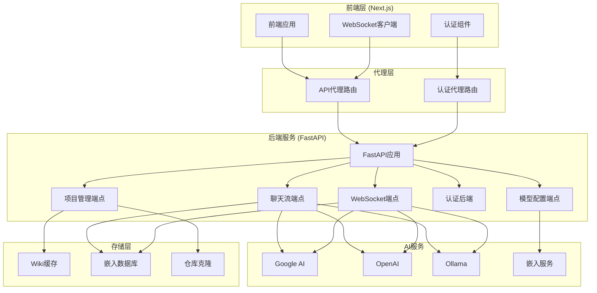
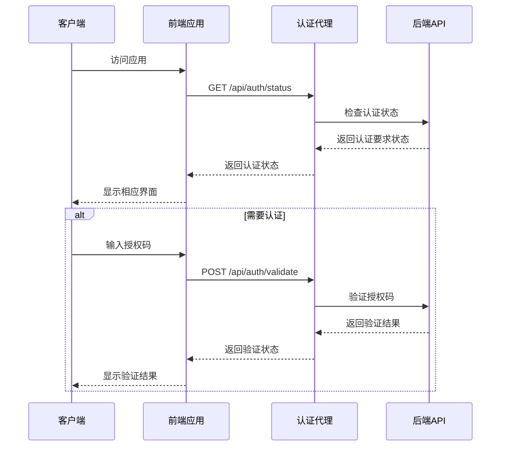
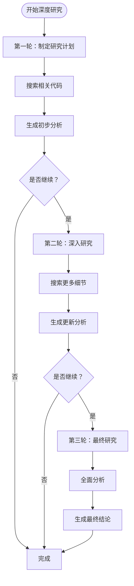
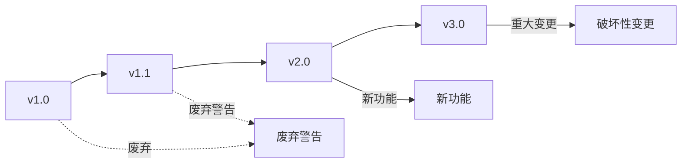

# API 参考

<cite>
**本文档中引用的文件**
- [api/api.py](file://api/api.py)
- [api/websocket_wiki.py](file://api/websocket_wiki.py)
- [src/app/api/chat/stream/route.ts](file://src/app/api/chat/stream/route.ts)
- [src/app/api/models/config/route.ts](file://src/app/api/models/config/route.ts)
- [src/app/api/wiki/projects/route.ts](file://src/app/api/wiki/projects/route.ts)
- [src/app/api/auth/status/route.ts](file://src/app/api/auth/status/route.ts)
- [src/app/api/auth/validate/route.ts](file://src/app/api/auth/validate/route.ts)
- [src/utils/websocketClient.ts](file://src/utils/websocketClient.ts)
- [api/config.py](file://api/config.py)
- [api/main.py](file://api/main.py)
- [README.md](file://README.md)
</cite>

## 目录
1. [简介](#简介)
2. [API架构概览](#api架构概览)
3. [认证机制](#认证机制)
4. [REST API端点](#rest-api端点)
5. [WebSocket接口](#websocket接口)
6. [错误处理](#错误处理)
7. [速率限制与安全](#速率限制与安全)
8. [API版本控制](#api版本控制)
9. [使用示例](#使用示例)
10. [故障排除](#故障排除)

## 简介

DeepWiki-Open是一个基于FastAPI和Next.js的现代化API系统，提供智能代码仓库分析和Wiki生成功能。该系统采用前后端分离架构，后端提供REST和WebSocket接口，前端通过代理层访问后端服务。

### 核心特性
- **智能代码分析**：基于AI的代码结构理解和文档生成
- **多模型支持**：支持Google Gemini、OpenAI、OpenRouter、Azure OpenAI和本地Ollama模型
- **RAG增强**：检索增强生成技术提供准确的上下文相关回答
- **实时交互**：WebSocket连接支持流式响应和深度研究功能
- **私有仓库支持**：通过个人访问令牌安全访问私有仓库

## API架构概览



**图表来源**
- [api/api.py](file://api/api.py#L20-L40)
- [src/app/api/chat/stream/route.ts](file://src/app/api/chat/stream/route.ts#L1-L20)
- [src/utils/websocketClient.ts](file://src/utils/websocketClient.ts#L1-L30)

## 认证机制

### 认证模式配置

系统支持两种认证模式：

1. **禁用认证**：默认模式，无需认证即可使用所有功能
2. **启用认证**：需要提供有效的授权码才能生成Wiki

### 环境变量配置

| 环境变量 | 描述 | 默认值 | 示例 |
|---------|------|--------|------|
| `DEEPWIKI_AUTH_MODE` | 启用认证模式 | `false` | `true`, `1` |
| `DEEPWIKI_AUTH_CODE` | 授权码 | 空字符串 | `secret123` |

### 认证流程



**图表来源**
- [src/app/api/auth/status/route.ts](file://src/app/api/auth/status/route.ts#L5-L23)
- [src/app/api/auth/validate/route.ts](file://src/app/api/auth/validate/route.ts#L5-L26)

**章节来源**
- [api/config.py](file://api/config.py#L43-L47)
- [src/app/api/auth/status/route.ts](file://src/app/api/auth/status/route.ts#L1-L32)
- [src/app/api/auth/validate/route.ts](file://src/app/api/auth/validate/route.ts#L1-L35)

## REST API端点

### 聊天流式响应

#### POST /api/chat/stream

**功能**：通过HTTP流式响应提供聊天完成功能

**请求头**：
- `Content-Type: application/json`
- `Accept: text/event-stream`

**请求体结构**：
```json
{
  "repo_url": "https://github.com/example/repo",
  "messages": [
    {
      "role": "user",
      "content": "请解释这个函数的功能"
    }
  ],
  "filePath": "src/main.py",
  "token": "your_github_token",
  "type": "github",
  "provider": "google",
  "model": "gemini-2.5-flash",
  "language": "zh",
  "excluded_dirs": "tests,docs",
  "excluded_files": "*.md,*.txt",
  "included_dirs": "src,lib",
  "included_files": "*.py,*.js"
}
```

**响应格式**：SSE（Server-Sent Events）流式响应

**错误码**：
- `400 Bad Request`：请求参数无效
- `401 Unauthorized`：认证失败
- `500 Internal Server Error`：服务器内部错误

### 模型配置获取

#### GET /api/models/config

**功能**：获取可用的模型提供商和模型列表

**请求头**：
- `Accept: application/json`

**响应格式**：
```json
{
  "providers": [
    {
      "id": "google",
      "name": "Google",
      "models": [
        {
          "id": "gemini-2.5-flash",
          "name": "Gemini 2.5 Flash"
        }
      ],
      "supportsCustomModel": true
    }
  ],
  "defaultProvider": "google"
}
```

**错误码**：
- `500 Internal Server Error`：配置加载失败

### Wiki项目管理

#### GET /api/wiki/projects

**功能**：获取用户已处理的项目列表

**请求头**：
- `Content-Type: application/json`

**响应格式**：
```json
[
  {
    "id": "deepwiki_cache_github_owner_repo_en.json",
    "owner": "owner",
    "repo": "repo",
    "name": "owner/repo",
    "repo_type": "github",
    "submittedAt": 1640995200000,
    "language": "en"
  }
]
```

#### DELETE /api/wiki/projects

**功能**：删除指定项目的Wiki缓存

**请求体**：
```json
{
  "owner": "owner",
  "repo": "repo",
  "repo_type": "github",
  "language": "en"
}
```

**响应格式**：
```json
{
  "message": "Project deleted successfully"
}
```

**错误码**：
- `400 Bad Request`：请求体格式错误
- `401 Unauthorized`：认证失败
- `404 Not Found`：项目未找到
- `500 Internal Server Error`：删除失败

### 认证端点

#### GET /api/auth/status

**功能**：检查是否需要认证

**响应格式**：
```json
{
  "auth_required": false
}
```

#### POST /api/auth/validate

**功能**：验证授权码

**请求体**：
```json
{
  "code": "your_auth_code"
}
```

**响应格式**：
```json
{
  "success": true
}
```

**章节来源**
- [api/api.py](file://api/api.py#L149-L226)
- [src/app/api/chat/stream/route.ts](file://src/app/api/chat/stream/route.ts#L1-L113)
- [src/app/api/models/config/route.ts](file://src/app/api/models/config/route.ts#L1-L49)
- [src/app/api/wiki/projects/route.ts](file://src/app/api/wiki/projects/route.ts#L1-L104)

## WebSocket接口

### WebSocket连接建立

#### 连接URL
```
ws://localhost:8001/ws/chat
```

#### 消息协议

**客户端发送消息**：
```json
{
  "repo_url": "https://github.com/example/repo",
  "messages": [
    {
      "role": "user",
      "content": "请分析这个项目的架构"
    }
  ],
  "filePath": "src/main.py",
  "token": "your_github_token",
  "type": "github",
  "provider": "google",
  "model": "gemini-2.5-flash",
  "language": "zh",
  "excluded_dirs": "tests,docs",
  "excluded_files": "*.md,*.txt",
  "included_dirs": "src,lib",
  "included_files": "*.py,*.js"
}
```

**服务端推送消息类型**：

1. **研究计划** (`plan`)
   ```json
   {
     "type": "plan",
     "data": {
       "content": "开始分析项目架构，重点关注核心模块..."
     }
   }
   ```

2. **搜索进度** (`search`)
   ```json
   {
     "type": "search",
     "data": {
       "content": "正在检索相关代码文档..."
     }
   }
   ```

3. **写作进度** (`write`)
   ```json
   {
     "type": "write",
     "data": {
       "content": "正在生成架构分析报告..."
     }
   }
   ```

4. **完成通知** (`complete`)
   ```json
   {
     "type": "complete",
     "data": {
       "content": "分析完成！以下是项目架构总结..."
     }
   }
   ```

### 深度研究功能

当消息中包含 `[DEEP RESEARCH]` 标记时，系统会启动多轮研究过程：



**图表来源**
- [api/websocket_wiki.py](file://api/websocket_wiki.py#L146-L177)

### WebSocket客户端实现

```typescript
// 创建WebSocket连接
const ws = new WebSocket('ws://localhost:8001/ws/chat');

// 发送聊天请求
ws.send(JSON.stringify({
  repo_url: 'https://github.com/example/repo',
  messages: [{ role: 'user', content: '分析项目' }],
  provider: 'google',
  language: 'zh'
}));

// 处理消息
ws.onmessage = (event) => {
  console.log('收到消息:', event.data);
};

// 错误处理
ws.onerror = (error) => {
  console.error('WebSocket错误:', error);
};

// 连接关闭
ws.onclose = () => {
  console.log('连接已关闭');
};
```

**章节来源**
- [api/websocket_wiki.py](file://api/websocket_wiki.py#L52-L770)
- [src/utils/websocketClient.ts](file://src/utils/websocketClient.ts#L1-L86)

## 错误处理

### HTTP状态码

| 状态码 | 描述 | 场景 |
|--------|------|------|
| `200 OK` | 请求成功 | 所有成功的API调用 |
| `400 Bad Request` | 请求参数错误 | 缺少必填参数或参数格式错误 |
| `401 Unauthorized` | 认证失败 | 授权码无效或缺少认证 |
| `404 Not Found` | 资源不存在 | 缓存文件或项目未找到 |
| `500 Internal Server Error` | 服务器内部错误 | 内部逻辑错误或外部服务异常 |

### 错误响应格式

```json
{
  "error": "错误描述信息",
  "details": "详细错误信息（可选）",
  "timestamp": "2024-01-01T12:00:00Z"
}
```

### 常见错误及解决方案

1. **API密钥配置错误**
   - 确保环境变量正确设置
   - 检查API密钥的有效性
   - 验证网络连接

2. **仓库访问权限问题**
   - 提供正确的个人访问令牌
   - 检查令牌权限范围
   - 验证仓库URL格式

3. **嵌入模型不一致**
   - 清除现有缓存重新生成
   - 使用相同的嵌入模型
   - 检查模型配置

**章节来源**
- [api/api.py](file://api/api.py#L275-L282)
- [src/app/api/wiki/projects/route.ts](file://src/app/api/wiki/projects/route.ts#L75-L98)

## 速率限制与安全

### 安全最佳实践

1. **API密钥保护**
   - 不要在客户端代码中硬编码API密钥
   - 使用环境变量存储敏感信息
   - 定期轮换API密钥

2. **认证机制**
   - 启用认证模式限制访问
   - 设置强密码策略
   - 实施会话超时机制

3. **输入验证**
   - 验证所有用户输入
   - 过滤危险字符
   - 限制输入长度

4. **CORS配置**
   - 严格控制允许的源
   - 使用HTTPS传输
   - 配置适当的预检请求

### 超时设置

| 组件 | 超时时间 | 说明 |
|------|----------|------|
| WebSocket连接 | 30秒 | 连接建立超时 |
| API请求 | 60秒 | 单个API请求超时 |
| 文件下载 | 300秒 | 大文件下载超时 |
| RAG检索 | 45秒 | 检索操作超时 |

### 性能优化

1. **缓存策略**
   - Wiki内容缓存
   - 嵌入向量缓存
   - 模型响应缓存

2. **并发控制**
   - 限制同时进行的研究任务
   - 控制API调用频率
   - 实施队列机制

3. **资源管理**
   - 监控内存使用
   - 限制文件大小
   - 控制并发连接数

**章节来源**
- [api/config.py](file://api/config.py#L43-L47)
- [api/websocket_wiki.py](file://api/websocket_wiki.py#L60-L75)

## API版本控制

### 当前版本策略

目前API采用无版本前缀的设计，主要特点：

1. **简单性**：避免复杂的版本管理
2. **向后兼容**：保持现有接口不变
3. **快速迭代**：便于功能快速发布

### 未来扩展计划

如果需要版本控制，建议采用以下策略：



### 版本控制建议

1. **语义化版本**：遵循SemVer规范
2. **渐进式迁移**：提供迁移指南
3. **废弃通知**：提前通知废弃计划
4. **多版本共存**：短期支持多个版本

**章节来源**
- [api/api.py](file://api/api.py#L540-L574)

## 使用示例

### curl命令示例

#### 获取模型配置
```bash
curl -X GET "http://localhost:8001/api/models/config" \
  -H "Accept: application/json"
```

#### 发送聊天请求
```bash
curl -X POST "http://localhost:8001/api/chat/stream" \
  -H "Content-Type: application/json" \
  -H "Accept: text/event-stream" \
  -d '{
    "repo_url": "https://github.com/AsyncFuncAI/deepwiki-open",
    "messages": [{"role": "user", "content": "解释这个项目的架构"}],
    "provider": "google",
    "language": "zh"
  }'
```

#### 获取项目列表
```bash
curl -X GET "http://localhost:8001/api/wiki/projects" \
  -H "Content-Type: application/json"
```

#### 删除项目缓存
```bash
curl -X DELETE "http://localhost:8001/api/wiki/projects?owner=AsyncFuncAI&repo=deepwiki-open&type=github&language=en" \
  -H "Content-Type: application/json"
```

### JavaScript/Fetch示例

#### 获取模型配置
```javascript
async function getModelConfig() {
  try {
    const response = await fetch('/api/models/config', {
      method: 'GET',
      headers: {
        'Accept': 'application/json'
      }
    });
    
    if (!response.ok) {
      throw new Error(`HTTP error! status: ${response.status}`);
    }
    
    const config = await response.json();
    return config;
  } catch (error) {
    console.error('获取模型配置失败:', error);
  }
}
```

#### 发送聊天请求
```javascript
async function sendChatRequest(messages, repoUrl) {
  try {
    const response = await fetch('/api/chat/stream', {
      method: 'POST',
      headers: {
        'Content-Type': 'application/json',
        'Accept': 'text/event-stream'
      },
      body: JSON.stringify({
        repo_url: repoUrl,
        messages: messages,
        provider: 'google',
        language: 'zh'
      })
    });
    
    if (!response.ok) {
      throw new Error(`HTTP error! status: ${response.status}`);
    }
    
    // 处理流式响应
    const reader = response.body.getReader();
    const decoder = new TextDecoder();
    
    while (true) {
      const { done, value } = await reader.read();
      if (done) break;
      
      const chunk = decoder.decode(value);
      console.log('收到数据:', chunk);
    }
  } catch (error) {
    console.error('发送聊天请求失败:', error);
  }
}
```

#### 使用WebSocket
```javascript
// 使用WebSocket客户端
import { createChatWebSocket } from './websocketClient';

const ws = createChatWebSocket(
  {
    repo_url: 'https://github.com/AsyncFuncAI/deepwiki-open',
    messages: [{ role: 'user', content: '分析项目架构' }],
    provider: 'google',
    language: 'zh'
  },
  (message) => {
    console.log('收到消息:', message);
  },
  (error) => {
    console.error('WebSocket错误:', error);
  },
  () => {
    console.log('连接已关闭');
  }
);

// 关闭连接
// ws.close();
```

**章节来源**
- [src/app/api/chat/stream/route.ts](file://src/app/api/chat/stream/route.ts#L8-L113)
- [src/utils/websocketClient.ts](file://src/utils/websocketClient.ts#L43-L86)

## 故障排除

### 常见问题及解决方案

#### 1. API密钥配置问题

**症状**：出现"Missing environment variables"或API密钥验证失败

**解决方案**：
```bash
# 检查环境变量
echo $GOOGLE_API_KEY
echo $OPENAI_API_KEY

# 创建.env文件
echo "GOOGLE_API_KEY=your_google_api_key" > .env
echo "OPENAI_API_KEY=your_openai_api_key" >> .env

# 重启服务
docker-compose down
docker-compose up
```

#### 2. WebSocket连接失败

**症状**：WebSocket连接被拒绝或无法建立

**解决方案**：
```javascript
// 检查连接URL
const wsUrl = 'ws://localhost:8001/ws/chat';

// 添加重试机制
let retries = 0;
const maxRetries = 3;

function connectWithRetry() {
  const ws = new WebSocket(wsUrl);
  
  ws.onopen = () => {
    console.log('WebSocket连接成功');
    retries = 0;
  };
  
  ws.onerror = (error) => {
    console.error('WebSocket错误:', error);
    if (retries < maxRetries) {
      setTimeout(connectWithRetry, 1000 * Math.pow(2, retries++));
    }
  };
}
```

#### 3. 认证问题

**症状**：认证失败或授权码无效

**解决方案**：
```bash
# 检查认证模式
echo $DEEPWIKI_AUTH_MODE

# 设置认证码
export DEEPWIKI_AUTH_CODE="your_secret_code"

# 验证认证状态
curl -X GET "http://localhost:8001/auth/status"
```

#### 4. 性能问题

**症状**：响应缓慢或超时

**解决方案**：
```bash
# 检查日志
tail -f api/logs/application.log

# 监控资源使用
docker stats

# 清理缓存
rm -rf ~/.adalflow/wikicache/*
```

### 调试工具

#### 日志配置
```bash
# 设置日志级别
export LOG_LEVEL=DEBUG
export LOG_FILE_PATH=./debug.log

# 启动调试模式
python -m api.main
```

#### 健康检查
```bash
# 检查服务状态
curl -X GET "http://localhost:8001/health"

# 检查所有端点
curl -X GET "http://localhost:8001/"
```

### 支持资源

1. **官方文档**：查看README.md获取详细说明
2. **GitHub Issues**：报告bug和功能请求
3. **社区支持**：加入Discord讨论群组
4. **API监控**：使用健康检查端点监控服务状态

**章节来源**
- [api/main.py](file://api/main.py#L47-L80)
- [README.md](file://README.md#L615-L652)