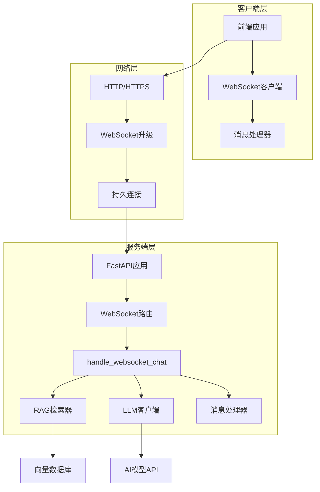
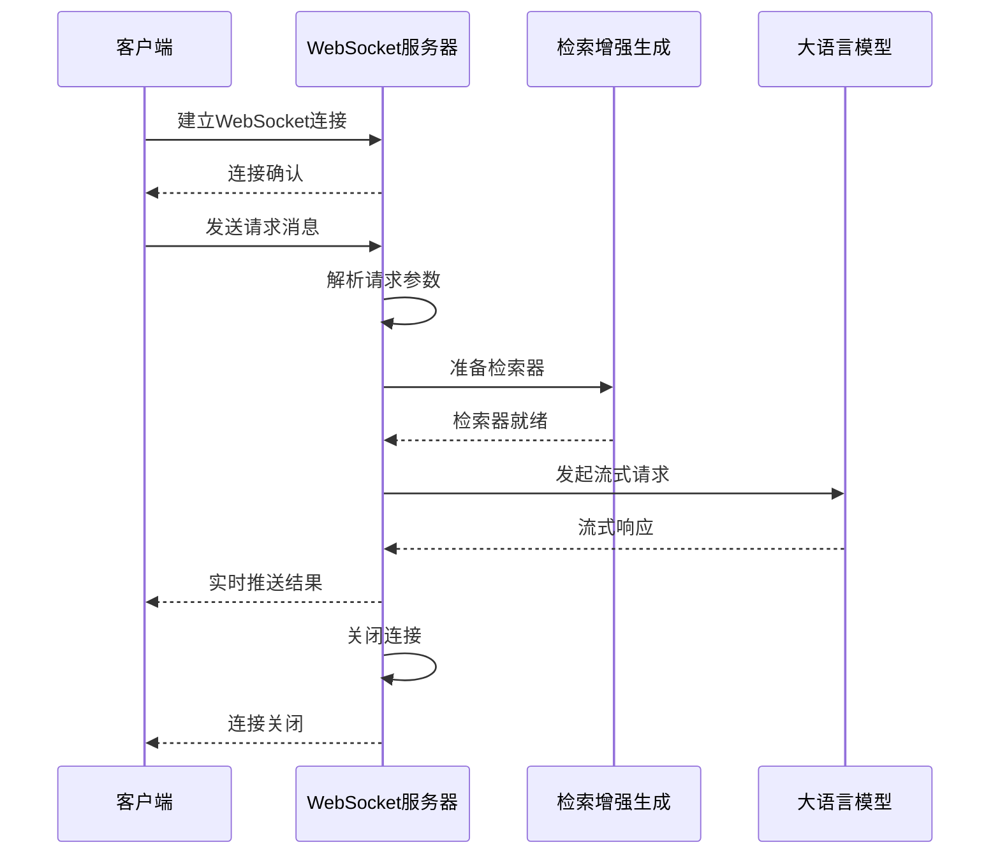
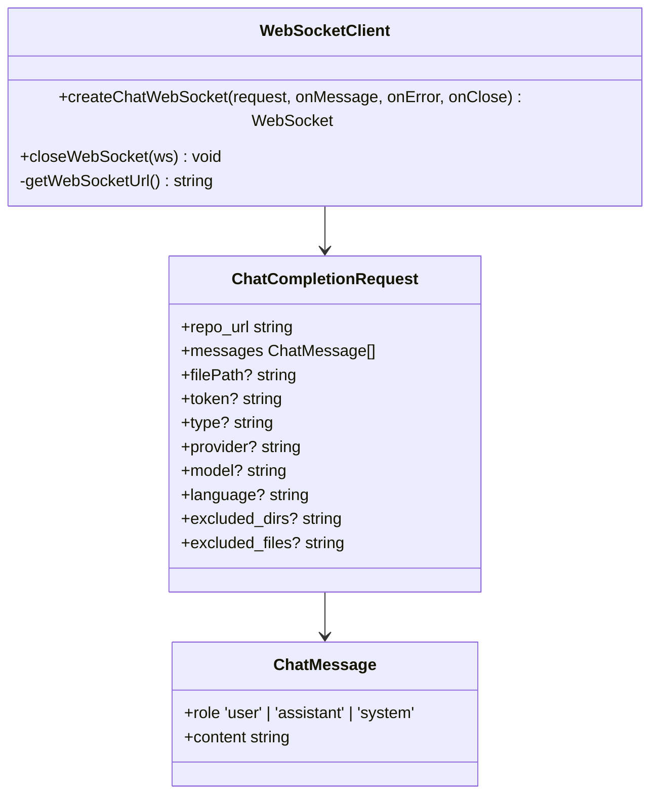
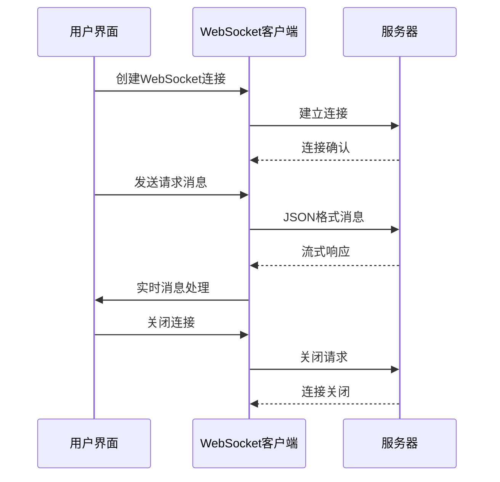
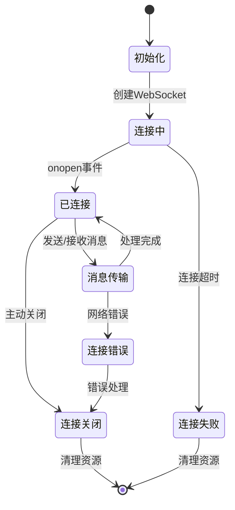

# WebSocket API 文档

<cite>
**本文档中引用的文件**
- [api/websocket_wiki.py](file://api/websocket_wiki.py)
- [src/utils/websocketClient.ts](file://src/utils/websocketClient.ts)
- [api/api.py](file://api/api.py)
- [api/main.py](file://api/main.py)
- [src/components/Ask.tsx](file://src/components/Ask.tsx)
- [src/app/[owner]/[repo]/workshop/page.tsx](file://src/app/[owner]/[repo]/workshop/page.tsx)
- [src/app/[owner]/[repo]/slides/page.tsx](file://src/app/[owner]/[repo]/slides/page.tsx)
- [src/app/[owner]/[repo]/page.tsx](file://src/app/[owner]/[repo]/page.tsx)
- [src/app/api/chat/stream/route.ts](file://src/app/api/chat/stream/route.ts)
- [api/data_pipeline.py](file://api/data_pipeline.py)
</cite>

## 目录
1. [简介](#简介)
2. [WebSocket连接架构](#websocket连接架构)
3. [消息协议规范](#消息协议规范)
4. [深度研究功能](#深度研究功能)
5. [前端WebSocket客户端](#前端websocket客户端)
6. [连接管理与错误处理](#连接管理与错误处理)
7. [性能优化与最佳实践](#性能优化与最佳实践)
8. [故障排除指南](#故障排除指南)

## 简介

deepwiki-open项目实现了基于WebSocket的实时通信机制，用于支持深度研究（DeepResearch）功能。该WebSocket API提供了全双工通信能力，使客户端能够实时接收服务器推送的研究进展信息，并支持多轮对话和复杂的研究流程。

### 核心特性

- **实时通信**：支持双向数据传输，实现实时状态更新
- **深度研究**：提供多轮迭代的研究过程，最多支持5个研究阶段
- **流式响应**：采用流式传输技术，逐步接收生成内容
- **容错机制**：内置重试和降级策略，确保服务可用性
- **多提供商支持**：支持OpenAI、Google、Azure等多种AI模型提供商

## WebSocket连接架构

### 服务器端架构

WebSocket连接通过FastAPI框架的`add_websocket_route`方法注册到`/ws/chat`端点。



**图表来源**
- [api/api.py](file://api/api.py#L400-L401)
- [api/websocket_wiki.py](file://api/websocket_wiki.py#L51-L55)

### 连接建立流程



**图表来源**
- [src/utils/websocketClient.ts](file://src/utils/websocketClient.ts#L43-L85)
- [api/websocket_wiki.py](file://api/websocket_wiki.py#L56-L770)

**章节来源**
- [api/api.py](file://api/api.py#L400-L401)
- [api/websocket_wiki.py](file://api/websocket_wiki.py#L51-L55)

## 消息协议规范

### 请求消息格式

客户端发送的WebSocket消息必须遵循以下JSON结构：

| 字段名 | 类型 | 必需 | 描述 |
|--------|------|------|------|
| `repo_url` | string | 是 | 要查询的仓库URL |
| `messages` | Array[ChatMessage] | 是 | 对话消息数组 |
| `filePath` | string | 否 | 可选的文件路径，用于特定文件上下文 |
| `token` | string | 否 | 私有仓库访问令牌 |
| `type` | string | 否 | 仓库类型（github/gitlab/bitbucket，默认为github） |
| `provider` | string | 否 | 模型提供商（google/openai/openrouter/ollama/azure，默认为google） |
| `model` | string | 否 | 指定的模型名称 |
| `language` | string | 否 | 内容生成语言（默认为en） |
| `excluded_dirs` | string | 否 | 排除目录列表（换行符分隔） |
| `excluded_files` | string | 否 | 排除文件模式列表（换行符分隔） |
| `included_dirs` | string | 否 | 包含目录列表（换行符分隔） |
| `included_files` | string | 否 | 包含文件模式列表（换行符分隔） |

### ChatMessage结构

| 字段名 | 类型 | 必需 | 描述 |
|--------|------|------|------|
| `role` | string | 是 | 角色类型：'user' 或 'assistant' |
| `content` | string | 是 | 消息内容 |

### 深度研究标记

要启用深度研究功能，用户消息中必须包含`[DEEP RESEARCH]`标记：

```typescript
{
  "repo_url": "https://github.com/example/repo",
  "messages": [
    {
      "role": "user",
      "content": "[DEEP RESEARCH] 分析这个项目的架构设计"
    }
  ],
  "provider": "openai",
  "model": "gpt-4",
  "language": "zh"
}
```

### 服务端响应格式

服务端按阶段推送不同类型的消息：

| 阶段类型 | 标识符 | 描述 |
|----------|--------|------|
| 计划阶段 | `'plan'` | 初始研究计划和发现 |
| 搜索阶段 | `'search'` | 检索相关文档和代码 |
| 编写阶段 | `'write'` | 生成详细内容 |
| 完成阶段 | `'complete'` | 研究完成和总结 |

**章节来源**
- [api/websocket_wiki.py](file://api/websocket_wiki.py#L27-L50)
- [src/utils/websocketClient.ts](file://src/utils/websocketClient.ts#L17-L33)

## 深度研究功能

### 研究流程架构

深度研究功能采用多轮迭代的方法，最多支持5个研究阶段：

```mermaid
flowchart TD
A[用户提问] --> B{是否包含[DEEP RESEARCH]标记?}
B --> |否| C[单轮回答]
B --> |是| D[初始化研究]
D --> E[第一轮：研究计划]
E --> F{是否需要继续?}
F --> |是| G[第二轮：深入探索]
G --> H{是否需要继续?}
H --> |是| I[第三轮：细节挖掘]
I --> J{是否需要继续?}
J --> |是| K[第四轮：综合分析]
K --> L{是否需要继续?}
L --> |是| M[第五轮：最终结论]
L --> |否| N[提前完成]
M --> O[生成最终结论]
F --> |否| P[结束研究]
G --> |否| Q[结束研究]
H --> |否| R[结束研究]
I --> |否| S[结束研究]
J --> |否| T[结束研究]
N --> U[返回结果]
O --> V[返回结果]
P --> W[返回结果]
Q --> X[返回结果]
R --> Y[返回结果]
S --> Z[返回结果]
T --> AA[返回结果]
```

**图表来源**
- [api/websocket_wiki.py](file://api/websocket_wiki.py#L145-L177)
- [src/components/Ask.tsx](file://src/components/Ask.tsx#L211-L252)

### 研究阶段详解

#### 第一阶段：研究计划（Plan）
- 创建研究主题和目标
- 识别关键研究领域
- 制定研究路线图
- 输出研究计划文档

#### 第二至四阶段：迭代研究（Updates）
- 在每个阶段深入探索特定方面
- 分析代码模式和架构决策
- 连接不同模块之间的关系
- 逐步完善理解

#### 第五阶段：最终结论（Conclusion）
- 综合所有研究发现
- 提供全面的解答
- 总结关键洞察
- 建议实施建议

### 研究状态管理

前端通过`ResearchStage`接口跟踪研究进度：

```typescript
interface ResearchStage {
  title: string;           // 阶段标题
  content: string;         // 阶段内容
  iteration: number;       // 迭代编号
  type: 'plan' | 'update' | 'conclusion'; // 阶段类型
}
```

**章节来源**
- [api/websocket_wiki.py](file://api/websocket_wiki.py#L247-L346)
- [src/components/Ask.tsx](file://src/components/Ask.tsx#L29-D29)

## 前端WebSocket客户端

### 客户端架构

前端WebSocket客户端封装了连接管理和消息处理逻辑：



**图表来源**
- [src/utils/websocketClient.ts](file://src/utils/websocketClient.ts#L17-L33)
- [src/utils/websocketClient.ts](file://src/utils/websocketClient.ts#L43-L85)

### 连接URL构建

客户端自动根据环境变量构建WebSocket URL：

```typescript
// 获取服务器基础URL
const SERVER_BASE_URL = process.env.SERVER_BASE_URL || 'http://localhost:8001';

// 构建WebSocket URL
const getWebSocketUrl = () => {
  const baseUrl = SERVER_BASE_URL;
  // 替换http://为ws://或https://为wss://
  const wsBaseUrl = baseUrl.replace(/^http/, 'ws');
  return `${wsBaseUrl}/ws/chat`;
};
```

### 消息处理流程



**图表来源**
- [src/utils/websocketClient.ts](file://src/utils/websocketClient.ts#L43-L85)

### 错误处理机制

前端实现了完善的错误处理和降级策略：

1. **连接超时检测**：5秒内未建立连接则触发降级
2. **连接中断恢复**：自动尝试重新连接
3. **HTTP降级**：WebSocket失败时回退到HTTP流式API
4. **错误状态显示**：向用户展示详细的错误信息

**章节来源**
- [src/utils/websocketClient.ts](file://src/utils/websocketClient.ts#L1-L86)
- [src/app/[owner]/[repo]/workshop/page.tsx](file://src/app/[owner]/[repo]/workshop/page.tsx#L318-L385)

## 连接管理与错误处理

### 连接生命周期



### 错误分类与处理

| 错误类型 | 处理策略 | 用户反馈 |
|----------|----------|----------|
| 连接超时 | 自动重试 | 显示"连接超时，请检查网络" |
| 网络中断 | 断线重连 | 显示"网络连接已断开" |
| 服务器错误 | 降级到HTTP | 显示"服务暂时不可用，使用备用方式" |
| 认证失败 | 提示重新登录 | 显示"认证失败，请重新登录" |
| 请求格式错误 | 参数验证 | 显示"请求格式不正确" |

### 超时控制

前端实现了多层次的超时控制：

```typescript
// WebSocket连接超时（5秒）
const timeout = setTimeout(() => {
  reject(new Error('WebSocket connection timeout'));
}, 5000);

// HTTP降级超时（10秒）
const timeout = setTimeout(() => {
  reject(new Error('WebSocket connection timeout'));
}, 10000);
```

**章节来源**
- [src/app/[owner]/[repo]/slides/page.tsx](file://src/app/[owner]/[repo]/slides/page.tsx#L279-L289)
- [src/app/[owner]/[repo]/workshop/page.tsx](file://src/app/[owner]/[repo]/workshop/page.tsx#L342-L354)

## 性能优化与最佳实践

### 连接池管理

为了提高性能，建议实现连接池管理：

```typescript
class WebSocketPool {
  private pool: WebSocket[] = [];
  private maxConnections = 5;
  
  getConnection(): WebSocket {
    // 从池中获取可用连接或创建新连接
    if (this.pool.length > 0) {
      return this.pool.pop()!;
    }
    return this.createConnection();
  }
  
  releaseConnection(ws: WebSocket): void {
    if (this.pool.length < this.maxConnections) {
      this.pool.push(ws);
    } else {
      ws.close();
    }
  }
}
```

### 消息缓冲策略

对于大量数据传输，实现智能缓冲：

```typescript
class MessageBuffer {
  private buffer: string[] = [];
  private batchSize = 1024;
  private flushTimeout: NodeJS.Timeout | null = null;
  
  addMessage(message: string): void {
    this.buffer.push(message);
    
    if (this.buffer.length >= this.batchSize) {
      this.flush();
    } else if (!this.flushTimeout) {
      this.flushTimeout = setTimeout(() => this.flush(), 100);
    }
  }
  
  private flush(): void {
    if (this.flushTimeout) {
      clearTimeout(this.flushTimeout);
      this.flushTimeout = null;
    }
    
    if (this.buffer.length > 0) {
      const messages = this.buffer.join('');
      this.buffer = [];
      // 处理消息
    }
  }
}
```

### 资源清理

确保及时清理资源防止内存泄漏：

```typescript
// 组件卸载时清理
useEffect(() => {
  return () => {
    closeWebSocket(webSocketRef.current);
    // 清理定时器
    if (timeoutRef.current) {
      clearTimeout(timeoutRef.current);
    }
  };
}, []);
```

### 监控指标

建议监控以下关键指标：

- 连接成功率
- 平均响应时间
- 错误率分布
- 并发连接数
- 消息传输量

## 故障排除指南

### 常见问题诊断

#### 连接问题

**症状**：WebSocket连接失败或超时
**可能原因**：
- 服务器未启动或端口被占用
- 网络防火墙阻止WebSocket连接
- 代理服务器配置问题

**解决方案**：
1. 检查服务器日志：`tail -f api/logs/app.log`
2. 验证端口可用性：`netstat -an | grep 8001`
3. 检查网络连接：`ping localhost`

#### 消息传输问题

**症状**：消息发送成功但无响应
**可能原因**：
- 服务器负载过高
- 模型API调用失败
- 检索器准备失败

**解决方案**：
1. 查看服务器错误日志
2. 检查模型API密钥配置
3. 验证仓库访问权限

#### 深度研究异常

**症状**：深度研究无法正常进行
**可能原因**：
- 研究迭代次数过多
- 检索结果为空
- 内容生成失败

**解决方案**：
1. 检查输入参数格式
2. 验证仓库内容可访问性
3. 尝试简化查询语句

### 调试工具

#### 开发者工具

使用浏览器开发者工具监控WebSocket通信：

```javascript
// 监控WebSocket事件
ws.onopen = (event) => console.log('连接打开:', event);
ws.onmessage = (event) => console.log('收到消息:', event.data);
ws.onerror = (error) => console.error('WebSocket错误:', error);
ws.onclose = (event) => console.log('连接关闭:', event);
```

#### 日志分析

服务器端日志位置：
- 应用日志：`api/logs/app.log`
- 访问日志：`api/logs/access.log`
- 错误日志：`api/logs/error.log`

### 性能调优

#### 服务器端优化

1. **连接池配置**：调整最大并发连接数
2. **内存管理**：定期清理缓存和临时文件
3. **模型选择**：根据需求选择合适的模型
4. **网络优化**：启用压缩和缓存

#### 客户端优化

1. **连接复用**：避免频繁创建连接
2. **消息批处理**：合并小消息减少网络开销
3. **错误重试**：实现指数退避算法
4. **资源监控**：监控内存和CPU使用情况

**章节来源**
- [api/websocket_wiki.py](file://api/websocket_wiki.py#L760-L770)
- [src/utils/websocketClient.ts](file://src/utils/websocketClient.ts#L77-L86)

## 结论

deepwiki-open的WebSocket API为深度研究功能提供了强大的实时通信能力。通过全双工通信机制，系统能够实时更新研究进度，支持复杂的多轮对话，并提供流畅的用户体验。

### 主要优势

1. **实时性**：即时响应和状态更新
2. **交互性**：支持多轮对话和动态调整
3. **可靠性**：完善的错误处理和降级机制
4. **扩展性**：支持多种AI模型提供商
5. **易用性**：简洁的API设计和丰富的错误提示

### 未来发展方向

1. **连接优化**：实现连接池和负载均衡
2. **安全增强**：添加身份验证和授权机制
3. **监控完善**：集成更详细的性能监控
4. **功能扩展**：支持更多类型的AI任务
5. **用户体验**：改进界面交互和反馈机制

通过持续的优化和改进，WebSocket API将继续为用户提供高质量的深度研究体验。