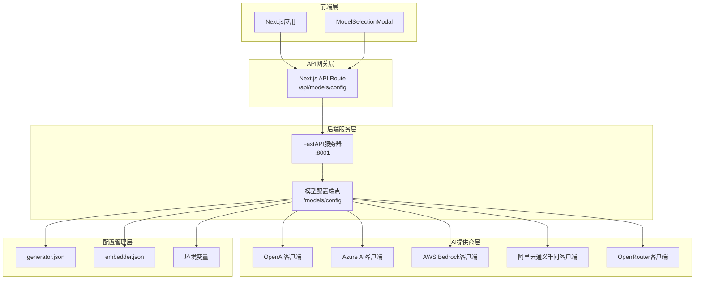
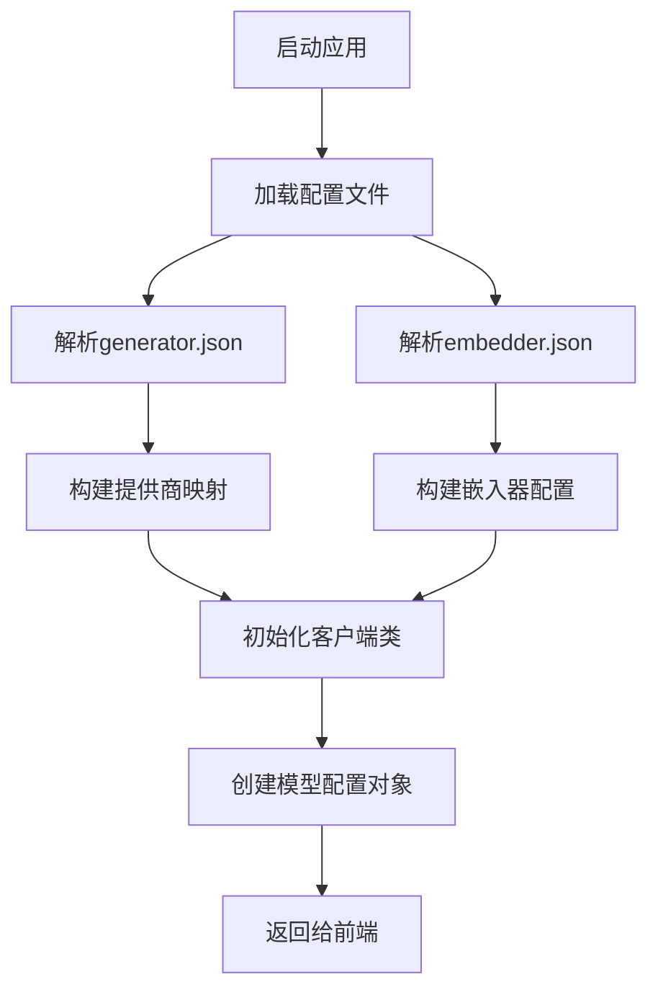
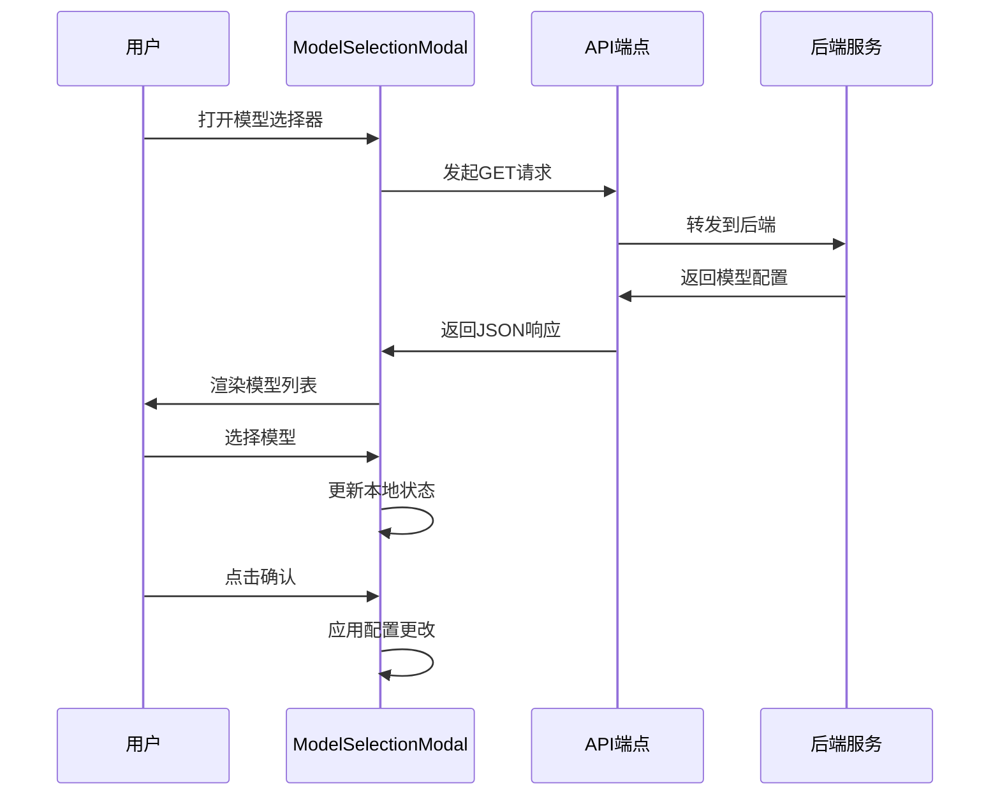

# 模型配置API

<cite>
**本文档引用的文件**
- [src/app/api/models/config/route.ts](file://src/app/api/models/config/route.ts)
- [api/api.py](file://api/api.py)
- [api/config.py](file://api/config.py)
- [api/config/generator.json](file://api/config/generator.json)
- [api/config/embedder.json](file://api/config/embedder.json)
- [api/openai_client.py](file://api/openai_client.py)
- [api/azureai_client.py](file://api/azureai_client.py)
- [api/bedrock_client.py](file://api/bedrock_client.py)
- [api/dashscope_client.py](file://api/dashscope_client.py)
- [api/openrouter_client.py](file://api/openrouter_client.py)
- [src/components/ModelSelectionModal.tsx](file://src/components/ModelSelectionModal.tsx)
</cite>

## 目录
1. [简介](#简介)
2. [API架构概览](#api架构概览)
3. [后端模型配置系统](#后端模型配置系统)
4. [前端模型选择组件](#前端模型选择组件)
5. [配置文件详解](#配置文件详解)
6. [环境变量配置](#环境变量配置)
7. [API响应格式](#api响应格式)
8. [使用示例](#使用示例)
9. [故障排除指南](#故障排除指南)

## 简介

模型配置API是deepwiki-open项目中的核心组件，负责聚合和管理多个AI提供商的模型配置信息。该API为前端提供了统一的模型选择界面，支持OpenAI、Azure AI、AWS Bedrock、阿里云通义千问、OpenRouter等多个AI服务提供商的模型列表。

## API架构概览



**图表来源**
- [src/app/api/models/config/route.ts](file://src/app/api/models/config/route.ts#L1-L49)
- [api/api.py](file://api/api.py#L167-L208)

## 后端模型配置系统

### 核心实现

模型配置API的核心实现在两个主要文件中：

#### 前端Next.js代理路由

[src/app/api/models/config/route.ts](file://src/app/api/models/config/route.ts#L1-L49) 实现了前端到后端的代理路由，负责将前端请求转发到后端服务并处理响应。

#### 后端FastAPI端点

[api/api.py](file://api/api.py#L167-L208) 中定义了实际的模型配置端点，该端点从配置文件中读取模型信息并返回标准化的响应格式。

### 配置加载机制

系统通过以下流程加载和组织模型配置：



**图表来源**
- [api/config.py](file://api/config.py#L307-L388)
- [api/config/generator.json](file://api/config/generator.json#L1-L200)

**章节来源**
- [src/app/api/models/config/route.ts](file://src/app/api/models/config/route.ts#L1-L49)
- [api/api.py](file://api/api.py#L167-L208)
- [api/config.py](file://api/config.py#L307-L388)

## 前端模型选择组件

### ModelSelectionModal组件

[ModelSelectionModal.tsx](file://src/components/ModelSelectionModal.tsx#L1-L260) 是用户界面的核心组件，提供了直观的模型选择界面。

#### 组件功能特性

- **多提供商支持**：支持Google、OpenAI、Azure、AWS Bedrock、阿里云通义千问、OpenRouter等提供商
- **自定义模型**：允许用户输入自定义模型名称
- **上下文长度显示**：显示每个模型的最大上下文长度
- **流式支持标记**：标识支持流式响应的模型
- **配置持久化**：将用户选择保存到应用状态

#### 用户交互流程



**图表来源**
- [src/components/ModelSelectionModal.tsx](file://src/components/ModelSelectionModal.tsx#L116-L133)

**章节来源**
- [src/components/ModelSelectionModal.tsx](file://src/components/ModelSelectionModal.tsx#L1-L260)

## 配置文件详解

### generator.json - 主要模型配置

[generator.json](file://api/config/generator.json#L1-L200) 定义了所有支持的AI模型提供商及其配置参数。

#### 支持的提供商

| 提供商 | 默认模型 | 自定义模型支持 | 特殊配置 |
|--------|----------|----------------|----------|
| dashscope | qwen-plus | ✅ | 阿里云通义千问 |
| google | gemini-2.5-flash | ✅ | Google Generative AI |
| openai | gpt-5-nano | ✅ | OpenAI API |
| openrouter | openai/gpt-5-nano | ✅ | 统一访问多个模型 |
| ollama | qwen3:1.7b | ✅ | 本地模型运行 |
| bedrock | anthropic.claude-3-sonnet-20240229-v1:0 | ✅ | AWS Bedrock |
| azure | gpt-4o | ✅ | Azure OpenAI |

#### 模型参数配置

每个模型都支持以下参数配置：

- **temperature**：控制输出随机性（0.0-2.0）
- **top_p**：核采样参数（0.0-1.0）
- **top_k**：Top-K采样参数
- **其他特定参数**：如num_ctx（上下文长度）

### embedder.json - 嵌入器配置

[embedder.json](file://api/config/embedder.json#L1-L34) 配置文本嵌入功能，支持多种嵌入器类型。

#### 嵌入器类型

| 类型 | 默认模型 | 批处理大小 | 特殊用途 |
|------|----------|------------|----------|
| openai | text-embedding-3-small | 500 | OpenAI嵌入器 |
| ollama | nomic-embed-text | - | 本地嵌入器 |
| google | text-embedding-004 | 100 | Google嵌入器 |

**章节来源**
- [api/config/generator.json](file://api/config/generator.json#L1-L200)
- [api/config/embedder.json](file://api/config/embedder.json#L1-L34)

## 环境变量配置

### 必需的API密钥

系统需要以下环境变量来启用各个AI提供商：

| 变量名 | 描述 | 必需 |
|--------|------|------|
| OPENAI_API_KEY | OpenAI API密钥 | ✅ |
| GOOGLE_API_KEY | Google AI API密钥 | ✅ |
| OPENROUTER_API_KEY | OpenRouter API密钥 | ❌ |
| AZURE_OPENAI_API_KEY | Azure OpenAI API密钥 | ❌ |
| AZURE_OPENAI_ENDPOINT | Azure OpenAI端点 | ❌ |
| AZURE_OPENAI_VERSION | Azure OpenAI版本 | ❌ |
| AWS_ACCESS_KEY_ID | AWS访问密钥ID | ❌ |
| AWS_SECRET_ACCESS_KEY | AWS秘密访问密钥 | ❌ |
| AWS_REGION | AWS区域 | ❌ |
| DASHSCOPE_API_KEY | 阿里云API密钥 | ❌ |
| DASHSCOPE_WORKSPACE_ID | 阿里云工作空间ID | ❌ |

### 配置优先级

1. 环境变量
2. 配置文件中的占位符替换
3. 默认值

**章节来源**
- [api/config.py](file://api/config.py#L18-L41)

## API响应格式

### 标准响应结构

模型配置API返回标准化的JSON格式，包含所有可用的模型提供商和其对应的模型列表。

#### 响应示例

```json
{
  "providers": [
    {
      "id": "google",
      "name": "Google",
      "supportsCustomModel": true,
      "models": [
        {
          "id": "gemini-2.5-flash",
          "name": "gemini-2.5-flash"
        },
        {
          "id": "gemini-2.5-flash-lite",
          "name": "gemini-2.5-flash-lite"
        }
      ]
    },
    {
      "id": "openai",
      "name": "OpenAI",
      "supportsCustomModel": true,
      "models": [
        {
          "id": "gpt-5",
          "name": "gpt-5"
        }
      ]
    }
  ],
  "defaultProvider": "google"
}
```

#### 响应字段说明

| 字段 | 类型 | 描述 |
|------|------|------|
| providers | Array | 可用的AI提供商列表 |
| providers[].id | String | 提供商唯一标识符 |
| providers[].name | String | 提供商显示名称 |
| providers[].supportsCustomModel | Boolean | 是否支持自定义模型 |
| providers[].models | Array | 该提供商下的模型列表 |
| providers[].models[].id | String | 模型唯一标识符 |
| providers[].models[].name | String | 模型显示名称 |
| defaultProvider | String | 默认使用的提供商 |

### 错误响应格式

当发生错误时，API会返回适当的HTTP状态码和错误信息：

```json
{
  "error": "Backend service responded with status: 500"
}
```

**章节来源**
- [api/api.py](file://api/api.py#L167-L208)
- [src/app/api/models/config/route.ts](file://src/app/api/models/config/route.ts#L18-L28)

## 使用示例

### curl命令示例

```bash
# 获取模型配置
curl -X GET "http://localhost:3000/api/models/config" \
  -H "Accept: application/json"

# 获取模型配置（带CORS头部）
curl -X GET "http://localhost:3000/api/models/config" \
  -H "Accept: application/json" \
  -H "Origin: http://localhost:3000"
```

### JavaScript调用示例

```javascript
// 使用fetch获取模型配置
async function getModelConfig() {
  try {
    const response = await fetch('/api/models/config');
    
    if (!response.ok) {
      throw new Error(`HTTP error! status: ${response.status}`);
    }
    
    const config = await response.json();
    return config;
  } catch (error) {
    console.error('Error fetching model config:', error);
    return null;
  }
}

// 在React组件中使用
function ModelSelector() {
  const [modelConfig, setModelConfig] = useState(null);
  const [loading, setLoading] = useState(true);
  
  useEffect(() => {
    getModelConfig()
      .then(setModelConfig)
      .finally(() => setLoading(false));
  }, []);
  
  if (loading) return <div>Loading...</div>;
  
  return (
    <select>
      {modelConfig?.providers.map(provider => (
        <optgroup label={provider.name}>
          {provider.models.map(model => (
            <option key={model.id} value={model.id}>
              {model.name}
            </option>
          ))}
        </optgroup>
      ))}
    </select>
  );
}
```

### TypeScript类型定义

```typescript
interface Model {
  id: string;
  name: string;
}

interface Provider {
  id: string;
  name: string;
  supportsCustomModel: boolean;
  models: Model[];
}

interface ModelConfig {
  providers: Provider[];
  defaultProvider: string;
}

// 使用示例
async function getModels(): Promise<ModelConfig> {
  const response = await fetch('/api/models/config');
  return await response.json();
}
```

**章节来源**
- [src/app/api/models/config/route.ts](file://src/app/api/models/config/route.ts#L6-L28)

## 故障排除指南

### 常见问题及解决方案

#### 1. API密钥未配置

**症状**：模型列表为空或返回错误

**解决方案**：
- 检查相应的环境变量是否已正确设置
- 确保API密钥具有正确的权限
- 验证网络连接和防火墙设置

#### 2. CORS跨域问题

**症状**：浏览器控制台显示CORS错误

**解决方案**：
- 确保后端服务已正确配置CORS中间件
- 检查前端请求的Origin头是否匹配
- 在开发环境中临时禁用CORS检查

#### 3. 模型不可用

**症状**：某些模型在列表中但无法使用

**解决方案**：
- 检查模型ID是否正确
- 验证API密钥是否有该模型的访问权限
- 查看提供商的服务状态

#### 4. 性能问题

**症状**：API响应缓慢

**解决方案**：
- 检查网络连接质量
- 考虑添加缓存机制
- 优化配置文件大小

### 调试技巧

#### 启用详细日志

```python
# 在api/logging_config.py中配置
import logging

logging.basicConfig(
    level=logging.DEBUG,
    format='%(asctime)s - %(name)s - %(levelname)s - %(message)s'
)
```

#### 测试API连通性

```bash
# 测试后端服务是否运行
curl -X GET "http://localhost:8001/health"

# 测试模型配置端点
curl -X GET "http://localhost:8001/models/config"
```

**章节来源**
- [src/app/api/models/config/route.ts](file://src/app/api/models/config/route.ts#L29-L35)
- [api/api.py](file://api/api.py#L540-L547)