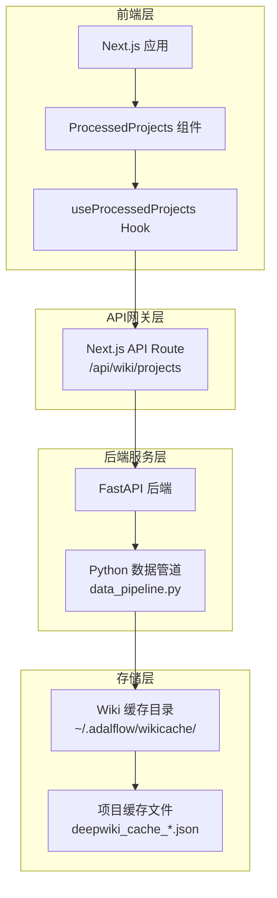
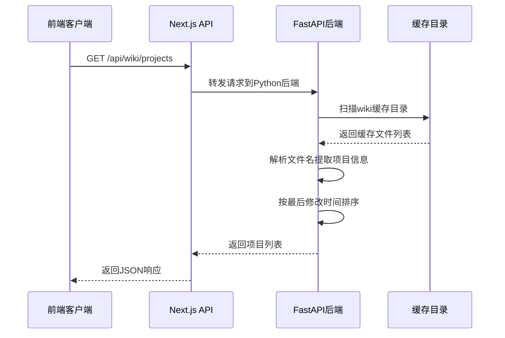
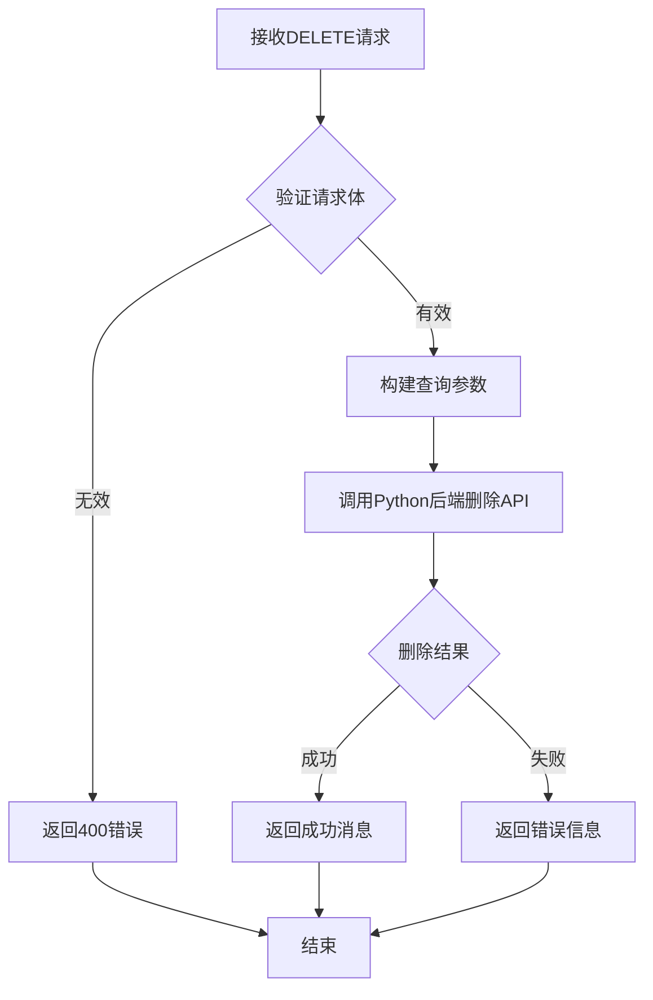
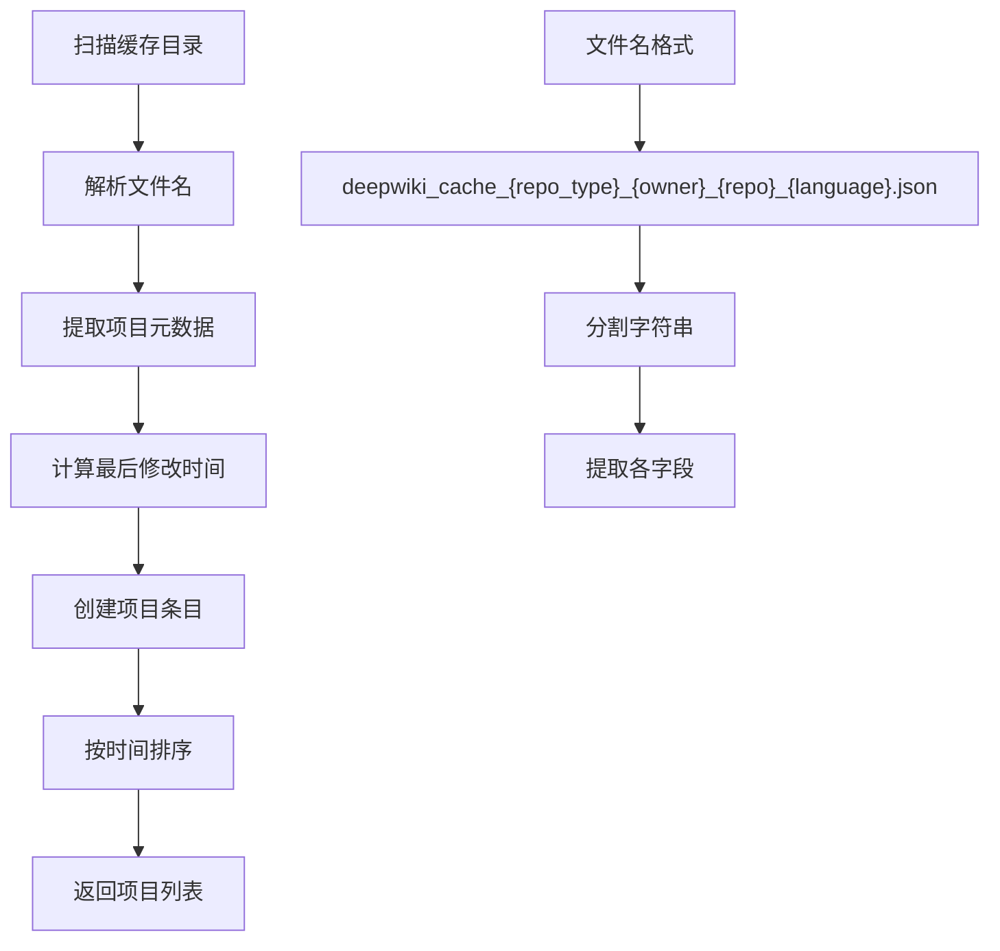
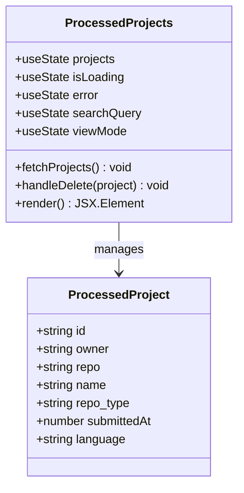
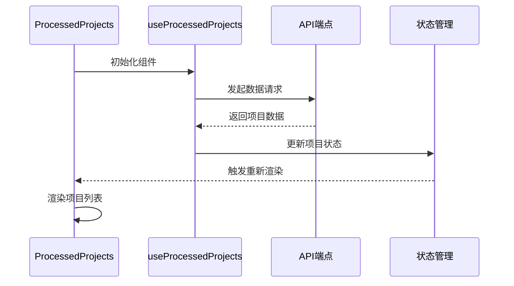
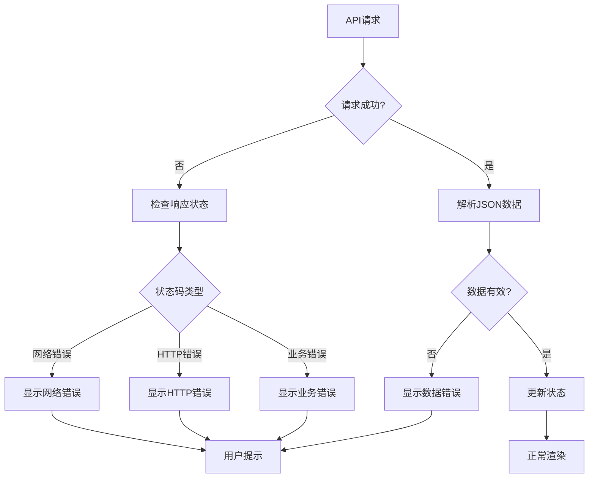

# 维基项目API

<cite>
**本文档中引用的文件**
- [src/app/api/wiki/projects/route.ts](file://src/app/api/wiki/projects/route.ts)
- [src/components/ProcessedProjects.tsx](file://src/components/ProcessedProjects.tsx)
- [src/hooks/useProcessedProjects.ts](file://src/hooks/useProcessedProjects.ts)
- [api/data_pipeline.py](file://api/data_pipeline.py)
- [api/api.py](file://api/api.py)
- [api/main.py](file://api/main.py)
- [api/config.py](file://api/config.py)
- [src/types/repoinfo.tsx](file://src/types/repoinfo.tsx)
- [src/app/wiki/projects/page.tsx](file://src/app/wiki/projects/page.tsx)
</cite>

## 目录
1. [简介](#简介)
2. [项目架构概览](#项目架构概览)
3. [API端点详细分析](#api端点详细分析)
4. [数据流程分析](#数据流程分析)
5. [前端组件集成](#前端组件集成)
6. [错误处理机制](#错误处理机制)
7. [性能考虑](#性能考虑)
8. [故障排除指南](#故障排除指南)
9. [总结](#总结)

## 简介

deepwiki-open项目中的维基项目API为用户提供了一个统一的入口点，用于访问和管理已处理的代码仓库项目。该API通过Next.js的服务器端路由实现了与Python后端的数据交互，为用户界面提供了项目历史记录的展示功能。

该系统的核心价值在于：
- 提供用户已处理项目的元数据列表
- 支持项目搜索和过滤功能
- 实现项目缓存管理和删除操作
- 为用户工作流提供便捷的项目访问入口

## 项目架构概览

系统采用前后端分离架构，通过RESTful API进行通信：



**图表来源**
- [src/app/api/wiki/projects/route.ts](file://src/app/api/wiki/projects/route.ts#L33-L73)
- [api/api.py](file://api/api.py#L577-L634)
- [api/data_pipeline.py](file://api/data_pipeline.py#L703-L800)

## API端点详细分析

### GET /api/wiki/projects

这是系统的核心端点，负责查询和返回用户已处理的代码仓库项目元数据列表。

#### 请求参数
- **无请求参数**：该端点不需要任何查询参数

#### 响应格式
返回一个包含项目信息的数组，每个项目包含以下字段：

| 字段名 | 类型 | 描述 |
|--------|------|------|
| id | string | 文件名（缓存文件名） |
| owner | string | 仓库所有者 |
| repo | string | 仓库名称 |
| name | string | 完整仓库名称（owner/repo格式） |
| repo_type | string | 仓库类型（github/gitlab/bitbucket） |
| submittedAt | number | 最后处理时间戳（毫秒级） |
| language | string | 语言设置 |

#### 实现细节



**图表来源**
- [src/app/api/wiki/projects/route.ts](file://src/app/api/wiki/projects/route.ts#L38-L63)
- [api/api.py](file://api/api.py#L577-L634)

#### 错误处理

API实现了完善的错误处理机制：

1. **网络错误处理**：捕获网络连接失败和超时
2. **后端错误处理**：转发Python后端的错误信息
3. **解析错误处理**：处理JSON解析失败的情况
4. **环境变量配置**：支持动态配置Python后端地址

**章节来源**
- [src/app/api/wiki/projects/route.ts](file://src/app/api/wiki/projects/route.ts#L38-L73)

### DELETE /api/wiki/projects

该端点支持删除特定项目的缓存数据。

#### 请求体结构
```typescript
interface DeleteProjectCachePayload {
  owner: string;
  repo: string;
  repo_type: string;
  language: string;
}
```

#### 删除流程



**图表来源**
- [src/app/api/wiki/projects/route.ts](file://src/app/api/wiki/projects/route.ts#L75-L104)

**章节来源**
- [src/app/api/wiki/projects/route.ts](file://src/app/api/wiki/projects/route.ts#L75-L104)

## 数据流程分析

### 后端数据处理管道

Python后端通过`data_pipeline.py`模块实现完整的数据处理流程：



**图表来源**
- [api/data_pipeline.py](file://api/data_pipeline.py#L583-L629)

### 项目元数据生成

Python后端从缓存文件名中提取项目信息：

| 文件名部分 | 对应字段 | 示例值 |
|------------|----------|--------|
| repo_type | 仓库类型 | github, gitlab, bitbucket |
| owner | 所有者 | AsyncFuncAI |
| repo | 仓库名 | deepwiki-open |
| language | 语言 | en, zh, ja |

**章节来源**
- [api/data_pipeline.py](file://api/data_pipeline.py#L583-L629)

## 前端组件集成

### ProcessedProjects 组件

前端组件提供了丰富的用户交互功能：



**图表来源**
- [src/components/ProcessedProjects.tsx](file://src/components/ProcessedProjects.tsx#L8-L16)

### 数据获取和状态管理

组件使用React Hooks实现数据获取和状态管理：



**图表来源**
- [src/hooks/useProcessedProjects.ts](file://src/hooks/useProcessedProjects.ts#L13-L46)

### 用户界面功能

前端组件提供了以下核心功能：

1. **项目搜索**：支持按名称、所有者、仓库或类型搜索
2. **视图切换**：卡片视图和列表视图两种显示模式
3. **项目删除**：确认对话框确保操作安全
4. **实时加载**：显示加载状态和错误信息

**章节来源**
- [src/components/ProcessedProjects.tsx](file://src/components/ProcessedProjects.tsx#L56-L271)

## 错误处理机制

### 前端错误处理

前端实现了多层次的错误处理：



**图表来源**
- [src/app/api/wiki/projects/route.ts](file://src/app/api/wiki/projects/route.ts#L48-L73)
- [src/components/ProcessedProjects.tsx](file://src/components/ProcessedProjects.tsx#L60-L75)

### 后端错误处理

Python后端实现了详细的日志记录和错误报告：

1. **文件系统错误**：目录不存在、权限问题
2. **解析错误**：文件名格式不正确
3. **系统错误**：磁盘空间不足、I/O异常
4. **HTTP错误**：返回适当的HTTP状态码

**章节来源**
- [api/api.py](file://api/api.py#L577-L634)

## 性能考虑

### 缓存策略

系统采用了多层缓存策略：

1. **本地缓存**：前端组件缓存项目列表
2. **服务器缓存**：Python后端缓存项目元数据
3. **文件系统缓存**：基于文件系统的持久化缓存

### 异步处理

为了提高性能，系统使用了异步处理：

- 使用`asyncio.to_thread()`处理阻塞的文件系统操作
- WebSocket连接用于实时通信
- 并发请求处理多个项目

### 数据优化

- 只加载必要的项目信息
- 按最后修改时间排序，优先显示最新项目
- 支持分页和搜索过滤

## 故障排除指南

### 常见问题及解决方案

#### 1. API连接失败
**症状**：前端显示"Failed to connect to the Python backend"错误
**原因**：Python后端未启动或网络连接问题
**解决方案**：
- 检查Python后端是否正在运行
- 验证环境变量`PYTHON_BACKEND_HOST`
- 检查防火墙设置

#### 2. 项目列表为空
**症状**：显示"没有项目找到"消息
**原因**：缓存目录不存在或没有有效的缓存文件
**解决方案**：
- 检查缓存目录路径：`~/.adalflow/wikicache/`
- 确认有符合格式的缓存文件
- 检查文件权限

#### 3. 删除操作失败
**症状**：删除项目时出现错误
**原因**：文件权限问题或缓存文件不存在
**解决方案**：
- 检查文件系统权限
- 确认缓存文件存在
- 验证认证码（如果启用）

### 调试技巧

1. **查看浏览器开发者工具**：检查网络请求和响应
2. **检查Python后端日志**：查看详细的错误信息
3. **验证环境变量**：确保所有必需的环境变量已正确设置
4. **测试直接API调用**：使用curl或Postman测试API端点

**章节来源**
- [src/app/api/wiki/projects/route.ts](file://src/app/api/wiki/projects/route.ts#L48-L73)
- [api/api.py](file://api/api.py#L577-L634)

## 总结

deepwiki-open的维基项目API提供了一个完整、可靠的系统，用于管理用户已处理的代码仓库项目。该系统具有以下特点：

### 核心优势

1. **统一的项目入口**：为用户提供了便捷的项目访问方式
2. **强大的搜索功能**：支持多种维度的项目筛选和搜索
3. **可靠的数据管理**：完善的缓存和错误处理机制
4. **良好的用户体验**：直观的界面设计和流畅的操作体验

### 技术亮点

1. **前后端分离架构**：清晰的职责划分和良好的可维护性
2. **异步处理机制**：高效的资源利用和响应性能
3. **类型安全设计**：完整的TypeScript类型定义
4. **国际化支持**：灵活的消息系统支持多语言

### 应用场景

该API特别适用于：
- 代码库文档生成后的项目管理
- 多语言项目的统一管理
- 团队协作中的知识库维护
- 个人知识库的组织和检索

通过这个API，用户可以轻松地回顾和管理他们之前处理过的项目，为后续的工作提供便利的参考入口。