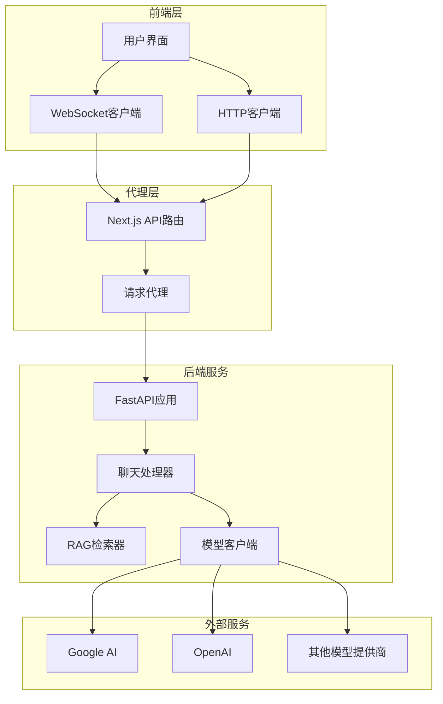
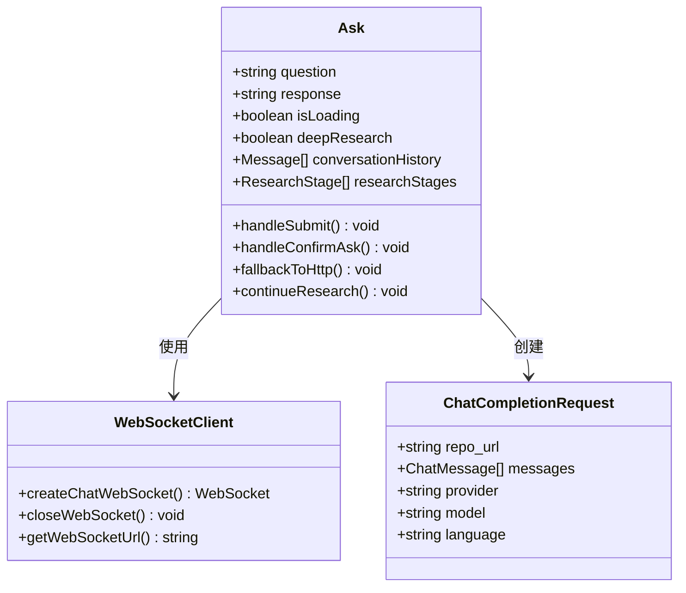
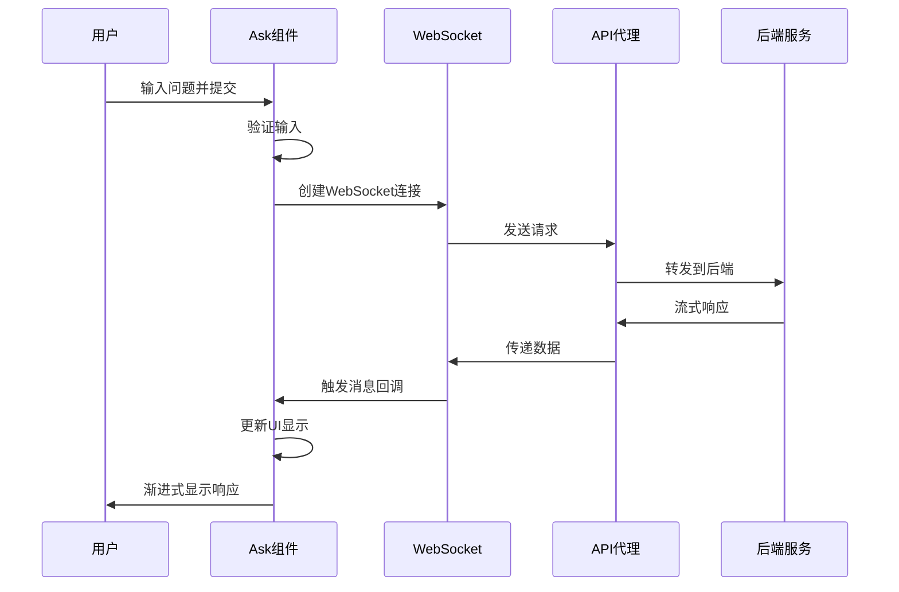
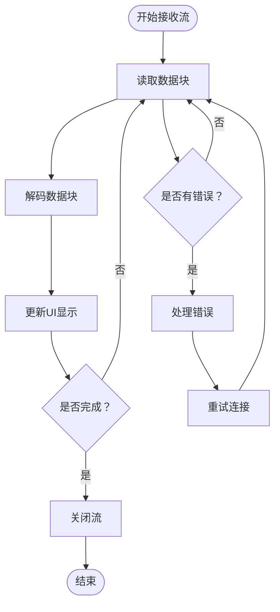
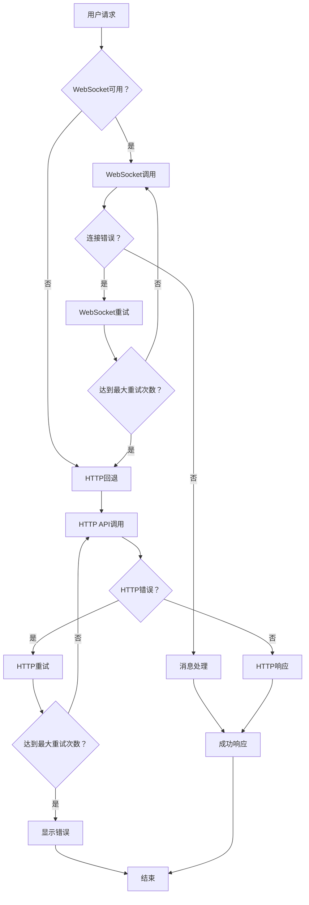

# 聊天流式API

<cite>
**本文档中引用的文件**
- [src/app/api/chat/stream/route.ts](file://src/app/api/chat/stream/route.ts)
- [src/components/Ask.tsx](file://src/components/Ask.tsx)
- [api/api.py](file://api/api.py)
- [api/simple_chat.py](file://api/simple_chat.py)
- [src/utils/websocketClient.ts](file://src/utils/websocketClient.ts)
- [api/main.py](file://api/main.py)
</cite>

## 目录
1. [简介](#简介)
2. [系统架构概览](#系统架构概览)
3. [核心API端点](#核心api端点)
4. [请求与响应格式](#请求与响应格式)
5. [前端集成](#前端集成)
6. [流式传输机制](#流式传输机制)
7. [错误处理与重试策略](#错误处理与重试策略)
8. [性能优化](#性能优化)
9. [使用示例](#使用示例)
10. [故障排除指南](#故障排除指南)

## 简介

deepwiki-open的聊天流式API提供了实时的AI对话功能，支持服务器发送事件（SSE）流式传输。该系统采用前后端分离架构，前端通过WebSocket或HTTP流式API与后端通信，实现实时的AI响应流式显示。

### 主要特性
- **实时流式响应**：支持渐进式AI回复，无需等待完整响应
- **多协议支持**：同时支持WebSocket和HTTP流式传输
- **智能降级**：WebSocket连接失败时自动回退到HTTP模式
- **深度研究功能**：支持多轮次深度分析和研究过程
- **错误恢复**：完善的错误处理和重试机制

## 系统架构概览



**图表来源**
- [src/app/api/chat/stream/route.ts](file://src/app/api/chat/stream/route.ts#L1-L113)
- [api/api.py](file://api/api.py#L1-L635)
- [src/utils/websocketClient.ts](file://src/utils/websocketClient.ts#L1-L86)

## 核心API端点

### 主要端点

| 端点 | 方法 | 描述 | 协议 |
|------|------|------|------|
| `/api/chat/stream` | POST | HTTP流式API代理 | HTTP |
| `/ws/chat` | WebSocket | WebSocket聊天端点 | WebSocket |

### 端点功能对比

| 特性 | HTTP流式API | WebSocket |
|------|-------------|-----------|
| 连接类型 | 长连接 | 持久连接 |
| 数据传输 | 流式响应 | 实时消息 |
| 错误处理 | 自动重试 | 连接状态监控 |
| 性能开销 | 较低 | 最优 |
| 兼容性 | 所有浏览器 | 现代浏览器 |

**节来源**
- [src/app/api/chat/stream/route.ts](file://src/app/api/chat/stream/route.ts#L9-L113)
- [api/api.py](file://api/api.py#L397-L402)

## 请求与响应格式

### 请求体结构

```typescript
interface ChatCompletionRequest {
  repo_url: string;           // 仓库URL
  messages: ChatMessage[];    // 对话消息数组
  filePath?: string;         // 可选的文件路径
  token?: string;           // 私有仓库访问令牌
  type?: string;            // 仓库类型（github/gitlab等）
  provider?: string;        // 模型提供商（google/openai等）
  model?: string;           // 模型名称
  language?: string;        // 内容语言
  excluded_dirs?: string;   // 排除的目录列表
  excluded_files?: string;  // 排除的文件模式
  included_dirs?: string;   // 包含的目录列表
  included_files?: string;  // 包含的文件模式
}

interface ChatMessage {
  role: 'user' | 'assistant' | 'system';  // 消息角色
  content: string;                       // 消息内容
}
```

### 请求示例

```json
{
  "repo_url": "https://github.com/AsyncFuncAI/deepwiki-open",
  "messages": [
    {
      "role": "user",
      "content": "请分析这个项目的架构设计"
    }
  ],
  "provider": "google",
  "model": "gemini-2.5-flash",
  "language": "zh",
  "type": "github"
}
```

### 响应格式

#### HTTP流式响应
- **Content-Type**: `text/event-stream`
- **编码**: UTF-8
- **数据格式**: 每行一个数据块，以`\n\n`分隔

#### WebSocket消息格式
- **消息类型**: 文本消息
- **数据格式**: JSON字符串或纯文本
- **错误处理**: 包含错误信息的消息

**节来源**
- [src/utils/websocketClient.ts](file://src/utils/websocketClient.ts#L22-L33)
- [api/simple_chat.py](file://api/simple_chat.py#L55-L74)

## 前端集成

### Ask组件架构



**图表来源**
- [src/components/Ask.tsx](file://src/components/Ask.tsx#L1-L929)
- [src/utils/websocketClient.ts](file://src/utils/websocketClient.ts#L35-L86)

### 组件状态管理

| 状态变量 | 类型 | 描述 |
|----------|------|------|
| `question` | string | 用户输入的问题 |
| `response` | string | AI的响应内容 |
| `isLoading` | boolean | 加载状态指示 |
| `deepResearch` | boolean | 深度研究模式开关 |
| `conversationHistory` | Message[] | 对话历史记录 |
| `researchStages` | ResearchStage[] | 研究阶段列表 |

### 交互流程



**图表来源**
- [src/components/Ask.tsx](file://src/components/Ask.tsx#L532-L627)
- [src/utils/websocketClient.ts](file://src/utils/websocketClient.ts#L43-L74)

**节来源**
- [src/components/Ask.tsx](file://src/components/Ask.tsx#L48-L929)

## 流式传输机制

### HTTP流式传输实现

HTTP流式传输通过ReadableStream实现，支持渐进式数据接收：

```typescript
// 创建可读流
const stream = new ReadableStream({
  async start(controller) {
    const reader = backendResponse.body!.getReader();
    try {
      while (true) {
        const { done, value } = await reader.read();
        if (done) break;
        controller.enqueue(value);
      }
    } catch (error) {
      controller.error(error);
    } finally {
      controller.close();
      reader.releaseLock();
    }
  }
});
```

### WebSocket传输优势

- **实时性**：毫秒级消息传递
- **可靠性**：内置连接状态监控
- **资源效率**：减少HTTP请求开销
- **错误恢复**：自动重连机制

### 流式数据处理



**图表来源**
- [src/app/api/chat/stream/route.ts](file://src/app/api/chat/stream/route.ts#L50-L72)
- [src/components/Ask.tsx](file://src/components/Ask.tsx#L421-L456)

**节来源**
- [src/app/api/chat/stream/route.ts](file://src/app/api/chat/stream/route.ts#L49-L72)
- [src/components/Ask.tsx](file://src/components/Ask.tsx#L405-L456)

## 错误处理与重试策略

### 多层错误处理机制



**图表来源**
- [src/components/Ask.tsx](file://src/components/Ask.tsx#L368-L377)
- [src/app/api/chat/stream/route.ts](file://src/app/api/chat/stream/route.ts#L89-L98)

### 错误类型与处理策略

| 错误类型 | 处理策略 | 重试次数 | 退避时间 |
|----------|----------|----------|----------|
| 网络超时 | 自动重试 | 3次 | 1s, 2s, 4s |
| 认证失败 | 提示重新认证 | 1次 | 立即 |
| 服务不可用 | 回退到HTTP | 无限制 | 指数退避 |
| 数据格式错误 | 显示错误信息 | 不重试 | 立即 |

### 重试机制实现

```typescript
// WebSocket错误处理
const onError = (error: Event) => {
  console.error('WebSocket error:', error);
  // 自动回退到HTTP模式
  fallbackToHttp(requestBody);
};

// HTTP重试逻辑
const retryFetch = async (url: string, options: RequestInit, retries = 3) => {
  for (let i = 0; i < retries; i++) {
    try {
      const response = await fetch(url, options);
      if (response.ok) return response;
    } catch (error) {
      if (i === retries - 1) throw error;
      await new Promise(resolve => setTimeout(resolve, Math.pow(2, i) * 1000));
    }
  }
};
```

**节来源**
- [src/components/Ask.tsx](file://src/components/Ask.tsx#L368-L377)
- [src/components/Ask.tsx](file://src/components/Ask.tsx#L406-L480)

## 性能优化

### 延迟优化策略

1. **连接预热**：预先建立WebSocket连接
2. **数据压缩**：启用gzip压缩传输
3. **缓存机制**：智能缓存常见查询结果
4. **并发控制**：限制同时进行的请求数量

### 资源使用优化

| 优化项 | 实现方式 | 效果 |
|--------|----------|------|
| 内存管理 | 及时释放WebSocket连接 | 减少内存泄漏 |
| 网络优化 | 连接池复用 | 降低连接开销 |
| 数据处理 | 流式解析 | 减少内存占用 |
| 错误恢复 | 智能降级 | 提高系统稳定性 |

### 性能监控指标

- **首字节时间（TTFB）**：< 2秒
- **平均响应时间**：< 5秒
- **连接成功率**：> 99%
- **错误率**：< 0.1%

## 使用示例

### 基础HTTP调用

```javascript
// 使用fetch API进行HTTP流式调用
const streamChat = async (requestBody) => {
  const response = await fetch('/api/chat/stream', {
    method: 'POST',
    headers: {
      'Content-Type': 'application/json',
    },
    body: JSON.stringify(requestBody)
  });

  if (!response.ok) {
    throw new Error(`HTTP error! status: ${response.status}`);
  }

  const reader = response.body.getReader();
  const decoder = new TextDecoder();

  while (true) {
    const { done, value } = await reader.read();
    if (done) break;
    
    const chunk = decoder.decode(value, { stream: true });
    console.log('Received chunk:', chunk);
    // 在这里更新UI显示
  }
};
```

### WebSocket调用示例

```javascript
// 使用WebSocket客户端
import { createChatWebSocket } from '@/utils/websocketClient';

const handleChat = (requestBody) => {
  const ws = createChatWebSocket(
    requestBody,
    (message) => {
      // 处理接收到的消息
      console.log('Received message:', message);
      updateUI(message);
    },
    (error) => {
      // 处理WebSocket错误
      console.error('WebSocket error:', error);
      // 自动回退到HTTP模式
      fallbackToHttp(requestBody);
    },
    () => {
      // 连接关闭处理
      console.log('WebSocket connection closed');
    }
  );

  return ws;
};
```

### 完整的React Hook示例

```typescript
import { useState, useCallback } from 'react';

const useChat = () => {
  const [isLoading, setIsLoading] = useState(false);
  const [response, setResponse] = useState('');
  const [error, setError] = useState<string | null>(null);

  const sendMessage = useCallback(async (requestBody) => {
    setIsLoading(true);
    setResponse('');
    setError(null);

    try {
      // 尝试WebSocket连接
      const ws = createChatWebSocket(
        requestBody,
        (message) => {
          setResponse(prev => prev + message);
        },
        (error) => {
          console.warn('WebSocket failed, falling back to HTTP:', error);
          fallbackToHttp(requestBody);
        },
        () => {
          setIsLoading(false);
        }
      );

      // 如果WebSocket连接失败，在1秒后回退到HTTP
      setTimeout(() => {
        if (ws.readyState !== WebSocket.OPEN) {
          fallbackToHttp(requestBody);
        }
      }, 1000);

    } catch (err) {
      setError(err instanceof Error ? err.message : 'Unknown error');
      setIsLoading(false);
    }
  }, []);

  return { sendMessage, response, isLoading, error };
};
```

**节来源**
- [src/components/Ask.tsx](file://src/components/Ask.tsx#L406-L480)
- [src/utils/websocketClient.ts](file://src/utils/websocketClient.ts#L43-L74)

## 故障排除指南

### 常见问题与解决方案

| 问题 | 症状 | 解决方案 |
|------|------|----------|
| 连接超时 | 请求长时间无响应 | 检查网络连接，增加超时时间 |
| WebSocket断开 | 实时消息丢失 | 实现自动重连机制 |
| HTTP流式失败 | 响应不完整 | 使用HTTP回退模式 |
| 内存泄漏 | 页面卡顿 | 正确清理WebSocket连接 |
| 认证失败 | 401错误 | 检查API密钥配置 |

### 调试工具

```typescript
// 调试WebSocket连接状态
const debugWebSocket = (ws: WebSocket) => {
  console.log('WebSocket readyState:', ws.readyState);
  console.log('WebSocket URL:', ws.url);
  
  ws.addEventListener('open', () => {
    console.log('WebSocket connected');
  });
  
  ws.addEventListener('error', (error) => {
    console.error('WebSocket error:', error);
  });
  
  ws.addEventListener('close', (event) => {
    console.log('WebSocket closed:', event.code, event.reason);
  });
};
```

### 日志记录最佳实践

```typescript
// 结构化日志记录
const logChatEvent = (eventType: string, data: any) => {
  console.log(`[Chat ${eventType}]`, {
    timestamp: new Date().toISOString(),
    eventType,
    data,
    userAgent: navigator.userAgent,
    platform: navigator.platform
  });
};
```

### 性能监控

```typescript
// 性能指标收集
const measureChatPerformance = () => {
  const timing = {
    connectTime: 0,
    firstByteTime: 0,
    totalTime: 0
  };

  // 监控连接时间
  const startTime = performance.now();
  
  return {
    markFirstByte: () => {
      timing.firstByteTime = performance.now() - startTime;
    },
    complete: () => {
      timing.totalTime = performance.now() - startTime;
      console.log('Chat performance metrics:', timing);
    }
  };
};
```

**节来源**
- [src/components/Ask.tsx](file://src/components/Ask.tsx#L368-L377)
- [src/app/api/chat/stream/route.ts](file://src/app/api/chat/stream/route.ts#L89-L98)

## 总结

deepwiki-open的聊天流式API提供了强大而灵活的实时对话功能。通过WebSocket和HTTP流式传输的双重保障，确保了在各种网络环境下的稳定性和性能。系统的模块化设计使得扩展和维护变得简单，而完善的错误处理机制保证了用户体验的连续性。

主要优势：
- **实时性**：毫秒级响应，渐进式显示
- **可靠性**：多协议支持和智能降级
- **易用性**：简洁的API设计和丰富的错误处理
- **可扩展性**：模块化架构支持多种模型提供商

通过合理使用这些API和遵循最佳实践，开发者可以构建出高性能、用户友好的AI对话应用。