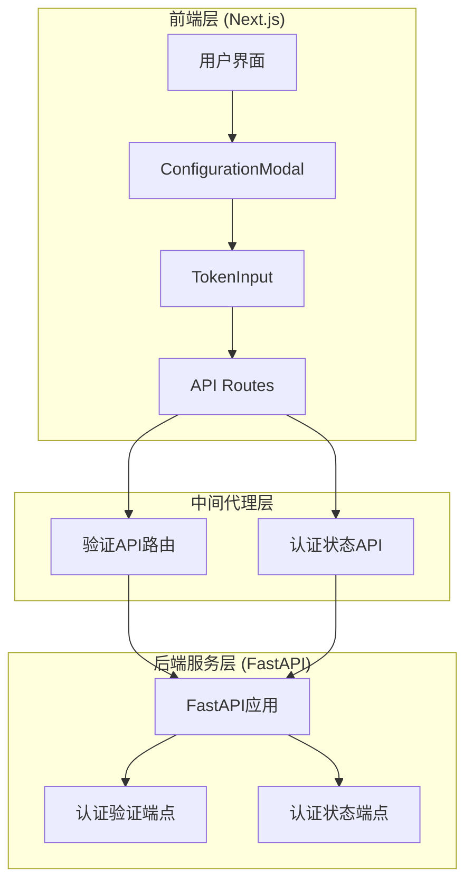
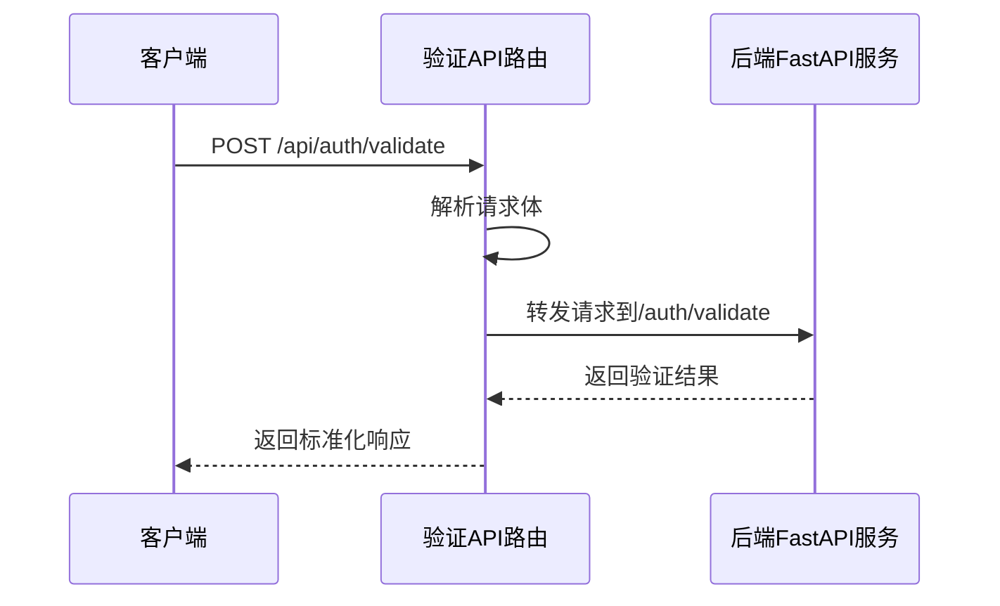
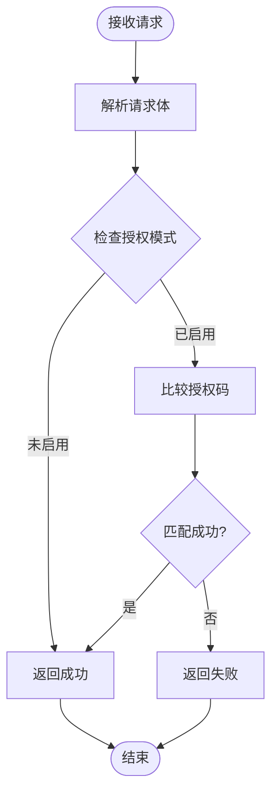
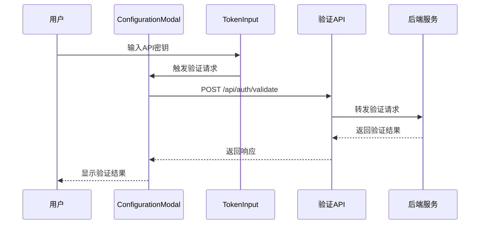
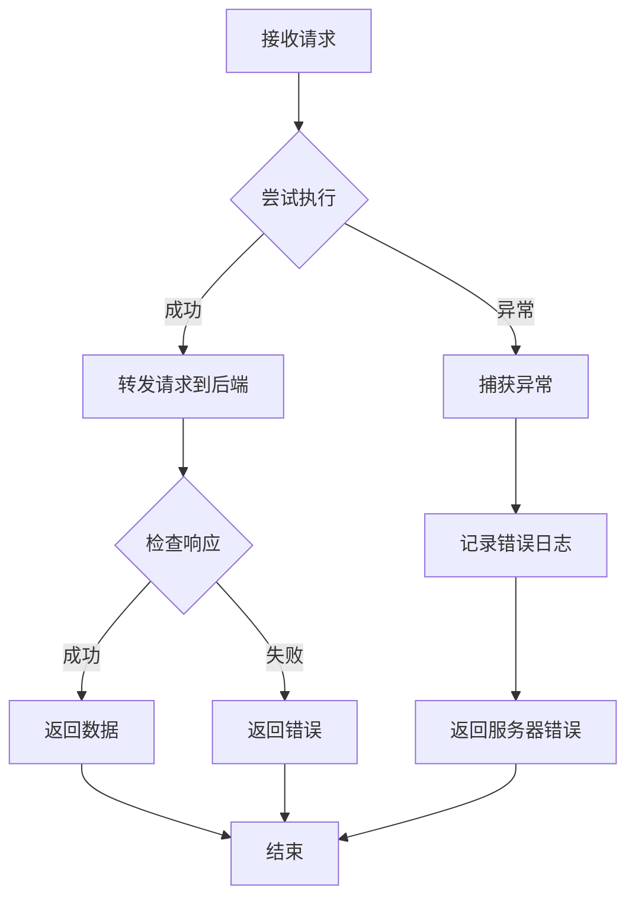

# 令牌验证API (/auth/validate)

<cite>
**本文档中引用的文件**
- [src/app/api/auth/validate/route.ts](file://src/app/api/auth/validate/route.ts)
- [src/components/ConfigurationModal.tsx](file://src/components/ConfigurationModal.tsx)
- [src/components/TokenInput.tsx](file://src/components/TokenInput.tsx)
- [api/api.py](file://api/api.py)
- [api/config.py](file://api/config.py)
- [src/app/api/auth/status/route.ts](file://src/app/api/auth/status/route.ts)
- [package.json](file://package.json)
</cite>

## 目录
1. [简介](#简介)
2. [项目架构概览](#项目架构概览)
3. [核心组件分析](#核心组件分析)
4. [API端点详细说明](#api端点详细说明)
5. [请求体结构与JSON格式](#请求体结构与json格式)
6. [后端验证逻辑实现](#后端验证逻辑实现)
7. [响应格式与HTTP状态码](#响应格式与http状态码)
8. [实际调用示例](#实际调用示例)
9. [用户界面集成](#用户界面集成)
10. [错误处理机制](#错误处理机制)
11. [性能考虑](#性能考虑)
12. [故障排除指南](#故障排除指南)
13. [总结](#总结)

## 简介

令牌验证API是deepwiki-open项目中的关键安全组件，负责验证用户提交的API密钥（如OpenAI Key）的有效性。该API通过反向代理将请求转发至后端FastAPI服务的/auth/validate端点，确保只有有效的API密钥才能用于后续的wiki生成操作。

该API的主要作用包括：
- 防止无效密钥提交到系统中
- 提升用户体验，及时反馈密钥有效性
- 作为安全屏障，保护后端服务免受无效请求
- 支持多种平台的API密钥验证（GitHub、GitLab、Bitbucket）

## 项目架构概览

deepwiki-open采用前后端分离的架构设计，令牌验证API作为中间层连接前端Next.js应用和后端FastAPI服务。



**图表来源**
- [src/app/api/auth/validate/route.ts](file://src/app/api/auth/validate/route.ts#L1-L35)
- [src/app/api/auth/status/route.ts](file://src/app/api/auth/status/route.ts#L1-L31)
- [api/api.py](file://api/api.py#L159-L166)

## 核心组件分析

### 前端API路由组件

验证API的核心实现在[src/app/api/auth/validate/route.ts](file://src/app/api/auth/validate/route.ts#L1-L35)，该文件定义了一个POST端点，负责接收前端请求并转发给后端服务。



**图表来源**
- [src/app/api/auth/validate/route.ts](file://src/app/api/auth/validate/route.ts#L5-L34)

### 后端FastAPI实现

后端FastAPI服务在[api/api.py](file://api/api.py#L159-L166)中实现了/auth/validate端点，该端点接受AuthorizationConfig模型并返回验证结果。

**章节来源**
- [src/app/api/auth/validate/route.ts](file://src/app/api/auth/validate/route.ts#L1-L35)
- [api/api.py](file://api/api.py#L159-L166)

## API端点详细说明

### 端点路径与方法

- **路径**: `/api/auth/validate`
- **HTTP方法**: POST
- **目标服务器**: 由环境变量`SERVER_BASE_URL`指定，默认为`http://localhost:8001`

### 环境变量配置

该API依赖以下环境变量进行配置：

| 变量名 | 描述 | 默认值 | 必需 |
|--------|------|--------|------|
| `SERVER_BASE_URL` | 后端FastAPI服务的基础URL | `http://localhost:8001` | 否 |

**章节来源**
- [src/app/api/auth/validate/route.ts](file://src/app/api/auth/validate/route.ts#L3-L4)

## 请求体结构与JSON格式

### 请求体结构

前端提交的请求体包含以下结构：

```typescript
interface ValidationRequest {
  code: string;  // 用户输入的授权码
}
```

### JSON格式要求

请求体必须是有效的JSON格式，Content-Type头应设置为`application/json`。

### 示例请求体

```json
{
  "code": "your-authentication-code"
}
```

**章节来源**
- [api/api.py](file://api/api.py#L160-L165)

## 后端验证逻辑实现

### FastAPI验证端点

后端FastAPI服务实现了简单的授权码验证逻辑：

```python
@app.post("/auth/validate")
async def validate_auth_code(request: AuthorizationConfig):
    """
    检查授权码是否有效
    """
    return {"success": WIKI_AUTH_CODE == request.code}
```

### 配置加载机制

验证逻辑依赖于环境变量配置：

```python
# 从环境变量加载授权配置
WIKI_AUTH_MODE = raw_auth_mode.lower() in ['true', '1', 't']
WIKI_AUTH_CODE = os.environ.get('DEEPWIKI_AUTH_CODE', '')
```

### 验证流程



**图表来源**
- [api/api.py](file://api/api.py#L159-L166)
- [api/config.py](file://api/config.py#L43-L46)

**章节来源**
- [api/api.py](file://api/api.py#L159-L166)
- [api/config.py](file://api/config.py#L43-L46)

## 响应格式与HTTP状态码

### 成功响应

当授权码验证成功时，返回以下格式的JSON响应：

```json
{
  "success": true,
  "status": "success",
  "provider": "github"  // 或其他平台名称
}
```

### 失败响应

当授权码验证失败时，返回以下格式的JSON响应：

```json
{
  "error": "Invalid authentication code",
  "status": "failure"
}
```

### HTTP状态码映射

| 验证结果 | HTTP状态码 | 响应格式 |
|----------|------------|----------|
| 成功 | 200 | `{ "success": true }` |
| 失败 | 401 | `{ "error": "Invalid authentication code" }` |
| 后端错误 | 500 | `{ "error": "Backend server returned X" }` |
| 网络异常 | 500 | `{ "error": "Internal Server Error" }` |

### 错误响应示例

```json
{
  "error": "Backend server returned 500",
  "status": 500
}
```

**章节来源**
- [src/app/api/auth/validate/route.ts](file://src/app/api/auth/validate/route.ts#L18-L22)
- [src/app/api/auth/validate/route.ts](file://src/app/api/auth/validate/route.ts#L28-L32)

## 实际调用示例

### 使用curl命令调用

```bash
# 验证有效授权码
curl -X POST \
  -H "Content-Type: application/json" \
  -d '{"code": "correct-auth-code"}' \
  http://localhost:3000/api/auth/validate

# 验证无效授权码
curl -X POST \
  -H "Content-Type: application/json" \
  -d '{"code": "wrong-auth-code"}' \
  http://localhost:3000/api/auth/validate
```

### 使用JavaScript fetch API调用

```javascript
// 验证授权码
async function validateAuthToken(authCode) {
  try {
    const response = await fetch('/api/auth/validate', {
      method: 'POST',
      headers: {
        'Content-Type': 'application/json'
      },
      body: JSON.stringify({ code: authCode })
    });
    
    if (!response.ok) {
      throw new Error(`HTTP error! status: ${response.status}`);
    }
    
    const data = await response.json();
    return data.success;
  } catch (error) {
    console.error('Validation failed:', error);
    return false;
  }
}

// 使用示例
validateAuthToken('your-auth-code')
  .then(success => {
    if (success) {
      console.log('授权码验证成功');
    } else {
      console.log('授权码验证失败');
    }
  });
```

### Next.js API路由调用

```typescript
// 在Next.js组件中使用
async function handleSubmitAuthCode(code: string) {
  try {
    const response = await fetch('/api/auth/validate', {
      method: 'POST',
      headers: {
        'Content-Type': 'application/json'
      },
      body: JSON.stringify({ code })
    });
    
    const data = await response.json();
    
    if (response.ok) {
      // 验证成功，继续处理
      return { success: true, message: '授权码验证成功' };
    } else {
      // 验证失败
      return { success: false, message: data.error || '验证失败' };
    }
  } catch (error) {
    console.error('网络错误:', error);
    return { success: false, message: '网络连接失败' };
  }
}
```

## 用户界面集成

### ConfigurationModal组件中的调用

令牌验证API在ConfigurationModal组件中发挥重要作用，特别是在用户配置阶段验证API密钥的有效性。



**图表来源**
- [src/components/ConfigurationModal.tsx](file://src/components/ConfigurationModal.tsx#L235-L242)
- [src/components/TokenInput.tsx](file://src/components/TokenInput.tsx#L1-L108)

### 用户反馈机制

系统提供了多层次的用户反馈机制：

1. **实时验证**: 用户输入API密钥时立即触发验证
2. **视觉反馈**: 通过颜色变化和图标指示验证状态
3. **错误提示**: 详细的错误消息帮助用户解决问题
4. **加载状态**: 验证过程中的加载指示器

### TokenInput组件集成

TokenInput组件负责收集和验证用户的API密钥：

```typescript
interface TokenInputProps {
  selectedPlatform: 'github' | 'gitlab' | 'bitbucket';
  setSelectedPlatform: (value: 'github' | 'gitlab' | 'bitbucket') => void;
  accessToken: string;
  setAccessToken: (value: string) => void;
  showTokenSection?: boolean;
  onToggleTokenSection?: () => void;
  allowPlatformChange?: boolean;
}
```

**章节来源**
- [src/components/ConfigurationModal.tsx](file://src/components/ConfigurationModal.tsx#L235-L242)
- [src/components/TokenInput.tsx](file://src/components/TokenInput.tsx#L1-L108)

## 错误处理机制

### 网络异常处理

API实现了全面的错误处理机制，涵盖各种可能的异常情况：



**图表来源**
- [src/app/api/auth/validate/route.ts](file://src/app/api/auth/validate/route.ts#L5-L34)

### 错误类型与处理策略

| 错误类型 | 处理策略 | HTTP状态码 | 用户反馈 |
|----------|----------|------------|----------|
| 网络连接失败 | 记录日志，返回500 | 500 | "网络连接失败" |
| 后端服务不可达 | 返回错误信息 | 500 | "后端服务不可用" |
| 请求格式错误 | 返回400 | 400 | "请求格式错误" |
| 验证失败 | 返回401 | 401 | "授权码无效" |
| 内部服务器错误 | 记录详细错误 | 500 | "内部服务器错误" |

### 错误恢复机制

系统提供了多种错误恢复机制：

1. **重试机制**: 对于临时性错误，自动重试
2. **降级服务**: 后端不可用时提供有限功能
3. **缓存策略**: 缓存验证结果减少重复请求
4. **超时处理**: 设置合理的请求超时时间

**章节来源**
- [src/app/api/auth/validate/route.ts](file://src/app/api/auth/validate/route.ts#L28-L32)

## 性能考虑

### 响应时间优化

为了提供良好的用户体验，API实现了以下性能优化措施：

1. **连接池管理**: 复用HTTP连接减少建立开销
2. **请求超时控制**: 设置合理的超时时间避免长时间等待
3. **并发处理**: 支持并发请求处理多个验证任务
4. **缓存策略**: 对频繁验证的密钥进行缓存

### 资源使用监控

系统监控以下关键指标：
- 平均响应时间
- 错误率统计
- 并发请求数
- 后端服务可用性

## 故障排除指南

### 常见问题与解决方案

#### 1. 验证失败问题

**症状**: 授权码总是验证失败
**可能原因**:
- 环境变量配置错误
- 后端服务未启动
- 网络连接问题

**解决方案**:
```bash
# 检查环境变量
echo $DEEPWIKI_AUTH_CODE

# 测试后端服务连通性
curl http://localhost:8001/health

# 检查API路由是否存在
curl http://localhost:3000/api/auth/validate
```

#### 2. 网络连接问题

**症状**: 请求超时或连接被拒绝
**解决方案**:
- 检查防火墙设置
- 验证端口配置
- 确认服务进程运行状态

#### 3. 前端集成问题

**症状**: 前端无法正确显示验证结果
**解决方案**:
- 检查API路由配置
- 验证跨域设置
- 确认响应格式正确

### 调试工具与技巧

1. **浏览器开发者工具**: 检查网络请求和响应
2. **后端日志**: 查看详细的错误信息
3. **环境变量检查**: 确认配置正确
4. **服务健康检查**: 验证各组件状态

## 总结

令牌验证API是deepwiki-open项目中的关键安全组件，通过以下特性确保系统的安全性和用户体验：

### 核心优势

1. **安全性**: 防止无效密钥提交，保护后端服务
2. **用户体验**: 实时验证，即时反馈
3. **可扩展性**: 支持多种平台和验证方式
4. **可靠性**: 全面的错误处理和恢复机制

### 最佳实践建议

1. **环境变量管理**: 正确配置授权码和服务器地址
2. **错误处理**: 实现完善的错误处理和用户反馈
3. **性能监控**: 监控API性能和可用性
4. **安全考虑**: 定期更新授权码，保护敏感信息

### 未来发展方向

1. **多因素认证**: 支持更复杂的验证机制
2. **智能缓存**: 基于使用模式的智能缓存策略
3. **监控增强**: 更详细的性能和安全监控
4. **API版本控制**: 支持向后兼容的API版本管理

该API的设计充分体现了现代Web应用的安全性和可用性平衡，为用户提供可靠的密钥验证服务，同时确保系统的稳定性和可维护性。