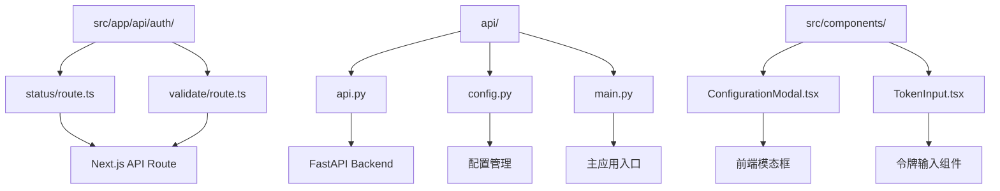
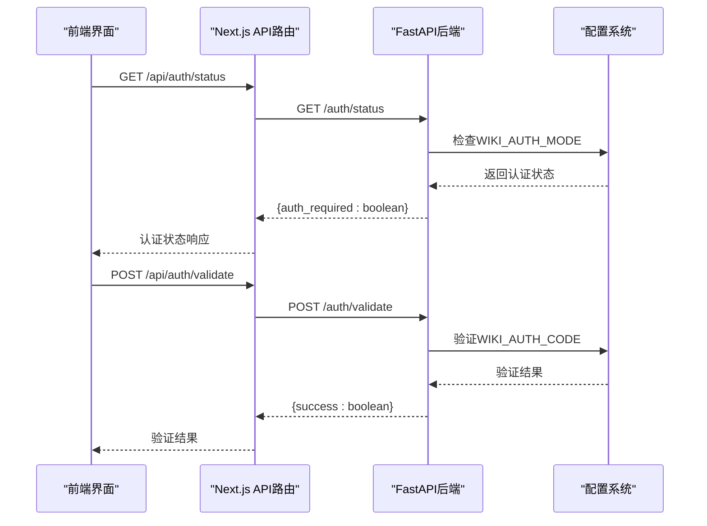
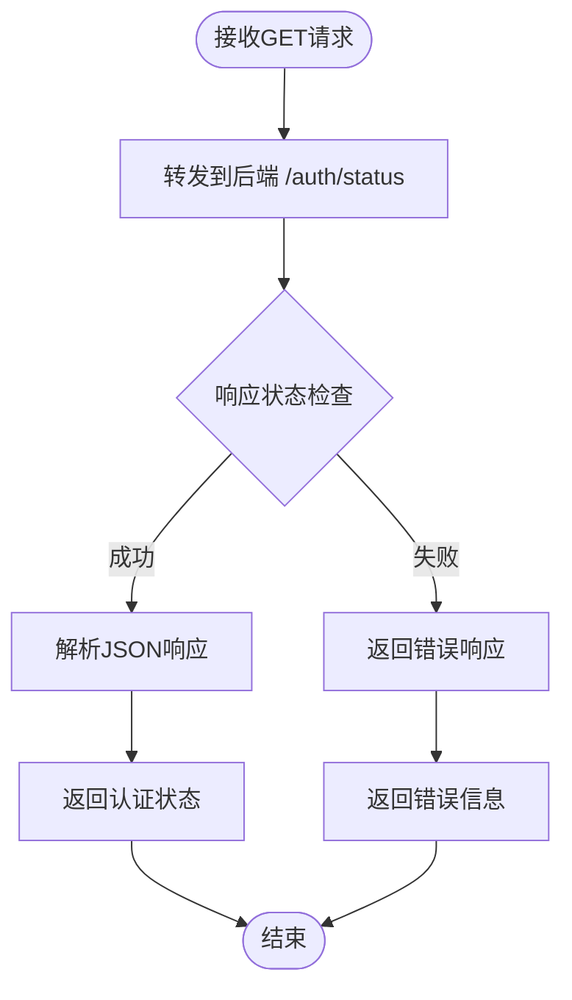
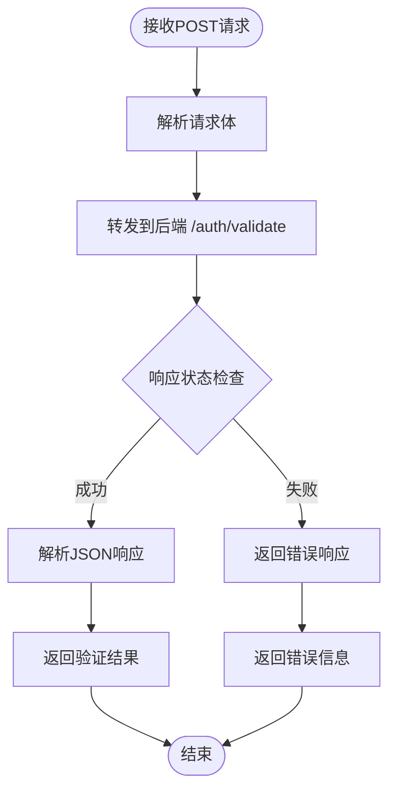
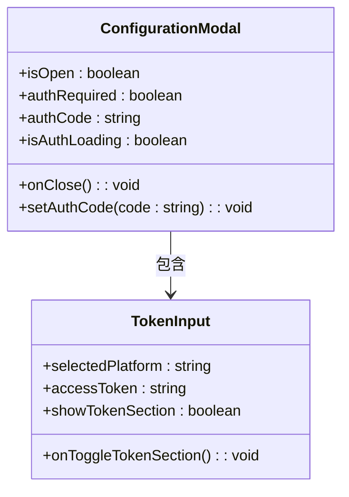
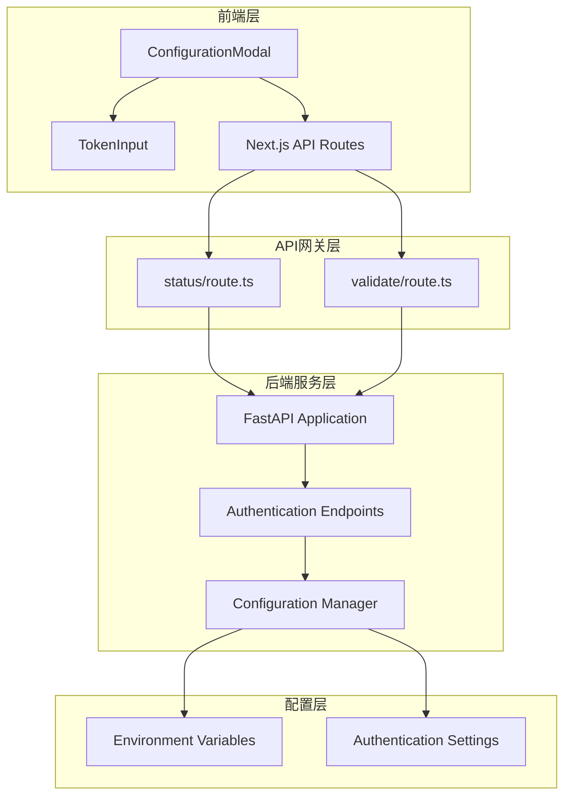

# 认证API

<cite>
**本文档中引用的文件**
- [src/app/api/auth/status/route.ts](file://src/app/api/auth/status/route.ts)
- [src/app/api/auth/validate/route.ts](file://src/app/api/auth/validate/route.ts)
- [src/components/ConfigurationModal.tsx](file://src/components/ConfigurationModal.tsx)
- [src/components/TokenInput.tsx](file://src/components/TokenInput.tsx)
- [api/api.py](file://api/api.py)
- [api/config.py](file://api/config.py)
- [api/main.py](file://api/main.py)
</cite>

## 目录
1. [简介](#简介)
2. [项目结构](#项目结构)
3. [核心组件](#核心组件)
4. [架构概览](#架构概览)
5. [详细组件分析](#详细组件分析)
6. [依赖关系分析](#依赖关系分析)
7. [性能考虑](#性能考虑)
8. [故障排除指南](#故障排除指南)
9. [结论](#结论)

## 简介

deepwiki-open项目实现了一套完整的认证API系统，用于管理用户访问权限和验证API令牌的有效性。该系统包含两个主要的API端点：`/auth/status`用于检查当前会话的登录状态，`/auth/validate`用于验证用户提供的API令牌（如OpenAI Key）。整个认证系统采用前后端分离架构，通过Next.js API路由层转发请求到FastAPI后端服务。

## 项目结构

认证API相关的文件组织结构如下：



**图表来源**
- [src/app/api/auth/status/route.ts](file://src/app/api/auth/status/route.ts#L1-L32)
- [src/app/api/auth/validate/route.ts](file://src/app/api/auth/validate/route.ts#L1-L35)
- [api/api.py](file://api/api.py#L1-L635)

**章节来源**
- [src/app/api/auth/status/route.ts](file://src/app/api/auth/status/route.ts#L1-L32)
- [src/app/api/auth/validate/route.ts](file://src/app/api/auth/validate/route.ts#L1-L35)

## 核心组件

认证系统的核心组件包括：

### 前端Next.js API路由
- **状态检查路由** (`/auth/status`)：GET请求，检查认证状态
- **令牌验证路由** (`/auth/validate`)：POST请求，验证API令牌有效性

### 后端FastAPI服务
- **认证状态端点** (`/auth/status`)：返回是否需要认证
- **认证验证端点** (`/auth/validate`)：验证授权码

### 前端组件
- **ConfigurationModal**：配置模态框，包含认证输入
- **TokenInput**：令牌输入组件，支持多平台令牌

**章节来源**
- [src/app/api/auth/status/route.ts](file://src/app/api/auth/status/route.ts#L1-L32)
- [src/app/api/auth/validate/route.ts](file://src/app/api/auth/validate/route.ts#L1-L35)
- [api/api.py](file://api/api.py#L153-L166)

## 架构概览

认证系统采用三层架构设计：



**图表来源**
- [src/app/api/auth/status/route.ts](file://src/app/api/auth/status/route.ts#L5-L31)
- [src/app/api/auth/validate/route.ts](file://src/app/api/auth/validate/route.ts#L5-L34)
- [api/api.py](file://api/api.py#L153-L166)

## 详细组件分析

### 状态检查端点 (/auth/status)

#### 功能描述
状态检查端点负责查询当前系统的认证要求状态，判断是否需要用户提供授权码。

#### HTTP方法和参数
- **方法**: GET
- **路径**: `/api/auth/status`
- **请求头**: `Content-Type: application/json`
- **响应格式**: JSON对象，包含`auth_required`布尔值

#### 实现细节



**图表来源**
- [src/app/api/auth/status/route.ts](file://src/app/api/auth/status/route.ts#L5-L31)

#### 错误处理
- 后端服务器不可达时返回500错误
- HTTP状态码非2xx时返回对应的状态码
- 网络异常时记录错误并返回内部服务器错误

**章节来源**
- [src/app/api/auth/status/route.ts](file://src/app/api/auth/status/route.ts#L1-L32)

### 令牌验证端点 (/auth/validate)

#### 功能描述
令牌验证端点接收用户提供的API令牌，验证其有效性并返回验证结果。

#### HTTP方法和参数
- **方法**: POST
- **路径**: `/api/auth/validate`
- **请求头**: `Content-Type: application/json`
- **请求体**: 包含令牌信息的JSON对象
- **响应格式**: JSON对象，包含`success`布尔值

#### 实现细节



**图表来源**
- [src/app/api/auth/validate/route.ts](file://src/app/api/auth/validate/route.ts#L5-L34)

#### 请求处理流程
1. 解析传入的JSON请求体
2. 构造向后端的转发请求
3. 设置适当的请求头和主体
4. 处理后端响应并返回给客户端

**章节来源**
- [src/app/api/auth/validate/route.ts](file://src/app/api/auth/validate/route.ts#L1-L35)

### 后端FastAPI实现

#### 认证状态端点 (/auth/status)

后端实现提供简洁的状态查询功能：

```mermaid
classDiagram
class AuthStatusEndpoint {
+get_auth_status() dict
+返回 : {"auth_required" : boolean}
}
class ConfigManager {
+WIKI_AUTH_MODE : bool
+检查认证模式
}
AuthStatusEndpoint --> ConfigManager : 使用
```

**图表来源**
- [api/api.py](file://api/api.py#L153-L158)

#### 认证验证端点 (/auth/validate)

验证端点执行严格的授权码验证：

```mermaid
classDiagram
class AuthValidationEndpoint {
+validate_auth_code(request : AuthorizationConfig) dict
+验证逻辑 : WIKI_AUTH_CODE == request.code
+返回 : {"success" : boolean}
}
class AuthorizationConfig {
+code : str
+验证授权码
}
AuthValidationEndpoint --> AuthorizationConfig : 接收
```

**图表来源**
- [api/api.py](file://api/api.py#L160-L165)

**章节来源**
- [api/api.py](file://api/api.py#L153-L166)

### 前端ConfigurationModal组件

ConfigurationModal是认证系统的主要用户界面组件，提供完整的配置和认证功能：

#### 组件架构



**图表来源**
- [src/components/ConfigurationModal.tsx](file://src/components/ConfigurationModal.tsx#L8-L61)

#### 认证状态管理

组件通过以下方式管理认证状态：

1. **加载状态**: 显示认证状态加载指示器
2. **认证要求**: 根据后端返回的认证需求显示相应UI
3. **授权码输入**: 提供密码输入框用于授权码验证
4. **错误处理**: 显示认证失败的相关信息

**章节来源**
- [src/components/ConfigurationModal.tsx](file://src/components/ConfigurationModal.tsx#L245-L274)

### TokenInput组件

TokenInput组件专门处理API令牌的输入和管理：

#### 支持的平台
- GitHub个人访问令牌
- GitLab个人访问令牌
- Bitbucket个人访问令牌

#### 安全特性
- 密码输入类型确保本地存储
- 不将令牌发送到服务器
- 平台切换功能

**章节来源**
- [src/components/TokenInput.tsx](file://src/components/TokenInput.tsx#L1-L108)

## 依赖关系分析

认证系统的依赖关系图展示了各组件之间的交互：



**图表来源**
- [src/app/api/auth/status/route.ts](file://src/app/api/auth/status/route.ts#L1-L32)
- [src/app/api/auth/validate/route.ts](file://src/app/api/auth/validate/route.ts#L1-L35)
- [api/api.py](file://api/api.py#L1-L635)
- [api/config.py](file://api/config.py#L43-L46)

### 关键依赖项

1. **环境变量管理**: 通过`DEEPWIKI_AUTH_MODE`和`DEEPWIKI_AUTH_CODE`控制认证行为
2. **配置系统**: 集成到整体配置管理系统中
3. **错误处理**: 统一的错误处理和日志记录机制
4. **跨域支持**: CORS中间件支持前端请求

**章节来源**
- [api/config.py](file://api/config.py#L43-L46)
- [api/api.py](file://api/api.py#L26-L33)

## 性能考虑

### 缓存策略
- 认证状态通过浏览器缓存优化
- 后端响应时间优化，避免不必要的计算

### 错误恢复
- 网络请求超时处理
- 后端服务不可用时的降级策略
- 用户友好的错误消息

### 安全考虑
- 所有敏感数据仅在客户端本地处理
- HTTPS强制使用
- CSRF保护（通过CORS配置）

## 故障排除指南

### 常见问题及解决方案

#### 认证状态检查失败
**症状**: 前端显示认证状态加载失败
**原因**: 后端服务不可达或网络连接问题
**解决方案**: 
1. 检查后端服务是否正常运行
2. 验证环境变量`SERVER_BASE_URL`配置
3. 检查防火墙和网络连接

#### 令牌验证失败
**症状**: 输入有效令牌后仍然提示验证失败
**原因**: 后端认证配置问题
**解决方案**:
1. 检查`DEEPWIKI_AUTH_MODE`环境变量设置
2. 验证`DEEPWIKI_AUTH_CODE`配置正确性
3. 查看后端日志获取详细错误信息

#### 前端认证UI不显示
**症状**: 应用界面缺少认证相关输入字段
**原因**: 前端认证状态获取失败
**解决方案**:
1. 检查前端网络请求状态
2. 验证API路由配置
3. 查看浏览器开发者工具中的错误信息

**章节来源**
- [src/app/api/auth/status/route.ts](file://src/app/api/auth/status/route.ts#L25-L30)
- [src/app/api/auth/validate/route.ts](file://src/app/api/auth/validate/route.ts#L28-L33)

## 结论

deepwiki-open的认证API系统提供了一个完整、安全且易于使用的认证解决方案。通过前后端分离的设计，系统实现了良好的可维护性和扩展性。主要特点包括：

1. **模块化设计**: 清晰的前后端分离架构
2. **安全性**: 敏感数据本地处理，不传输到服务器
3. **可靠性**: 完善的错误处理和降级机制
4. **易用性**: 直观的用户界面和清晰的错误提示
5. **可配置性**: 通过环境变量灵活控制认证行为

该认证系统为deepwiki-open提供了坚实的安全基础，确保只有经过授权的用户才能访问受保护的功能，同时保持了良好的用户体验。