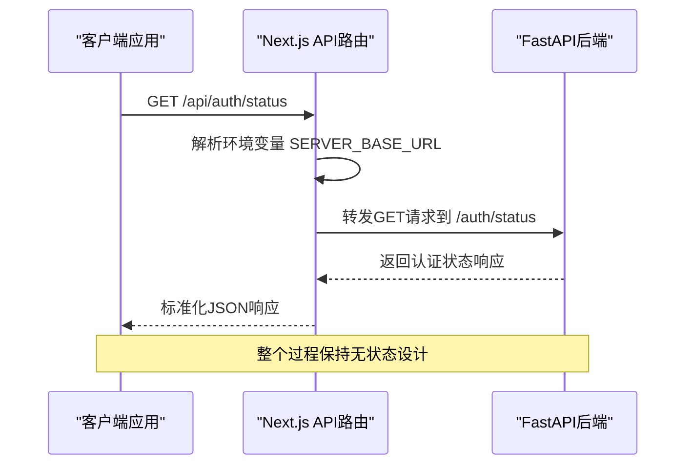
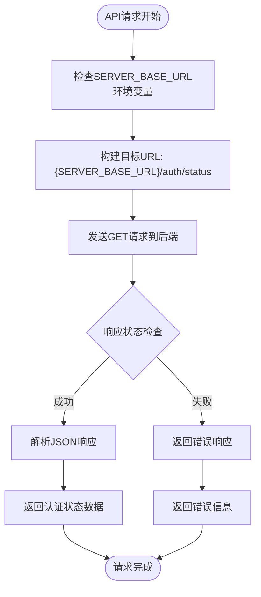
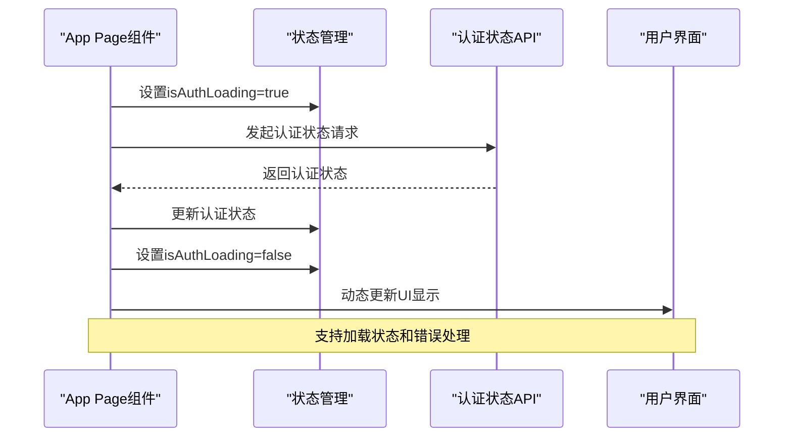
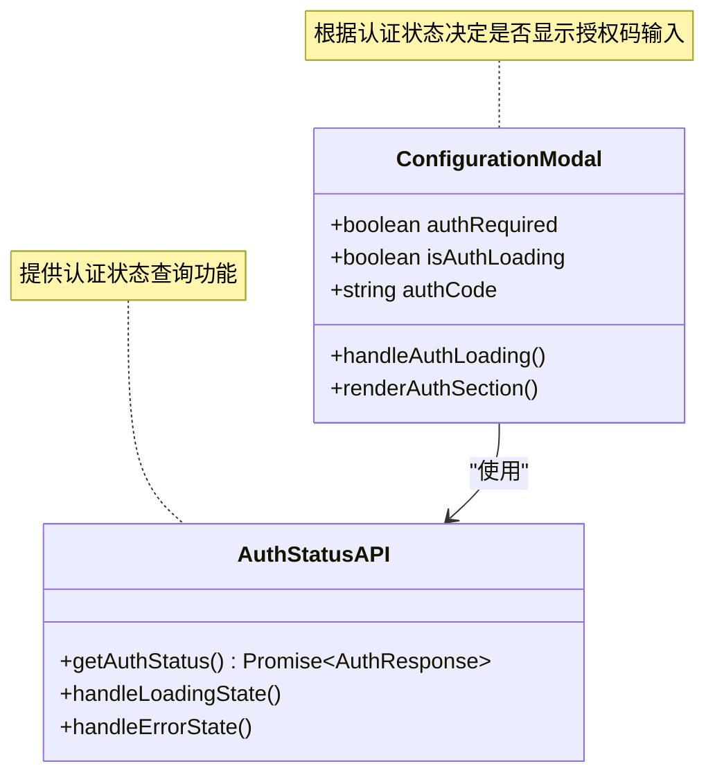
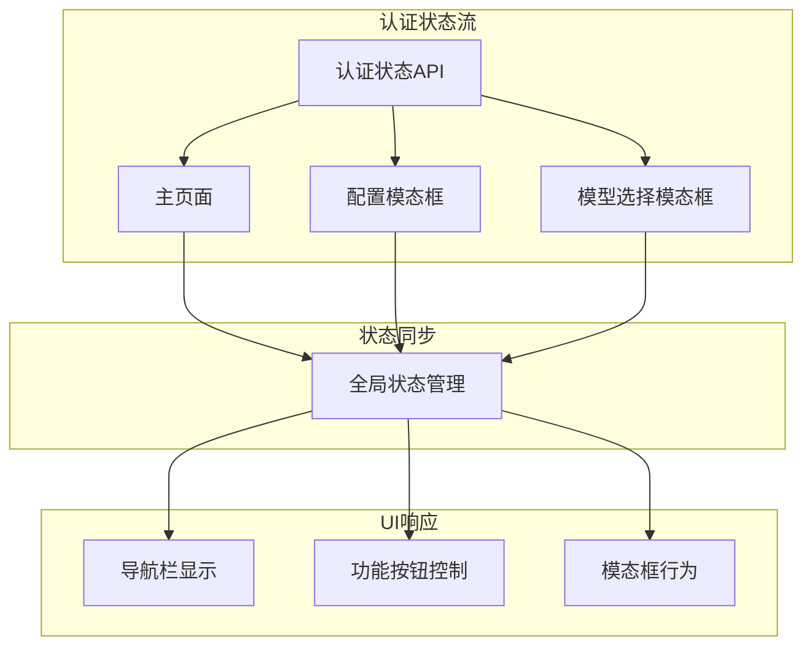
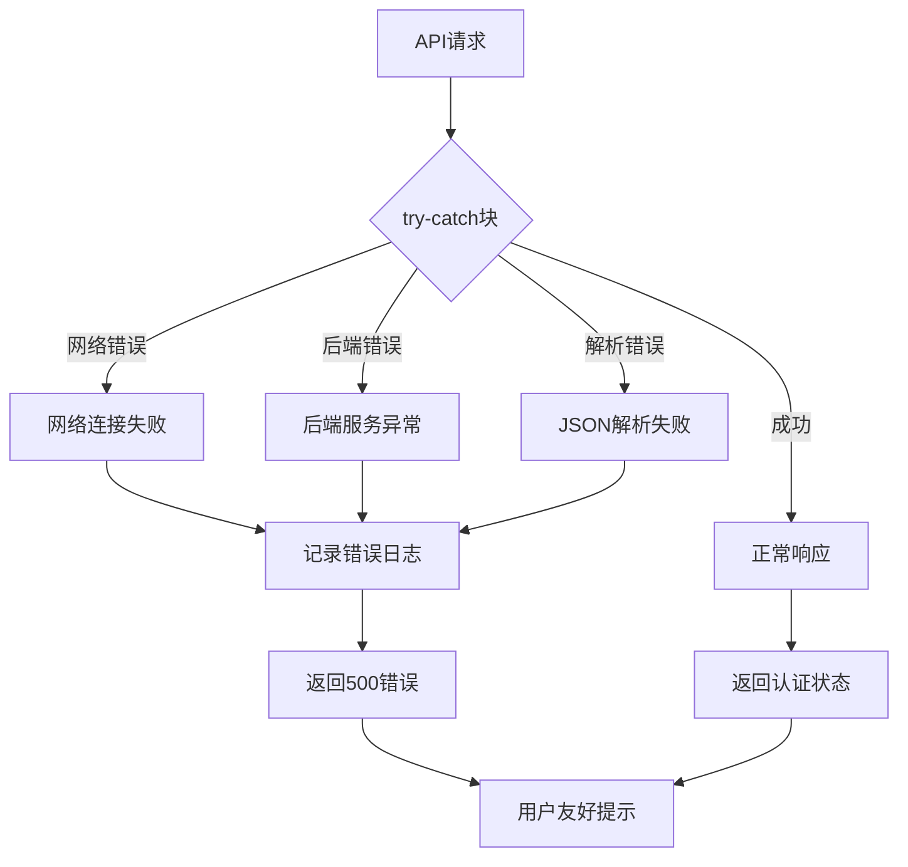
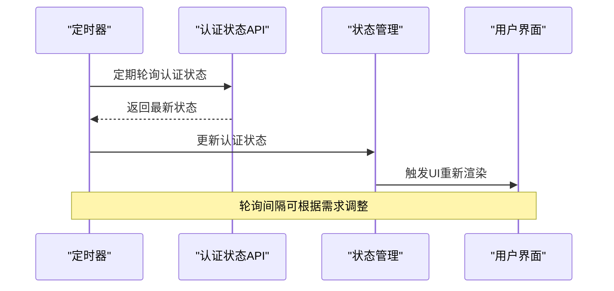

# 认证状态API (/auth/status)

<cite>
**本文档中引用的文件**
- [route.ts](file://src/app/api/auth/status/route.ts)
- [ConfigurationModal.tsx](file://src/components/ConfigurationModal.tsx)
- [ModelSelectionModal.tsx](file://src/components/ModelSelectionModal.tsx)
- [UserSelector.tsx](file://src/components/UserSelector.tsx)
- [TokenInput.tsx](file://src/components/TokenInput.tsx)
- [page.tsx](file://src/app/page.tsx)
- [validate/route.ts](file://src/app/api/auth/validate/route.ts)
- [layout.tsx](file://src/app/layout.tsx)
</cite>

## 目录
1. [简介](#简介)
2. [API端点概述](#api端点概述)
3. [核心实现分析](#核心实现分析)
4. [响应数据结构](#响应数据结构)
5. [前端集成模式](#前端集成模式)
6. [使用场景分析](#使用场景分析)
7. [错误处理机制](#错误处理机制)
8. [性能优化策略](#性能优化策略)
9. [最佳实践指南](#最佳实践指南)
10. [故障排除](#故障排除)

## 简介

认证状态API是deepwiki-open项目中的关键组件，负责向后端FastAPI服务的`/auth/status`端点发起请求，以获取当前会话的认证状态。该API采用Next.js的API路由模式，作为前端与后端认证系统之间的桥梁，为用户提供动态的认证状态管理功能。

该API的设计理念基于无状态原则，通过GET请求获取认证信息，无需任何请求参数，简化了客户端调用逻辑。响应数据包含`isAuthenticated`和`provider`等关键字段，用于驱动前端UI的状态更新和功能控制。

## API端点概述

### 端点路径
```
GET /api/auth/status
```

### 设计特点
- **无请求参数**：完全基于会话状态进行认证检查
- **透明代理**：直接转发请求到后端服务，保持接口一致性
- **环境变量配置**：通过`SERVER_BASE_URL`环境变量动态配置后端地址
- **标准化响应**：统一的JSON格式返回认证状态信息

### 请求流程图



**图表来源**
- [route.ts](file://src/app/api/auth/status/route.ts#L5-L31)

## 核心实现分析

### 后端代理实现

认证状态API的核心实现在[src/app/api/auth/status/route.ts](file://src/app/api/auth/status/route.ts#L1-L31)中，采用了简洁而高效的代理模式：



**图表来源**
- [route.ts](file://src/app/api/auth/status/route.ts#L5-L31)

### 关键实现细节

1. **环境变量配置**：默认值为`http://localhost:8001`，支持生产环境自定义
2. **请求头设置**：统一使用`Content-Type: application/json`
3. **错误边界处理**：完善的异常捕获和错误响应机制
4. **响应转发**：直接传递后端原始响应，保持数据完整性

**章节来源**
- [route.ts](file://src/app/api/auth/status/route.ts#L1-L31)

## 响应数据结构

### 认证状态响应格式

认证状态API返回的标准响应包含以下字段：

| 字段名 | 类型 | 描述 | 示例值 |
|--------|------|------|--------|
| `isAuthenticated` | boolean | 当前会话是否已认证 | `true` 或 `false` |
| `provider` | string | 认证提供者名称 | `"github"`、`"gitlab"`、`"bitbucket"` 或空字符串 |

### 已认证状态示例

```json
{
  "isAuthenticated": true,
  "provider": "github"
}
```

### 未认证状态示例

```json
{
  "isAuthenticated": false,
  "provider": ""
}
```

### 错误响应格式

当后端服务不可用或发生内部错误时，API返回标准化错误响应：

```json
{
  "error": "Backend server returned 500"
}
```

## 前端集成模式

### 页面加载时的认证状态获取

在主页面组件中，认证状态的获取遵循React的最佳实践：



**图表来源**
- [page.tsx](file://src/app/page.tsx#L153-L171)

### ConfigurationModal中的认证状态管理

在ConfigurationModal组件中，认证状态直接影响模态框的行为和可见性：



**图表来源**
- [ConfigurationModal.tsx](file://src/components/ConfigurationModal.tsx#L56-L61)
- [page.tsx](file://src/app/page.tsx#L153-L171)

### ModelSelectionModal中的认证状态应用

ModelSelectionModal同样依赖认证状态来控制访问权限：

**章节来源**
- [ModelSelectionModal.tsx](file://src/components/ModelSelectionModal.tsx#L41-L46)

## 使用场景分析

### 主要应用场景

1. **页面初始化认证检查**
   - 应用启动时验证用户认证状态
   - 控制导航菜单和功能模块的显示

2. **模态框权限控制**
   - ConfigurationModal：根据认证状态决定是否显示授权码输入
   - ModelSelectionModal：控制高级功能的访问权限

3. **动态UI状态更新**
   - 显示/隐藏用户相关的操作按钮
   - 切换到不同的用户界面布局

4. **访问控制决策**
   - 决定是否允许用户生成wiki内容
   - 控制对私有仓库的访问权限

### 组件间协作关系



**图表来源**
- [ConfigurationModal.tsx](file://src/components/ConfigurationModal.tsx#L98-L299)
- [ModelSelectionModal.tsx](file://src/components/ModelSelectionModal.tsx#L48-L260)

## 错误处理机制

### 多层错误处理策略

认证状态API实现了完整的错误处理机制，确保系统的健壮性：



**图表来源**
- [route.ts](file://src/app/api/auth/status/route.ts#L24-L30)

### 错误类型及处理方式

| 错误类型 | HTTP状态码 | 处理策略 | 用户体验 |
|----------|------------|----------|----------|
| 网络连接失败 | 500 | 返回内部服务器错误 | 显示通用错误提示 |
| 后端服务不可用 | 503 | 返回服务不可用 | 提示服务暂时不可用 |
| 认证状态查询失败 | 4xx | 返回具体错误信息 | 显示详细错误原因 |
| JSON解析错误 | 500 | 捕获异常并记录 | 隐藏技术细节 |

**章节来源**
- [route.ts](file://src/app/api/auth/status/route.ts#L15-L30)

## 性能优化策略

### 缓存机制设计

虽然认证状态API本身不实现传统意义上的缓存，但通过以下策略优化性能：

1. **会话级状态保持**
   - 基于浏览器会话自动维护认证状态
   - 减少不必要的API调用

2. **智能重试机制**
   - 在页面加载阶段进行单次重试
   - 避免频繁的重复请求

3. **并发控制**
   - 防止同时多个认证状态查询
   - 使用loading状态避免重复触发

### 轮询机制支持

对于需要实时更新认证状态的场景，可以结合轮询机制：



**章节来源**
- [page.tsx](file://src/app/page.tsx#L153-L171)

## 最佳实践指南

### 开发建议

1. **环境变量配置**
   ```typescript
   // 推荐的环境变量设置
   const TARGET_SERVER_BASE_URL = process.env.SERVER_BASE_URL || 'http://localhost:8001';
   ```

2. **错误处理**
   ```typescript
   // 建议的错误处理模式
   try {
     const response = await fetch('/api/auth/status');
     if (!response.ok) {
       throw new Error(`HTTP error! status: ${response.status}`);
     }
     const data = await response.json();
     // 处理成功响应
   } catch (err) {
     console.error("Failed to fetch auth status:", err);
     // 提供降级处理
   }
   ```

3. **状态管理**
   - 使用loading状态指示认证状态获取中
   - 实现合理的超时机制
   - 提供用户友好的错误提示

### 安全考虑

1. **本地存储安全**
   - 认证状态不应存储在本地存储中
   - 依赖会话Cookie维持认证状态

2. **跨域安全**
   - 确保CORS配置正确
   - 验证请求来源的安全性

3. **敏感信息保护**
   - 不在认证状态响应中包含敏感信息
   - 使用HTTPS传输所有认证相关数据

## 故障排除

### 常见问题及解决方案

1. **认证状态始终为未认证**
   - 检查后端服务是否正常运行
   - 验证环境变量配置是否正确
   - 确认浏览器Cookie设置

2. **API请求超时**
   - 检查网络连接状态
   - 验证后端服务端口配置
   - 查看浏览器开发者工具中的网络请求

3. **认证状态不一致**
   - 清除浏览器缓存和Cookie
   - 检查多标签页间的会话同步
   - 验证后端认证中间件配置

### 调试技巧

1. **启用详细日志**
   ```javascript
   console.log('Auth status response:', data);
   ```

2. **网络请求监控**
   - 使用浏览器开发者工具查看网络请求
   - 检查请求头和响应体
   - 验证HTTP状态码

3. **环境变量验证**
   ```javascript
   console.log('Server base URL:', process.env.SERVER_BASE_URL);
   ```

**章节来源**
- [route.ts/app/api/auth/status/route.ts#L25-L30)
- [page.tsx](file://src/app/page.tsx#L165-L167)

## 结论

认证状态API作为deepwiki-open项目的核心认证组件，通过简洁的设计实现了高效、可靠的认证状态管理。其无参数的GET请求设计简化了客户端调用，标准化的响应格式便于前端集成，完善的错误处理机制确保了系统的稳定性。

该API不仅支持基本的认证状态查询功能，还为ConfigurationModal和ModelSelectionModal等组件提供了必要的认证状态信息，实现了细粒度的访问控制和用户体验优化。通过合理的性能优化策略和安全考虑，该API为整个应用的认证体系奠定了坚实的基础。