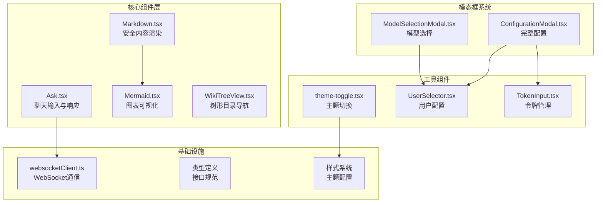
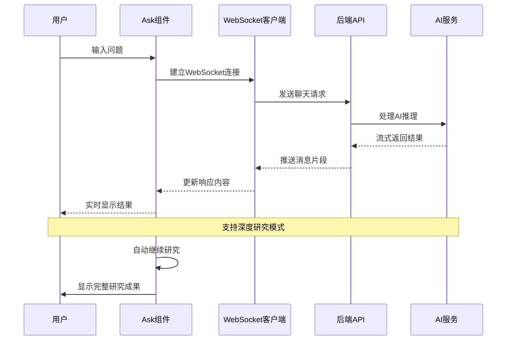
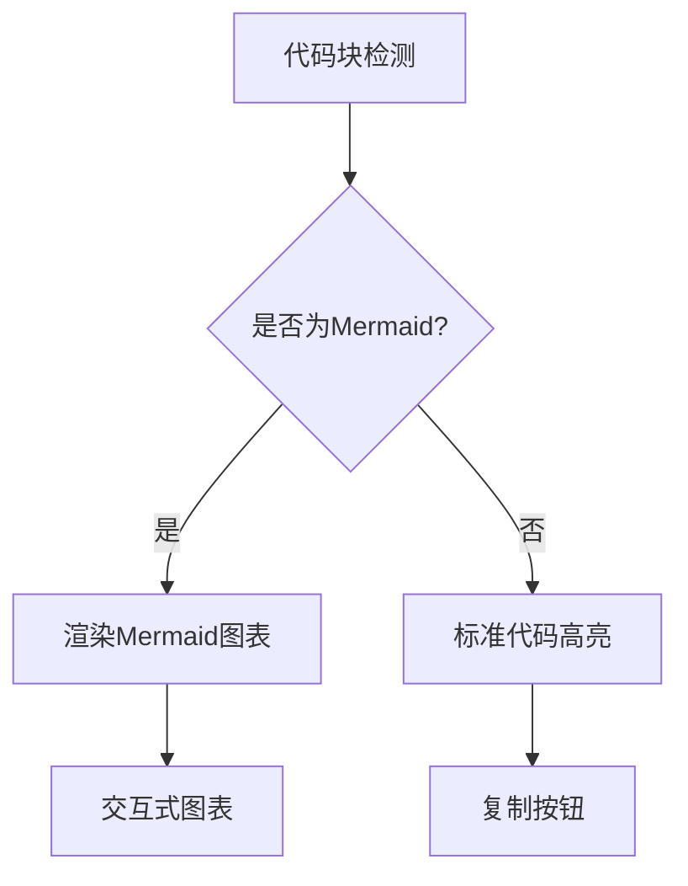
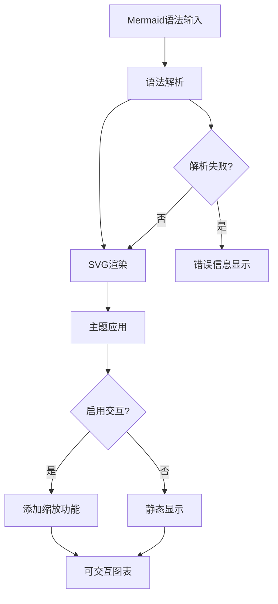
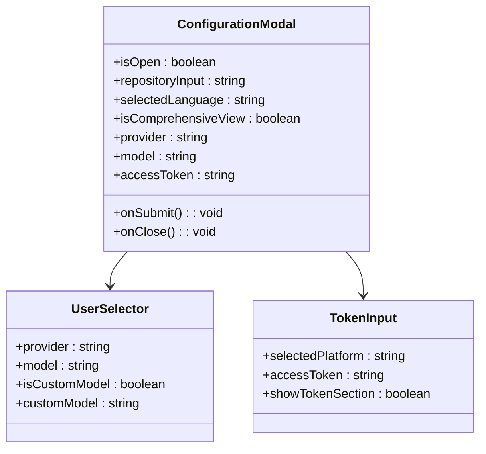
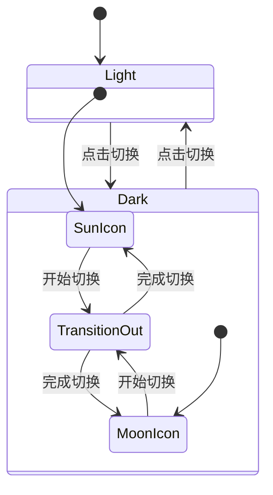
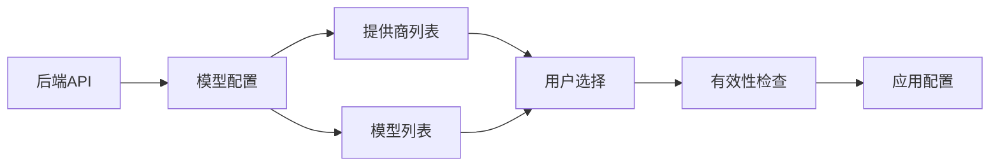
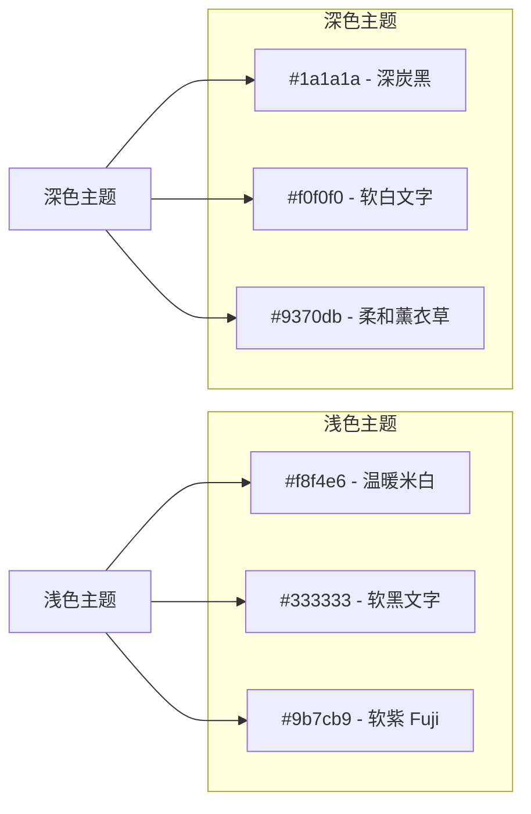

# UI组件库

<cite>
**本文档中引用的文件**
- [Ask.tsx](file://src/components/Ask.tsx)
- [Markdown.tsx](file://src/components/Markdown.tsx)
- [Mermaid.tsx](file://src/components/Mermaid.tsx)
- [WikiTreeView.tsx](file://src/components/WikiTreeView.tsx)
- [ConfigurationModal.tsx](file://src/components/ConfigurationModal.tsx)
- [ModelSelectionModal.tsx](file://src/components/ModelSelectionModal.tsx)
- [theme-toggle.tsx](file://src/components/theme-toggle.tsx)
- [UserSelector.tsx](file://src/components/UserSelector.tsx)
- [TokenInput.tsx](file://src/components/TokenInput.tsx)
- [websocketClient.ts](file://src/utils/websocketClient.ts)
- [wikipage.tsx](file://src/types/wiki/wikipage.tsx)
- [wikistructure.tsx](file://src/types/wiki/wikistructure.tsx)
- [globals.css](file://src/app/globals.css)
- [tailwind.config.js](file://tailwind.config.js)
</cite>

## 目录
1. [简介](#简介)
2. [项目架构概览](#项目架构概览)
3. [核心聊天组件](#核心聊天组件)
4. [内容渲染组件](#内容渲染组件)
5. [模态框组件系统](#模态框组件系统)
6. [主题切换组件](#主题切换组件)
7. [工具组件](#工具组件)
8. [样式系统](#样式系统)
9. [可访问性设计](#可访问性设计)
10. [最佳实践](#最佳实践)

## 简介

deepwiki-open是一个基于Next.js构建的AI驱动知识库生成平台，其UI组件库采用现代化的React架构，专注于提供流畅的用户体验和强大的功能集成。该组件库包含多个专门设计的组件，用于处理AI对话、内容渲染、配置管理和主题切换等功能。

## 项目架构概览

**图表来源**
- [Ask.tsx](file://src/components/Ask.tsx#L1-L50)
- [Markdown.tsx](file://src/components/Markdown.tsx#L1-L30)
- [Mermaid.tsx](file://src/components/Mermaid.tsx#L1-L50)
- [ConfigurationModal.tsx](file://src/components/ConfigurationModal.tsx#L1-L50)

## 核心聊天组件

### Ask.tsx - 智能聊天输入框

Ask组件是整个应用的核心交互组件，实现了实时AI对话功能，集成了WebSocket通信和深度研究能力。

#### 主要特性

- **实时WebSocket通信**：无缝连接后端AI服务
- **深度研究模式**：自动多轮迭代分析
- **流式响应渲染**：即时显示AI生成内容
- **研究阶段导航**：支持多阶段研究成果浏览
- **响应下载功能**：支持Markdown格式导出

#### 架构设计

**图表来源**
- [Ask.tsx](file://src/components/Ask.tsx#L532-L620)
- [websocketClient.ts](file://src/utils/websocketClient.ts#L43-L75)

#### Props接口定义

| 属性名 | 类型 | 必需 | 描述 |
|--------|------|------|------|
| repoInfo | RepoInfo | 是 | 仓库信息对象 |
| provider | string | 否 | AI提供商标识 |
| model | string | 否 | 使用的AI模型 |
| isCustomModel | boolean | 否 | 是否使用自定义模型 |
| customModel | string | 否 | 自定义模型名称 |
| language | string | 否 | 界面语言设置 |
| onRef | (ref: { clearConversation: () => void }) => void | 否 | 组件引用回调 |

#### 状态管理机制

Ask组件采用复杂的状态管理系统来处理多种交互场景：

- **对话状态**：维护完整的对话历史记录
- **研究进度**：跟踪深度研究的各个阶段
- **加载状态**：精确控制各种加载指示器
- **错误处理**：优雅处理网络和AI服务错误

**章节来源**
- [Ask.tsx](file://src/components/Ask.tsx#L36-L95)

## 内容渲染组件

### Markdown.tsx - 安全内容渲染器

Markdown组件负责安全地渲染AI生成的内容，防止XSS攻击，同时提供丰富的格式化选项。

#### XSS防护机制

组件通过以下方式确保内容安全：

1. **使用ReactMarkdown**：基于社区验证的安全Markdown解析器
2. **启用rehype-raw插件**：允许安全的HTML标签渲染
3. **自定义组件映射**：精确控制每个HTML元素的渲染行为
4. **代码高亮隔离**：独立处理代码块渲染

#### 渲染特性

| 元素类型 | 安全特性 | 样式定制 |
|----------|----------|----------|
| 标题 | 防止脚本注入 | 日本美学配色方案 |
| 列表 | 内容过滤 | 层级缩进控制 |
| 链接 | 协议白名单 | 新窗口打开 |
| 表格 | 结构化渲染 | 响应式布局 |
| 代码块 | 语法高亮 | 可复制功能 |
| Mermaid图表 | 动态渲染 | 交互式缩放 |

#### 代码块特殊处理

组件对Mermaid图表有特殊处理逻辑：

**图表来源**
- [Markdown.tsx](file://src/components/Markdown.tsx#L125-L135)

**章节来源**
- [Markdown.tsx](file://src/components/Markdown.tsx#L1-L208)

### Mermaid.tsx - 图表可视化组件

Mermaid组件将Mermaid语法文本转换为可交互的SVG图表，支持缩放和平移功能。

#### 核心功能

- **动态图表渲染**：实时将Mermaid语法转换为SVG
- **主题适配**：自动适配日式美学主题
- **交互式缩放**：支持鼠标滚轮和触摸手势
- **全屏模式**：点击放大查看详细内容
- **错误处理**：语法错误时提供友好的错误提示

#### 渲染流程

**图表来源**
- [Mermaid.tsx](file://src/components/Mermaid.tsx#L356-L407)

#### 主题系统

组件支持深色和浅色两种主题，具有以下特点：

- **色彩搭配**：遵循日本美学的柔和色调
- **对比度优化**：确保良好的可读性
- **动画效果**：平滑的主题切换过渡
- **响应式设计**：适应不同屏幕尺寸

**章节来源**
- [Mermaid.tsx](file://src/components/Mermaid.tsx#L1-L491)

## 模态框组件系统

### ConfigurationModal.tsx - 完整配置界面

ConfigurationModal提供了全面的配置选项，允许用户自定义AI模型、语言设置、访问令牌等参数。

#### 组件层次结构

**图表来源**
- [ConfigurationModal.tsx](file://src/components/ConfigurationModal.tsx#L8-L62)
- [UserSelector.tsx](file://src/components/UserSelector.tsx#L24-L44)

#### 配置选项分类

| 配置类别 | 选项数量 | 重要性 | 默认值 |
|----------|----------|--------|--------|
| 基础设置 | 4个 | 高 | 用户定义 |
| AI模型 | 5个 | 高 | OpenAI GPT-4 |
| 访问令牌 | 3个 | 中 | 无 |
| 文件过滤 | 4个 | 中 | 默认排除 |
| 高级选项 | 2个 | 低 | 关闭 |

**章节来源**
- [ConfigurationModal.tsx](file://src/components/ConfigurationModal.tsx#L1-L299)

### ModelSelectionModal.tsx - 模型选择界面

ModelSelectionModal专注于AI模型的选择和配置，提供简洁的用户界面。

#### 设计原则

- **最小化复杂性**：只显示必要的配置选项
- **状态隔离**：本地状态管理，避免意外修改
- **渐进式增强**：根据需要显示高级功能
- **一致性设计**：与主配置界面保持视觉统一

#### 状态管理模式

组件采用"暂存-提交"模式：

1. **暂存状态**：用户在本地修改配置
2. **确认提交**：点击"确定"时应用更改
3. **取消重置**：点击"取消"时恢复原始状态

**章节来源**
- [ModelSelectionModal.tsx](file://src/components/ModelSelectionModal.tsx#L1-L260)

## 主题切换组件

### theme-toggle.tsx - 日式美学主题切换

theme-toggle组件提供了优雅的主题切换功能，支持浅色和深色模式之间的平滑过渡。

#### 主题切换机制

**图表来源**
- [theme-toggle.tsx](file://src/components/theme-toggle.tsx#L5-L49)

#### 日式美学图标设计

组件使用精心设计的日式风格图标：

- **太阳图标**：代表浅色模式，采用柔和的圆形设计
- **月亮图标**：代表深色模式，使用优雅的弧线形状
- **过渡动画**：0.3秒的平滑透明度变化
- **视觉反馈**：悬停时的微妙阴影效果

**章节来源**
- [theme-toggle.tsx](file://src/components/theme-toggle.tsx#L1-L50)

## 工具组件

### UserSelector.tsx - 用户配置选择器

UserSelector组件负责AI提供商和模型的选择，支持自定义模型配置。

#### 功能特性

- **动态配置加载**：从后端API获取可用提供商和模型
- **自定义模型支持**：允许用户输入特定的模型名称
- **文件过滤配置**：可选的排除/包含路径设置
- **默认值管理**：智能处理空状态和错误情况

#### 数据流管理

**图表来源**
- [UserSelector.tsx](file://src/components/UserSelector.tsx#L82-L117)

**章节来源**
- [UserSelector.tsx](file://src/components/UserSelector.tsx#L1-L523)

### TokenInput.tsx - 访问令牌输入器

TokenInput组件提供安全的访问令牌管理功能，支持多个代码托管平台。

#### 安全特性

- **密码输入**：自动隐藏敏感信息
- **平台分离**：独立管理不同平台的令牌
- **本地存储**：令牌仅存储在客户端
- **隐私保护**：明确告知用户数据安全政策

#### 平台支持

| 平台 | 令牌类型 | 获取方式 |
|------|----------|----------|
| GitHub | Personal Access Token | Settings → Developer settings |
| GitLab | Personal Access Token | Profile → Settings → Access Tokens |
| Bitbucket | App Password | Workspace → Settings → App passwords |

**章节来源**
- [TokenInput.tsx](file://src/components/TokenInput.tsx#L1-L108)

## 样式系统

### Tailwind CSS集成

项目采用Tailwind CSS作为主要样式框架，结合自定义主题变量实现日式美学设计。

#### 主题变量系统

**图表来源**
- [globals.css](file://src/app/globals.css#L7-L31)

#### 日式美学特色

- **柔和色彩**：避免过于鲜艳的颜色
- **自然纹理**：背景采用纸张纹理效果
- **圆角设计**：使用0.25-0.5rem的圆角半径
- **微妙阴影**：0.4-0.8rem的轻量级投影

**章节来源**
- [globals.css](file://src/app/globals.css#L1-L149)
- [tailwind.config.js](file://tailwind.config.js#L1-L8)

## 可访问性设计

### 键盘导航支持

所有交互组件都支持键盘导航：

- **Tab键遍历**：按顺序聚焦到可交互元素
- **Enter/Space激活**：触发按钮和链接操作
- **Esc键关闭**：模态框和下拉菜单的退出机制
- **方向键导航**：列表和树形结构的移动

### 屏幕阅读器友好

- **语义化标记**：使用适当的HTML标签结构
- **ARIA属性**：为复杂组件提供辅助信息
- **焦点管理**：正确处理焦点状态
- **状态通知**：通过标题和描述传达组件状态

### 视觉设计考虑

- **对比度要求**：满足WCAG AA级别的对比度标准
- **字体大小**：使用12px的基础字号
- **间距设计**：合理的行高和字间距
- **颜色无障碍**：避免仅依赖颜色传达信息

## 最佳实践

### 性能优化

1. **懒加载**：大型组件按需加载
2. **代码分割**：使用动态导入减少初始包大小
3. **缓存策略**：合理利用浏览器缓存
4. **内存管理**：及时清理WebSocket连接

### 错误处理

- **渐进式降级**：WebSocket失败时自动回退到HTTP
- **用户友好的错误信息**：避免技术术语
- **重试机制**：网络错误时的自动重试
- **状态恢复**：错误后的状态重置

### 开发体验

- **TypeScript集成**：完整的类型安全保障
- **ESLint规则**：统一的代码风格
- **测试覆盖**：关键功能的单元测试
- **文档同步**：组件文档与代码同步更新

### 维护性设计

- **单一职责**：每个组件专注单一功能
- **松耦合**：组件间通过Props通信
- **可扩展性**：预留扩展点和钩子函数
- **向后兼容**：API变更时保持兼容性