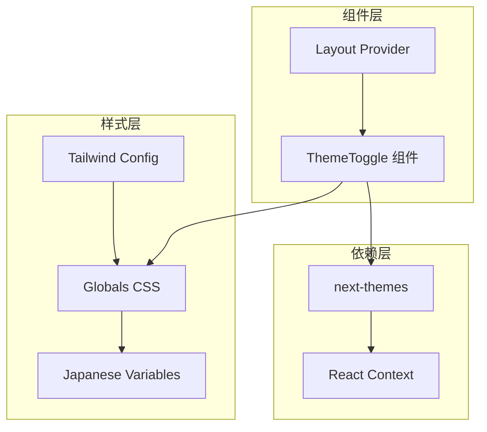
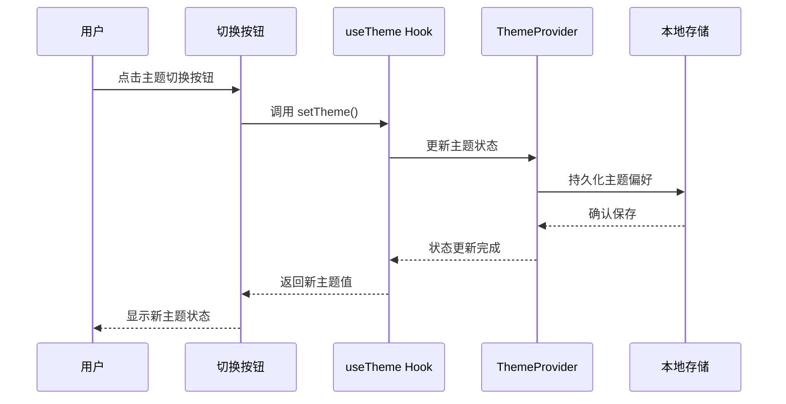
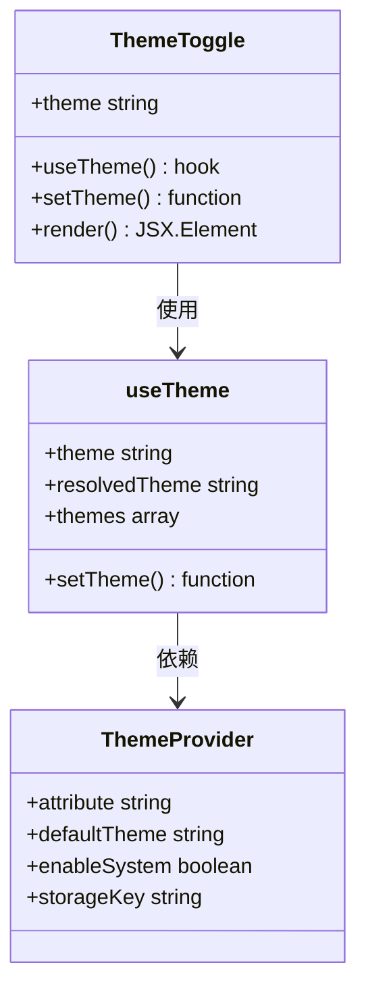
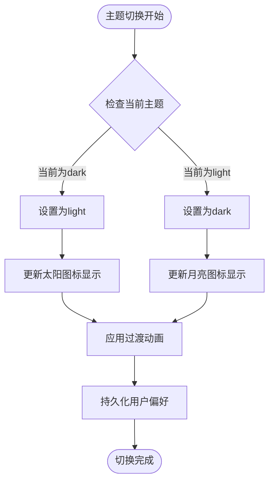
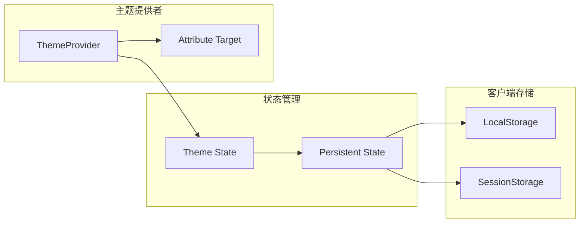
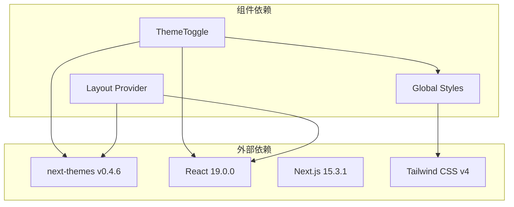

# 工具类组件 - ThemeToggle 主题切换器

<cite>
**本文档中引用的文件**
- [theme-toggle.tsx](file://src/components/theme-toggle.tsx)
- [layout.tsx](file://src/app/layout.tsx)
- [globals.css](file://src/app/globals.css)
- [tailwind.config.js](file://tailwind.config.js)
- [package.json](file://package.json)
- [page.tsx](file://src/app/page.tsx)
- [page.tsx](file://src/app/[owner]/[repo]/page.tsx)
</cite>

## 目录
1. [简介](#简介)
2. [项目结构](#项目结构)
3. [核心组件分析](#核心组件分析)
4. [架构概览](#架构概览)
5. [详细组件分析](#详细组件分析)
6. [依赖关系分析](#依赖关系分析)
7. [性能考虑](#性能考虑)
8. [故障排除指南](#故障排除指南)
9. [结论](#结论)

## 简介

ThemeToggle 是 deepwiki-open 项目中的核心工具类组件，负责实现基于 Tailwind CSS 的主题切换功能。该组件采用日本美学设计理念，提供流畅的明暗模式切换体验，并通过 next-themes 库实现用户偏好的持久化存储。

该组件不仅实现了基本的主题切换功能，还包含了完整的可访问性设计、动画过渡效果和响应式布局支持，是现代 Web 应用中主题管理的最佳实践范例。

## 项目结构

**图表来源**
- [theme-toggle.tsx](file://src/components/theme-toggle.tsx#L1-L50)
- [layout.tsx](file://src/app/layout.tsx#L1-L51)
- [globals.css](file://src/app/globals.css#L1-L149)

**章节来源**
- [theme-toggle.tsx](file://src/components/theme-toggle.tsx#L1-L50)
- [layout.tsx](file://src/app/layout.tsx#L1-L51)

## 核心组件分析

ThemeToggle 组件是一个高度优化的 React 函数组件，专门用于在明暗主题之间进行切换。组件采用了现代前端开发的最佳实践，包括客户端渲染、状态管理和可访问性设计。

### 主要特性

- **双态切换**：支持 light 和 dark 模式的无缝切换
- **日本美学设计**：采用传统的太阳和月亮图标作为视觉指示器
- **平滑过渡**：300ms 的 CSS 过渡动画提升用户体验
- **可访问性优先**：完整的 ARIA 标签和键盘导航支持
- **状态持久化**：通过 next-themes 实现用户偏好的本地存储

**章节来源**
- [theme-toggle.tsx](file://src/components/theme-toggle.tsx#L1-L50)

## 架构概览

**图表来源**
- [theme-toggle.tsx](file://src/components/theme-toggle.tsx#L14-L14)
- [layout.tsx](file://src/app/layout.tsx#L42-L42)

## 详细组件分析

### 组件结构与状态管理

ThemeToggle 组件的核心逻辑基于 next-themes 提供的 useTheme 钩子函数，该钩子提供了当前主题状态和主题切换函数。

**图表来源**
- [theme-toggle.tsx](file://src/components/theme-toggle.tsx#L6-L6)
- [layout.tsx](file://src/app/layout.tsx#L42-L42)

### 样式系统与 Tailwind CSS 集成

组件的样式系统深度集成了 Tailwind CSS，通过自定义 CSS 变量实现主题感知的样式应用。

#### 日本美学色彩系统

组件采用了精心设计的日本美学色彩调色板，包含以下关键变量：

| 变量名 | 浅色模式值 | 深色模式值 | 设计理念 |
|--------|------------|------------|----------|
| `--background` | #f8f4e6 | #1a1a1a | 僧坊紙质感 |
| `--foreground` | #333333 | #f0f0f0 | 软质黑色文字 |
| `--accent-primary` | #9b7cb9 | #9370db | 富士山紫色 |
| `--accent-secondary` | #d7c4bb | #5d4037 | 基拉尼米色 |
| `--border-color` | #e0d8c8 | #2c2c2c | 柔和边框色 |

#### 动画与过渡效果

组件实现了多层次的动画效果：

1. **按钮交互动画**：鼠标悬停时边框颜色变化
2. **主题切换动画**：太阳和月亮图标的透明度过渡
3. **整体主题动画**：CSS 自定义属性的平滑过渡

**章节来源**
- [theme-toggle.tsx](file://src/components/theme-toggle.tsx#L11-L11)
- [globals.css](file://src/app/globals.css#L6-L32)

### 图标系统与视觉设计

#### 太阳图标（明暗模式）

太阳图标采用简洁的 SVG 路径设计，包含：
- 中心圆圈代表太阳核心
- 八条辐射线代表阳光
- 斜线路径模拟阳光折射效果

#### 月亮图标（深色模式）

月亮图标使用单个路径绘制，采用：
- 圆弧路径模拟月亮形状
- 平滑的曲线连接确保视觉连贯性

**图表来源**
- [theme-toggle.tsx](file://src/components/theme-toggle.tsx#L19-L45)

### 可访问性设计

#### ARIA 标签与语义化

组件实现了完整的可访问性支持：

- **aria-label**："Toggle theme" - 屏幕阅读器友好的描述
- **title** 属性：提供额外的上下文信息
- **语义化按钮**：使用 button 元素而非 div
- **键盘导航**：支持 Tab 键焦点管理和 Enter/Space 键激活

#### 视觉反馈设计

- **悬停效果**：鼠标悬停时边框颜色变化
- **激活状态**：点击时的背景色变化
- **焦点状态**：键盘导航时的视觉焦点指示

**章节来源**
- [theme-toggle.tsx](file://src/components/theme-toggle.tsx#L12-L14)

### 用户偏好持久化机制

#### next-themes 集成

组件通过 next-themes 库实现主题偏好的持久化存储：

**图表来源**
- [layout.tsx](file://src/app/layout.tsx#L42-L42)
- [theme-toggle.tsx](file://src/components/theme-toggle.tsx#L6-L6)

#### 存储策略

- **默认主题**：系统设置（system）
- **存储键名**：data-theme
- **持久化范围**：跨会话保持用户偏好
- **回退机制**：当用户未选择时使用系统默认

**章节来源**
- [layout.tsx](file://src/app/layout.tsx#L42-L42)

## 依赖关系分析

### 核心依赖

**图表来源**
- [package.json](file://package.json#L12-L23)
- [theme-toggle.tsx](file://src/components/theme-toggle.tsx#L3-L3)

### 版本兼容性

- **React 版本**：^19.0.0 - 支持新的并发特性
- **Next.js 版本**：15.3.1 - 最新稳定版本
- **Tailwind CSS**：^4.x - 新一代 CSS 框架
- **next-themes**：^0.4.6 - 主题管理库

**章节来源**
- [package.json](file://package.json#L12-L23)

## 性能考虑

### 渲染优化

- **客户端渲染**：使用 "use client" 指令确保组件在客户端执行
- **状态局部化**：主题状态仅在必要时重新渲染
- **CSS 变量缓存**：避免重复计算样式属性

### 加载性能

- **懒加载**：next-themes 库按需加载
- **CSS 内联**：关键样式直接内联到 HTML
- **SVG 优化**：图标使用压缩的 SVG 格式

### 内存管理

- **事件监听器**：自动清理不必要的事件绑定
- **状态更新**：批量处理主题状态变更
- **存储访问**：异步处理本地存储操作

## 故障排除指南

### 常见问题与解决方案

#### 主题切换不生效

**症状**：点击按钮后主题没有变化
**原因**：ThemeProvider 配置错误或 CSS 变量未正确加载
**解决方案**：
1. 检查 layout.tsx 中的 ThemeProvider 配置
2. 验证 globals.css 中的 CSS 变量定义
3. 确认 tailwind.config.js 的 darkMode 设置

#### 图标显示异常

**症状**：太阳或月亮图标显示不完整
**原因**：SVG 路径定义错误或 CSS 样式冲突
**解决方案**：
1. 检查 SVG viewBox 属性
2. 验证 CSS 选择器优先级
3. 确认图标容器的尺寸设置

#### 可访问性问题

**症状**：屏幕阅读器无法识别组件功能
**原因**：ARIA 标签缺失或语义化错误
**解决方案**：
1. 添加或修正 aria-label 属性
2. 确保语义化的 HTML 结构
3. 测试键盘导航功能

**章节来源**
- [theme-toggle.tsx](file://src/components/theme-toggle.tsx#L12-L14)
- [layout.tsx](file://src/app/layout.tsx#L42-L42)

## 结论

ThemeToggle 组件是 deepwiki-open 项目中主题管理系统的核心组件，展现了现代 Web 开发中主题切换功能的最佳实践。通过深度集成 next-themes 库和 Tailwind CSS，该组件实现了：

- **无缝的用户体验**：流畅的主题切换动画和直观的视觉反馈
- **完整的可访问性支持**：符合 WCAG 标准的无障碍设计
- **优雅的日本美学风格**：独特的文化元素融入现代设计
- **可靠的持久化机制**：跨会话的主题偏好保持
- **高性能的渲染实现**：优化的客户端渲染和状态管理

该组件的设计理念体现了技术与艺术的完美结合，为用户提供既美观又实用的主题切换体验，同时为开发者提供了清晰、可维护的代码结构。通过深入理解这个组件的设计思路和实现细节，开发者可以更好地构建类似的工具类组件，提升 Web 应用的整体质量和用户体验。