# Ask 组件详尽文档

<cite>
**本文档引用的文件**
- [Ask.tsx](file://src/components/Ask.tsx)
- [websocketClient.ts](file://src/utils/websocketClient.ts)
- [ModelSelectionModal.tsx](file://src/components/ModelSelectionModal.tsx)
- [Markdown.tsx](file://src/components/Markdown.tsx)
- [LanguageContext.tsx](file://src/contexts/LanguageContext.tsx)
- [repoinfo.tsx](file://src/types/repoinfo.tsx)
- [route.ts](file://src/app/api/chat/stream/route.ts)
</cite>

## 目录
1. [简介](#简介)
2. [组件架构概览](#组件架构概览)
3. [Props 接口定义](#props-接口定义)
4. [状态管理系统](#状态管理系统)
5. [WebSocket 集成](#websocket-集成)
6. [深度研究功能](#深度研究功能)
7. [模型选择交互](#模型选择交互)
8. [错误处理与回退机制](#错误处理与回退机制)
9. [可访问性设计](#可访问性设计)
10. [组件生命周期](#组件生命周期)
11. [使用示例](#使用示例)
12. [总结](#总结)

## 简介

Ask 组件是 deepwiki-open 项目中的核心聊天输入组件，实现了实时AI对话功能。该组件集成了WebSocket技术以提供流式响应，并支持深度研究模式进行多轮对话分析。组件具有完善的状态管理、错误处理和用户交互设计，为用户提供流畅的AI对话体验。

## 组件架构概览

Ask 组件采用 React 函数式组件设计，结合了现代前端开发的最佳实践：

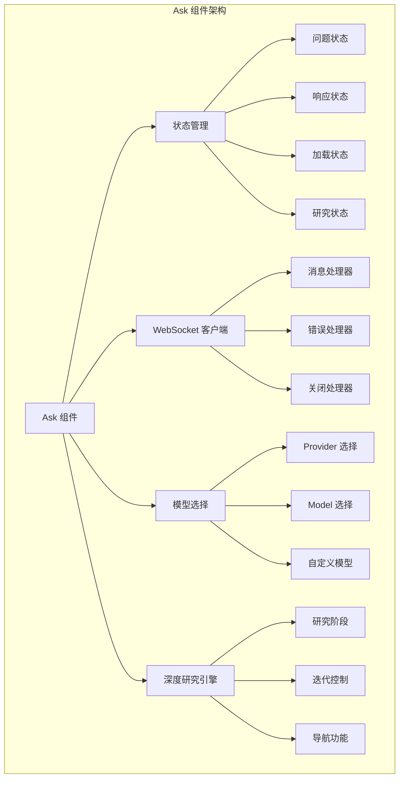

**图表来源**
- [Ask.tsx](file://src/components/Ask.tsx#L36-L54)

## Props 接口定义

Ask 组件通过清晰的 Props 接口定义接收配置参数：

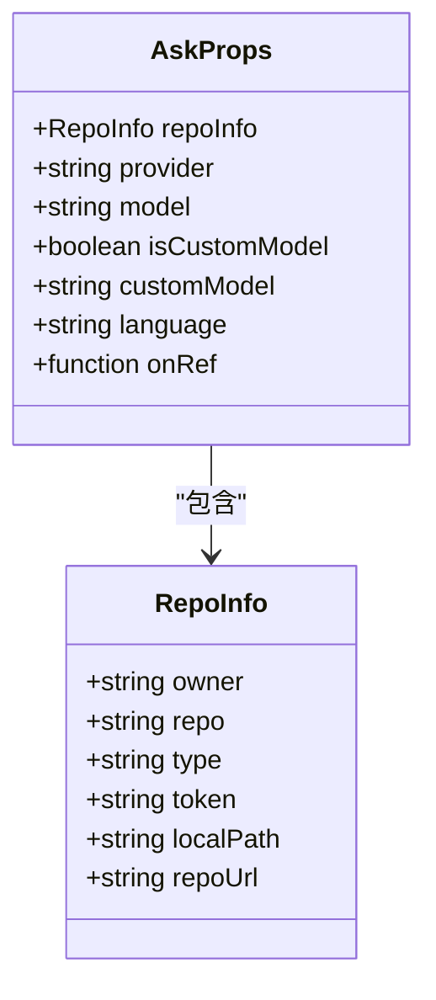

**图表来源**
- [Ask.tsx](file://src/components/Ask.tsx#L36-L54)
- [repoinfo.tsx](file://src/types/repoinfo.tsx#L1-L10)

### Props 字段详解

| 字段名 | 类型 | 默认值 | 描述 |
|--------|------|--------|------|
| `repoInfo` | `RepoInfo` | 必需 | 包含仓库信息的对象，用于标识对话上下文 |
| `provider` | `string` | `''` | AI服务提供商标识符 |
| `model` | `string` | `''` | 选定的AI模型名称 |
| `isCustomModel` | `boolean` | `false` | 是否使用自定义模型 |
| `customModel` | `string` | `''` | 自定义模型名称 |
| `language` | `string` | `'en'` | 用户界面语言设置 |
| `onRef` | `function` | 可选 | 提供对组件实例的引用回调 |

**节来源**
- [Ask.tsx](file://src/components/Ask.tsx#L36-L54)

## 状态管理系统

Ask 组件维护复杂的状态系统以支持多种交互模式：

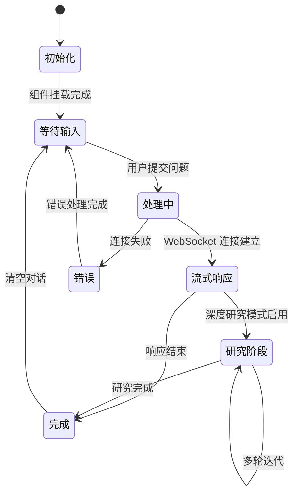

### 核心状态变量

组件维护以下关键状态：

| 状态变量 | 类型 | 初始值 | 用途 |
|----------|------|--------|------|
| `question` | `string` | `''` | 用户输入的问题内容 |
| `response` | `string` | `''` | AI生成的响应内容 |
| `isLoading` | `boolean` | `false` | 表示当前是否在加载中 |
| `deepResearch` | `boolean` | `false` | 是否启用深度研究模式 |
| `researchStages` | `ResearchStage[]` | `[]` | 深度研究过程中的各个阶段 |
| `currentStageIndex` | `number` | `0` | 当前显示的研究阶段索引 |
| `conversationHistory` | `Message[]` | `[]` | 对话历史记录 |
| `researchIteration` | `number` | `0` | 当前研究迭代次数 |
| `researchComplete` | `boolean` | `false` | 研究过程是否已完成 |

**节来源**
- [Ask.tsx](file://src/components/Ask.tsx#L55-L76)

## WebSocket 集成

Ask 组件通过 WebSocket 实现实时流式响应，提供更流畅的用户体验：

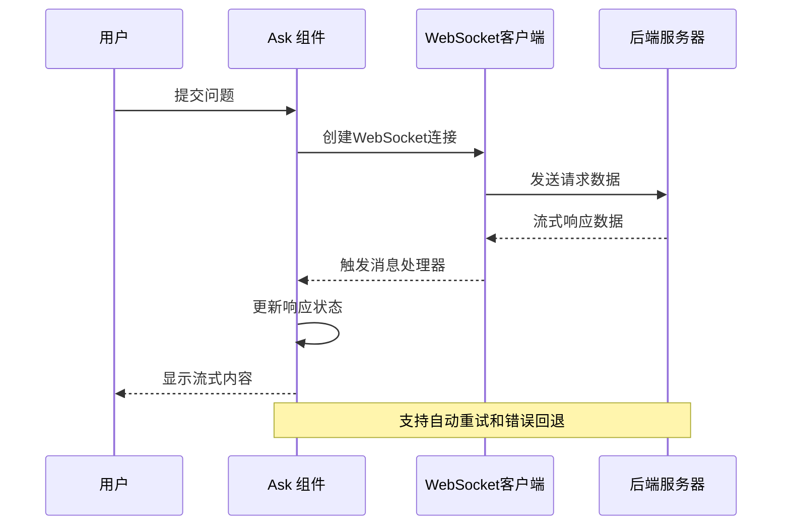

**图表来源**
- [websocketClient.ts](file://src/utils/websocketClient.ts#L43-L86)
- [Ask.tsx](file://src/components/Ask.tsx#L337-L396)

### WebSocket 连接生命周期

组件通过 `useEffect` 钩子管理 WebSocket 连接的完整生命周期：

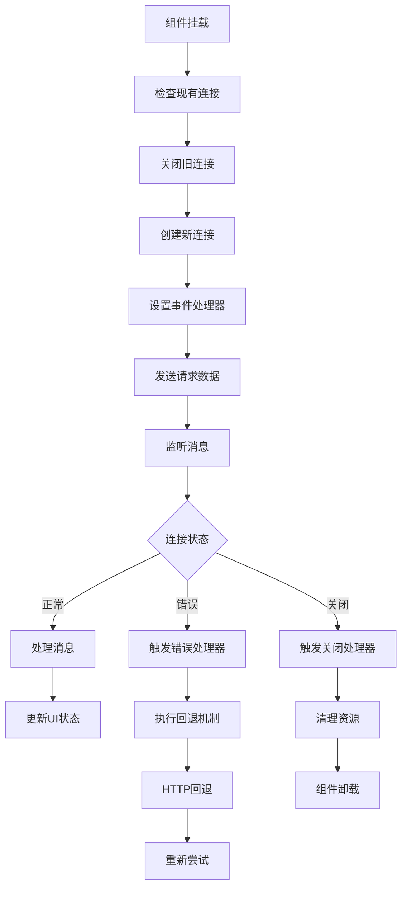

**图表来源**
- [Ask.tsx](file://src/components/Ask.tsx#L103-L108)
- [websocketClient.ts](file://src/utils/websocketClient.ts#L43-L86)

**节来源**
- [Ask.tsx](file://src/components/Ask.tsx#L277-L396)
- [websocketClient.ts](file://src/utils/websocketClient.ts#L1-86)

## 深度研究功能

深度研究是 Ask 组件的核心特色功能，支持多轮对话分析：

### 研究阶段识别

组件能够智能识别不同类型的深度研究阶段：

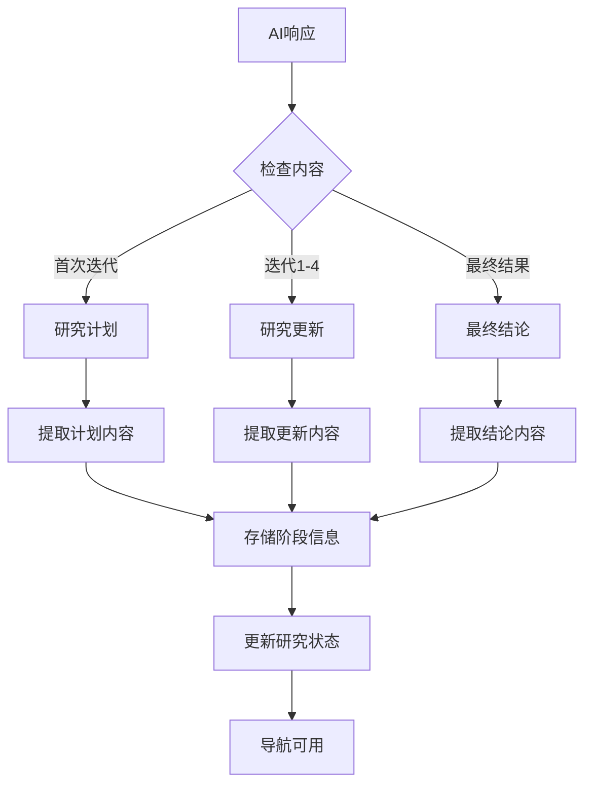

### 研究阶段类型

| 阶段类型 | 标识符 | 内容特征 | 功能 |
|----------|--------|----------|------|
| `plan` | 研究计划 | 包含"## Research Plan"标题 | 初始研究策略制定 |
| `update` | 研究更新 | 包含"## Research Update X"标题 | 迭代研究进展 |
| `conclusion` | 最终结论 | 包含"## Final Conclusion"标题 | 综合分析结果 |

### 研究导航功能

深度研究模式提供完整的导航控制：

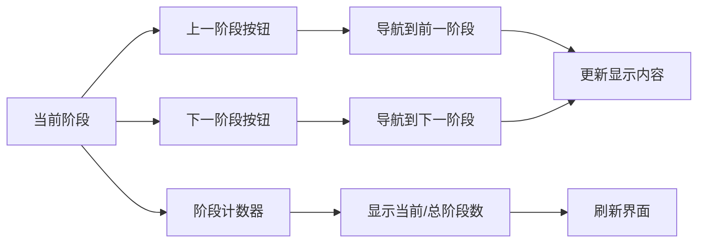

**图表来源**
- [Ask.tsx](file://src/components/Ask.tsx#L255-L275)

**节来源**
- [Ask.tsx](file://src/components/Ask.tsx#L211-L275)
- [Ask.tsx](file://src/components/Ask.tsx#L280-L402)

## 模型选择交互

Ask 组件与 ModelSelectionModal 组件紧密协作，提供灵活的模型配置：

### 模型选择流程

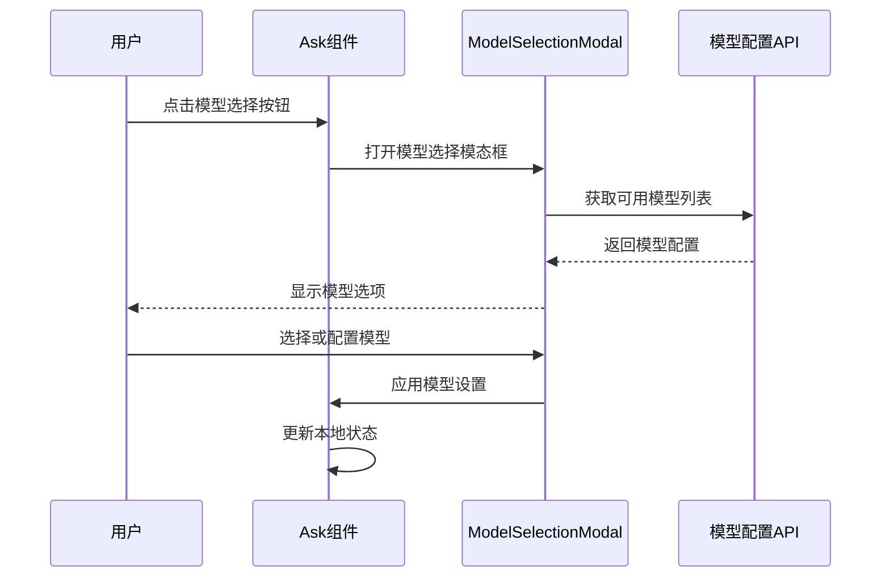

**图表来源**
- [ModelSelectionModal.tsx](file://src/components/ModelSelectionModal.tsx#L49-L260)
- [Ask.tsx](file://src/components/Ask.tsx#L645-L654)

### 模型状态同步

组件维护复杂的模型选择状态：

| 状态变量 | 类型 | 用途 |
|----------|------|------|
| `selectedProvider` | `string` | 当前选定的服务提供商 |
| `selectedModel` | `string` | 当前选定的标准模型 |
| `isCustomSelectedModel` | `boolean` | 是否选择了自定义模型 |
| `customSelectedModel` | `string` | 自定义模型名称 |
| `isModelSelectionModalOpen` | `boolean` | 模态框是否打开 |

**节来源**
- [Ask.tsx](file://src/components/Ask.tsx#L60-L66)
- [ModelSelectionModal.tsx](file://src/components/ModelSelectionModal.tsx#L9-L21)

## 错误处理与回退机制

Ask 组件实现了完善的错误处理和回退机制，确保用户体验的连续性：

### 回退策略层次

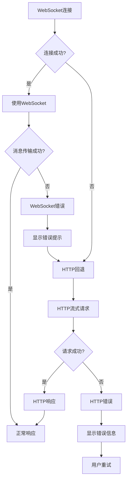

### 错误处理函数

组件提供了专门的错误处理和回退函数：

| 函数名 | 功能 | 触发条件 |
|--------|------|----------|
| `fallbackToHttp` | HTTP回退机制 | WebSocket连接失败 |
| `handleConfirmAsk` | 主要提交处理 | 用户提交问题 |
| `continueResearch` | 自动继续研究 | 研究未完成且允许 |

### 错误恢复机制

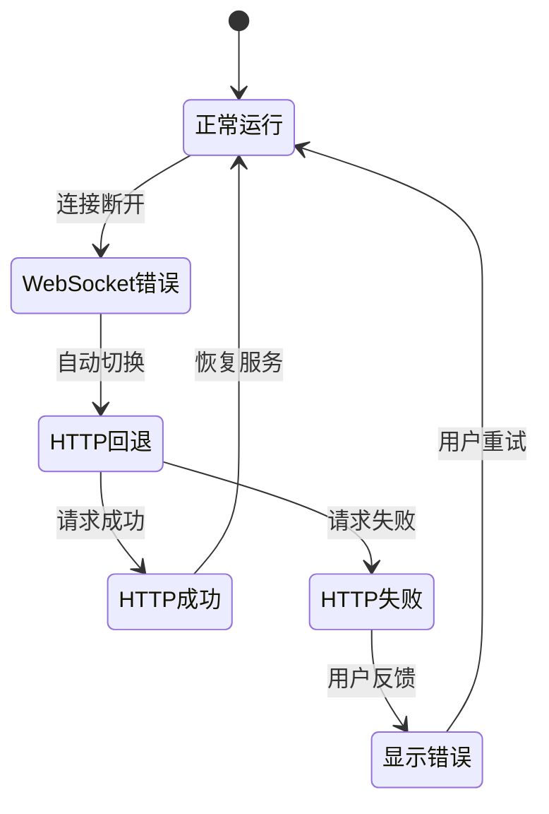

**图表来源**
- [Ask.tsx](file://src/components/Ask.tsx#L405-L480)

**节来源**
- [Ask.tsx](file://src/components/Ask.tsx#L369-L402)
- [Ask.tsx](file://src/components/Ask.tsx#L405-L480)

## 可访问性设计

Ask 组件遵循Web可访问性标准，提供良好的用户体验：

### 键盘导航支持

- **输入框焦点管理**：组件挂载时自动聚焦输入框
- **表单提交**：支持回车键提交问题
- **按钮操作**：所有交互元素支持键盘操作

### 屏幕阅读器友好

- **语义化HTML**：使用适当的HTML标签结构
- **ARIA属性**：为复杂交互提供辅助技术支持
- **状态通知**：通过视觉和文本提示告知用户状态变化

### 响应式设计

组件采用Tailwind CSS类实现响应式布局：
- 移动设备优先的设计
- 适配不同屏幕尺寸的输入框宽度
- 流式布局适应各种设备

**节来源**
- [Ask.tsx](file://src/components/Ask.tsx#L82-L101)
- [Ask.tsx](file://src/components/Ask.tsx#L658-L690)

## 组件生命周期

Ask 组件的生命周期管理体现了现代React开发的最佳实践：

### 生命周期钩子分析

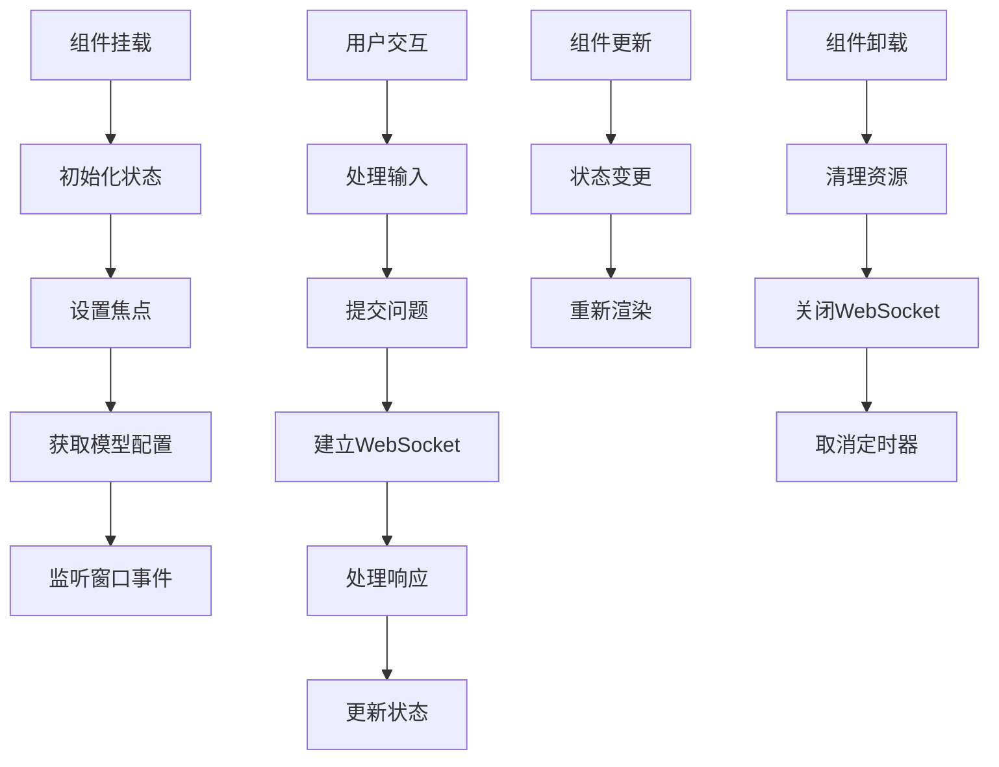

### 关键生命周期事件

| 钩子 | 用途 | 实现细节 |
|------|------|----------|
| `useEffect` (挂载) | 设置初始焦点 | 自动聚焦输入框 |
| `useEffect` (依赖数组) | 状态同步 | provider/model更新时同步状态 |
| `useEffect` (清理函数) | 资源清理 | 组件卸载时关闭WebSocket |

**节来源**
- [Ask.tsx](file://src/components/Ask.tsx#L82-L108)
- [Ask.tsx](file://src/components/Ask.tsx#L109-L118)

## 使用示例

以下是 Ask 组件的典型使用场景：

### 基础使用

```typescript
// 基本的Ask组件使用
<Ask 
  repoInfo={repositoryInfo}
  provider="openai"
  model="gpt-4"
  language="zh"
/>
```

### 高级配置

```typescript
// 具有完整配置的Ask组件
<Ask 
  repoInfo={repositoryInfo}
  provider="anthropic"
  model="claude-3-opus"
  isCustomModel={true}
  customModel="custom-model-name"
  language="zh"
  onRef={(ref) => {
    // 获取组件实例引用
    const clearConversation = ref.clearConversation;
  }}
/>
```

### 深度研究模式

```typescript
// 启用深度研究的Ask组件
<Ask 
  repoInfo={repositoryInfo}
  provider="openai"
  model="gpt-4"
  language="zh"
  deepResearch={true}
/>
```

**节来源**
- [Ask.tsx](file://src/components/Ask.tsx#L46-L54)

## 总结

Ask 组件是 deepwiki-open 项目中的核心交互组件，展现了现代Web应用开发的多个重要方面：

### 技术亮点

1. **实时通信**：通过WebSocket实现流式响应，提供即时的AI对话体验
2. **智能研究**：深度研究功能支持多轮对话分析，提升AI回答质量
3. **容错设计**：完善的错误处理和HTTP回退机制确保服务稳定性
4. **状态管理**：复杂的状态系统支持多种交互模式
5. **可访问性**：遵循Web可访问性标准，包容所有用户群体

### 架构优势

- **模块化设计**：清晰的组件分离和职责划分
- **类型安全**：完整的TypeScript类型定义
- **性能优化**：合理的状态更新和渲染优化
- **扩展性**：良好的接口设计支持未来功能扩展

Ask 组件不仅是一个功能强大的聊天输入框，更是现代前端开发最佳实践的完美体现，为用户提供专业、可靠、易用的AI对话体验。