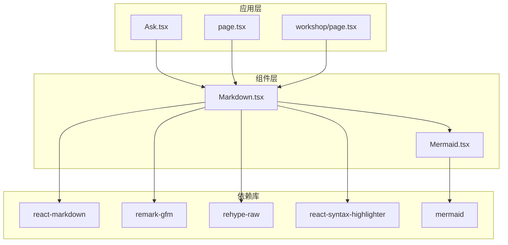
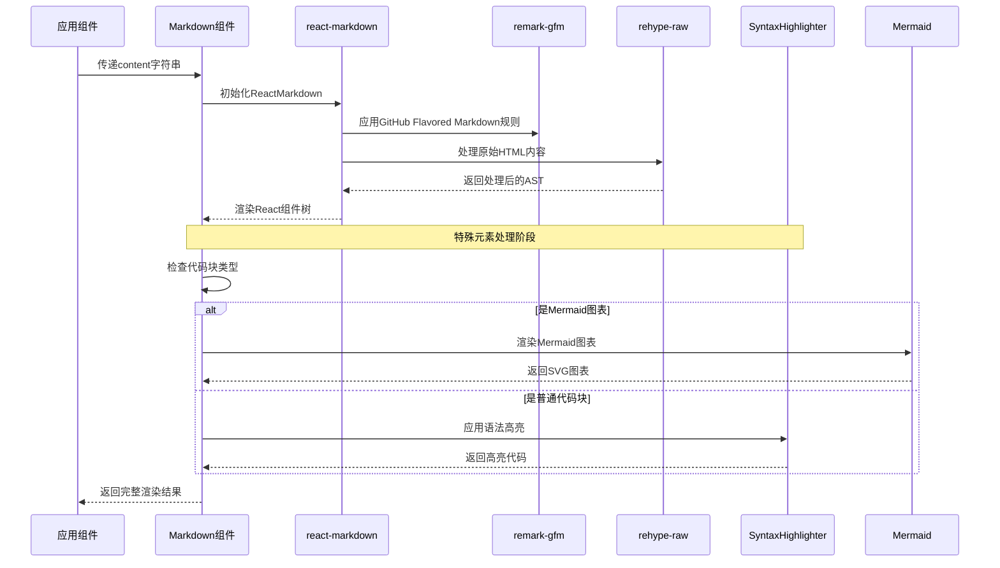
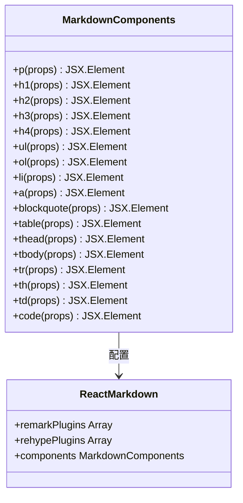
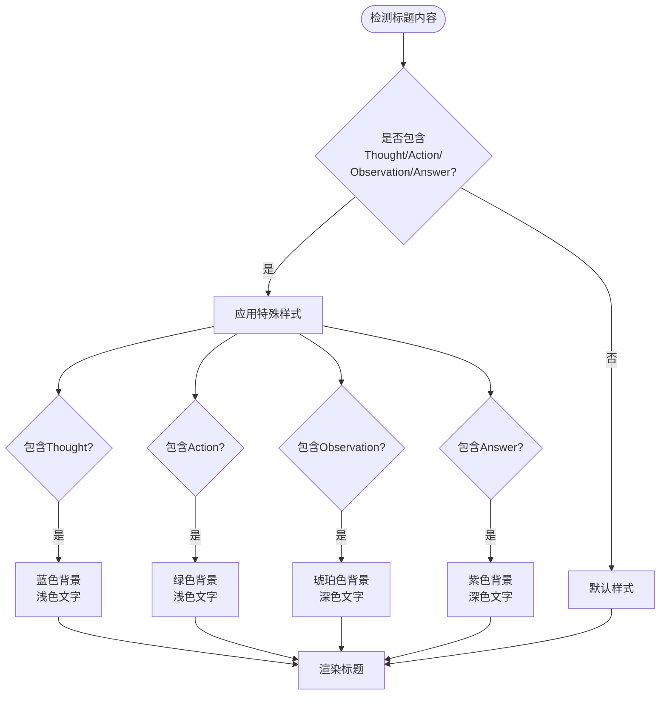
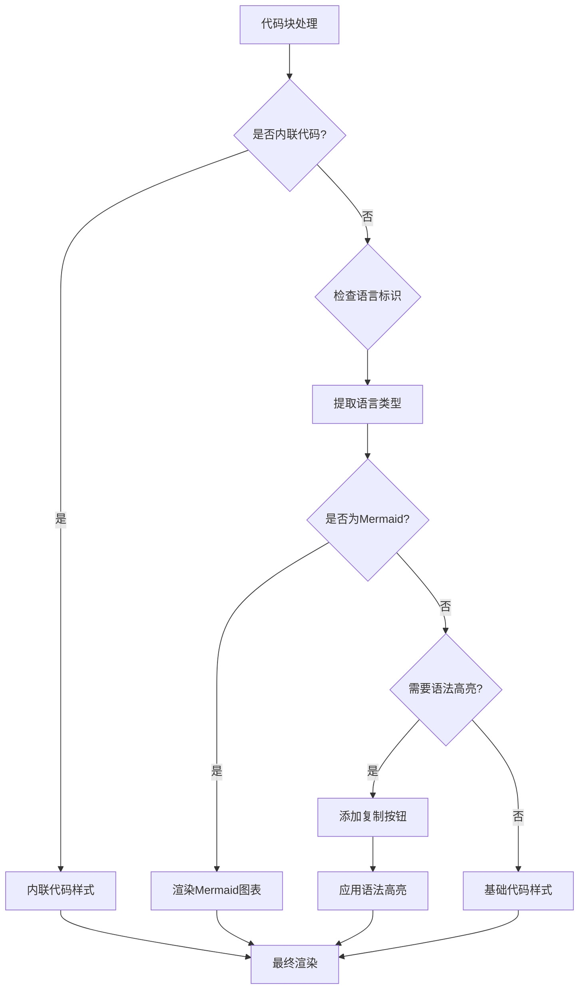
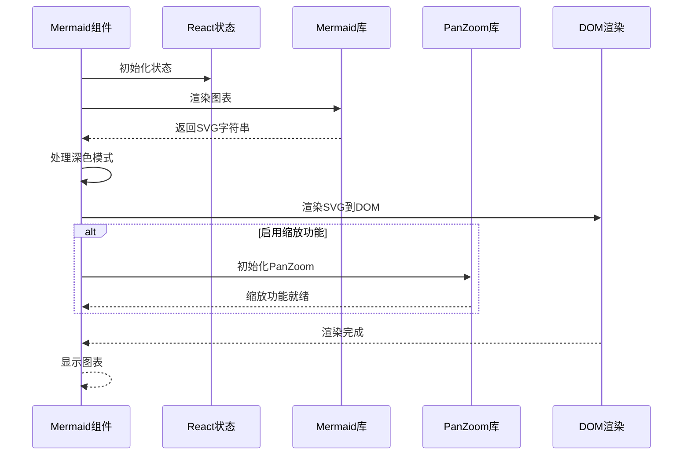
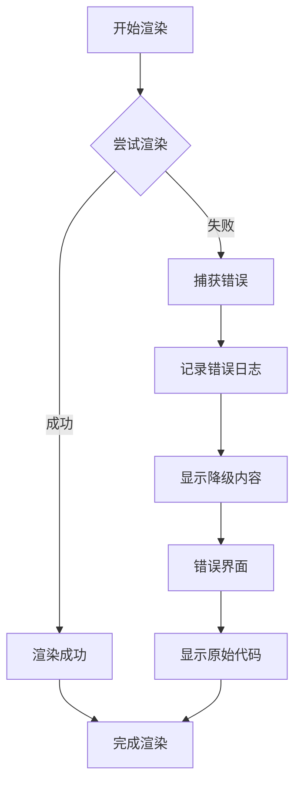
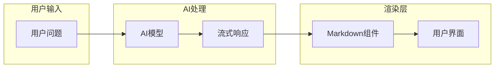
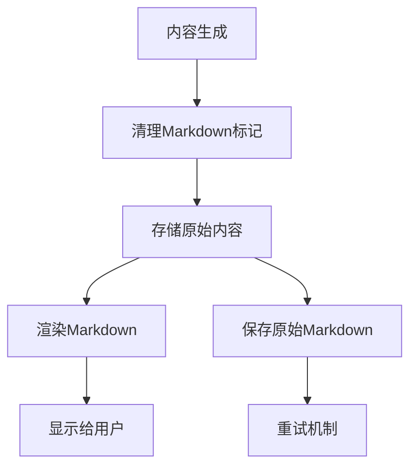
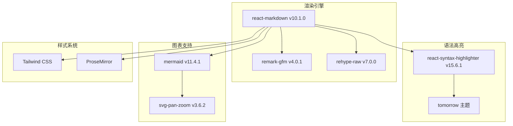

# Markdown 组件

<cite>
**本文档中引用的文件**
- [Markdown.tsx](file://src/components/Markdown.tsx)
- [Mermaid.tsx](file://src/components/Mermaid.tsx)
- [package.json](file://package.json)
- [Ask.tsx](file://src/components/Ask.tsx)
- [page.tsx](file://src/app/[owner]/[repo]/page.tsx)
- [workshop/page.tsx](file://src/app/[owner]/[repo]/workshop/page.tsx)
</cite>

## 目录
1. [简介](#简介)
2. [项目结构](#项目结构)
3. [核心组件](#核心组件)
4. [架构概览](#架构概览)
5. [详细组件分析](#详细组件分析)
6. [依赖关系分析](#依赖关系分析)
7. [性能考虑](#性能考虑)
8. [故障排除指南](#故障排除指南)
9. [结论](#结论)

## 简介

deepwiki-open项目的Markdown组件是一个高度定制化的Markdown渲染器，专门设计用于安全地渲染AI生成的内容。该组件基于react-markdown库，集成了remark-gfm和rehype-raw插件，提供了强大的安全防护机制，防止XSS攻击，同时支持丰富的Markdown元素渲染和交互功能。

该组件的核心优势在于：
- **安全性优先**：通过react-markdown的安全渲染机制防止XSS攻击
- **智能样式系统**：针对ReAct推理链提供特殊的视觉样式
- **语法高亮集成**：与react-syntax-highlighter无缝集成
- **图表支持**：原生支持Mermaid图表渲染
- **用户体验优化**：提供代码复制按钮等交互功能

## 项目结构

Markdown组件在项目中的组织结构如下：



**图表来源**
- [Markdown.tsx](file://src/components/Markdown.tsx#L1-L8)
- [Mermaid.tsx](file://src/components/Mermaid.tsx#L1-L4)
- [Ask.tsx](file://src/components/Ask.tsx#L740-L742)

**章节来源**
- [Markdown.tsx](file://src/components/Markdown.tsx#L1-L208)
- [package.json](file://package.json#L11-L23)

## 核心组件

### MarkdownProps 接口定义

Markdown组件采用简洁而强大的Props接口设计：

```typescript
interface MarkdownProps {
  content: string;
}
```

该接口仅包含一个必需属性`content`，表示要渲染的Markdown文本内容。这种设计确保了组件的单一职责原则，专注于内容渲染而不承担额外的业务逻辑。

### 安全渲染机制

组件通过以下技术栈实现安全渲染：

1. **react-markdown**：核心渲染引擎，负责将Markdown转换为React组件
2. **remark-gfm**：GitHub Flavored Markdown支持，扩展标准Markdown语法
3. **rehype-raw**：允许渲染原始HTML内容，同时保持安全控制

**章节来源**
- [Markdown.tsx](file://src/components/Markdown.tsx#L9-L11)
- [Markdown.tsx](file://src/components/Markdown.tsx#L195-L204)

## 架构概览

Markdown组件的整体架构体现了现代React应用的最佳实践：



**图表来源**
- [Markdown.tsx](file://src/components/Markdown.tsx#L195-L204)
- [Markdown.tsx](file://src/components/Markdown.tsx#L114-L192)

## 详细组件分析

### Markdown组件核心实现

#### 元素定制化渲染策略

Markdown组件实现了全面的元素定制化渲染，针对不同Markdown元素提供了专门的样式和行为：



**图表来源**
- [Markdown.tsx](file://src/components/Markdown.tsx#L15-L192)

#### ReAct推理链特殊样式处理

组件对ReAct（Reasoning and Acting）模式提供了特殊的视觉标识：



**图表来源**
- [Markdown.tsx](file://src/components/Markdown.tsx#L24-L41)

#### 代码块渲染逻辑

代码块渲染是Markdown组件最复杂的部分，涉及多种场景的处理：



**图表来源**
- [Markdown.tsx](file://src/components/Markdown.tsx#L114-L192)

#### Mermaid图表集成

组件提供了完整的Mermaid图表支持，包括：

1. **动态导入**：按需加载svg-pan-zoom库
2. **主题适配**：自动适配深色/浅色模式
3. **交互功能**：支持缩放和平移操作
4. **错误处理**：优雅处理渲染失败情况

**章节来源**
- [Markdown.tsx](file://src/components/Markdown.tsx#L114-L192)
- [Mermaid.tsx](file://src/components/Mermaid.tsx#L306-L491)

### Mermaid组件详细分析

#### 图表渲染流程



**图表来源**
- [Mermaid.tsx](file://src/components/Mermaid.tsx#L356-L407)

#### 错误处理机制

组件实现了完善的错误处理策略：



**图表来源**
- [Mermaid.tsx](file://src/components/Mermaid.tsx#L384-L398)

**章节来源**
- [Mermaid.tsx](file://src/components/Mermaid.tsx#L306-L491)

### 使用示例分析

#### 在聊天界面中的应用

Markdown组件在聊天界面中发挥着关键作用：



**图表来源**
- [Ask.tsx](file://src/components/Ask.tsx#L740-L742)

#### 在页面生成中的应用

在Wiki页面生成过程中，Markdown组件用于渲染生成的内容：



**图表来源**
- [page.tsx](file://src/app/[owner]/[repo]/page.tsx#L644-L653)

**章节来源**
- [Ask.tsx](file://src/components/Ask.tsx#L740-L742)
- [page.tsx](file://src/app/[owner]/[repo]/page.tsx#L644-L653)
- [workshop/page.tsx](file://src/app/[owner]/[repo]/workshop/page.tsx#L626-L627)

## 依赖关系分析

### 核心依赖库

Markdown组件依赖于多个关键库，形成了完整的渲染生态系统：



**图表来源**
- [package.json](file://package.json#L11-L23)

### 版本兼容性

组件使用的依赖版本经过精心选择，确保稳定性和功能完整性：

| 依赖库 | 版本 | 用途 |
|--------|------|------|
| react-markdown | ^10.1.0 | 核心Markdown渲染 |
| remark-gfm | ^4.0.1 | GitHub Flavored Markdown支持 |
| rehype-raw | ^7.0.0 | 原始HTML处理 |
| react-syntax-highlighter | ^15.6.1 | 语法高亮 |
| mermaid | ^11.4.1 | 图表渲染 |
| svg-pan-zoom | ^3.6.2 | 图表交互 |

**章节来源**
- [package.json](file://package.json#L11-L23)

## 性能考虑

### 渲染优化策略

1. **懒加载**：Mermaid图表和PanZoom库采用动态导入
2. **状态管理**：合理使用React状态避免不必要的重新渲染
3. **内存管理**：及时清理事件监听器和定时器
4. **错误边界**：防止单个图表错误影响整体应用

### 安全防护措施

1. **XSS防护**：react-markdown内置的安全渲染机制
2. **内容过滤**：通过remark-gfm和rehype-raw的安全配置
3. **资源限制**：Mermaid库的maxTextSize参数限制
4. **错误隔离**：图表渲染错误不会影响其他内容

## 故障排除指南

### 常见问题及解决方案

#### 1. Mermaid图表渲染失败

**症状**：图表显示为原始代码而非图形
**原因**：语法错误或浏览器不支持
**解决方案**：
- 检查Mermaid语法是否正确
- 确认浏览器支持SVG渲染
- 查看控制台错误信息

#### 2. 代码块样式异常

**症状**：代码块显示不正确或缺少语法高亮
**原因**：语言标识符错误或主题加载失败
**解决方案**：
- 确保代码块包含正确的语言标识
- 检查react-syntax-highlighter主题是否正确加载

#### 3. 性能问题

**症状**：大量Markdown内容导致页面卡顿
**原因**：复杂图表或长代码块
**解决方案**：
- 实现虚拟滚动
- 优化图表复杂度
- 分批加载内容

**章节来源**
- [Mermaid.tsx](file://src/components/Mermaid.tsx#L384-L398)
- [Markdown.tsx](file://src/components/Markdown.tsx#L114-L192)

## 结论

deepwiki-open项目的Markdown组件是一个功能强大且安全可靠的Markdown渲染解决方案。它不仅提供了丰富的渲染功能，还通过多层次的安全防护机制确保了系统的安全性。

### 主要优势

1. **安全性**：通过react-markdown的内置安全机制防止XSS攻击
2. **功能性**：支持完整的Markdown语法和丰富的交互功能
3. **可扩展性**：模块化设计便于功能扩展和维护
4. **用户体验**：提供优秀的视觉效果和交互体验

### 技术特色

- **智能样式系统**：针对AI推理链提供专门的视觉标识
- **语法高亮集成**：与业界标准的语法高亮库深度集成
- **图表支持**：原生支持Mermaid图表渲染
- **错误处理**：完善的错误处理和降级机制

该组件为deepwiki-open项目提供了坚实的文档渲染基础，是整个系统中不可或缺的重要组成部分。