# Mermaid 组件

<cite>
**本文档中引用的文件**
- [Mermaid.tsx](file://src/components/Mermaid.tsx)
- [Markdown.tsx](file://src/components/Markdown.tsx)
- [page.tsx](file://src/app/page.tsx)
- [package.json](file://package.json)
- [yarn.lock](file://yarn.lock)
</cite>

## 目录
1. [简介](#简介)
2. [项目结构](#项目结构)
3. [核心组件](#核心组件)
4. [架构概览](#架构概览)
5. [详细组件分析](#详细组件分析)
6. [依赖关系分析](#依赖关系分析)
7. [性能考虑](#性能考虑)
8. [故障排除指南](#故障排除指南)
9. [结论](#结论)

## 简介

Mermaid 组件是 deepwiki-open 项目中的一个核心可视化组件，专门用于将 Mermaid 语法文本转换为可交互的 SVG 图表。该组件集成了 mermaid.js 库，提供了丰富的日式美学主题和暗色模式支持，同时具备强大的交互功能，包括全屏查看、缩放控制和键盘导航。

该组件的主要特点包括：
- 基于 React 的现代化实现
- 支持多种 Mermaid 图表类型（流程图、序列图等）
- 日式美学主题设计
- 暗色模式自动适配
- 可交互的缩放和平移功能
- 全屏模态框展示
- 错误处理和加载状态管理
- 可访问性设计（支持键盘关闭）

## 项目结构

Mermaid 组件在项目中的组织结构如下：

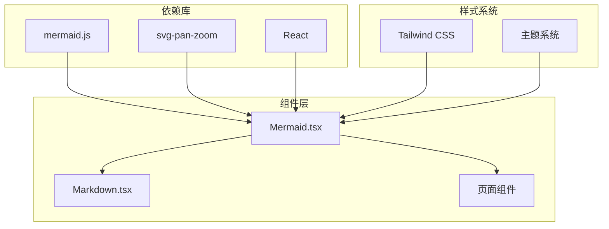

**图表来源**
- [Mermaid.tsx](file://src/components/Mermaid.tsx#L1-L491)
- [Markdown.tsx](file://src/components/Markdown.tsx#L1-L208)

**章节来源**
- [Mermaid.tsx](file://src/components/Mermaid.tsx#L1-L50)
- [package.json](file://package.json#L12-L23)

## 核心组件

### MermaidProps 接口定义

Mermaid 组件通过清晰的 Props 接口定义其外部接口：

```typescript
interface MermaidProps {
  chart: string;           // Mermaid 语法字符串
  className?: string;      // 自定义 CSS 类名
  zoomingEnabled?: boolean;// 是否启用缩放功能
}
```

### 主要状态管理

组件维护以下关键状态：
- `svg`: 渲染后的 SVG 字符串
- `error`: 错误信息（如果有）
- `isFullscreen`: 全屏模式状态
- `zoom`: 缩放级别（0.5-2.0）

**章节来源**
- [Mermaid.tsx](file://src/components/Mermaid.tsx#L172-L176)

## 架构概览

Mermaid 组件采用模块化架构设计，主要包含以下几个核心模块：

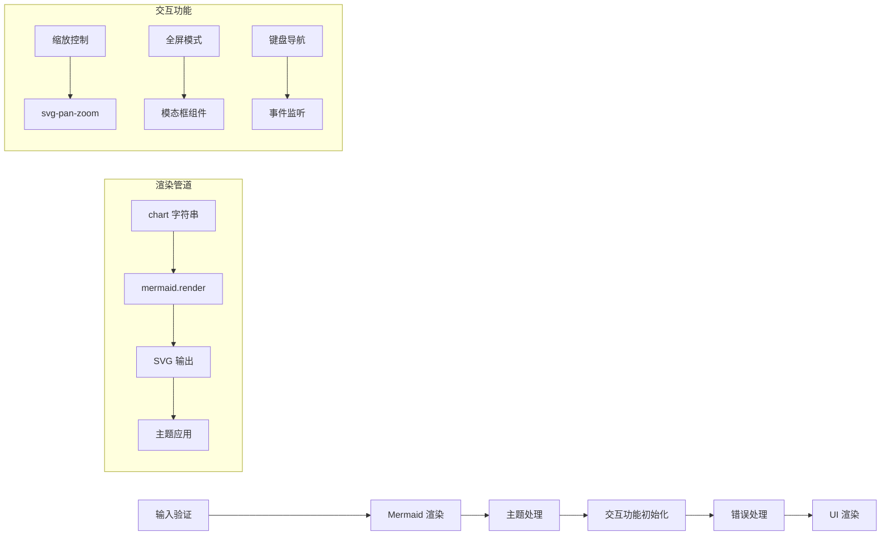

**图表来源**
- [Mermaid.tsx](file://src/components/Mermaid.tsx#L361-L400)
- [Mermaid.tsx](file://src/components/Mermaid.tsx#L319-L354)

## 详细组件分析

### 初始化配置

组件在启动时会进行详细的初始化配置，确保最佳的用户体验：

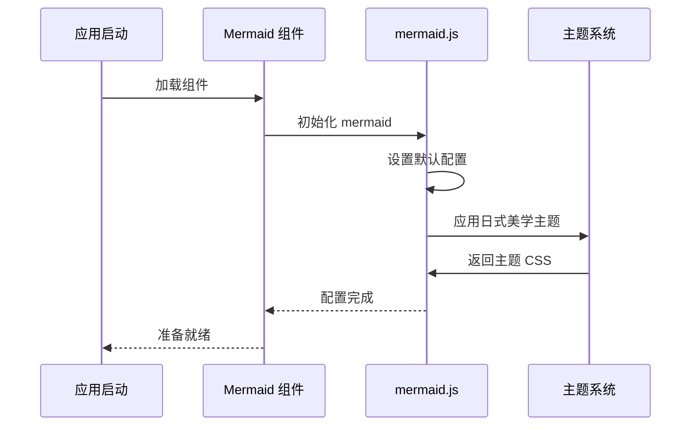

**图表来源**
- [Mermaid.tsx](file://src/components/Mermaid.tsx#L5-L170)

#### 关键配置选项

组件使用以下核心配置：

| 配置项 | 值 | 说明 |
|--------|-----|------|
| `startOnLoad` | `true` | 自动开始渲染 |
| `theme` | `'neutral'` | 使用中性主题 |
| `securityLevel` | `'loose'` | 松散安全级别 |
| `suppressErrorRendering` | `true` | 抑制错误渲染 |
| `logLevel` | `'error'` | 错误级别日志 |
| `maxTextSize` | `100000` | 最大文本大小 |
| `htmlLabels` | `true` | 启用 HTML 标签 |

### 渲染流程

Mermaid 组件的渲染流程是一个异步处理过程：

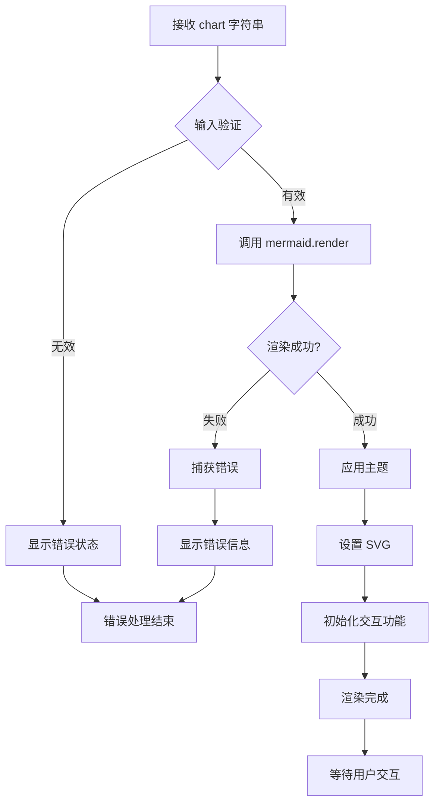

**图表来源**
- [Mermaid.tsx](file://src/components/Mermaid.tsx#L361-L400)

#### 主题系统实现

组件实现了完整的日式美学主题系统，包括：

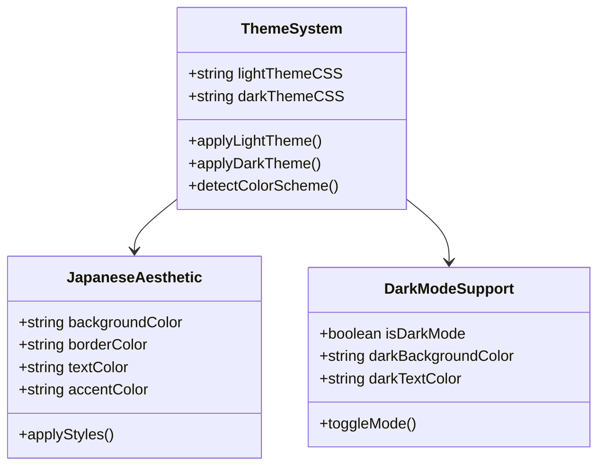

**图表来源**
- [Mermaid.tsx](file://src/components/Mermaid.tsx#L21-L167)

### 交互功能

#### 缩放控制

当启用缩放功能时，组件会动态导入 svg-pan-zoom 库：

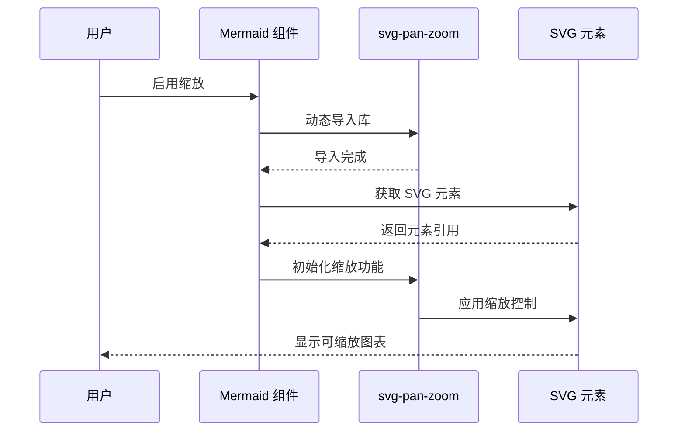

**图表来源**
- [Mermaid.tsx](file://src/components/Mermaid.tsx#L319-L354)

#### 全屏模态框

组件提供了完整的全屏模态框功能：

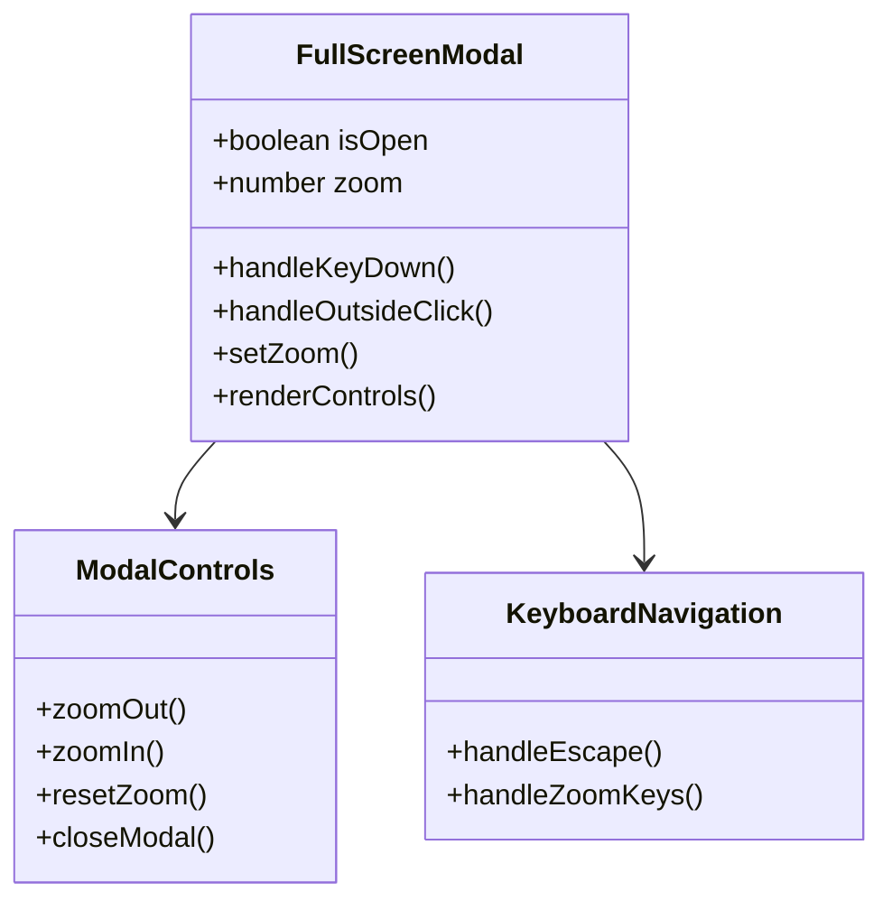

**图表来源**
- [Mermaid.tsx](file://src/components/Mermaid.tsx#L178-L304)

### 错误处理机制

组件实现了多层次的错误处理：

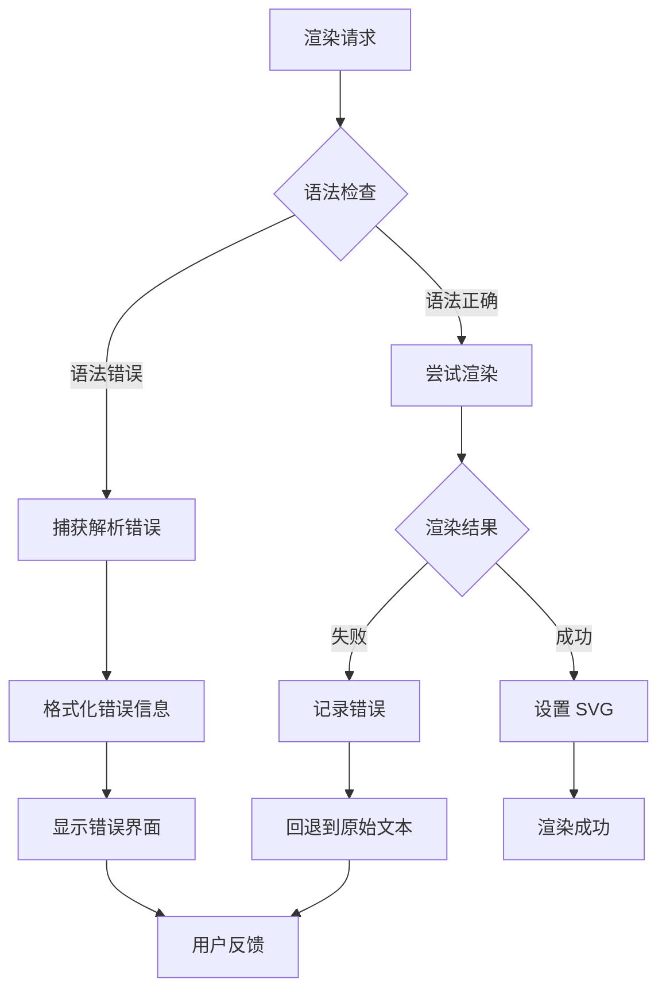

**图表来源**
- [Mermaid.tsx](file://src/components/Mermaid.tsx#L384-L400)

### 加载状态管理

组件提供了丰富的加载状态指示器：

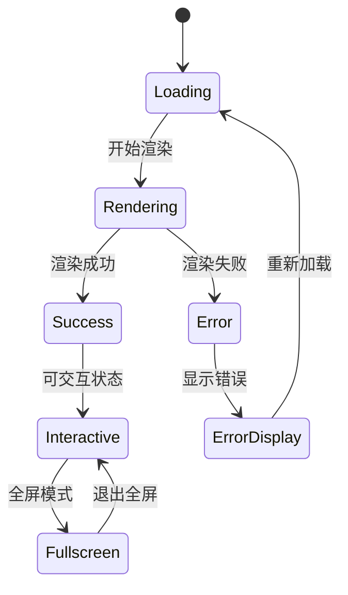

**章节来源**
- [Mermaid.tsx](file://src/components/Mermaid.tsx#L434-L444)
- [Mermaid.tsx](file://src/components/Mermaid.tsx#L415-L431)

## 依赖关系分析

### 外部依赖

组件依赖以下关键库：

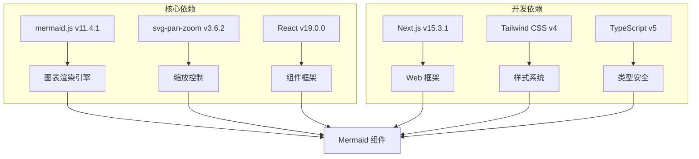

**图表来源**
- [package.json](file://package.json#L12-L23)
- [yarn.lock](file://yarn.lock#L3533-L3557)

### 内部集成

Mermaid 组件与 Markdown 组件的集成展示了良好的模块化设计：

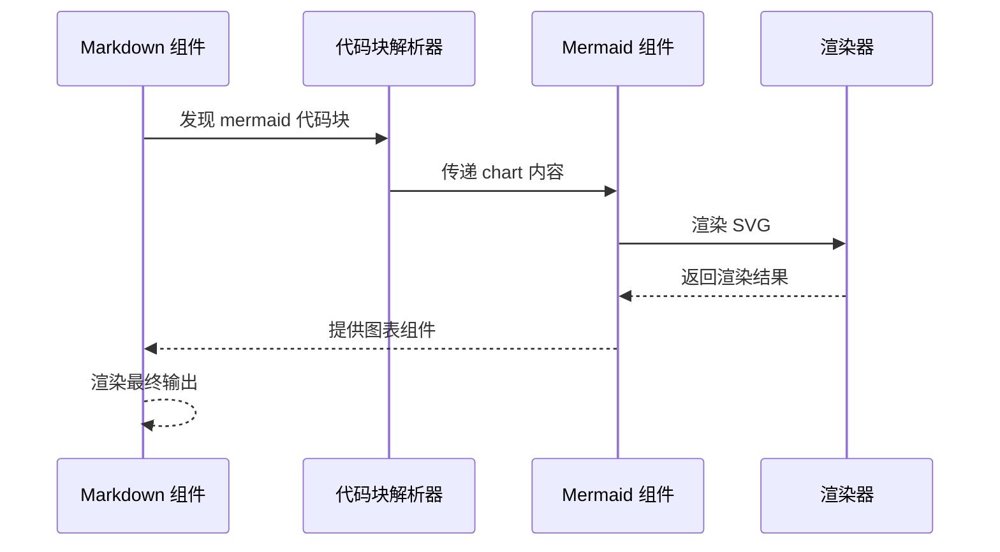

**图表来源**
- [Markdown.tsx](file://src/components/Markdown.tsx#L125-L135)

**章节来源**
- [package.json](file://package.json#L1-L39)
- [yarn.lock](file://yarn.lock#L3533-L3557)

## 性能考虑

### 动态导入优化

组件使用动态导入来优化包大小和加载性能：

- svg-pan-zoom 库仅在需要时加载
- 避免在不使用缩放功能时引入额外依赖
- 使用 setTimeout 延迟初始化以避免阻塞主线程

### 内存管理

组件实现了完善的内存清理机制：

- 组件卸载时清除事件监听器
- 使用 useRef 跟踪 DOM 引用
- 实现 isMounted 标志防止内存泄漏

### 渲染优化

- 使用 React.memo 避免不必要的重渲染
- SVG 内容直接注入，避免中间 DOM 操作
- 主题切换时智能更新而非重新渲染

## 故障排除指南

### 常见问题及解决方案

#### 渲染失败

**症状**: 图表无法显示，出现错误信息
**原因**: Mermaid 语法错误或超长文本
**解决方案**: 
- 检查 chart 字符串的语法正确性
- 确保文本长度不超过 100000 字符
- 查看浏览器控制台的详细错误信息

#### 缩放功能失效

**症状**: 启用缩放后图表无法交互
**原因**: svg-pan-zoom 库加载失败
**解决方案**:
- 检查网络连接是否正常
- 确认浏览器支持动态导入
- 查看控制台是否有加载错误

#### 主题显示异常

**症状**: 图表颜色不正确或主题不生效
**原因**: CSS 样式冲突或主题配置错误
**解决方案**:
- 检查自定义 CSS 是否影响主题
- 确认 data-theme 属性正确应用
- 验证主题 CSS 规则优先级

**章节来源**
- [Mermaid.tsx](file://src/components/Mermaid.tsx#L384-L400)
- [Mermaid.tsx](file://src/components/Mermaid.tsx#L330-L345)

## 结论

Mermaid 组件是 deepwiki-open 项目中的一个精心设计的可视化组件，它成功地将复杂的图表渲染需求转化为易于使用的 React 组件。该组件的主要优势包括：

### 技术亮点

1. **现代化架构**: 基于 React Hooks 和函数组件的设计
2. **性能优化**: 动态导入和延迟加载策略
3. **用户体验**: 完整的交互功能和错误处理
4. **可访问性**: 键盘导航和屏幕阅读器支持
5. **主题系统**: 日式美学和暗色模式支持

### 设计原则

- **单一职责**: 专注于图表渲染和交互
- **可扩展性**: 支持多种图表类型和配置
- **可维护性**: 清晰的代码结构和注释
- **兼容性**: 跨浏览器和设备支持

### 应用场景

该组件特别适用于：
- 技术文档中的架构图展示
- 代码仓库的流程图说明
- 学习材料中的概念图解
- 项目演示中的交互式图表

Mermaid 组件的成功实现展示了如何将复杂的第三方库与现代 React 应用无缝集成，为用户提供丰富而流畅的图表可视化体验。