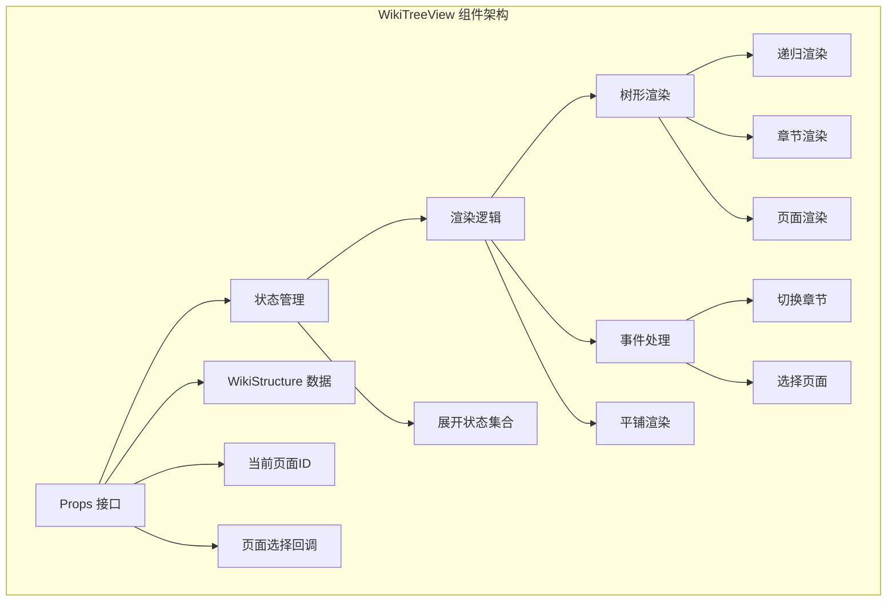
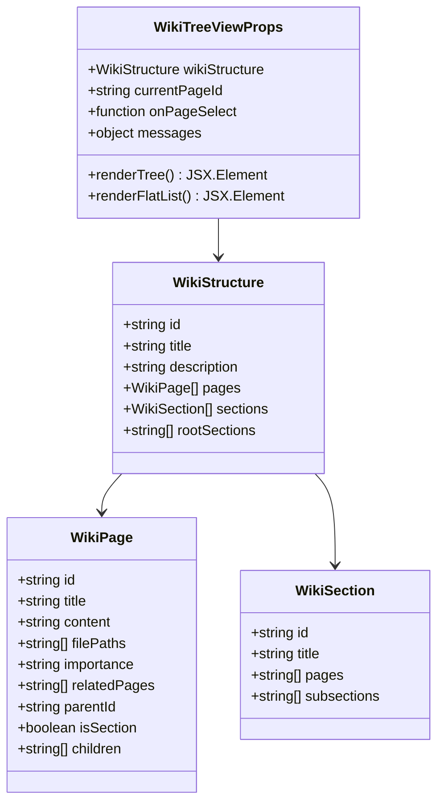
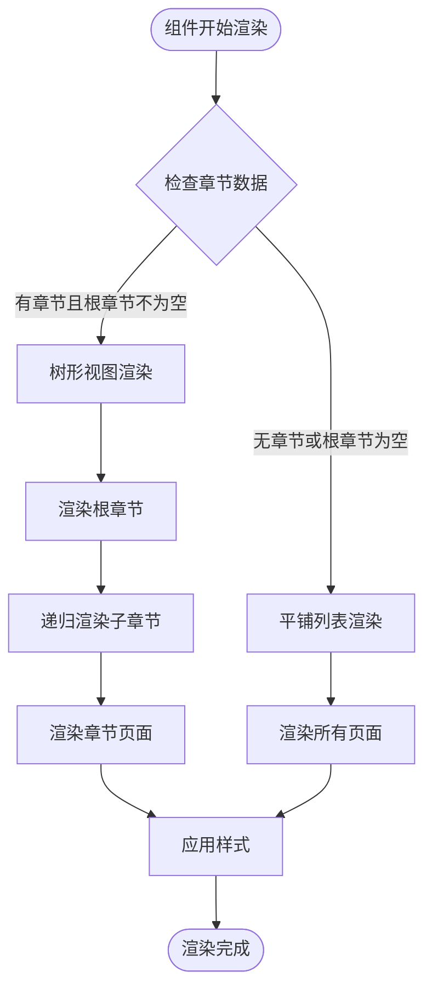
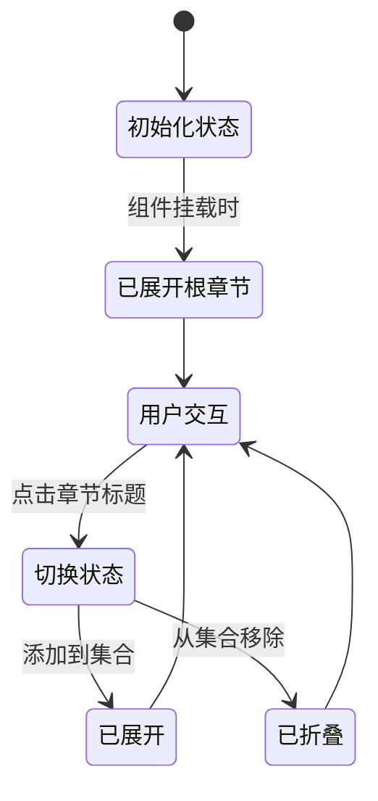
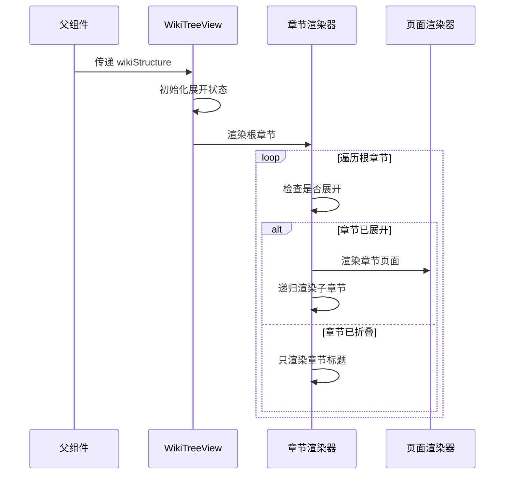
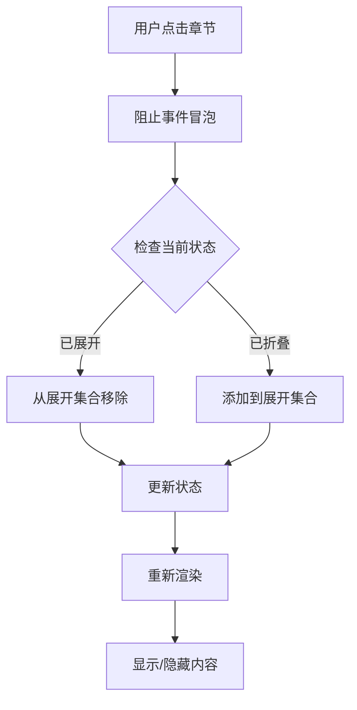
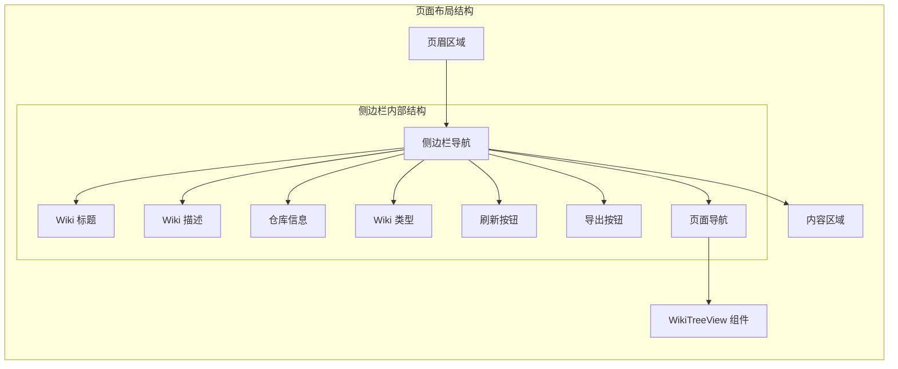
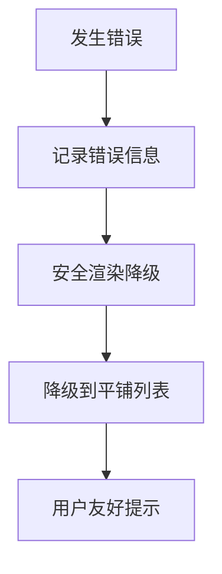

# WikiTreeView 组件

<cite>
**本文档中引用的文件**
- [WikiTreeView.tsx](file://src/components/WikiTreeView.tsx)
- [wikistructure.tsx](file://src/types/wiki/wikistructure.tsx)
- [wikipage.tsx](file://src/types/wiki/wikipage.tsx)
- [page.tsx](file://src/app/[owner]/[repo]/page.tsx)
- [globals.css](file://src/app/globals.css)
</cite>

## 目录
1. [简介](#简介)
2. [组件架构概览](#组件架构概览)
3. [Props 接口定义](#props-接口定义)
4. [数据模型详解](#数据模型详解)
5. [核心功能实现](#核心功能实现)
6. [状态管理机制](#状态管理机制)
7. [递归渲染逻辑](#递归渲染逻辑)
8. [交互逻辑设计](#交互逻辑设计)
9. [样式与视觉设计](#样式与视觉设计)
10. [在侧边栏导航中的应用](#在侧边栏导航中的应用)
11. [性能优化考虑](#性能优化考虑)
12. [故障排除指南](#故障排除指南)
13. [总结](#总结)

## 简介

WikiTreeView 是 deepwiki-open 项目中的核心导航组件，负责以树形结构动态展示代码仓库的目录层级。该组件提供了直观的层次化导航体验，支持展开/折叠操作，能够根据 WikiStructure 数据模型递归渲染复杂的文档结构。

组件的主要功能包括：
- 基于 WikiStructure 的树形结构渲染
- 动态展开/折叠章节功能
- 当前页面高亮显示
- 重要性等级的视觉标识（彩色圆点）
- 页面选择事件通知机制

## 组件架构概览

WikiTreeView 组件采用函数式组件设计，利用 React Hooks 进行状态管理，通过递归渲染实现复杂的树形结构展示。

**图表来源**
- [WikiTreeView.tsx](file://src/components/WikiTreeView.tsx#L35-L43)

## Props 接口定义

WikiTreeView 组件通过清晰的 Props 接口定义接收外部数据和回调函数：

**图表来源**
- [WikiTreeView.tsx](file://src/components/WikiTreeView.tsx#L35-L43)
- [wikistructure.tsx](file://src/types/wiki/wikistructure.tsx#L6-L11)
- [wikipage.tsx](file://src/types/wiki/wikipage.tsx#L2-L13)

**节来源**
- [WikiTreeView.tsx](file://src/components/WikiTreeView.tsx#L35-L43)

## 数据模型详解

### WikiStructure 核心数据结构

WikiStructure 是组件的核心数据模型，定义了整个 Wiki 的组织结构：

| 属性名 | 类型 | 描述 | 必需 |
|--------|------|------|------|
| `id` | string | Wiki 实例唯一标识符 | 是 |
| `title` | string | Wiki 显示标题 | 是 |
| `description` | string | Wiki 描述信息 | 是 |
| `pages` | WikiPage[] | 所有页面的列表 | 是 |
| `sections` | WikiSection[] | 章节列表 | 否 |
| `rootSections` | string[] | 根级别章节 ID 列表 | 否 |

### WikiPage 页面模型

每个 WikiPage 表示一个具体的文档页面：

| 属性名 | 类型 | 描述 | 默认值 |
|--------|------|------|------|
| `id` | string | 页面唯一标识符 | - |
| `title` | string | 页面标题 | - |
| `content` | string | 页面内容（Markdown 格式） | - |
| `filePaths` | string[] | 关联的源文件路径 | [] |
| `importance` | 'high' \| 'medium' \| 'low' | 重要性等级 | 'medium' |
| `relatedPages` | string[] | 相关页面 ID 列表 | [] |
| `parentId` | string? | 父章节 ID | - |
| `isSection` | boolean? | 是否为章节 | false |
| `children` | string[]? | 子页面 ID 列表 | [] |

### WikiSection 章节模型

WikiSection 定义了文档的层次结构：

| 属性名 | 类型 | 描述 | 必需 |
|--------|------|------|------|
| `id` | string | 章节唯一标识符 | 是 |
| `title` | string | 章节标题 | 是 |
| `pages` | string[] | 包含的页面 ID 列表 | 是 |
| `subsections` | string[]? | 子章节 ID 列表 | 否 |

**节来源**
- [wikistructure.tsx](file://src/types/wiki/wikistructure.tsx#L6-L11)
- [wikipage.tsx](file://src/types/wiki/wikipage.tsx#L2-L13)

## 核心功能实现

### 主要功能特性

WikiTreeView 组件实现了以下核心功能：

1. **智能降级渲染**：当没有定义章节时自动降级到平铺列表视图
2. **递归树形渲染**：支持多层级的章节嵌套结构
3. **动态状态管理**：实时响应用户交互的状态更新
4. **视觉反馈系统**：通过颜色和图标提供清晰的视觉指示

### 渲染策略

组件采用条件渲染策略，根据数据结构自动选择最适合的展示方式：

**图表来源**
- [WikiTreeView.tsx](file://src/components/WikiTreeView.tsx#L132-L181)

**节来源**
- [WikiTreeView.tsx](file://src/components/WikiTreeView.tsx#L132-L181)

## 状态管理机制

### 展开状态管理

组件使用 `useState` Hook 管理章节的展开状态，采用 Set 数据结构存储已展开的章节 ID：

**图表来源**
- [WikiTreeView.tsx](file://src/components/WikiTreeView.tsx#L50-L64)

### 状态更新机制

状态更新采用不可变更新模式，确保 React 的重新渲染机制正常工作：

| 操作类型 | 方法 | 描述 |
|----------|------|------|
| 初始设置 | `new Set(wikiStructure.rootSections)` | 设置初始展开状态 |
| 添加展开 | `newSet.add(sectionId)` | 将章节添加到展开集合 |
| 移除展开 | `newSet.delete(sectionId)` | 从展开集合中移除章节 |
| 状态同步 | `setExpandedSections(prev => {...})` | 使用函数式更新 |

**节来源**
- [WikiTreeView.tsx](file://src/components/WikiTreeView.tsx#L50-L64)

## 递归渲染逻辑

### 树形结构渲染流程

WikiTreeView 实现了复杂的递归渲染逻辑，支持无限层级的章节嵌套：

**图表来源**
- [WikiTreeView.tsx](file://src/components/WikiTreeView.tsx#L67-L129)

### 递归渲染实现细节

递归渲染函数 `renderSection` 负责处理章节的层级渲染：

| 参数 | 类型 | 描述 |
|------|------|------|
| `sectionId` | string | 当前处理的章节 ID |
| `level` | number | 当前章节的层级深度（默认 0） |

递归逻辑遵循以下原则：
1. **基础情况**：找到对应 ID 的章节对象
2. **递归情况**：处理章节包含的页面和子章节
3. **边界检查**：验证章节存在性和有效性

**节来源**
- [WikiTreeView.tsx](file://src/components/WikiTreeView.tsx#L67-L129)

## 交互逻辑设计

### 章节切换机制

组件实现了直观的章节切换交互，通过点击章节标题可以展开或折叠对应的子内容：

**图表来源**
- [WikiTreeView.tsx](file://src/components/WikiTreeView.tsx#L54-L64)

### 页面选择通知机制

当用户点击某个页面时，组件会通过 `onPageSelect` 回调通知父组件：

| 触发条件 | 处理动作 | 传递参数 |
|----------|----------|----------|
| 页面按钮点击 | 调用 onPageSelect 回调 | pageId (string) |
| 当前页面高亮 | 更新视觉状态 | currentPageId |

**节来源**
- [WikiTreeView.tsx](file://src/components/WikiTreeView.tsx#L54-L64)
- [WikiTreeView.tsx](file://src/components/WikiTreeView.tsx#L104)

## 样式与视觉设计

### 主题色彩系统

WikiTreeView 采用深色日式美学主题，支持明暗两种模式：

| 颜色变量 | 浅色模式值 | 深色模式值 | 用途 |
|----------|------------|------------|------|
| `--accent-primary` | `#9b7cb9` | `#9370db` | 主色调（软紫罗兰） |
| `--accent-secondary` | `#d7c4bb` | `#5d4037` | 辅助色调（软米色） |
| `--highlight` | `#e8927c` | `#e57373` | 强调色（软珊瑚） |
| `--background` | `#f8f4e6` | `#1a1a1a` | 背景色（温暖米白） |
| `--foreground` | `#333333` | `#f0f0f0` | 文本主色 |

### 重要性等级视觉标识

页面通过彩色圆点表示重要性等级：

| 重要性 | 颜色代码 | CSS 类 | 视觉效果 |
|--------|----------|--------|----------|
| 高 | `#9b7cb9` | `bg-[#9b7cb9]` | 深紫色，突出显示 |
| 中 | `#d7c4bb` | `bg-[#d7c4bb]` | 米色，常规显示 |
| 低 | `#e8927c` | `bg-[#e8927c]` | 橙红色，次要显示 |

### 交互状态样式

组件为不同状态提供了丰富的视觉反馈：

| 状态 | 样式类 | 效果 |
|------|--------|------|
| 当前页面 | `bg-[var(--accent-primary)]/20` | 主色调背景，半透明 |
| 悬停状态 | `hover:bg-[var(--background)]` | 背景颜色变化 |
| 禁用状态 | `disabled:opacity-50` | 半透明显示 |

**节来源**
- [globals.css](file://src/app/globals.css#L7-L31)
- [WikiTreeView.tsx](file://src/components/WikiTreeView.tsx#L109-L114)

## 在侧边栏导航中的应用

### 侧边栏集成架构

WikiTreeView 组件作为侧边栏导航的核心组件，在页面布局中占据重要位置：

**图表来源**
- [page.tsx](file://src/app/[owner]/[repo]/page.tsx#L2043-L2142)

### 侧边栏功能集成

WikiTreeView 与侧边栏其他组件协同工作，提供完整的导航体验：

| 组件模块 | 功能描述 | 与 WikiTreeView 的关系 |
|----------|----------|----------------------|
| 仓库信息显示 | 显示当前仓库的类型和链接 | 独立显示，提供上下文信息 |
| Wiki 类型指示器 | 显示综合版/简洁版状态 | 状态反馈，影响渲染模式 |
| 刷新按钮 | 允许重新生成 Wiki 内容 | 触发数据重新加载 |
| 导出功能 | 支持 Markdown 和 JSON 导出 | 提供内容导出选项 |

### 响应式布局适配

组件支持多种屏幕尺寸的响应式布局：

| 断点 | 宽度范围 | 导航宽度 | 适配策略 |
|------|----------|----------|----------|
| 移动端 | < 1024px | 100% | 单列布局，完整显示 |
| 平板端 | 1024px - 1280px | 280px | 固定宽度，侧边栏独立 |
| 桌面端 | > 1280px | 320px | 最大宽度限制，保持美观 |

**节来源**
- [page.tsx](file://src/app/[owner]/[repo]/page.tsx#L2043-L2142)

## 性能优化考虑

### 渲染性能优化

WikiTreeView 组件采用了多项性能优化策略：

1. **条件渲染优化**：根据数据结构选择最优渲染路径
2. **状态管理优化**：使用 Set 数据结构提高查找效率
3. **事件处理优化**：阻止不必要的事件冒泡
4. **样式计算优化**：使用 CSS 变量减少重复计算

### 内存使用优化

| 优化策略 | 实现方式 | 效果 |
|----------|----------|------|
| 状态最小化 | 只存储必要的展开状态 | 减少内存占用 |
| 对象引用稳定 | 避免在渲染过程中创建新对象 | 提高重渲染性能 |
| 条件渲染 | 根据数据状态选择渲染路径 | 减少 DOM 节点数量 |

### 大数据集处理

对于大型代码仓库，组件具备良好的扩展性：

- **懒加载支持**：可以通过分页或虚拟滚动进一步优化
- **状态持久化**：展开状态可以在页面刷新后保持
- **错误边界**：对无效数据进行安全处理

## 故障排除指南

### 常见问题及解决方案

| 问题症状 | 可能原因 | 解决方案 |
|----------|----------|----------|
| 章节无法展开 | `expandedSections` 状态未正确更新 | 检查 `toggleSection` 函数实现 |
| 页面高亮失效 | `currentPageId` 不匹配 | 验证传入的 `currentPageId` 值 |
| 样式异常 | CSS 变量未正确设置 | 检查主题配置和 CSS 变量定义 |
| 渲染空白 | `wikiStructure` 数据缺失 | 验证数据加载和初始化过程 |

### 调试技巧

1. **控制台日志**：组件会在关键节点输出调试信息
2. **数据验证**：检查 `wikiStructure` 的完整性和一致性
3. **状态追踪**：使用浏览器开发者工具监控状态变化
4. **网络请求**：验证数据获取的正确性

### 错误处理机制

组件内置了基本的错误处理能力：

**节来源**
- [WikiTreeView.tsx](file://src/components/WikiTreeView.tsx#L133-L134)
- [WikiTreeView.tsx](file://src/components/WikiTreeView.tsx#L174-L176)

## 总结

WikiTreeView 组件是 deepwiki-open 项目中导航系统的核心组件，它成功地解决了复杂文档结构的可视化展示问题。通过精心设计的数据模型、高效的递归渲染算法和直观的交互机制，该组件为用户提供了优秀的文档浏览体验。

### 主要优势

1. **灵活性**：支持树形和平铺两种渲染模式
2. **可扩展性**：良好的抽象设计便于功能扩展
3. **用户体验**：直观的交互和清晰的视觉反馈
4. **性能表现**：优化的渲染策略和状态管理
5. **主题适配**：完整的明暗主题支持

### 技术亮点

- **递归渲染**：优雅地处理多层级结构
- **状态管理**：高效的状态更新机制
- **响应式设计**：适应不同设备和屏幕尺寸
- **无障碍支持**：合理的语义化标记和键盘导航

WikiTreeView 组件不仅是一个功能完善的导航组件，更是现代 Web 应用中树形结构展示的最佳实践案例，为类似需求提供了宝贵的参考价值。