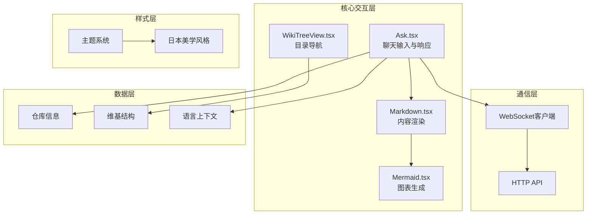
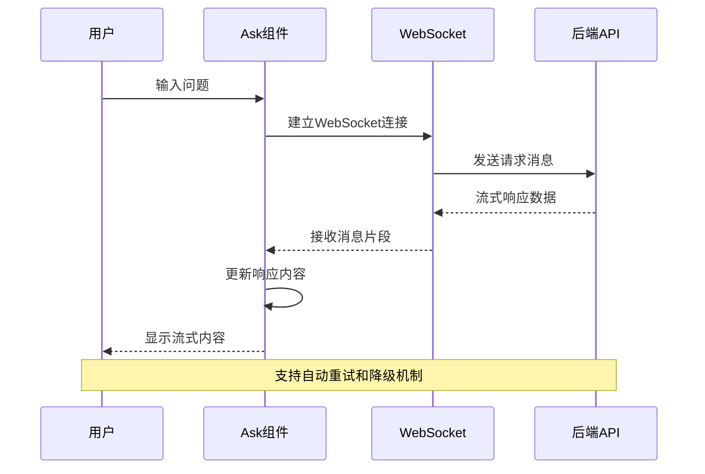
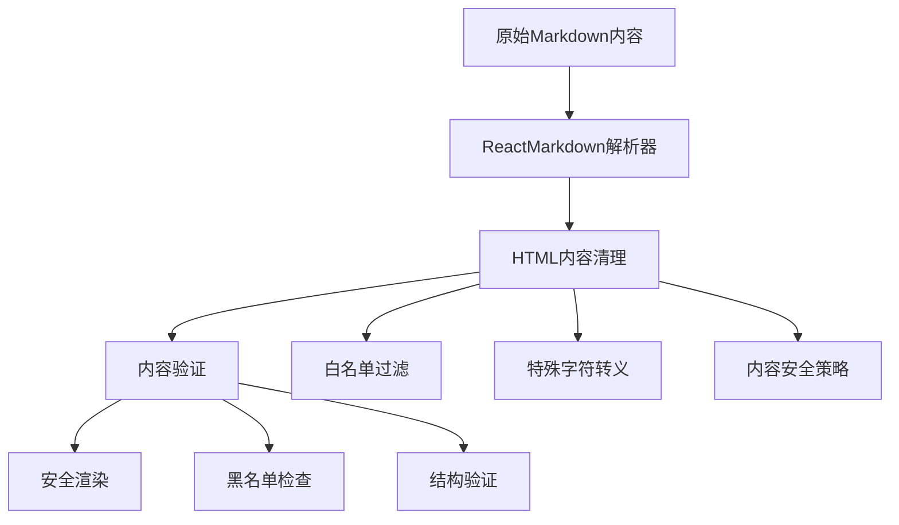
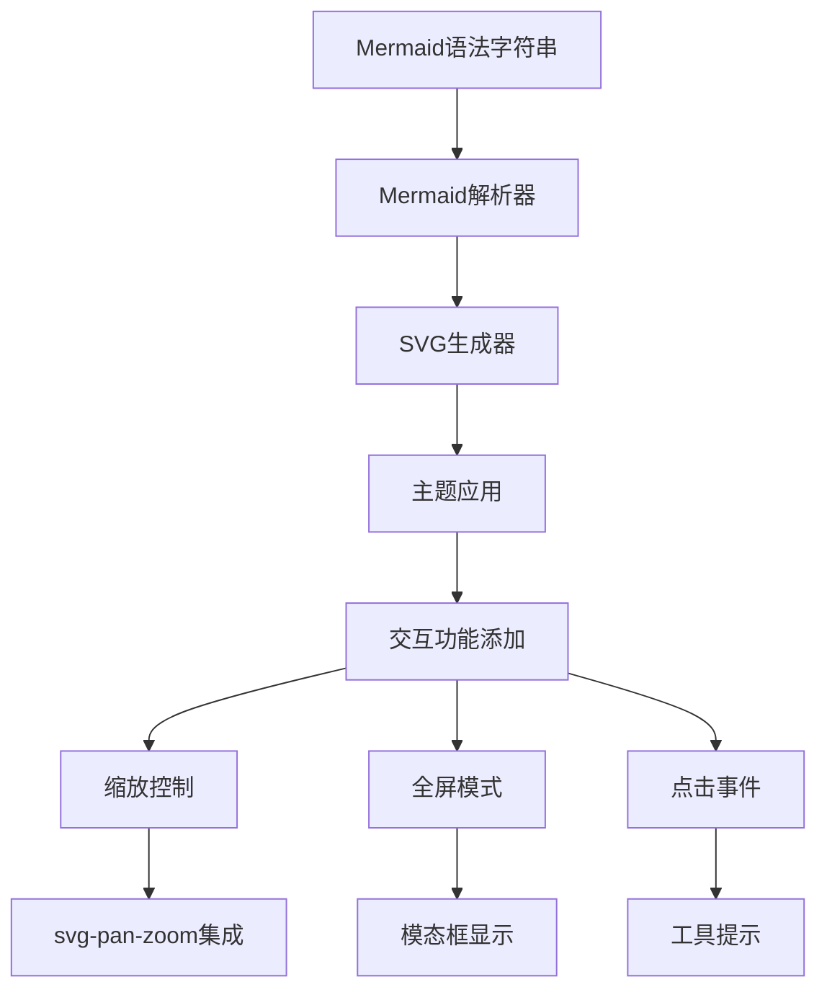
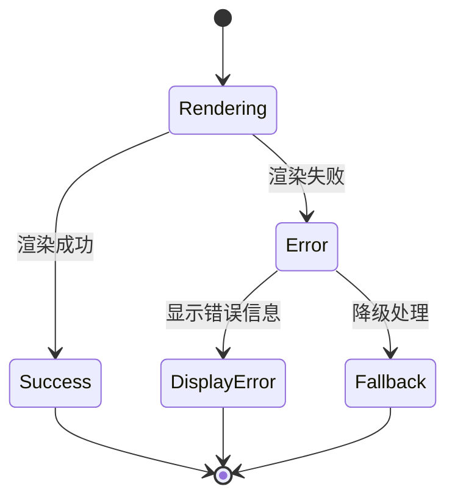
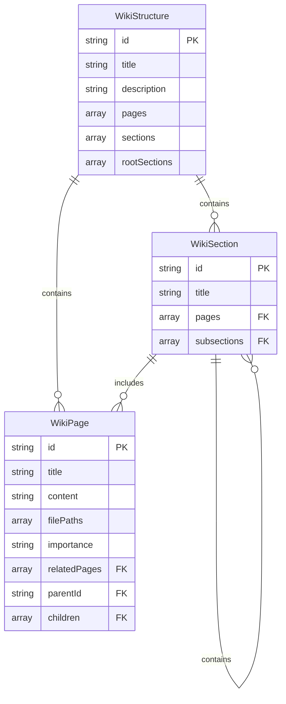
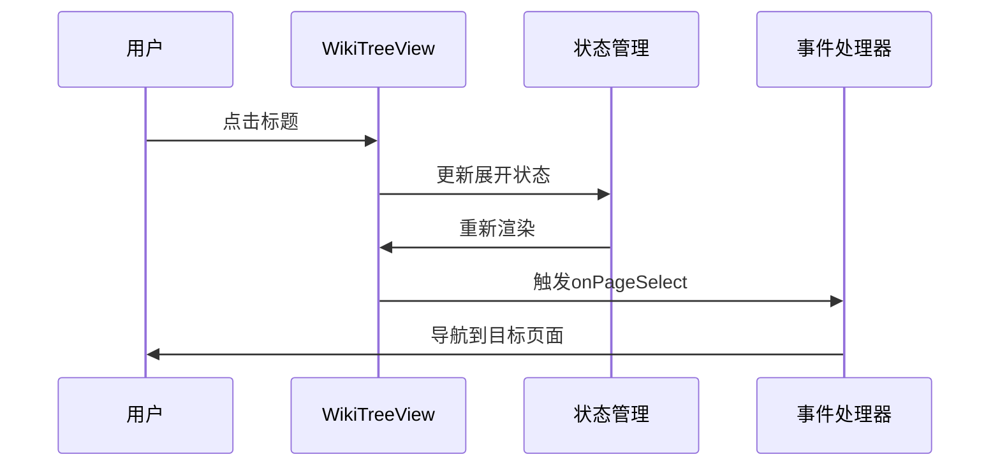
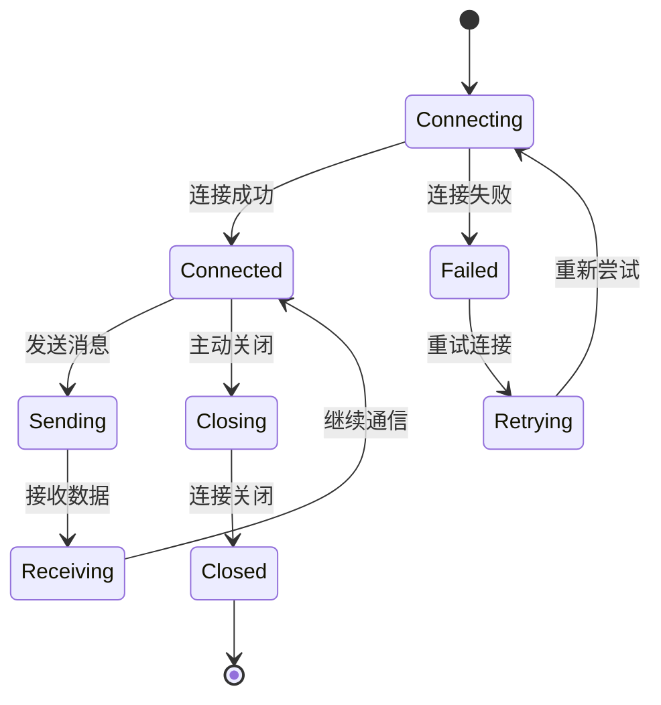

# 核心交互组件

<cite>
**本文档引用的文件**
- [Ask.tsx](file://src/components/Ask.tsx)
- [Markdown.tsx](file://src/components/Markdown.tsx)
- [Mermaid.tsx](file://src/components/Mermaid.tsx)
- [WikiTreeView.tsx](file://src/components/WikiTreeView.tsx)
- [websocketClient.ts](file://src/utils/websocketClient.ts)
- [wikistructure.tsx](file://src/types/wiki/wikistructure.tsx)
- [repoinfo.tsx](file://src/types/repoinfo.tsx)
- [globals.css](file://src/app/globals.css)
- [layout.tsx](file://src/app/layout.tsx)
</cite>

## 目录
1. [简介](#简介)
2. [项目架构概览](#项目架构概览)
3. [Ask.tsx - 实时聊天交互组件](#asktsx---实时聊天交互组件)
4. [Markdown.tsx - 安全Markdown渲染组件](#markdowntsx---安全markdown渲染组件)
5. [Mermaid.tsx - 可交互图表组件](#mermaidtsx---可交互图表组件)
6. [WikiTreeView.tsx - 动态目录树组件](#wikitreeviewtsx---动态目录树组件)
7. [WebSocket通信机制](#websocket通信机制)
8. [主题与可访问性设计](#主题与可访问性设计)
9. [性能优化策略](#性能优化策略)
10. [故障排除指南](#故障排除指南)
11. [总结](#总结)

## 简介

deepwiki-open是一个基于Next.js构建的智能代码库问答系统，其核心交互组件提供了流畅的用户体验和强大的功能特性。本文档详细介绍了四个核心组件：聊天输入框与流式响应的Ask.tsx、安全Markdown内容渲染的Markdown.tsx、可交互图表生成的Mermaid.tsx，以及动态目录导航的WikiTreeView.tsx。

这些组件采用现代化的React Hooks模式，集成了WebSocket实时通信、XSS防护、暗色主题支持等先进特性，为用户提供沉浸式的AI对话体验。

## 项目架构概览

deepwiki-open采用模块化的组件架构，核心交互组件位于`src/components/`目录下，通过清晰的接口定义和类型系统确保代码的可维护性和扩展性。



**图表来源**
- [Ask.tsx](file://src/components/Ask.tsx#L1-L50)
- [Markdown.tsx](file://src/components/Markdown.tsx#L1-L30)
- [Mermaid.tsx](file://src/components/Mermaid.tsx#L1-L50)
- [WikiTreeView.tsx](file://src/components/WikiTreeView.tsx#L1-L50)

## Ask.tsx - 实时聊天交互组件

Ask.tsx是系统的核心交互组件，实现了完整的聊天功能，包括实时输入、流式响应、深度研究模式和多轮对话管理。

### 核心功能特性

#### 1. 实时WebSocket通信
组件通过WebSocket实现实时AI对话，提供即时响应体验：



**图表来源**
- [Ask.tsx](file://src/components/Ask.tsx#L578-L620)
- [websocketClient.ts](file://src/utils/websocketClient.ts#L43-L85)

#### 2. 深度研究模式
支持多轮迭代的研究过程，自动分析并继续深入探索：

- **初始研究计划**：第一轮生成研究方案
- **迭代探索**：最多4轮的深度调查
- **最终结论**：综合所有迭代结果形成完整答案

#### 3. 多模型支持
集成多种AI提供商和模型选择：

```typescript
interface Model {
  id: string;
  name: string;
}

interface Provider {
  id: string;
  name: string;
  models: Model[];
  supportsCustomModel?: boolean;
}
```

### Props接口定义

| 属性名 | 类型 | 必需 | 描述 |
|--------|------|------|------|
| repoInfo | RepoInfo | 是 | 仓库信息对象 |
| provider | string | 否 | 默认AI提供商 |
| model | string | 否 | 默认模型名称 |
| isCustomModel | boolean | 否 | 是否使用自定义模型 |
| customModel | string | 否 | 自定义模型名称 |
| language | string | 否 | 语言设置 |
| onRef | (ref: { clearConversation: () => void }) => void | 否 | 父组件引用回调 |

### 事件回调机制

组件提供以下事件处理：

- **clearConversation**: 清空当前对话历史
- **onMessage**: 接收AI消息回调
- **onError**: 错误处理回调
- **onClose**: 连接关闭回调

### 可访问性设计

- **键盘导航**：支持Tab键焦点管理和快捷键操作
- **屏幕阅读器**：完善的ARIA标签和语义化标记
- **高对比度**：暗色主题下的良好可读性
- **响应式布局**：适配不同屏幕尺寸

**章节来源**
- [Ask.tsx](file://src/components/Ask.tsx#L36-L929)

## Markdown.tsx - 安全Markdown渲染组件

Markdown.tsx负责安全地渲染AI生成的Markdown内容，内置XSS防护和丰富的格式化选项。

### XSS防护机制

组件采用多层次的安全防护策略：



**图表来源**
- [Markdown.tsx](file://src/components/Markdown.tsx#L195-L208)

### 支持的Markdown元素

#### 1. 基础文本格式
- 标题层次：H1-H4
- 段落和换行
- 列表：有序和无序
- 引用块
- 表格支持

#### 2. 代码高亮
- 多语言语法高亮
- 代码复制功能
- 行号显示
- 可滚动容器

#### 3. Mermaid图表集成
自动识别并渲染Mermaid语法的图表：

```typescript
// Mermaid图表检测逻辑
if (!inline && match && match[1] === 'mermaid') {
  return <Mermaid chart={codeContent} />;
}
```

### 组件样式定制

组件提供丰富的样式定制选项：

| 元素类型 | 样式类名 | 主要属性 |
|----------|----------|----------|
| 段落 | `.prose p` | 行高1.5，字体大小14px |
| 标题 | `.prose h1-h4` | 不同的字体权重和间距 |
| 代码块 | `.prose pre` | 背景颜色、边框、阴影 |
| 表格 | `.prose table` | 边框、悬停效果、分隔线 |

### 可访问性特性

- **语义化标记**：正确的HTML元素使用
- **主题适配**：明暗主题下的颜色对比
- **字体可读性**：合适的行高和字间距
- **交互反馈**：链接悬停状态和点击效果

**章节来源**
- [Markdown.tsx](file://src/components/Markdown.tsx#L1-L208)

## Mermaid.tsx - 可交互图表组件

Mermaid.tsx将Mermaid语法文本转换为可交互的SVG图表，支持缩放、全屏查看和主题适配。

### 图表渲染流程



**图表来源**
- [Mermaid.tsx](file://src/components/Mermaid.tsx#L361-L407)

### 日本美学主题

组件内置了独特的日本美学风格主题：

#### 明亮模式配色
- **背景**：温暖米白色 (#f8f4e6)
- **主色调**：柔和紫藤 (#9b7cb9)
- **强调色**：软珊瑚 (#e8927c)
- **边框**：淡贝色 (#e0d8c8)

#### 暗色模式配色
- **背景**：深炭黑色 (#1a1a1a)
- **文字**：柔和白色 (#f0f0f0)
- **主色调**：淡薰衣草 (#9370db)
- **强调色**：软红色 (#e57373)

### 交互功能

#### 1. 缩放控制
- **鼠标滚轮**：平滑缩放
- **触摸手势**：移动端支持
- **缩放级别**：0.1-10倍范围

#### 2. 全屏模式
- **点击触发**：图表区域点击进入全屏
- **键盘控制**：ESC键退出
- **手势支持**：移动端滑动操作

#### 3. 点击事件
- **节点交互**：支持节点点击事件
- **链接跳转**：图表内链接导航
- **工具提示**：悬停显示详细信息

### 错误处理机制



**图表来源**
- [Mermaid.tsx](file://src/components/Mermaid.tsx#L384-L400)

### 性能优化

- **懒加载**：仅在需要时加载svg-pan-zoom库
- **缓存机制**：已渲染的图表缓存复用
- **异步渲染**：避免阻塞主线程
- **内存管理**：及时清理未使用的资源

**章节来源**
- [Mermaid.tsx](file://src/components/Mermaid.tsx#L1-L491)

## WikiTreeView.tsx - 动态目录树组件

WikiTreeView.tsx以树形结构动态展示代码仓库的目录层级，支持展开/折叠操作和智能导航。

### 数据结构设计

组件基于清晰的数据结构组织内容：



**图表来源**
- [WikiTreeView.tsx](file://src/components/WikiTreeView.tsx#L7-L33)
- [wikistructure.tsx](file://src/types/wiki/wikistructure.tsx#L6-L11)

### 树形导航功能

#### 1. 层级展开控制
- **递归渲染**：支持任意深度的嵌套结构
- **状态管理**：独立的展开/折叠状态
- **批量操作**：一键展开或折叠所有节点

#### 2. 导航指示
- **当前页面高亮**：视觉突出显示选中项
- **重要性标识**：不同颜色表示页面重要性
- **面包屑导航**：显示当前位置路径

#### 3. 智能分类
根据页面的重要性进行视觉区分：

| 重要性等级 | 颜色标识 | 描述 |
|------------|----------|------|
| high | #9b7cb9 | 关键文档，核心功能说明 |
| medium | #d7c4bb | 一般文档，辅助说明 |
| low | #e8927c | 辅助文档，参考资料 |

### 交互设计



**图表来源**
- [WikiTreeView.tsx](file://src/components/WikiTreeView.tsx#L54-L64)

### 响应式设计

- **自适应宽度**：根据容器大小调整布局
- **触摸友好**：大按钮区域支持移动设备
- **键盘导航**：Tab键顺序和方向键导航
- **无障碍访问**：ARIA标签和语义化结构

### 性能考虑

- **虚拟滚动**：大量页面时的性能优化
- **延迟渲染**：非可见区域的延迟加载
- **记忆化**：重复计算的结果缓存
- **事件委托**：减少事件监听器数量

**章节来源**
- [WikiTreeView.tsx](file://src/components/WikiTreeView.tsx#L1-L184)

## WebSocket通信机制

deepwiki-open采用WebSocket技术实现实时通信，提供比传统HTTP更好的性能和用户体验。

### WebSocket连接管理



**图表来源**
- [websocketClient.ts](file://src/utils/websocketClient.ts#L43-L85)

### 请求数据结构

WebSocket通信使用标准化的消息格式：

```typescript
interface ChatCompletionRequest {
  repo_url: string;
  messages: ChatMessage[];
  filePath?: string;
  token?: string;
  type?: string;
  provider?: string;
  model?: string;
  language?: string;
  excluded_dirs?: string;
  excluded_files?: string;
}

interface ChatMessage {
  role: 'user' | 'assistant' | 'system';
  content: string;
}
```

### 错误处理策略

组件实现了完善的错误处理机制：

1. **连接失败**：自动降级到HTTP流式API
2. **消息丢失**：重连后恢复对话状态
3. **网络中断**：智能重试和状态同步
4. **服务器错误**：友好的错误提示和用户引导

### 性能优化

- **连接池管理**：复用WebSocket连接
- **消息队列**：批量发送待处理消息
- **心跳检测**：保持连接活跃状态
- **压缩传输**：减少网络带宽占用

**章节来源**
- [websocketClient.ts](file://src/utils/websocketClient.ts#L1-L86)

## 主题与可访问性设计

deepwiki-open采用日本美学风格的主题设计，同时确保良好的可访问性支持。

### 日本美学主题系统

#### 色彩体系
- **主色调**：柔和的紫藤色 (#9b7cb9) 和软珊瑚色 (#e8927c)
- **背景色**：温暖的米白色 (#f8f4e6) 和深炭黑色 (#1a1a1a)
- **文字色**：软黑 (#333333) 和柔和白 (#f0f0f0)
- **强调色**：淡薰衣草 (#9370db) 和软红色 (#e57373)

#### 字体系统
- **主字体**：Noto Sans JP，提供日文原生支持
- **衬线字体**：Noto Serif JP，用于标题和强调文本
- **等宽字体**：Geist Mono，适合代码展示

#### 视觉效果
- **阴影系统**：微妙的投影效果，营造立体感
- **渐变动画**：平滑的颜色过渡
- **纸张纹理**：背景上的细微纹理图案

### 可访问性特性

#### 1. 视觉可访问性
- **高对比度**：确保文本与背景的足够对比度
- **字体可读性**：合适的字号和行高
- **色彩无关信息**：不依赖颜色传递重要信息

#### 2. 键盘导航
- **Tab顺序**：合理的焦点顺序
- **快捷键**：常用功能的键盘绑定
- **焦点指示**：清晰的焦点状态显示

#### 3. 屏幕阅读器支持
- **ARIA标签**：语义化的角色和属性
- **替代文本**：图片和图标的内容描述
- **状态通知**：动态内容变化的通知

#### 4. 移动设备适配
- **触摸目标**：符合最小触摸区域要求
- **手势支持**：自然的手势操作
- **响应式布局**：适应不同屏幕尺寸

### 暗色主题支持

组件完全支持暗色主题，通过CSS变量实现无缝切换：

```css
[data-theme="dark"] {
  --background: #1a1a1a;
  --foreground: #f0f0f0;
  --accent-primary: #9370db;
  --card-bg: #222222;
}
```

**章节来源**
- [globals.css](file://src/app/globals.css#L1-L149)
- [layout.tsx](file://src/app/layout.tsx#L1-L50)

## 性能优化策略

deepwiki-open在多个层面实施性能优化，确保流畅的用户体验。

### 组件级优化

#### 1. React.memo优化
关键组件使用React.memo防止不必要的重渲染：

```typescript
// Ask组件的性能优化示例
const MemoizedAsk = memo(Ask, (prevProps, nextProps) => {
  return prevProps.repoInfo === nextProps.repoInfo &&
         prevProps.provider === nextProps.provider;
});
```

#### 2. 懒加载机制
- **图表组件**：Mermaid图表按需加载
- **主题切换**：主题相关的样式动态导入
- **国际化**：语言包的条件加载

#### 3. 内存管理
- **事件清理**：及时移除不再需要的事件监听器
- **定时器管理**：清理过期的setTimeout和setInterval
- **WebSocket连接**：组件卸载时正确关闭连接

### 网络层优化

#### 1. 连接复用
- **WebSocket池**：多个请求共享同一连接
- **HTTP/2支持**：利用多路复用减少延迟
- **请求合并**：相似请求的批处理

#### 2. 缓存策略
- **响应缓存**：相同查询结果的本地缓存
- **静态资源**：CDN加速和长期缓存
- **预取机制**：预测性资源加载

### 渲染性能

#### 1. 虚拟化
- **长列表**：只渲染可见区域的项目
- **大数据集**：分页和增量加载
- **复杂图表**：Canvas渲染优化

#### 2. 批量更新
- **状态合并**：连续的状态变更合并
- **DOM操作**：减少直接的DOM修改
- **动画优化**：使用CSS变换而非布局属性

## 故障排除指南

### 常见问题及解决方案

#### 1. WebSocket连接失败
**症状**：聊天输入框无法发送消息，出现"WebSocket连接失败"错误

**解决方案**：
- 检查网络连接和防火墙设置
- 验证服务器WebSocket端点可用性
- 查看浏览器开发者工具中的网络面板
- 尝试刷新页面或清除浏览器缓存

#### 2. Markdown渲染异常
**症状**：Markdown内容显示不正确或包含恶意脚本

**解决方案**：
- 确认Markdown内容经过适当的XSS过滤
- 检查语法格式是否正确
- 验证自定义组件的实现
- 查看控制台中的JavaScript错误

#### 3. Mermaid图表渲染失败
**症状**：Mermaid语法图表无法正常显示

**解决方案**：
- 验证Mermaid语法的正确性
- 检查浏览器对SVG的支持
- 确认主题配置的完整性
- 查看错误控制台中的具体错误信息

#### 4. WikiTreeView导航问题
**症状**：目录树无法正常展开或页面跳转失效

**解决方案**：
- 检查Wiki结构数据的完整性
- 验证页面ID的唯一性
- 确认事件处理器的正确绑定
- 查看浏览器控制台的错误日志

### 调试技巧

#### 1. 开发者工具使用
- **Network面板**：监控WebSocket连接和HTTP请求
- **Console面板**：查看JavaScript错误和警告
- **Elements面板**：检查DOM结构和样式应用
- **Application面板**：查看本地存储和缓存状态

#### 2. 日志记录
组件内置了详细的日志记录功能：

```typescript
// WebSocket连接状态日志
console.log('WebSocket connection established');
console.error('WebSocket error:', error);

// 渲染过程日志
console.log("WikiTreeView: Rendering tree view with sections:", wikiStructure.sections);
```

#### 3. 性能监控
- 使用浏览器的Performance面板分析渲染时间
- 监控内存使用情况，避免内存泄漏
- 检查CPU使用率，优化复杂的计算逻辑

### 最佳实践建议

#### 1. 开发阶段
- 使用TypeScript确保类型安全
- 启用严格模式发现潜在问题
- 定期运行自动化测试
- 使用代码质量工具检查代码规范

#### 2. 生产环境
- 启用生产模式的错误边界
- 配置适当的错误报告机制
- 监控关键性能指标
- 定期备份和版本控制

## 总结

deepwiki-open的核心交互组件展现了现代Web应用开发的最佳实践。通过精心设计的架构和先进的技术栈，这些组件不仅提供了出色的用户体验，还确保了系统的可维护性和扩展性。

### 技术亮点

1. **实时通信**：基于WebSocket的即时响应，提升用户参与度
2. **安全渲染**：多重XSS防护机制，保障内容安全
3. **主题系统**：日本美学风格的视觉设计，支持明暗主题切换
4. **可访问性**：全面的无障碍支持，服务更广泛的用户群体
5. **性能优化**：多层次的性能优化策略，确保流畅体验

### 架构优势

- **模块化设计**：清晰的组件边界和职责分离
- **类型安全**：完整的TypeScript类型定义
- **状态管理**：合理的状态管理模式
- **错误处理**：健壮的错误处理和恢复机制

### 未来发展方向

随着技术的不断发展，这些核心组件可以进一步优化和扩展：

- **AI能力增强**：集成更先进的自然语言处理技术
- **多媒体支持**：扩展对音频、视频内容的处理能力
- **离线功能**：增强离线状态下的可用性
- **个性化体验**：基于用户行为的个性化推荐

通过持续的技术创新和用户体验优化，deepwiki-open将继续为用户提供卓越的智能代码库问答体验。