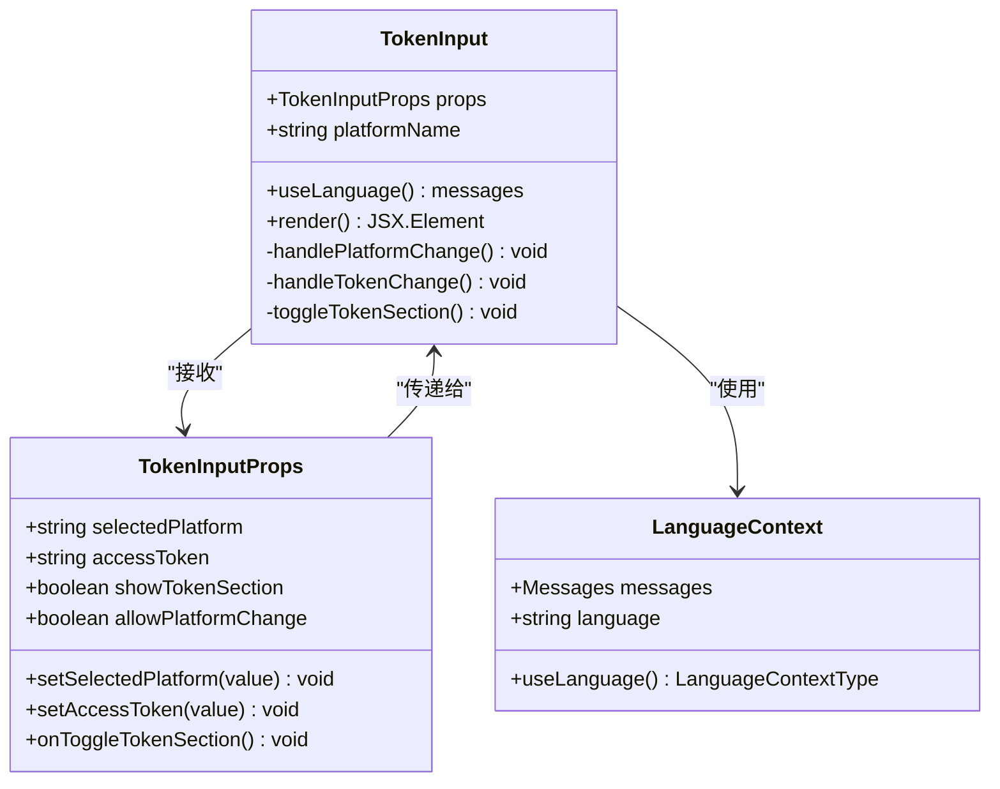
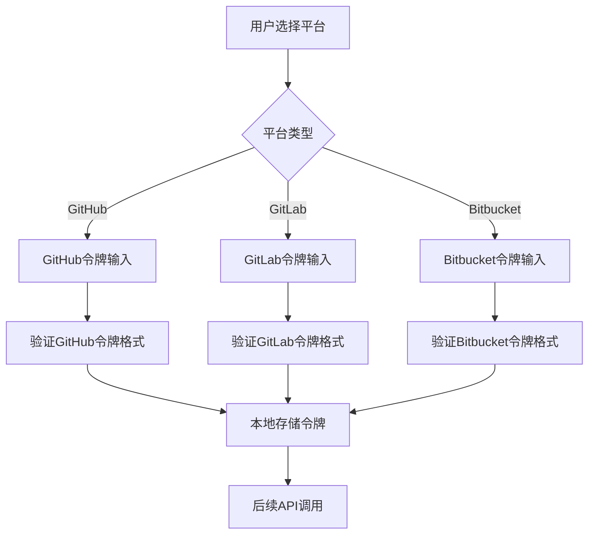
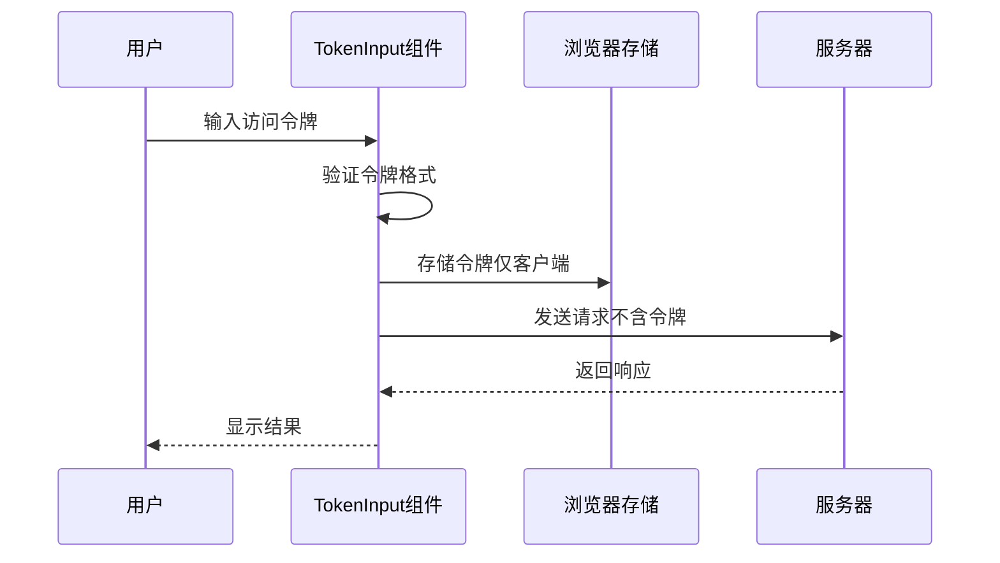
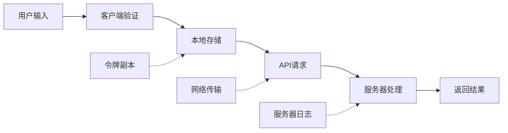
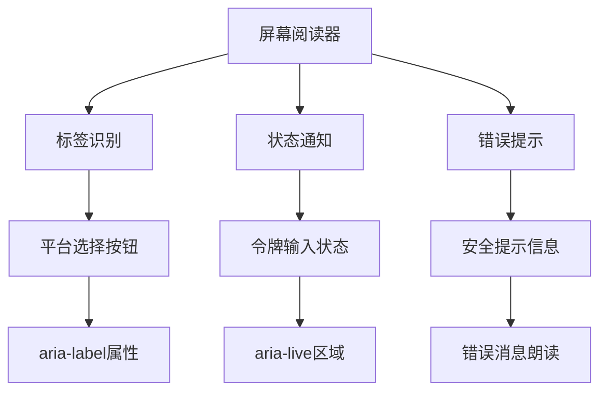
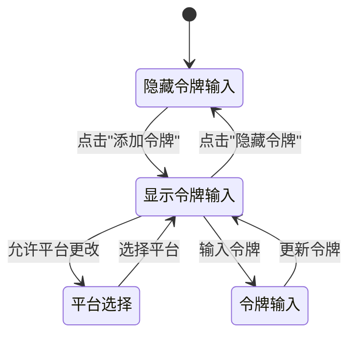

# 令牌输入组件

<cite>
**本文档中引用的文件**
- [TokenInput.tsx](file://src/components/TokenInput.tsx)
- [ConfigurationModal.tsx](file://src/components/ConfigurationModal.tsx)
- [ModelSelectionModal.tsx](file://src/components/ModelSelectionModal.tsx)
- [LanguageContext.tsx](file://src/contexts/LanguageContext.tsx)
- [globals.css](file://src/app/globals.css)
- [page.tsx](file://src/app/page.tsx)
- [repoinfo.tsx](file://src/types/repoinfo.tsx)
</cite>

## 目录
1. [简介](#简介)
2. [组件架构](#组件架构)
3. [Props接口定义](#props接口定义)
4. [平台支持](#平台支持)
5. [安全特性](#安全特性)
6. [可访问性设计](#可访问性设计)
7. [状态管理](#状态管理)
8. [使用示例](#使用示例)
9. [样式系统](#样式系统)
10. [最佳实践](#最佳实践)

## 简介

TokenInput组件是deepwiki-open项目中的核心认证组件，专门用于安全处理用户在GitHub、GitLab和Bitbucket平台上的个人访问令牌输入。该组件采用现代化的React设计模式，提供了直观的用户界面和强大的安全性保障，确保用户的敏感信息不会被发送到服务器。

## 组件架构

TokenInput组件采用了函数式组件的设计模式，结合React Hooks进行状态管理，实现了高度的可复用性和可维护性。



**图表来源**
- [TokenInput.tsx](file://src/components/TokenInput.tsx#L6-L14)
- [LanguageContext.tsx](file://src/contexts/LanguageContext.tsx#L7-L13)

**章节来源**
- [TokenInput.tsx](file://src/components/TokenInput.tsx#L1-L108)

## Props接口定义

TokenInput组件通过严格的类型定义确保了组件的类型安全和易用性：

| 属性名 | 类型 | 必需 | 默认值 | 描述 |
|--------|------|------|--------|------|
| `selectedPlatform` | `'github' \| 'gitlab' \| 'bitbucket'` | 是 | - | 当前选中的代码托管平台 |
| `setSelectedPlatform` | `(value: 'github' \| 'gitlab' \| 'bitbucket') => void` | 是 | - | 更新当前平台的选择状态 |
| `accessToken` | `string` | 是 | - | 用户输入的访问令牌 |
| `setAccessToken` | `(value: string) => void` | 是 | - | 更新访问令牌的状态 |
| `showTokenSection` | `boolean` | 否 | `true` | 控制令牌输入区域的显示状态 |
| `onToggleTokenSection` | `() => void` | 否 | - | 切换令牌输入区域显示的回调函数 |
| `allowPlatformChange` | `boolean` | 否 | `true` | 是否允许用户切换平台 |

**章节来源**
- [TokenInput.tsx](file://src/components/TokenInput.tsx#L6-L14)

## 平台支持

TokenInput组件支持三大主流代码托管平台，每个平台都有其特定的令牌格式和使用场景：



**图表来源**
- [TokenInput.tsx](file://src/components/TokenInput.tsx#L49-L78)

### GitHub集成
- 支持个人访问令牌（Personal Access Token）
- 兼容细粒度令牌（Fine-grained Tokens）
- 自动检测令牌权限范围

### GitLab集成  
- 支持个人访问令牌
- 支持项目访问令牌
- 支持组级访问令牌

### Bitbucket集成
- 支持应用密码（App Passwords）
- 支持个人访问令牌
- 支持工作区级令牌

**章节来源**
- [TokenInput.tsx](file://src/components/TokenInput.tsx#L49-L78)

## 安全特性

### 本地存储机制

TokenInput组件的核心安全特性在于其完全本地化的令牌存储策略：



**图表来源**
- [TokenInput.tsx](file://src/components/TokenInput.tsx#L87-L92)
- [page.tsx](file://src/app/page.tsx#L346-L350)

### 安全声明

组件在界面上明确告知用户：
- **令牌完全本地存储**：不会发送到任何服务器
- **隐私保护**：用户的认证凭据仅保存在浏览器中
- **会话隔离**：不同会话间令牌相互独立

### 数据流安全



**章节来源**
- [TokenInput.tsx](file://src/components/TokenInput.tsx#L101)
- [page.tsx](file://src/app/page.tsx#L346-L350)

## 可访问性设计

TokenInput组件遵循Web可访问性指南（WCAG）标准，确保所有用户都能有效使用：

### 键盘导航支持

- **Tab键导航**：支持标准的键盘焦点顺序
- **Enter/Space激活**：按钮和切换功能可通过键盘触发
- **Esc键退出**：模态对话框可通过ESC键关闭

### 屏幕阅读器优化



**图表来源**
- [TokenInput.tsx](file://src/components/TokenInput.tsx#L32-L38)
- [TokenInput.tsx](file://src/components/TokenInput.tsx#L84-L92)

### 语义化标记

组件使用语义化的HTML元素：
- `<label>` 标签关联输入字段
- `<button>` 按钮提供明确的功能描述
- `<input type="password">` 确保敏感信息的安全输入

**章节来源**
- [TokenInput.tsx](file://src/components/TokenInput.tsx#L32-L38)
- [TokenInput.tsx](file://src/components/TokenInput.tsx#L84-L92)

## 状态管理

TokenInput组件采用React Hooks进行状态管理，实现了高效且可预测的状态更新：



**图表来源**
- [TokenInput.tsx](file://src/components/TokenInput.tsx#L31-L40)
- [TokenInput.tsx](file://src/components/TokenInput.tsx#L41-L107)

### 状态同步机制

组件通过props回调函数实现父子组件间的双向数据绑定：

| 状态类型 | 管理方式 | 同步机制 |
|----------|----------|----------|
| 平台选择 | 外部状态管理 | `setSelectedPlatform` |
| 令牌内容 | 外部状态管理 | `setAccessToken` |
| 显示状态 | 外部控制 | `showTokenSection` |
| 交互行为 | 外部控制 | `onToggleTokenSection` |

**章节来源**
- [TokenInput.tsx](file://src/components/TokenInput.tsx#L16-L24)

## 使用示例

### 基础用法

以下展示了TokenInput组件在实际项目中的典型使用模式：

```typescript
// 基本配置示例
const BasicTokenExample = () => {
  const [selectedPlatform, setSelectedPlatform] = useState<'github'>('github');
  const [accessToken, setAccessToken] = useState('');
  const [showTokenSection, setShowTokenSection] = useState(true);

  return (
    <TokenInput
      selectedPlatform={selectedPlatform}
      setSelectedPlatform={setSelectedPlatform}
      accessToken={accessToken}
      setAccessToken={setAccessToken}
      showTokenSection={showTokenSection}
      onToggleTokenSection={() => setShowTokenSection(!showTokenSection)}
      allowPlatformChange={true}
    />
  );
};
```

### 在配置模态框中的使用

```typescript
// ConfigurationModal中的集成示例
const ConfigurationModal = ({ isOpen, onClose }) => {
  const [selectedPlatform, setSelectedPlatform] = useState('github');
  const [accessToken, setAccessToken] = useState('');
  const [showTokenSection, setShowTokenSection] = useState(true);

  return (
    <div>
      {/* 其他配置选项 */}
      
      {/* 令牌输入部分 */}
      <TokenInput
        selectedPlatform={selectedPlatform}
        setSelectedPlatform={setSelectedPlatform}
        accessToken={accessToken}
        setAccessToken={setAccessToken}
        showTokenSection={showTokenSection}
        onToggleTokenSection={() => setShowTokenSection(!showTokenSection)}
        allowPlatformChange={true}
      />
      
      {/* 提交按钮等其他内容 */}
    </div>
  );
};
```

### 在刷新流程中的使用

```typescript
// ModelSelectionModal中的特殊用法
const ModelSelectionModal = ({}) => {
  const [localSelectedPlatform, setLocalSelectedPlatform] = useState('github');
  const [localAccessToken, setLocalAccessToken] = useState('');
  const [showTokenSection, setShowTokenSection] = useState(true);

  return (
    <div>
      {/* 分隔线 */}
      <div className="my-4 border-t border-[var(--border-color)]/30"></div>
      
      {/* 令牌输入（禁用平台切换） */}
      <TokenInput
        selectedPlatform={localSelectedPlatform}
        setSelectedPlatform={setLocalSelectedPlatform}
        accessToken={localAccessToken}
        setAccessToken={setLocalAccessToken}
        showTokenSection={showTokenSection}
        onToggleTokenSection={() => setShowTokenSection(!showTokenSection)}
        allowPlatformChange={false} // 刷新时不允许更改平台
      />
    </div>
  );
};
```

**章节来源**
- [ConfigurationModal.tsx](file://src/components/ConfigurationModal.tsx#L234-L243)
- [ModelSelectionModal.tsx](file://src/components/ModelSelectionModal.tsx#L196-L204)

## 样式系统

TokenInput组件采用基于CSS变量的主题系统，确保与整体应用设计的一致性：

### 主题色彩映射

| CSS变量 | 浅色主题 | 深色主题 | 用途 |
|---------|----------|----------|------|
| `--accent-primary` | `#9b7cb9` | `#9370db` | 主要强调色 |
| `--accent-secondary` | `#d7c4bb` | `#5d4037` | 次要强调色 |
| `--border-color` | `#e0d8c8` | `#2c2c2c` | 边框颜色 |
| `--background` | `#f8f4e6` | `#1a1a1a` | 背景颜色 |
| `--foreground` | `#333333` | `#f0f0f0` | 文本颜色 |
| `--muted` | `#a59e8c` | `#8c8c8c` | 柔和文本 |

### 输入框样式

```css
.input-japanese {
  background-color: transparent;
  border: 1px solid var(--border-color);
  border-radius: 0.25rem;
  padding: 0.5rem 1rem;
  transition: all 0.3s ease;
}

.input-japanese:focus {
  border-color: var(--accent-primary);
  box-shadow: 0 0 0 2px rgba(155, 124, 185, 0.2);
  outline: none;
}
```

### 响应式设计

组件支持多种屏幕尺寸的自适应布局：
- 移动端：单列布局，按钮宽度100%
- 平板端：双列布局，平台选择按钮均匀分布
- 桌面端：三列布局，提供最佳视觉平衡

**章节来源**
- [globals.css](file://src/app/globals.css#L101-L113)
- [TokenInput.tsx](file://src/components/TokenInput.tsx#L48-L78)

## 最佳实践

### 开发建议

1. **状态管理**：建议将令牌状态提升到父组件，便于跨组件共享
2. **验证机制**：在提交前对令牌格式进行客户端验证
3. **错误处理**：为令牌验证失败提供清晰的用户反馈
4. **性能优化**：避免不必要的重新渲染，使用React.memo包装组件

### 安全建议

1. **令牌轮换**：鼓励用户定期更换访问令牌
2. **权限最小化**：指导用户创建具有最小必要权限的令牌
3. **会话管理**：在用户登出时清除本地存储的令牌
4. **安全传输**：确保所有API通信都通过HTTPS加密

### 用户体验建议

1. **即时反馈**：提供令牌验证的实时反馈
2. **帮助文档**：为不同平台提供详细的令牌创建指南
3. **错误恢复**：允许用户轻松修改或删除已保存的令牌
4. **多语言支持**：利用国际化功能提供本地化用户体验

### 维护建议

1. **版本兼容**：关注各平台API变更，及时更新令牌格式要求
2. **测试覆盖**：编写单元测试和集成测试确保组件稳定性
3. **监控告警**：建立令牌失效监控机制
4. **文档更新**：保持使用文档与组件功能同步

**章节来源**
- [TokenInput.tsx](file://src/components/TokenInput.tsx#L1-L108)
- [LanguageContext.tsx](file://src/contexts/LanguageContext.tsx#L1-L203)