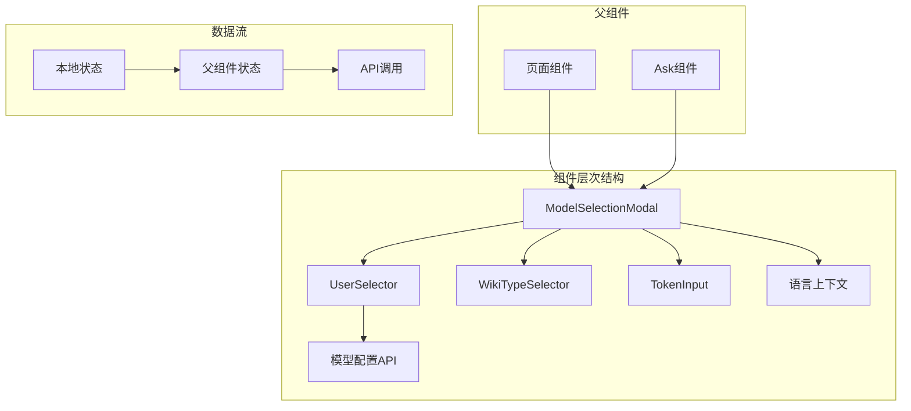
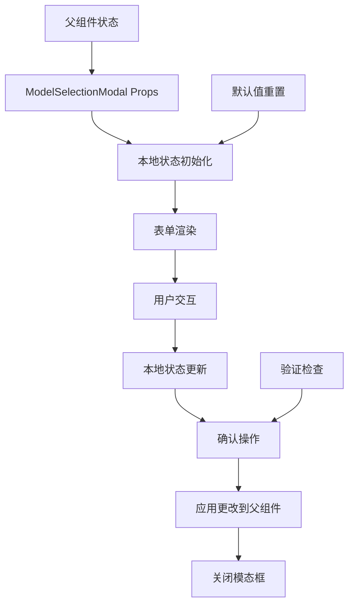
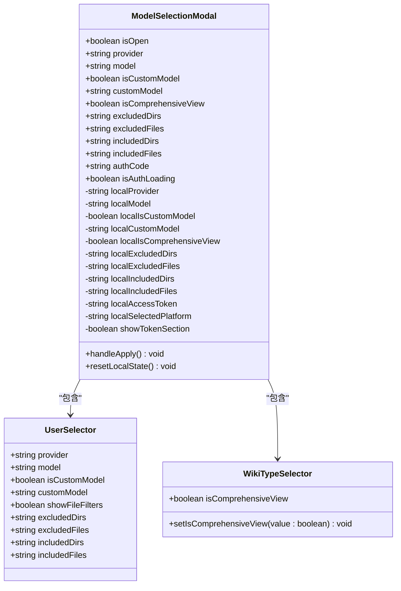
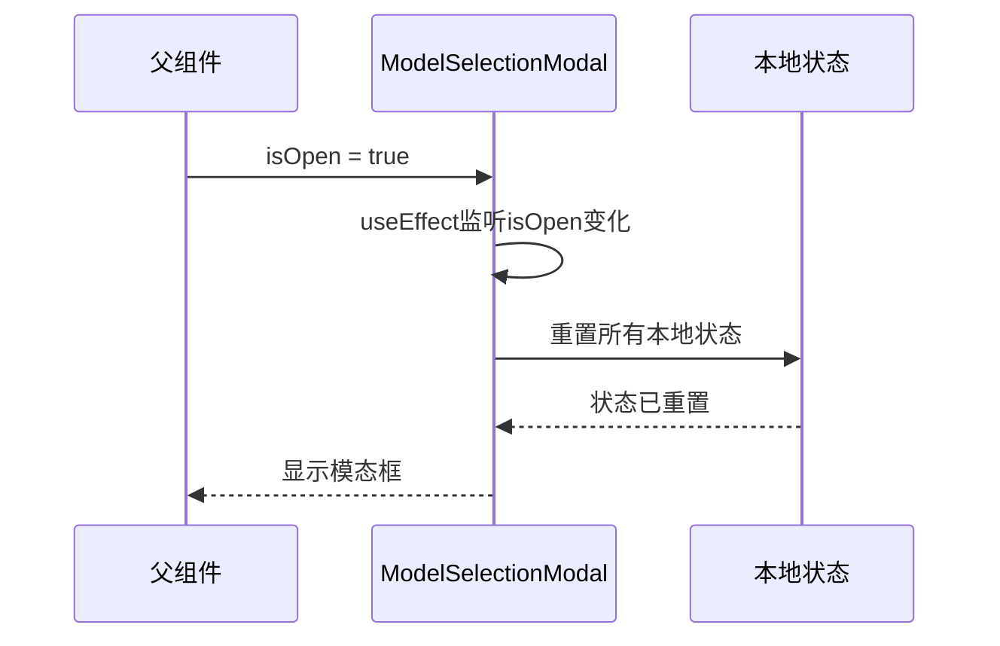
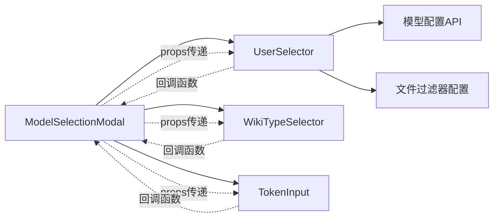

# 模型选择模态框

<cite>
**本文档中引用的文件**
- [ModelSelectionModal.tsx](file://src/components/ModelSelectionModal.tsx)
- [UserSelector.tsx](file://src/components/UserSelector.tsx)
- [WikiTypeSelector.tsx](file://src/components/WikiTypeSelector.tsx)
- [TokenInput.tsx](file://src/components/TokenInput.tsx)
- [page.tsx](file://src/app/[owner]/[repo]/page.tsx)
- [Ask.tsx](file://src/components/Ask.tsx)
</cite>

## 目录
1. [简介](#简介)
2. [项目结构](#项目结构)
3. [核心组件](#核心组件)
4. [架构概览](#架构概览)
5. [详细组件分析](#详细组件分析)
6. [状态管理机制](#状态管理机制)
7. [组件间通信](#组件间通信)
8. [使用示例](#使用示例)
9. [性能考虑](#性能考虑)
10. [故障排除指南](#故障排除指南)
11. [结论](#结论)

## 简介

ModelSelectionModal是deepwiki-open项目中的核心UI组件，负责为用户提供一个功能丰富的模态框界面，用于选择和配置AI模型相关的各种参数。该组件采用了React函数式组件设计，结合本地状态管理和父子组件通信模式，实现了灵活且可扩展的模型配置功能。

该组件的主要功能包括：
- 模型提供商和模型的选择
- 自定义模型的支持
- 维基类型（全面/简洁）的选择
- 文件过滤器配置
- 访问令牌输入
- 认证码处理

## 项目结构

ModelSelectionModal组件位于项目的组件层次结构中，与其他相关组件协同工作：



**图表来源**
- [ModelSelectionModal.tsx](file://src/components/ModelSelectionModal.tsx#L1-L260)
- [UserSelector.tsx](file://src/components/UserSelector.tsx#L1-L523)

**章节来源**
- [ModelSelectionModal.tsx](file://src/components/ModelSelectionModal.tsx#L1-L260)

## 核心组件

### ModelSelectionModal 主组件

ModelSelectionModal是一个高度可配置的模态框组件，支持多种配置选项和交互模式。它采用受控组件模式，通过props接收外部状态，并通过回调函数更新父组件状态。

### 子组件集成

该组件集成了多个专门的子组件：
- **UserSelector**: 负责模型提供商和模型的选择
- **WikiTypeSelector**: 处理维基类型的切换
- **TokenInput**: 管理访问令牌的输入和平台选择

**章节来源**
- [ModelSelectionModal.tsx](file://src/components/ModelSelectionModal.tsx#L48-L166)

## 架构概览

ModelSelectionModal采用了分层架构设计，清晰地分离了状态管理、UI渲染和业务逻辑：



**图表来源**
- [ModelSelectionModal.tsx](file://src/components/ModelSelectionModal.tsx#L79-L135)

## 详细组件分析

### Props 接口定义

ModelSelectionModal的Props接口设计体现了其灵活性和可扩展性：

| 属性名 | 类型 | 默认值 | 描述 |
|--------|------|--------|------|
| `isOpen` | `boolean` | - | 控制模态框的显示状态 |
| `onClose` | `() => void` | - | 关闭模态框的回调函数 |
| `provider` | `string` | - | 当前选中的模型提供商 |
| `setProvider` | `(value: string) => void` | - | 更新提供商的回调函数 |
| `model` | `string` | - | 当前选中的模型 |
| `setModel` | `(value: string) => void` | - | 更新模型的回调函数 |
| `isCustomModel` | `boolean` | - | 是否使用自定义模型 |
| `setIsCustomModel` | `(value: boolean) => void` | - | 切换自定义模型状态 |
| `customModel` | `string` | - | 自定义模型名称 |
| `setCustomModel` | `(value: string) => void` | - | 设置自定义模型名称 |
| `onApply` | `(token?: string) => void` | - | 应用配置的回调函数 |
| `isComprehensiveView` | `boolean` | - | 是否启用全面视图模式 |
| `setIsComprehensiveView` | `(value: boolean) => void` | - | 切换视图模式 |
| `showFileFilters` | `boolean` | `false` | 是否显示文件过滤器 |
| `showWikiType` | `boolean` | `true` | 是否显示维基类型选择 |
| `showTokenInput` | `boolean` | `false` | 是否显示令牌输入 |
| `repositoryType` | `'github' \| 'gitlab' \| 'bitbucket'` | `'github'` | 仓库类型 |

### 状态管理策略

ModelSelectionModal采用了双重状态管理模式：



**图表来源**
- [ModelSelectionModal.tsx](file://src/components/ModelSelectionModal.tsx#L81-L95)
- [UserSelector.tsx](file://src/components/UserSelector.tsx#L24-L44)

**章节来源**
- [ModelSelectionModal.tsx](file://src/components/ModelSelectionModal.tsx#L9-L46)

## 状态管理机制

### 本地状态与父组件状态的同步

ModelSelectionModal的核心设计理念是在本地维护一套独立的状态副本，只有在用户点击"提交"按钮时才将更改同步到父组件。这种设计模式提供了以下优势：

1. **用户体验优化**: 用户可以在不提交的情况下自由修改所有配置
2. **数据一致性**: 避免中间状态对父组件造成意外影响
3. **错误恢复**: 用户可以随时取消更改而不影响原始状态

### 状态重置机制

当模态框打开时，组件会自动重置本地状态到父组件提供的最新值：



**图表来源**
- [ModelSelectionModal.tsx](file://src/components/ModelSelectionModal.tsx#L98-L113)

**章节来源**
- [ModelSelectionModal.tsx](file://src/components/ModelSelectionModal.tsx#L79-L135)

## 组件间通信

### 父子组件通信模式

ModelSelectionModal与子组件之间的通信遵循React的最佳实践：



**图表来源**
- [ModelSelectionModal.tsx](file://src/components/ModelSelectionModal.tsx#L160-L206)

### 事件回调机制

组件通过精心设计的回调函数系统实现双向数据流：

| 回调函数 | 参数 | 触发时机 | 功能描述 |
|----------|------|----------|----------|
| `setProvider` | `string` | 提供商选择变化 | 更新当前选中的提供商 |
| `setModel` | `string` | 模型选择变化 | 更新当前选中的模型 |
| `setIsCustomModel` | `boolean` | 自定义模型切换 | 切换是否使用自定义模型 |
| `setCustomModel` | `string` | 自定义模型输入 | 设置自定义模型名称 |
| `setIsComprehensiveView` | `boolean` | 维基类型切换 | 切换维基显示模式 |
| `onApply` | `string?` | 点击提交按钮 | 应用所有更改并关闭模态框 |

**章节来源**
- [ModelSelectionModal.tsx](file://src/components/ModelSelectionModal.tsx#L115-L135)

## 使用示例

### 基本使用模式

以下是ModelSelectionModal在不同场景下的典型使用方式：

#### 页面组件中的使用

在主要页面组件中，ModelSelectionModal通常作为条件渲染的元素出现：

```typescript
// 页面组件中的典型用法
<ModelSelectionModal
  isOpen={isModelSelectionModalOpen}
  onClose={() => setIsModelSelectionModalOpen(false)}
  provider={selectedProviderState}
  setProvider={setSelectedProviderState}
  model={selectedModelState}
  setModel={setSelectedModelState}
  isCustomModel={isCustomSelectedModelState}
  setIsCustomModel={setIsCustomSelectedModelState}
  customModel={customSelectedModelState}
  setCustomModel={setCustomSelectedModelState}
  isComprehensiveView={isComprehensiveView}
  setIsComprehensiveView={setIsComprehensiveView}
  showFileFilters={true}
  excludedDirs={modelExcludedDirs}
  setExcludedDirs={setModelExcludedDirs}
  excludedFiles={modelExcludedFiles}
  setExcludedFiles={setModelExcludedFiles}
  includedDirs={modelIncludedDirs}
  setIncludedDirs={setModelIncludedDirs}
  includedFiles={modelIncludedFiles}
  setIncludedFiles={setModelIncludedFiles}
  onApply={confirmRefresh}
  showWikiType={true}
  showTokenInput={effectiveRepoInfo.type !== 'local' && !currentToken}
  repositoryType={effectiveRepoInfo.type as 'github' | 'gitlab' | 'bitbucket'}
  authRequired={authRequired}
  authCode={authCode}
  setAuthCode={setAuthCode}
  isAuthLoading={isAuthLoading}
/>
```

#### Ask组件中的简化使用

在Ask组件中，ModelSelectionModal以更简洁的方式使用：

```typescript
<ModelSelectionModal
  isOpen={isModelSelectionModalOpen}
  onClose={() => setIsModelSelectionModalOpen(false)}
  provider={selectedProvider}
  setProvider={setSelectedProvider}
  model={selectedModel}
  setModel={setSelectedModel}
  isCustomModel={isCustomSelectedModel}
  setIsCustomModel={setIsCustomSelectedModel}
  customModel={customSelectedModel}
  setCustomModel={setCustomSelectedModel}
  isComprehensiveView={isComprehensiveView}
  setIsComprehensiveView={setIsComprehensiveView}
  showFileFilters={false}
  onApply={() => {
    console.log('Model selection applied:', selectedProvider, selectedModel);
  }}
  showWikiType={false}
  authRequired={false}
  isAuthLoading={false}
/>
```

**章节来源**
- [page.tsx](file://src/app/[owner]/[repo]/page.tsx#L2247-L2277)
- [Ask.tsx](file://src/components/Ask.tsx#L903-L923)

## 性能考虑

### 渲染优化策略

ModelSelectionModal采用了多种性能优化技术：

1. **条件渲染**: 只有当`isOpen`为true时才渲染整个模态框
2. **状态重置优化**: 使用`useEffect`确保状态同步，避免不必要的重新渲染
3. **局部状态管理**: 将复杂的配置状态隔离在本地，减少父组件的重渲染

### 内存管理

组件正确处理了内存泄漏风险：
- 在模态框关闭时清理事件监听器
- 合理使用`useEffect`的清理函数

## 故障排除指南

### 常见问题及解决方案

#### 模态框无法正常关闭

**问题**: 点击关闭按钮后模态框仍然显示

**解决方案**: 检查`onClose`回调函数是否正确绑定，确保父组件状态能够正确更新。

#### 状态不同步问题

**问题**: 修改配置后返回父组件时状态未更新

**解决方案**: 确保`onApply`回调函数被正确调用，并且所有需要更新的状态都有对应的setter函数。

#### 文件过滤器不显示

**问题**: 设置`showFileFilters=true`但过滤器区域不显示

**解决方案**: 检查`showFileFilters`属性是否正确传递，以及父组件是否提供了相应的设置函数。

**章节来源**
- [ModelSelectionModal.tsx](file://src/components/ModelSelectionModal.tsx#L136-L137)

## 结论

ModelSelectionModal是一个设计精良的React组件，展现了现代前端开发的最佳实践。其核心优势包括：

1. **清晰的职责分离**: 通过本地状态管理实现用户交互与数据持久化的解耦
2. **灵活的配置系统**: 支持多种使用场景和定制需求
3. **良好的可扩展性**: 易于添加新的配置选项和功能模块
4. **优秀的用户体验**: 提供直观的界面和流畅的操作流程

该组件的成功实现为deepwiki-open项目提供了强大的配置能力，同时也为其他类似组件的设计提供了宝贵的参考价值。通过合理的状态管理、清晰的组件边界和完善的事件处理机制，ModelSelectionModal成为了整个应用架构中的重要基石。