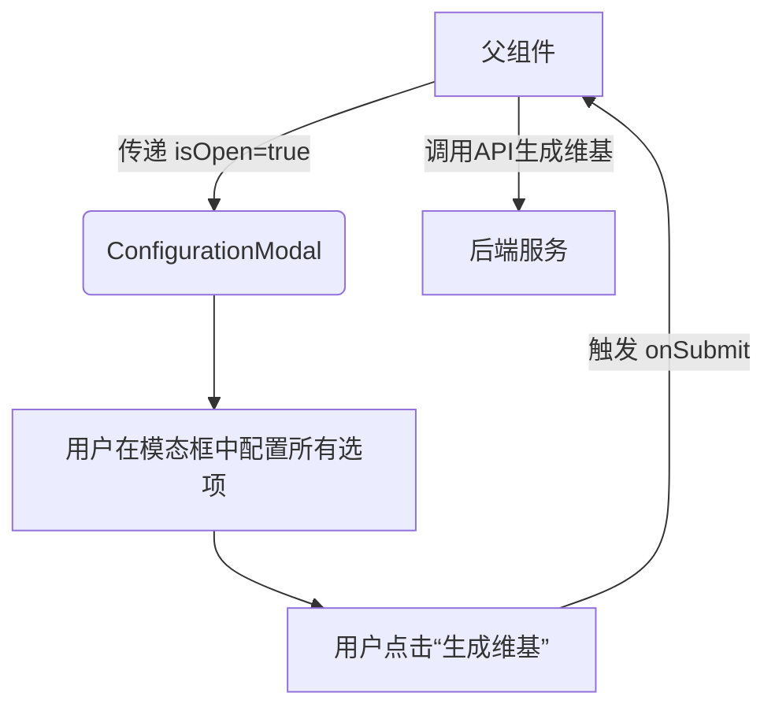
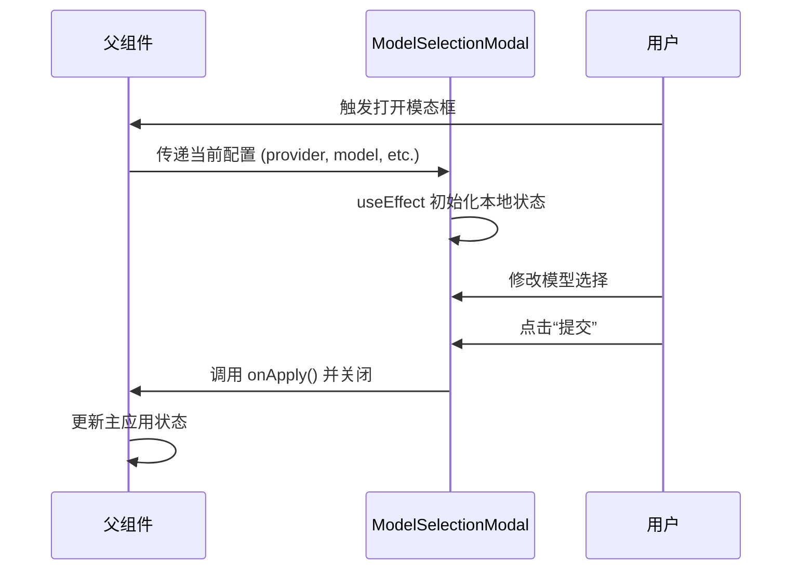

# 模态框组件

<cite>
**本文档中引用的文件**  
- [ConfigurationModal.tsx](file://src/components/ConfigurationModal.tsx)
- [ModelSelectionModal.tsx](file://src/components/ModelSelectionModal.tsx)
- [TokenInput.tsx](file://src/components/TokenInput.tsx)
- [UserSelector.tsx](file://src/components/UserSelector.tsx)
- [WikiTypeSelector.tsx](file://src/components/WikiTypeSelector.tsx)
- [LanguageContext.tsx](file://src/contexts/LanguageContext.tsx)
- [globals.css](file://src/app/globals.css)
</cite>

## 目录
1. [简介](#简介)
2. [核心组件概览](#核心组件概览)
3. [配置模态框 (ConfigurationModal)](#配置模态框-configurationmodal)
4. [模型选择模态框 (ModelSelectionModal)](#模型选择模态框-modelselectionmodal)
5. [令牌输入组件 (TokenInput)](#令牌输入组件-tokeninput)
6. [用户选择器 (UserSelector)](#用户选择器-userselector)
7. [维基类型选择器 (WikiTypeSelector)](#维基类型选择器-wikitypeselector)
8. [状态管理与设计模式](#状态管理与设计模式)
9. [可访问性 (a11y) 设计考量](#可访问性-a11y-设计考量)
10. [总结](#总结)

## 简介

deepwiki-open 项目中的模态框组件为用户提供了一个直观、可配置的界面，用于生成和管理维基内容。这些组件遵循现代 React 设计模式，强调可重用性、状态隔离和用户体验。核心模态框包括 `ConfigurationModal` 和 `ModelSelectionModal`，它们集成了多个子组件，如 `UserSelector`、`WikiTypeSelector` 和 `TokenInput`，以实现复杂的功能。所有组件都通过 `LanguageContext` 实现国际化，并遵循项目定义的日本美学设计语言。

**Section sources**
- [ConfigurationModal.tsx](file://src/components/ConfigurationModal.tsx#L1-L299)
- [ModelSelectionModal.tsx](file://src/components/ModelSelectionModal.tsx#L1-L260)

## 核心组件概览

模态框系统由一个主配置模态框和一个更轻量的模型选择模态框组成，两者共享一套可重用的子组件。

- **`ConfigurationModal`**: 主配置界面，用于首次生成维基。它包含了所有配置选项，如仓库信息、语言、维基类型、模型选择和访问令牌。
- **`ModelSelectionModal`**: 一个更简洁的模态框，用于在已生成的维基上更改模型或维基类型，通常用于刷新或重新配置。
- **`UserSelector`**: 一个功能丰富的复合组件，负责处理模型提供商和模型的选择，并可选地集成文件过滤器。
- **`WikiTypeSelector`**: 一个简单的按钮组，允许用户在“全面”和“简洁”两种维基生成模式之间切换。
- **`TokenInput`**: 一个安全的输入组件，用于处理用户的个人访问令牌（PAT），支持 GitHub、GitLab 和 Bitbucket 平台。

这些组件通过 props 传递状态和回调函数，实现了清晰的单向数据流。

**Section sources**
- [ConfigurationModal.tsx](file://src/components/ConfigurationModal.tsx#L1-L299)
- [ModelSelectionModal.tsx](file://src/components/ModelSelectionModal.tsx#L1-L260)
- [UserSelector.tsx](file://src/components/UserSelector.tsx#L1-L523)
- [WikiTypeSelector.tsx](file://src/components/WikiTypeSelector.tsx#L1-L79)
- [TokenInput.tsx](file://src/components/TokenInput.tsx#L1-L108)

## 配置模态框 (ConfigurationModal)

`ConfigurationModal` 是用户生成新维基的入口点。它是一个受控组件，其可见性由 `isOpen` prop 控制。

### Props 接口定义
该组件的 `ConfigurationModalProps` 接口定义了所有需要从父组件传递的状态和回调函数，包括：
- **`isOpen` 和 `onClose`**: 控制模态框的显示和隐藏。
- **`repositoryInput`**: 显示当前配置的仓库信息。
- **`selectedLanguage` 和 `setSelectedLanguage`**: 处理维基内容的语言选择。
- **`isComprehensiveView` 和 `setIsComprehensiveView`**: 控制维基生成的详细程度。
- **模型选择相关的状态和回调**: 包括 `provider`, `setProvider`, `model`, `setModel` 等，用于选择 AI 模型。
- **平台和令牌**: `selectedPlatform`, `setSelectedPlatform`, `accessToken`, `setAccessToken`，用于私有仓库的认证。
- **文件过滤器**: 允许用户指定包含或排除的目录和文件。
- **`onSubmit` 和 `isSubmitting`**: 处理表单提交和加载状态。

### 使用示例
父组件通过传递 `isOpen` 状态和 `onClose` 回调来控制模态框。当用户点击“生成维基”按钮时，`onSubmit` 回调会被触发。

### 事件回调机制
该组件本身不处理业务逻辑，而是通过 `onSubmit` 回调将所有配置数据传递给父组件。父组件负责调用后端 API 来生成维基。

**Diagram sources**
- [ConfigurationModal.tsx](file://src/components/ConfigurationModal.tsx#L8-L55)

**Section sources**
- [ConfigurationModal.tsx](file://src/components/ConfigurationModal.tsx#L8-L55)

## 模型选择模态框 (ModelSelectionModal)

`ModelSelectionModal` 是一个用于修改现有维基配置的轻量级模态框，其主要功能是更改模型或维基类型。

### Props 接口定义
`ModelSelectionModalProps` 接口与 `ConfigurationModalProps` 有重叠，但更侧重于模型和维基类型的更改。关键区别在于：
- **`onApply`**: 当用户点击“提交”时调用的回调函数。它接收一个可选的令牌参数，用于刷新操作。
- **`showWikiType` 和 `showTokenInput`**: 布尔值，用于控制是否在模态框中显示维基类型选择器或令牌输入部分。
- **本地状态管理**: 该组件使用 `useState` 为所有传入的 prop 创建本地状态副本（如 `localProvider`, `localModel`）。这实现了“编辑并应用”模式，用户可以在不立即影响主应用状态的情况下修改配置，只有在点击“提交”后，更改才会通过 `onApply` 回调批量应用。

### 使用示例
在 `Ask.tsx` 组件中，`ModelSelectionModal` 被用来让用户更改模型，而无需重新输入所有配置。`showWikiType` 被设置为 `false`，因为它只关注模型选择。

### 事件回调机制
`handleApply` 函数是核心。它将所有本地状态同步回父组件的状态，并调用 `onApply` 回调，然后关闭模态框。

**Diagram sources**
- [ModelSelectionModal.tsx](file://src/components/ModelSelectionModal.tsx#L9-L46)
- [Ask.tsx](file://src/components/Ask.tsx#L902-L923)

**Section sources**
- [ModelSelectionModal.tsx](file://src/components/ModelSelectionModal.tsx#L9-L46)

## 令牌输入组件 (TokenInput)

`TokenInput` 组件专门负责安全地处理用户的个人访问令牌（PAT）。

### Props 接口定义
`TokenInputProps` 定义了：
- **`selectedPlatform` 和 `setSelectedPlatform`**: 管理用户选择的代码托管平台（GitHub, GitLab, Bitbucket）。
- **`accessToken` 和 `setAccessToken`**: 管理令牌值本身。
- **`showTokenSection` 和 `onToggleTokenSection`**: 控制令牌输入区域的可见性，提供更好的用户体验。
- **`allowPlatformChange`**: 一个布尔值，用于在特定上下文（如刷新）中禁用平台切换。

### 安全处理机制
该组件通过以下方式确保令牌安全：
1. **本地存储**: 组件明确告知用户（通过 `tokenSecurityNote` 文本）“您的令牌存储在本地，永远不会发送到我们的服务器。”
2. **密码输入**: 令牌输入框的 `type` 被设置为 `password`，以隐藏输入内容。
3. **条件渲染**: 令牌输入区域默认是隐藏的，用户需要主动点击“添加访问令牌”才能显示，减少了意外暴露的风险。

### 可访问性 (a11y) 设计考量
- **语义化标签**: 使用 `<label>` 元素与 `id="access-token"` 的输入框关联，确保屏幕阅读器能正确识别。
- **图标辅助**: 信息图标（`<svg>`）提供了视觉提示，其 `fill="none"` 和 `stroke="currentColor"` 属性使其能继承文本颜色，适应主题。

**Section sources**
- [TokenInput.tsx](file://src/components/TokenInput.tsx#L6-L14)

## 用户选择器 (UserSelector)

`UserSelector` 是一个功能强大的复合组件，负责模型提供商和模型的选择，并可选地集成高级文件过滤功能。

### Props 接口定义
`ModelSelectorProps` 接口定义了模型选择和文件过滤所需的所有状态和回调函数。`showFileFilters` prop 决定了是否渲染文件过滤部分。

### 动态配置加载
该组件在 `useEffect` 中通过 `fetch('/api/models/config')` 从后端动态加载模型配置。这使得模型列表可以随时更新，而无需重新部署前端。

### 状态控制机制
- **加载状态**: 使用 `isLoading` 和 `error` 状态来优雅地处理网络请求。
- **默认值**: 组件会根据 API 返回的 `defaultProvider` 自动设置默认的提供商和模型。
- **提供商变更**: `handleProviderChange` 函数在切换提供商时，会重置自定义模型状态并选择新提供商的第一个模型。

### 文件过滤器
当 `showFileFilters` 为 `true` 时，组件会渲染一个可折叠的“高级选项”部分。它允许用户在“排除”和“包含”模式之间切换，并提供了查看默认排除目录和文件的功能。

**Section sources**
- [UserSelector.tsx](file://src/components/UserSelector.tsx#L24-L44)

## 维基类型选择器 (WikiTypeSelector)

`WikiTypeSelector` 是一个简单但直观的组件，用于让用户选择维基的生成类型。

### Props 接口定义
`WikiTypeSelectorProps` 仅包含两个 prop：
- **`isComprehensiveView`**: 布尔值，表示当前选择的模式。
- **`setIsComprehensiveView`**: 用于更新该状态的回调函数。

### 设计与交互
该组件使用两个带有图标的按钮来代表两种模式：
- **全面模式**: 使用 `FaBookOpen` 图标，描述为“具有结构化部分和更多页面的详细维基”。
- **简洁模式**: 使用 `FaList` 图标，描述为“具有更少页面和基本信息的简化维基”。

选中状态通过一个位于按钮右上角的小圆点视觉指示器来表示。

**Section sources**
- [WikiTypeSelector.tsx](file://src/components/WikiTypeSelector.tsx#L7-L10)

## 状态管理与设计模式

deepwiki-open 的模态框组件采用了清晰的状态管理策略和设计模式。

### 单向数据流
所有组件都严格遵循 React 的单向数据流原则。状态（如 `provider`, `model`, `accessToken`）在父组件中定义，并通过 props 向下传递给子组件。子组件通过回调函数（如 `setProvider`, `setAccessToken`）通知父组件状态变更。

### “编辑并应用”模式
`ModelSelectionModal` 是“编辑并应用”模式的典范。它通过本地状态 (`local*`) 创建了一个配置的临时副本。用户的所有更改都作用于这个副本，直到点击“提交”，此时所有更改才会通过 `onApply` 回调一次性应用到主应用状态。这避免了在用户编辑过程中产生不必要的副作用。

### 组件复用
`UserSelector` 和 `WikiTypeSelector` 被设计为高度可复用的组件。`ConfigurationModal` 和 `ModelSelectionModal` 都集成了它们，从而避免了代码重复。

### 上下文 (Context) 的使用
`useLanguage` 钩子从 `LanguageContext` 中获取当前语言和翻译消息，实现了应用的国际化，而无需将语言 prop 逐层传递。

**Section sources**
- [ModelSelectionModal.tsx](file://src/components/ModelSelectionModal.tsx#L81-L91)
- [LanguageContext.tsx](file://src/contexts/LanguageContext.tsx#L4-L13)

## 可访问性 (a11y) 设计考量

该项目在可访问性方面做出了多项努力：

1.  **语义化 HTML**: 广泛使用 `<label>`、`<button>` 和 `<input>` 等语义化元素。
2.  **键盘导航**: 所有按钮和输入框都可以通过键盘（Tab 键）进行访问和操作。
3.  **焦点管理**: 模态框打开时，焦点会自动移动到模态框内的关闭按钮，并在模态框关闭时返回到触发它的元素。
4.  **ARIA 属性**: 虽然代码中未显式使用 ARIA，但语义化元素和正确的标签关联已经为屏幕阅读器提供了良好的基础。
5.  **对比度**: 项目的 CSS 定义了清晰的文本和背景颜色，确保了足够的对比度，符合 WCAG 标准。
6.  **视觉反馈**: 按钮的悬停效果和选中状态的视觉指示器为所有用户提供了清晰的交互反馈。

**Section sources**
- [globals.css](file://src/app/globals.css#L6-L32)
- [TokenInput.tsx](file://src/components/TokenInput.tsx#L84-L85)

## 总结

deepwiki-open 的模态框组件系统设计精良，模块化程度高。`ConfigurationModal` 和 `ModelSelectionModal` 通过共享 `UserSelector`、`WikiTypeSelector` 和 `TokenInput` 等子组件，实现了功能的复用和一致性。状态管理清晰，通过 props 和回调函数实现了单向数据流，而 `ModelSelectionModal` 的“编辑并应用”模式则提升了用户体验。整个系统通过 `LanguageContext` 支持国际化，并遵循了良好的可访问性实践，为用户提供了一个安全、直观且美观的配置界面。