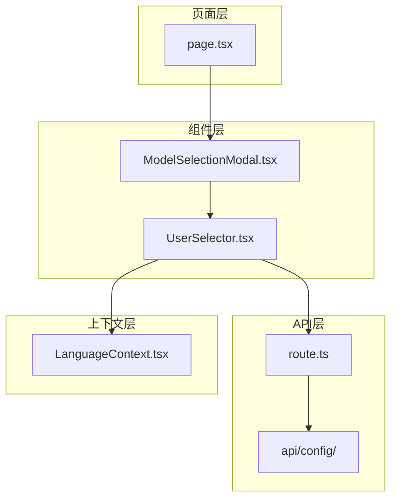
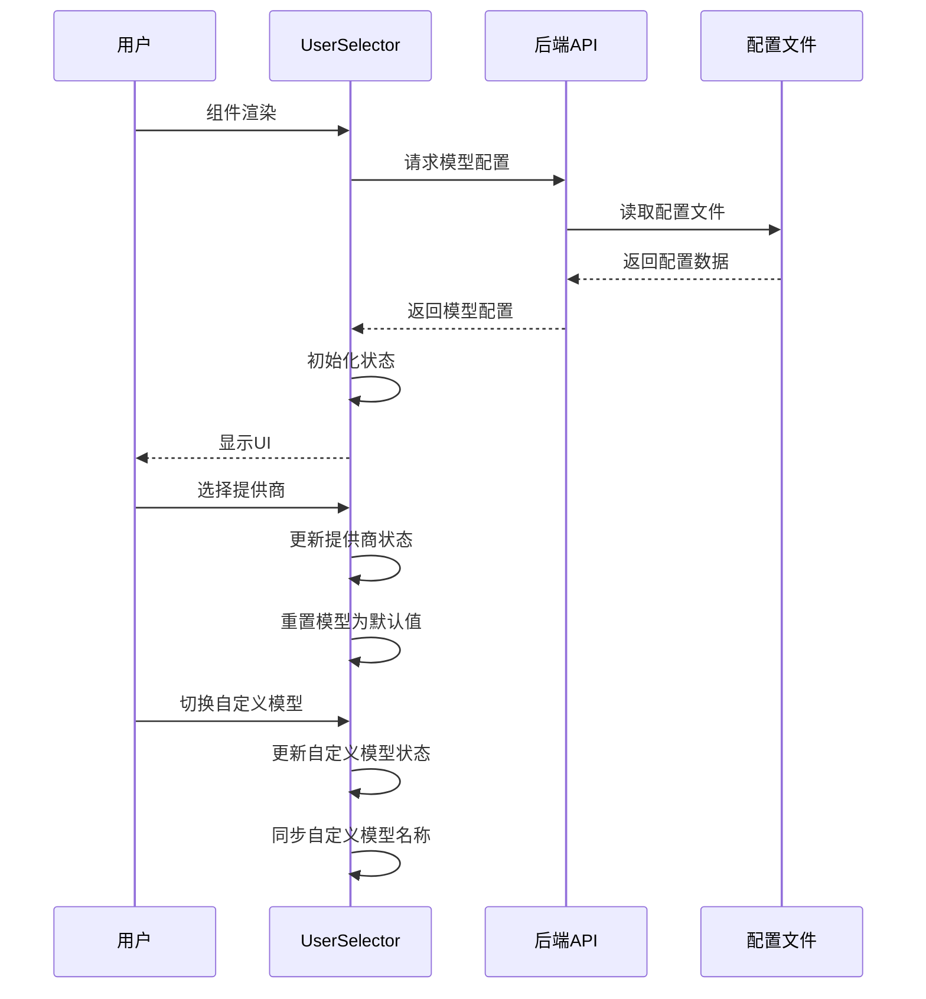
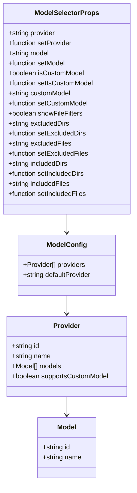
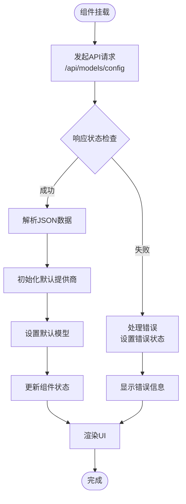
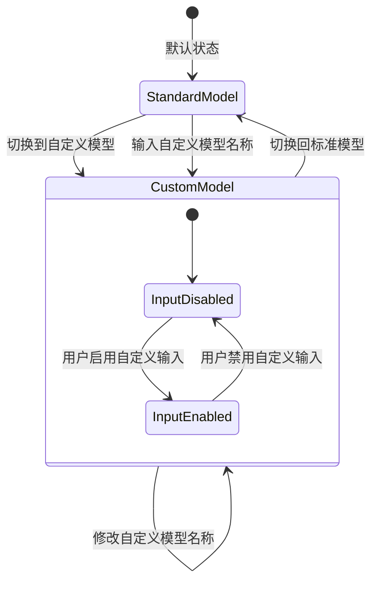
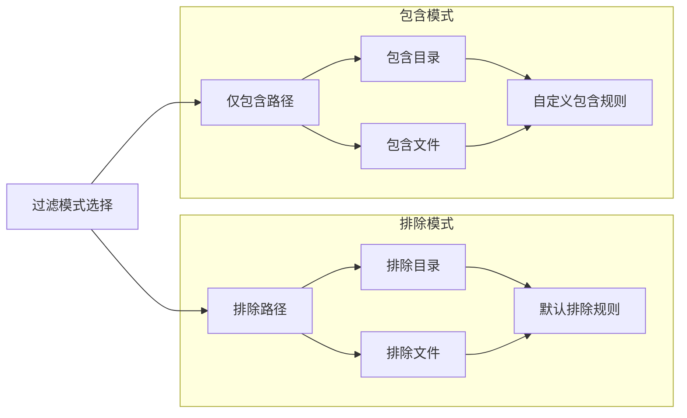
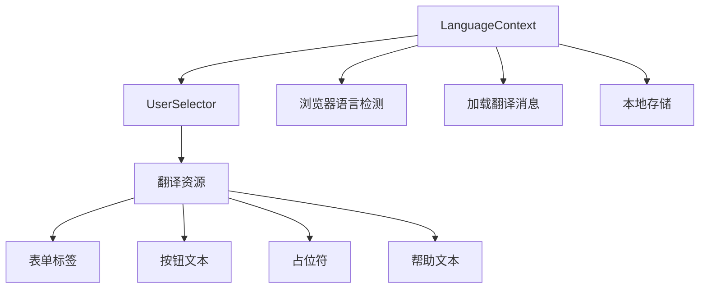
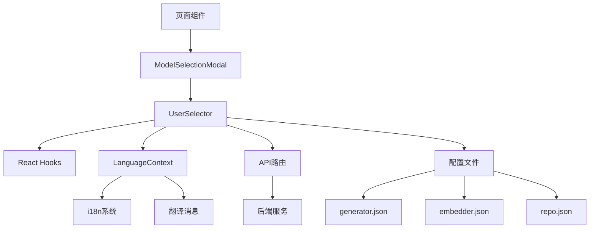

# 用户选择器组件详尽文档

<cite>
**本文档中引用的文件**
- [UserSelector.tsx](file://src/components/UserSelector.tsx)
- [route.ts](file://src/app/api/models/config/route.ts)
- [generator.json](file://api/config/generator.json)
- [embedder.json](file://api/config/embedder.json)
- [repo.json](file://api/config/repo.json)
- [lang.json](file://api/config/lang.json)
- [LanguageContext.tsx](file://src/contexts/LanguageContext.tsx)
- [ModelSelectionModal.tsx](file://src/components/ModelSelectionModal.tsx)
- [page.tsx](file://src/app/[owner]/[repo]/page.tsx)
</cite>

## 目录
1. [简介](#简介)
2. [项目结构](#项目结构)
3. [核心组件](#核心组件)
4. [架构概览](#架构概览)
5. [详细组件分析](#详细组件分析)
6. [依赖关系分析](#依赖关系分析)
7. [性能考虑](#性能考虑)
8. [故障排除指南](#故障排除指南)
9. [结论](#结论)

## 简介

UserSelector.tsx是deepwiki-open项目中的核心用户界面组件，负责动态加载AI模型提供商及其模型列表，并提供高级文件过滤功能。该组件实现了复杂的异步数据加载机制，支持多种AI提供商的模型切换，以及灵活的文件过滤配置。

该组件的主要功能包括：
- 动态加载AI模型提供商配置
- 提供模型选择下拉菜单
- 支持自定义模型切换
- 实现高级文件过滤功能（包含/排除目录与文件）
- 多语言国际化支持
- 错误处理和加载状态管理

## 项目结构

UserSelector组件在项目中的组织结构如下：

**图表来源**
- [UserSelector.tsx](file://src/components/UserSelector.tsx#L1-L523)
- [route.ts](file://src/app/api/models/config/route.ts#L1-L49)

**章节来源**
- [UserSelector.tsx](file://src/components/UserSelector.tsx#L1-L50)
- [route.ts](file://src/app/api/models/config/route.ts#L1-L49)

## 核心组件

### Props接口定义

UserSelector组件通过丰富的Props接口提供了高度可配置的功能：

| 属性名 | 类型 | 默认值 | 描述 |
|--------|------|--------|------|
| provider | string | - | 当前选中的模型提供商ID |
| setProvider | (value: string) => void | - | 设置当前模型提供商的回调函数 |
| model | string | - | 当前选中的模型ID |
| setModel | (value: string) => void | - | 设置当前模型的回调函数 |
| isCustomModel | boolean | - | 是否使用自定义模型 |
| setIsCustomModel | (value: boolean) => void | - | 设置自定义模型状态的回调函数 |
| customModel | string | - | 自定义模型名称 |
| setCustomModel | (value: string) => void | - | 设置自定义模型名称的回调函数 |

### 文件过滤配置属性

| 属性名 | 类型 | 默认值 | 描述 |
|--------|------|--------|------|
| showFileFilters | boolean | false | 是否显示文件过滤选项 |
| excludedDirs | string | '' | 排除的目录列表 |
| setExcludedDirs | (value: string) => void | - | 设置排除目录的回调函数 |
| excludedFiles | string | '' | 排除的文件列表 |
| setExcludedFiles | (value: string) => void | - | 设置排除文件的回调函数 |
| includedDirs | string | '' | 包含的目录列表 |
| setIncludedDirs | (value: string) => void | - | 设置包含目录的回调函数 |
| includedFiles | string | '' | 包含的文件列表 |
| setIncludedFiles | (value: string) => void | - | 设置包含文件的回调函数 |

**章节来源**
- [UserSelector.tsx](file://src/components/UserSelector.tsx#L24-L44)

## 架构概览

UserSelector组件采用React函数式组件设计，结合Hooks模式实现状态管理和异步数据处理：

**图表来源**
- [UserSelector.tsx](file://src/components/UserSelector.tsx#L82-L117)
- [route.ts](file://src/app/api/models/config/route.ts#L8-L28)

## 详细组件分析

### 数据模型结构

组件使用以下核心数据结构来管理模型配置：

**图表来源**
- [UserSelector.tsx](file://src/components/UserSelector.tsx#L7-L22)

### 异步数据加载机制

组件实现了完整的异步数据加载流程：

**图表来源**
- [UserSelector.tsx](file://src/components/UserSelector.tsx#L82-L117)

### 自定义模型切换逻辑

组件支持灵活的自定义模型切换机制：

**图表来源**
- [UserSelector.tsx](file://src/components/UserSelector.tsx#L335-L373)

### 高级文件过滤功能实现

文件过滤功能提供了两种模式：排除模式和包含模式：

**图表来源**
- [UserSelector.tsx](file://src/components/UserSelector.tsx#L387-L518)

### 多语言国际化支持

组件集成了完整的国际化系统：

**图表来源**
- [LanguageContext.tsx](file://src/contexts/LanguageContext.tsx#L25-L66)
- [UserSelector.tsx](file://src/components/UserSelector.tsx#L71)

**章节来源**
- [UserSelector.tsx](file://src/components/UserSelector.tsx#L1-L523)
- [LanguageContext.tsx](file://src/contexts/LanguageContext.tsx#L1-L203)

## 依赖关系分析

### 组件间依赖关系

**图表来源**
- [UserSelector.tsx](file://src/components/UserSelector.tsx#L1-L5)
- [ModelSelectionModal.tsx](file://src/components/ModelSelectionModal.tsx#L1-L6)
- [route.ts](file://src/app/api/models/config/route.ts#L1-L5)

### 外部依赖

组件依赖以下外部资源：
- **React 18+**: 函数式组件和Hooks支持
- **Next.js**: SSR和API路由支持
- **Tailwind CSS**: 样式框架
- **国际化库**: 多语言支持

**章节来源**
- [UserSelector.tsx](file://src/components/UserSelector.tsx#L1-L5)
- [route.ts](file://src/app/api/models/config/route.ts#L1-L5)

## 性能考虑

### 渲染优化策略

1. **条件渲染**: 根据showFileFilters属性决定是否渲染文件过滤部分
2. **懒加载**: 翻译资源按需加载
3. **状态管理**: 使用useState和useEffect避免不必要的重新渲染
4. **错误边界**: 完整的错误处理机制确保组件稳定性

### 数据加载优化

1. **缓存机制**: 通过useEffect的依赖数组避免重复API调用
2. **并发控制**: 使用setTimeout延迟执行模型重置操作
3. **错误恢复**: 提供降级方案确保用户体验

## 故障排除指南

### 常见问题及解决方案

| 问题 | 可能原因 | 解决方案 |
|------|----------|----------|
| 模型配置加载失败 | API不可用或网络问题 | 检查后端服务状态，验证网络连接 |
| 提供商列表为空 | 配置文件损坏 | 检查generator.json配置文件格式 |
| 自定义模型切换无效 | 支持标志未正确设置 | 验证提供商配置中的supportsCustomModel字段 |
| 文件过滤功能异常 | 权限或路径问题 | 检查文件系统权限和路径格式 |

### 调试技巧

1. **控制台日志**: 组件内部包含详细的console.log语句
2. **错误边界**: 完整的try-catch包装确保错误不会导致应用崩溃
3. **状态检查**: 使用React DevTools检查组件状态

**章节来源**
- [UserSelector.tsx](file://src/components/UserSelector.tsx#L108-L111)
- [route.ts](file://src/app/api/models/config/route.ts#L29-L35)

## 结论

UserSelector.tsx是一个功能完整、设计精良的React组件，成功实现了以下关键目标：

### 主要成就

1. **动态配置加载**: 通过/api/models/config API实现动态模型提供商加载
2. **灵活的模型选择**: 支持标准模型和自定义模型的无缝切换
3. **强大的文件过滤**: 提供包含/排除模式的高级文件过滤功能
4. **国际化支持**: 完整的多语言界面支持
5. **错误处理**: 健壮的错误处理和降级机制

### 技术亮点

- **模块化设计**: 清晰的职责分离和接口定义
- **类型安全**: 完整的TypeScript类型定义
- **用户体验**: 流畅的交互和及时的状态反馈
- **可扩展性**: 良好的架构支持未来功能扩展

该组件为deepwiki-open项目提供了坚实的用户界面基础，支持复杂的AI模型配置需求，同时保持了良好的代码质量和用户体验。