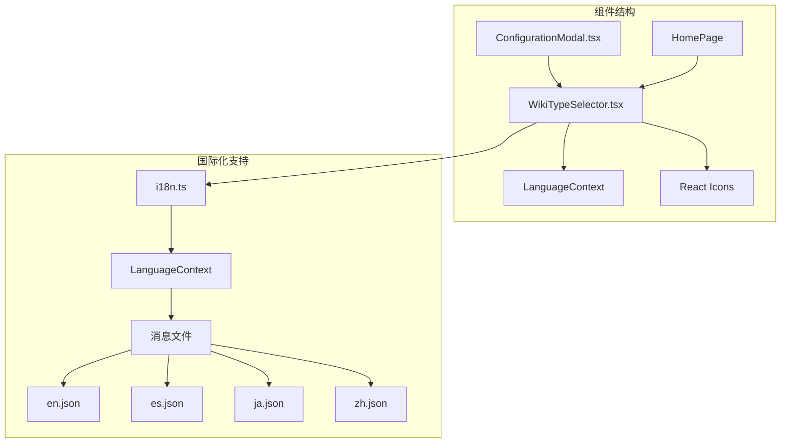
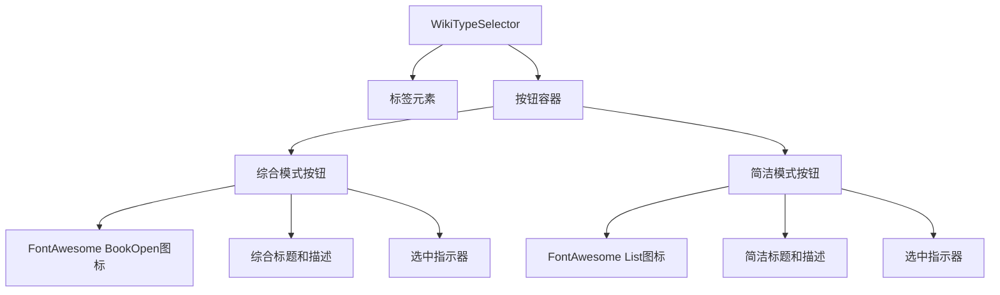
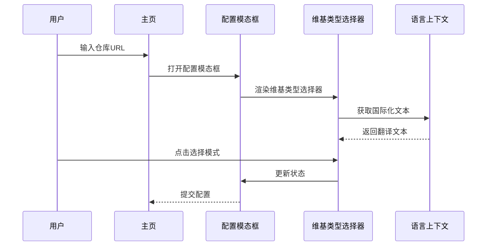
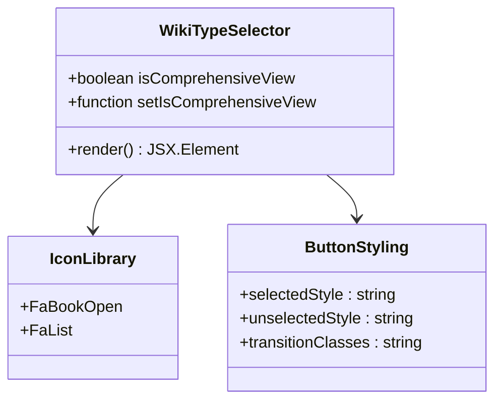
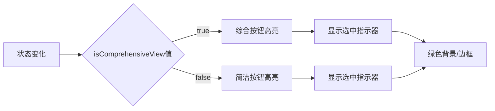
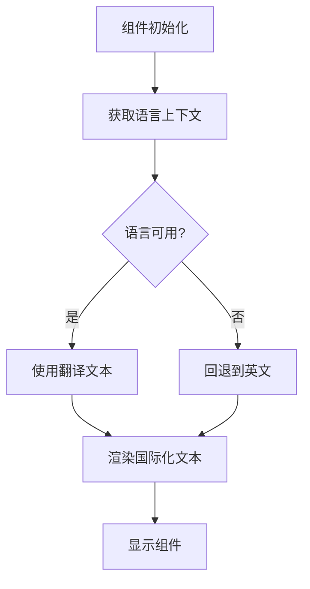
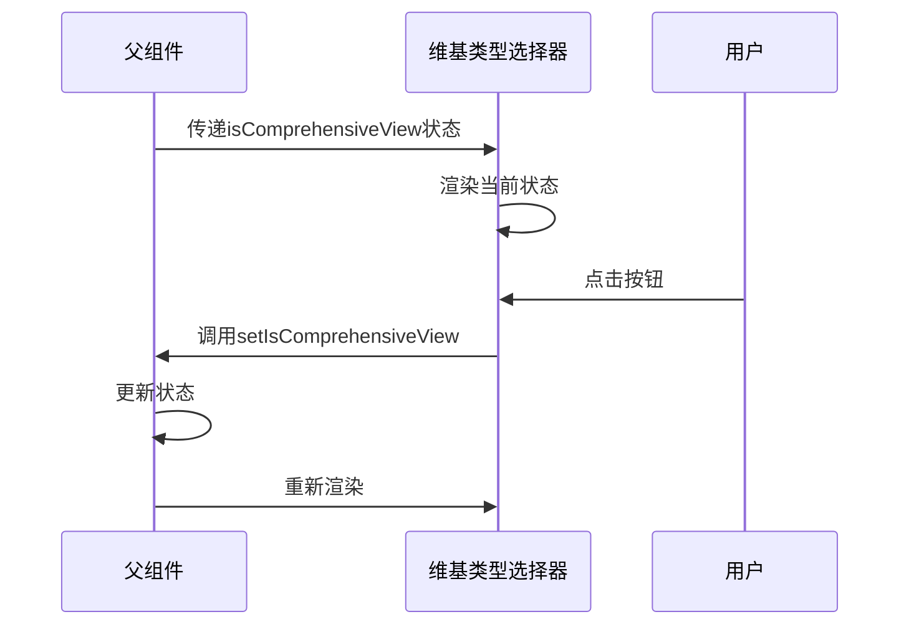
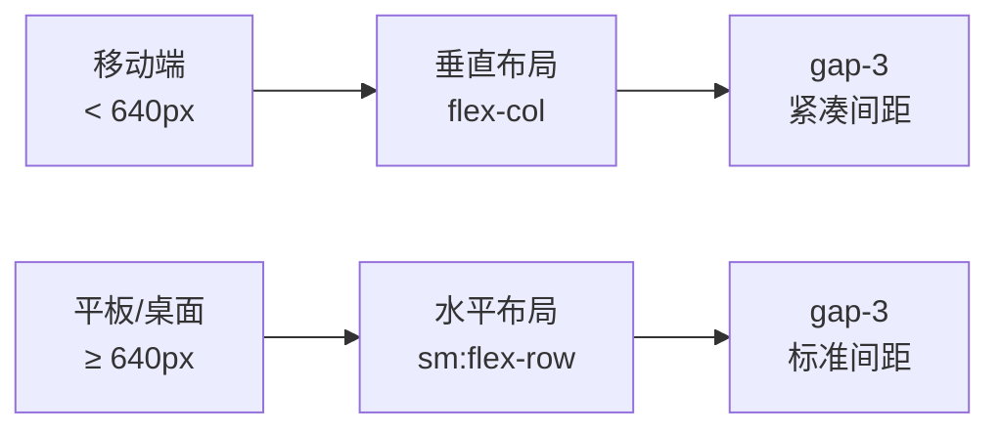
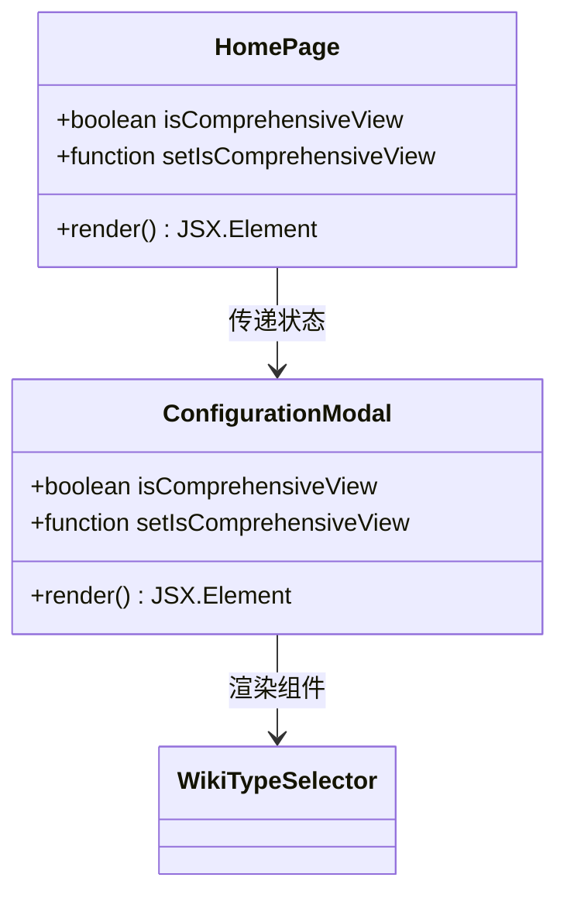
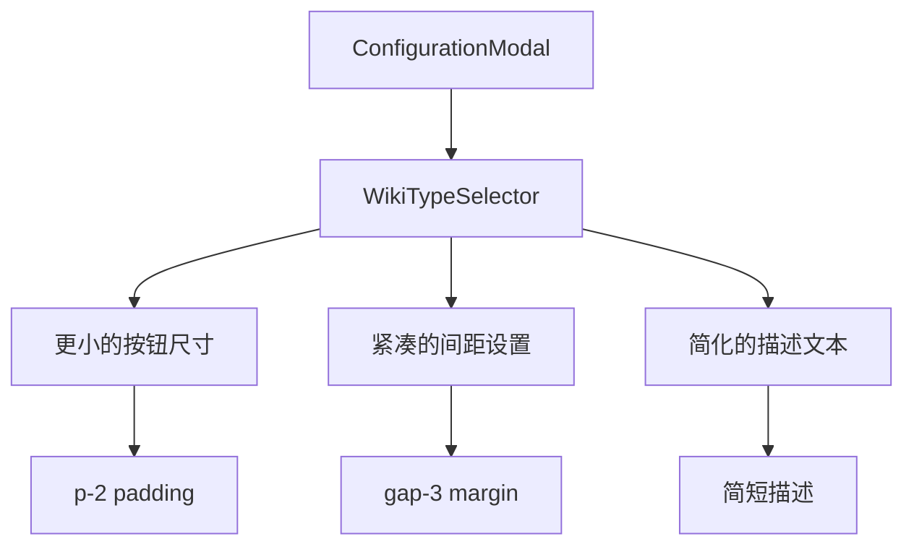

# 维基类型选择器

<cite>
**本文档中引用的文件**
- [WikiTypeSelector.tsx](file://src/components/WikiTypeSelector.tsx)
- [LanguageContext.tsx](file://src/contexts/LanguageContext.tsx)
- [i18n.ts](file://src/i18n.ts)
- [en.json](file://src/messages/en.json)
- [es.json](file://src/messages/es.json)
- [ja.json](file://src/messages/ja.json)
- [zh.json](file://src/messages/zh.json)
- [page.tsx](file://src/app/page.tsx)
- [ConfigurationModal.tsx](file://src/components/ConfigurationModal.tsx)
</cite>

## 目录
1. [简介](#简介)
2. [项目结构](#项目结构)
3. [核心组件](#核心组件)
4. [架构概览](#架构概览)
5. [详细组件分析](#详细组件分析)
6. [国际化支持](#国际化支持)
7. [状态管理](#状态管理)
8. [响应式设计](#响应式设计)
9. [使用示例](#使用示例)
10. [故障排除指南](#故障排除指南)
11. [总结](#总结)

## 简介

WikiTypeSelector.tsx是deepwiki-open项目中的一个关键组件，专门负责提供"综合"与"简洁"两种维基生成模式的可视化选择功能。该组件采用按钮式UI设计，通过直观的图标和文字说明，让用户能够轻松选择适合的维基生成方式。

该组件的核心功能包括：
- 提供两种维基生成模式的选择界面
- 使用FontAwesome图标增强视觉识别度
- 实现选中状态的高亮显示
- 支持响应式布局适配不同屏幕尺寸
- 完整的国际化文本支持

## 项目结构

WikiTypeSelector组件位于项目的组件目录中，与其他表单组件协同工作：



**图表来源**
- [WikiTypeSelector.tsx](file://src/components/WikiTypeSelector.tsx#L1-L79)
- [LanguageContext.tsx](file://src/contexts/LanguageContext.tsx#L1-L203)

**节来源**
- [WikiTypeSelector.tsx](file://src/components/WikiTypeSelector.tsx#L1-L79)
- [ConfigurationModal.tsx](file://src/components/ConfigurationModal.tsx#L1-L200)

## 核心组件

### Props接口定义

WikiTypeSelector组件通过清晰的Props接口定义实现类型安全：

| 属性名 | 类型 | 描述 |
|--------|------|------|
| `isComprehensiveView` | `boolean` | 控制当前是否为综合视图模式 |
| `setIsComprehensiveView` | `(value: boolean) => void` | 用于切换视图模式的状态更新函数 |

### 组件结构

组件采用简洁的HTML结构，包含标签、按钮容器和两个主要按钮：



**图表来源**
- [WikiTypeSelector.tsx](file://src/components/WikiTypeSelector.tsx#L18-L74)

**节来源**
- [WikiTypeSelector.tsx](file://src/components/WikiTypeSelector.tsx#L7-L10)

## 架构概览

WikiTypeSelector组件在整个应用架构中扮演着重要的角色，作为用户配置界面的一部分：



**图表来源**
- [page.tsx](file://src/app/page.tsx#L444-L479)
- [ConfigurationModal.tsx](file://src/components/ConfigurationModal.tsx#L160-L166)

## 详细组件分析

### 按钮式UI设计

组件采用按钮式设计，每个模式都对应一个独立的按钮：

#### 综合模式按钮
- **图标**: FontAwesome FaBookOpen（打开的书籍图标）
- **标题**: "Comprehensive"（综合）或对应语言的翻译
- **描述**: 详细的维基描述信息
- **选中状态**: 显示绿色圆形指示器

#### 简洁模式按钮  
- **图标**: FontAwesome FaList（列表图标）
- **标题**: "Concise"（简洁）或对应语言的翻译
- **描述**: 简化的维基描述信息
- **选中状态**: 显示绿色圆形指示器

### 图标使用策略

组件巧妙地使用了两个具有明确语义的FontAwesome图标：



**图表来源**
- [WikiTypeSelector.tsx](file://src/components/WikiTypeSelector.tsx#L5-L79)

### 选中状态高亮机制

组件实现了智能的状态高亮机制：



**图表来源**
- [WikiTypeSelector.tsx](file://src/components/WikiTypeSelector.tsx#L27-L31)
- [WikiTypeSelector.tsx](file://src/components/WikiTypeSelector.tsx#L52-L56)

**节来源**
- [WikiTypeSelector.tsx](file://src/components/WikiTypeSelector.tsx#L27-L71)

### 响应式布局实现

组件采用Tailwind CSS类实现响应式布局：

| 断点 | 布局方式 | 间距设置 |
|------|----------|----------|
| 移动端 | 垂直堆叠 | `flex-col` |
| 平板/桌面 | 水平排列 | `sm:flex-row` |
| 间距 | `gap-3` | 适应不同屏幕尺寸 |

**节来源**
- [WikiTypeSelector.tsx](file://src/components/WikiTypeSelector.tsx#L23)

## 国际化支持

### 多语言文本映射

组件通过LanguageContext提供完整的国际化支持：

| 文本键 | 英文 | 中文 | 日文 | 西班牙文 |
|--------|------|------|------|----------|
| `form.wikiType` | Wiki Type | Wiki类型 | Wikiタイプ | Tipo de Wiki |
| `form.comprehensive` | Comprehensive | 全面型 | 包括的 | Completo |
| `form.concise` | Concise | 简洁型 | 簡潔 | Conciso |
| `form.comprehensiveDescription` | Detailed wiki with structured sections and more pages | 包含结构化章节和更多页面的详细Wiki | 構造化されたセクションとより多くのページを持つ詳細なWiki | Wiki detallado con secciones estructuradas y más páginas |
| `form.conciseDescription` | Simplified wiki with fewer pages and essential information | 页面更少，仅包含核心信息的简化Wiki | ページ数が少なく、必要な情報のみを含む簡素化されたWiki | Wiki simplificado con menos páginas e información esencial |

### 语言检测与切换机制



**图表来源**
- [LanguageContext.tsx](file://src/contexts/LanguageContext.tsx#L16-L203)
- [WikiTypeSelector.tsx](file://src/components/WikiTypeSelector.tsx#L16)

**节来源**
- [LanguageContext.tsx](file://src/contexts/LanguageContext.tsx#L16-L203)
- [WikiTypeSelector.tsx](file://src/components/WikiTypeSelector.tsx#L16-L22)

## 状态管理

### 状态同步机制

WikiTypeSelector与父组件通过props实现状态同步：



**图表来源**
- [page.tsx](file://src/app/page.tsx#L130-L131)
- [ConfigurationModal.tsx](file://src/components/ConfigurationModal.tsx#L21-L22)

### 状态切换逻辑

组件实现了简单而有效的状态切换逻辑：

```mermaid
flowchart TD
A[用户点击按钮] --> B{当前状态}
B --> |综合模式| C[切换到简洁模式]
B --> |简洁模式| D[切换到综合模式]
C --> E[调用setIsComprehensiveView(false)]
D --> F[调用setIsComprehensiveView(true)]
E --> G[更新UI状态]
F --> G
```

**图表来源**
- [WikiTypeSelector.tsx](file://src/components/WikiTypeSelector.tsx#L26)
- [WikiTypeSelector.tsx](file://src/components/WikiTypeSelector.tsx#L51)

**节来源**
- [WikiTypeSelector.tsx](file://src/components/WikiTypeSelector.tsx#L12-L15)
- [page.tsx](file://src/app/page.tsx#L130-L131)

## 响应式设计

### Tailwind CSS断点策略

组件利用Tailwind CSS的响应式断点系统：



### 视觉层次结构

组件通过CSS变量和Tailwind类实现统一的视觉风格：

| 样式属性 | 综合模式 | 简洁模式 | 通用样式 |
|----------|----------|----------|----------|
| 背景颜色 | `bg-[var(--accent-primary)]/10` | `bg-[var(--background)]/50` | `bg-[var(--background)]/50` |
| 边框颜色 | `border-[var(--accent-primary)]/30` | `border-[var(--border-color)]` | `border-[var(--border-color)]` |
| 文本颜色 | `text-[var(--accent-primary)]` | `text-[var(--foreground)]` | `text-[var(--foreground)]` |
| 过渡效果 | `transition-colors` | `transition-colors` | `transition-colors` |

**节来源**
- [WikiTypeSelector.tsx](file://src/components/WikiTypeSelector.tsx#L27-L56)

## 使用示例

### 在主页中的使用

在主页面中，WikiTypeSelector作为配置表单的一部分：



**图表来源**
- [page.tsx](file://src/app/page.tsx#L444-L479)
- [ConfigurationModal.tsx](file://src/components/ConfigurationModal.tsx#L444-L479)

### 在配置模态框中的使用

在配置模态框中，组件采用更紧凑的布局：



**图表来源**
- [ConfigurationModal.tsx](file://src/components/ConfigurationModal.tsx#L155-L183)

**节来源**
- [page.tsx](file://src/app/page.tsx#L444-L479)
- [ConfigurationModal.tsx](file://src/components/ConfigurationModal.tsx#L155-L183)

## 故障排除指南

### 常见问题与解决方案

| 问题 | 可能原因 | 解决方案 |
|------|----------|----------|
| 组件不显示 | 缺少LanguageContext提供者 | 确保在应用根部包装LanguageProvider |
| 文本未国际化 | 语言文件缺失或键名错误 | 检查消息文件中的键名匹配 |
| 状态不更新 | 父组件状态管理错误 | 验证props传递和状态更新函数 |
| 图标不显示 | FontAwesome依赖未安装 | 确保安装react-icons包 |

### 性能优化建议

1. **避免不必要的重新渲染**: 使用React.memo包装组件
2. **优化样式计算**: 减少动态样式计算
3. **提升用户体验**: 添加适当的加载状态提示

**节来源**
- [LanguageContext.tsx](file://src/contexts/LanguageContext.tsx#L196-L202)

## 总结

WikiTypeSelector.tsx是一个设计精良的React组件，成功地实现了以下目标：

### 设计优势
- **直观的用户界面**: 通过图标和文字清晰区分两种模式
- **良好的用户体验**: 流畅的状态切换和视觉反馈
- **响应式设计**: 适配各种屏幕尺寸
- **国际化支持**: 完整的语言本地化能力

### 技术特点
- **类型安全**: 通过Props接口确保类型正确性
- **状态管理**: 与父组件无缝集成
- **样式一致性**: 使用CSS变量保持视觉统一
- **可维护性**: 模块化设计便于扩展和维护

### 应用价值
该组件不仅提供了实用的功能，还展示了现代React应用开发的最佳实践，包括状态管理、国际化处理、响应式设计和组件化架构。它作为deepwiki-open项目中用户配置界面的重要组成部分，为用户提供了一个简洁而强大的维基生成模式选择工具。