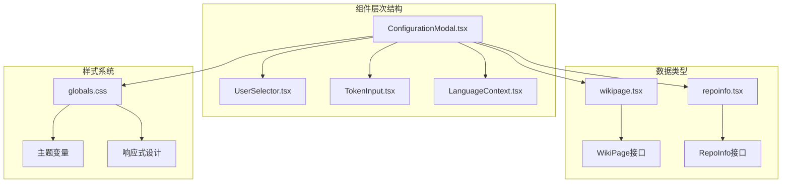
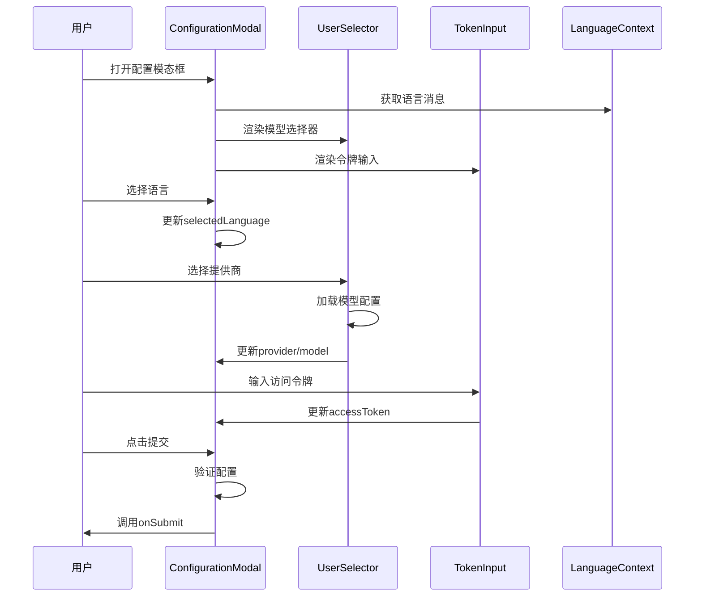
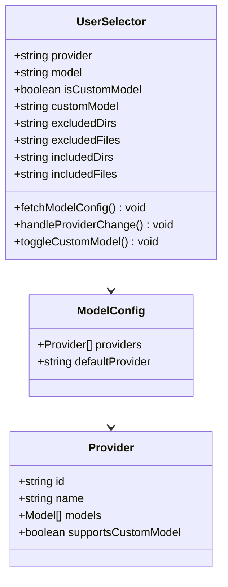
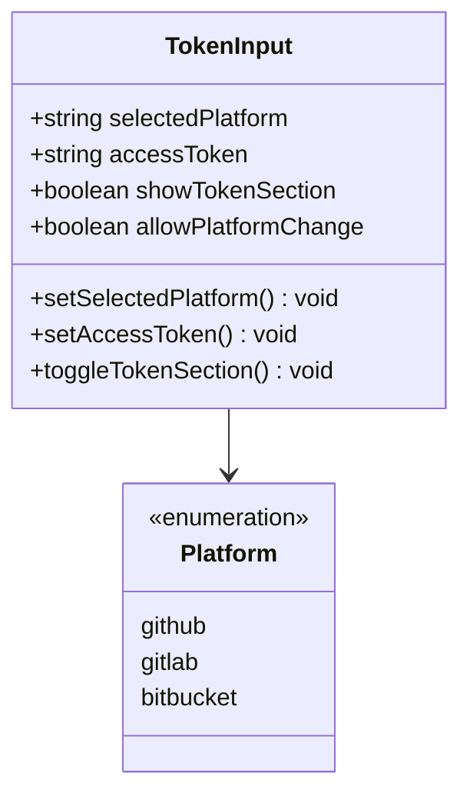
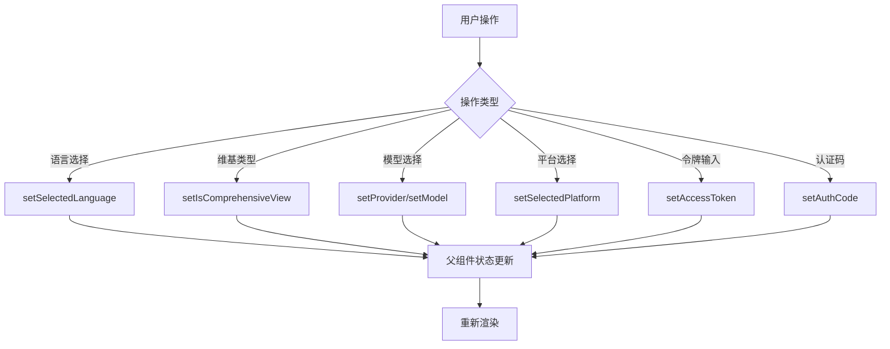
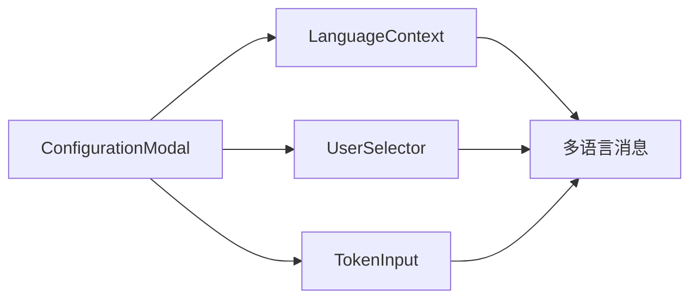

# 配置模态框

<cite>
**本文档中引用的文件**
- [ConfigurationModal.tsx](file://src/components/ConfigurationModal.tsx)
- [UserSelector.tsx](file://src/components/UserSelector.tsx)
- [TokenInput.tsx](file://src/components/TokenInput.tsx)
- [LanguageContext.tsx](file://src/contexts/LanguageContext.tsx)
- [page.tsx](file://src/app/page.tsx)
- [globals.css](file://src/app/globals.css)
- [wikipage.tsx](file://src/types/wiki/wikipage.tsx)
- [repoinfo.tsx](file://src/types/repoinfo.tsx)
</cite>

## 目录
1. [简介](#简介)
2. [项目结构](#项目结构)
3. [核心组件](#核心组件)
4. [架构概览](#架构概览)
5. [详细组件分析](#详细组件分析)
6. [状态控制机制](#状态控制机制)
7. [设计模式](#设计模式)
8. [可访问性设计](#可访问性设计)
9. [性能考虑](#性能考虑)
10. [故障排除指南](#故障排除指南)
11. [结论](#结论)

## 简介

ConfigurationModal.tsx是deepwiki-open项目中的核心配置界面组件，负责管理用户在生成维基文档时的各种配置选项。该组件采用现代化的React设计模式，集成了语言选择、维基类型、模型提供商、访问令牌等关键配置功能，为用户提供直观且功能丰富的配置体验。

该组件采用了函数式编程范式，结合React Hooks实现状态管理，并通过TypeScript确保类型安全。组件设计遵循无障碍访问原则，支持多语言国际化，并提供了优雅的视觉反馈和交互效果。

## 项目结构

ConfigurationModal组件在项目中的组织结构体现了清晰的模块化设计理念：

**图表来源**
- [ConfigurationModal.tsx](file://src/components/ConfigurationModal.tsx#L1-L299)
- [UserSelector.tsx](file://src/components/UserSelector.tsx#L1-L523)
- [TokenInput.tsx](file://src/components/TokenInput.tsx#L1-L108)

**章节来源**
- [ConfigurationModal.tsx](file://src/components/ConfigurationModal.tsx#L1-L299)
- [page.tsx](file://src/app/page.tsx#L443-L479)

## 核心组件

### ConfigurationModal Props接口定义

ConfigurationModal组件通过精心设计的Props接口提供全面的配置能力：

| 属性名称 | 类型 | 必需 | 描述 |
|---------|------|------|------|
| isOpen | boolean | 是 | 控制模态框显示状态 |
| onClose | () => void | 是 | 关闭模态框的回调函数 |
| repositoryInput | string | 是 | 用户输入的仓库地址 |
| selectedLanguage | string | 是 | 当前选中的语言标识符 |
| setSelectedLanguage | (value: string) => void | 是 | 更新语言选择的回调 |
| supportedLanguages | Record<string, string> | 是 | 支持的语言映射表 |
| isComprehensiveView | boolean | 是 | 是否启用综合视图模式 |
| setIsComprehensiveView | (value: boolean) => void | 是 | 切换视图模式的回调 |
| provider | string | 是 | 当前选择的模型提供商 |
| setProvider | (value: string) => void | 是 | 更新提供商的回调 |
| model | string | 是 | 当前选择的模型标识符 |
| setModel | (value: string) => void | 是 | 更新模型的回调 |
| isCustomModel | boolean | 是 | 是否使用自定义模型 |
| setIsCustomModel | (value: boolean) => void | 是 | 切换自定义模型的回调 |
| customModel | string | 是 | 自定义模型名称 |
| setCustomModel | (value: string) => void | 是 | 更新自定义模型名称的回调 |
| selectedPlatform | 'github' \| 'gitlab' \| 'bitbucket' | 是 | 当前选择的代码托管平台 |
| setSelectedPlatform | ('github' \| 'gitlab' \| 'bitbucket') => void | 是 | 更新平台选择的回调 |
| accessToken | string | 是 | 访问令牌字符串 |
| setAccessToken | (value: string) => void | 是 | 更新访问令牌的回调 |
| excludedDirs | string | 是 | 排除的目录列表 |
| setExcludedDirs | (value: string) => void | 是 | 更新排除目录的回调 |
| excludedFiles | string | 是 | 排除的文件列表 |
| setExcludedFiles | (value: string) => void | 是 | 更新排除文件的回调 |
| includedDirs | string | 是 | 包含的目录列表 |
| setIncludedDirs | (value: string) => void | 是 | 更新包含目录的回调 |
| includedFiles | string | 是 | 包含的文件列表 |
| setIncludedFiles | (value: string) => void | 是 | 更新包含文件的回调 |
| onSubmit | () => void | 是 | 提交配置的回调函数 |
| isSubmitting | boolean | 是 | 表单提交状态指示器 |
| authRequired | boolean | 否 | 是否需要认证 |
| authCode | string | 否 | 认证码 |
| setAuthCode | (code: string) => void | 否 | 更新认证码的回调 |
| isAuthLoading | boolean | 否 | 认证加载状态 |

**章节来源**
- [ConfigurationModal.tsx](file://src/components/ConfigurationModal.tsx#L8-L61)

## 架构概览

ConfigurationModal采用了分层架构设计，将复杂的功能分解为独立的子组件：

**图表来源**
- [ConfigurationModal.tsx](file://src/components/ConfigurationModal.tsx#L63-L299)
- [UserSelector.tsx](file://src/components/UserSelector.tsx#L46-L523)
- [TokenInput.tsx](file://src/components/TokenInput.tsx#L16-L108)

## 详细组件分析

### 主要功能区域

ConfigurationModal被划分为多个功能明确的区域，每个区域都承担特定的配置职责：

#### 1. 仓库信息展示区
该区域以只读形式展示用户输入的仓库信息，确保用户能够确认即将处理的项目。

#### 2. 语言选择区
通过下拉菜单提供多语言支持，支持的语言包括英语、日语、中文等多种语言。

#### 3. 维基类型选择区
提供两种维基生成模式：
- **综合模式**：生成详细的结构化维基文档
- **简洁模式**：生成简化的维基文档，页面数量较少

#### 4. 模型选择区
集成UserSelector组件，提供完整的模型配置功能：
- 多提供商支持（OpenAI、Azure、Bedrock等）
- 内置模型与自定义模型切换
- 文件过滤配置

#### 5. 访问令牌区
通过TokenInput组件管理平台访问权限：
- 支持GitHub、GitLab、Bitbucket三大平台
- 可选的令牌显示/隐藏功能
- 平台切换能力

#### 6. 认证码输入区
处理OAuth认证流程中的授权码输入。

**章节来源**
- [ConfigurationModal.tsx](file://src/components/ConfigurationModal.tsx#L128-L273)

### 子组件集成

#### UserSelector组件
负责模型提供商和模型的选择管理：

**图表来源**
- [UserSelector.tsx](file://src/components/UserSelector.tsx#L24-L523)

#### TokenInput组件
管理平台访问令牌的输入和验证：

**图表来源**
- [TokenInput.tsx](file://src/components/TokenInput.tsx#L6-L14)

**章节来源**
- [UserSelector.tsx](file://src/components/UserSelector.tsx#L46-L523)
- [TokenInput.tsx](file://src/components/TokenInput.tsx#L16-L108)

## 状态控制机制

### 本地状态管理

ConfigurationModal实现了多层次的状态管理模式：

#### 1. 基础状态
- `isOpen`: 控制模态框的显示/隐藏
- `showTokenSection`: 控制访问令牌区域的显示状态

#### 2. 配置状态
- 语言选择状态
- 维基类型状态
- 模型选择状态
- 平台选择状态
- 认证状态

#### 3. 回调函数
所有状态变更都通过props传递的回调函数进行管理，确保父组件能够同步这些变更。

### 状态同步机制

**图表来源**
- [ConfigurationModal.tsx](file://src/components/ConfigurationModal.tsx#L63-L299)

**章节来源**
- [ConfigurationModal.tsx](file://src/components/ConfigurationModal.tsx#L101-L103)

## 设计模式

### 函数式组件模式

ConfigurationModal采用函数式组件设计，充分利用React Hooks实现状态管理：

- **useState**: 管理本地状态如`showTokenSection`
- **useEffect**: 处理副作用如依赖监听
- **useContext**: 访问全局语言上下文

### 组件组合模式

通过将复杂功能分解为独立的子组件，实现了高内聚低耦合的设计：

- **单一职责原则**: 每个子组件专注于特定功能
- **可复用性**: 子组件可以在其他地方重用
- **可测试性**: 独立组件便于单元测试

### Props Drilling优化

通过Context API避免了深层的Props传递，特别是在语言国际化方面：

**图表来源**
- [ConfigurationModal.tsx](file://src/components/ConfigurationModal.tsx#L99)
- [LanguageContext.tsx](file://src/contexts/LanguageContext.tsx#L196-L202)

**章节来源**
- [ConfigurationModal.tsx](file://src/components/ConfigurationModal.tsx#L1-L7)
- [LanguageContext.tsx](file://src/contexts/LanguageContext.tsx#L196-L202)

## 可访问性设计

### 键盘导航支持

ConfigurationModal完全支持键盘导航：

- Tab键可以在各个输入元素间循环导航
- Enter键激活按钮和选择操作
- Esc键关闭模态框

### 屏幕阅读器友好

- 语义化的HTML结构
- 适当的ARIA标签
- 有意义的文本描述

### 视觉设计考量

#### 日本美学风格
组件采用了日本传统美学的设计原则：

- **柔和的色彩搭配**: 使用温暖的米色、淡紫色等柔和色调
- **纸质感背景**: 模拟和纸纹理，营造传统美感
- **微妙的阴影效果**: 提供深度感但不过度

#### 响应式设计
- 移动设备友好的触摸目标
- 适当的间距和对比度
- 渐进式增强的交互反馈

**章节来源**
- [globals.css](file://src/app/globals.css#L1-L149)

## 性能考虑

### 渲染优化

- **条件渲染**: 仅在需要时渲染特定区域
- **懒加载**: 子组件按需加载
- **记忆化**: 避免不必要的重新渲染

### 网络请求优化

- **缓存策略**: 模型配置信息的本地缓存
- **错误处理**: 网络失败时的降级方案
- **加载状态**: 明确的加载指示器

### 内存管理

- **及时清理**: 组件卸载时清理事件监听器
- **状态最小化**: 只存储必要的状态信息

## 故障排除指南

### 常见问题及解决方案

#### 1. 模型配置加载失败
**症状**: 模型选择器显示加载错误
**原因**: 网络连接问题或API不可用
**解决方案**: 检查网络连接，查看浏览器开发者工具的网络面板

#### 2. 语言切换不生效
**症状**: 选择新语言后界面仍显示原语言
**原因**: 语言上下文未正确更新
**解决方案**: 检查LanguageContext的提供者配置

#### 3. 访问令牌无效
**症状**: 无法访问私有仓库
**原因**: 令牌格式错误或权限不足
**解决方案**: 验证令牌的有效性和权限范围

#### 4. 模态框无法关闭
**症状**: 点击关闭按钮无响应
**原因**: onClose回调函数未正确设置
**解决方案**: 检查父组件的关闭逻辑

**章节来源**
- [ConfigurationModal.tsx](file://src/components/ConfigurationModal.tsx#L115-L123)
- [UserSelector.tsx](file://src/components/UserSelector.tsx#L108-L111)

## 结论

ConfigurationModal.tsx是一个设计精良、功能完备的配置界面组件。它成功地将复杂的配置需求封装在一个直观易用的界面中，同时保持了良好的可维护性和扩展性。

### 主要优势

1. **模块化设计**: 清晰的组件分离和职责划分
2. **类型安全**: 完整的TypeScript类型定义
3. **用户体验**: 直观的界面设计和流畅的交互
4. **可访问性**: 全面的无障碍访问支持
5. **国际化**: 完善的多语言支持
6. **性能优化**: 高效的状态管理和渲染优化

### 技术亮点

- **现代React实践**: 充分利用Hooks和函数式编程
- **设计系统集成**: 与Tailwind CSS和自定义主题系统的无缝集成
- **状态管理模式**: 灵活的Props Drilling和Context API结合使用
- **错误处理**: 健壮的错误边界和降级策略

该组件为deepwiki-open项目提供了强大的配置能力，是构建高质量Web应用程序的优秀范例。其设计理念和实现方式值得在类似项目中借鉴和应用。