# 前端架构

<cite>
**本文档引用的文件**
- [src/app/layout.tsx](file://src/app/layout.tsx)
- [src/app/page.tsx](file://src/app/page.tsx)
- [src/components/theme-toggle.tsx](file://src/components/theme-toggle.tsx)
- [src/hooks/useProcessedProjects.ts](file://src/hooks/useProcessedProjects.ts)
- [src/contexts/LanguageContext.tsx](file://src/contexts/LanguageContext.tsx)
- [src/components/Ask.tsx](file://src/components/Ask.tsx)
- [src/components/Markdown.tsx](file://src/components/Markdown.tsx)
- [src/components/Mermaid.tsx](file://src/components/Mermaid.tsx)
- [src/components/WikiTreeView.tsx](file://src/components/WikiTreeView.tsx)
- [src/i18n.ts](file://src/i18n.ts)
- [src/utils/websocketClient.ts](file://src/utils/websocketClient.ts)
- [src/components/ModelSelectionModal.tsx](file://src/components/ModelSelectionModal.tsx)
- [package.json](file://package.json)
- [next.config.ts](file://next.config.ts)
</cite>

## 目录
1. [项目概述](#项目概述)
2. [Next.js 15 App Router架构](#nextjs-15-app-router架构)
3. [全局布局与主题系统](#全局布局与主题系统)
4. [首页组件分析](#首页组件分析)
5. [核心UI组件详解](#核心ui组件详解)
6. [状态管理与数据流](#状态管理与数据流)
7. [国际化实现](#国际化实现)
8. [WebSocket通信机制](#websocket通信机制)
9. [性能优化策略](#性能优化策略)
10. [组件间通信模式](#组件间通信模式)
11. [总结](#总结)

## 项目概述

deepwiki-open是一个基于Next.js 15构建的现代化前端应用，采用App Router模式实现全栈Web开发。该项目专注于代码仓库的智能分析和可视化，提供深度研究功能和交互式图表展示。

### 技术栈概览

- **框架**: Next.js 15.3.1 (App Router模式)
- **状态管理**: React Hooks + Context API
- **样式**: Tailwind CSS v4 + 自定义主题系统
- **国际化**: next-intl v4.1.0
- **图表渲染**: Mermaid.js + svg-pan-zoom
- **实时通信**: WebSocket + HTTP回退

**章节来源**
- [package.json](file://package.json#L1-L39)
- [next.config.ts](file://next.config.ts#L1-L71)

## Next.js 15 App Router架构

### 路由结构设计

Next.js 15的App Router采用文件系统路由，支持嵌套路由和动态路由。项目的核心路由结构如下：

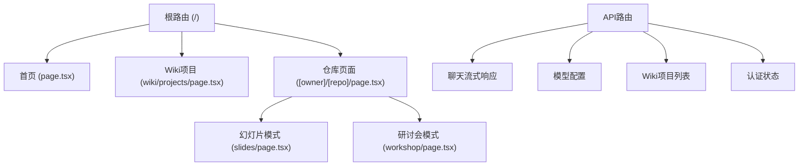

**图表来源**
- [src/app/layout.tsx](file://src/app/layout.tsx#L1-L51)
- [src/app/page.tsx](file://src/app/page.tsx#L1-L625)

### 布局层次结构

应用采用分层布局架构，确保一致的用户体验：

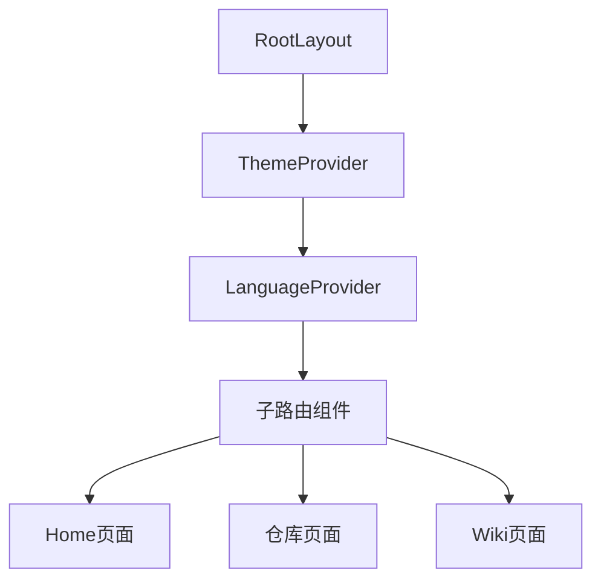

**图表来源**
- [src/app/layout.tsx](file://src/app/layout.tsx#L32-L46)

**章节来源**
- [src/app/layout.tsx](file://src/app/layout.tsx#L1-L51)

## 全局布局与主题系统

### 主题切换机制

主题系统通过`next-themes`库实现，支持明暗模式自动切换和用户偏好保存。

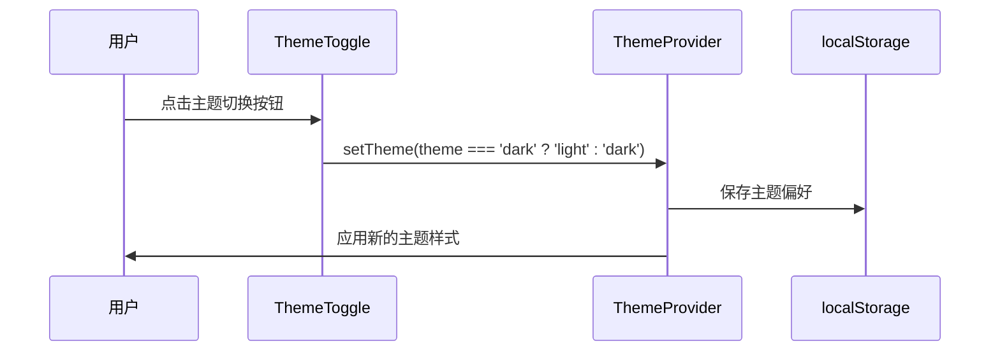

**图表来源**
- [src/components/theme-toggle.tsx](file://src/components/theme-toggle.tsx#L5-L15)

### 字体系统配置

应用集成了多种日语友好字体，确保国际化体验：

| 字体类型 | 字体名称 | 用途 | 权重 |
|---------|---------|------|------|
| Sans Serif | Noto Sans JP | 正文文本 | 400, 500, 700 |
| Serif | Noto Serif JP | 引用和强调 | 400, 500, 700 |
| Monospace | Geist Mono | 代码块和技术文本 | 400 |

**章节来源**
- [src/app/layout.tsx](file://src/app/layout.tsx#L7-L26)
- [src/components/theme-toggle.tsx](file://src/components/theme-toggle.tsx#L1-L50)

## 首页组件分析

### 组件架构设计

首页是应用的核心入口点，采用模块化设计，将不同功能分离到独立组件中。

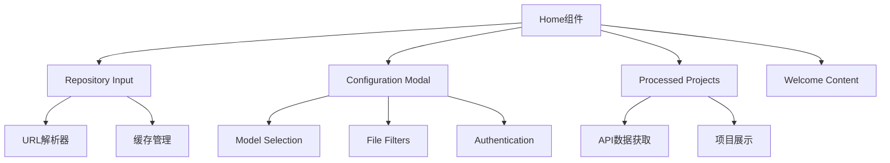

**图表来源**
- [src/app/page.tsx](file://src/app/page.tsx#L45-L625)

### 状态管理策略

首页使用多个状态钩子管理复杂的状态逻辑：

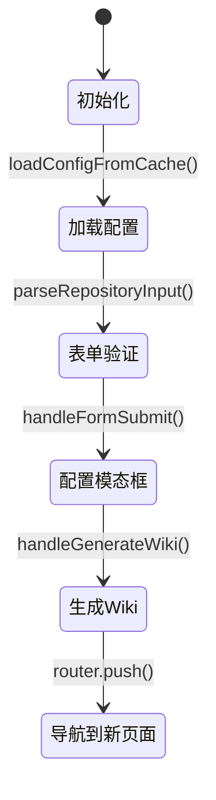

**图表来源**
- [src/app/page.tsx](file://src/app/page.tsx#L118-L391)

### 数据流管理

应用采用声明式数据流，通过React Hooks实现状态同步：

| 状态类型 | Hook | 用途 | 更新时机 |
|---------|------|------|----------|
| 仓库输入 | `useState` | 存储用户输入的仓库URL | 输入变化时 |
| 配置状态 | 多个`useState` | 模型、语言、文件过滤器 | 配置变更时 |
| 加载状态 | `useState` | 显示加载指示器 | API调用期间 |
| 错误状态 | `useState` | 显示错误信息 | 发生错误时 |

**章节来源**
- [src/app/page.tsx](file://src/app/page.tsx#L1-L625)

## 核心UI组件详解

### Ask.tsx - 智能对话组件

Ask组件是应用的核心交互组件，提供流式响应和深度研究功能。

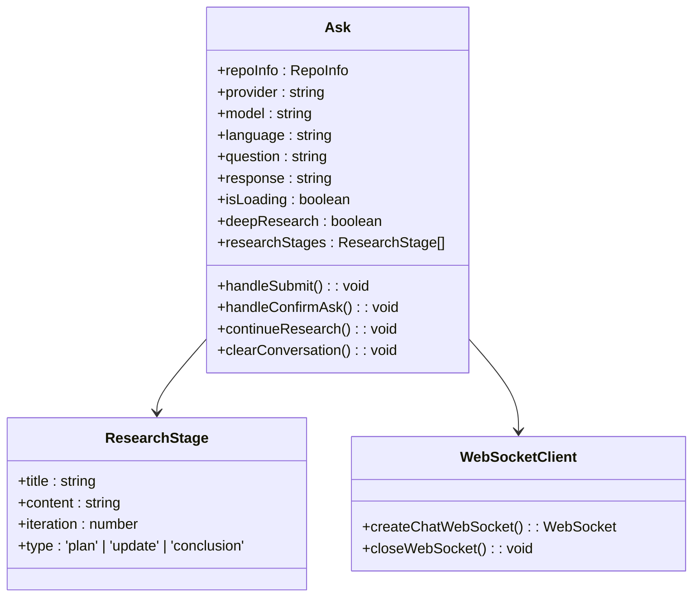

**图表来源**
- [src/components/Ask.tsx](file://src/components/Ask.tsx#L1-L800)

#### 流式响应处理

Ask组件实现了复杂的流式响应处理机制：

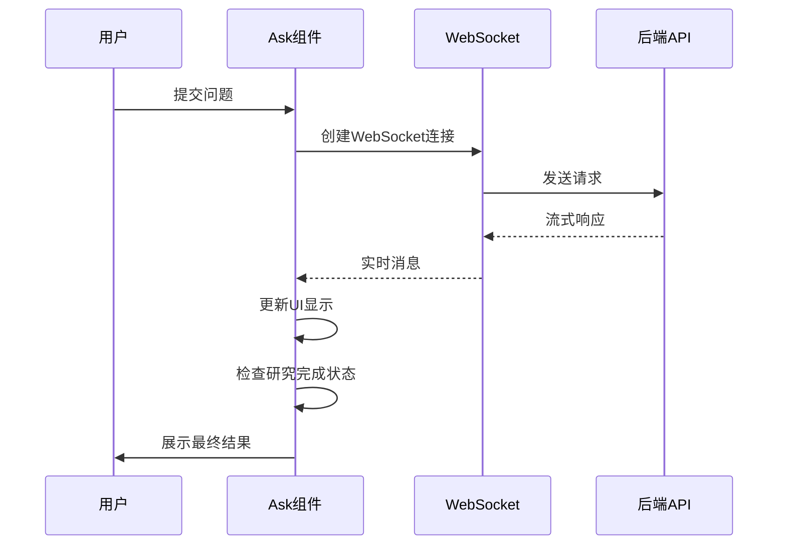

**图表来源**
- [src/components/Ask.tsx](file://src/components/Ask.tsx#L578-L620)

### Markdown.tsx - 安全渲染组件

Markdown组件负责安全渲染AI生成的内容，支持多种语法扩展。

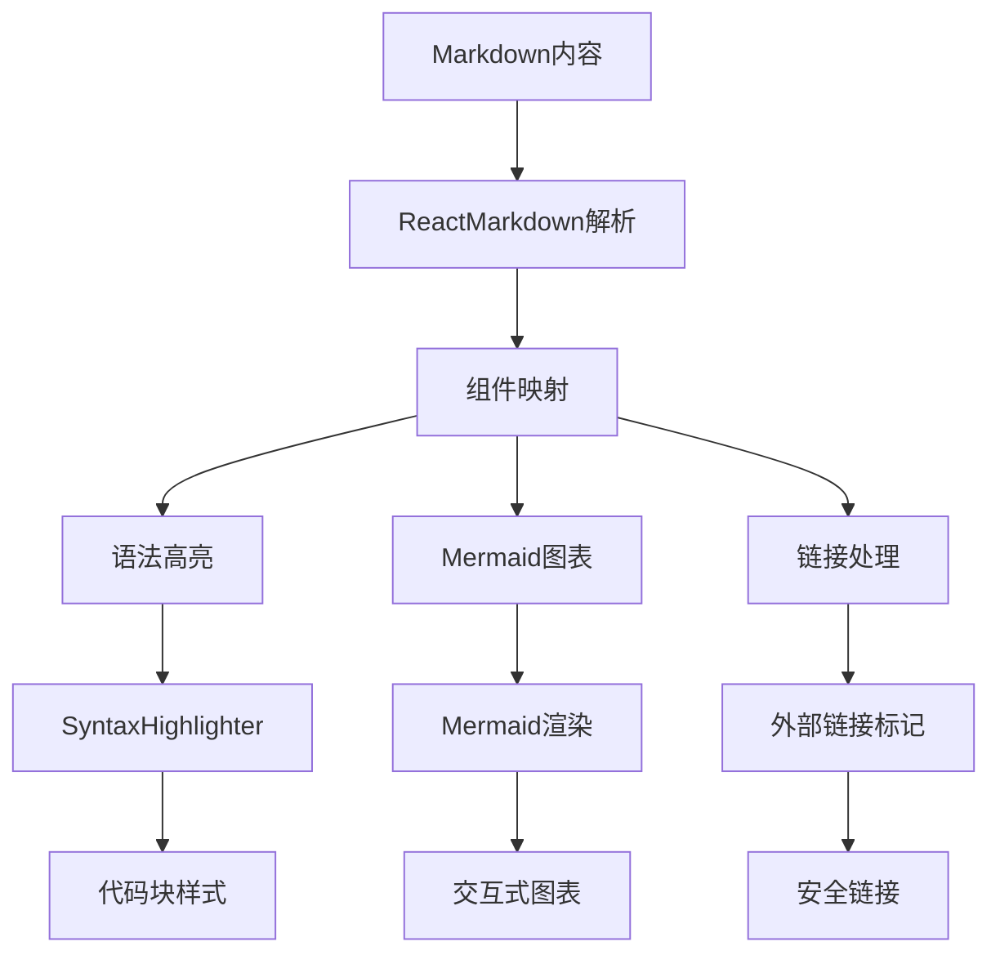

**图表来源**
- [src/components/Markdown.tsx](file://src/components/Markdown.tsx#L1-L208)

### Mermaid.tsx - 图表渲染组件

Mermaid组件提供强大的图表渲染能力，支持多种图表类型和交互功能。

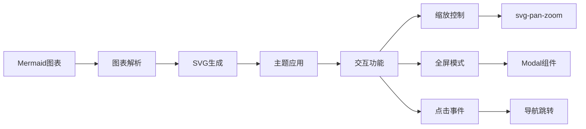

**图表来源**
- [src/components/Mermaid.tsx](file://src/components/Mermaid.tsx#L1-L491)

### WikiTreeView.tsx - 文件树组件

WikiTreeView以树形结构展示仓库文件体系，支持展开/折叠操作。

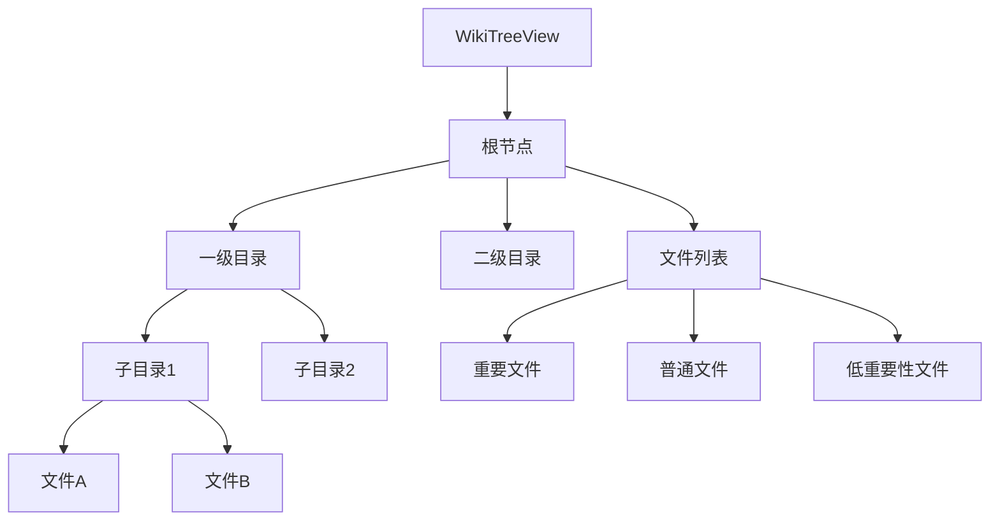

**图表来源**
- [src/components/WikiTreeView.tsx](file://src/components/WikiTreeView.tsx#L1-L184)

**章节来源**
- [src/components/Ask.tsx](file://src/components/Ask.tsx#L1-L800)
- [src/components/Markdown.tsx](file://src/components/Markdown.tsx#L1-L208)
- [src/components/Mermaid.tsx](file://src/components/Mermaid.tsx#L1-L491)
- [src/components/WikiTreeView.tsx](file://src/components/WikiTreeView.tsx#L1-L184)

## 状态管理与数据流

### useProcessedProjects Hook

自定义Hook负责获取和管理处理后的项目列表，支持WebSocket和API两种数据源。

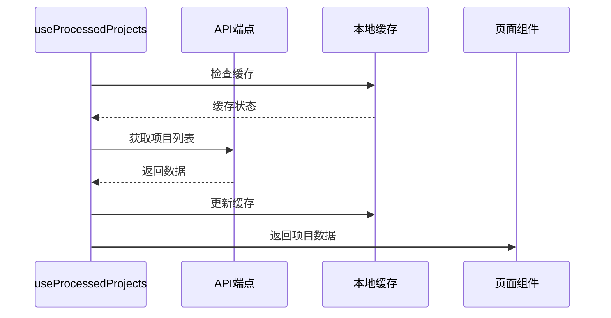

**图表来源**
- [src/hooks/useProcessedProjects.ts](file://src/hooks/useProcessedProjects.ts#L13-L47)

### 状态同步机制

应用采用多种模式实现状态同步：

| 同步模式 | 实现方式 | 适用场景 | 性能特点 |
|---------|---------|----------|----------|
| 单向绑定 | Props传递 | 父子组件通信 | 高性能，无额外开销 |
| Context API | LanguageContext | 全局状态共享 | 中等性能，跨层级访问 |
| 自定义Hook | useProcessedProjects | 数据获取和缓存 | 可缓存，减少重复请求 |
| 事件回调 | 回调函数 | 组件间通信 | 低延迟，直接调用 |

**章节来源**
- [src/hooks/useProcessedProjects.ts](file://src/hooks/useProcessedProjects.ts#L1-L47)

## 国际化实现

### 语言上下文架构

LanguageContext提供了完整的国际化解决方案，支持动态语言切换和浏览器语言检测。

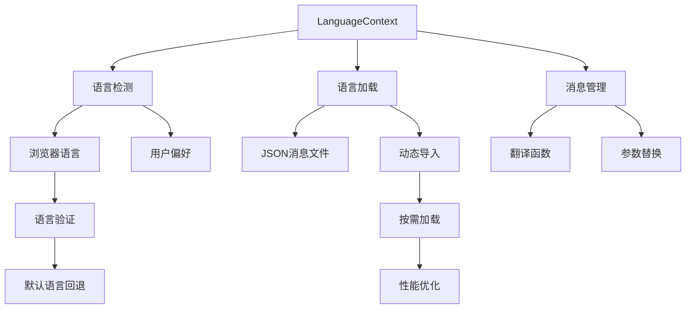

**图表来源**
- [src/contexts/LanguageContext.tsx](file://src/contexts/LanguageContext.tsx#L1-L203)

### 支持的语言列表

| 语言代码 | 语言名称 | 文本方向 | 特殊考虑 |
|---------|---------|----------|----------|
| en | 英语 | 左到右 | 默认语言 |
| ja | 日语 | 左到右 | 日本字体支持 |
| zh | 中文（简体） | 左到右 | 简体中文 |
| zh-tw | 中文（繁体） | 左到右 | 繁体中文 |
| es | 西班牙语 | 左到右 | 拉丁字母 |
| kr | 韩语 | 左到右 | 韩文字母 |
| vi | 越南语 | 左到右 | 拉丁字母 |
| pt-br | 巴西葡萄牙语 | 左到右 | 拉丁字母 |
| fr | 法语 | 左到右 | 拉丁字母 |
| ru | 俄语 | 左到右 | 西里尔字母 |

### 动态语言加载

语言系统采用动态导入机制，实现按需加载和性能优化：

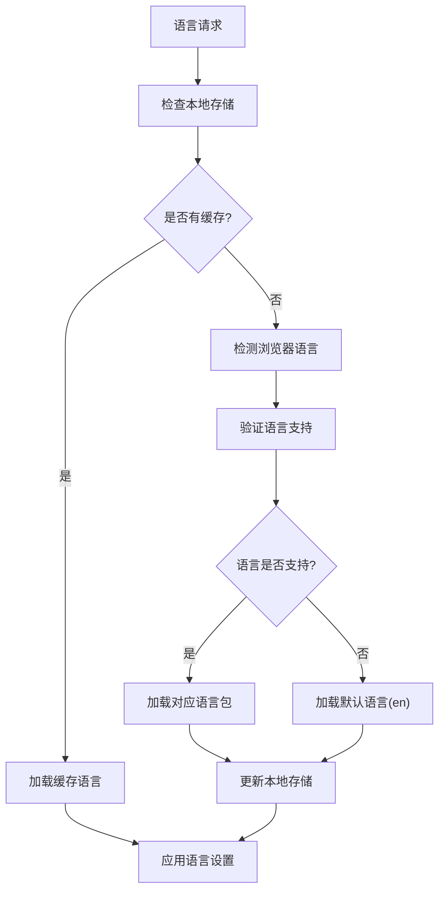

**图表来源**
- [src/contexts/LanguageContext.tsx](file://src/contexts/LanguageContext.tsx#L101-L176)

**章节来源**
- [src/contexts/LanguageContext.tsx](file://src/contexts/LanguageContext.tsx#L1-L203)
- [src/i18n.ts](file://src/i18n.ts#L1-L15)

## WebSocket通信机制

### WebSocket客户端架构

应用实现了完整的WebSocket客户端，支持实时流式响应和错误处理。

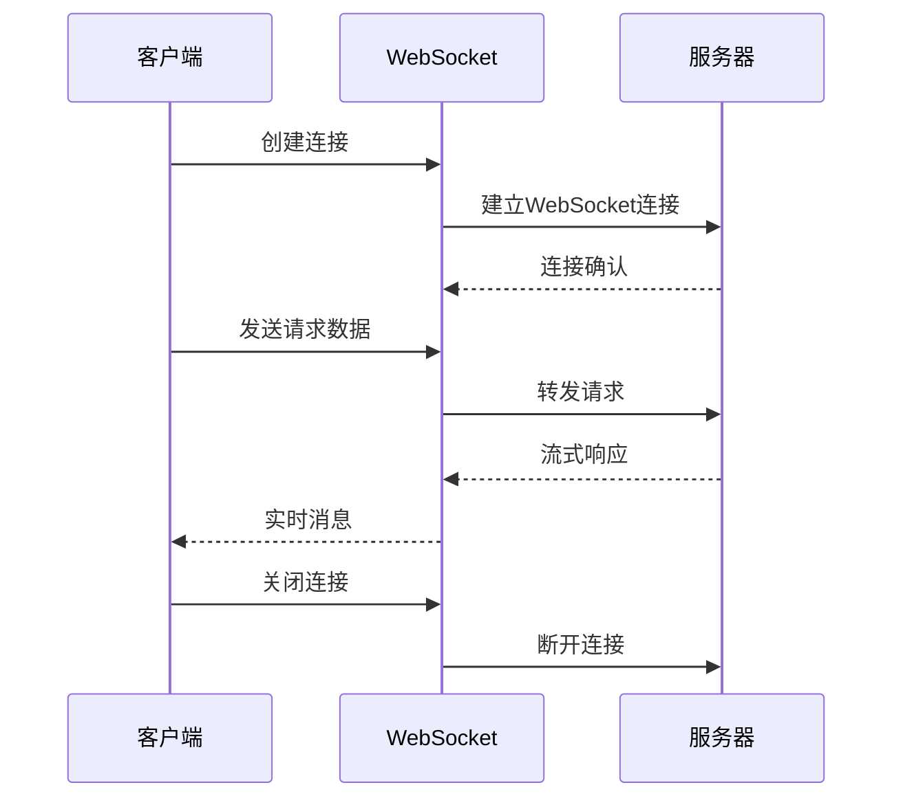

**图表来源**
- [src/utils/websocketClient.ts](file://src/utils/websocketClient.ts#L43-L86)

### 错误处理与回退机制

WebSocket连接失败时，系统自动降级到HTTP流式API：

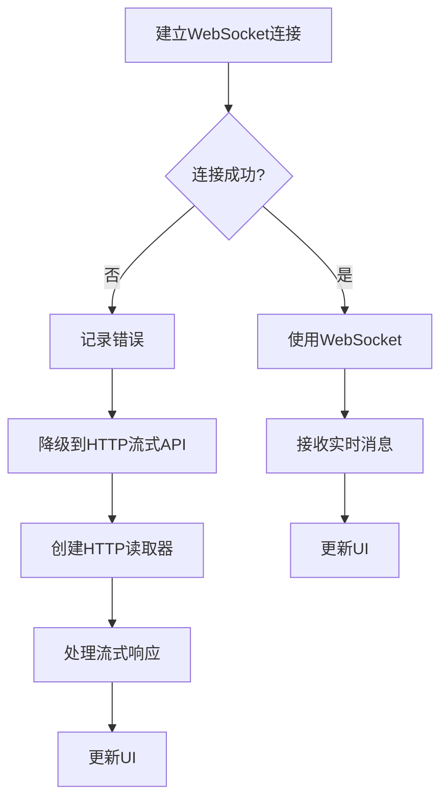

**图表来源**
- [src/utils/websocketClient.ts](file://src/utils/websocketClient.ts#L1-L86)

### 连接管理策略

| 连接类型 | 使用场景 | 超时设置 | 重试机制 | 错误处理 |
|---------|---------|----------|----------|----------|
| WebSocket | 实时对话 | 30秒 | 自动重连 | 降级到HTTP |
| HTTP流式 | 回退模式 | 60秒 | 手动重试 | 显示错误信息 |
| API调用 | 数据获取 | 15秒 | 指数退避 | 用户提示 |

**章节来源**
- [src/utils/websocketClient.ts](file://src/utils/websocketClient.ts#L1-L86)

## 性能优化策略

### 懒加载机制

应用采用多种懒加载策略提升初始加载性能：

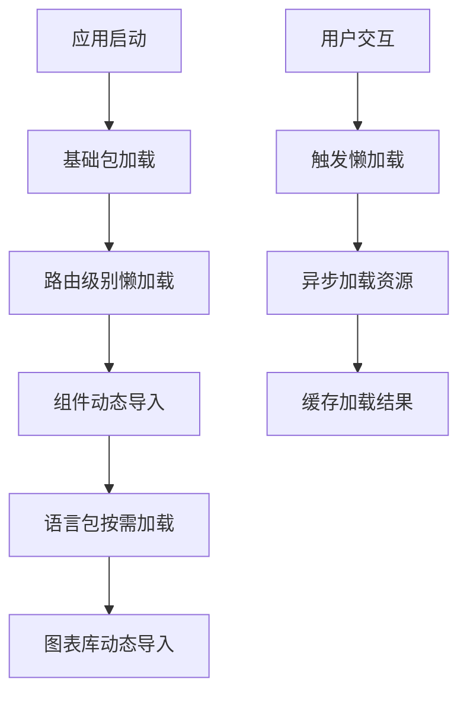

### 虚拟滚动实现

对于大型文档和列表，应用实现了虚拟滚动技术：

| 组件类型 | 虚拟滚动方案 | 性能收益 | 内存占用 |
|---------|-------------|----------|----------|
| 文件树 | 完整虚拟滚动 | 减少DOM节点 | 保持固定内存 |
| 项目列表 | 渐进式渲染 | 快速响应 | 最小内存占用 |
| 对话历史 | 分页加载 | 平衡性能 | 可控内存使用 |
| 图表展示 | 懒加载渲染 | 快速初始化 | 按需渲染 |

### 缓存策略

应用实现了多层次的缓存机制：

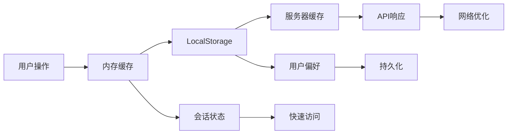

### Bundle优化

通过Webpack配置实现代码分割和优化：

| 优化策略 | 实现方式 | 效果 | 影响范围 |
|---------|---------|------|----------|
| 代码分割 | Dynamic Imports | 减少初始包大小 | 所有动态组件 |
| Tree Shaking | ES6模块 | 移除未使用代码 | 所有依赖包 |
| 压缩优化 | Terser Plugin | 减少传输大小 | 生产构建 |
| 缓存策略 | Chunk Hashing | 提升缓存效率 | 静态资源 |

**章节来源**
- [next.config.ts](file://next.config.ts#L1-L71)

## 组件间通信模式

### 上下文通信模式

ModelSelectionModal通过Context API更新全局AI模型配置：

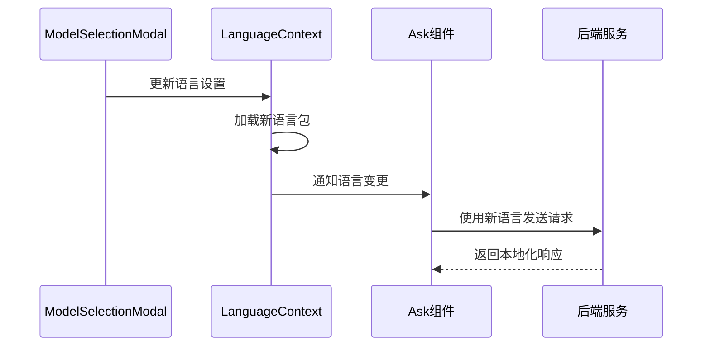

**图表来源**
- [src/components/ModelSelectionModal.tsx](file://src/components/ModelSelectionModal.tsx#L1-L260)

### 父子组件通信

通过Props和回调函数实现父子组件间的通信：

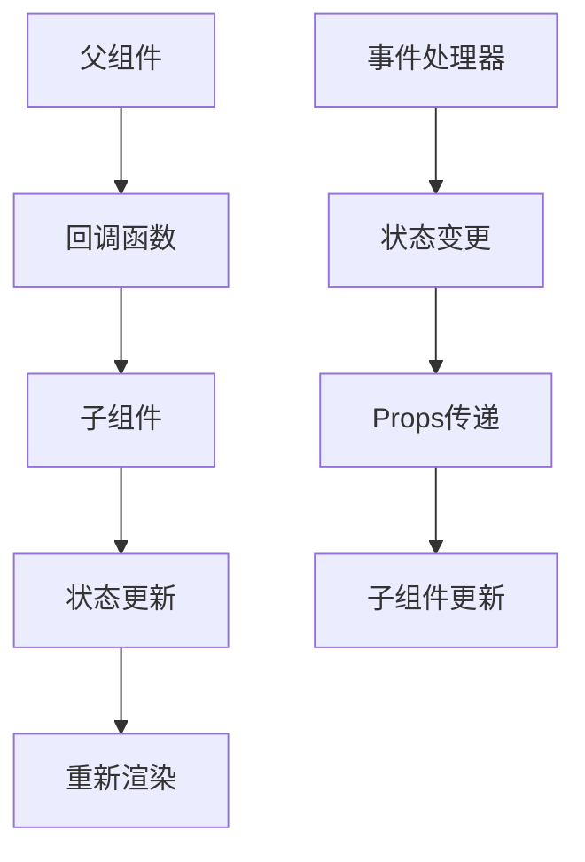

### 事件总线模式

对于跨层级组件通信，应用采用事件总线模式：

| 事件类型 | 触发条件 | 处理方式 | 影响范围 |
|---------|---------|----------|----------|
| 语言切换 | 用户选择新语言 | Context更新 | 全局组件 |
| 主题变更 | 用户切换主题 | CSS变量更新 | 所有组件 |
| 模型配置 | 用户修改模型 | 本地存储 | 当前会话 |
| 错误通知 | API调用失败 | 全局错误边界 | 整个应用 |

**章节来源**
- [src/components/ModelSelectionModal.tsx](file://src/components/ModelSelectionModal.tsx#L1-L260)

## 总结

deepwiki-open的前端架构展现了现代React应用的最佳实践，主要特点包括：

### 架构优势

1. **模块化设计**: 清晰的组件分层和职责分离
2. **状态管理**: 合理的状态管理模式和数据流
3. **国际化支持**: 完整的多语言解决方案
4. **性能优化**: 多层次的性能优化策略
5. **用户体验**: 流畅的交互和响应式设计

### 技术亮点

- **Next.js 15 App Router**: 利用最新的路由特性
- **WebSocket实时通信**: 提供流畅的用户体验
- **动态主题系统**: 支持明暗模式切换
- **智能缓存机制**: 提升应用性能和离线体验
- **国际化架构**: 支持10种语言的完整解决方案

### 扩展性考虑

架构设计充分考虑了未来的扩展需求：
- 插件化的组件系统
- 可配置的主题和语言包
- 模块化的功能扩展
- 渐进式的性能优化

这种架构设计不仅满足了当前的功能需求，还为未来的功能扩展和技术演进奠定了坚实的基础。