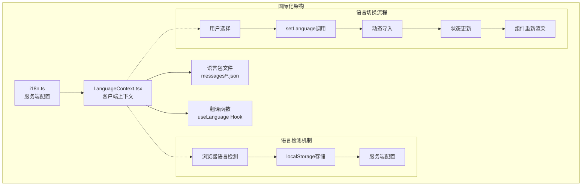
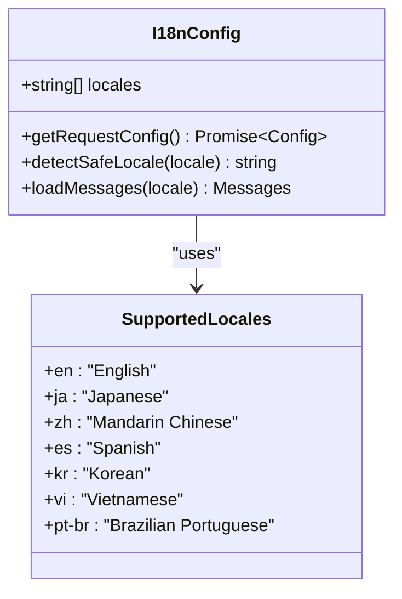
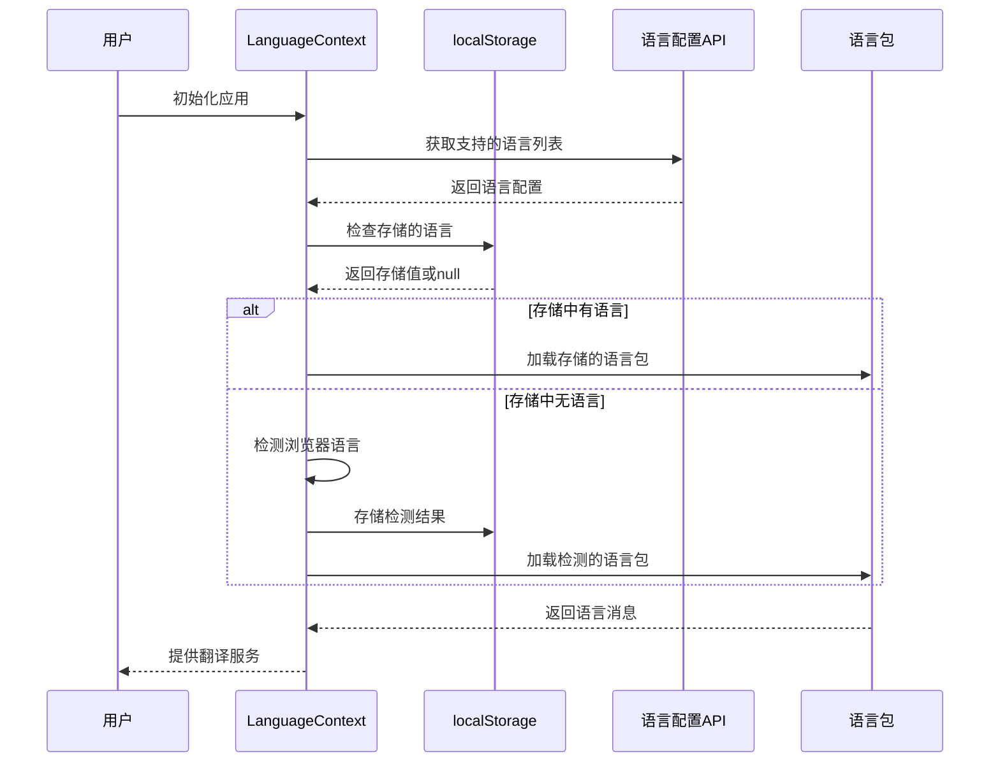
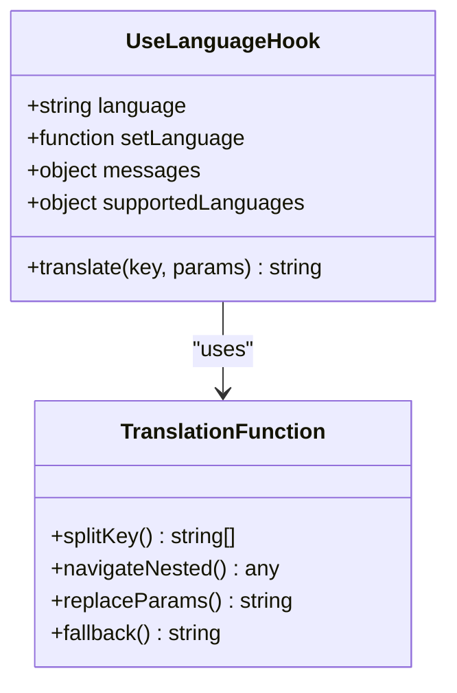
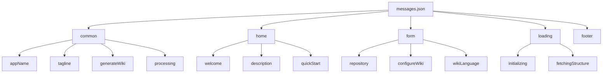
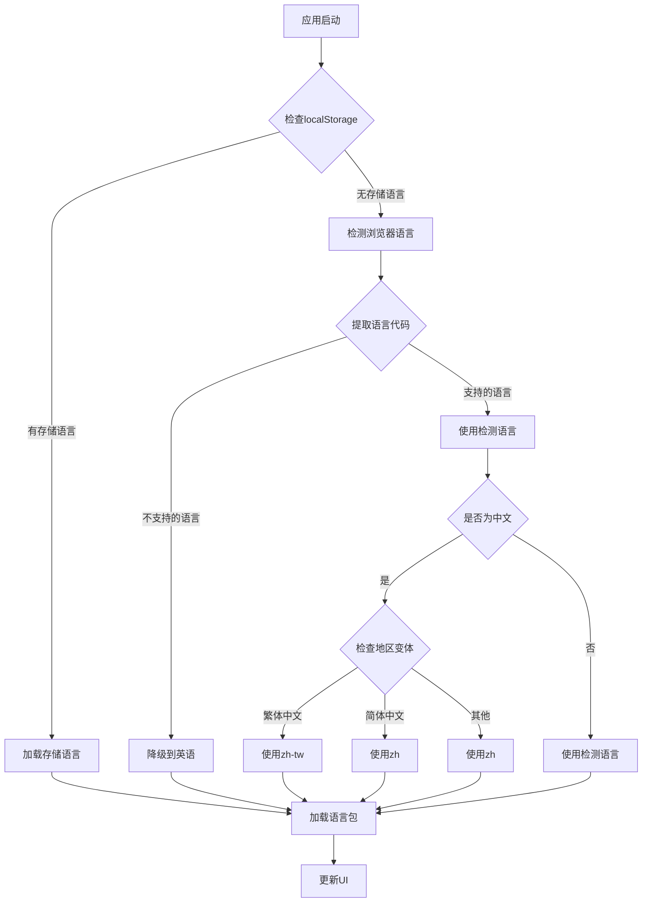
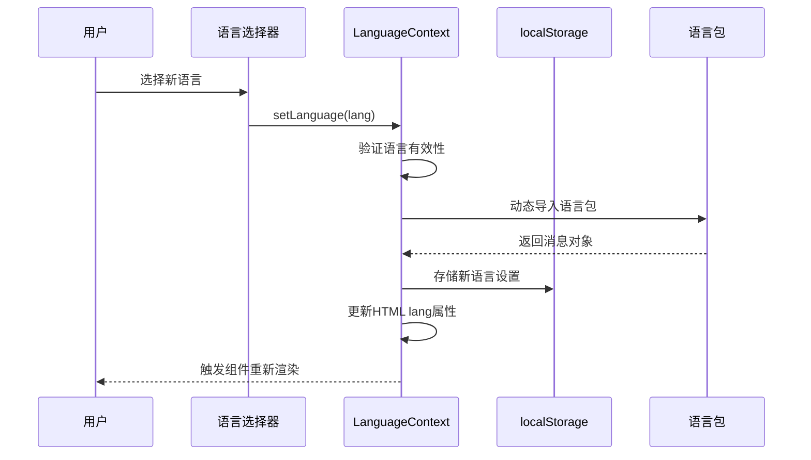
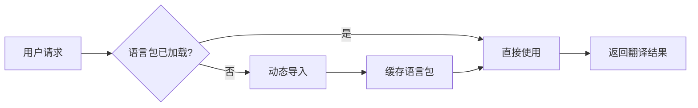
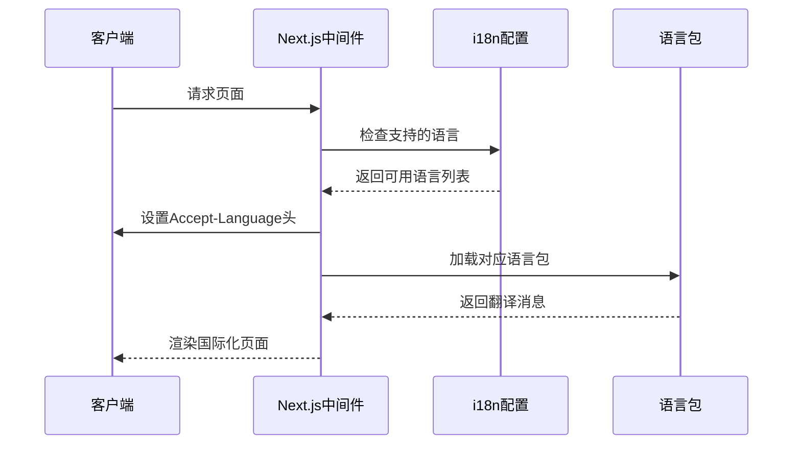

# 国际化实现

<cite>
**本文档引用的文件**
- [src/i18n.ts](file://src/i18n.ts)
- [src/contexts/LanguageContext.tsx](file://src/contexts/LanguageContext.tsx)
- [src/messages/en.json](file://src/messages/en.json)
- [src/messages/zh.json](file://src/messages/zh.json)
- [src/app/layout.tsx](file://src/app/layout.tsx)
- [src/app/page.tsx](file://src/app/page.tsx)
- [api/config/lang.json](file://api/config/lang.json)
- [next.config.ts](file://next.config.ts)
- [package.json](file://package.json)
</cite>

## 目录
1. [简介](#简介)
2. [项目架构概览](#项目架构概览)
3. [核心组件分析](#核心组件分析)
4. [语言包结构设计](#语言包结构设计)
5. [语言切换机制](#语言切换机制)
6. [新增语言流程](#新增语言流程)
7. [性能优化策略](#性能优化策略)
8. [故障排除指南](#故障排除指南)
9. [总结](#总结)

## 简介

deepwiki-open项目采用了一套完整的国际化（i18n）解决方案，基于Next.js的next-intl库构建。该系统支持多种语言的动态加载、智能语言检测、以及灵活的语言切换机制。系统能够根据用户的浏览器偏好或手动选择自动加载对应的语言资源文件，并提供全局翻译函数供整个应用使用。

## 项目架构概览

国际化系统的核心架构围绕三个主要组件构建：



**图表来源**
- [src/i18n.ts](file://src/i18n.ts#L1-L15)
- [src/contexts/LanguageContext.tsx](file://src/contexts/LanguageContext.tsx#L17-L202)

**章节来源**
- [src/i18n.ts](file://src/i18n.ts#L1-L15)
- [src/contexts/LanguageContext.tsx](file://src/contexts/LanguageContext.tsx#L1-L202)
- [src/app/layout.tsx](file://src/app/layout.tsx#L1-L51)

## 核心组件分析

### i18n.ts - 服务端配置

i18n.ts文件负责定义支持的语言列表和服务端的国际化配置：



**图表来源**
- [src/i18n.ts](file://src/i18n.ts#L4-L14)

该配置文件的主要功能：
- 定义支持的语言列表（en, ja, zh, es, kr, vi, pt-br）
- 提供安全的语言检测机制
- 动态导入对应的语言资源文件

**章节来源**
- [src/i18n.ts](file://src/i18n.ts#L1-L15)

### LanguageContext.tsx - 客户端上下文

LanguageContext是国际化系统的核心组件，负责管理语言状态和提供语言切换功能：



**图表来源**
- [src/contexts/LanguageContext.tsx](file://src/contexts/LanguageContext.tsx#L102-L149)

**章节来源**
- [src/contexts/LanguageContext.tsx](file://src/contexts/LanguageContext.tsx#L1-L202)

### useLanguage Hook - 全局翻译接口

useLanguage Hook提供了简洁的翻译接口，允许组件直接访问当前语言环境：



**图表来源**
- [src/app/page.tsx](file://src/app/page.tsx#L50-L76)

**章节来源**
- [src/app/page.tsx](file://src/app/page.tsx#L46-L76)

## 语言包结构设计

### 键名命名规范

语言包采用层次化的键名结构，遵循以下设计原则：

| 层级 | 命名规则 | 示例 | 用途 |
|------|----------|------|------|
| 一级分类 | 小写字母和下划线 | `common`, `home`, `form` | 功能模块分组 |
| 二级键名 | 小写字母和下划线 | `appName`, `welcome`, `repository` | 具体元素标识 |
| 参数占位符 | 大括号包裹 | `{platform}`, `{count}` | 动态内容替换 |

### 嵌套层级设计

语言包支持多层嵌套结构，便于组织和维护：



**图表来源**
- [src/messages/en.json](file://src/messages/en.json#L1-L143)
- [src/messages/zh.json](file://src/messages/zh.json#L1-L134)

### 占位符使用方法

系统支持参数化翻译，允许在运行时动态替换内容：

```typescript
// 使用示例
const translatedText = t('form.personalAccessToken', { 
  platform: 'GitHub' 
});

// 输出："GitHub Personal Access Token"
```

**章节来源**
- [src/messages/en.json](file://src/messages/en.json#L1-L143)
- [src/messages/zh.json](file://src/messages/zh.json#L1-L134)

## 语言切换机制

### 自动语言检测

系统实现了智能的语言检测机制：



**图表来源**
- [src/contexts/LanguageContext.tsx](file://src/contexts/LanguageContext.tsx#L25-L66)

### 手动语言切换

用户可以通过界面手动切换语言：



**图表来源**
- [src/contexts/LanguageContext.tsx](file://src/contexts/LanguageContext.tsx#L152-L176)

**章节来源**
- [src/contexts/LanguageContext.tsx](file://src/contexts/LanguageContext.tsx#L25-L176)

## 新增语言流程

### 步骤1：添加语言包文件

1. 在`src/messages/`目录下创建新的JSON文件
2. 文件命名为ISO语言代码（如`de.json`、`ar.json`）
3. 复制现有语言包作为模板
4. 翻译所有键值对

### 步骤2：更新支持的语言列表

编辑`src/i18n.ts`文件，添加新语言到支持列表：

```typescript
// 在第4行添加新语言
export const locales = ['en', 'ja', 'zh', 'es', 'kr', 'vi', 'pt-br', 'de'];
```

### 步骤3：更新API配置

编辑`api/config/lang.json`文件，添加语言显示名称：

```json
{
  "supported_languages": {
    "en": "English",
    "ja": "Japanese (日本語)",
    "zh": "Mandarin Chinese (中文)",
    "es": "Spanish (Español)",
    "kr": "Korean (한국어)",
    "vi": "Vietnamese (Tiếng Việt)",
    "pt-br": "Brazilian Portuguese (Português Brasileiro)",
    "de": "German (Deutsch)"
  }
}
```

### 步骤4：测试验证

1. 启动开发服务器
2. 访问应用并切换到新语言
3. 验证所有界面元素正确翻译
4. 检查浏览器语言检测是否支持新语言
5. 测试语言切换功能

**章节来源**
- [src/i18n.ts](file://src/i18n.ts#L4-L4)
- [api/config/lang.json](file://api/config/lang.json#L2-L15)

## 性能优化策略

### 语言资源懒加载

系统采用动态导入的方式加载语言包，实现按需加载：



**图表来源**
- [src/contexts/LanguageContext.tsx](file://src/contexts/LanguageContext.tsx#L127-L129)

### 缓存策略

1. **localStorage缓存**：浏览器端存储用户首选语言
2. **内存缓存**：React状态中缓存当前语言包
3. **服务端缓存**：API响应中包含语言配置

### 服务端语言协商

通过Next.js的国际化中间件实现服务端语言协商：



**图表来源**
- [src/i18n.ts](file://src/i18n.ts#L6-L14)

**章节来源**
- [src/contexts/LanguageContext.tsx](file://src/contexts/LanguageContext.tsx#L105-L149)
- [src/i18n.ts](file://src/i18n.ts#L6-L14)

## 故障排除指南

### 常见问题及解决方案

| 问题 | 症状 | 解决方案 |
|------|------|----------|
| 语言包加载失败 | 显示英文或键名 | 检查JSON语法，确保文件编码为UTF-8 |
| 浏览器语言检测失效 | 默认使用英语 | 检查navigator.language可用性 |
| 语言切换无效果 | UI不更新 | 确认useLanguage Hook正确使用 |
| 中文语言显示异常 | 字体显示问题 | 检查字体配置和CSS变量 |

### 调试技巧

1. **启用调试日志**：在LanguageContext中添加console.log语句
2. **检查网络请求**：确认语言包文件正确加载
3. **验证状态更新**：使用React DevTools检查语言状态
4. **测试边界情况**：模拟各种语言环境和错误场景

**章节来源**
- [src/contexts/LanguageContext.tsx](file://src/contexts/LanguageContext.tsx#L138-L142)
- [src/contexts/LanguageContext.tsx](file://src/contexts/LanguageContext.tsx#L173-L175)

## 总结

deepwiki-open的国际化系统提供了一个完整、灵活且高性能的多语言解决方案。通过服务端配置、客户端上下文和动态语言包加载的组合，系统能够智能地适应不同用户的语言偏好，同时保持良好的性能表现。

### 主要优势

1. **自动化语言检测**：智能识别浏览器语言偏好
2. **灵活的语言切换**：支持用户手动选择和保存偏好
3. **模块化语言包**：清晰的结构设计便于维护和扩展
4. **性能优化**：懒加载和缓存策略确保快速响应
5. **易于扩展**：标准化的流程支持新语言的快速添加

### 最佳实践建议

1. **保持键名一致性**：确保所有语言包使用相同的键名结构
2. **合理使用参数化**：充分利用占位符功能提高翻译灵活性
3. **定期更新语言包**：随着功能增加及时补充翻译
4. **测试多语言环境**：在不同语言环境下充分测试应用功能
5. **关注字符编码**：确保所有语言文件使用UTF-8编码

这套国际化系统为deepwiki-open项目提供了坚实的基础，使其能够服务于全球用户，真正实现AI驱动的跨语言文档生成目标。