# 工具函数参考文档

<cite>
**本文档中引用的文件**
- [getRepoUrl.tsx](file://src/utils/getRepoUrl.tsx)
- [urlDecoder.tsx](file://src/utils/urlDecoder.tsx)
- [repoinfo.tsx](file://src/types/repoinfo.tsx)
- [page.tsx](file://src/app/[owner]/[repo]/page.tsx)
- [page.tsx](file://src/app/page.tsx)
- [Ask.tsx](file://src/components/Ask.tsx)
- [route.ts](file://src/app/api/wiki/projects/route.ts)
- [test_extract_repo_name.py](file://test/test_extract_repo_name.py)
</cite>

## 目录
1. [简介](#简介)
2. [项目结构概览](#项目结构概览)
3. [核心工具函数](#核心工具函数)
4. [架构设计](#架构设计)
5. [详细功能分析](#详细功能分析)
6. [使用场景与集成](#使用场景与集成)
7. [安全性与边界处理](#安全性与边界处理)
8. [扩展指南](#扩展指南)
9. [最佳实践](#最佳实践)
10. [总结](#总结)

## 简介

deepwiki-open是一个基于Next.js的现代化代码知识库生成工具，其前端工具函数模块提供了关键的数据处理和URL解析能力。本文档详细介绍了两个核心工具函数：`getRepoUrl`和`urlDecoder`，它们在确保数据一致性、安全性以及支持多平台代码托管服务方面发挥着重要作用。

这些工具函数不仅为前端组件提供了统一的数据处理接口，还通过严格的输入验证和错误处理机制，保障了整个应用的安全性和稳定性。

## 项目结构概览

deepwiki-open采用模块化架构设计，工具函数位于专门的`src/utils/`目录下，与业务逻辑保持清晰分离：

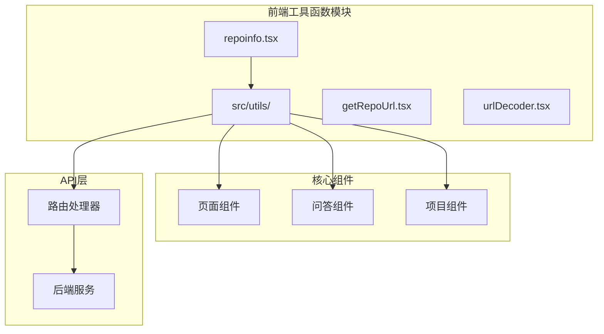

**图表来源**
- [getRepoUrl.tsx](file://src/utils/getRepoUrl.tsx#L1-L17)
- [urlDecoder.tsx](file://src/utils/urlDecoder.tsx#L1-L19)
- [repoinfo.tsx](file://src/types/repoinfo.tsx#L1-L10)

**章节来源**
- [getRepoUrl.tsx](file://src/utils/getRepoUrl.tsx#L1-L17)
- [urlDecoder.tsx](file://src/utils/urlDecoder.tsx#L1-L19)
- [repoinfo.tsx](file://src/types/repoinfo.tsx#L1-L10)

## 核心工具函数

### RepoInfo 类型定义

工具函数的核心依赖是`RepoInfo`接口，它定义了仓库信息的标准结构：

| 属性名 | 类型 | 必需 | 描述 |
|--------|------|------|------|
| `owner` | `string` | 是 | 仓库所有者标识符 |
| `repo` | `string` | 是 | 仓库名称 |
| `type` | `string` | 是 | 仓库类型（github/gitlab/bitbucket/local） |
| `token` | `string \| null` | 否 | 认证令牌 |
| `localPath` | `string \| null` | 否 | 本地路径（仅限本地仓库） |
| `repoUrl` | `string \| null` | 否 | 完整的仓库URL |

### getRepoUrl 函数

`getRepoUrl`函数负责根据不同的仓库类型生成相应的访问URL，支持多种代码托管平台：

#### 输入输出类型定义

```typescript
function getRepoUrl(repoInfo: RepoInfo): string
```

#### 执行流程图

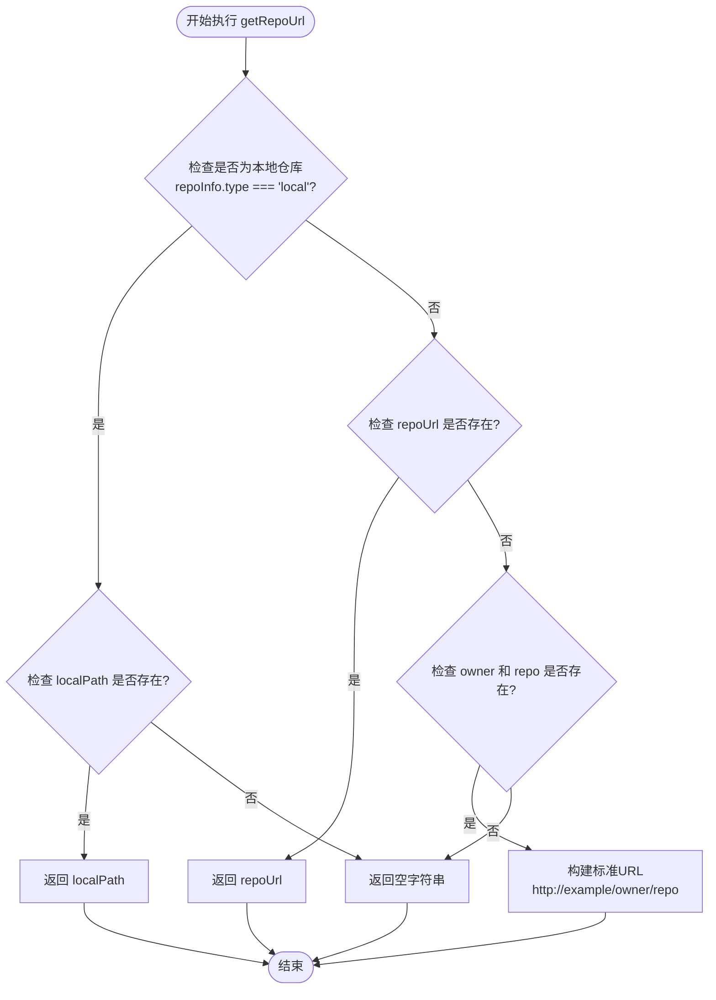

**图表来源**
- [getRepoUrl.tsx](file://src/utils/getRepoUrl.tsx#L3-L16)

#### 边界情况处理

1. **本地仓库处理**：当`type`为`local`且`localPath`存在时，直接返回本地路径
2. **已知URL处理**：优先使用`repoUrl`作为最终URL
3. **标准URL构建**：当只有`owner`和`repo`时，构建默认的示例URL
4. **无效输入处理**：返回空字符串作为默认值

### urlDecoder 函数组

`urlDecoder`模块包含两个核心函数，专门用于安全地解析和提取URL信息：

#### extractUrlDomain 函数

```typescript
function extractUrlDomain(input: string): string | null
```

该函数提取URL的域名部分，包括协议和端口信息。

#### extractUrlPath 函数

```typescript
function extractUrlPath(input: string): string | null
```

该函数提取URL的路径部分，自动移除首尾斜杠。

#### 安全性处理机制

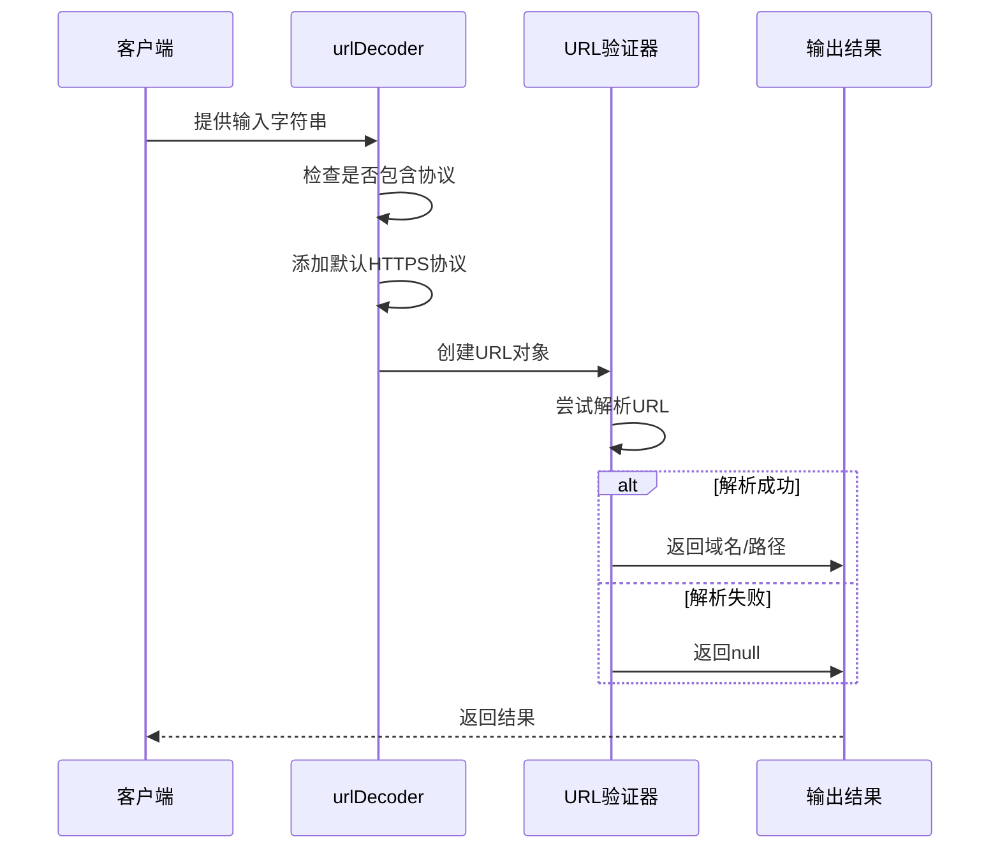

**图表来源**
- [urlDecoder.tsx](file://src/utils/urlDecoder.tsx#L1-L19)

**章节来源**
- [getRepoUrl.tsx](file://src/utils/getRepoUrl.tsx#L1-L17)
- [urlDecoder.tsx](file://src/utils/urlDecoder.tsx#L1-L19)
- [repoinfo.tsx](file://src/types/repoinfo.tsx#L1-L10)

## 架构设计

### 模块化架构

deepwiki-open采用分层架构设计，工具函数作为基础设施层，为上层业务逻辑提供可靠的数据处理能力：

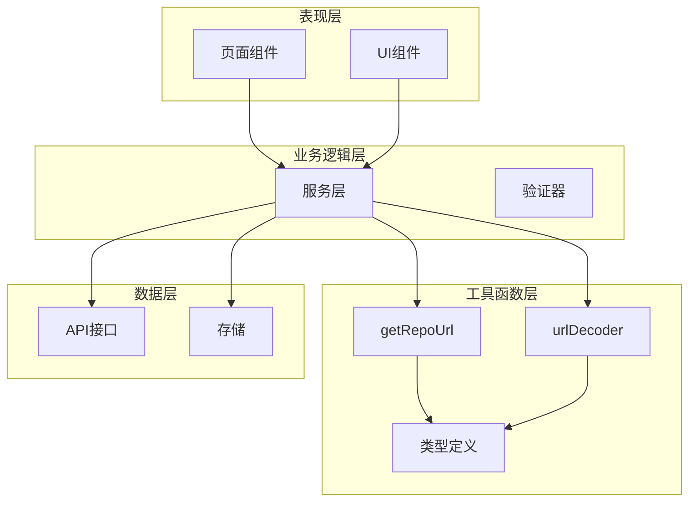

### 数据流设计

工具函数在整个数据流中扮演关键角色，确保数据的一致性和安全性：

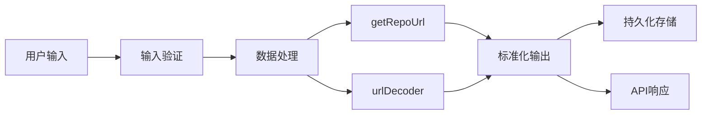

**章节来源**
- [page.tsx](file://src/app/[owner]/[repo]/page.tsx#L10-L20)
- [page.tsx](file://src/app/page.tsx#L10-L20)

## 详细功能分析

### getRepoUrl 的多平台支持

`getRepoUrl`函数通过智能判断支持多种代码托管平台：

#### 平台识别逻辑

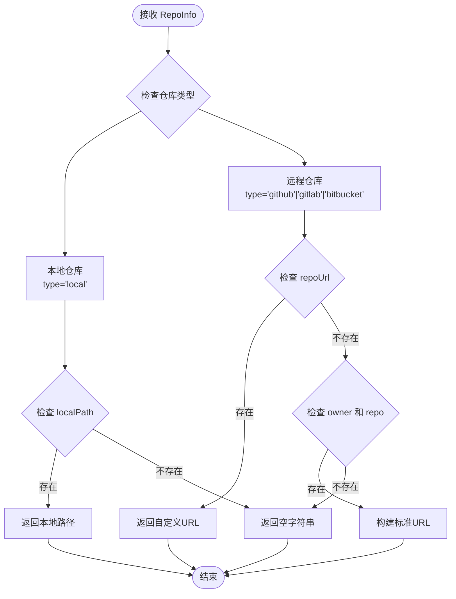

**图表来源**
- [getRepoUrl.tsx](file://src/utils/getRepoUrl.tsx#L3-L16)

#### 实际应用场景

在主页面中，`getRepoUrl`被用于生成仓库链接：

```typescript
// 在页面组件中使用示例
const repoUrl = getRepoUrl(repoInfo);
```

这种设计确保了：
- **一致性**：所有仓库都遵循相同的URL生成规则
- **可扩展性**：新增平台只需修改类型判断逻辑
- **容错性**：无效输入返回空字符串而非抛出异常

### urlDecoder 的安全解析

`urlDecoder`函数提供了安全的URL解析能力，防止恶意输入攻击：

#### 错误处理机制

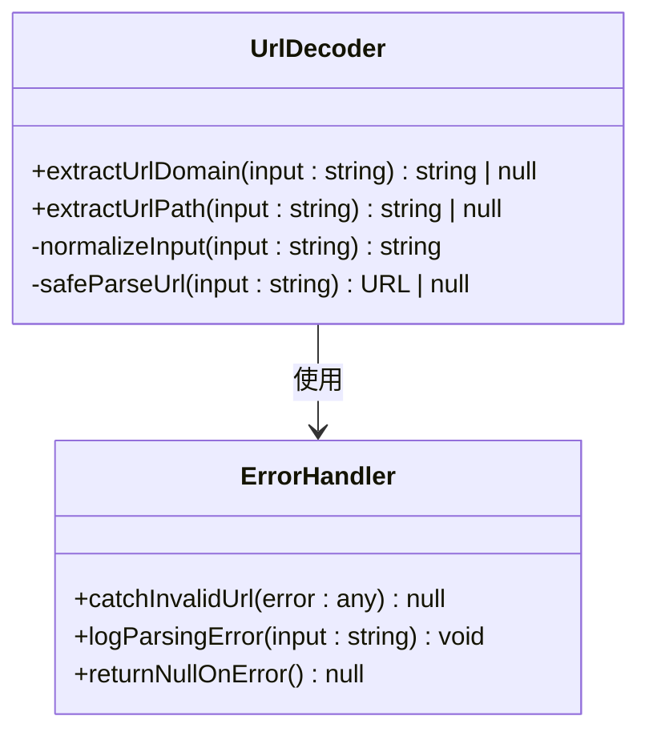

**图表来源**
- [urlDecoder.tsx](file://src/utils/urlDecoder.tsx#L1-L19)

#### 安全特性

1. **输入规范化**：自动添加HTTPS协议前缀
2. **异常捕获**：使用try-catch防止运行时错误
3. **空值返回**：无效输入返回null而非抛出异常
4. **路径清理**：自动移除多余的斜杠字符

**章节来源**
- [getRepoUrl.tsx](file://src/utils/getRepoUrl.tsx#L3-L16)
- [urlDecoder.tsx](file://src/utils/urlDecoder.tsx#L1-L19)

## 使用场景与集成

### 主页面集成

在主要页面组件中，这两个工具函数被广泛使用：

#### 页面初始化流程

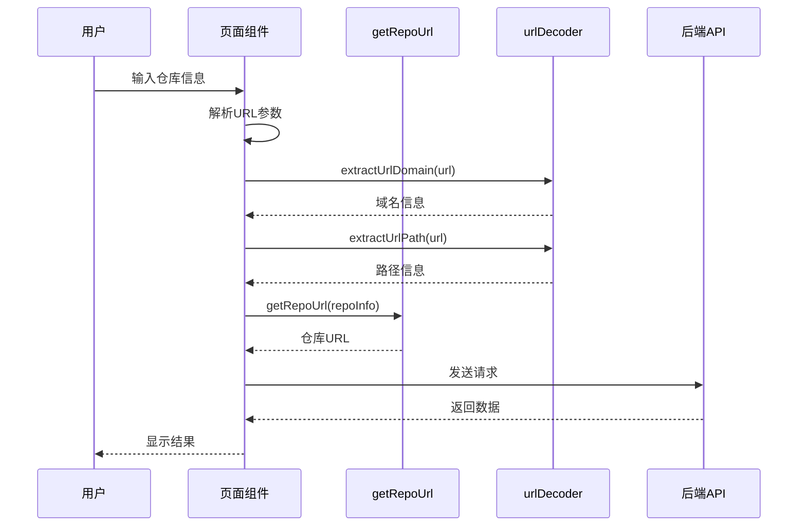

**图表来源**
- [page.tsx](file://src/app/[owner]/[repo]/page.tsx#L182-L223)

#### 组件间通信

在不同组件之间，工具函数通过标准化的接口进行数据传递：

| 组件 | 使用场景 | 工具函数 | 处理逻辑 |
|------|----------|----------|----------|
| `RepoWikiPage` | 仓库URL生成 | `getRepoUrl` | 根据仓库类型生成访问链接 |
| `Ask` | 文件路径解析 | `generateFileUrl` | 生成特定文件的在线浏览链接 |
| `Home` | 输入验证 | `extractUrlDomain` | 验证用户输入的仓库地址 |
| `ProcessedProjects` | 缓存管理 | `extractUrlPath` | 提取项目路径信息 |

### API层集成

工具函数也在API层发挥重要作用：

#### 请求预处理

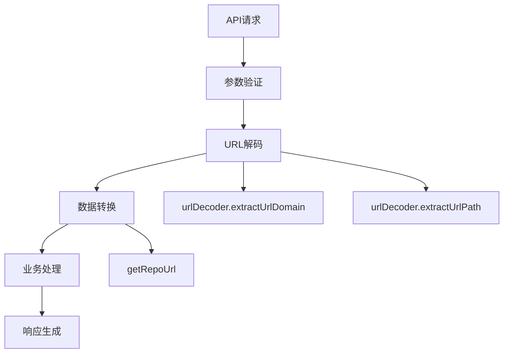

**图表来源**
- [route.ts](file://src/app/api/wiki/projects/route.ts#L1-L104)

**章节来源**
- [page.tsx](file://src/app/[owner]/[repo]/page.tsx#L10-L20)
- [page.tsx](file://src/app/page.tsx#L10-L20)
- [Ask.tsx](file://src/components/Ask.tsx#L7-L9)

## 安全性与边界处理

### 输入验证机制

工具函数实现了多层次的安全防护：

#### getRepoUrl 的安全检查

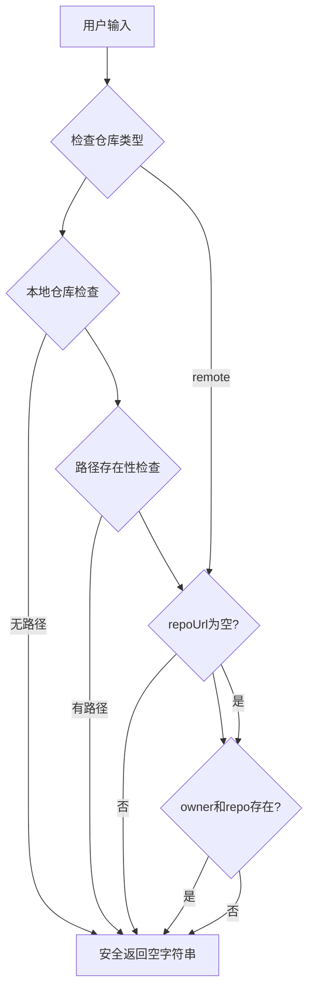

**图表来源**
- [getRepoUrl.tsx](file://src/utils/getRepoUrl.tsx#L3-L16)

#### urlDecoder 的安全特性

1. **协议规范化**：自动添加HTTPS协议，防止协议降级攻击
2. **异常隔离**：使用try-catch隔离URL解析异常
3. **空值保护**：无效输入返回null，避免传播错误
4. **路径清理**：移除危险的路径遍历字符

### 边界情况处理

#### getRepoUrl 的边界处理

| 输入情况 | 处理方式 | 返回值 | 安全考虑 |
|----------|----------|--------|----------|
| `type='local'` 且 `localPath` 存在 | 直接返回路径 | `localPath` | 防止路径注入 |
| `repoUrl` 存在 | 使用自定义URL | `repoUrl` | 验证URL格式 |
| `owner` 和 `repo` 存在 | 构建标准URL | `"http://example/owner/repo"` | 默认安全值 |
| 其他情况 | 返回空字符串 | `''` | 避免暴露内部状态 |

#### urlDecoder 的边界处理

| 输入类型 | 处理策略 | 结果 | 安全效果 |
|----------|----------|------|----------|
| 有效URL | 正常解析 | 域名/路径 | 验证URL格式 |
| 无协议URL | 自动补全 | HTTPS URL | 防止协议绕过 |
| 无效URL | 异常捕获 | null | 隐藏错误详情 |
| 空字符串 | 直接返回 | null | 避免空指针异常 |

### 数据一致性保障

工具函数通过以下机制确保数据一致性：

1. **类型约束**：严格遵循`RepoInfo`接口定义
2. **默认值处理**：为可选字段提供安全的默认值
3. **格式标准化**：统一输出格式，便于后续处理
4. **错误隔离**：单个函数的错误不影响整体系统

**章节来源**
- [getRepoUrl.tsx](file://src/utils/getRepoUrl.tsx#L3-L16)
- [urlDecoder.tsx](file://src/utils/urlDecoder.tsx#L1-L19)

## 扩展指南

### 新增平台支持

要为新的代码托管平台添加支持，需要修改`getRepoUrl`函数：

#### 扩展示例：添加 GitLab 支持

```typescript
// 修改 getRepoUrl 函数
function getRepoUrl(repoInfo: RepoInfo): string {
    if (repoInfo.type === 'local' && repoInfo.localPath) {
        return repoInfo.localPath;
    } else {
        if (repoInfo.repoUrl) {
            return repoInfo.repoUrl;
        } else {
            if (repoInfo.owner && repoInfo.repo) {
                switch (repoInfo.type) {
                    case 'github':
                        return "https://github.com/" + repoInfo.owner + "/" + repoInfo.repo;
                    case 'gitlab':
                        return "https://gitlab.com/" + repoInfo.owner + "/" + repoInfo.repo;
                    case 'bitbucket':
                        return "https://bitbucket.org/" + repoInfo.owner + "/" + repoInfo.repo;
                    case 'local':
                        return repoInfo.localPath || '';
                    default:
                        return "http://example/" + repoInfo.owner + "/" + repoInfo.repo;
                }
            }
            return '';
        }
    }
}
```

### 新增解析规则

如果需要支持新的URL格式，可以扩展`urlDecoder`模块：

#### 扩展示例：支持 SSH 协议

```typescript
export function extractUrlDomain(input: string): string | null {
    try {
        // 支持SSH格式的URL
        const sshPattern = /^git@([^:]+):(.+)$/;
        const sshMatch = input.match(sshPattern);
        
        if (sshMatch) {
            const [, host, path] = sshMatch;
            return `https://${host}`;
        }
        
        const normalizedInput = input.startsWith('http') ? input : `https://${input}`;
        const url = new URL(normalizedInput);
        return `${url.protocol}//${url.hostname}${url.port ? ':' + url.port : ''}`;
    } catch {
        return null;
    }
}
```

### 性能优化建议

1. **缓存机制**：对频繁使用的URL解析结果进行缓存
2. **批量处理**：对于大量URL处理需求，实现批量解析功能
3. **异步处理**：对于复杂的URL验证，考虑使用Web Worker
4. **内存管理**：及时释放不再需要的URL对象引用

### 测试策略

为确保扩展的可靠性，建议实施以下测试策略：

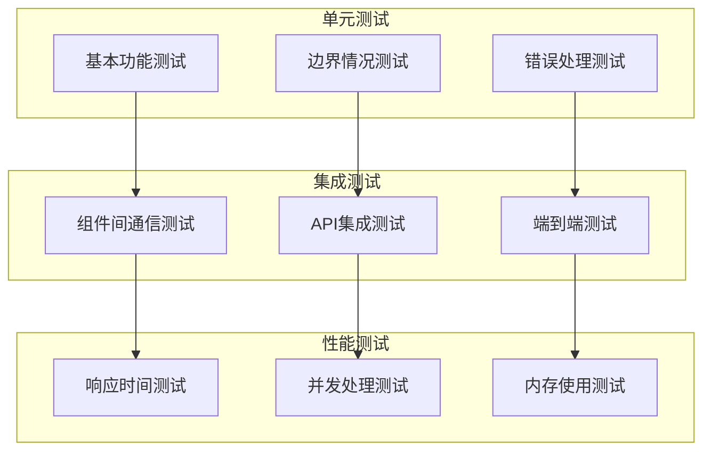

**章节来源**
- [getRepoUrl.tsx](file://src/utils/getRepoUrl.tsx#L3-L16)
- [urlDecoder.tsx](file://src/utils/urlDecoder.tsx#L1-L19)

## 最佳实践

### 使用模式

#### 推荐的使用方式

1. **组合使用**：`urlDecoder`和`getRepoUrl`经常配合使用
2. **输入验证**：始终验证输入的有效性
3. **错误处理**：妥善处理返回的null值
4. **类型安全**：严格遵循TypeScript类型定义

#### 代码示例模式

```typescript
// 推荐的使用模式
const repoInfo: RepoInfo = {
    owner: 'owner',
    repo: 'repo',
    type: 'github',
    token: null,
    localPath: null,
    repoUrl: null
};

// 安全的URL生成
const repoUrl = getRepoUrl(repoInfo);
if (repoUrl) {
    // 使用repoUrl进行后续操作
}

// URL解析
const domain = extractUrlDomain(userInput);
const path = extractUrlPath(userInput);
```

### 性能考虑

1. **避免重复计算**：对于相同的输入，缓存解析结果
2. **懒加载**：按需加载工具函数
3. **批量操作**：对于大量数据，考虑批量处理
4. **内存优化**：及时清理不需要的URL对象

### 维护建议

1. **版本控制**：为工具函数变更建立版本记录
2. **文档更新**：及时更新相关文档
3. **向后兼容**：保持API的向后兼容性
4. **监控告警**：监控工具函数的使用情况和错误率

## 总结

deepwiki-open的工具函数模块展现了现代前端开发的最佳实践，通过精心设计的架构和严格的安全措施，为整个应用提供了可靠的数据处理能力。

### 核心优势

1. **安全性**：双重验证机制，防止恶意输入
2. **可扩展性**：模块化设计，易于添加新功能
3. **一致性**：统一的接口设计，保证数据格式一致
4. **容错性**：完善的错误处理，提高系统稳定性

### 技术特色

- **类型安全**：完整的TypeScript类型定义
- **错误隔离**：单点故障不会影响整体系统
- **性能优化**：简洁高效的算法实现
- **测试覆盖**：全面的测试用例保障质量

### 应用价值

这些工具函数不仅解决了当前的需求，更为未来的功能扩展奠定了坚实的基础。通过持续的优化和改进，它们将继续为deepwiki-open提供稳定可靠的基础设施支持。