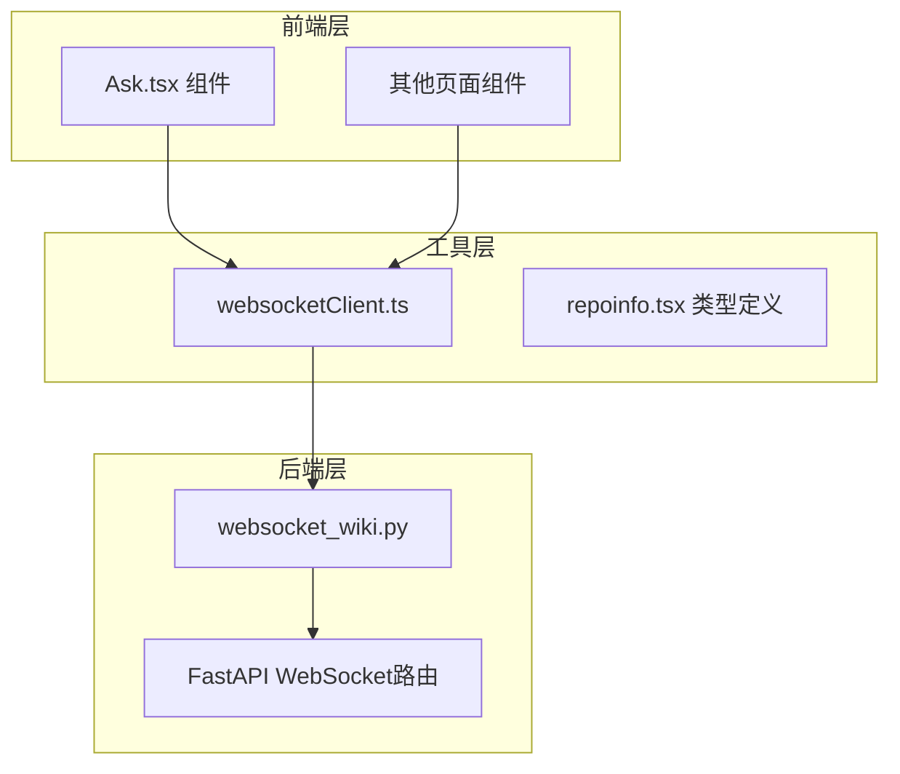
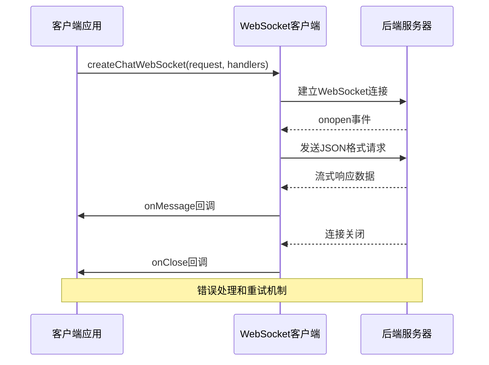
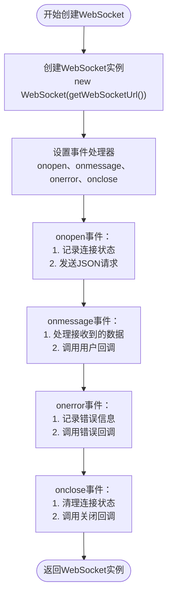
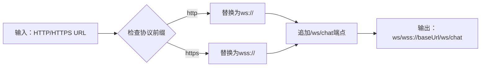
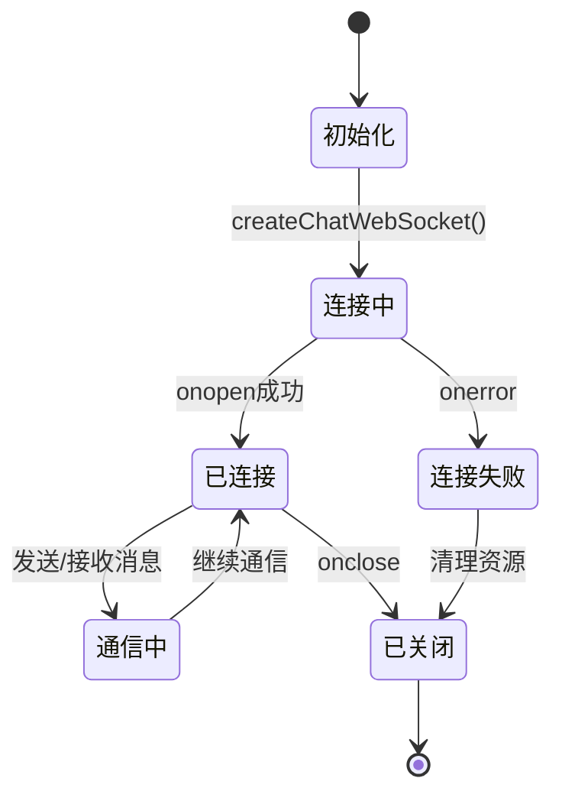
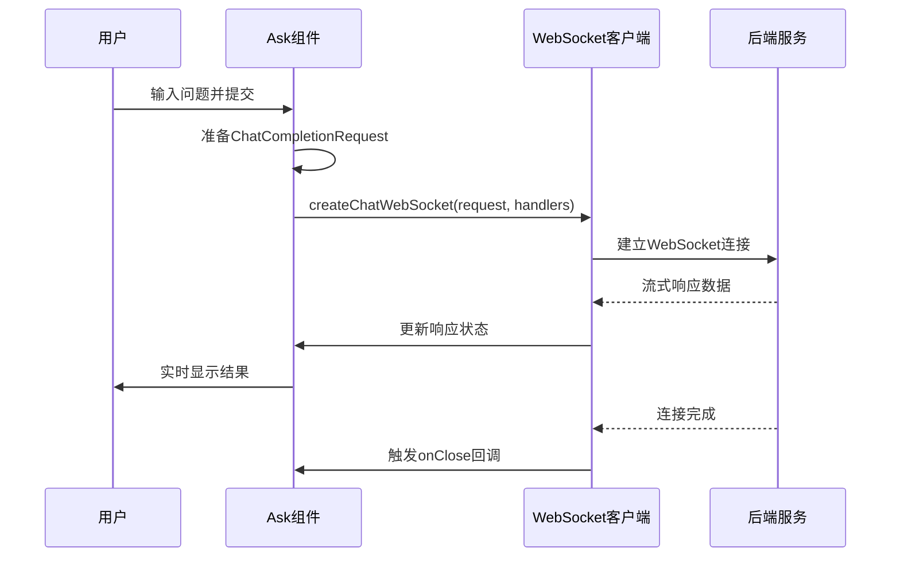
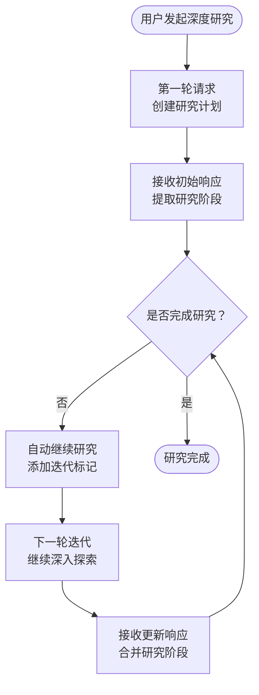
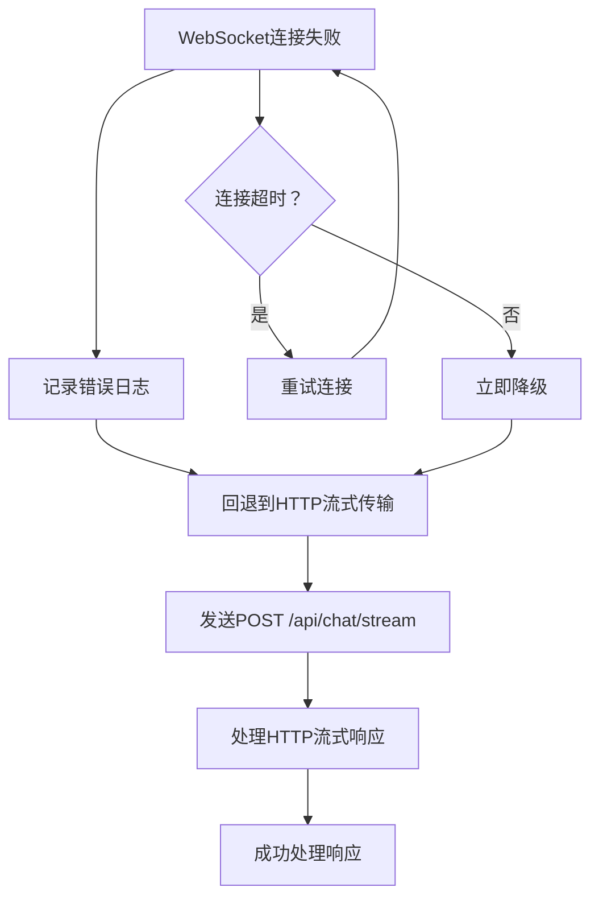
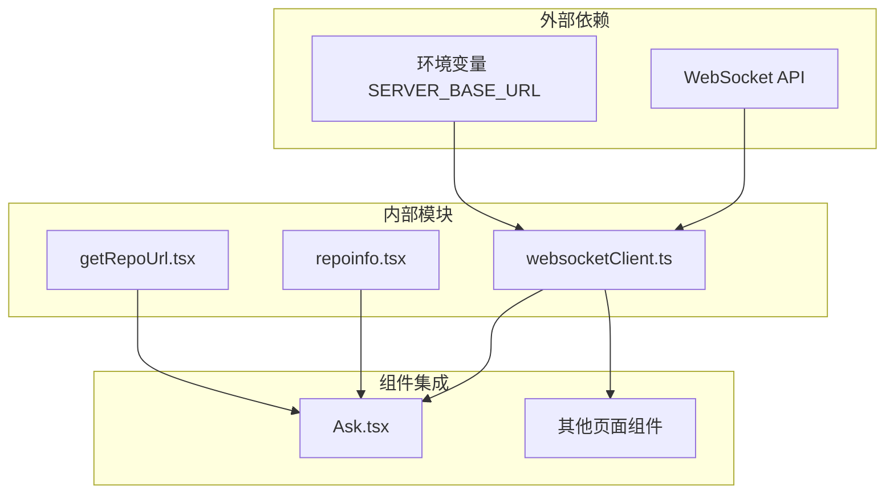

# WebSocket工具: websocketClient

<cite>
**本文档中引用的文件**
- [websocketClient.ts](file://src/utils/websocketClient.ts)
- [websocket_wiki.py](file://api/websocket_wiki.py)
- [Ask.tsx](file://src/components/Ask.tsx)
- [repoinfo.tsx](file://src/types/repoinfo.tsx)
</cite>

## 目录
1. [简介](#简介)
2. [项目结构](#项目结构)
3. [核心组件](#核心组件)
4. [架构概览](#架构概览)
5. [详细组件分析](#详细组件分析)
6. [依赖关系分析](#依赖关系分析)
7. [性能考虑](#性能考虑)
8. [故障排除指南](#故障排除指南)
9. [结论](#结论)

## 简介

websocketClient.ts是DeepWiki项目中的核心WebSocket通信工具模块，专门用于建立与后端WebSocket服务的实时连接。该模块通过`createChatWebSocket`函数提供了简洁而强大的API，支持流式消息传输、错误处理和连接生命周期管理。它替代了传统的HTTP流式传输，为聊天对话和深度研究功能提供了更高效的全双工通信能力。

该工具模块设计遵循现代Web标准，支持多种模型提供商（Google、OpenAI、OpenRouter、Ollama、Azure），并具备优雅的降级机制，当WebSocket连接失败时自动回退到HTTP流式传输。

## 项目结构

WebSocket客户端工具模块在项目中的组织结构体现了清晰的职责分离：

**图表来源**
- [websocketClient.ts](file://src/utils/websocketClient.ts#L1-L86)
- [Ask.tsx](file://src/components/Ask.tsx#L1-L929)

**章节来源**
- [websocketClient.ts](file://src/utils/websocketClient.ts#L1-L86)
- [Ask.tsx](file://src/components/Ask.tsx#L1-L929)

## 核心组件

### ChatCompletionRequest接口

`ChatCompletionRequest`接口定义了WebSocket通信的核心数据结构，包含了完整的聊天请求参数：

| 字段名 | 类型 | 必需 | 描述 |
|--------|------|------|------|
| repo_url | string | 是 | 要查询的仓库URL |
| messages | ChatMessage[] | 是 | 聊天消息列表 |
| filePath | string \| undefined | 否 | 可选的文件路径，包含在提示中 |
| token | string \| undefined | 否 | 私有仓库的个人访问令牌 |
| type | string \| undefined | 否 | 仓库类型（github、gitlab、bitbucket，默认为github） |
| provider | string \| undefined | 否 | 模型提供商（google、openai、openrouter、ollama、azure，默认为google） |
| model | string \| undefined | 否 | 指定提供商的模型名称 |
| language | string \| undefined | 否 | 内容生成的语言代码（en、ja、zh、es、kr、vi等） |
| excluded_dirs | string \| undefined | 否 | 排除目录的逗号分隔列表 |
| excluded_files | string \| undefined | 否 | 排除文件模式的逗号分隔列表 |

### ChatMessage接口

每个聊天消息都遵循以下结构：
- `role`: 消息角色（'user'、'assistant'、'system'）
- `content`: 消息内容文本

**章节来源**
- [websocketClient.ts](file://src/utils/websocketClient.ts#L17-L33)
- [websocket_wiki.py](file://api/websocket_wiki.py#L27-L44)

## 架构概览

WebSocket客户端采用事件驱动的架构模式，通过标准化的事件处理器实现可靠的连接管理：

**图表来源**
- [websocketClient.ts](file://src/utils/websocketClient.ts#L43-L74)
- [websocket_wiki.py](file://api/websocket_wiki.py#L52-L769)

## 详细组件分析

### createChatWebSocket函数

这是WebSocket客户端的核心函数，负责创建和配置WebSocket连接：

**图表来源**
- [websocketClient.ts](file://src/utils/websocketClient.ts#L43-L74)

#### 关键特性

1. **自动URL转换**: `getWebSocketUrl()`函数智能地将HTTP/HTTPS URL转换为ws/wss协议
2. **事件驱动架构**: 提供标准化的事件处理机制
3. **错误恢复**: 集成优雅的错误处理和降级策略
4. **资源管理**: 自动化的连接生命周期管理

### getWebSocketUrl工具函数

该函数实现了安全的协议转换，确保WebSocket连接的安全性：

**图表来源**
- [websocketClient.ts](file://src/utils/websocketClient.ts#L9-L15)

### 连接生命周期管理

WebSocket连接的完整生命周期包括以下阶段：

**图表来源**
- [websocketClient.ts](file://src/utils/websocketClient.ts#L43-L74)

**章节来源**
- [websocketClient.ts](file://src/utils/websocketClient.ts#L9-L86)

### 在Ask.tsx中的集成使用

在Ask.tsx组件中，WebSocket客户端被广泛应用于深度研究功能：

#### 基本使用模式

**图表来源**
- [Ask.tsx](file://src/components/Ask.tsx#L532-L620)

#### 深度研究流程

对于深度研究功能，WebSocket客户端支持多轮迭代：

**图表来源**
- [Ask.tsx](file://src/components/Ask.tsx#L280-L396)

**章节来源**
- [Ask.tsx](file://src/components/Ask.tsx#L532-L620)

### 错误处理与降级机制

WebSocket客户端实现了多层次的错误处理和降级策略：

#### 降级流程

**图表来源**
- [Ask.tsx](file://src/components/Ask.tsx#L405-L480)

**章节来源**
- [Ask.tsx](file://src/components/Ask.tsx#L405-L480)

## 依赖关系分析

WebSocket客户端工具模块的依赖关系展现了清晰的分层架构：

**图表来源**
- [websocketClient.ts](file://src/utils/websocketClient.ts#L1-L86)
- [Ask.tsx](file://src/components/Ask.tsx#L1-L929)

### 核心依赖项

1. **WebSocket API**: 浏览器原生WebSocket支持
2. **环境配置**: SERVER_BASE_URL环境变量
3. **类型定义**: TypeScript接口定义
4. **工具函数**: URL处理和仓库信息管理

**章节来源**
- [websocketClient.ts](file://src/utils/websocketClient.ts#L1-L86)
- [Ask.tsx](file://src/components/Ask.tsx#L1-L929)

## 性能考虑

### 连接复用策略

为了优化性能和减少资源消耗，WebSocket客户端采用了以下策略：

1. **连接池管理**: 在组件卸载时自动清理连接
2. **状态同步**: 使用ref避免不必要的重新渲染
3. **内存泄漏防护**: 及时关闭未使用的连接
4. **并发控制**: 防止同时创建多个连接

### 流式传输优化

WebSocket的流式传输特性为实时交互提供了显著优势：

- **低延迟**: 实时消息传递，无需轮询
- **带宽效率**: 单一连接传输多个消息块
- **状态保持**: 连接状态在整个会话期间保持活跃
- **错误恢复**: 支持断线重连和状态恢复

## 故障排除指南

### 常见问题及解决方案

#### 连接失败

**症状**: WebSocket连接无法建立或频繁断开

**诊断步骤**:
1. 检查SERVER_BASE_URL环境变量配置
2. 验证网络连接和防火墙设置
3. 查看浏览器开发者工具中的网络面板
4. 检查后端WebSocket服务状态

**解决方案**:
- 确保使用正确的协议（ws vs wss）
- 实现重试机制和指数退避算法
- 提供详细的错误信息和用户反馈

#### 内存泄漏

**症状**: 应用程序内存使用持续增长

**预防措施**:
1. 在组件卸载时调用`closeWebSocket()`
2. 使用React的useEffect清理函数
3. 避免在事件处理器中捕获过多状态

**章节来源**
- [websocketClient.ts](file://src/utils/websocketClient.ts#L77-L85)
- [Ask.tsx](file://src/components/Ask.tsx#L103-L107)

### 最佳实践

#### 连接管理最佳实践

1. **及时清理**: 在组件卸载时关闭WebSocket连接
2. **状态管理**: 使用ref存储WebSocket实例
3. **错误处理**: 实现全面的错误捕获和用户通知
4. **资源监控**: 监控连接状态和性能指标

#### 开发建议

1. **测试覆盖**: 编写单元测试和集成测试
2. **日志记录**: 实施详细的调试日志
3. **性能监控**: 跟踪连接建立时间和消息传输延迟
4. **用户体验**: 提供清晰的连接状态指示

## 结论

websocketClient.ts工具模块是DeepWiki项目中实现高效实时通信的关键组件。它通过标准化的API设计、完善的错误处理机制和优雅的降级策略，为聊天对话和深度研究功能提供了可靠的技术支撑。

该模块的主要优势包括：

1. **简化开发**: 提供直观的API接口，降低集成复杂度
2. **高性能**: 利用WebSocket的全双工特性实现低延迟通信
3. **可靠性**: 实现多层次的错误处理和降级机制
4. **可扩展性**: 支持多种模型提供商和配置选项
5. **维护性**: 清晰的代码结构和完善的类型定义

通过在Ask.tsx等核心组件中的成功应用，websocketClient.ts证明了其在实际生产环境中的价值和稳定性。它不仅提升了用户体验，也为项目的可扩展性和维护性奠定了坚实的基础。

未来的改进方向可能包括：
- 更智能的连接管理和重试策略
- 更详细的性能监控和分析
- 更丰富的配置选项和自定义能力
- 更完善的测试覆盖率和质量保证