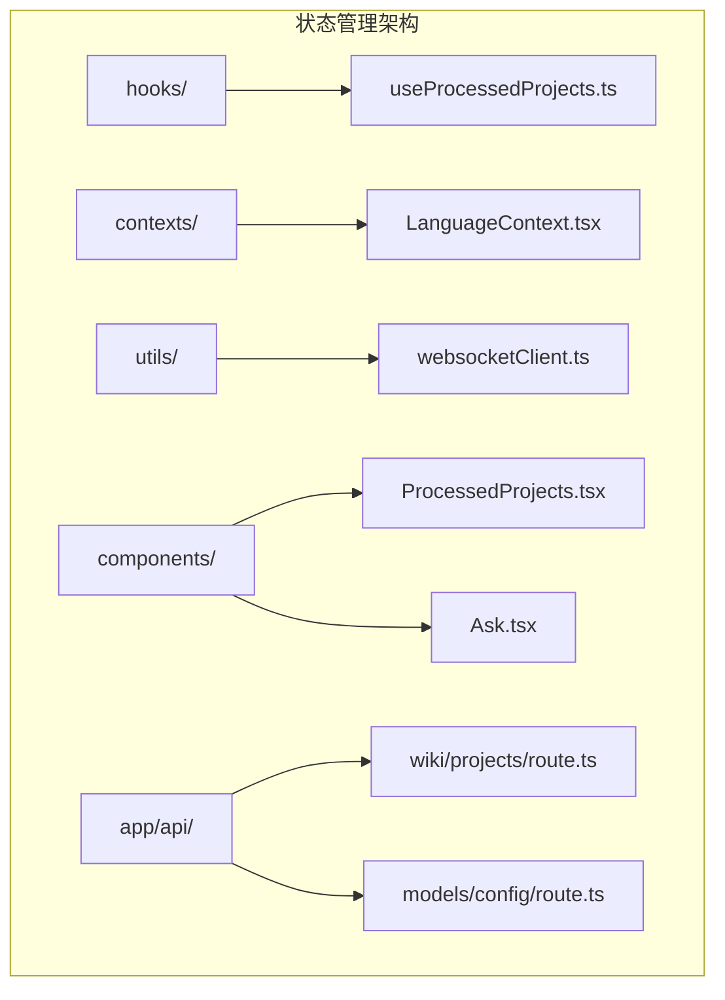
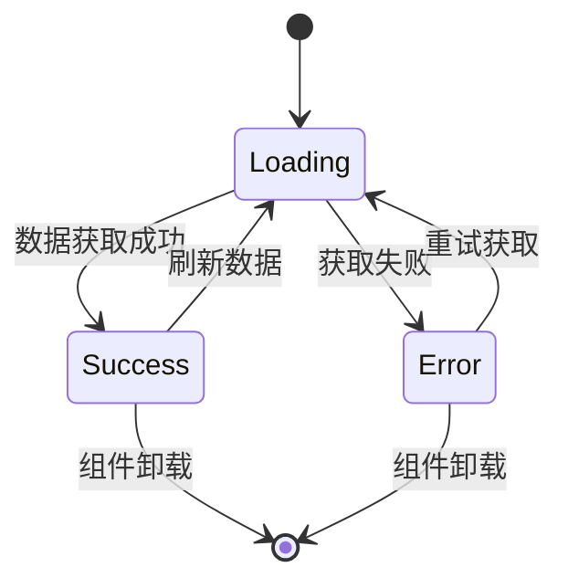
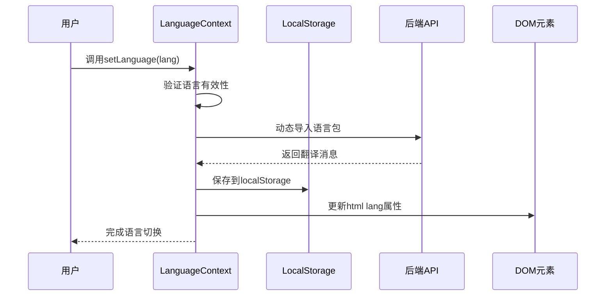
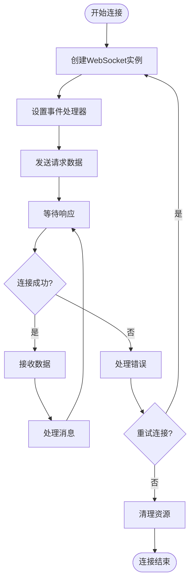
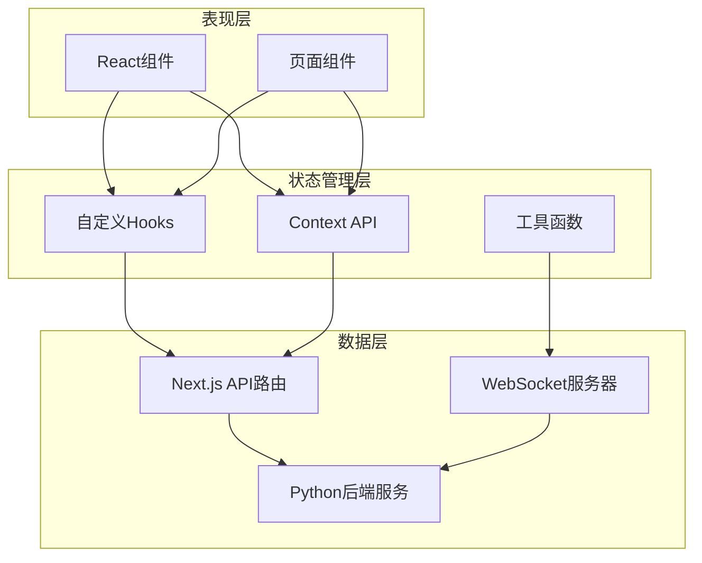
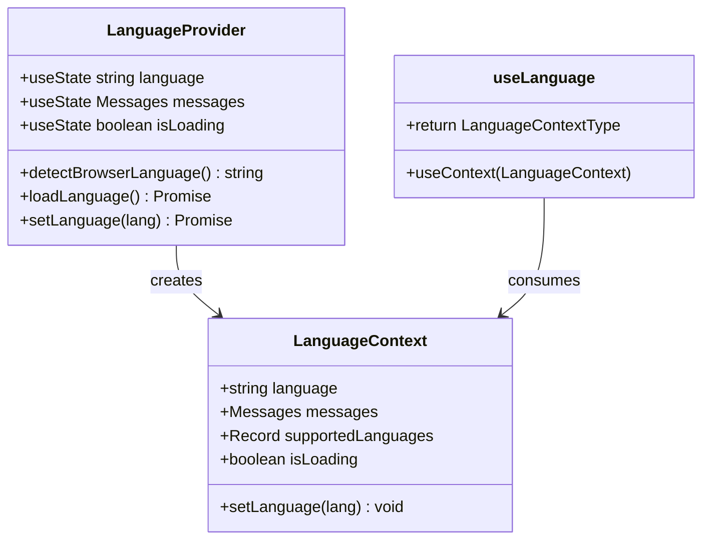
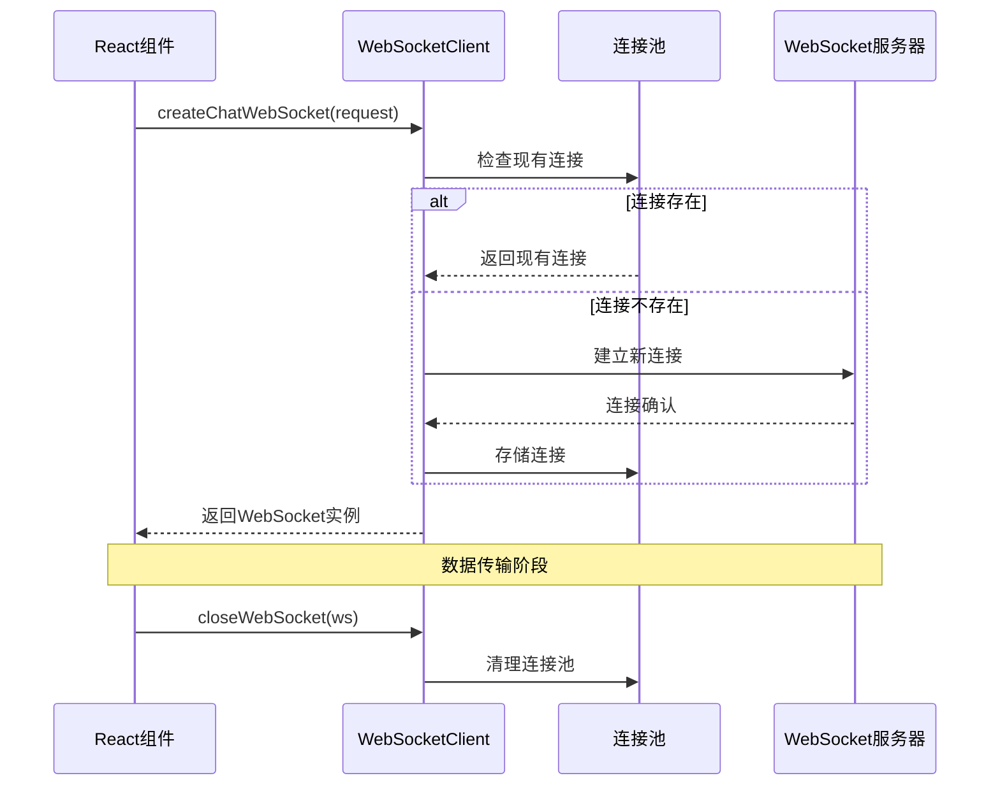
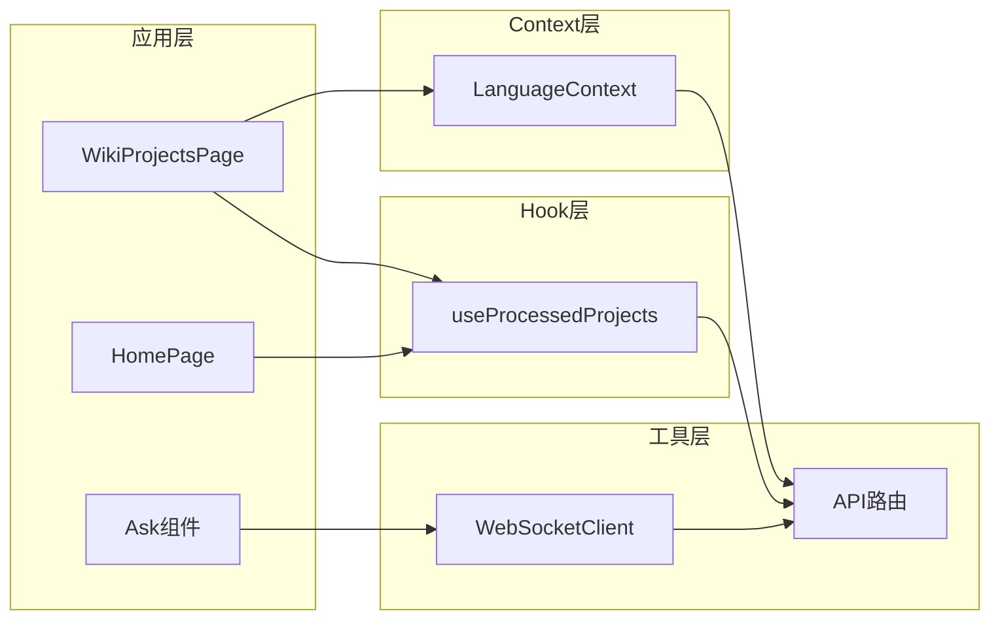

# 状态与上下文管理

<cite>
**本文档中引用的文件**
- [useProcessedProjects.ts](file://src/hooks/useProcessedProjects.ts)
- [LanguageContext.tsx](file://src/contexts/LanguageContext.tsx)
- [websocketClient.ts](file://src/utils/websocketClient.ts)
- [i18n.ts](file://src/i18n.ts)
- [ProcessedProjects.tsx](file://src/components/ProcessedProjects.tsx)
- [Ask.tsx](file://src/components/Ask.tsx)
- [layout.tsx](file://src/app/layout.tsx)
- [page.tsx](file://src/app/wiki/projects/page.tsx)
- [route.ts](file://src/app/api/wiki/projects/route.ts)
- [route.ts](file://src/app/api/models/config/route.ts)
</cite>

## 目录
1. [简介](#简介)
2. [项目结构概览](#项目结构概览)
3. [核心状态管理组件](#核心状态管理组件)
4. [架构概览](#架构概览)
5. [详细组件分析](#详细组件分析)
6. [依赖关系分析](#依赖关系分析)
7. [性能考虑](#性能考虑)
8. [最佳实践指南](#最佳实践指南)
9. [故障排除指南](#故障排除指南)
10. [总结](#总结)

## 简介

deepwiki-open是一个基于Next.js的现代化Web应用程序，采用React Hooks和Context API实现复杂的状态管理机制。该项目展示了如何通过自定义Hook封装数据获取逻辑、使用Context管理全局状态、以及通过WebSocket实现实时通信。本文档深入分析了三个核心状态管理组件：`useProcessedProjects` Hook用于管理已处理项目的状态，`LanguageContext`提供国际化支持，以及`websocketClient`工具实现WebSocket连接复用。

## 项目结构概览

项目采用模块化架构，将状态管理相关的代码组织在以下目录中：



**图表来源**
- [useProcessedProjects.ts](file://src/hooks/useProcessedProjects.ts#L1-L47)
- [LanguageContext.tsx](file://src/contexts/LanguageContext.tsx#L1-L203)
- [websocketClient.ts](file://src/utils/websocketClient.ts#L1-L86)

## 核心状态管理组件

### useProcessedProjects Hook

`useProcessedProjects`是一个专门设计的自定义Hook，负责管理已处理项目的完整生命周期状态。

#### 主要功能特性

- **数据获取**：自动从后端API获取项目列表
- **状态管理**：维护加载状态、错误状态和项目数据
- **错误处理**：完善的异常捕获和错误反馈机制
- **类型安全**：完整的TypeScript类型定义

#### 状态结构



**节来源**
- [useProcessedProjects.ts](file://src/hooks/useProcessedProjects.ts#L13-L46)

### LanguageContext 上下文

`LanguageContext`提供全面的国际化支持，包括语言检测、动态加载和状态同步。

#### 核心能力

- **浏览器语言检测**：自动识别用户首选语言
- **本地存储持久化**：保存用户语言偏好
- **动态消息加载**：按需加载翻译资源
- **HTML属性同步**：更新文档语言属性

#### 语言切换流程



**图表来源**
- [LanguageContext.tsx](file://src/contexts/LanguageContext.tsx#L152-L176)

**节来源**
- [LanguageContext.tsx](file://src/contexts/LanguageContext.tsx#L17-L203)

### websocketClient 工具

`websocketClient`提供可复用的WebSocket连接管理，支持实时通信和错误恢复。

#### 连接管理特性

- **连接池管理**：单例模式确保连接复用
- **事件驱动**：完整的事件回调系统
- **错误重连**：自动化的连接恢复机制
- **资源清理**：优雅的连接关闭处理

#### WebSocket生命周期



**图表来源**
- [websocketClient.ts](file://src/utils/websocketClient.ts#L43-L74)

**节来源**
- [websocketClient.ts](file://src/utils/websocketClient.ts#L1-L86)

## 架构概览

整个状态管理系统采用分层架构设计，各组件职责明确且相互协作：



**图表来源**
- [layout.tsx](file://src/app/layout.tsx#L33-L46)
- [ProcessedProjects.tsx](file://src/components/ProcessedProjects.tsx#L1-L271)

## 详细组件分析

### useProcessedProjects Hook 深度分析

#### 数据流架构

```mermaid
classDiagram
class useProcessedProjects {
+useState~ProcessedProject[]~ projects
+useState boolean isLoading
+useState string error
+useEffect fetchProjects()
+return {projects, isLoading, error}
}
class ProcessedProject {
+string id
+string owner
+string repo
+string name
+string repo_type
+number submittedAt
+string language
}
class APIResponse {
+ProcessedProject[] data
+string error
}
useProcessedProjects --> ProcessedProject : manages
useProcessedProjects --> APIResponse : receives
```

**图表来源**
- [useProcessedProjects.ts](file://src/hooks/useProcessedProjects.ts#L3-L11)
- [useProcessedProjects.ts](file://src/hooks/useProcessedProjects.ts#L13-L46)

#### 错误处理机制

Hook实现了多层次的错误处理策略：

1. **网络错误捕获**：处理fetch请求失败
2. **API错误解析**：解析后端返回的错误信息
3. **类型安全验证**：确保数据结构正确性
4. **用户友好提示**：提供清晰的错误反馈

**节来源**
- [useProcessedProjects.ts](file://src/hooks/useProcessedProjects.ts#L18-L46)

### LanguageContext 设计模式

#### 状态管理模式



**图表来源**
- [LanguageContext.tsx](file://src/contexts/LanguageContext.tsx#L7-L13)
- [LanguageContext.tsx](file://src/contexts/LanguageContext.tsx#L17-L202)

#### 多语言资源管理

Context实现了智能的语言资源管理策略：

- **按需加载**：仅加载当前语言的翻译资源
- **缓存机制**：避免重复加载相同语言包
- **降级处理**：语言包加载失败时回退到默认语言
- **版本控制**：支持翻译资源的版本管理

**节来源**
- [LanguageContext.tsx](file://src/contexts/LanguageContext.tsx#L101-L176)

### WebSocket 连接管理

#### 连接复用策略



**图表来源**
- [websocketClient.ts](file://src/utils/websocketClient.ts#L43-L74)
- [Ask.tsx](file://src/components/Ask.tsx#L103-L107)

#### 实时通信优化

WebSocket客户端实现了多项性能优化：

- **连接池管理**：避免重复建立连接
- **心跳检测**：维持长连接活跃状态
- **消息队列**：批量处理发送的消息
- **错误恢复**：自动重连和状态同步

**节来源**
- [websocketClient.ts](file://src/utils/websocketClient.ts#L35-L86)

## 依赖关系分析

### 组件依赖图



**图表来源**
- [page.tsx](file://src/app/wiki/projects/page.tsx#L1-L19)
- [ProcessedProjects.tsx](file://src/components/ProcessedProjects.tsx#L1-L271)

### 数据流向分析

系统的数据流向遵循单向数据流原则：

1. **API层**：从Python后端获取原始数据
2. **路由层**：Next.js API路由处理和转发
3. **Hook层**：自定义Hook封装业务逻辑
4. **Context层**：全局状态管理和共享
5. **组件层**：UI渲染和用户交互

**节来源**
- [route.ts](file://src/app/api/wiki/projects/route.ts#L1-L104)
- [route.ts](file://src/app/api/models/config/route.ts#L1-L49)

## 性能考虑

### 内存管理优化

系统采用了多种内存管理策略：

- **及时清理**：组件卸载时自动清理WebSocket连接
- **弱引用**：避免循环引用导致的内存泄漏
- **懒加载**：按需加载语言包和组件
- **缓存策略**：合理缓存计算结果和网络请求

### 渲染性能优化

- **React.memo**：包装纯组件防止不必要的重渲染
- **useMemo/useCallback**：缓存计算结果和函数引用
- **分批更新**：合并多个状态更新操作
- **虚拟滚动**：处理大量项目列表的渲染性能

### 网络性能优化

- **连接复用**：WebSocket连接池减少握手开销
- **请求去重**：避免重复的API调用
- **缓存策略**：智能缓存API响应数据
- **错误边界**：隔离网络错误影响范围

## 最佳实践指南

### Hook 使用最佳实践

#### useProcessedProjects 的正确使用方式

```typescript
// 推荐用法
function MyComponent() {
  const { projects, isLoading, error } = useProcessedProjects();
  
  if (isLoading) return <LoadingSpinner />;
  if (error) return <ErrorMessage error={error} />;
  
  return (
    <ProjectList 
      projects={projects} 
      onDelete={handleDelete}
    />
  );
}
```

#### 避免常见陷阱

1. **不要在条件语句中调用Hook**
2. **保持Hook的稳定性**：避免在每次渲染时创建新的Hook实例
3. **合理使用依赖数组**：确保useEffect的依赖项正确配置
4. **错误边界处理**：为可能失败的操作添加错误处理

### Context 使用最佳实践

#### LanguageContext 的正确使用

```typescript
// 在组件中使用语言上下文
function MyTranslatedComponent() {
  const { language, setLanguage, messages } = useLanguage();
  
  return (
    <div>
      <select 
        value={language}
        onChange={(e) => setLanguage(e.target.value)}
      >
        {Object.entries(messages.supportedLanguages).map(([code, name]) => (
          <option key={code} value={code}>{name}</option>
        ))}
      </select>
      
      <h1>{messages.common.title}</h1>
    </div>
  );
}
```

#### 性能优化技巧

1. **分离关注点**：将语言状态和业务状态分离
2. **避免过度订阅**：只订阅需要的状态变化
3. **使用Provider包装**：确保Context在正确的层级提供
4. **类型安全**：使用TypeScript确保类型正确性

### WebSocket 连接管理最佳实践

#### 正确的连接生命周期管理

```typescript
// 组件中的WebSocket使用模式
function ChatComponent() {
  const webSocketRef = useRef<WebSocket | null>(null);
  
  useEffect(() => {
    // 创建WebSocket连接
    const ws = createChatWebSocket(
      request,
      handleMessage,
      handleError,
      handleClose
    );
    
    webSocketRef.current = ws;
    
    // 清理函数
    return () => {
      closeWebSocket(webSocketRef.current);
      webSocketRef.current = null;
    };
  }, [request]);
}
```

#### 错误处理和重连策略

1. **指数退避算法**：实现渐进式重连延迟
2. **最大重试次数**：避免无限重试
3. **状态同步**：重连后重新同步丢失的状态
4. **用户通知**：适当时机通知用户连接状态

## 故障排除指南

### 常见问题诊断

#### useProcessedProjects 问题

| 问题症状 | 可能原因 | 解决方案 |
|---------|---------|---------|
| 加载状态持续显示 | API请求超时或网络问题 | 检查网络连接，查看浏览器开发者工具 |
| 数据为空但无错误 | 后端服务未返回数据 | 验证Python后端服务状态 |
| 类型错误 | API响应结构不匹配 | 检查接口文档和类型定义 |

#### LanguageContext 问题

| 问题症状 | 可能原因 | 解决方案 |
|---------|---------|---------|
| 语言切换无效 | 语言包加载失败 | 检查语言文件是否存在 |
| 浏览器语言检测错误 | 浏览器环境变量问题 | 手动设置语言或检查浏览器设置 |
| 本地存储失效 | 浏览器隐私设置 | 检查浏览器存储权限 |

#### WebSocket 连接问题

| 问题症状 | 可能原因 | 解决方案 |
|---------|---------|---------|
| 连接频繁断开 | 网络不稳定 | 实现自动重连机制 |
| 消息丢失 | 连接状态不同步 | 添加消息确认机制 |
| 性能问题 | 连接过多 | 实现连接池管理 |

### 调试技巧

#### 开发者工具使用

1. **React DevTools**：检查组件状态和Props
2. **Network面板**：监控API请求和响应
3. **Console日志**：启用详细的调试日志
4. **Performance面板**：分析性能瓶颈

#### 日志记录策略

```typescript
// 增强的日志记录
const logWithTimestamp = (message: string, data?: any) => {
  const timestamp = new Date().toISOString();
  console.log(`[${timestamp}] ${message}`, data);
};

// 在关键位置添加日志
useEffect(() => {
  logWithTimestamp('useProcessedProjects mounted', { 
    projects: projects.length,
    isLoading,
    error
  });
}, [projects, isLoading, error]);
```

**节来源**
- [useProcessedProjects.ts](file://src/hooks/useProcessedProjects.ts#L32-L36)
- [LanguageContext.tsx](file://src/contexts/LanguageContext.tsx#L32-L66)

## 总结

deepwiki-open的状态管理机制展现了现代React应用的最佳实践。通过精心设计的自定义Hook、Context API和WebSocket工具，系统实现了：

- **模块化架构**：清晰的职责分离和组件解耦
- **类型安全**：完整的TypeScript类型定义和验证
- **性能优化**：智能的缓存策略和渲染优化
- **用户体验**：流畅的状态转换和错误处理
- **可维护性**：良好的代码组织和文档注释

这套状态管理方案不仅满足了当前的功能需求，还为未来的扩展和维护奠定了坚实的基础。开发者可以参考这些模式和实践，在自己的项目中实现类似的功能和架构。