# 自定义Hook: useProcessedProjects

<cite>
**本文档中引用的文件**
- [useProcessedProjects.ts](file://src/hooks/useProcessedProjects.ts)
- [ProcessedProjects.tsx](file://src/components/ProcessedProjects.tsx)
- [websocketClient.ts](file://src/utils/websocketClient.ts)
- [route.ts](file://src/app/api/wiki/projects/route.ts)
- [page.tsx](file://src/app/page.tsx)
- [page.tsx](file://src/app/wiki/projects/page.tsx)
</cite>

## 目录
1. [简介](#简介)
2. [项目结构](#项目结构)
3. [核心组件](#核心组件)
4. [架构概览](#架构概览)
5. [详细组件分析](#详细组件分析)
6. [依赖关系分析](#依赖关系分析)
7. [性能考虑](#性能考虑)
8. [故障排除指南](#故障排除指南)
9. [结论](#结论)

## 简介

`useProcessedProjects` 是一个专门设计的React自定义Hook，用于从后端API获取和管理用户已处理的项目列表。该Hook实现了完整的数据获取生命周期，包括状态管理、错误处理和加载状态控制，为前端组件提供了统一的数据访问接口。

该Hook的核心功能包括：
- 通过HTTP API从后端获取项目数据
- 使用React状态管理实现数据的本地存储
- 提供加载状态和错误状态的完整反馈
- 支持类型安全的数据结构定义
- 避免重复请求的优化机制

## 项目结构

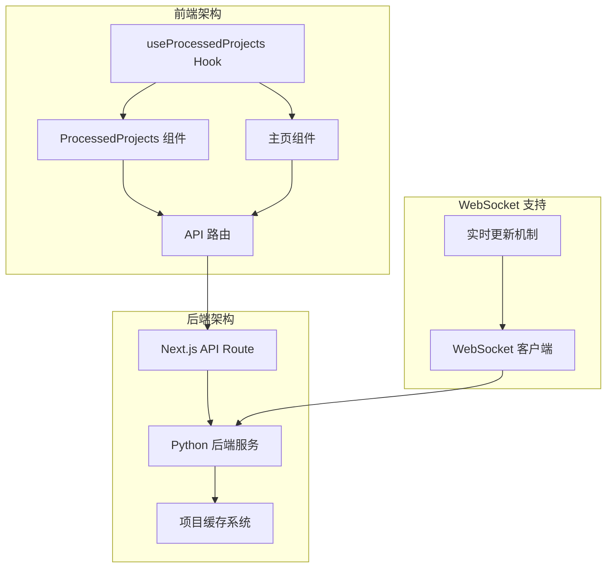

**图表来源**
- [useProcessedProjects.ts](file://src/hooks/useProcessedProjects.ts#L1-L47)
- [ProcessedProjects.tsx](file://src/components/ProcessedProjects.tsx#L1-L271)
- [route.ts](file://src/app/api/wiki/projects/route.ts#L1-L104)

**章节来源**
- [useProcessedProjects.ts](file://src/hooks/useProcessedProjects.ts#L1-L47)
- [ProcessedProjects.tsx](file://src/components/ProcessedProjects.tsx#L1-L271)

## 核心组件

### 数据结构定义

Hook使用严格的类型定义确保数据的一致性和安全性：

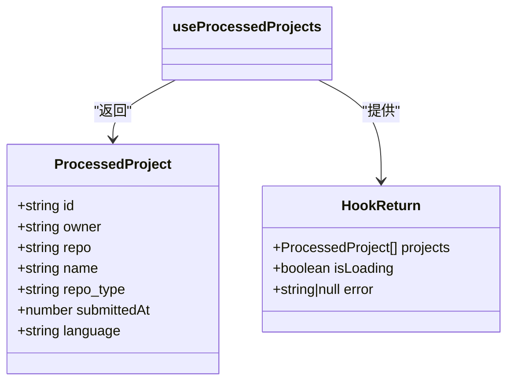

**图表来源**
- [useProcessedProjects.ts](file://src/hooks/useProcessedProjects.ts#L3-L11)

### 状态管理架构

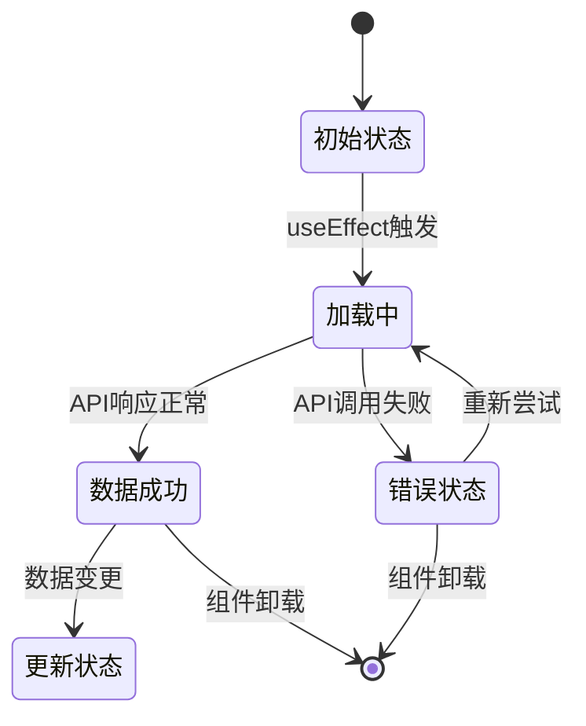

**图表来源**
- [useProcessedProjects.ts](file://src/hooks/useProcessedProjects.ts#L14-L46)

**章节来源**
- [useProcessedProjects.ts](file://src/hooks/useProcessedProjects.ts#L1-L47)

## 架构概览

### 整体数据流

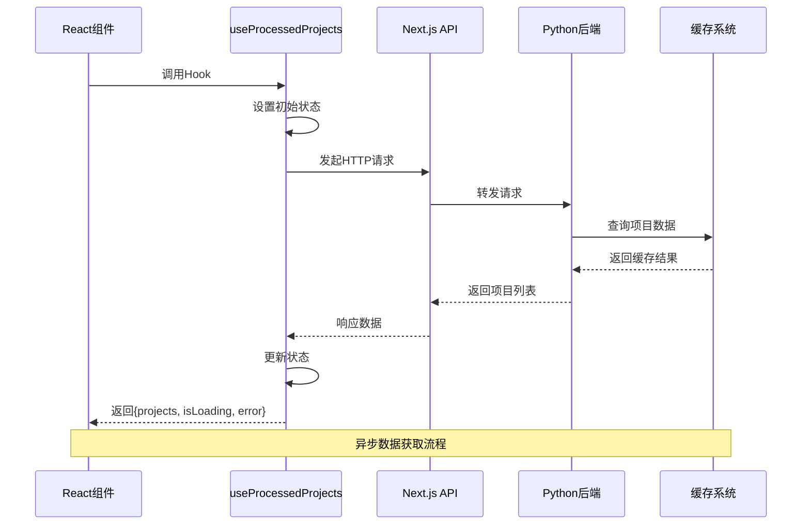

**图表来源**
- [useProcessedProjects.ts](file://src/hooks/useProcessedProjects.ts#L18-L46)
- [route.ts](file://src/app/api/wiki/projects/route.ts#L38-L63)

### 组件集成模式

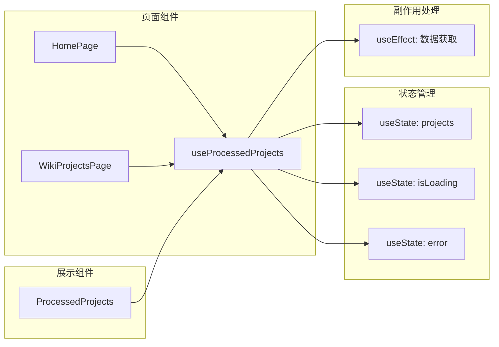

**图表来源**
- [page.tsx](file://src/app/page.tsx#L11-L49)
- [page.tsx](file://src/app/wiki/projects/page.tsx#L7-L18)

**章节来源**
- [page.tsx](file://src/app/page.tsx#L1-L625)
- [page.tsx](file://src/app/wiki/projects/page.tsx#L1-L19)

## 详细组件分析

### useProcessedProjects Hook 实现

#### 核心Hook逻辑

Hook采用函数式编程范式，利用React内置的状态管理机制：

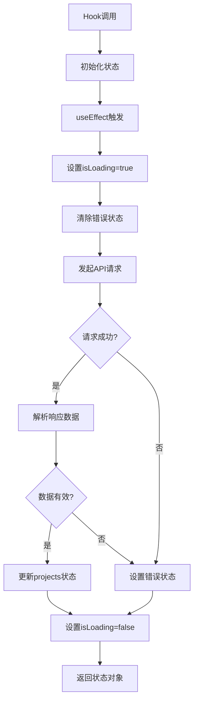

**图表来源**
- [useProcessedProjects.ts](file://src/hooks/useProcessedProjects.ts#L18-L46)

#### 状态管理机制

Hook内部使用三个独立的状态变量协同工作：

| 状态变量 | 类型 | 用途 | 默认值 |
|---------|------|------|--------|
| `projects` | `ProcessedProject[]` | 存储项目列表数据 | `[]` |
| `isLoading` | `boolean` | 表示数据加载状态 | `true` |
| `error` | `string \| null` | 存储错误信息 | `null` |

#### 错误处理策略

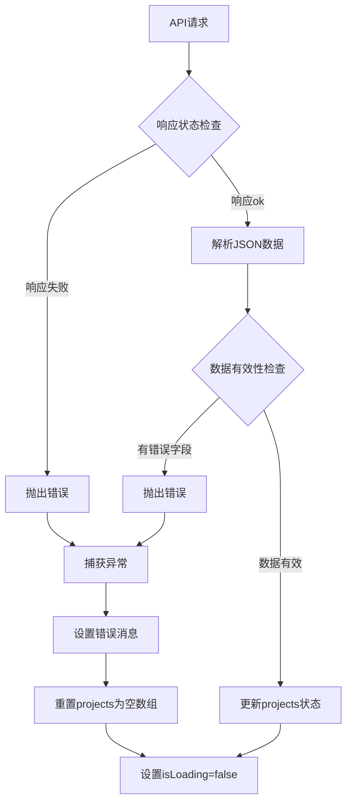

**图表来源**
- [useProcessedProjects.ts](file://src/hooks/useProcessedProjects.ts#L22-L46)

**章节来源**
- [useProcessedProjects.ts](file://src/hooks/useProcessedProjects.ts#L1-L47)

### ProcessedProjects 组件实现

#### 组件状态架构

组件内部实现了更复杂的状态管理，包含本地搜索和视图切换功能：

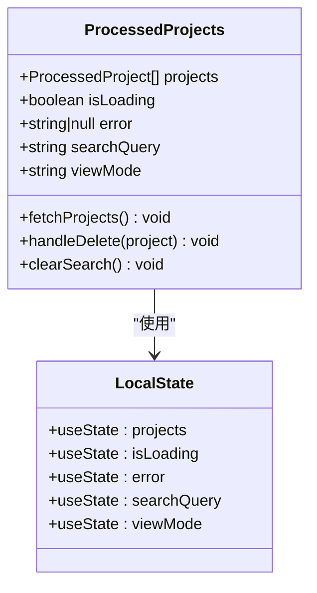

**图表来源**
- [ProcessedProjects.tsx](file://src/components/ProcessedProjects.tsx#L31-L36)

#### 搜索和过滤机制

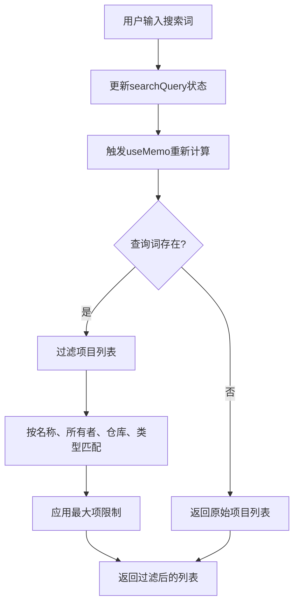

**图表来源**
- [ProcessedProjects.tsx](file://src/components/ProcessedProjects.tsx#L84-L98)

#### 删除操作流程

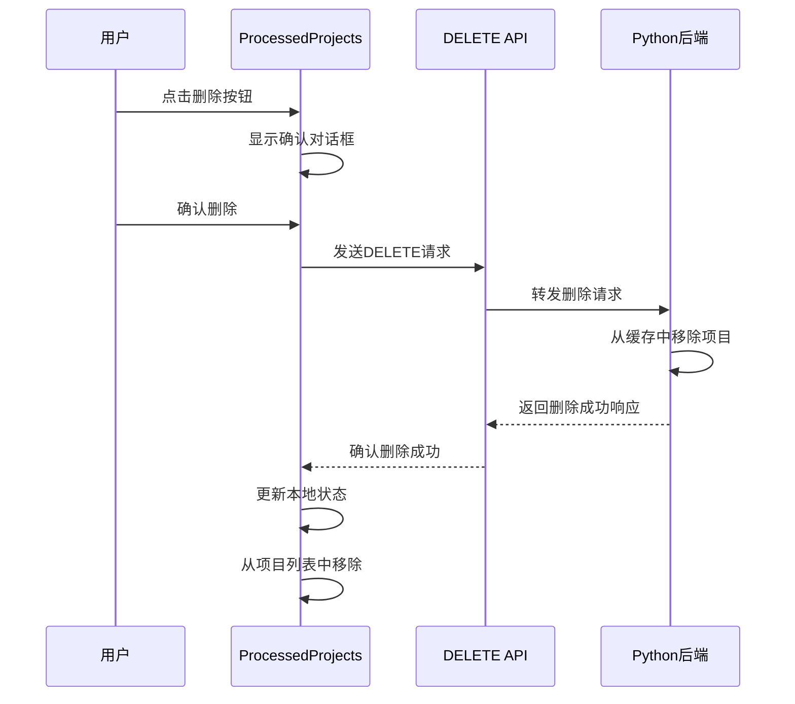

**图表来源**
- [ProcessedProjects.tsx](file://src/components/ProcessedProjects.tsx#L104-L128)

**章节来源**
- [ProcessedProjects.tsx](file://src/components/ProcessedProjects.tsx#L1-L271)

### API路由层实现

#### 请求转发机制

API路由作为前后端之间的桥梁，负责将前端请求转发给Python后端：

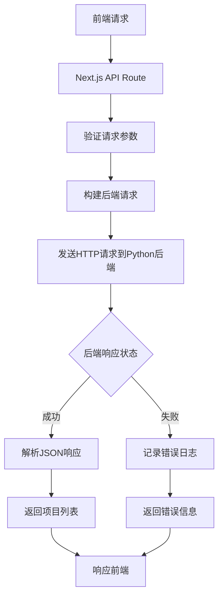

**图表来源**
- [route.ts](file://src/app/api/wiki/projects/route.ts#L38-L63)

#### 错误处理和重试机制

| 错误类型 | 处理策略 | 响应状态码 |
|---------|----------|-----------|
| 网络连接失败 | 记录错误并返回503 | 503 Service Unavailable |
| 后端API错误 | 解析错误响应并转发 | 原始状态码 |
| 请求格式错误 | 返回400 Bad Request | 400 |
| 权限验证失败 | 返回401 Unauthorized | 401 |

**章节来源**
- [route.ts](file://src/app/api/wiki/projects/route.ts#L1-L104)

## 依赖关系分析

### 组件间依赖关系

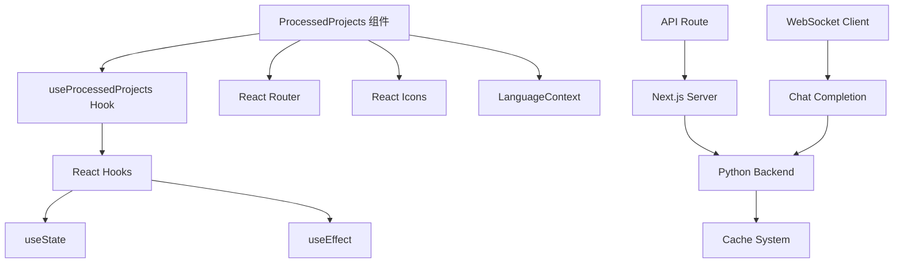

**图表来源**
- [useProcessedProjects.ts](file://src/hooks/useProcessedProjects.ts#L1-L2)
- [ProcessedProjects.tsx](file://src/components/ProcessedProjects.tsx#L1-L6)
- [route.ts](file://src/app/api/wiki/projects/route.ts#L1-L2)

### 外部依赖管理

| 依赖包 | 版本 | 用途 |
|--------|------|------|
| react | ^18.0+ | React框架核心 |
| next | ^14.0+ | Next.js全栈框架 |
| react-icons | ^4.0+ | 图标库 |
| typescript | ^5.0+ | 类型安全 |

**章节来源**
- [useProcessedProjects.ts](file://src/hooks/useProcessedProjects.ts#L1-L2)
- [ProcessedProjects.tsx](file://src/components/ProcessedProjects.tsx#L1-L6)

## 性能考虑

### 优化策略

#### 避免重复请求

Hook使用空依赖数组确保只在组件挂载时执行一次数据获取：

```typescript
// 只在组件首次渲染时执行数据获取
useEffect(() => {
  fetchProjects();
}, []); // 空依赖数组，仅执行一次
```

#### 状态更新优化

- **批量状态更新**: 使用单一状态更新避免多次重渲染
- **记忆化计算**: 在ProcessedProjects组件中使用`useMemo`优化过滤逻辑
- **条件渲染**: 根据加载状态和错误状态进行适当的UI渲染控制

#### 内存泄漏防护

- **清理函数**: 确保在组件卸载时正确清理副作用
- **状态引用**: 使用稳定的引用避免不必要的重新渲染

### 性能监控指标

| 指标 | 目标值 | 监控方法 |
|------|--------|----------|
| 首次加载时间 | < 2秒 | 浏览器开发者工具 |
| 内存使用量 | < 50MB | React DevTools Profiler |
| 重渲染次数 | 最小化 | React DevTools |
| API响应时间 | < 1秒 | 网络面板 |

## 故障排除指南

### 常见问题及解决方案

#### 数据加载失败

**症状**: 页面显示"Error loading projects"错误信息

**可能原因**:
1. 后端服务不可用
2. 网络连接问题
3. API路由配置错误

**解决步骤**:
1. 检查Python后端服务是否运行
2. 验证API路由配置
3. 查看浏览器控制台错误信息
4. 检查网络请求状态

#### 数据不一致

**症状**: 显示的项目列表与预期不符

**可能原因**:
1. 缓存过期
2. 并发修改冲突
3. 数据格式不匹配

**解决步骤**:
1. 清除浏览器缓存
2. 检查数据格式一致性
3. 验证API响应数据结构

#### 性能问题

**症状**: 页面加载缓慢或卡顿

**优化建议**:
1. 实施分页加载
2. 添加加载骨架屏
3. 优化过滤算法
4. 减少不必要的重渲染

**章节来源**
- [useProcessedProjects.ts](file://src/hooks/useProcessedProjects.ts#L32-L46)
- [ProcessedProjects.tsx](file://src/components/ProcessedProjects.tsx#L70-L78)

## 结论

`useProcessedProjects` Hook是一个设计精良的React自定义Hook，它成功地封装了复杂的数据获取逻辑，提供了简洁而强大的API接口。该Hook的主要优势包括：

### 技术优势

1. **类型安全**: 使用严格的数据结构定义确保类型安全
2. **错误处理**: 完善的错误处理机制提供良好的用户体验
3. **性能优化**: 避免重复请求和不必要的重渲染
4. **可维护性**: 清晰的代码结构便于后续维护和扩展

### 架构优势

1. **分离关注点**: 将数据获取逻辑与UI展示分离
2. **可复用性**: 可在多个组件中重复使用
3. **测试友好**: 独立的Hook便于单元测试
4. **扩展性强**: 支持未来功能扩展和优化

### 最佳实践体现

该Hook体现了现代React开发的最佳实践，包括：
- 函数式组件和Hooks的合理使用
- 状态管理的单一职责原则
- 错误边界的清晰划分
- 性能优化的主动考虑

通过深入分析这个Hook的实现，我们可以看到一个优秀的React自定义Hook应该具备的特征：简洁的API、完善的错误处理、良好的性能表现和清晰的架构设计。这对于构建高质量的React应用程序具有重要的指导意义。