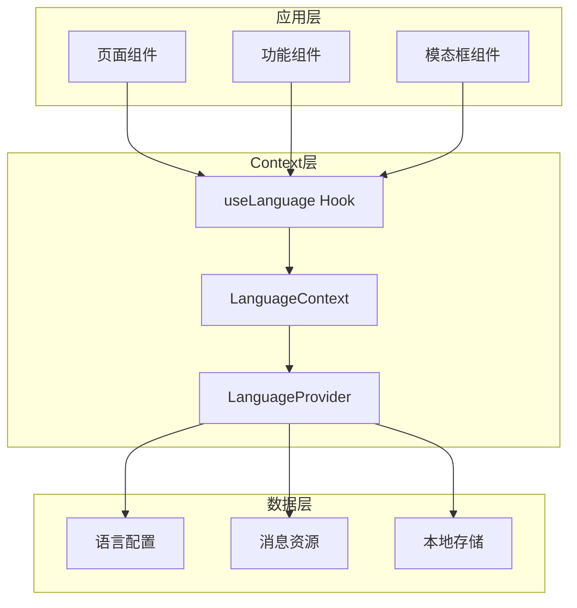
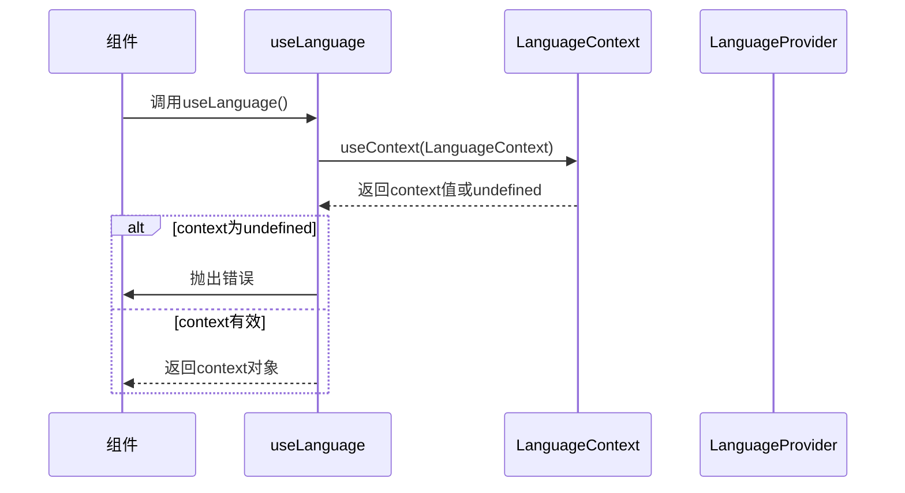
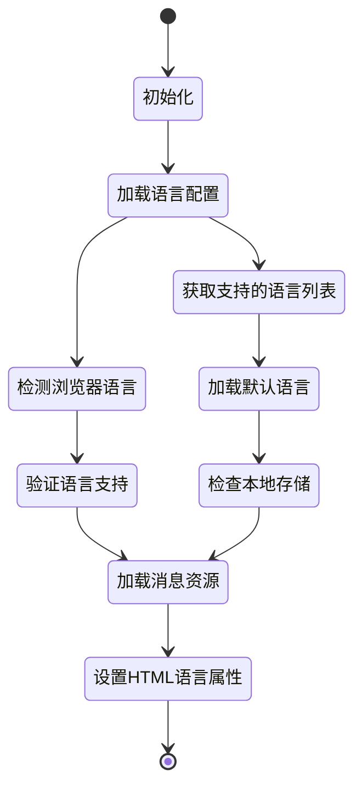
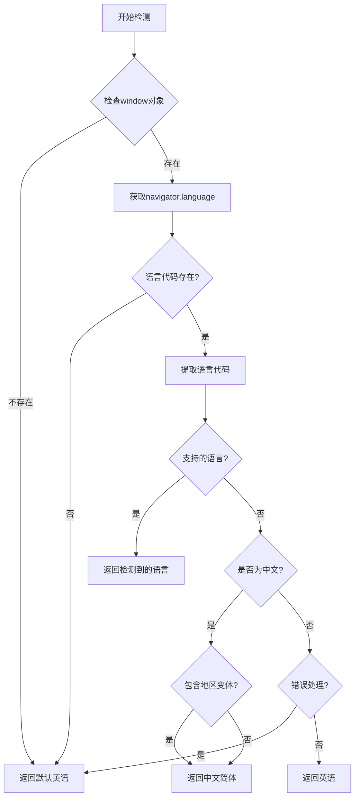
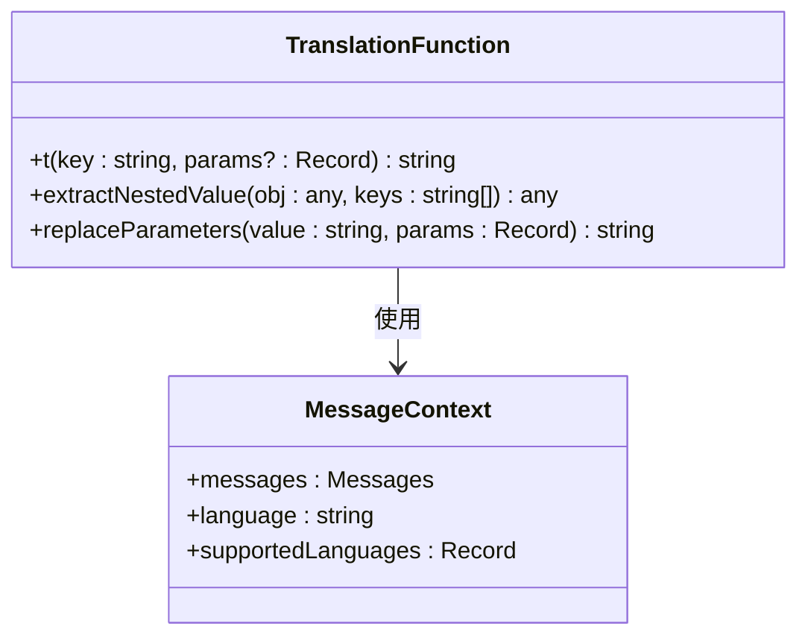
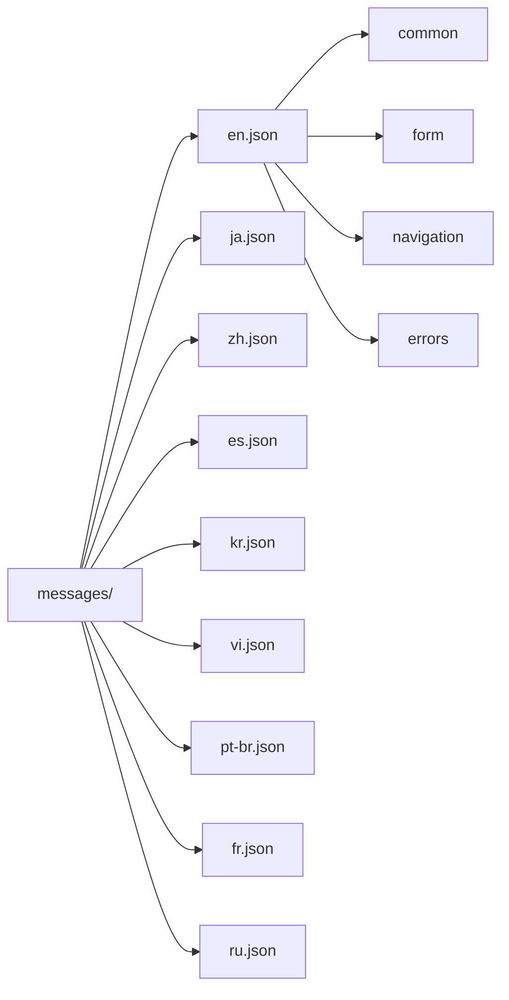
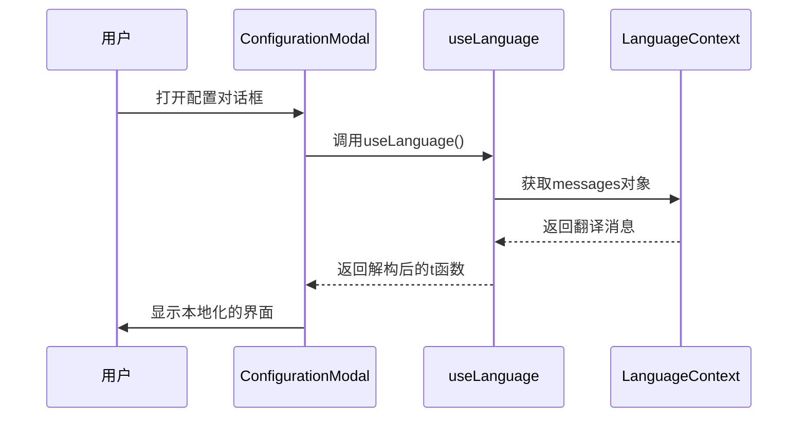
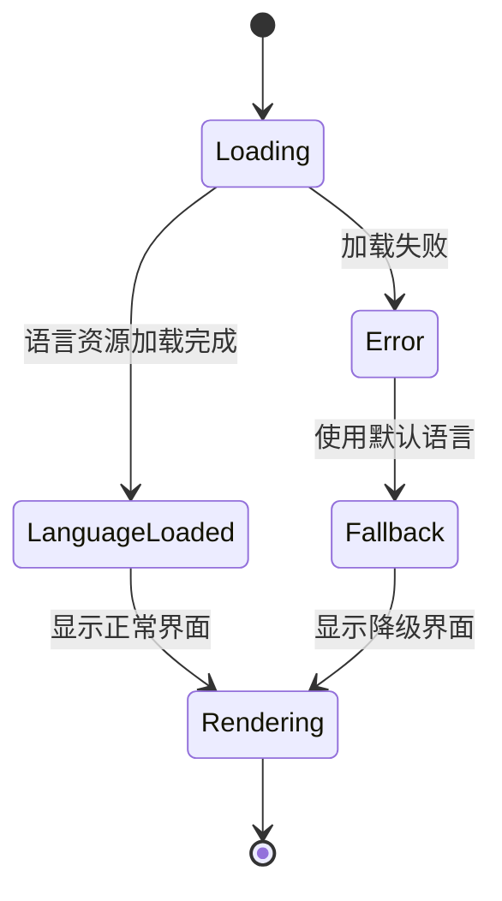

# 上下文消费者使用

<cite>
**本文档引用的文件**
- [LanguageContext.tsx](file://src/contexts/LanguageContext.tsx)
- [layout.tsx](file://src/app/layout.tsx)
- [page.tsx](file://src/app/page.tsx)
- [wiki/projects/page.tsx](file://src/app/wiki/projects/page.tsx)
- [ConfigurationModal.tsx](file://src/components/ConfigurationModal.tsx)
- [Ask.tsx](file://src/components/Ask.tsx)
- [ModelSelectionModal.tsx](file://src/components/ModelSelectionModal.tsx)
- [TokenInput.tsx](file://src/components/TokenInput.tsx)
- [UserSelector.tsx](file://src/components/UserSelector.tsx)
- [ProcessedProjects.tsx](file://src/components/ProcessedProjects.tsx)
</cite>

## 目录
1. [简介](#简介)
2. [LanguageContext架构概览](#languagecontext架构概览)
3. [useLanguage Hook实现原理](#uselanguage-hook实现原理)
4. [LanguageProvider组件详解](#languageprovider组件详解)
5. [多语言消息系统](#多语言消息系统)
6. [实际使用示例](#实际使用示例)
7. [isLoading状态管理](#isloading状态管理)
8. [常见误用场景与调试](#常见误用场景与调试)
9. [最佳实践指南](#最佳实践指南)
10. [总结](#总结)

## 简介

LanguageContext是Deepwiki项目中的核心国际化（i18n）系统，为整个应用程序提供了统一的语言管理和多语言支持功能。本文档将深入解析如何安全有效地在前端组件中使用LanguageContext，重点介绍useLanguage自定义Hook的实现原理和最佳实践。

## LanguageContext架构概览

LanguageContext采用React Context API构建了一个完整的国际化解决方案，包含以下核心组件：



**图表来源**
- [LanguageContext.tsx](file://src/contexts/LanguageContext.tsx#L15-L194)
- [layout.tsx](file://src/app/layout.tsx#L42-L45)

**章节来源**
- [LanguageContext.tsx](file://src/contexts/LanguageContext.tsx#L1-L203)
- [layout.tsx](file://src/app/layout.tsx#L1-L51)

## useLanguage Hook实现原理

### 核心实现机制

useLanguage Hook是LanguageContext的入口点，其设计遵循React的最佳实践：



**图表来源**
- [LanguageContext.tsx](file://src/contexts/LanguageContext.tsx#L195-L202)

### 运行时错误检测机制

useLanguage Hook实现了关键的运行时错误检测，确保开发者不会在Provider外部使用该Hook：

```typescript
// 错误检测逻辑
export function useLanguage() {
  const context = useContext(LanguageContext);
  if (context === undefined) {
    throw new Error('useLanguage must be used within a LanguageProvider');
  }
  return context;
}
```

这种设计模式遵循了React Context的使用规范，通过抛出明确的错误信息帮助开发者快速定位问题。

**章节来源**
- [LanguageContext.tsx](file://src/contexts/LanguageContext.tsx#L195-L202)

## LanguageProvider组件详解

### 状态管理架构

LanguageProvider负责管理整个应用的语言状态，包括：



**图表来源**
- [LanguageContext.tsx](file://src/contexts/LanguageContext.tsx#L101-L178)

### 关键状态变量

LanguageProvider维护以下核心状态：

| 状态变量 | 类型 | 描述 |
|---------|------|------|
| `language` | `string` | 当前激活的语言代码（如'en', 'ja', 'zh'等） |
| `messages` | `Messages` | 当前语言的消息对象，包含所有翻译文本 |
| `isLoading` | `boolean` | 是否正在加载语言资源 |
| `supportedLanguages` | `Record<string, string>` | 支持的语言列表及其显示名称 |
| `defaultLanguage` | `string` | 默认语言代码 |

### 浏览器语言检测逻辑

Provider实现了智能的浏览器语言检测机制：



**图表来源**
- [LanguageContext.tsx](file://src/contexts/LanguageContext.tsx#L25-L66)

**章节来源**
- [LanguageContext.tsx](file://src/contexts/LanguageContext.tsx#L17-L194)

## 多语言消息系统

### 消息对象结构

LanguageContext提供了一个灵活的消息系统，支持嵌套结构和参数化翻译：

```typescript
type Messages = Record<string, any>;
```

### 翻译函数实现

项目中展示了多种翻译函数的实现方式：



**图表来源**
- [page.tsx](file://src/app/page.tsx#L50-L76)

### 消息资源组织

消息资源按语言分组存储，每个语言文件包含完整的翻译层次结构：



**章节来源**
- [LanguageContext.tsx](file://src/contexts/LanguageContext.tsx#L7-L13)
- [page.tsx](file://src/app/page.tsx#L50-L76)

## 实际使用示例

### 基础使用模式

以下是useLanguage Hook在不同组件中的典型使用模式：

#### 1. 页面级组件使用

```typescript
// 在页面组件中完整访问所有语言功能
const { language, setLanguage, messages, supportedLanguages } = useLanguage();
```

#### 2. 组件级翻译使用

```typescript
// 在功能组件中仅使用翻译功能
const { messages } = useLanguage();
const translatedText = messages.common.submit || 'Submit';
```

#### 3. 模态框组件中的高级用法

```typescript
// 在复杂组件中解构特定属性
const { messages: t } = useLanguage();
```

### 具体组件示例分析

#### ConfigurationModal 组件



**图表来源**
- [ConfigurationModal.tsx](file://src/components/ConfigurationModal.tsx#L98-L100)

#### Ask 组件中的动态翻译

Ask组件展示了如何在复杂的交互场景中使用翻译功能：

```typescript
// 动态翻译示例
const { messages } = useLanguage();
const translatedPlaceholder = messages.ask?.placeholder || 'What would you like to know about this codebase?';
```

### 消息传递模式

在组件间传递消息对象有以下几种模式：

| 模式 | 适用场景 | 示例 |
|------|----------|------|
| 直接传递 | 简单组件 | `messages={messages}` |
| 解构重命名 | 避免冲突 | `messages: t` |
| 属性映射 | 复杂场景 | `messages={messages.form}` |

**章节来源**
- [ConfigurationModal.tsx](file://src/components/ConfigurationModal.tsx#L1-L299)
- [Ask.tsx](file://src/components/Ask.tsx#L1-L929)
- [ModelSelectionModal.tsx](file://src/components/ModelSelectionModal.tsx#L1-L260)
- [TokenInput.tsx](file://src/components/TokenInput.tsx#L1-L108)
- [UserSelector.tsx](file://src/components/UserSelector.tsx#L1-L523)

## isLoading状态管理

### 加载状态的作用

isLoading状态在LanguageContext中扮演着关键角色，用于控制应用的渲染时机：



**图表来源**
- [LanguageContext.tsx](file://src/contexts/LanguageContext.tsx#L178-L187)

### 避免空白界面的策略

isLoading状态确保用户不会看到未翻译的内容：

```typescript
// 加载期间显示占位符
if (isLoading) {
  return (
    <div className="flex items-center justify-center h-screen bg-gray-100 dark:bg-gray-900">
      <div className="text-center">
        <div className="animate-spin rounded-full h-12 w-12 border-t-2 border-b-2 border-purple-500 mx-auto mb-4"></div>
        <p className="text-gray-600 dark:text-gray-400">Loading...</p>
      </div>
    </div>
  );
}
```

### 性能优化考虑

isLoading状态还帮助实现以下性能优化：

- **首屏渲染优化**：确保翻译资源就绪后再渲染内容
- **用户体验提升**：提供明确的加载指示
- **错误边界处理**：在加载失败时提供降级方案

**章节来源**
- [LanguageContext.tsx](file://src/contexts/LanguageContext.tsx#L178-L187)

## 常见误用场景与调试

### 必须在LanguageProvider内使用

#### 错误场景1：在Provider外部调用

```typescript
// ❌ 错误：在LanguageProvider外部使用
function WrongComponent() {
  const { messages } = useLanguage(); // 抛出错误
  return <div>{messages.common.submit}</div>;
}
```

#### 错误场景2：条件性Provider使用

```typescript
// ❌ 错误：条件性Provider包装
function ConditionalProvider({ children }) {
  const [isLoggedIn, setIsLoggedIn] = useState(false);
  return isLoggedIn ? <LanguageProvider>{children}</LanguageProvider> : children;
}
```

### 调试方法

#### 1. 开发环境错误提示

当在Provider外部使用时，React会抛出明确的错误：
```
Error: useLanguage must be used within a LanguageProvider
```

#### 2. 调试工具建议

```typescript
// 调试辅助函数
function debugLanguageContext() {
  try {
    const context = useContext(LanguageContext);
    console.log('LanguageContext available:', !!context);
    return context;
  } catch (error) {
    console.error('LanguageContext error:', error);
    return null;
  }
}
```

#### 3. 组件树验证

```typescript
// 验证组件树中是否存在Provider
function validateProviderTree(component) {
  // 检查组件树中是否有LanguageProvider
  // 可以使用React DevTools或自定义验证逻辑
}
```

### 最佳实践检查清单

- ✅ 确保所有使用useLanguage的组件都在LanguageProvider内部
- ✅ 检查组件树的正确嵌套关系
- ✅ 验证Provider的生命周期管理
- ✅ 测试Provider的条件渲染逻辑

**章节来源**
- [LanguageContext.tsx](file://src/contexts/LanguageContext.tsx#L198-L200)

## 最佳实践指南

### 1. 组件设计原则

#### 单一职责原则
```typescript
// 推荐：专注于翻译功能的组件
function SubmitButton() {
  const { messages } = useLanguage();
  return (
    <button type="submit">
      {messages.common.submit || 'Submit'}
    </button>
  );
}
```

#### 避免过度抽象
```typescript
// 不推荐：过度封装翻译逻辑
function createTranslatedComponent(Component, key) {
  return function TranslatedComponent(props) {
    const { messages } = useLanguage();
    return <Component {...props} label={messages[key]} />;
  };
}
```

### 2. 性能优化策略

#### 1. 消息对象缓存
```typescript
// 缓存翻译结果避免重复计算
const memoizedTranslation = useMemo(() => {
  return messages.common.submit || 'Submit';
}, [messages.common.submit]);
```

#### 2. 条件渲染优化
```typescript
// 仅在需要时才进行翻译
function ConditionalTranslation({ showTranslation }) {
  const { messages } = useLanguage();
  
  if (!showTranslation) return null;
  
  return <div>{messages.common.submit}</div>;
}
```

### 3. 错误处理策略

#### 1. 回退机制
```typescript
// 提供回退翻译
const translate = (key, fallback = 'Missing translation') => {
  const keys = key.split('.');
  let value = messages;
  
  for (const k of keys) {
    if (value && typeof value === 'object' && k in value) {
      value = value[k];
    } else {
      return fallback;
    }
  }
  
  return value;
};
```

#### 2. 类型安全
```typescript
// 定义类型安全的翻译接口
interface TranslationKeys {
  common: {
    submit: string;
    cancel: string;
    loading: string;
  };
  form: {
    placeholder: string;
    error: string;
  };
}

function useTypedTranslation(): TranslationKeys {
  const { messages } = useLanguage();
  return messages as TranslationKeys;
}
```

### 4. 测试策略

#### 1. 单元测试
```typescript
describe('useLanguage Hook', () => {
  it('should throw error when used outside Provider', () => {
    expect(() => renderHook(() => useLanguage())).toThrow(
      'useLanguage must be used within a LanguageProvider'
    );
  });
});
```

#### 2. 集成测试
```typescript
describe('LanguageContext Integration', () => {
  it('should provide translations in different languages', async () => {
    const wrapper = ({ children }) => (
      <LanguageProvider>{children}</LanguageProvider>
    );
    
    const { result } = renderHook(() => useLanguage(), { wrapper });
    
    expect(result.current.messages.common.submit).toBeDefined();
  });
});
```

## 总结

LanguageContext为Deepwiki项目提供了一个强大而灵活的国际化解决方案。通过useLanguage Hook的安全使用模式，开发者可以：

1. **安全访问语言资源**：通过运行时错误检测确保Hook在正确的上下文中使用
2. **高效管理多语言状态**：利用Provider的状态管理能力处理复杂的语言切换逻辑
3. **优化用户体验**：通过isLoading状态避免空白界面，提供流畅的加载体验
4. **保持代码整洁**：通过合理的抽象和封装减少重复代码

掌握这些概念和最佳实践，将帮助开发者构建更加健壮和用户友好的国际化应用。记住始终在LanguageProvider的上下文中使用useLanguage Hook，并合理处理加载状态和错误情况，这是确保国际化功能正常工作的关键。