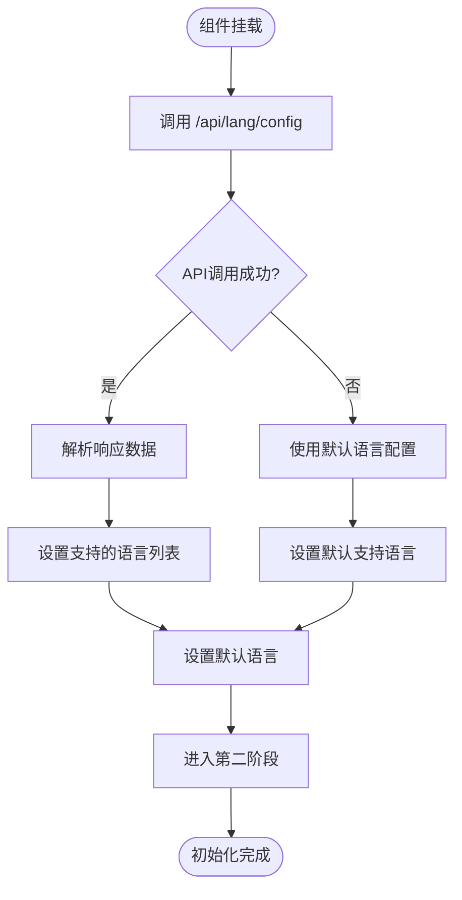

# 语言上下文: LanguageContext

<cite>
**本文档中引用的文件**
- [LanguageContext.tsx](file://src/contexts/LanguageContext.tsx)
- [i18n.ts](file://src/i18n.ts)
- [layout.tsx](file://src/app/layout.tsx)
- [en.json](file://src/messages/en.json)
- [zh.json](file://src/messages/zh.json)
- [ja.json](file://src/messages/ja.json)
- [page.tsx](file://src/app/page.tsx)
- [ConfigurationModal.tsx](file://src/components/ConfigurationModal.tsx)
- [Ask.tsx](file://src/components/Ask.tsx)
</cite>

## 目录
1. [简介](#简介)
2. [项目结构](#项目结构)
3. [核心组件](#核心组件)
4. [架构概览](#架构概览)
5. [详细组件分析](#详细组件分析)
6. [依赖关系分析](#依赖关系分析)
7. [性能考虑](#性能考虑)
8. [故障排除指南](#故障排除指南)
9. [结论](#结论)

## 简介

LanguageContext是DeepWiki-Open项目中的核心国际化（i18n）系统，负责管理应用程序的多语言支持。该上下文容器提供了全局状态管理，包括当前语言设置、多语言消息资源、支持的语言列表以及语言切换功能。通过React Context API和动态模块导入技术，实现了高效的语言切换和资源加载机制。

该系统设计遵循现代React最佳实践，采用服务端渲染（SSR）友好的架构，支持多种语言环境检测，并提供了完善的错误降级策略。用户界面组件可以通过useLanguage Hook安全地访问语言上下文，确保在Provider外部使用时抛出明确的错误提示。

## 项目结构

LanguageContext系统在项目中的组织结构体现了清晰的职责分离和模块化设计：


**图表来源**
- [LanguageContext.tsx](file://src/contexts/LanguageContext.tsx#L1-L203)
- [layout.tsx](file://src/app/layout.tsx#L1-L51)
- [i18n.ts](file://src/i18n.ts#L1-L15)

**节来源**
- [LanguageContext.tsx](file://src/contexts/LanguageContext.tsx#L1-L203)
- [layout.tsx](file://src/app/layout.tsx#L1-L51)
- [i18n.ts](file://src/i18n.ts#L1-L15)

## 核心组件

LanguageContext系统由三个核心组件构成，每个组件都有明确的职责和功能边界：

### LanguageContext类型定义

系统定义了清晰的类型接口来确保类型安全：

```typescript
type Messages = Record<string, any>;
type LanguageContextType = {
  language: string;
  setLanguage: (lang: string) => void;
  messages: Messages;
  supportedLanguages: Record<string, string>;
};
```

### LanguageProvider组件

LanguageProvider是整个语言系统的核心控制器，负责：
- 初始化语言状态和加载状态
- 检测浏览器语言偏好设置
- 从localStorage恢复用户偏好
- 动态加载对应语言的消息资源
- 提供语言切换功能
- 处理加载状态和错误降级

### useLanguage Hook

useLanguage Hook提供了安全的语言上下文访问机制：
- 检查Provider包装
- 抛出明确的错误提示
- 返回完整的语言上下文对象

**节来源**
- [LanguageContext.tsx](file://src/contexts/LanguageContext.tsx#L7-L203)

## 架构概览

LanguageContext采用了分层架构设计，确保了良好的可维护性和扩展性：


**图表来源**
- [LanguageContext.tsx](file://src/contexts/LanguageContext.tsx#L69-L176)

该架构的关键特性包括：

1. **异步初始化流程**：通过两个useEffect钩子实现分阶段初始化
2. **服务端渲染兼容**：在服务端环境中优雅降级
3. **客户端优先策略**：优先使用浏览器语言和用户偏好
4. **动态模块导入**：按需加载语言资源，优化初始包大小
5. **错误恢复机制**：在任何步骤失败时回退到英语

## 详细组件分析

### LanguageProvider初始化流程

LanguageProvider的初始化过程分为两个关键阶段：

#### 第一阶段：支持语言配置加载



**图表来源**
- [LanguageContext.tsx](file://src/contexts/LanguageContext.tsx#L69-L96)

#### 第二阶段：语言检测和消息加载


**图表来源**
- [LanguageContext.tsx](file://src/contexts/LanguageContext.tsx#L101-L176)

### 浏览器语言检测算法

LanguageContext实现了智能的浏览器语言检测机制：


**图表来源**
- [LanguageContext.tsx](file://src/contexts/LanguageContext.tsx#L25-L66)

### 语言切换机制

语言切换功能提供了无缝的用户体验：


**图表来源**
- [LanguageContext.tsx](file://src/contexts/LanguageContext.tsx#L152-L176)

### 错误处理和降级策略

系统实现了多层次的错误处理机制：

| 场景 | 处理策略 | 回退目标 |
|------|----------|----------|
| API请求失败 | 使用默认语言配置 | 内置默认语言列表 |
| 消息文件加载失败 | 导入英语消息文件 | 英语作为最终回退 |
| 浏览器环境检测失败 | 默认使用英语 | 保证基本可用性 |
| localStorage访问失败 | 仅在客户端使用 | 临时存储语言偏好 |

**节来源**
- [LanguageContext.tsx](file://src/contexts/LanguageContext.tsx#L69-L176)

### useLanguage Hook的安全机制

useLanguage Hook实现了严格的上下文验证：


**图表来源**
- [LanguageContext.tsx](file://src/contexts/LanguageContext.tsx#L195-L202)

**节来源**
- [LanguageContext.tsx](file://src/contexts/LanguageContext.tsx#L195-L202)

## 依赖关系分析

LanguageContext系统的依赖关系体现了清晰的架构层次：


**图表来源**
- [LanguageContext.tsx](file://src/contexts/LanguageContext.tsx#L1-L6)
- [layout.tsx](file://src/app/layout.tsx#L1-L51)
- [i18n.ts](file://src/i18n.ts#L1-L15)

### 关键依赖说明

1. **React Context API**：提供状态管理和跨组件通信
2. **Next Intl集成**：支持服务端国际化配置
3. **动态导入**：实现按需加载语言资源
4. **localStorage API**：持久化用户语言偏好

**节来源**
- [LanguageContext.tsx](file://src/contexts/LanguageContext.tsx#L1-L6)
- [i18n.ts](file://src/i18n.ts#L1-L15)

## 性能考虑

LanguageContext系统在设计时充分考虑了性能优化：

### 代码分割和懒加载

- **动态导入**：语言消息文件采用动态导入，只有在需要时才加载
- **按需加载**：支持的语言列表通过API获取，避免打包所有语言资源
- **缓存机制**：localStorage缓存用户偏好，减少重复检测开销

### 渲染优化

- **条件渲染**：在语言资源加载完成前显示加载动画
- **状态管理**：使用useState和useEffect实现精确的状态控制
- **内存管理**：及时清理不必要的状态和事件监听器

### 网络优化

- **API缓存**：支持的语言配置通过API获取，便于动态更新
- **错误恢复**：网络请求失败时的快速降级机制
- **并发控制**：避免重复的语言检测和消息加载请求

## 故障排除指南

### 常见问题及解决方案

#### 语言切换不生效

**症状**：调用setLanguage后界面语言没有变化

**原因分析**：
- 语言不在支持的语言列表中
- 消息文件加载失败
- 组件未正确重新渲染

**解决方案**：
1. 检查语言是否在supportedLanguages中
2. 验证消息文件是否存在且格式正确
3. 确保组件订阅了语言上下文的变化

#### 浏览器语言检测异常

**症状**：自动检测的语言不符合预期

**原因分析**：
- navigator.language返回值格式异常
- 支持的语言列表配置错误
- 特殊语言变体处理不当

**解决方案**：
1. 检查浏览器语言设置
2. 验证locales数组配置
3. 查看控制台错误日志

#### 服务端渲染问题

**症状**：服务端和客户端语言不一致

**原因分析**：
- 服务端无法访问navigator对象
- 服务端语言检测逻辑缺失

**解决方案**：
1. 确保服务端使用默认语言
2. 在服务端配置中指定默认语言
3. 检查Next Intl配置

**节来源**
- [LanguageContext.tsx](file://src/contexts/LanguageContext.tsx#L25-L66)
- [LanguageContext.tsx](file://src/contexts/LanguageContext.tsx#L152-L176)

## 结论

LanguageContext作为DeepWiki-Open项目的国际化核心，展现了现代React应用中状态管理的最佳实践。通过精心设计的架构，它成功地解决了多语言支持中的关键挑战：

### 主要优势

1. **架构清晰**：分层设计确保了良好的可维护性
2. **性能优化**：动态导入和缓存机制提升了用户体验
3. **错误恢复**：完善的降级策略保证了应用稳定性
4. **扩展性强**：支持新增语言和动态配置
5. **开发友好**：清晰的API设计降低了使用复杂度

### 技术亮点

- **服务端渲染兼容性**：优雅处理SSR环境下的语言检测
- **智能语言检测**：支持多种语言变体和浏览器偏好
- **动态资源加载**：按需加载语言资源，优化包大小
- **类型安全保障**：完整的TypeScript类型定义

### 最佳实践体现

LanguageContext系统完美诠释了React Context API的正确使用方式，为开发者提供了一个可复用、可测试、可扩展的国际化解决方案。其设计理念和实现细节对于构建大型React应用具有重要的参考价值。