# 语言上下文初始化流程详细解析

<cite>
**本文档引用的文件**
- [LanguageContext.tsx](file://src/contexts/LanguageContext.tsx)
- [i18n.ts](file://src/i18n.ts)
- [layout.tsx](file://src/app/layout.tsx)
- [lang.json](file://api/config/lang.json)
- [en.json](file://src/messages/en.json)
- [zh.json](file://src/messages/zh.json)
- [next.config.ts](file://next.config.ts)
</cite>

## 目录
1. [概述](#概述)
2. [项目架构](#项目架构)
3. [核心组件分析](#核心组件分析)
4. [状态初始化流程](#状态初始化流程)
5. [SSR与CSR环境差异](#ssr与csr环境差异)
6. [语言检测机制](#语言检测机制)
7. [降级策略](#降级策略)
8. [HTML根元素同步](#html根元素同步)
9. [性能考虑](#性能考虑)
10. [故障排除指南](#故障排除指南)

## 概述

LanguageContext是DeepWiki项目中的核心国际化组件，负责管理应用程序的语言状态、加载语言资源以及处理多语言环境下的用户偏好。该组件通过React的Context API提供全局语言状态，并实现了复杂的初始化流程来确保在不同环境下都能正确设置初始语言。

## 项目架构

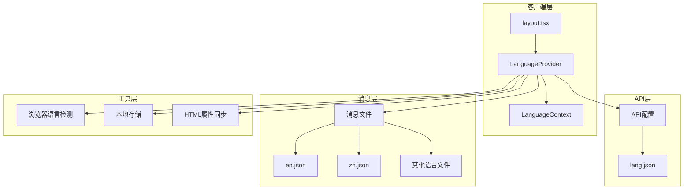

**图表来源**
- [layout.tsx](file://src/app/layout.tsx#L33-L45)
- [LanguageContext.tsx](file://src/contexts/LanguageContext.tsx#L17-L194)

## 核心组件分析

### LanguageProvider组件结构

LanguageProvider是语言上下文的主要容器组件，负责管理以下状态：

| 状态变量 | 类型 | 默认值 | 描述 |
|---------|------|--------|------|
| language | string | 'en' | 当前激活的语言代码 |
| messages | Messages | {} | 当前语言的消息对象 |
| isLoading | boolean | true | 加载状态指示器 |
| supportedLanguages | Record<string, string> | {} | 支持的语言映射表 |
| defaultLanguage | string | 'en' | 默认语言代码 |

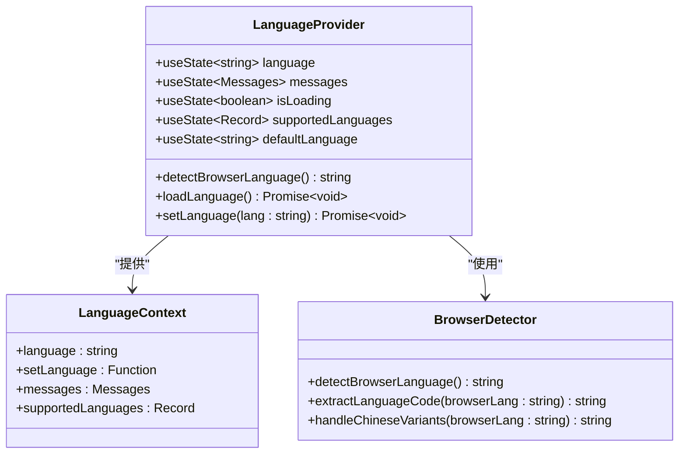

**图表来源**
- [LanguageContext.tsx](file://src/contexts/LanguageContext.tsx#L8-L13)
- [LanguageContext.tsx](file://src/contexts/LanguageContext.tsx#L17-L194)

**节来源**
- [LanguageContext.tsx](file://src/contexts/LanguageContext.tsx#L17-L194)

## 状态初始化流程

LanguageProvider的初始化遵循严格的链式执行模式，通过两个关键的useEffect钩子实现：

### 第一阶段：获取支持的语言配置

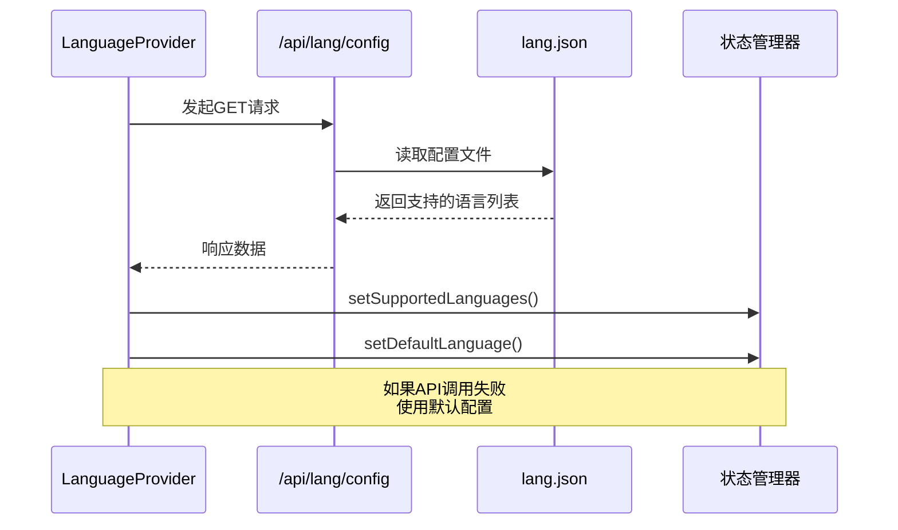

**图表来源**
- [LanguageContext.tsx](file://src/contexts/LanguageContext.tsx#L69-L97)

这一阶段的关键特性：
- **异步加载**：使用async/await模式确保配置完全加载
- **错误处理**：API调用失败时自动降级到默认配置
- **配置优先级**：动态API配置优先于静态默认配置

### 第二阶段：确定初始语言

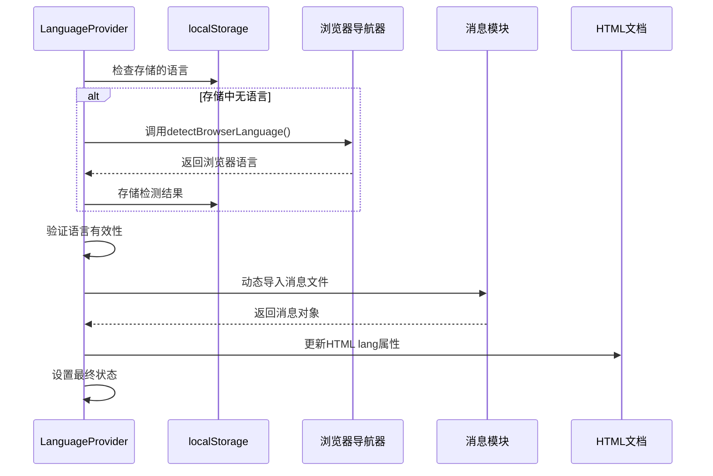

**图表来源**
- [LanguageContext.tsx](file://src/contexts/LanguageContext.tsx#L101-L149)

**节来源**
- [LanguageContext.tsx](file://src/contexts/LanguageContext.tsx#L69-L149)

## SSR与CSR环境差异

### 服务端渲染(SSR)处理

在服务端环境中，LanguageProvider采用保守的初始化策略：

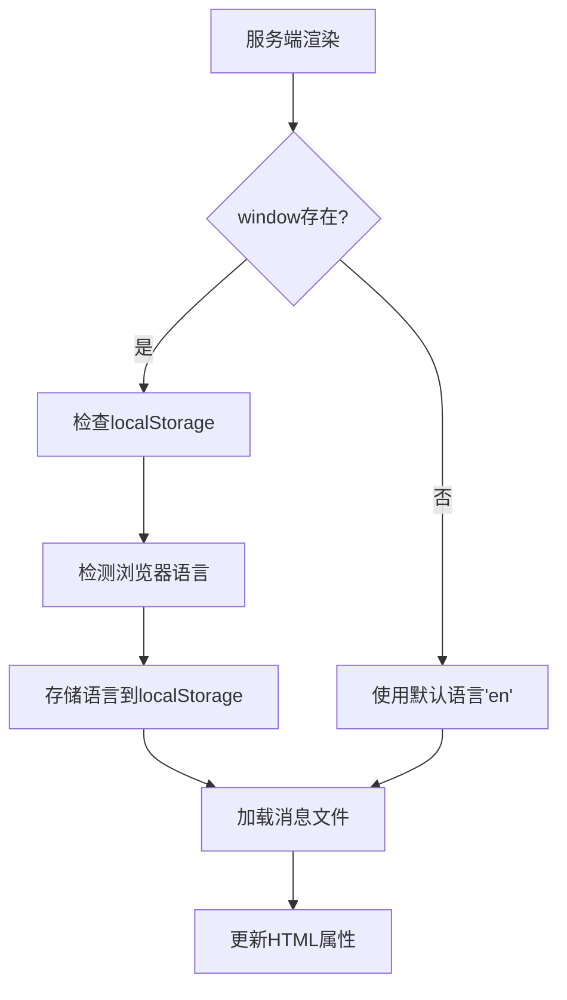

**图表来源**
- [LanguageContext.tsx](file://src/contexts/LanguageContext.tsx#L107-L121)

### 客户端渲染(CSR)处理

客户端环境提供了完整的语言检测和存储功能：

| 功能 | SSR行为 | CSR行为 |
|------|---------|---------|
| 浏览器语言检测 | 不可用 | 可用 |
| localStorage访问 | 不可用 | 可用 |
| HTML属性更新 | 不可用 | 可用 |
| 消息文件动态导入 | 同步 | 异步 |
| 用户偏好存储 | 不适用 | 实时存储 |

**节来源**
- [LanguageContext.tsx](file://src/contexts/LanguageContext.tsx#L107-L121)

## 语言检测机制

### detectBrowserLanguage函数详解

浏览器语言检测是语言初始化的核心组件，具有以下特性：

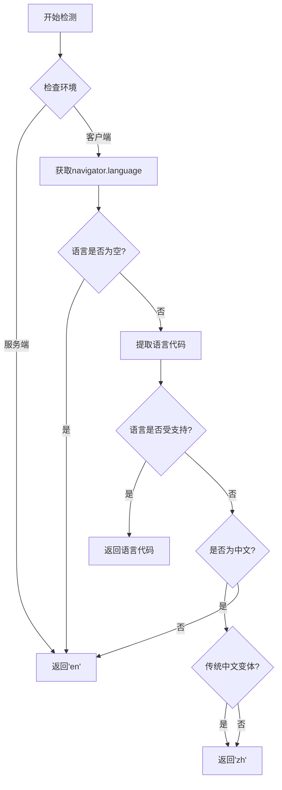

**图表来源**
- [LanguageContext.tsx](file://src/contexts/LanguageContext.tsx#L25-L66)

### 中文语言特殊处理

中文语言检测包含了对简体中文和繁体中文的智能区分：

| 浏览器语言代码 | 检测结果 | 处理逻辑 |
|---------------|----------|----------|
| zh-CN | zh | 简体中文 |
| zh-TW | zh | 繁体中文（传统） |
| zh-HK | zh | 繁体中文（香港） |
| zh-SG | zh | 简体中文（新加坡） |
| zh-MO | zh | 繁体中文（澳门） |

**节来源**
- [LanguageContext.tsx](file://src/contexts/LanguageContext.tsx#L50-L59)

## 降级策略

### API配置失败降级

当动态API调用失败时，系统采用预定义的默认语言配置：

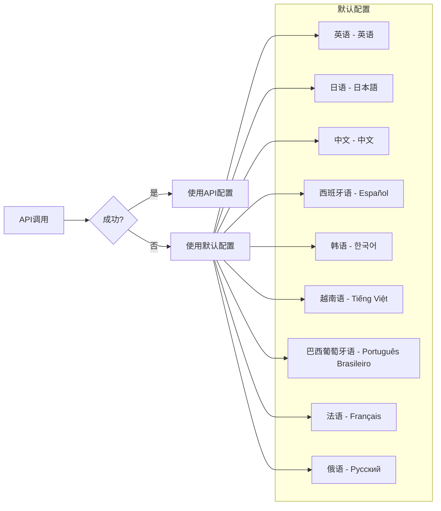

**图表来源**
- [LanguageContext.tsx](file://src/contexts/LanguageContext.tsx#L82-L96)

### 消息加载失败降级

消息文件加载失败时的处理流程：

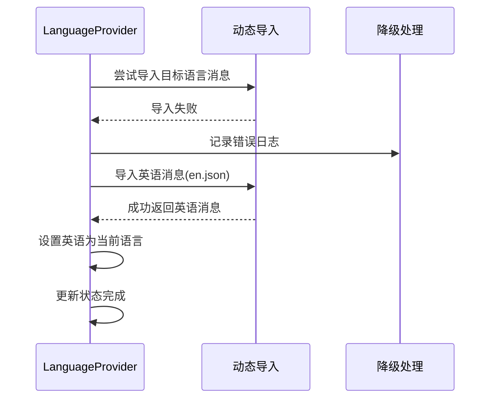

**图表来源**
- [LanguageContext.tsx](file://src/contexts/LanguageContext.tsx#L138-L142)

**节来源**
- [LanguageContext.tsx](file://src/contexts/LanguageContext.tsx#L80-L96)
- [LanguageContext.tsx](file://src/contexts/LanguageContext.tsx#L138-L142)

## HTML根元素同步

### lang属性更新机制

HTML根元素的lang属性同步确保了Web标准的无障碍性和SEO优化：

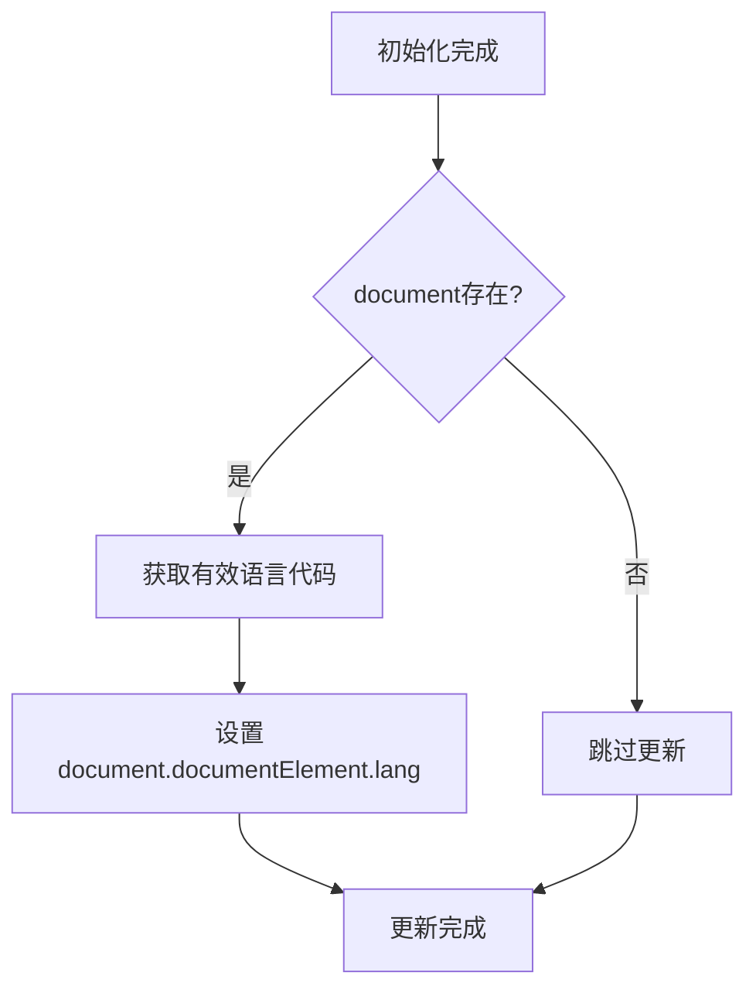

**图表来源**
- [LanguageContext.tsx](file://src/contexts/LanguageContext.tsx#L133-L136)

### 同步时机

语言状态更新时的属性同步：

| 触发事件 | 同步位置 | 条件 |
|---------|----------|------|
| 初始加载 | componentDidMount | 仅在客户端 |
| 用户切换 | setLanguage调用 | 仅在客户端 |
| API配置更新 | useEffect监听 | 仅在客户端 |

**节来源**
- [LanguageContext.tsx](file://src/contexts/LanguageContext.tsx#L133-L136)
- [LanguageContext.tsx](file://src/contexts/LanguageContext.tsx#L169-L172)

## 性能考虑

### 异步加载优化

语言上下文采用了多种性能优化策略：

1. **懒加载消息文件**：使用动态import()按需加载语言消息
2. **并发控制**：避免不必要的重复API调用
3. **状态合并**：将多个状态更新合并到单次渲染周期
4. **错误边界**：防止单个语言加载失败影响整体应用

### 内存管理

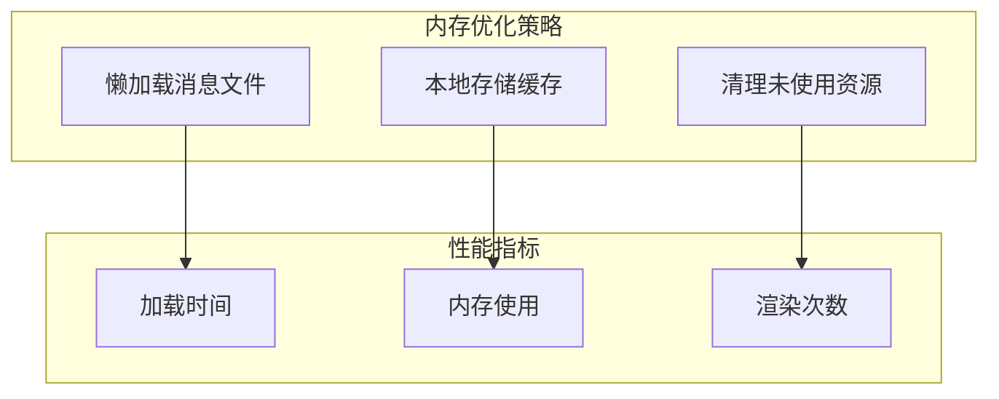

## 故障排除指南

### 常见问题及解决方案

| 问题类型 | 症状 | 可能原因 | 解决方案 |
|---------|------|----------|----------|
| 初始化超时 | 页面空白或加载动画 | API响应慢或失败 | 检查网络连接，验证API端点 |
| 语言切换失效 | 界面语言不变 | 状态更新失败 | 检查setLanguage函数调用 |
| HTML lang属性错误 | SEO或无障碍问题 | DOM操作失败 | 确认运行环境和权限 |
| 消息文件缺失 | 显示键名而非文本 | 文件路径错误 | 验证消息文件存在性 |

### 调试工具

开发环境中的调试功能：

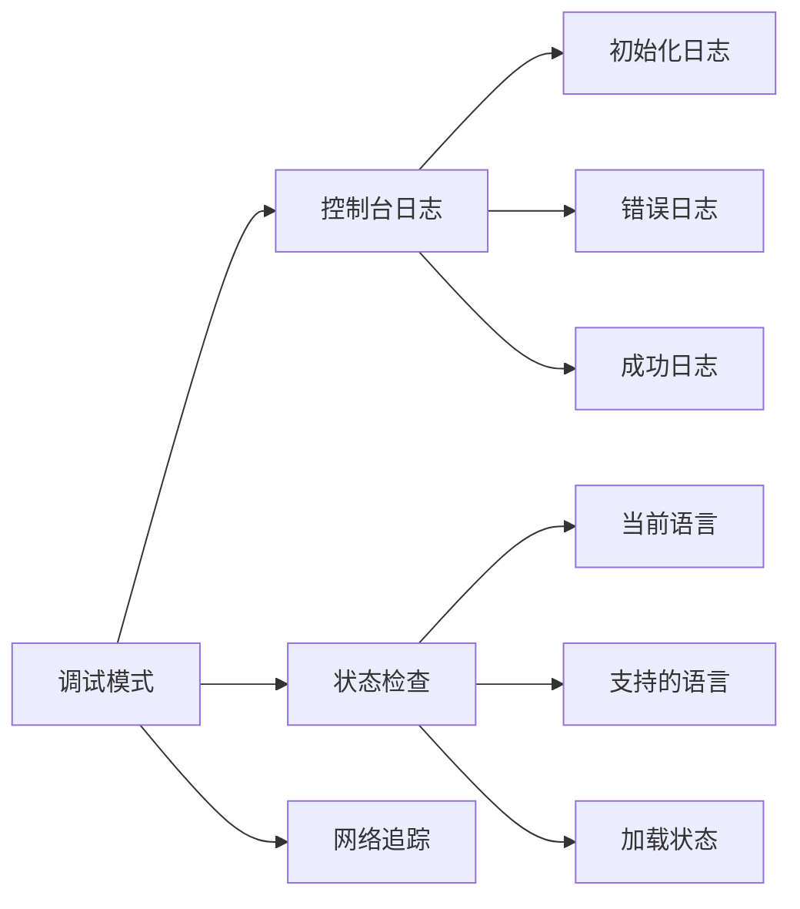

**节来源**
- [LanguageContext.tsx](file://src/contexts/LanguageContext.tsx#L34-L66)
- [LanguageContext.tsx](file://src/contexts/LanguageContext.tsx#L103-L149)

## 结论

LanguageContext通过精心设计的状态初始化流程，实现了在复杂Web应用环境中的可靠国际化支持。其独特的链式useEffect执行模式、智能的环境适应能力、完善的降级策略以及实时的HTML属性同步，共同构成了一个健壮而高效的国际化解决方案。

该组件的设计充分考虑了现代Web应用的各种场景需求，无论是传统的服务端渲染还是渐进式的客户端渲染，都能提供一致且可靠的用户体验。通过合理的错误处理和性能优化，确保了即使在网络条件不佳或配置错误的情况下，应用仍能保持基本的功能完整性。