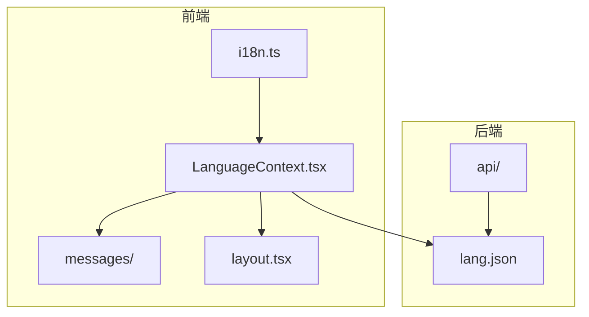
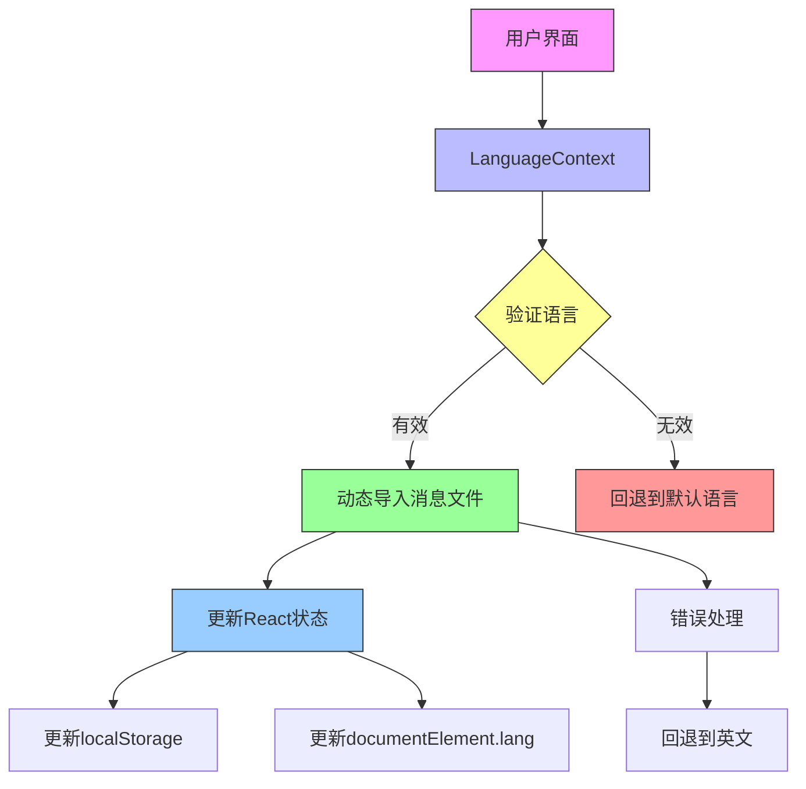
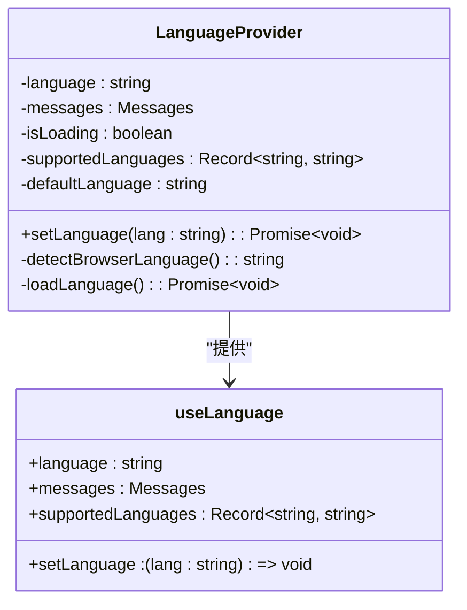
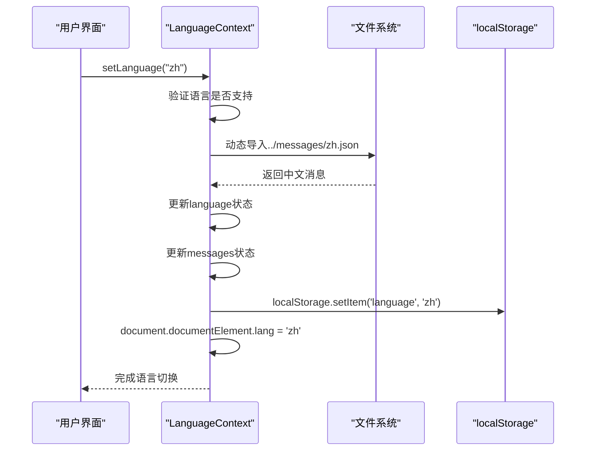
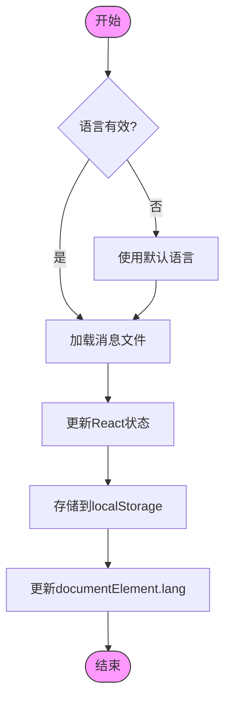
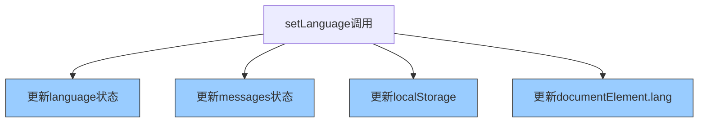
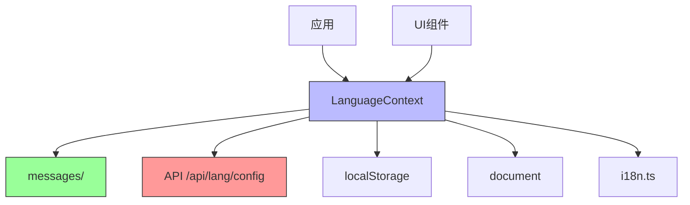
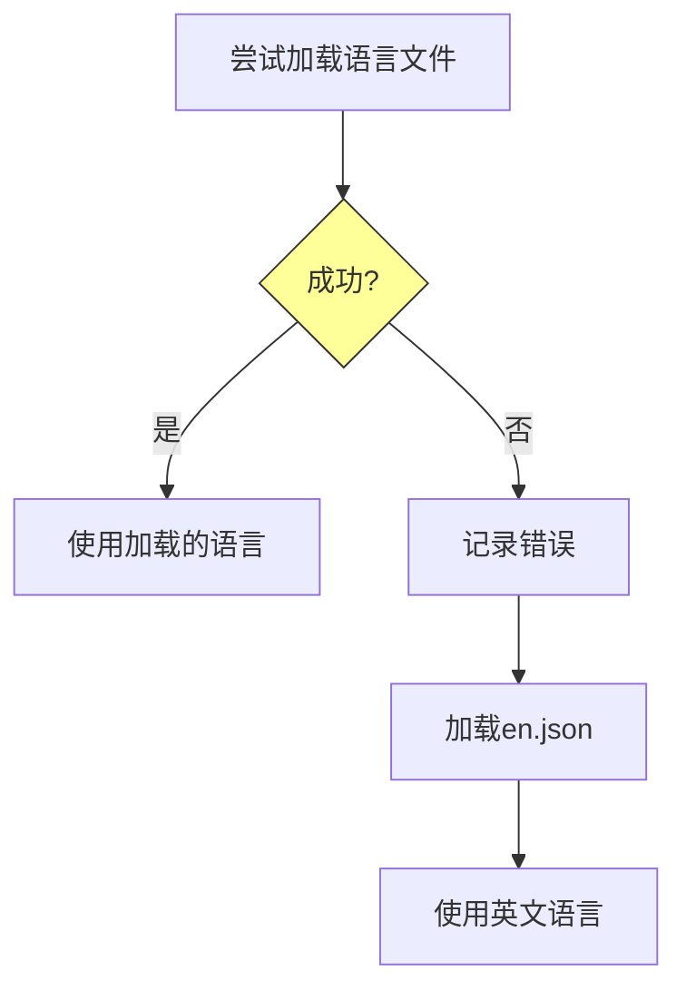

# 语言切换机制

<cite>
**本文档中引用的文件**  
- [LanguageContext.tsx](file://src/contexts/LanguageContext.tsx)
- [i18n.ts](file://src/i18n.ts)
- [lang.json](file://api/config/lang.json)
- [layout.tsx](file://src/app/layout.tsx)
- [page.tsx](file://src/app/page.tsx)
- [zh.json](file://src/messages/zh.json)
- [en.json](file://src/messages/en.json)
</cite>

## 目录
1. [简介](#简介)
2. [项目结构](#项目结构)
3. [核心组件](#核心组件)
4. [架构概述](#架构概述)
5. [详细组件分析](#详细组件分析)
6. [依赖分析](#依赖分析)
7. [性能考虑](#性能考虑)
8. [故障排除指南](#故障排除指南)
9. [结论](#结论)
10. [附录](#附录)（如有必要）

## 简介
本文档深入分析了 `setLanguage` 函数的实现细节，描述了用户触发语言切换时系统的完整处理流程。系统通过验证目标语言的有效性、动态加载对应语言的消息文件、更新React状态和DOM属性来实现国际化功能。文档详细说明了语言切换过程中的持久化存储逻辑、错误处理机制以及在UI组件中的实际应用。

## 项目结构
本项目采用标准的Next.js应用结构，具有清晰的模块化组织。语言相关功能主要分布在`src/contexts`、`src/messages`和`api/config`目录中，形成了完整的国际化解决方案。



**图示来源**
- [LanguageContext.tsx](file://src/contexts/LanguageContext.tsx#L1-L203)
- [lang.json](file://api/config/lang.json#L1-L16)

**章节来源**
- [LanguageContext.tsx](file://src/contexts/LanguageContext.tsx#L1-L203)
- [project_structure](file://#L1-L100)

## 核心组件
核心语言切换功能由`LanguageContext`提供，它管理语言状态、消息加载和持久化。`setLanguage`函数是语言切换的主要入口，负责验证语言、加载消息、更新状态和存储。

**章节来源**
- [LanguageContext.tsx](file://src/contexts/LanguageContext.tsx#L153-L176)

## 架构概述
系统采用基于React Context的国际化架构，通过服务端API获取支持的语言列表，客户端动态加载对应的语言包，并使用localStorage进行持久化存储。



**图示来源**
- [LanguageContext.tsx](file://src/contexts/LanguageContext.tsx#L153-L176)
- [i18n.ts](file://src/i18n.ts#L1-L15)

## 详细组件分析
### LanguageContext组件分析
`LanguageContext`组件实现了完整的语言管理功能，包括初始化、语言检测、状态管理和错误处理。

#### 类图


**图示来源**
- [LanguageContext.tsx](file://src/contexts/LanguageContext.tsx#L17-L202)

#### 语言切换序列图


**图示来源**
- [LanguageContext.tsx](file://src/contexts/LanguageContext.tsx#L153-L176)
- [layout.tsx](file://src/app/layout.tsx#L38-L48)

#### 语言切换流程图


**图示来源**
- [LanguageContext.tsx](file://src/contexts/LanguageContext.tsx#L153-L176)

**章节来源**
- [LanguageContext.tsx](file://src/contexts/LanguageContext.tsx#L1-L203)

### 语言切换实现细节
#### 语言有效性验证
系统通过`supportedLanguages`字典验证目标语言的有效性。`supportedLanguages`从API端点`/api/lang/config`获取，包含所有支持的语言及其显示名称。

```mermaid
flowchart TD
A[用户请求切换语言] --> B{语言在supportedLanguages中?}
B --> |是| C[使用请求的语言]
B --> |否| D[使用默认语言(en)]
style B fill:#ff9,stroke:#333
```

**图示来源**
- [LanguageContext.tsx](file://src/contexts/LanguageContext.tsx#L156-L157)
- [lang.json](file://api/config/lang.json#L2-L14)

#### 消息文件动态加载
系统使用ES模块的动态导入功能异步加载对应语言的JSON消息文件。这种按需加载的方式优化了初始加载性能。

```mermaid
flowchart TD
A[调用setLanguage] --> B[await import(`../messages/${lang}.json`)]
B --> C{加载成功?}
C --> |是| D[更新messages状态]
C --> |否| E[捕获错误并回退]
E --> F[加载en.json]
F --> G[更新messages状态]
style C fill:#ff9,stroke:#333
```

**图示来源**
- [LanguageContext.tsx](file://src/contexts/LanguageContext.tsx#L159-L160)
- [en.json](file://src/messages/en.json#L1-L143)
- [zh.json](file://src/messages/zh.json#L1-L134)

#### 状态更新与持久化
语言切换过程中，系统更新多个状态和存储位置，确保一致性和持久性。



**图示来源**
- [LanguageContext.tsx](file://src/contexts/LanguageContext.tsx#L161-L172)

**章节来源**
- [LanguageContext.tsx](file://src/contexts/LanguageContext.tsx#L153-L176)

## 依赖分析
语言切换功能依赖于多个组件和外部资源，形成了清晰的依赖关系。



**图示来源**
- [LanguageContext.tsx](file://src/contexts/LanguageContext.tsx#L4-L6)
- [lang.json](file://api/config/lang.json#L1-L16)

**章节来源**
- [LanguageContext.tsx](file://src/contexts/LanguageContext.tsx#L1-L203)
- [i18n.ts](file://src/i18n.ts#L1-L15)

## 性能考虑
语言切换采用异步加载机制，可能带来UI响应延迟。建议在UI组件中添加加载状态提示，或预加载常用语言包以优化用户体验。

## 故障排除指南
### 错误处理机制
当语言文件加载失败时，系统会捕获错误并自动回退到英文语言包，确保应用的可用性。



**章节来源**
- [LanguageContext.tsx](file://src/contexts/LanguageContext.tsx#L138-L142)

### 常见问题
1. **语言切换无反应**：检查浏览器控制台是否有加载错误，确认语言文件存在
2. **localStorage未更新**：确保在浏览器环境中运行，服务器端不支持localStorage
3. **回退到英文**：确认请求的语言在supportedLanguages中，检查网络连接

## 结论
`setLanguage`函数实现了完整的国际化解决方案，通过验证、动态加载、状态管理和持久化存储确保了语言切换的可靠性和用户体验。系统设计考虑了错误处理和回退机制，保证了应用的健壮性。