# 页面结构

<cite>
**本文档中引用的文件**
- [layout.tsx](file://src/app/layout.tsx)
- [page.tsx](file://src/app/page.tsx)
- [globals.css](file://src/app/globals.css)
- [theme-toggle.tsx](file://src/components/theme-toggle.tsx)
- [urlDecoder.tsx](file://src/utils/urlDecoder.tsx)
- [wiki/projects/page.tsx](file://src/app/wiki/projects/page.tsx)
- [wiki/projects/page.tsx](file://src/app/wiki/projects/page.tsx)
- [auth/status/route.ts](file://src/app/api/auth/status/route.ts)
- [auth/validate/route.ts](file://src/app/api/auth/validate/route.ts)
- [LanguageContext.tsx](file://src/contexts/LanguageContext.tsx)
- [repoinfo.tsx](file://src/types/repoinfo.tsx)
- [wikistructure.tsx](file://src/types/wiki/wikistructure.tsx)
- [useProcessedProjects.ts](file://src/hooks/useProcessedProjects.ts)
- [next.config.ts](file://next.config.ts)
</cite>

## 目录
1. [简介](#简介)
2. [项目结构概览](#项目结构概览)
3. [全局布局系统](#全局布局系统)
4. [根页面组件分析](#根页面组件分析)
5. [动态路由机制](#动态路由机制)
6. [主题切换系统](#主题切换系统)
7. [国际化与语言管理](#国际化与语言管理)
8. [API路由集成](#api路由集成)
9. [状态管理与数据流](#状态管理与数据流)
10. [性能优化策略](#性能优化策略)
11. [总结](#总结)

## 简介

deepwiki-open是一个基于Next.js 15 App Router构建的现代化Web应用程序，专注于为开源代码库生成智能维基文档。该应用采用模块化的页面结构设计，通过精心组织的路由系统、主题切换机制和国际化支持，为用户提供流畅的用户体验。

本文档深入解析了应用的页面结构，重点阐述了Next.js 15 App Router下的路由组织原则、布局机制、动态路由处理以及相关的架构模式。

## 项目结构概览

deepwiki-open的前端页面结构遵循Next.js 15 App Router的最佳实践，采用文件系统路由的方式组织页面和API端点。

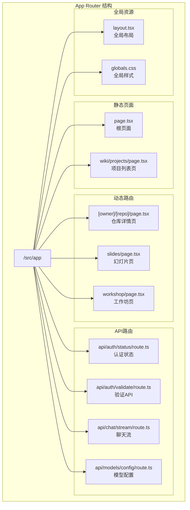

**图表来源**
- [layout.tsx](file://src/app/layout.tsx#L1-L51)
- [page.tsx](file://src/app/page.tsx#L1-L625)
- [wiki/projects/page.tsx](file://src/app/wiki/projects/page.tsx#L1-L19)

**章节来源**
- [layout.tsx](file://src/app/layout.tsx#L1-L51)
- [page.tsx](file://src/app/page.tsx#L1-L625)

## 全局布局系统

### layout.tsx的核心架构

layout.tsx是整个应用的根布局组件，负责定义全局样式、主题管理和元数据配置。

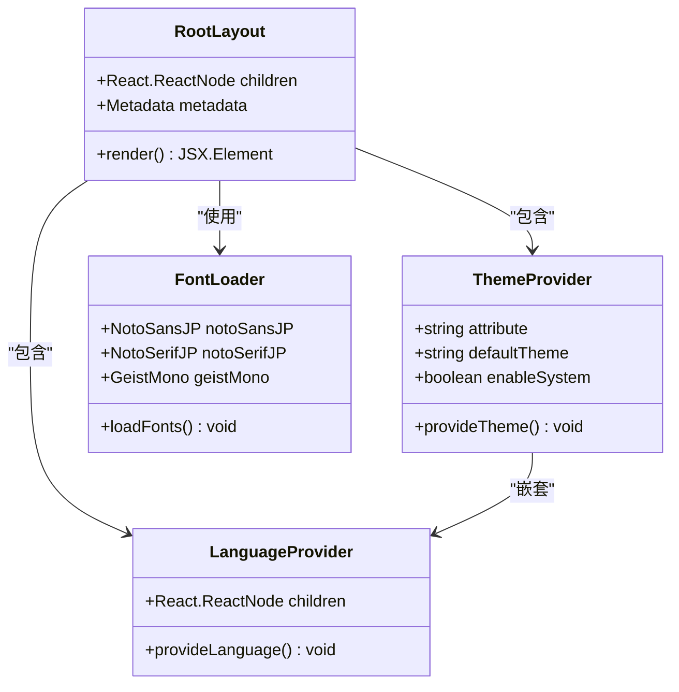

**图表来源**
- [layout.tsx](file://src/app/layout.tsx#L32-L50)

### 字体系统集成

应用集成了多种日文友好字体，确保在不同语言环境下的最佳显示效果：

- **Noto Sans JP**: 主要文本字体，提供清晰易读的字形
- **Noto Serif JP**: 衬线字体，用于标题和强调文本
- **Geist Mono**: 等宽字体，用于代码和技术内容

### 元数据配置

layout.tsx定义了应用的基本元数据，包括：
- 应用标题："Deepwiki Open Source | Sheing Ng"
- 描述信息："Created by Sheing Ng"
- 语言设置：默认英语（en）

**章节来源**
- [layout.tsx](file://src/app/layout.tsx#L27-L50)

## 根页面组件分析

### 组件架构设计

page.tsx作为应用的根页面组件，采用了复杂的状态管理和数据流控制机制。

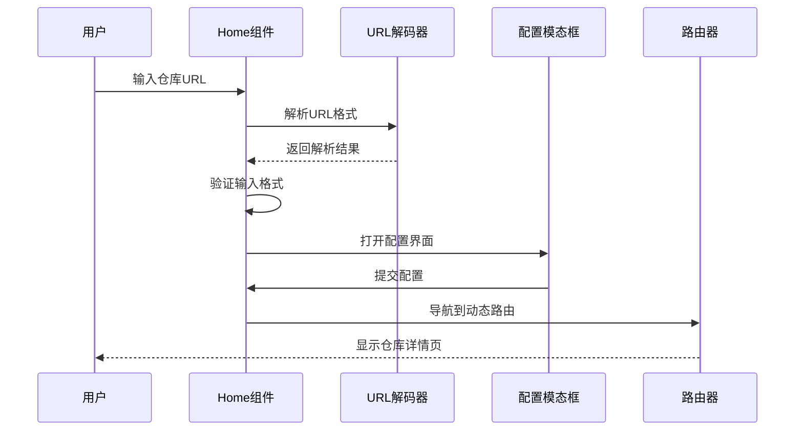

**图表来源**
- [page.tsx](file://src/app/page.tsx#L251-L389)

### 状态管理系统

Home组件维护了复杂的状态管理结构：

| 状态类型 | 描述 | 初始值 |
|---------|------|--------|
| repositoryInput | 用户输入的仓库URL | "https://github.com/AsyncFuncAI/deepwiki-open" |
| provider | AI提供商选择 | '' |
| model | 模型选择 | '' |
| isCustomModel | 是否使用自定义模型 | false |
| selectedLanguage | 选定的语言 | language |
| authRequired | 认证需求 | false |
| isSubmitting | 提交状态 | false |

### URL解析与验证

应用实现了强大的URL解析功能，支持多种输入格式：

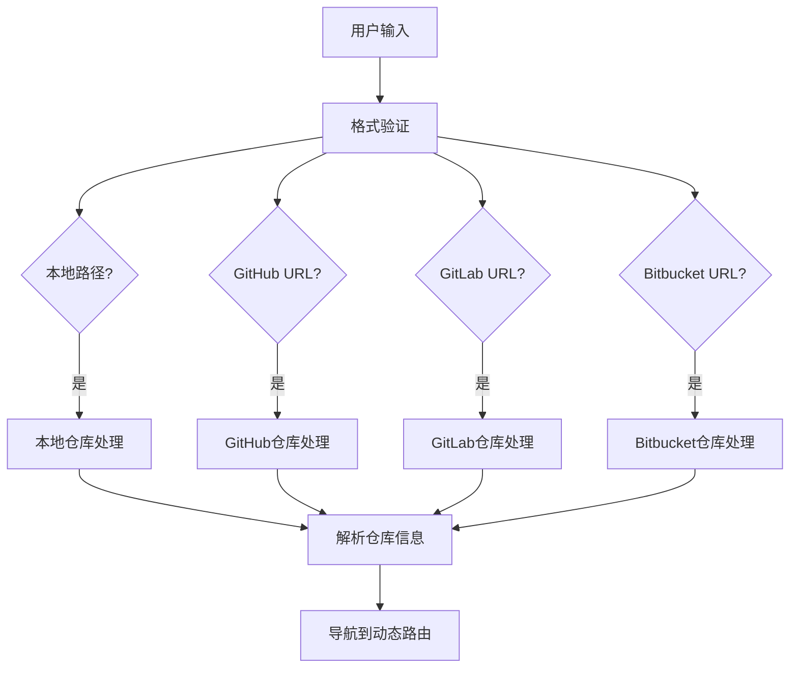

**图表来源**
- [page.tsx](file://src/app/page.tsx#L176-L246)

**章节来源**
- [page.tsx](file://src/app/page.tsx#L1-L625)

## 动态路由机制

### 路由参数处理

动态路由`[owner]/[repo]/page.tsx`展示了Next.js 15 App Router的强大功能，能够处理可变的路由参数。

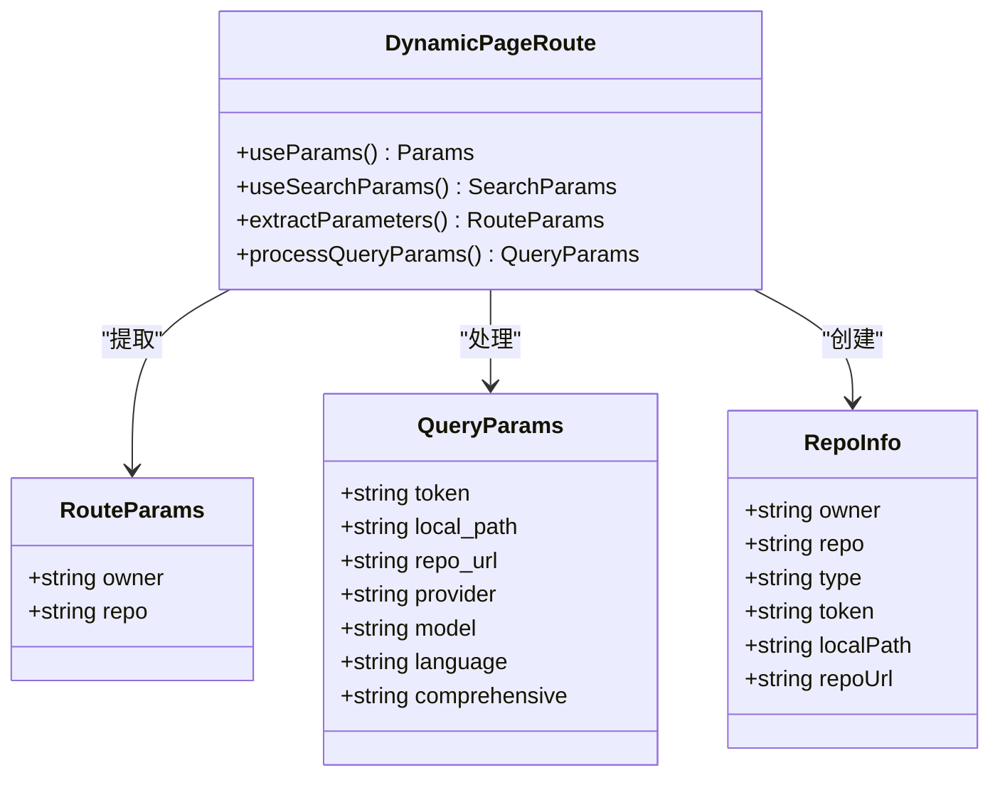

**图表来源**
- [page.tsx](file://src/app/[owner]/[repo]/page.tsx#L178-L210)
- [repoinfo.tsx](file://src/types/repoinfo.tsx#L1-L10)

### 参数解析流程

动态路由页面的参数解析遵循以下流程：

1. **路由参数提取**: 从URL中提取`owner`和`repo`参数
2. **查询参数处理**: 解析所有查询字符串参数
3. **仓库类型检测**: 根据域名自动识别仓库类型
4. **令牌验证**: 处理各种认证令牌
5. **配置合并**: 将查询参数与默认配置合并

### 缓存机制

应用实现了智能的缓存系统来提升性能：

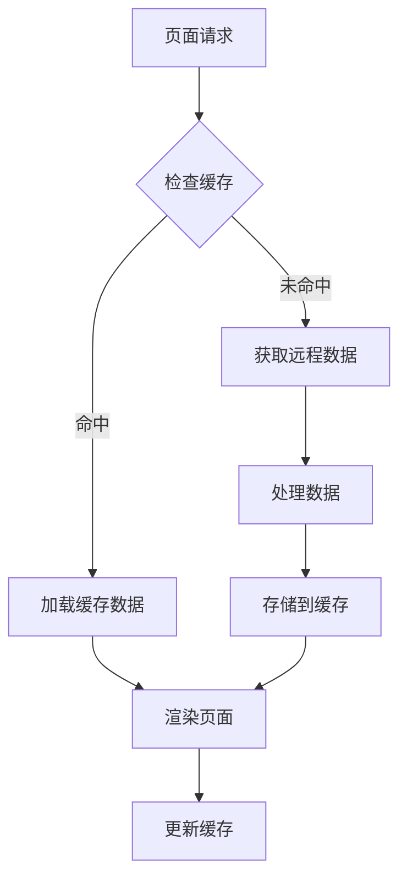

**图表来源**
- [page.tsx](file://src/app/[owner]/[repo]/page.tsx#L90-L138)

**章节来源**
- [page.tsx](file://src/app/[owner]/[repo]/page.tsx#L1-L800)

## 主题切换系统

### theme-toggle组件架构

theme-toggle组件提供了直观的主题切换功能，支持明暗两种模式。

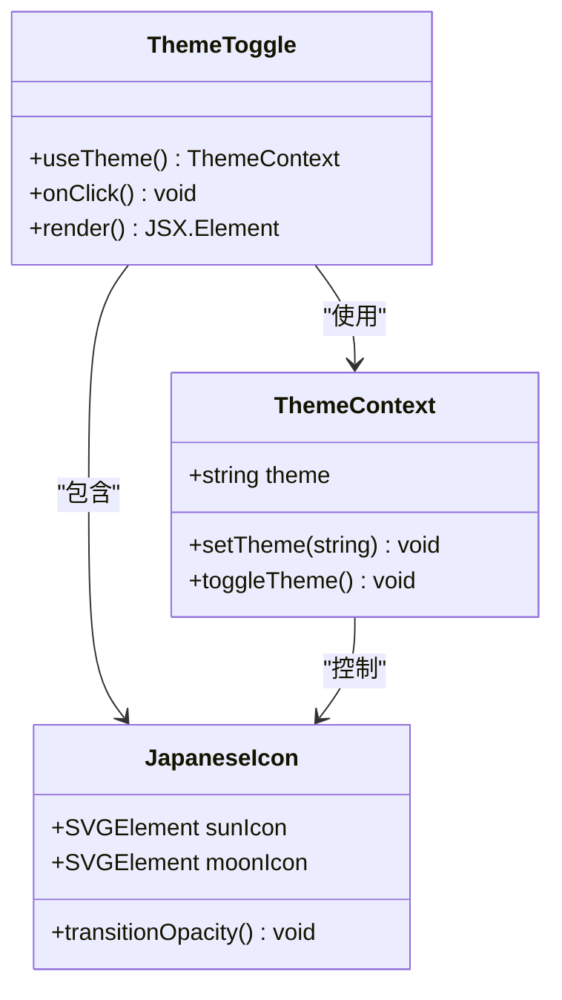

**图表来源**
- [theme-toggle.tsx](file://src/components/theme-toggle.tsx#L5-L49)

### 日本风格图标设计

主题切换按钮采用了独特的日本美学设计：

- **太阳图标**: 明亮模式的视觉象征
- **月亮图标**: 暗黑模式的视觉象征  
- **平滑过渡**: 使用CSS动画实现主题切换的流畅效果

### 深色/浅色主题实现

应用的主题系统基于CSS变量和data属性：

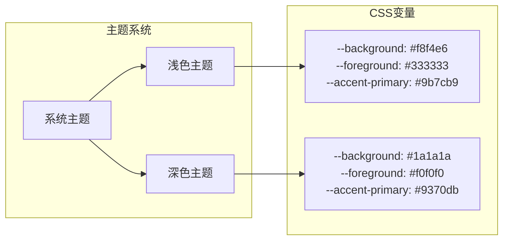

**图表来源**
- [globals.css](file://src/app/globals.css#L6-L32)

**章节来源**
- [theme-toggle.tsx](file://src/components/theme-toggle.tsx#L1-L50)
- [globals.css](file://src/app/globals.css#L1-L149)

## 国际化与语言管理

### LanguageContext架构

LanguageContext提供了全面的国际化支持，涵盖语言检测、消息加载和动态切换。

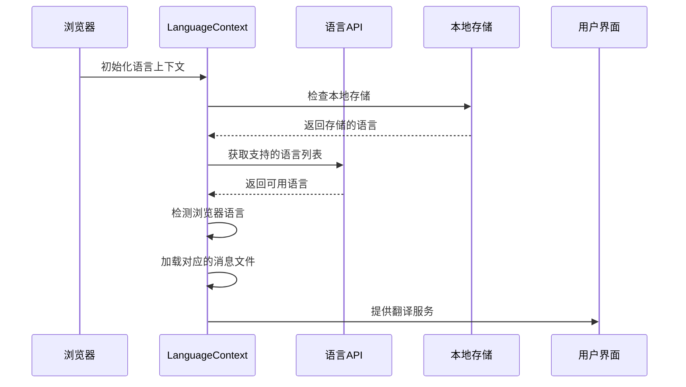

**图表来源**
- [LanguageContext.tsx](file://src/contexts/LanguageContext.tsx#L17-L202)

### 支持的语言范围

应用支持以下语言：

| 语言代码 | 语言名称 | 本地化程度 |
|---------|----------|-----------|
| en | 英语 | 完整 |
| ja | 日语 | 完整 |
| zh | 中文（简体） | 完整 |
| zh-tw | 中文（繁体） | 完整 |
| es | 西班牙语 | 完整 |
| kr | 韩语 | 完整 |
| vi | 越南语 | 完整 |
| pt-br | 巴西葡萄牙语 | 完整 |
| fr | 法语 | 完整 |
| ru | 俄语 | 完整 |

### 语言检测机制

语言检测遵循以下优先级：

1. **本地存储**: 用户上次选择的语言
2. **浏览器语言**: 自动检测浏览器首选语言
3. **默认语言**: 英语（en）

### 动态消息加载

应用实现了按需加载的消息文件机制：

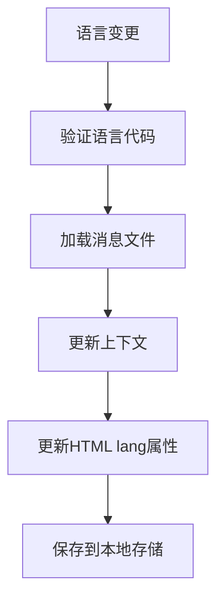

**图表来源**
- [LanguageContext.tsx](file://src/contexts/LanguageContext.tsx#L152-L176)

**章节来源**
- [LanguageContext.tsx](file://src/contexts/LanguageContext.tsx#L1-L203)

## API路由集成

### 认证API路由

应用的API路由系统提供了完整的认证和授权功能。

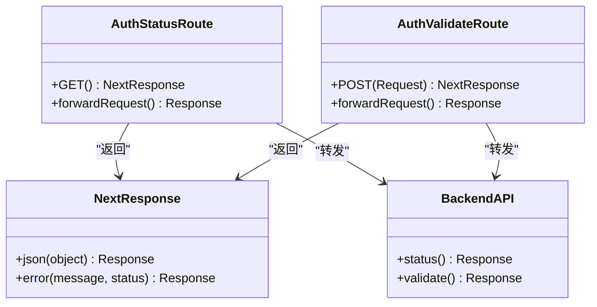

**图表来源**
- [auth/status/route.ts](file://src/app/api/auth/status/route.ts#L5-L31)
- [auth/validate/route.ts](file://src/app/api/auth/validate/route.ts#L5-L34)

### 路由重写配置

next.config.ts中的路由重写确保了前后端API的无缝集成：

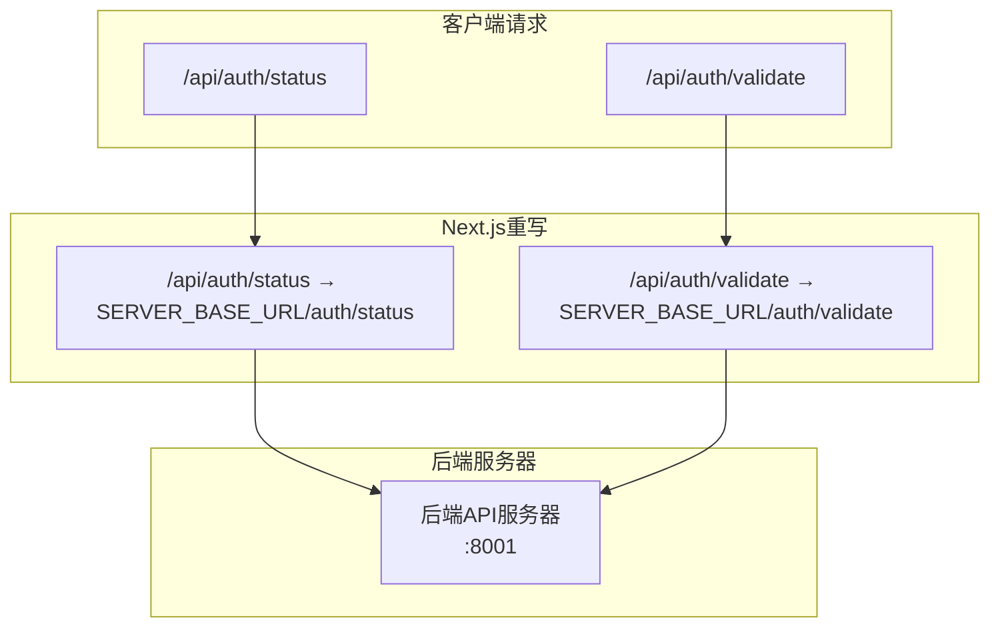

**图表来源**
- [next.config.ts](file://next.config.ts#L36-L66)

### 错误处理机制

API路由实现了统一的错误处理模式：

1. **请求转发**: 将客户端请求转发到后端服务器
2. **响应验证**: 检查后端响应的状态码
3. **错误包装**: 将后端错误转换为标准格式
4. **日志记录**: 记录所有API调用的错误信息

**章节来源**
- [auth/status/route.ts](file://src/app/api/auth/status/route.ts#L1-L32)
- [auth/validate/route.ts](file://src/app/api/auth/validate/route.ts#L1-L35)
- [next.config.ts](file://next.config.ts#L1-L71)

## 状态管理与数据流

### 数据获取模式

应用采用了多种数据获取模式来处理不同的数据需求：

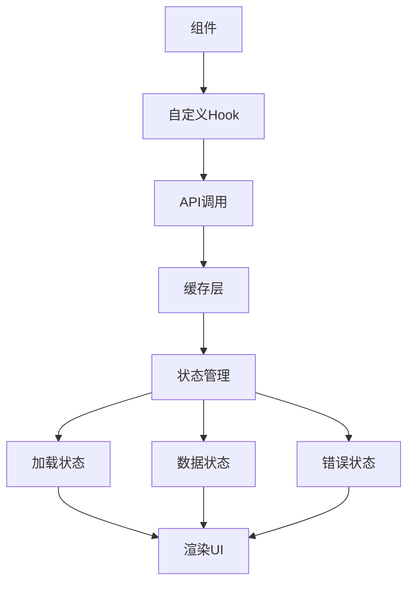

**图表来源**
- [useProcessedProjects.ts](file://src/hooks/useProcessedProjects.ts#L13-L46)

### 错误边界处理

应用实现了多层次的错误处理机制：

1. **组件级错误边界**: 防止单个组件的错误影响整个应用
2. **API错误处理**: 统一处理网络请求错误
3. **数据验证错误**: 在数据处理阶段捕获无效数据
4. **用户友好的错误提示**: 向用户提供清晰的错误信息

### 页面生命周期管理

动态路由页面的生命周期管理包括：

- **初始化阶段**: 参数解析和状态初始化
- **数据获取阶段**: 并发获取必要的数据
- **渲染阶段**: 基于数据状态渲染UI
- **交互阶段**: 处理用户交互和状态更新
- **清理阶段**: 清理资源和取消待处理的请求

**章节来源**
- [useProcessedProjects.ts](file://src/hooks/useProcessedProjects.ts#L1-L47)

## 性能优化策略

### 构建时优化

next.config.ts中包含了多项性能优化配置：

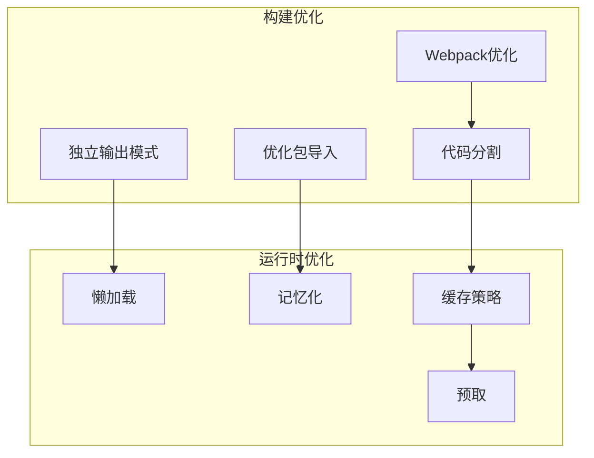

**图表来源**
- [next.config.ts](file://next.config.ts#L5-L35)

### 缓存策略

应用实现了多层缓存策略：

1. **浏览器缓存**: 利用HTTP缓存头控制资源缓存
2. **本地存储缓存**: 存储用户配置和语言设置
3. **内存缓存**: 在组件内部缓存计算结果
4. **服务器端缓存**: 后端API的响应缓存

### 代码分割

应用采用按需加载的代码分割策略：

- **路由级别的代码分割**: 不同路由组件独立打包
- **组件级别的代码分割**: 大型组件按需加载
- **依赖级别的代码分割**: 第三方库独立打包

**章节来源**
- [next.config.ts](file://next.config.ts#L1-L71)

## 总结

deepwiki-open的页面结构展现了Next.js 15 App Router的强大能力，通过精心设计的架构实现了：

### 核心优势

1. **模块化组织**: 清晰的文件系统路由结构
2. **状态管理**: 复杂的状态管理和数据流控制
3. **国际化支持**: 全面的多语言解决方案
4. **主题系统**: 直观且美观的主题切换功能
5. **性能优化**: 多层次的性能优化策略

### 架构特点

- **响应式设计**: 适应不同设备和屏幕尺寸
- **无障碍访问**: 遵循Web无障碍标准
- **SEO友好**: 完善的元数据和结构化内容
- **开发体验**: 类型安全和良好的开发工具支持

### 技术创新

- **动态路由**: 灵活的仓库URL处理机制
- **WebSocket集成**: 实时的数据流处理
- **智能缓存**: 多层缓存提升用户体验
- **错误边界**: 健壮的应用容错能力

这种页面结构不仅满足了当前的功能需求，还为未来的扩展和维护奠定了坚实的基础，体现了现代Web应用开发的最佳实践。