# 即时文档生成

<cite>
**本文档引用的文件**
- [data_pipeline.py](file://api/data_pipeline.py)
- [wikistructure.tsx](file://src/types/wiki/wikistructure.tsx)
- [wikipage.tsx](file://src/types/wiki/wikipage.tsx)
- [page.tsx](file://src/app/[owner]/[repo]/page.tsx)
- [WikiTreeView.tsx](file://src/components/WikiTreeView.tsx)
- [rag.py](file://api/rag.py)
- [prompts.py](file://api/prompts.py)
- [config.py](file://api/config.py)
- [websocket_wiki.py](file://api/websocket_wiki.py)
- [embedder.py](file://api/tools/embedder.py)
- [repo.json](file://api/config/repo.json)
</cite>

## 目录
1. [简介](#简介)
2. [系统架构概览](#系统架构概览)
3. [数据管道核心流程](#数据管道核心流程)
4. [文档结构生成](#文档结构生成)
5. [RAG检索增强生成](#rag检索增强生成)
6. [前端渲染与交互](#前端渲染与交互)
7. [配置与可扩展性](#配置与可扩展性)
8. [性能优化策略](#性能优化策略)
9. [故障排除指南](#故障排除指南)
10. [最佳实践建议](#最佳实践建议)

## 简介

即时文档生成系统是一个智能化的代码仓库文档自动化平台，能够从原始代码仓库自动生成结构化的维基页面。该系统结合了静态代码分析、AI理解和RAG（检索增强生成）机制，为开发者提供高质量的技术文档。

### 核心特性

- **自动代码解析**：智能识别README文件、配置文件和源码入口点
- **层次化文档结构**：基于仓库内容自动生成树状文档结构
- **多模态内容生成**：结合静态分析与AI理解生成摘要与说明
- **RAG增强生成**：利用上下文检索提升生成内容的质量
- **实时渲染**：支持WebSocket流式响应和动态内容更新
- **多语言支持**：支持多种自然语言的文档生成

## 系统架构概览

系统采用前后端分离架构，主要由以下核心组件构成：

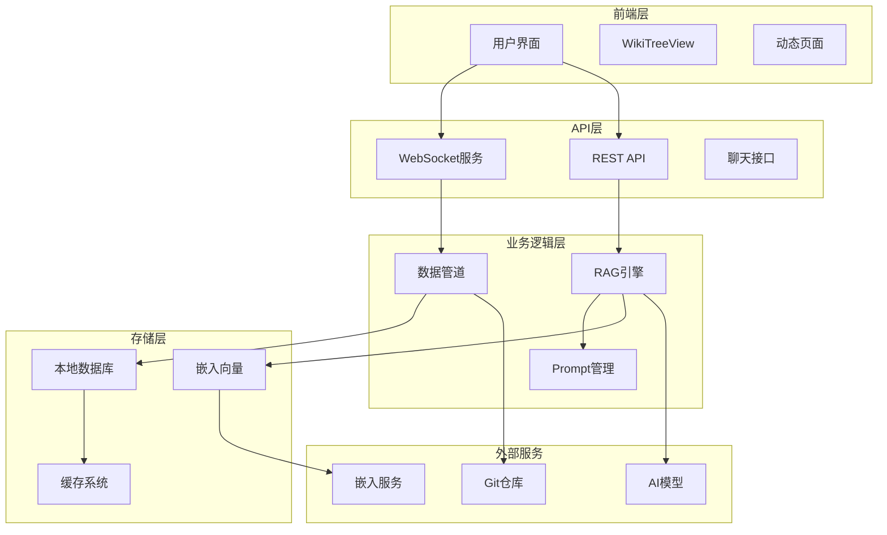

**图表来源**
- [page.tsx](file://src/app/[owner]/[repo]/page.tsx#L1-L50)
- [websocket_wiki.py](file://api/websocket_wiki.py#L1-L100)
- [data_pipeline.py](file://api/data_pipeline.py#L1-L100)

## 数据管道核心流程

### 仓库克隆与解析

数据管道的核心功能是处理代码仓库的完整生命周期，从克隆到文档生成：

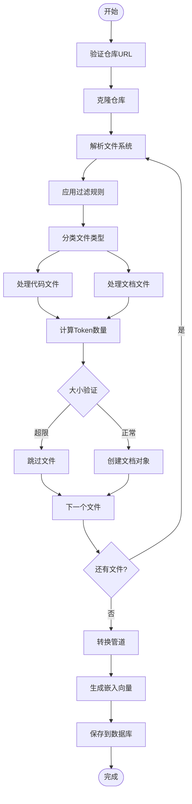

**图表来源**
- [data_pipeline.py](file://api/data_pipeline.py#L144-L371)

### 文件过滤与处理策略

系统实现了灵活的文件过滤机制，支持包含和排除模式：

| 过滤类型 | 默认行为 | 配置位置 | 示例 |
|---------|---------|---------|------|
| 排除目录 | 虚拟环境、版本控制、构建输出 | `DEFAULT_EXCLUDED_DIRS` | `.venv/`, `.git/`, `dist/` |
| 排除文件 | 锁文件、编译产物、临时文件 | `DEFAULT_EXCLUDED_FILES` | `*.lock`, `*.pyc`, `*.min.js` |
| 包含模式 | 仅处理指定目录和文件 | `included_dirs`, `included_files` | `src/`, `*.py` |
| 排除模式 | 排除指定目录和文件 | `excluded_dirs`, `excluded_files` | `tests/`, `*.test.js` |

**章节来源**
- [data_pipeline.py](file://api/data_pipeline.py#L144-L371)
- [repo.json](file://api/config/repo.json#L1-L129)

### 嵌入向量生成

系统支持多种嵌入向量生成器，根据配置自动选择合适的模型：

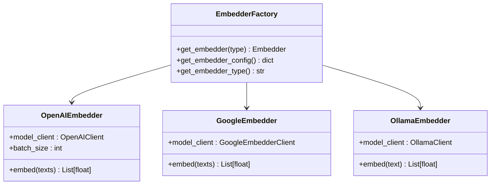

**图表来源**
- [embedder.py](file://api/tools/embedder.py#L1-L55)
- [config.py](file://api/config.py#L160-L227)

## 文档结构生成

### 维基结构定义

系统使用树状结构来组织文档内容，支持多层次的导航：

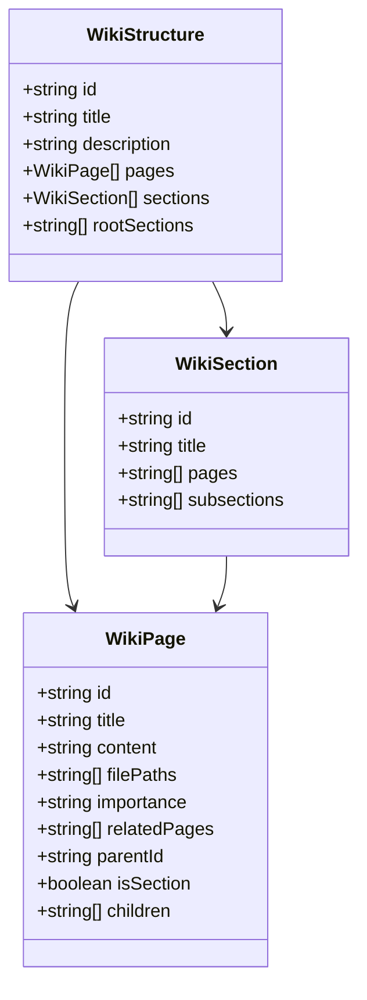

**图表来源**
- [wikistructure.tsx](file://src/types/wiki/wikistructure.tsx#L1-L11)
- [wikipage.tsx](file://src/types/wiki/wikipage.tsx#L1-L13)

### 结构生成算法

系统通过分析仓库内容自动生成合理的文档结构：

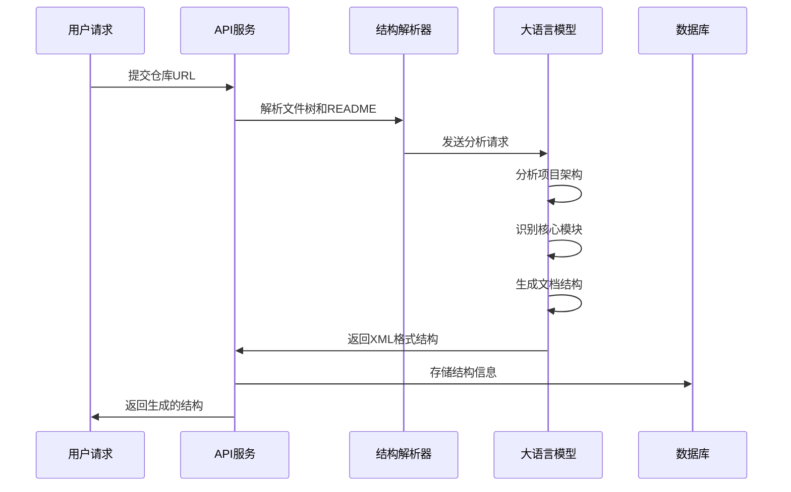

**图表来源**
- [page.tsx](file://src/app/[owner]/[repo]/page.tsx#L683-L1184)

### 内容生成策略

每个Wiki页面都遵循统一的生成模板，确保内容质量和一致性：

| 生成阶段 | 处理内容 | 输出格式 |
|---------|---------|---------|
| 引用文件 | 列出所有相关源文件 | `
`标签 |
| 主标题 | 自动生成H1标题 | `# 页面标题` |
| 引言部分 | 项目概述和目的 | 1-2段落 |
| 详细章节 | 架构、组件、数据流 | H2/H3标题 |
| 图表生成 | Mermaid图表 | 流程图、序列图 |
| 表格总结 | 关键特性、参数 | Markdown表格 |
| 代码片段 | 相关实现细节 | 代码块 |
| 源文件引用 | 具体出处标注 | `[文件名:行号]()` |

**章节来源**
- [page.tsx](file://src/app/[owner]/[repo]/page.tsx#L427-L520)

## RAG检索增强生成

### 检索机制

RAG系统通过语义相似度检索相关文档片段，为内容生成提供上下文支持：

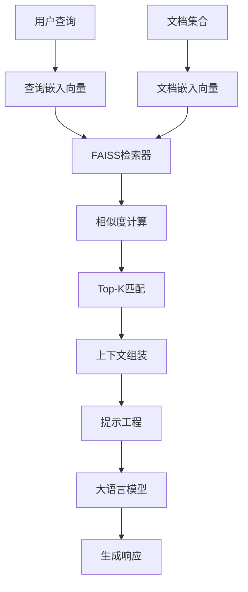

**图表来源**
- [rag.py](file://api/rag.py#L345-L446)

### 上下文融合策略

系统采用多层级的上下文融合机制：

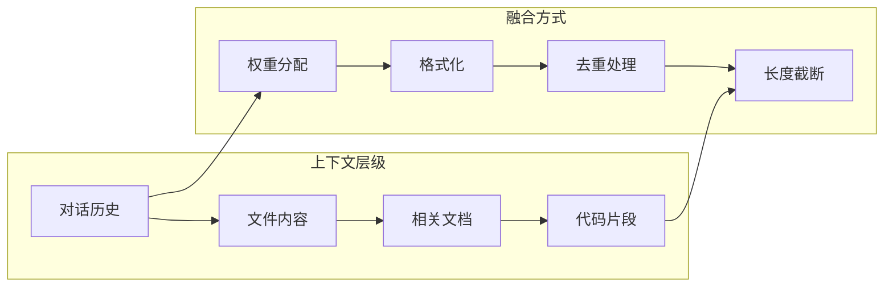

**图表来源**
- [rag.py](file://api/rag.py#L246-L344)

### 嵌入向量验证

为确保检索质量，系统实现了严格的嵌入向量验证机制：

| 验证项目 | 检查内容 | 处理方式 |
|---------|---------|---------|
| 向量维度 | 确保所有向量具有相同维度 | 过滤不匹配的向量 |
| 数值有效性 | 检查NaN、Inf等异常值 | 移除无效向量 |
| 批次一致性 | 验证批次内向量的一致性 | 重新计算或跳过 |
| 存储完整性 | 确保向量正确保存到数据库 | 数据恢复机制 |

**章节来源**
- [rag.py](file://api/rag.py#L251-L343)

## 前端渲染与交互

### 动态页面加载

前端采用React框架实现动态页面加载和状态管理：

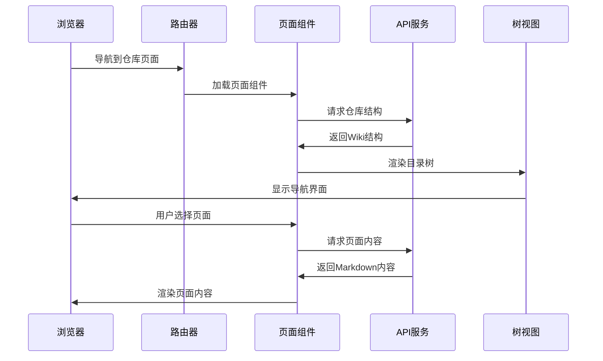

**图表来源**
- [page.tsx](file://src/app/[owner]/[repo]/page.tsx#L177-L270)

### 实时内容生成

系统支持WebSocket连接实现实时内容生成：

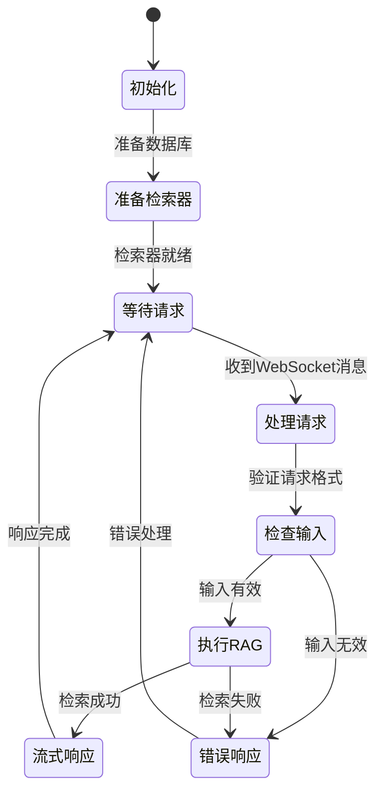

**图表来源**
- [websocket_wiki.py](file://api/websocket_wiki.py#L52-L770)

### 目录树可视化

WikiTreeView组件提供直观的导航体验：

| 功能特性 | 实现方式 | 用户体验 |
|---------|---------|---------|
| 层级展开 | 点击图标切换展开状态 | 渐进式信息展示 |
| 重要性标识 | 不同颜色标记页面重要性 | 视觉优先级引导 |
| 当前选中 | 高亮显示当前浏览页面 | 状态反馈 |
| 平铺模式 | 自动降级到平铺视图 | 兼容性保证 |
| 递归渲染 | 支持无限层级的子节结构 | 灵活的结构组织 |

**章节来源**
- [WikiTreeView.tsx](file://src/components/WikiTreeView.tsx#L1-L184)

## 配置与可扩展性

### 可配置参数

系统提供了丰富的配置选项，支持不同场景的需求：

| 配置类别 | 参数名称 | 默认值 | 说明 |
|---------|---------|-------|------|
| 文件过滤 | `excluded_dirs` | 多个虚拟环境目录 | 排除不需要处理的目录 |
| 文件过滤 | `excluded_files` | 多个锁文件和编译产物 | 排除不需要处理的文件类型 |
| 嵌入配置 | `embedder_type` | `openai` | 选择嵌入向量生成器 |
| 模型配置 | `max_size_mb` | 50000 | 仓库最大处理大小 |
| 语言支持 | `supported_languages` | 多种语言 | 支持的自然语言列表 |

**章节来源**
- [config.py](file://api/config.py#L262-L388)
- [repo.json](file://api/config/repo.json#L1-L129)

### 扩展接口

系统设计了清晰的扩展点，支持自定义功能：

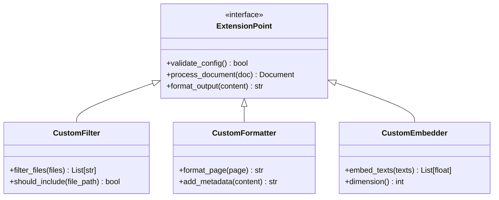

### 多仓库支持

系统支持同时处理多个仓库，实现资源共享：

| 特性 | 实现方式 | 性能影响 |
|-----|---------|---------|
| 缓存共享 | 全局嵌入向量缓存 | 减少重复计算 |
| 并发处理 | 异步任务队列 | 提高处理效率 |
| 资源隔离 | 独立的数据库实例 | 避免数据冲突 |
| 权限管理 | 基于URL的访问控制 | 安全性保障 |

## 性能优化策略

### 并发处理机制

系统采用多层级并发策略优化处理性能：

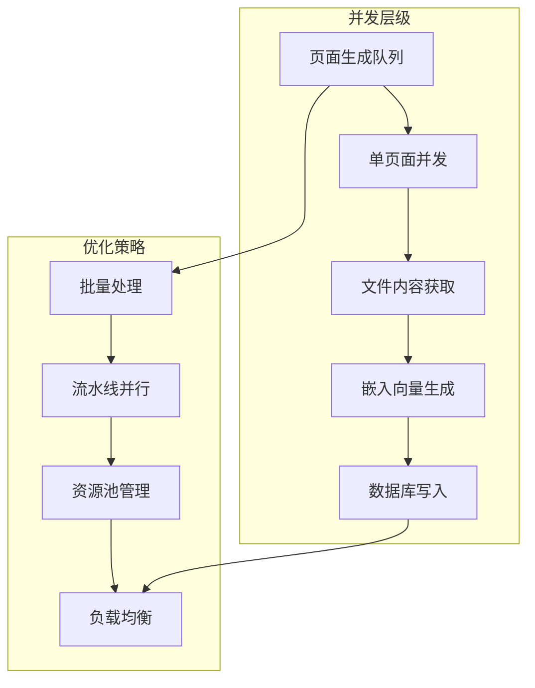

### 内存管理

针对大型仓库的内存优化：

| 优化技术 | 应用场景 | 效果 |
|---------|---------|------|
| 流式处理 | 大文件读取 | 降低内存占用 |
| 分页加载 | 大量文档处理 | 控制内存峰值 |
| 对象池 | 重复对象复用 | 减少GC压力 |
| 延迟加载 | 按需内容生成 | 提升响应速度 |

### 缓存策略

多层缓存机制提升系统响应性能：

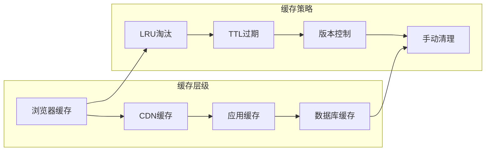

## 故障排除指南

### 常见问题诊断

#### 生成失败排查步骤

1. **网络连接检查**
   - 验证Git仓库访问权限
   - 检查API密钥配置
   - 确认网络代理设置

2. **权限问题诊断**
   - 验证仓库访问令牌
   - 检查文件系统权限
   - 确认数据库写入权限

3. **API密钥验证**
   - 检查环境变量设置
   - 验证API配额限制
   - 确认模型可用性

#### 大型仓库处理

对于超过50MB的仓库，系统采用分批处理策略：

| 处理阶段 | 时间估算 | 优化建议 |
|---------|---------|---------|
| 仓库克隆 | 1-5分钟 | 使用浅克隆减少数据量 |
| 文件扫描 | 30秒-2分钟 | 并行处理提高效率 |
| 嵌入生成 | 2-10分钟 | 分批处理避免内存溢出 |
| 结构生成 | 1-3分钟 | 缓存中间结果 |

### 错误恢复机制

系统实现了完善的错误恢复机制：

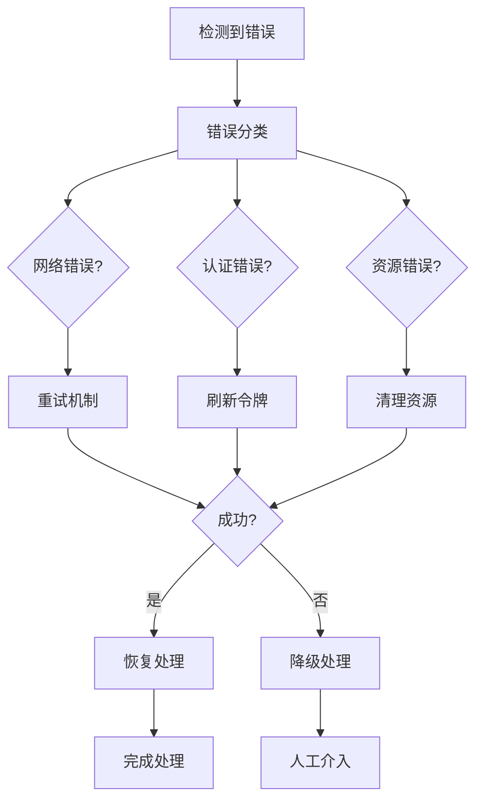

### 性能监控指标

关键性能指标监控：

| 指标名称 | 正常范围 | 告警阈值 | 监控方法 |
|---------|---------|---------|---------|
| 处理时间 | 1-10分钟 | >30分钟 | 日志记录 |
| 内存使用 | <2GB | >4GB | 系统监控 |
| API调用 | <1000/小时 | >5000/小时 | 计数器 |
| 错误率 | <1% | >5% | 错误统计 |

## 最佳实践建议

### 仓库准备

在提交仓库进行文档生成前的最佳实践：

1. **代码组织**
   - 确保代码结构清晰，有明确的模块划分
   - 添加适当的注释和文档字符串
   - 保持README文件的完整性

2. **文件过滤**
   - 在配置中排除不必要的文件类型
   - 使用包含模式专注于核心代码
   - 避免包含测试代码和示例文件

3. **权限设置**
   - 使用公共仓库或配置正确的访问令牌
   - 确保网络连接稳定
   - 预先测试API密钥的有效性

### 内容质量优化

为了获得最佳的文档生成效果：

1. **提示词优化**
   - 提供具体的查询需求
   - 明确期望的文档结构
   - 指定目标读者群体

2. **上下文丰富**
   - 包含相关的背景信息
   - 提供具体的使用场景
   - 指明关注的重点领域

3. **迭代改进**
   - 根据生成结果调整过滤规则
   - 优化嵌入向量模型选择
   - 调整生成参数配置

### 维护与升级

系统的持续维护建议：

1. **定期更新**
   - 更新AI模型版本
   - 升级依赖包版本
   - 优化配置参数

2. **监控告警**
   - 设置关键指标监控
   - 建立错误报告机制
   - 定期性能评估

3. **用户反馈**
   - 收集用户使用体验
   - 分析文档质量指标
   - 持续改进生成算法

通过遵循这些最佳实践，可以最大化即时文档生成系统的价值，为团队提供高质量的技术文档支持。