# 可视化图表

<cite>
**本文档中引用的文件**
- [Mermaid.tsx](file://src/components/Mermaid.tsx)
- [Markdown.tsx](file://src/components/Markdown.tsx)
- [prompts.py](file://api/prompts.py)
- [page.tsx](file://src/app/page.tsx)
- [page.tsx](file://src/app/[owner]/[repo]/page.tsx)
- [package-lock.json](file://package-lock.json)
</cite>

## 目录
1. [简介](#简介)
2. [系统架构概览](#系统架构概览)
3. [核心组件分析](#核心组件分析)
4. [Mermaid.tsx组件详解](#mermaidtsx组件详解)
5. [提示词模板系统](#提示词模板系统)
6. [图表类型与语法规范](#图表类型与语法规范)
7. [错误处理机制](#错误处理机制)
8. [自定义选项与配置](#自定义选项与配置)
9. [典型应用场景](#典型应用场景)
10. [最佳实践与性能优化](#最佳实践与性能优化)
11. [故障排除指南](#故障排除指南)
12. [总结](#总结)

## 简介

DeepWiki系统中的可视化图表功能是一个强大的代码分析和展示工具，它能够将复杂的代码结构和AI生成内容转化为直观的Mermaid格式交互式图表。该系统通过智能的提示词模板引导大型语言模型（LLM）输出符合Mermaid语法的图表代码，然后利用mermaid.js库在浏览器中实时渲染为高质量的SVG图形。

这一功能的核心价值在于：
- **自动化图表生成**：从代码分析结果自动生成架构图、流程图等可视化内容
- **实时渲染体验**：在浏览器中即时渲染复杂的图表，支持交互操作
- **多类型图表支持**：涵盖流程图、序列图、类图、实体关系图等多种图表类型
- **智能错误处理**：当AI输出无效语法时提供优雅的降级显示方案
- **主题适配能力**：支持日式美学风格和深色模式切换

## 系统架构概览

可视化图表功能采用分层架构设计，确保各组件职责清晰、耦合度低：

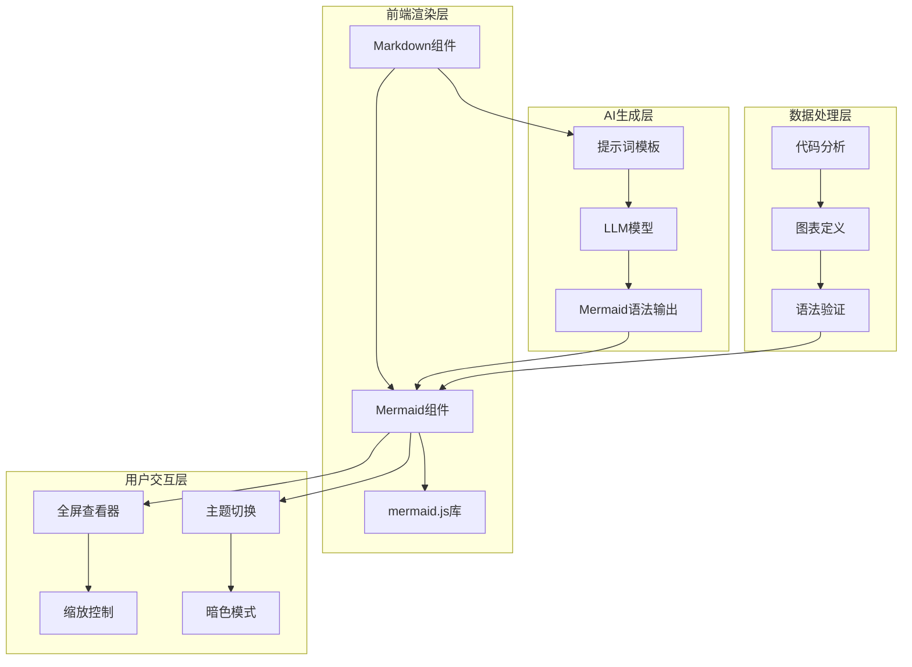
```mermaid
graph TB
subgraph "前端渲染层"
A[Markdown组件] --> B[Mermaid组件]
B --> C[mermaid.js库]
end
subgraph "AI生成层"
D[提示词模板] --> E[LLM模型]
E --> F[Mermaid语法输出]
end
subgraph "数据处理层"
G[代码分析] --> H[图表定义]
H --> I[语法验证]
end
A --> D
F --> B
I --> B
subgraph "用户交互层"
J[全屏查看器] --> K[缩放控制]
L[主题切换] --> M[暗色模式]
end
B --> J
B --> L
```

**图表来源**
- [Mermaid.tsx](file://src/components/Mermaid.tsx#L1-L491)
- [Markdown.tsx](file://src/components/Markdown.tsx#L1-L208)

## 核心组件分析

### 组件层次结构

可视化图表系统由以下核心组件构成：

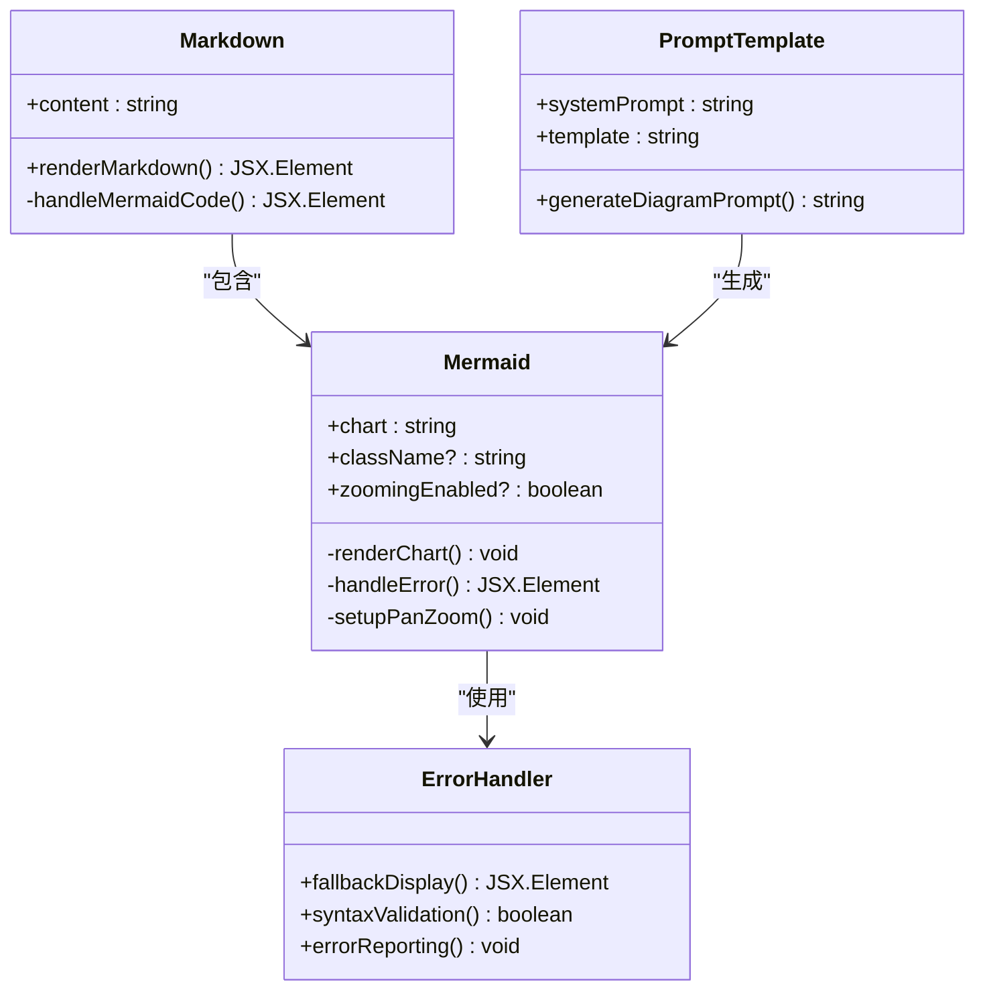
```mermaid
classDiagram
class Markdown {
+content : string
+renderMarkdown() JSX.Element
-handleMermaidCode() JSX.Element
}
class Mermaid {
+chart : string
+className? : string
+zoomingEnabled? : boolean
-renderChart() void
-handleError() JSX.Element
-setupPanZoom() void
}
class PromptTemplate {
+systemPrompt : string
+template : string
+generateDiagramPrompt() string
}
class ErrorHandler {
+fallbackDisplay() JSX.Element
+syntaxValidation() boolean
+errorReporting() void
}
Markdown --> Mermaid : "包含"
Mermaid --> ErrorHandler : "使用"
PromptTemplate --> Mermaid : "生成"
```

**图表来源**
- [Markdown.tsx](file://src/components/Markdown.tsx#L1-L208)
- [Mermaid.tsx](file://src/components/Mermaid.tsx#L172-L491)
- [prompts.py](file://api/prompts.py#L1-L192)

**章节来源**
- [Markdown.tsx](file://src/components/Markdown.tsx#L1-L208)
- [Mermaid.tsx](file://src/components/Mermaid.tsx#L1-L491)

## Mermaid.tsx组件详解

### 核心功能实现

Mermaid组件是整个图表渲染系统的核心，负责接收文本形式的图表定义并将其渲染为交互式SVG图形：

#### 初始化配置

组件初始化时设置了丰富的配置选项，确保图表具有良好的视觉效果和用户体验：

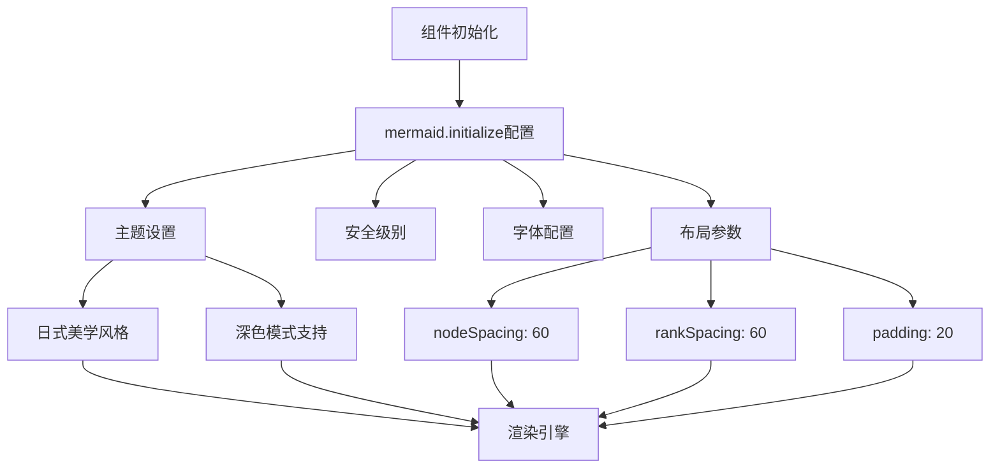
```mermaid
flowchart TD
A[组件初始化] --> B[mermaid.initialize配置]
B --> C[主题设置]
B --> D[安全级别]
B --> E[字体配置]
B --> F[布局参数]
C --> G[日式美学风格]
C --> H[深色模式支持]
F --> I[nodeSpacing: 60]
F --> J[rankSpacing: 60]
F --> K[padding: 20]
G --> L[渲染引擎]
H --> L
I --> L
J --> L
K --> L
```

**图表来源**
- [Mermaid.tsx](file://src/components/Mermaid.tsx#L5-L170)

#### 渲染流程

图表渲染采用异步处理机制，确保组件的响应性和稳定性：

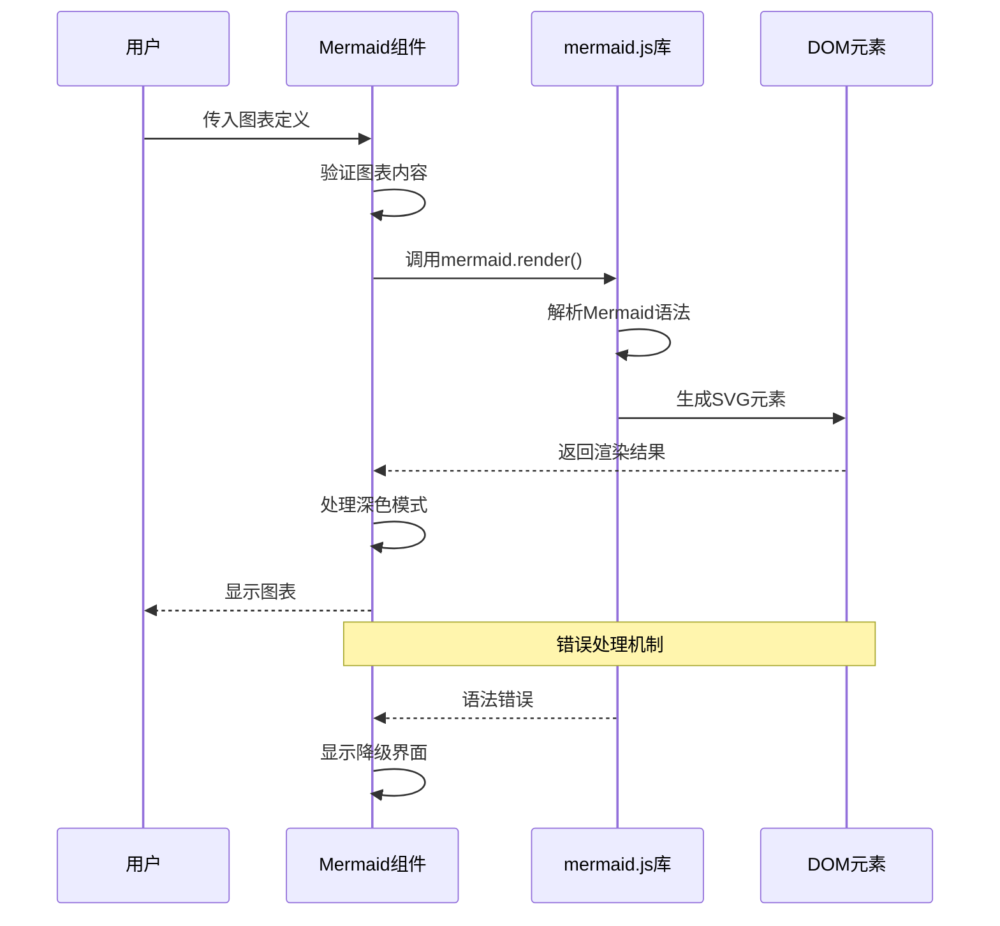
```mermaid
sequenceDiagram
participant User as 用户
participant Component as Mermaid组件
participant MermaidLib as mermaid.js库
participant DOM as DOM元素
User->>Component : 传入图表定义
Component->>Component : 验证图表内容
Component->>MermaidLib : 调用mermaid.render()
MermaidLib->>MermaidLib : 解析Mermaid语法
MermaidLib->>DOM : 生成SVG元素
DOM-->>Component : 返回渲染结果
Component->>Component : 处理深色模式
Component-->>User : 显示图表
Note over Component,DOM : 错误处理机制
MermaidLib-->>Component : 语法错误
Component->>Component : 显示降级界面
```

**图表来源**
- [Mermaid.tsx](file://src/components/Mermaid.tsx#L368-L400)

#### 交互功能

组件提供了丰富的交互功能，包括缩放、全屏查看和主题切换：

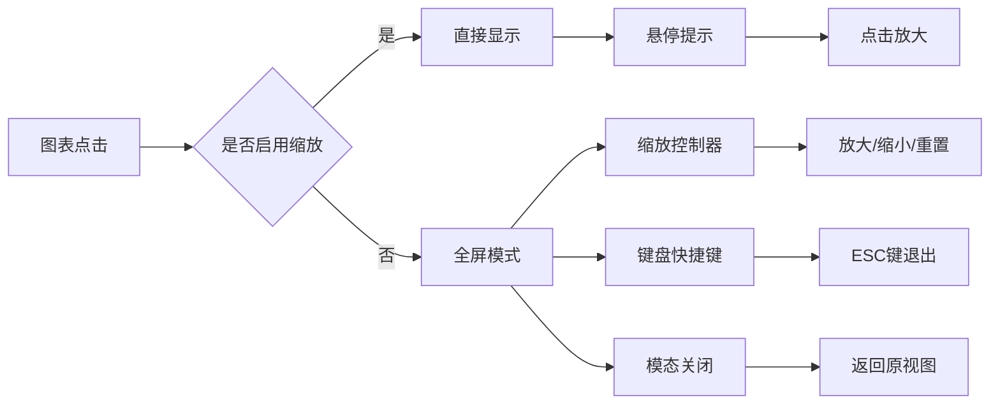
```mermaid
graph LR
A[图表点击] --> B{是否启用缩放}
B --> |是| C[直接显示]
B --> |否| D[全屏模式]
D --> E[缩放控制器]
D --> F[键盘快捷键]
D --> G[模态关闭]
E --> H[放大/缩小/重置]
F --> I[ESC键退出]
G --> J[返回原视图]
C --> K[悬停提示]
K --> L[点击放大]
```

**图表来源**
- [Mermaid.tsx](file://src/components/Mermaid.tsx#L409-L486)

**章节来源**
- [Mermaid.tsx](file://src/components/Mermaid.tsx#L1-L491)

## 提示词模板系统

### 设计原则

提示词模板系统是AI生成图表内容的关键，它通过精心设计的指令引导LLM输出符合Mermaid语法的图表代码：

#### 模板结构

系统采用多层次的提示词模板，针对不同的使用场景提供专门化的指导：

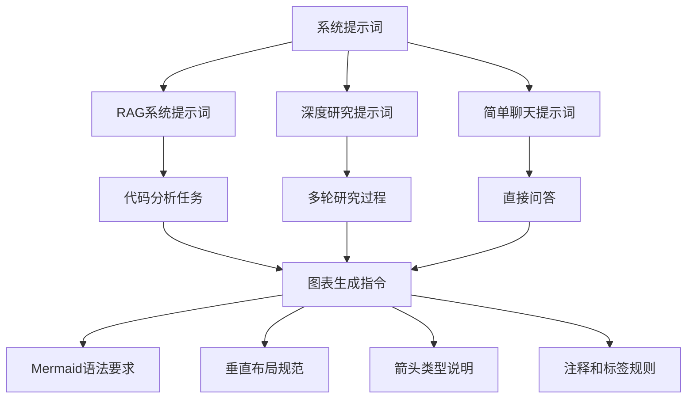
```mermaid
flowchart TD
A[系统提示词] --> B[RAG系统提示词]
A --> C[深度研究提示词]
A --> D[简单聊天提示词]
B --> E[代码分析任务]
C --> F[多轮研究过程]
D --> G[直接问答]
E --> H[图表生成指令]
F --> H
G --> H
H --> I[Mermaid语法要求]
H --> J[垂直布局规范]
H --> K[箭头类型说明]
H --> L[注释和标签规则]
```

**图表来源**
- [prompts.py](file://api/prompts.py#L1-L192)

#### 图表生成指令

在代码分析过程中，系统会生成专门的图表生成提示词：

| 指令类型 | 描述 | 示例 |
|---------|------|------|
| 流程图指令 | 使用`flowchart TD`创建垂直流程图 | `flowchart TD` |
| 序列图指令 | 使用`sequenceDiagram`创建交互序列 | `sequenceDiagram` |
| 类图指令 | 使用`classDiagram`创建类关系图 | `classDiagram` |
| 实体关系图 | 使用`erDiagram`创建数据库关系图 | `erDiagram` |
| 垂直布局要求 | 强制使用顶部到底部的布局方向 | `graph TD` |
| 节点宽度限制 | 单个节点最大宽度为3-4个单词 | `最大节点宽度: 3-4字` |

#### 语法规范要求

系统对AI输出的Mermaid语法有严格的要求：

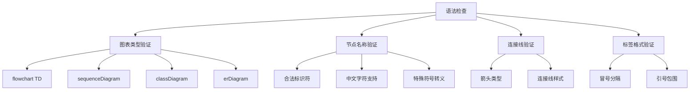
```mermaid
graph TD
A[语法检查] --> B[图表类型验证]
A --> C[节点名称验证]
A --> D[连接线验证]
A --> E[标签格式验证]
B --> F[flowchart TD]
B --> G[sequenceDiagram]
B --> H[classDiagram]
B --> I[erDiagram]
C --> J[合法标识符]
C --> K[中文字符支持]
C --> L[特殊符号转义]
D --> M[箭头类型]
D --> N[连接线样式]
E --> O[冒号分隔]
E --> P[引号包围]
```

**图表来源**
- [page.tsx](file://src/app/[owner]/[repo]/page.tsx#L450-L484)

**章节来源**
- [prompts.py](file://api/prompts.py#L1-L192)
- [page.tsx](file://src/app/[owner]/[repo]/page.tsx#L450-L484)

## 图表类型与语法规范

### 支持的图表类型

系统支持多种类型的Mermaid图表，每种都有其特定的应用场景和语法规则：

#### 流程图（Flowchart）

流程图是最常用的图表类型，用于展示系统的处理流程和决策路径：

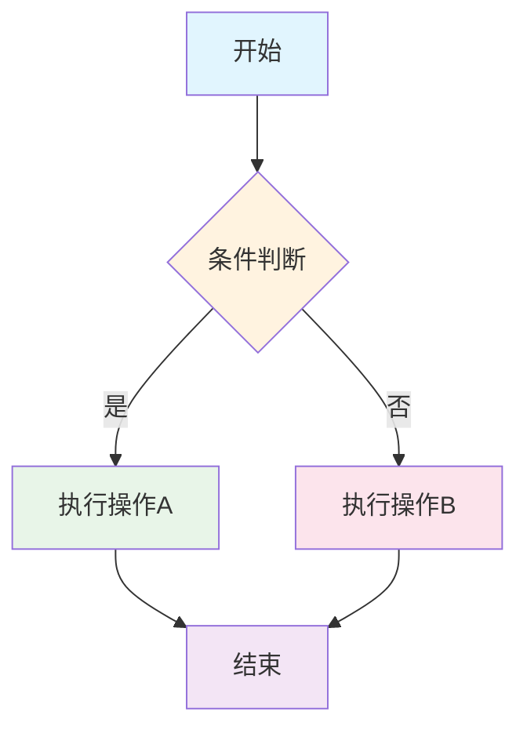
```mermaid
flowchart TD
A[开始] --> B{条件判断}
B --> |是| C[执行操作A]
B --> |否| D[执行操作B]
C --> E[结束]
D --> E
style A fill:#e1f5fe
style B fill:#fff3e0
style C fill:#e8f5e8
style D fill:#fce4ec
style E fill:#f3e5f5
```

#### 序列图（Sequence Diagram）

序列图用于展示对象之间的交互顺序和消息传递：

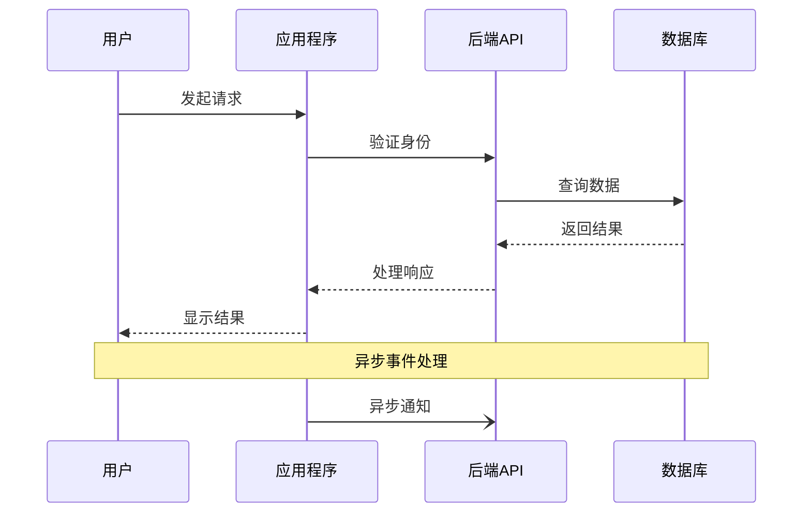
```mermaid
sequenceDiagram
participant User as 用户
participant App as 应用程序
participant API as 后端API
participant DB as 数据库
User->>App : 发起请求
App->>API : 验证身份
API->>DB : 查询数据
DB-->>API : 返回结果
API-->>App : 处理响应
App-->>User : 显示结果
Note over User,DB : 异步事件处理
App-)API : 异步通知
```

#### 类图（Class Diagram）

类图用于展示面向对象系统中的类、接口及其关系：

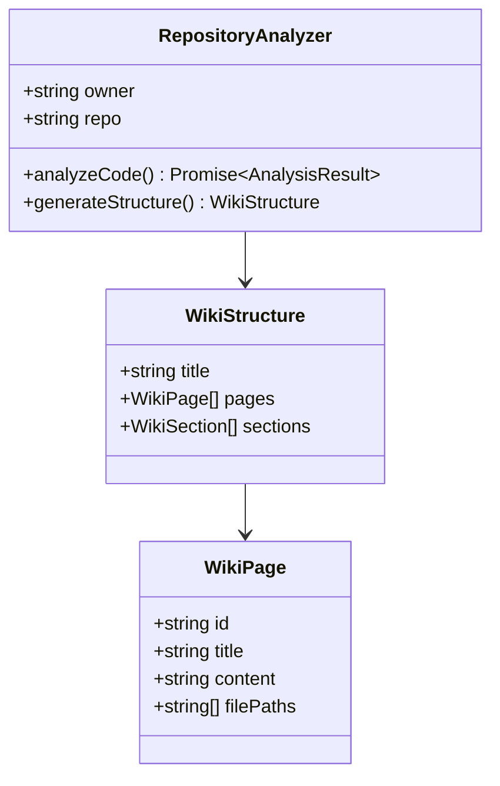
```mermaid
classDiagram
class RepositoryAnalyzer {
+string owner
+string repo
+analyzeCode() Promise~AnalysisResult~
+generateStructure() WikiStructure
}
class WikiStructure {
+string title
+WikiPage[] pages
+WikiSection[] sections
}
class WikiPage {
+string id
+string title
+string content
+string[] filePaths
}
RepositoryAnalyzer --> WikiStructure
WikiStructure --> WikiPage
```

#### 实体关系图（Entity Relationship Diagram）

实体关系图用于展示数据库中的表结构和关系：

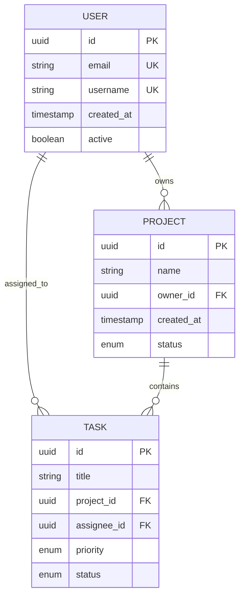
```mermaid
erDiagram
USER {
uuid id PK
string email UK
string username UK
timestamp created_at
boolean active
}
PROJECT {
uuid id PK
string name
uuid owner_id FK
timestamp created_at
enum status
}
TASK {
uuid id PK
string title
uuid project_id FK
uuid assignee_id FK
enum priority
enum status
}
USER ||--o{ PROJECT : owns
USER ||--o{ TASK : assigned_to
PROJECT ||--o{ TASK : contains
```

### 语法规范详解

#### 基本语法规则

| 规则类别 | 具体要求 | 示例 |
|---------|----------|------|
| 图表声明 | 必须以图表类型开头 | `flowchart TD` |
| 节点定义 | 使用方括号包围节点名称 | `A[开始]` |
| 连接线 | 使用`-->`或`->>`表示连接 | `A --> B` |
| 注释 | 使用`%%`添加注释 | `%% 这是注释` |
| 样式定义 | 使用`style`关键字设置样式 | `style A fill:#color` |

#### 箭头类型规范

系统支持多种箭头类型，每种都有特定的语义：

```mermaid
graph LR
A[请求] --> |同步| B[处理]
A -.->|异步| C[通知]
A x->|失败| D[错误]
A )--|回调| E[响应]
style A fill:#ff9999
style B fill:#99ff99
style C fill:#99ccff
style D fill:#ffcc99
style E fill:#cccccc
```

#### 布局方向要求

系统强制要求所有图表使用垂直布局（顶部到底部），这是为了保持一致的视觉体验：

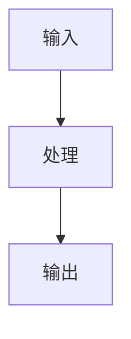
```mermaid
flowchart TD
%% 正确：垂直布局
A[输入] --> B[处理]
B --> C[输出]
%% 错误：水平布局被禁止
%% A --> B
%% B --> C
```

**章节来源**
- [page.tsx](file://src/app/[owner]/[repo]/page.tsx#L450-L484)

## 错误处理机制

### 多层错误防护

系统实现了完善的错误处理机制，确保即使在AI输出无效Mermaid语法的情况下也能提供良好的用户体验：

#### 渲染错误检测

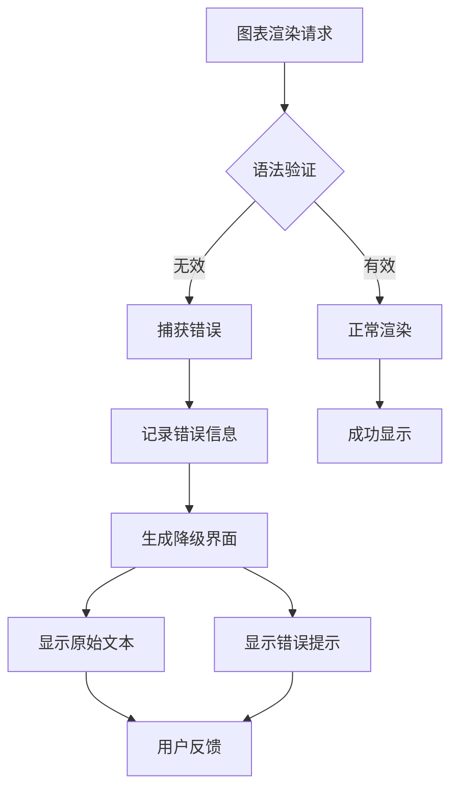
```mermaid
flowchart TD
A[图表渲染请求] --> B{语法验证}
B --> |有效| C[正常渲染]
B --> |无效| D[捕获错误]
D --> E[记录错误信息]
E --> F[生成降级界面]
F --> G[显示原始文本]
F --> H[显示错误提示]
C --> I[成功显示]
G --> J[用户反馈]
H --> J
```

**图表来源**
- [Mermaid.tsx](file://src/components/Mermaid.tsx#L384-L400)

#### 降级显示方案

当图表渲染失败时，系统提供两种降级显示方案：

1. **原始文本显示**：显示AI生成的原始Mermaid代码，便于调试
2. **错误提示界面**：提供友好的错误信息和解决方案建议

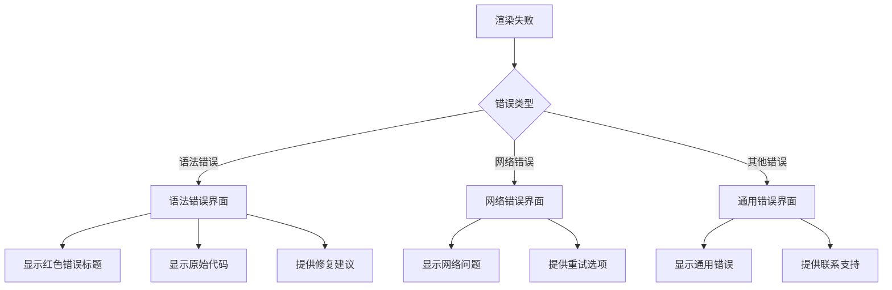
```mermaid
graph TB
A[渲染失败] --> B{错误类型}
B --> |语法错误| C[语法错误界面]
B --> |网络错误| D[网络错误界面]
B --> |其他错误| E[通用错误界面]
C --> F[显示红色错误标题]
C --> G[显示原始代码]
C --> H[提供修复建议]
D --> I[显示网络问题]
D --> J[提供重试选项]
E --> K[显示通用错误]
E --> L[提供联系支持]
```

**图表来源**
- [Mermaid.tsx](file://src/components/Mermaid.tsx#L390-L400)

#### 错误恢复机制

系统具备自动错误恢复能力，能够在检测到问题后尝试重新渲染：

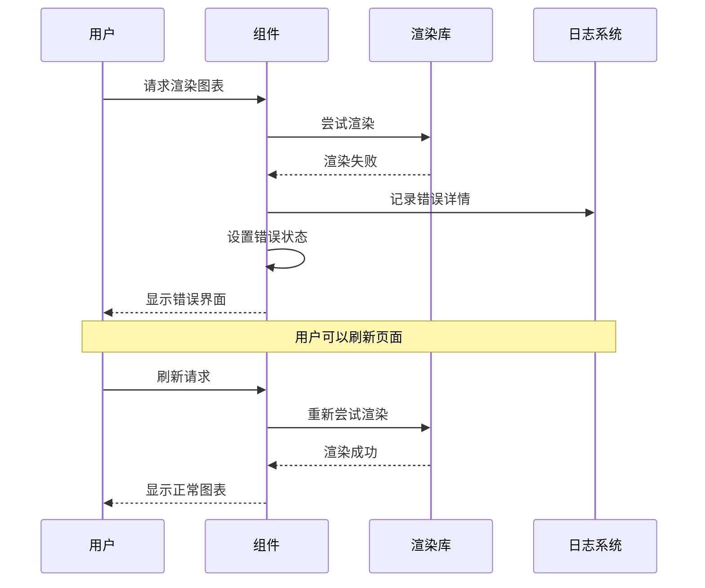
```mermaid
sequenceDiagram
participant User as 用户
participant Component as 组件
participant MermaidLib as 渲染库
participant Logger as 日志系统
User->>Component : 请求渲染图表
Component->>MermaidLib : 尝试渲染
MermaidLib-->>Component : 渲染失败
Component->>Logger : 记录错误详情
Component->>Component : 设置错误状态
Component-->>User : 显示错误界面
Note over User,Logger : 用户可以刷新页面
User->>Component : 刷新请求
Component->>MermaidLib : 重新尝试渲染
MermaidLib-->>Component : 渲染成功
Component-->>User : 显示正常图表
```

**图表来源**
- [Mermaid.tsx](file://src/components/Mermaid.tsx#L368-L400)

**章节来源**
- [Mermaid.tsx](file://src/components/Mermaid.tsx#L384-L432)

## 自定义选项与配置

### 主题系统

系统提供了丰富的主题定制选项，支持日式美学风格和深色模式：

#### 日式美学风格

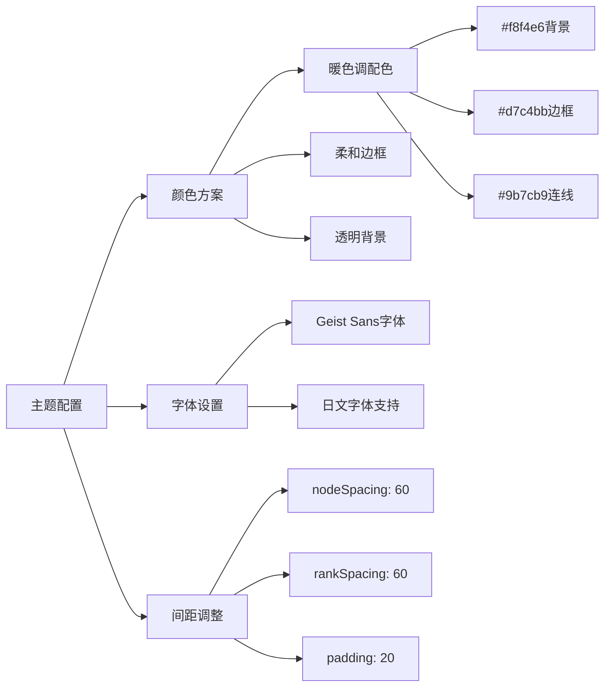
```mermaid
graph LR
A[主题配置] --> B[颜色方案]
A --> C[字体设置]
A --> D[间距调整]
B --> E[暖色调配色]
B --> F[柔和边框]
B --> G[透明背景]
E --> H[#f8f4e6背景]
E --> I[#d7c4bb边框]
E --> J[#9b7cb9连线]
C --> K[Geist Sans字体]
C --> L[日文字体支持]
D --> M[nodeSpacing: 60]
D --> N[rankSpacing: 60]
D --> O[padding: 20]
```

**图表来源**
- [Mermaid.tsx](file://src/components/Mermaid.tsx#L21-L167)

#### 深色模式支持

系统自动检测用户的深色模式偏好，并相应调整图表外观：

```mermaid
flowchart TD
A[用户偏好检测] --> B{深色模式?}
B --> |是| C[应用深色主题]
B --> |否| D[应用浅色主题]
C --> E[深色背景]
C --> F[深色文字]
C --> G[对比增强]
D --> H[浅色背景]
D --> I[深色文字]
D --> J[标准对比]
E --> K[SVG属性:data-theme="dark"]
F --> K
G --> K
```

**图表来源**
- [Mermaid.tsx](file://src/components/Mermaid.tsx#L374-L376)

### 交互功能配置

#### 缩放控制

系统提供了灵活的缩放控制功能：

| 功能 | 快捷键 | 默认值 | 最小值 | 最大值 |
|------|--------|--------|--------|--------|
| 放大 | + | 1.0 | 0.1 | 10.0 |
| 缩小 | - | 1.0 | 0.1 | 10.0 |
| 重置 | R | 1.0 | 0.1 | 10.0 |
| 敏感度 | 鼠标滚轮 | 0.3 | - | - |

#### 全屏模式

全屏模式提供了完整的图表浏览体验：

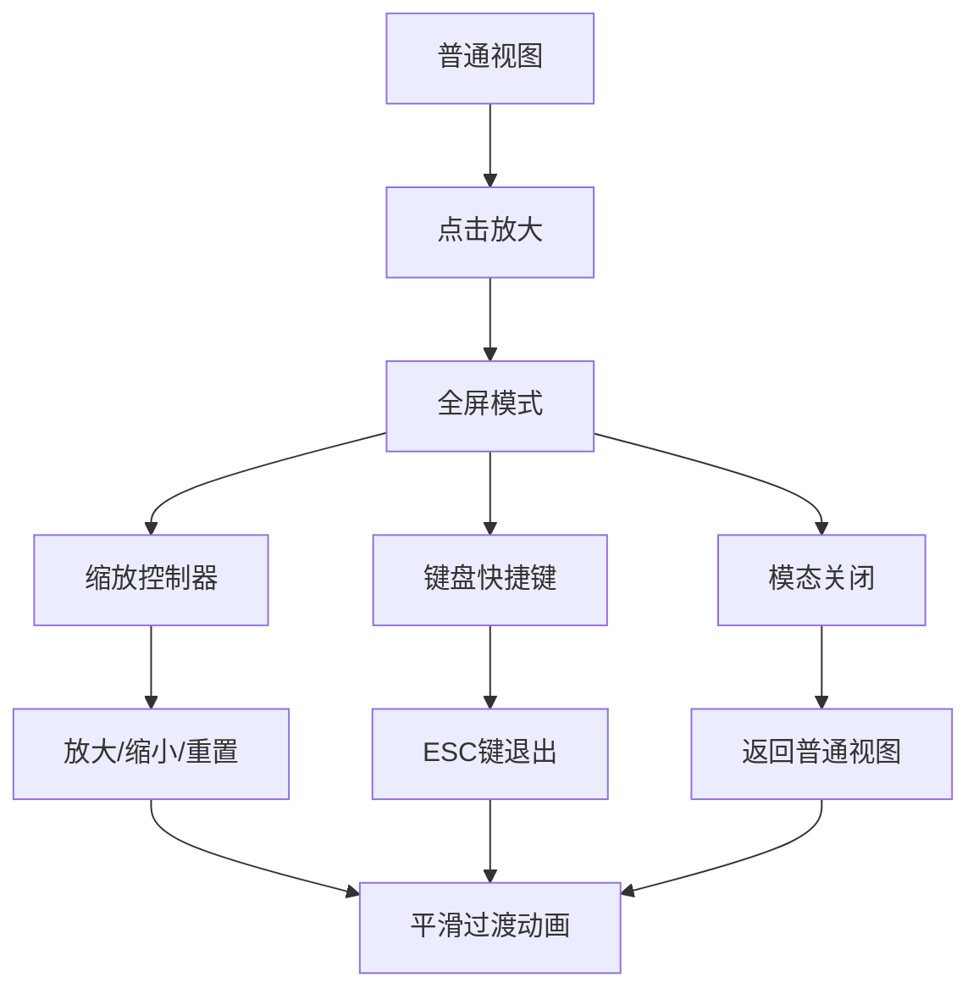
```mermaid
graph TB
A[普通视图] --> B[点击放大]
B --> C[全屏模式]
C --> D[缩放控制器]
C --> E[键盘快捷键]
C --> F[模态关闭]
D --> G[放大/缩小/重置]
E --> H[ESC键退出]
F --> I[返回普通视图]
G --> J[平滑过渡动画]
H --> J
I --> J
```

**图表来源**
- [Mermaid.tsx](file://src/components/Mermaid.tsx#L178-L304)

**章节来源**
- [Mermaid.tsx](file://src/components/Mermaid.tsx#L5-L170)
- [Mermaid.tsx](file://src/components/Mermaid.tsx#L178-L304)

## 典型应用场景

### 项目架构图生成

在仓库分析过程中，系统能够自动生成项目的整体架构图：

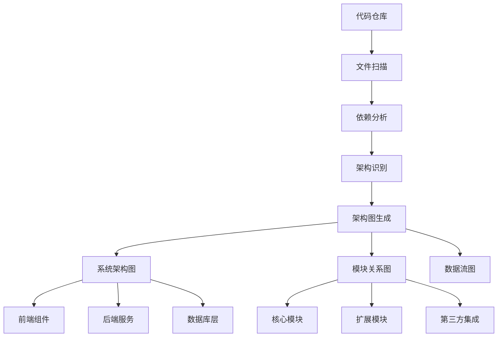
```mermaid
flowchart TD
A[代码仓库] --> B[文件扫描]
B --> C[依赖分析]
C --> D[架构识别]
D --> E[架构图生成]
E --> F[系统架构图]
E --> G[模块关系图]
E --> H[数据流图]
F --> I[前端组件]
F --> J[后端服务]
F --> K[数据库层]
G --> L[核心模块]
G --> M[扩展模块]
G --> N[第三方集成]
```

**图表来源**
- [page.tsx](file://src/app/[owner]/[repo]/page.tsx#L738-L760)

### API调用流程图

系统能够生成详细的API调用流程图，展示用户与系统的交互过程：

```mermaid
sequenceDiagram
participant User as 用户
participant Frontend as 前端应用
participant Auth as 认证服务
participant API as API网关
participant Service as 业务服务
participant DB as 数据库
User->>Frontend : 登录请求
Frontend->>Auth : 验证凭据
Auth-->>Frontend : 返回令牌
Frontend->>API : 带令牌请求
API->>Service : 转发请求
Service->>DB : 查询数据
DB-->>Service : 返回结果
Service-->>API : 处理响应
API-->>Frontend : 返回数据
Frontend-->>User : 显示结果
Note over User,DB : 异步事件处理
Service-)API : 异步通知
```

### 状态机图

对于具有复杂状态转换逻辑的系统，系统能够生成状态机图：

```mermaid
stateDiagram-v2
[*] --> 初始化
初始化 --> 认证中 : 开始登录
认证中 --> 已认证 : 认证成功
认证中 --> 认证失败 : 认证失败
认证失败 --> 初始化 : 重试
已认证 --> 处理请求 : 发送请求
处理请求 --> 已认证 : 请求完成
已认证 --> [*] : 退出登录
```

### 数据流图

系统能够展示数据在各个组件间的流动过程：

```mermaid
flowchart LR
A[用户输入] --> B[前端验证]
B --> C[API网关]
C --> D[身份验证]
D --> E[业务逻辑]
E --> F[数据持久化]
F --> G[缓存更新]
G --> H[响应客户端]
I[外部服务] --> C
C --> J[监控系统]
J --> K[日志记录]
```

**章节来源**
- [page.tsx](file://src/app/[owner]/[repo]/page.tsx#L738-L760)

## 最佳实践与性能优化

### 图表复杂度控制

为了避免渲染性能问题，系统实施了以下最佳实践：

#### 性能监控指标

| 指标 | 推荐值 | 警告阈值 | 最大限制 |
|------|--------|----------|----------|
| 节点数量 | < 100 | > 100 | > 500 |
| 连接线数量 | < 200 | > 200 | > 1000 |
| 图表层级 | < 10 | > 10 | > 20 |
| 渲染时间 | < 2秒 | > 5秒 | > 10秒 |

#### 渲染优化策略

```mermaid
flowchart TD
A[图表生成请求] --> B{复杂度评估}
B --> |低复杂度| C[直接渲染]
B --> |中复杂度| D[延迟加载]
B --> |高复杂度| E[分层渲染]
C --> F[快速响应]
D --> G[渐进式加载]
E --> H[分块渲染]
F --> I[用户体验]
G --> I
H --> I
I --> J[性能监控]
J --> K[资源回收]
```

### 内存管理

系统采用了智能的内存管理策略，确保长时间运行的稳定性：

```mermaid
graph TB
A[组件挂载] --> B[初始化资源]
B --> C[监听器注册]
C --> D[图表渲染]
D --> E{组件卸载?}
E --> |否| F[继续渲染]
E --> |是| G[清理资源]
F --> E
G --> H[移除监听器]
G --> I[释放内存]
G --> J[断开连接]
H --> K[组件销毁]
I --> K
J --> K
```

### 缓存策略

系统实现了多层缓存机制，提高重复访问的性能：

```mermaid
sequenceDiagram
participant User as 用户
participant Cache as 缓存层
participant Component as 组件
participant MermaidLib as 渲染库
User->>Cache : 请求图表
Cache->>Cache : 检查缓存
alt 缓存命中
Cache-->>User : 返回缓存结果
else 缓存未命中
Cache->>Component : 请求新渲染
Component->>MermaidLib : 执行渲染
MermaidLib-->>Component : 返回SVG
Component->>Cache : 存储到缓存
Cache-->>User : 返回渲染结果
end
```

**章节来源**
- [Mermaid.tsx](file://src/components/Mermaid.tsx#L319-L354)

## 故障排除指南

### 常见问题诊断

#### 渲染失败问题

当图表无法正常显示时，可以按照以下步骤进行诊断：

```mermaid
flowchart TD
A[图表不显示] --> B{检查控制台错误}
B --> |有错误| C[查看具体错误类型]
B --> |无错误| D[检查网络连接]
C --> E[语法错误]
C --> F[渲染超时]
C --> G[内存不足]
E --> H[检查Mermaid语法]
F --> I[减少图表复杂度]
G --> J[重启应用]
D --> K[检查API连接]
K --> L[检查防火墙设置]
```

#### 性能问题解决

| 问题症状 | 可能原因 | 解决方案 |
|---------|----------|----------|
| 渲染缓慢 | 图表过于复杂 | 减少节点数量，简化连接 |
| 页面卡顿 | 同时渲染多个图表 | 使用懒加载或分批渲染 |
| 内存占用高 | 图表缓存过多 | 定期清理缓存，限制缓存大小 |
| 响应超时 | 网络连接不稳定 | 检查网络状况，增加重试机制 |

#### 兼容性问题

系统在不同环境下的兼容性考虑：

```mermaid
graph LR
A[浏览器兼容性] --> B[现代浏览器]
A --> C[旧版浏览器]
B --> D[完整功能]
C --> E[基础功能]
F[设备兼容性] --> G[桌面设备]
F --> H[移动设备]
G --> I[鼠标交互]
H --> J[触摸交互]
D --> K[全功能体验]
E --> L[简化体验]
I --> K
J --> M[触摸优化]
```

### 调试工具

系统提供了多种调试工具帮助开发者定位问题：

#### 控制台日志

```typescript
// 启用详细日志
console.log('Mermaid渲染开始:', chartDefinition);
console.log('渲染结果:', svgOutput);
console.error('渲染错误:', errorDetails);
```

#### 性能分析

```typescript
// 性能监控
const startTime = performance.now();
// 执行渲染操作
const endTime = performance.now();
console.log(`渲染耗时: ${endTime - startTime}ms`);
```

**章节来源**
- [Mermaid.tsx](file://src/components/Mermaid.tsx#L384-L400)

## 总结

DeepWiki的可视化图表功能是一个功能强大且设计精良的系统，它成功地将AI生成的内容转化为直观易懂的图表。该系统的主要优势包括：

### 技术优势

1. **智能化生成**：通过精心设计的提示词模板，确保AI输出符合Mermaid语法规范
2. **实时渲染**：利用mermaid.js库实现实时图表渲染，提供流畅的用户体验
3. **多类型支持**：支持流程图、序列图、类图、实体关系图等多种图表类型
4. **优雅降级**：当遇到语法错误时提供友好的降级显示方案
5. **主题适配**：支持日式美学风格和深色模式切换

### 应用价值

该功能在实际应用中展现了巨大的价值：
- **代码理解**：帮助开发者快速理解复杂的代码结构和系统架构
- **文档生成**：自动生成技术文档中的图表，提高文档质量和可读性
- **教学辅助**：为技术培训提供直观的可视化教学材料
- **沟通工具**：作为团队协作中的沟通桥梁，促进技术交流

### 发展前景

随着AI技术的不断发展，该可视化图表功能还有很大的提升空间：
- **智能优化**：AI可以自动优化图表布局，提高可读性
- **交互增强**：增加更多的交互功能，如动态数据绑定
- **导出功能**：支持将图表导出为多种格式（PNG、PDF等）
- **协作编辑**：允许多用户同时编辑和评论图表

总的来说，DeepWiki的可视化图表功能不仅解决了技术文档生成的痛点，更为软件开发和知识管理领域提供了一个创新的解决方案。