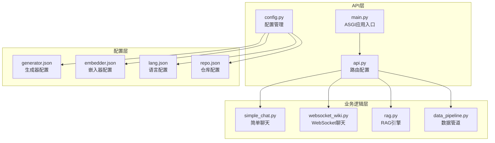
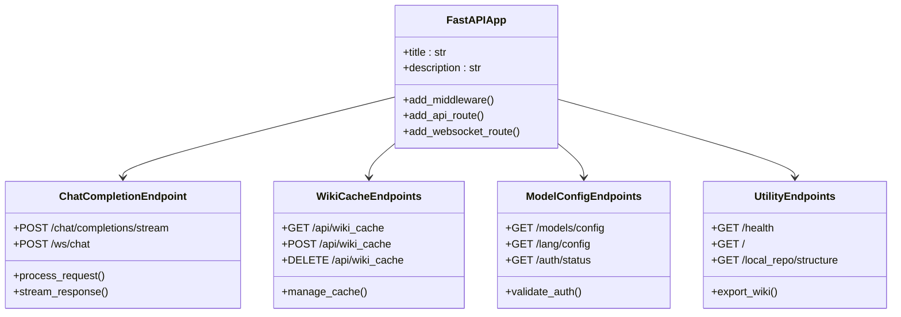
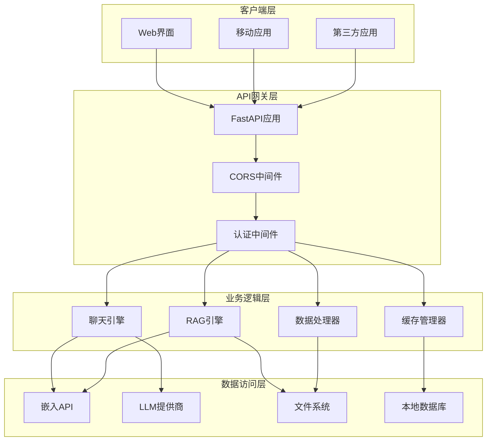
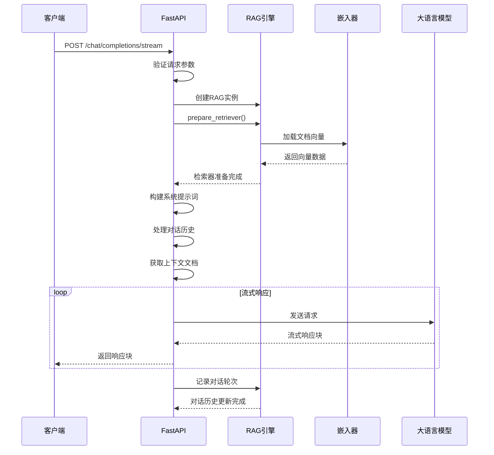
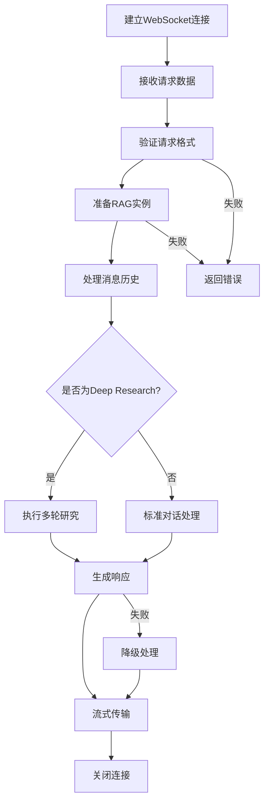
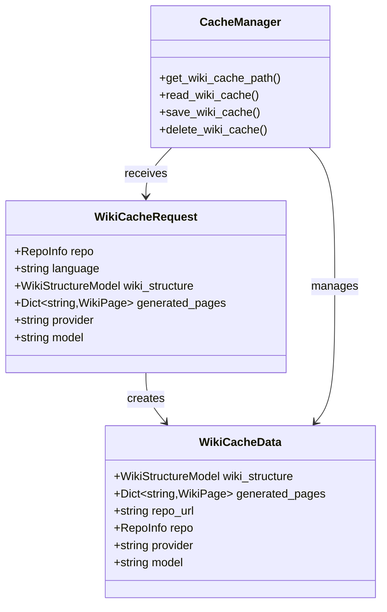
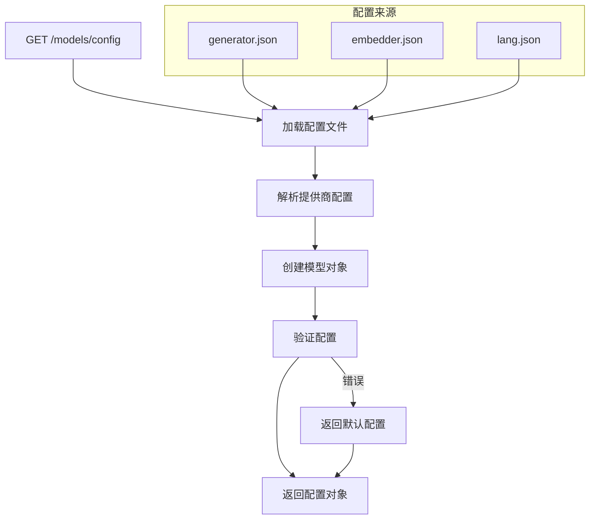
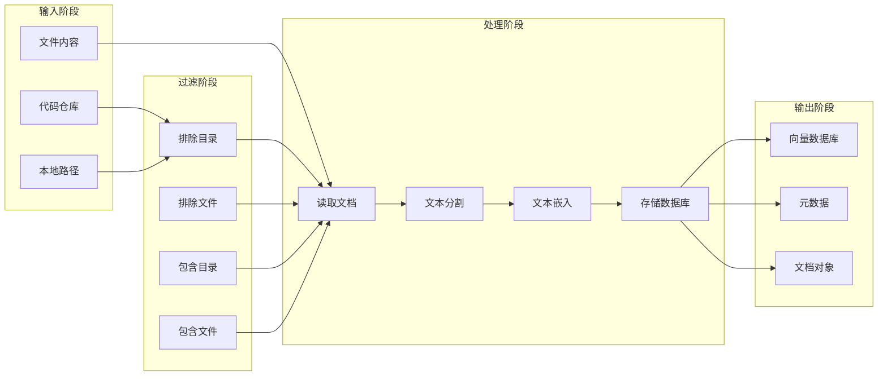
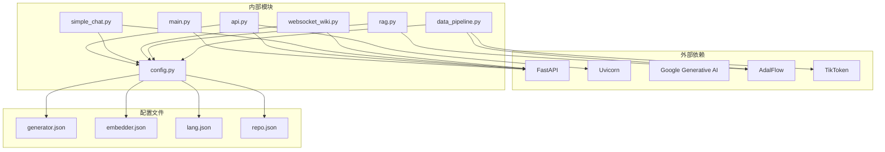

# API 服务

<cite>
**本文档引用的文件**
- [api/main.py](file://api/main.py)
- [api/api.py](file://api/api.py)
- [api/config.py](file://api/config.py)
- [api/data_pipeline.py](file://api/data_pipeline.py)
- [api/rag.py](file://api/rag.py)
- [api/simple_chat.py](file://api/simple_chat.py)
- [api/websocket_wiki.py](file://api/websocket_wiki.py)
- [api/prompts.py](file://api/prompts.py)
- [api/config/generator.json](file://api/config/generator.json)
- [api/config/embedder.json](file://api/config/embedder.json)
- [api/config/lang.json](file://api/config/lang.json)
- [api/config/repo.json](file://api/config/repo.json)
</cite>

## 目录
1. [简介](#简介)
2. [项目结构](#项目结构)
3. [核心组件](#核心组件)
4. [架构概览](#架构概览)
5. [详细组件分析](#详细组件分析)
6. [依赖关系分析](#依赖关系分析)
7. [性能考虑](#性能考虑)
8. [故障排除指南](#故障排除指南)
9. [结论](#结论)

## 简介

deepwiki-open是一个基于FastAPI构建的智能API服务，专门用于处理代码仓库的问答和知识管理。该系统提供了流式对话、模型配置管理、维基缓存操作等核心功能，支持多种大语言模型提供商，并具备强大的RAG（检索增强生成）能力。

## 项目结构



**图表来源**
- [api/main.py](file://api/main.py#L1-L80)
- [api/api.py](file://api/api.py#L1-L635)
- [api/config.py](file://api/config.py#L1-L388)

**章节来源**
- [api/main.py](file://api/main.py#L1-L80)
- [api/api.py](file://api/api.py#L1-L635)

## 核心组件

### ASGI应用初始化

系统通过`main.py`文件启动ASGI应用，该文件负责：
- 环境变量加载（使用dotenv）
- 日志配置初始化
- 开发模式下的热重载配置
- FastAPI应用实例化

### 路由配置系统

`api.py`文件定义了所有REST API端点，采用FastAPI框架的声明式路由方式：



**图表来源**
- [api/api.py](file://api/api.py#L20-L33)
- [api/api.py](file://api/api.py#L397-L402)

**章节来源**
- [api/main.py](file://api/main.py#L63-L80)
- [api/api.py](file://api/api.py#L20-L33)

## 架构概览

系统采用分层架构设计，从底层到顶层依次为：



**图表来源**
- [api/api.py](file://api/api.py#L20-L33)
- [api/simple_chat.py](file://api/simple_chat.py#L35-L49)
- [api/websocket_wiki.py](file://api/websocket_wiki.py#L27-L51)

## 详细组件分析

### 流式对话端点

#### /chat/completions/stream（POST）

这是系统的核心聊天端点，支持流式响应和多种功能特性：



**图表来源**
- [api/simple_chat.py](file://api/simple_chat.py#L75-L690)

**端点特性：**
- 支持多种LLM提供商（Google、OpenAI、OpenRouter、Ollama、Bedrock、Azure）
- 实时RAG检索和上下文注入
- Deep Research多轮研究功能
- 文件内容直接引用
- 令牌限制检测和自动降级

#### /ws/chat（WebSocket）

WebSocket版本的聊天端点，提供更高效的实时通信：



**图表来源**
- [api/websocket_wiki.py](file://api/websocket_wiki.py#L52-L770)

**章节来源**
- [api/simple_chat.py](file://api/simple_chat.py#L75-L690)
- [api/websocket_wiki.py](file://api/websocket_wiki.py#L52-L770)

### 维基缓存管理系统

#### /api/wiki_cache（GET/POST/DELETE）

维基缓存系统提供完整的CRUD操作，支持本地文件系统存储：



**图表来源**
- [api/api.py](file://api/api.py#L101-L110)
- [api/api.py](file://api/api.py#L90-L99)

**缓存路径生成规则：**
```
~/.adalflow/wikicache/deepwiki_cache_{repo_type}_{owner}_{repo}_{language}.json
```

**章节来源**
- [api/api.py](file://api/api.py#L404-L539)

### 模型配置管理

#### /models/config（GET）

动态获取可用的模型提供商和配置：



**图表来源**
- [api/api.py](file://api/api.py#L167-L226)
- [api/config/generator.json](file://api/config/generator.json#L1-L200)

**支持的提供商：**
- Google Generative AI
- OpenAI
- OpenRouter
- Ollama
- AWS Bedrock
- Azure AI
- DashScope

**章节来源**
- [api/api.py](file://api/api.py#L167-L226)
- [api/config/generator.json](file://api/config/generator.json#L1-L200)

### 数据处理管道

#### 文档处理和向量化

系统实现了完整的文档处理流水线：



**图表来源**
- [api/data_pipeline.py](file://api/data_pipeline.py#L144-L371)

**章节来源**
- [api/data_pipeline.py](file://api/data_pipeline.py#L144-L371)

## 依赖关系分析

### 核心依赖图



**图表来源**
- [api/main.py](file://api/main.py#L1-L10)
- [api/api.py](file://api/api.py#L1-L10)
- [api/config.py](file://api/config.py#L1-L17)

**章节来源**
- [api/main.py](file://api/main.py#L1-L10)
- [api/api.py](file://api/api.py#L1-L10)
- [api/config.py](file://api/config.py#L1-L17)

## 性能考虑

### 缓存策略

系统实现了多层次的缓存机制：

1. **维基缓存**：本地文件系统缓存，避免重复处理
2. **嵌入缓存**：向量数据库存储，加速RAG检索
3. **会话缓存**：内存中的对话历史管理

### 优化技术

- **异步处理**：所有I/O密集型操作使用异步模式
- **批量处理**：嵌入器支持批量向量化
- **流式响应**：减少用户等待时间
- **令牌限制**：智能检测和处理长输入

### 内存管理

- 使用弱引用防止循环依赖
- 及时释放大型对象
- 连接池复用数据库连接

## 故障排除指南

### 常见问题及解决方案

#### 1. API启动失败

**症状**：服务无法启动或端口占用
**原因**：环境变量缺失或端口冲突
**解决**：
```bash
# 检查必需的环境变量
echo $GOOGLE_API_KEY
echo $OPENAI_API_KEY

# 检查端口占用
lsof -i :8001
```

#### 2. RAG检索失败

**症状**：无法找到相关文档或返回空结果
**原因**：文档向量化失败或嵌入尺寸不匹配
**解决**：
- 检查文档内容是否过大
- 验证嵌入器配置正确性
- 清理损坏的缓存文件

#### 3. WebSocket连接中断

**症状**：实时聊天断开连接
**原因**：网络不稳定或超时设置过短
**解决**：
- 增加WebSocket超时时间
- 检查网络连接质量
- 实现自动重连机制

**章节来源**
- [api/main.py](file://api/main.py#L47-L62)
- [api/rag.py](file://api/rag.py#L360-L414)

## 结论

deepwiki-open的API服务展现了现代AI应用的最佳实践，通过以下特点实现了高效、可扩展的智能问答系统：

### 技术优势

1. **模块化设计**：清晰的分层架构便于维护和扩展
2. **多提供商支持**：灵活的LLM提供商切换机制
3. **智能缓存**：多层次缓存策略提升性能
4. **流式处理**：实时响应改善用户体验
5. **类型安全**：Pydantic模型确保数据完整性

### 扩展性

系统设计充分考虑了未来的扩展需求：
- 新的LLM提供商可通过配置文件添加
- 支持自定义文档过滤规则
- 可插拔的嵌入器架构
- 模块化的功能组件

### 生产就绪

- 完整的错误处理和日志记录
- 环境变量驱动的配置管理
- 开发和生产环境的差异化处理
- 健康检查和监控端点

该API服务为代码仓库的知识管理和智能问答提供了强大而灵活的基础设施，能够满足各种规模的应用需求。