# WebSocket聊天API

<cite>
**本文档中引用的文件**
- [api/api.py](file://api/api.py)
- [api/websocket_wiki.py](file://api/websocket_wiki.py)
- [api/simple_chat.py](file://api/simple_chat.py)
- [src/utils/websocketClient.ts](file://src/utils/websocketClient.ts)
- [src/app/api/chat/stream/route.ts](file://src/app/api/chat/stream/route.ts)
- [src/components/Ask.tsx](file://src/components/Ask.tsx)
- [src/app/[owner]/[repo]/page.tsx](file://src/app/[owner]/[repo]/page.tsx)
- [src/app/[owner]/[repo]/slides/page.tsx](file://src/app/[owner]/[repo]/slides/page.tsx)
- [src/app/[owner]/[repo]/workshop/page.tsx](file://src/app/[owner]/[repo]/workshop/page.tsx)
</cite>

## 目录
1. [简介](#简介)
2. [WebSocket端点架构](#websocket端点架构)
3. [端点注册与路由](#端点注册与路由)
4. [消息格式与数据结构](#消息格式与数据结构)
5. [连接建立过程](#连接建立过程)
6. [消息收发流程](#消息收发流程)
7. [服务器处理机制](#服务器处理机制)
8. [HTTP流式API对比](#http流式api对比)
9. [前端实现示例](#前端实现示例)
10. [错误处理与故障转移](#错误处理与故障转移)
11. [性能优化建议](#性能优化建议)
12. [总结](#总结)

## 简介

deepwiki-open项目提供了基于WebSocket的实时聊天API，通过`/ws/chat`端点实现双向实时通信。该WebSocket端点替代了传统的HTTP流式API，为用户提供更高效的交互体验，特别是在需要持续对话和实时响应的场景下。

WebSocket聊天API支持多种模型提供商（Google、OpenAI、OpenRouter、Ollama、Azure等），具备深度研究功能、RAG检索增强和多语言支持等高级特性。

## WebSocket端点架构

### 系统架构概览


**图表来源**
- [api/api.py](file://api/api.py#L400-L401)
- [api/websocket_wiki.py](file://api/websocket_wiki.py#L52-L770)

### 核心组件关系

```mermaid
classDiagram
class WebSocketHandler {
+handle_websocket_chat(websocket)
+process_request(request_data)
+build_prompt(messages, context)
+stream_response(model, prompt)
+handle_error(error)
}
class ChatCompletionRequest {
+string repo_url
+ChatMessage[] messages
+string filePath
+string token
+string type
+string provider
+string model
+string language
+string excluded_dirs
+string excluded_files
+string included_dirs
+string included_files
}
class ChatMessage {
+string role
+string content
}
class RAGSystem {
+prepare_retriever(repo_url, type, token)
+retrieve_documents(query, language)
+add_dialog_turn(user_query, assistant_response)
}
class ModelClient {
+generate_content(prompt, stream)
+acall(api_kwargs, model_type)
+convert_inputs_to_api_kwargs(input, model_kwargs, model_type)
}
WebSocketHandler --> ChatCompletionRequest
WebSocketHandler --> RAGSystem
WebSocketHandler --> ModelClient
ChatCompletionRequest --> ChatMessage
```



**图表来源**
- [api/websocket_wiki.py](file://api/websocket_wiki.py#L27-L51)
- [api/websocket_wiki.py](file://api/websocket_wiki.py#L52-L770)

**章节来源**
- [api/api.py](file://api/api.py#L400-L401)
- [api/websocket_wiki.py](file://api/websocket_wiki.py#L1-L770)

## 端点注册与路由

### WebSocket路由配置

WebSocket聊天端点通过FastAPI的`add_websocket_route`方法注册：

```python
# 在api/api.py中注册WebSocket端点
app.add_websocket_route("/ws/chat", handle_websocket_chat)
```

### 路由映射关系

| 路由类型 | 路径 | 处理器函数 | 功能描述 |
|---------|------|-----------|----------|
| WebSocket | `/ws/chat` | `handle_websocket_chat` | 主要的WebSocket聊天处理端点 |
| HTTP | `/chat/completions/stream` | `chat_completions_stream` | HTTP流式API（备用） |
| HTTP | `/api/chat/stream` | 代理路由 | 前端HTTP到WebSocket的代理 |

**章节来源**
- [api/api.py](file://api/api.py#L400-L401)

## 消息格式与数据结构

### 请求消息格式

WebSocket聊天API使用JSON格式的消息体：

```typescript
interface ChatCompletionRequest {
  repo_url: string;           // 仓库URL
  messages: ChatMessage[];    // 对话消息数组
  filePath?: string;         // 可选的文件路径
  token?: string;            // 私有仓库访问令牌
  type?: string;             // 仓库类型（github/gitlab/bitbucket）
  provider?: string;         // 模型提供商（google/openai/openrouter/ollama/azure）
  model?: string;            // 模型名称
  language?: string;         // 语言代码（en/ja/zh/es/kr/vi）
  excluded_dirs?: string;    // 排除目录列表（逗号分隔）
  excluded_files?: string;   // 排除文件模式列表（逗号分隔）
  included_dirs?: string;    // 包含目录列表（逗号分隔）
  included_files?: string;   // 包含文件模式列表（逗号分隔）
}

interface ChatMessage {
  role: 'user' | 'assistant' | 'system';  // 角色类型
  content: string;                       // 消息内容
}
```

### 消息验证规则


**图表来源**
- [api/websocket_wiki.py](file://api/websocket_wiki.py#L61-L770)

**章节来源**
- [api/websocket_wiki.py](file://api/websocket_wiki.py#L27-L51)
- [src/utils/websocketClient.ts](file://src/utils/websocketClient.ts#L17-L33)

## 连接建立过程

### WebSocket连接生命周期


**图表来源**
- [api/websocket_wiki.py](file://api/websocket_wiki.py#L52-L770)
- [src/utils/websocketClient.ts](file://src/utils/websocketClient.ts#L43-L85)

### 连接建立步骤详解

1. **连接接受阶段**
   - 服务器调用`await websocket.accept()`接受连接
   - 建立WebSocket协议握手

2. **请求接收阶段**
   - 使用`await websocket.receive_json()`接收JSON格式的聊天请求
   - 解析请求数据并验证格式

3. **初始化阶段**
   - 创建RAG实例用于文档检索
   - 准备对话历史和上下文
   - 初始化模型客户端

4. **响应发送阶段**
   - 流式发送模型响应给客户端
   - 支持实时更新和增量显示

**章节来源**
- [api/websocket_wiki.py](file://api/websocket_wiki.py#L57-L62)
- [src/utils/websocketClient.ts](file://src/utils/websocketClient.ts#L50-L72)

## 消息收发流程

### 消息处理流程


**图表来源**
- [api/websocket_wiki.py](file://api/websocket_wiki.py#L61-L770)

### 消息类型处理

| 消息类型 | 处理方式 | 特殊功能 |
|---------|----------|----------|
| 用户消息 | 添加到对话历史 | 支持深度研究标记 |
| 助手消息 | 更新对话记忆 | 维护对话连续性 |
| 系统消息 | 构建系统提示词 | 控制模型行为 |
| 文件内容 | 增强上下文 | 提供具体代码参考 |

### 流式响应机制

WebSocket聊天API采用流式响应机制，支持实时消息传输：

```typescript
// 前端消息处理示例
ws.onmessage = (event) => {
  const chunk = event.data;
  // 实时更新UI显示
  updateChatInterface(chunk);
};
```

**章节来源**
- [api/websocket_wiki.py](file://api/websocket_wiki.py#L133-L144)
- [src/utils/websocketClient.ts](file://src/utils/websocketClient.ts#L59-L62)

## 服务器处理机制

### 深度研究功能

WebSocket聊天API支持深度研究功能，能够进行多轮对话和深入分析：


**图表来源**
- [api/websocket_wiki.py](file://api/websocket_wiki.py#L150-L161)

### RAG检索增强

系统集成了RAG（检索增强生成）功能，提供准确的上下文信息：

1. **文档检索**：根据用户查询从仓库中检索相关文档
2. **上下文构建**：将检索结果组织成结构化的上下文
3. **提示词优化**：将上下文融入系统提示词中

### 多模型支持

WebSocket聊天API支持多种模型提供商：

| 提供商 | 模型类型 | 特点 |
|--------|----------|------|
| Google | Gemini系列 | 免费、高质量 |
| OpenAI | GPT系列 | 强大的推理能力 |
| OpenRouter | 多模型聚合 | 统一接口访问多个模型 |
| Ollama | 本地部署 | 隐私保护、离线可用 |
| Azure | 企业级 | 安全合规 |

**章节来源**
- [api/websocket_wiki.py](file://api/websocket_wiki.py#L247-L388)
- [api/websocket_wiki.py](file://api/websocket_wiki.py#L389-L530)

## HTTP流式API对比

### WebSocket vs HTTP流式API差异

| 特性 | WebSocket API | HTTP流式API |
|------|---------------|-------------|
| 连接类型 | 持久连接 | 短连接 |
| 实时性 | 立即响应 | 需要轮询或长轮询 |
| 资源消耗 | 较低（单连接） | 较高（频繁连接） |
| 错误恢复 | 自动重连 | 需要客户端处理 |
| 并发支持 | 多个同时连接 | 受限于HTTP并发数 |
| 开发复杂度 | 中等 | 较低 |

### 优势对比

#### WebSocket的优势

1. **实时性更强**
   - 建立持久连接后，消息可以即时传递
   - 无需等待连接建立时间

2. **资源效率更高**
   - 单个连接支持多次消息交换
   - 减少连接建立和断开的开销

3. **更好的用户体验**
   - 支持真正的双向通信
   - 更流畅的交互体验

4. **适合复杂交互**
   - 支持多轮对话和上下文保持
   - 便于实现复杂的聊天逻辑

#### HTTP流式的局限性

1. **连接开销大**
   - 每次请求都需要建立新连接
   - 增加网络延迟

2. **状态管理困难**
   - 需要额外的机制维护会话状态
   - 不适合长时间的对话场景

3. **扩展性受限**
   - 受HTTP服务器并发连接数限制
   - 难以支持大量同时连接

### 实际应用场景


**章节来源**
- [api/simple_chat.py](file://api/simple_chat.py#L75-L677)
- [src/app/api/chat/stream/route.ts](file://src/app/api/chat/stream/route.ts#L9-L113)

## 前端实现示例

### 基础WebSocket连接

以下是前端使用WebSocket连接到聊天API的基础实现：

```typescript
// 创建WebSocket连接
const createChatConnection = (requestBody: ChatCompletionRequest) => {
  // 获取WebSocket服务器地址
  const serverBaseUrl = process.env.SERVER_BASE_URL || 'http://localhost:8001';
  const wsBaseUrl = serverBaseUrl.replace(/^http/, 'ws');
  const wsUrl = `${wsBaseUrl}/ws/chat`;
  
  // 创建WebSocket连接
  const ws = new WebSocket(wsUrl);
  
  return new Promise<void>((resolve, reject) => {
    // 连接建立事件
    ws.onopen = () => {
      console.log('WebSocket连接已建立');
      // 发送请求数据
      ws.send(JSON.stringify(requestBody));
      resolve();
    };
    
    // 错误处理
    ws.onerror = (error) => {
      console.error('WebSocket错误:', error);
      reject(new Error('WebSocket连接失败'));
    };
    
    // 超时处理
    const timeout = setTimeout(() => {
      reject(new Error('WebSocket连接超时'));
    }, 5000);
  });
};
```

### 完整的聊天实现

```typescript
// 完整的WebSocket聊天实现
const handleWebSocketChat = async (requestBody: ChatCompletionRequest) => {
  try {
    // 创建WebSocket连接
    const ws = new WebSocket(getWebSocketUrl());
    
    // 连接Promise
    await new Promise<void>((resolve, reject) => {
      ws.onopen = () => {
        console.log('WebSocket连接已建立');
        ws.send(JSON.stringify(requestBody));
        resolve();
      };
      
      ws.onerror = (error) => {
        console.error('WebSocket错误:', error);
        reject(new Error('WebSocket连接失败'));
      };
    });
    
    // 响应处理Promise
    return new Promise<string>((resolve, reject) => {
      let fullResponse = '';
      
      ws.onmessage = (event) => {
        const chunk = event.data;
        fullResponse += chunk;
        // 更新UI显示
        updateChatDisplay(chunk);
      };
      
      ws.onclose = () => {
        console.log('WebSocket连接已关闭');
        resolve(fullResponse);
      };
      
      ws.onerror = (error) => {
        console.error('WebSocket错误:', error);
        reject(new Error('WebSocket通信错误'));
      };
    });
    
  } catch (error) {
    console.error('WebSocket错误，回退到HTTP:', error);
    // 回退到HTTP流式API
    return fallbackToHttp(requestBody);
  }
};
```

### React组件实现

```typescript
// React组件中的WebSocket聊天
const ChatComponent = () => {
  const [response, setResponse] = useState('');
  const webSocketRef = useRef<WebSocket | null>(null);
  
  const sendMessage = async (message: string) => {
    const requestBody: ChatCompletionRequest = {
      repo_url: 'https://github.com/example/repo',
      messages: [
        { role: 'user', content: message }
      ],
      provider: 'google',
      model: 'gemini-2.5-flash'
    };
    
    try {
      // 创建WebSocket连接
      webSocketRef.current = new WebSocket(getWebSocketUrl());
      
      // 设置事件处理器
      webSocketRef.current.onopen = () => {
        console.log('WebSocket连接已建立');
        webSocketRef.current?.send(JSON.stringify(requestBody));
      };
      
      webSocketRef.current.onmessage = (event) => {
        setResponse(prev => prev + event.data);
      };
      
      webSocketRef.current.onclose = () => {
        console.log('WebSocket连接已关闭');
      };
      
    } catch (error) {
      console.error('WebSocket错误:', error);
      // 处理错误
    }
  };
  
  // 清理WebSocket连接
  useEffect(() => {
    return () => {
      if (webSocketRef.current) {
        webSocketRef.current.close();
      }
    };
  }, []);
  
  return (
    <div>
      {/* 聊天界面 */}
      <div className="chat-response">{response}</div>
      {/* 发送消息按钮 */}
      <button onClick={() => sendMessage('你好')}>发送</button>
    </div>
  );
};
```

### 错误处理与重试机制

```typescript
// 带重试机制的WebSocket连接
const createRetryableWebSocket = async (
  requestBody: ChatCompletionRequest,
  maxRetries: number = 3
) => {
  let retries = 0;
  
  const connectWithRetry = async (): Promise<WebSocket> => {
    try {
      const ws = new WebSocket(getWebSocketUrl());
      
      // 连接超时处理
      const timeout = new Promise<never>((_, reject) => {
        setTimeout(() => {
          ws.close();
          reject(new Error('连接超时'));
        }, 5000);
      });
      
      // 连接成功Promise
      const connected = new Promise<WebSocket>((resolve, reject) => {
        ws.onopen = () => resolve(ws);
        ws.onerror = (error) => reject(error);
      });
      
      // 等待连接或超时
      await Promise.race([connected, timeout]);
      
      // 发送请求
      ws.send(JSON.stringify(requestBody));
      return ws;
      
    } catch (error) {
      retries++;
      if (retries < maxRetries) {
        console.warn(`连接失败，重试(${retries}/${maxRetries})`);
        await new Promise(resolve => setTimeout(resolve, 1000 * retries));
        return connectWithRetry();
      }
      throw new Error('无法建立WebSocket连接');
    }
  };
  
  return connectWithRetry();
};
```

**章节来源**
- [src/utils/websocketClient.ts](file://src/utils/websocketClient.ts#L35-L85)
- [src/components/Ask.tsx](file://src/components/Ask.tsx#L405-L437)
- [src/app/[owner]/[repo]/page.tsx](file://src/app/[owner]/[repo]/page.tsx#L551-L619)

## 错误处理与故障转移

### 多层错误处理机制

WebSocket聊天API实现了完善的错误处理和故障转移机制：


**图表来源**
- [api/websocket_wiki.py](file://api/websocket_wiki.py#L761-L769)
- [src/components/Ask.tsx](file://src/components/Ask.tsx#L405-L437)

### 错误类型与处理策略

| 错误类型 | 处理策略 | 用户反馈 |
|---------|----------|----------|
| 连接超时 | 重试WebSocket连接 | 显示"正在重试..." |
| 认证失败 | 使用HTTP回退 | 显示"认证失败，请重试" |
| 令牌限制 | 简化请求重新发送 | 显示"请求过大，已简化" |
| 模型错误 | 错误消息直接返回 | 显示具体的错误信息 |
| 网络中断 | 自动重连 | 显示"网络中断，正在重连" |

### 故障转移实现

```typescript
// 前端故障转移实现
const createRobustWebSocket = async (requestBody: ChatCompletionRequest) => {
  try {
    // 尝试WebSocket连接
    const ws = new WebSocket(getWebSocketUrl());
    
    // 设置超时
    const timeout = new Promise<never>((_, reject) => {
      setTimeout(() => {
        ws.close();
        reject(new Error('WebSocket连接超时'));
      }, 5000);
    });
    
    // 等待连接成功
    await Promise.race([
      new Promise<void>(resolve => ws.onopen = () => resolve()),
      timeout
    ]);
    
    // 发送请求
    ws.send(JSON.stringify(requestBody));
    
    return ws;
    
  } catch (wsError) {
    console.error('WebSocket连接失败，回退到HTTP:', wsError);
    
    // 回退到HTTP流式API
    return fallbackToHttp(requestBody);
  }
};

// HTTP回退实现
const fallbackToHttp = async (requestBody: ChatCompletionRequest) => {
  try {
    const response = await fetch('/api/chat/stream', {
      method: 'POST',
      headers: {
        'Content-Type': 'application/json',
      },
      body: JSON.stringify(requestBody)
    });
    
    if (!response.ok) {
      throw new Error(`HTTP错误: ${response.status}`);
    }
    
    // 处理流式响应
    const reader = response.body?.getReader();
    const decoder = new TextDecoder();
    
    if (!reader) {
      throw new Error('无法读取响应流');
    }
    
    let fullResponse = '';
    while (true) {
      const { done, value } = await reader.read();
      if (done) break;
      
      const chunk = decoder.decode(value, { stream: true });
      fullResponse += chunk;
      // 更新UI
      updateChatDisplay(chunk);
    }
    
    return fullResponse;
    
  } catch (httpError) {
    console.error('HTTP回退也失败了:', httpError);
    throw new Error('所有连接方式都失败了，请检查网络');
  }
};
```

**章节来源**
- [src/components/Ask.tsx](file://src/components/Ask.tsx#L405-L437)
- [src/app/api/chat/stream/route.ts](file://src/app/api/chat/stream/route.ts#L40-L113)

## 性能优化建议

### 连接池管理

对于高频使用的WebSocket连接，建议实现连接池管理：

```typescript
class WebSocketPool {
  private pool: WebSocket[] = [];
  private maxSize: number = 10;
  
  async getConnection(): Promise<WebSocket> {
    // 尝试获取空闲连接
    const idleWs = this.pool.find(ws => ws.readyState === WebSocket.OPEN);
    if (idleWs) return idleWs;
    
    // 如果池未满，创建新连接
    if (this.pool.length < this.maxSize) {
      const ws = new WebSocket(this.getWebSocketUrl());
      this.pool.push(ws);
      return ws;
    }
    
    // 等待第一个可用连接
    return new Promise((resolve) => {
      const interval = setInterval(() => {
        const available = this.pool.find(ws => ws.readyState === WebSocket.OPEN);
        if (available) {
          clearInterval(interval);
          resolve(available);
        }
      }, 100);
    });
  }
  
  cleanup() {
    this.pool.forEach(ws => {
      if (ws.readyState === WebSocket.OPEN) {
        ws.close();
      }
    });
    this.pool = [];
  }
}
```

### 消息压缩

对于大型响应，可以启用消息压缩：

```typescript
// 后端消息压缩
const compressResponse = (response: string): Uint8Array => {
  const encoder = new TextEncoder();
  const data = encoder.encode(response);
  
  // 使用zlib压缩
  const compressed = pako.deflate(data);
  return compressed;
};

// 前端解压
const decompressResponse = (compressed: Uint8Array): string => {
  const decompressed = pako.inflate(compressed);
  const decoder = new TextDecoder();
  return decoder.decode(decompressed);
};
```

### 缓存策略

实现智能缓存机制减少重复计算：

```typescript
class ChatCache {
  private cache = new Map<string, { response: string; timestamp: number }>();
  private readonly TTL = 5 * 60 * 1000; // 5分钟
  
  getCacheKey(request: ChatCompletionRequest): string {
    return JSON.stringify({
      repo_url: request.repo_url,
      messages: request.messages.slice(-3), // 最近3条消息
      provider: request.provider,
      model: request.model
    });
  }
  
  getCachedResponse(key: string): string | undefined {
    const cached = this.cache.get(key);
    if (cached && Date.now() - cached.timestamp < this.TTL) {
      return cached.response;
    }
    return undefined;
  }
  
  setCachedResponse(key: string, response: string): void {
    this.cache.set(key, {
      response,
      timestamp: Date.now()
    });
  }
}
```

### 监控指标

建议收集以下关键性能指标：

| 指标 | 描述 | 监控目的 |
|------|------|----------|
| 连接成功率 | WebSocket连接成功的百分比 | 评估连接稳定性 |
| 响应延迟 | 从发送请求到收到首个响应的时间 | 优化响应速度 |
| 错误率 | 各类错误的发生频率 | 识别问题热点 |
| 并发连接数 | 同时活跃的WebSocket连接数量 | 扩展容量规划 |
| 内存使用 | WebSocket连接占用的内存 | 资源监控 |

## 总结

deepwiki-open的WebSocket聊天API提供了一个强大而灵活的实时通信解决方案。通过`/ws/chat`端点，开发者可以实现：

### 核心优势

1. **实时交互**：支持真正的双向实时通信
2. **高效传输**：单连接多消息，降低网络开销
3. **丰富功能**：深度研究、RAG检索、多模型支持
4. **容错机制**：完善的错误处理和故障转移
5. **易于集成**：标准化的JSON消息格式

### 技术特点

- **异步处理**：完全异步的WebSocket处理机制
- **流式响应**：支持实时消息流传输
- **多提供商**：统一接口支持多个AI模型提供商
- **上下文保持**：维护对话历史和上下文连续性
- **错误恢复**：自动重连和HTTP回退机制

### 应用场景

WebSocket聊天API特别适合以下场景：
- 实时代码问答和解释
- 深度技术研究和分析
- 多轮对话和复杂交互
- 协作开发和团队讨论
- 智能助手和虚拟客服

通过合理的设计和实现，WebSocket聊天API能够为用户提供流畅、高效的实时交互体验，是现代AI应用的重要基础设施。