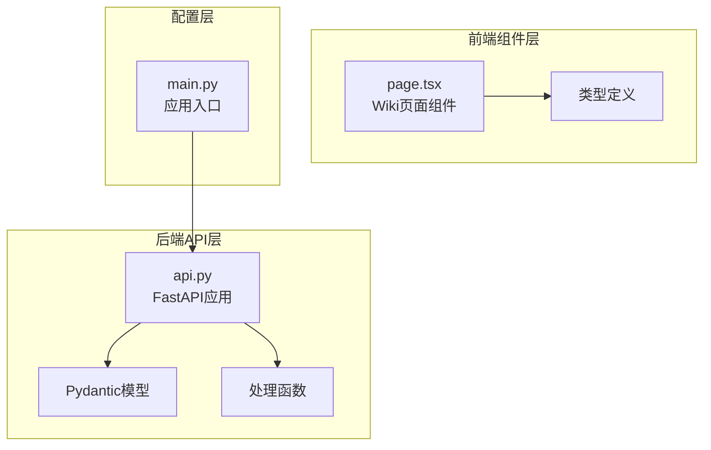
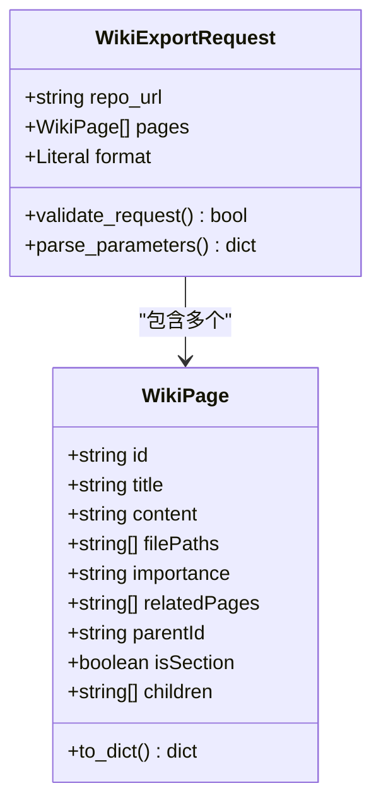
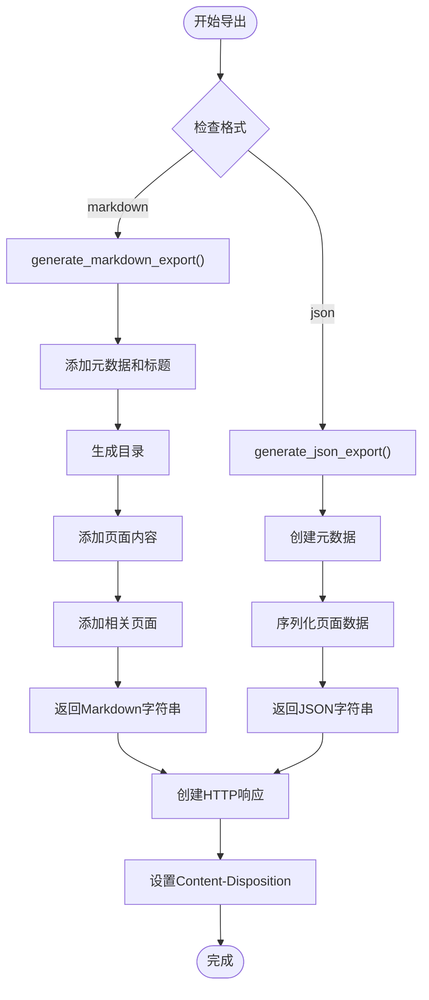
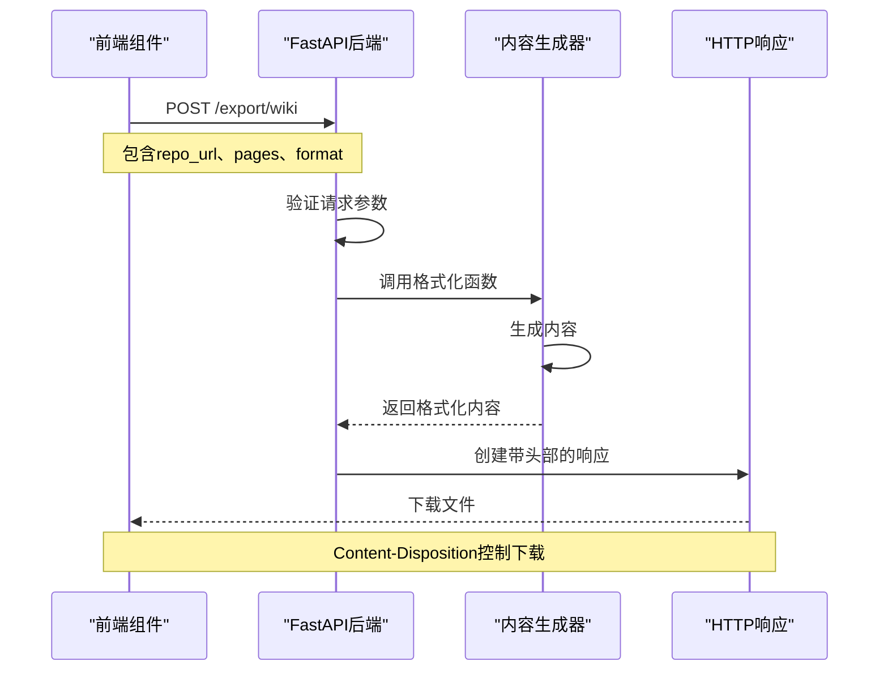
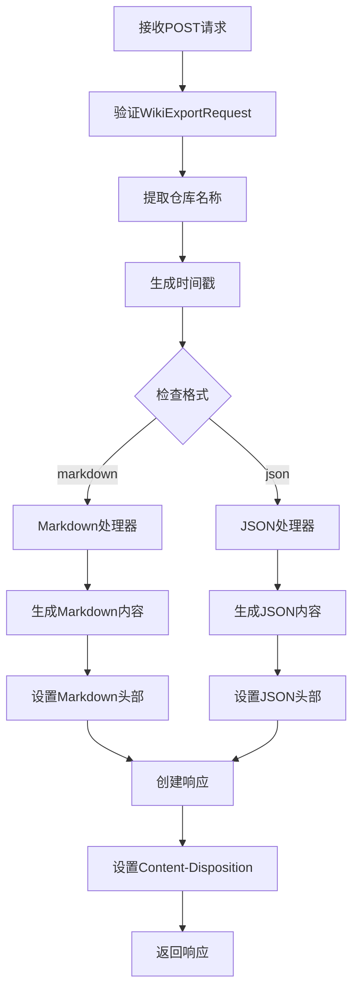
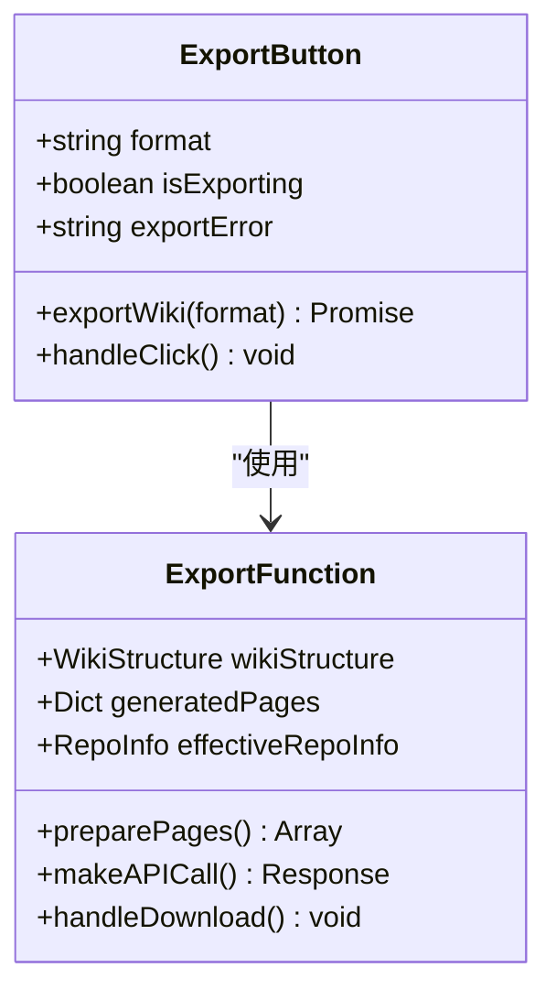
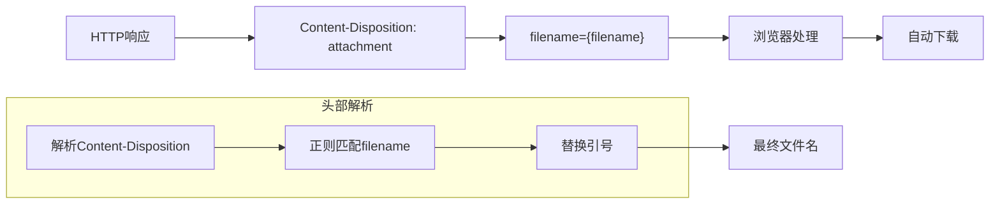
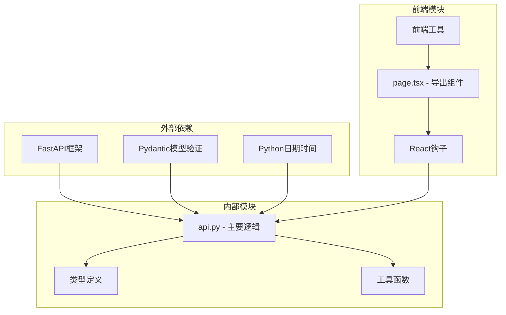

# 导出API

<cite>
**本文档中引用的文件**
- [api.py](file://api/api.py)
- [page.tsx](file://src/app/[owner]/[repo]/page.tsx)
- [wikipage.tsx](file://src/types/wiki/wikipage.tsx)
- [wikistructure.tsx](file://src/types/wiki/wikistructure.tsx)
- [main.py](file://api/main.py)
</cite>

## 目录
1. [简介](#简介)
2. [项目结构](#项目结构)
3. [核心组件](#核心组件)
4. [架构概览](#架构概览)
5. [详细组件分析](#详细组件分析)
6. [依赖关系分析](#依赖关系分析)
7. [性能考虑](#性能考虑)
8. [故障排除指南](#故障排除指南)
9. [结论](#结论)

## 简介

deepwiki-open的导出API提供了强大的Wiki内容导出功能，支持将生成的Wiki页面以Markdown或JSON格式导出为可下载文件。该API设计用于满足用户对Wiki内容进行备份、分享和离线使用的需要。

主要功能包括：
- 支持Markdown和JSON两种导出格式
- 自动生成包含元数据的文件名
- 提供HTTP响应头控制文件下载行为
- 前端一键导出功能集成

## 项目结构

导出API功能分布在以下关键文件中：

**图表来源**
- [api.py](file://api/api.py#L1-L635)
- [page.tsx](file://src/app/[owner]/[repo]/page.tsx#L1-L2281)
- [main.py](file://api/main.py#L1-L80)

**章节来源**
- [api.py](file://api/api.py#L1-L635)
- [page.tsx](file://src/app/[owner]/[repo]/page.tsx#L1-L2281)

## 核心组件

### WikiExportRequest请求模型

`WikiExportRequest`是导出API的核心请求模型，定义了导出操作所需的所有必要参数：

**图表来源**
- [api.py](file://api/api.py#L112-L118)
- [wikipage.tsx](file://src/types/wiki/wikipage.tsx#L2-L13)

### 导出格式处理器

系统支持两种导出格式，每种格式都有专门的生成函数：

**图表来源**
- [api.py](file://api/api.py#L227-L268)
- [api.py](file://api/api.py#L322-L391)

**章节来源**
- [api.py](file://api/api.py#L112-L118)
- [api.py](file://api/api.py#L227-L268)

## 架构概览

导出API采用分层架构设计，确保前后端分离和功能模块化：

**图表来源**
- [api.py](file://api/api.py#L227-L268)
- [page.tsx](file://src/app/[owner]/[repo]/page.tsx#L1522-L1561)

## 详细组件分析

### 后端API端点

#### POST /export/wiki 端点

该端点是导出功能的主要入口，负责处理导出请求并返回可下载文件：

**图表来源**
- [api.py](file://api/api.py#L227-L268)

#### 内容生成函数

##### Markdown导出生成器

Markdown导出生成器创建包含完整元数据和结构的Markdown文档：

| 组件 | 描述 | 生成内容 |
|------|------|----------|
| 元数据 | 仓库信息和生成时间 | `# Wiki Documentation for {repo_url}` `Generated on: {timestamp}` |
| 目录 | 页面标题链接列表 | `## Table of Contents` `- [Page Title](#{page_id})` |
| 页面内容 | 每个页面的标题和内容 | `## {page_title}` `{page_content}` |
| 相关页面 | 页面间的关联链接 | `### Related Pages` `Related topics: [Title](#{id})` |

##### JSON导出生成器

JSON导出生成器创建结构化的数据文件：

| 层级 | 字段 | 类型 | 描述 |
|------|------|------|------|
| 根对象 | metadata | 对象 | 包含仓库信息和生成时间戳 |
| metadata | repository | 字符串 | 仓库URL |
| metadata | generated_at | ISO日期 | 导出时间 |
| metadata | page_count | 数字 | 页面总数 |
| 根对象 | pages | 数组 | 所有页面的详细信息 |

**章节来源**
- [api.py](file://api/api.py#L227-L268)
- [api.py](file://api/api.py#L322-L391)

### 前端导出功能

#### 导出按钮组件

前端提供了直观的导出按钮，支持两种格式：

**图表来源**
- [page.tsx](file://src/app/[owner]/[repo]/page.tsx#L1498-L1571)

#### 文件名生成规则

导出的文件名遵循特定的命名模式：

| 格式 | 文件名模板 | 示例 |
|------|------------|------|
| Markdown | `{repo_name}_wiki_{timestamp}.md` | `deepwiki-open_wiki_20241201_143022.md` |
| JSON | `{repo_name}_wiki_{timestamp}.json` | `deepwiki-open_wiki_20241201_143022.json` |

其中时间戳格式为`YYYYMMDD_HHMMSS`，确保文件名的唯一性。

**章节来源**
- [page.tsx](file://src/app/[owner]/[repo]/page.tsx#L1498-L1571)

### HTTP响应处理

#### Content-Disposition头部

服务器通过`Content-Disposition`头部控制文件下载行为：

**图表来源**
- [api.py](file://api/api.py#L263-L265)
- [page.tsx](file://src/app/[owner]/[repo]/page.tsx#L1541-L1549)

**章节来源**
- [api.py](file://api/api.py#L263-L265)
- [page.tsx](file://src/app/[owner]/[repo]/page.tsx#L1541-L1549)

## 依赖关系分析

导出API的依赖关系展现了清晰的分层架构：

**图表来源**
- [api.py](file://api/api.py#L1-L10)
- [page.tsx](file://src/app/[owner]/[repo]/page.tsx#L1-L10)

**章节来源**
- [api.py](file://api/api.py#L1-L10)
- [page.tsx](file://src/app/[owner]/[repo]/page.tsx#L1-L10)

## 性能考虑

### 内存管理

- **流式处理**: 大型Wiki内容通过流式处理避免内存溢出
- **分块传输**: 使用异步读取和写入减少内存占用
- **及时清理**: 响应完成后立即释放资源

### 并发处理

- **异步请求**: 前端使用异步API调用避免阻塞UI
- **并发限制**: 实现请求队列防止过度并发
- **超时机制**: 设置合理的超时时间避免长时间等待

### 缓存策略

- **客户端缓存**: 利用浏览器缓存机制提高重复下载速度
- **服务端缓存**: 可选的中间件缓存减少重复计算
- **智能刷新**: 基于内容变化的智能缓存失效

## 故障排除指南

### 常见错误及解决方案

| 错误类型 | 症状 | 可能原因 | 解决方案 |
|----------|------|----------|----------|
| 400 Bad Request | 请求格式错误 | 缺少必需参数 | 检查请求体格式 |
| 500 Internal Error | 服务器内部错误 | 内容生成失败 | 查看服务器日志 |
| 下载失败 | 文件无法下载 | Content-Disposition问题 | 检查响应头部 |
| 格式错误 | 导出内容格式不正确 | 页面数据损坏 | 验证输入数据 |

### 调试技巧

1. **启用日志记录**: 在开发环境中启用详细的日志输出
2. **网络监控**: 使用浏览器开发者工具监控API请求
3. **错误边界**: 实现前端错误边界捕获异常
4. **重试机制**: 实现指数退避重试策略

**章节来源**
- [api.py](file://api/api.py#L270-L273)
- [page.tsx](file://src/app/[owner]/[repo]/page.tsx#L1563-L1567)

## 结论

deepwiki-open的导出API提供了一个完整、可靠的Wiki内容导出解决方案。通过精心设计的架构和清晰的职责分离，该系统能够：

- **支持多种格式**: Markdown和JSON格式满足不同使用场景
- **保证数据完整性**: 通过严格的模型验证确保数据质量
- **优化用户体验**: 一键导出功能简化了复杂的导出流程
- **确保可靠性**: 完善的错误处理和重试机制提高了系统稳定性

该API的设计充分体现了现代Web应用的最佳实践，为用户提供了高效、便捷的Wiki内容管理体验。随着功能的不断完善和优化，该导出API将继续为用户提供更加丰富的文档管理能力。