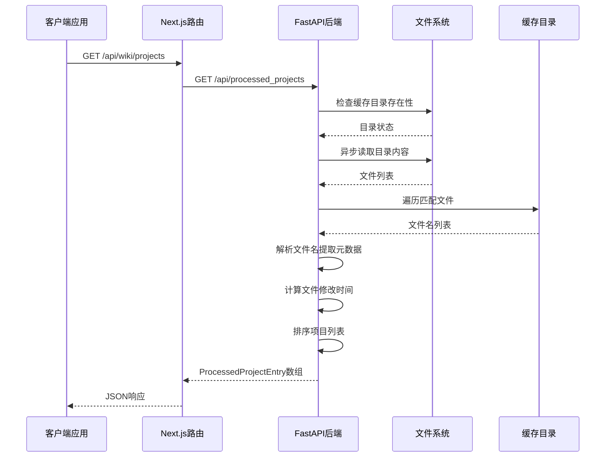
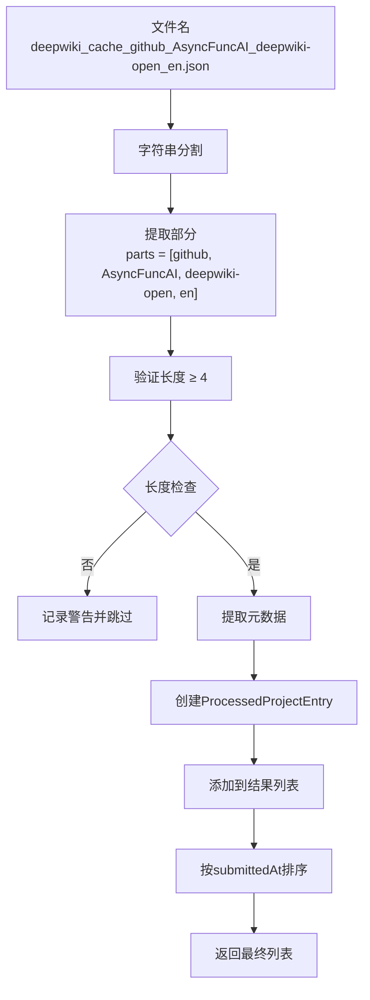
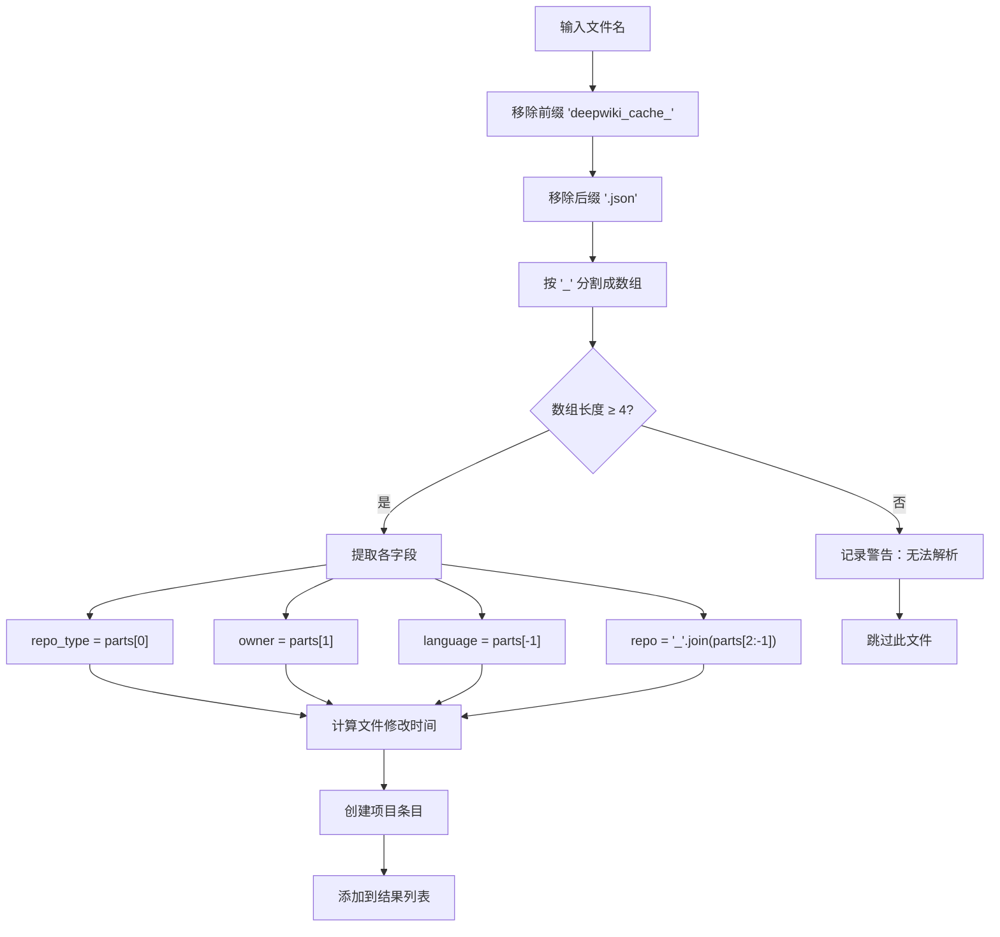
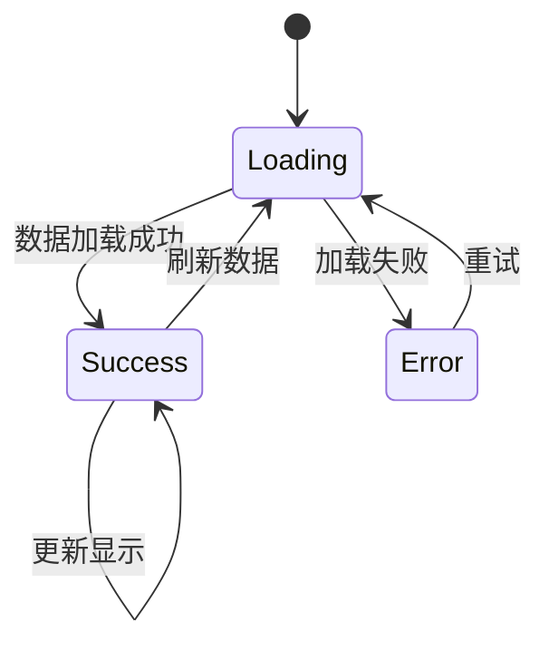

# 已处理项目API

<cite>
**本文档中引用的文件**
- [api.py](file://api/api.py)
- [route.ts](file://src/app/api/wiki/projects/route.ts)
- [useProcessedProjects.ts](file://src/hooks/useProcessedProjects.ts)
- [ProcessedProjects.tsx](file://src/components/ProcessedProjects.tsx)
- [page.tsx](file://src/app/wiki/projects/page.tsx)
- [config.py](file://api/config.py)
- [repoinfo.tsx](file://src/types/repoinfo.tsx)
</cite>

## 目录
1. [简介](#简介)
2. [端点概述](#端点概述)
3. [端点架构](#端点架构)
4. [数据结构详解](#数据结构详解)
5. [文件扫描机制](#文件扫描机制)
6. [前端集成](#前端集成)
7. [使用示例](#使用示例)
8. [错误处理](#错误处理)
9. [性能考虑](#性能考虑)
10. [故障排除](#故障排除)

## 简介

已处理项目API是deepwiki-open系统的核心组件之一，专门负责扫描和管理存储在本地缓存目录中的已处理项目。该API通过`GET /api/processed_projects`端点提供对`~/.adalflow/wikicache/`目录中所有以`deepwiki_cache_`开头的JSON缓存文件的访问功能。

该端点的主要目的是为用户提供一个统一的接口来查看之前生成的维基文档项目，支持快速访问和管理历史项目数据。

## 端点概述

### 基础信息

- **端点路径**: `/api/processed_projects`
- **HTTP方法**: `GET`
- **响应类型**: `List[ProcessedProjectEntry]`
- **认证要求**: 无（公开访问）

### 功能特性

- **自动扫描**: 自动扫描指定缓存目录中的所有匹配文件
- **智能解析**: 从文件名中提取项目元数据
- **时间排序**: 按最后修改时间降序排列项目
- **错误容错**: 跳过损坏或格式不正确的文件
- **异步处理**: 使用异步I/O操作提高性能

## 端点架构



**图表来源**
- [api.py](file://api/api.py#L577-L634)
- [route.ts](file://src/app/api/wiki/projects/route.ts#L38-L72)

## 数据结构详解

### ProcessedProjectEntry结构

ProcessedProjectEntry是该端点返回的核心数据结构，包含以下字段：

| 字段名 | 类型 | 描述 | 示例值 |
|--------|------|------|--------|
| `id` | `string` | 完整的文件名（包含扩展名） | `"deepwiki_cache_github_AsyncFuncAI_deepwiki-open_en.json"` |
| `owner` | `string` | 仓库所有者名称 | `"AsyncFuncAI"` |
| `repo` | `string` | 仓库名称 | `"deepwiki-open"` |
| `name` | `string` | 组合的仓库标识符 | `"AsyncFuncAI/deepwiki-open"` |
| `repo_type` | `string` | 仓库类型（如github、gitlab） | `"github"` |
| `submittedAt` | `int` | 最后修改时间的时间戳（毫秒） | `1704067200000` |
| `language` | `string` | 内容语言代码 | `"en"` |

### 数据流转换



**图表来源**
- [api.py](file://api/api.py#L601-L620)

**节来源**
- [api.py](file://api/api.py#L51-L58)
- [api.py](file://api/api.py#L601-L620)

## 文件扫描机制

### 扫描策略

系统采用智能扫描策略来识别和处理缓存文件：

1. **文件名模式匹配**: 只处理以`deepwiki_cache_`开头且以`.json`结尾的文件
2. **目录遍历**: 使用异步I/O操作避免阻塞主线程
3. **元数据提取**: 从文件名中解析出仓库类型、所有者、仓库名和语言信息
4. **时间戳获取**: 使用文件系统统计信息获取最后修改时间

### 文件名解析算法



**图表来源**
- [api.py](file://api/api.py#L594-L620)

### 错误处理机制

- **文件不存在**: 返回空列表而不抛出异常
- **权限问题**: 记录错误日志并跳过相关文件
- **格式错误**: 记录警告但继续处理其他文件
- **I/O异常**: 记录详细错误信息并终止处理

**节来源**
- [api.py](file://api/api.py#L586-L634)

## 前端集成

### React Hook集成

系统提供了专门的React Hook来简化前端集成：

```typescript
interface ProcessedProject {
  id: string;
  owner: string;
  repo: string;
  name: string;
  repo_type: string;
  submittedAt: number;
  language: string;
}

export function useProcessedProjects() {
  const [projects, setProjects] = useState<ProcessedProject[]>([]);
  const [isLoading, setIsLoading] = useState(true);
  const [error, setError] = useState<string | null>(null);
}
```

### 组件化展示

ProcessedProjects组件提供了灵活的UI展示选项：

- **卡片视图**: 适合小规模项目列表
- **列表视图**: 适合大规模项目列表
- **搜索功能**: 支持按名称、所有者或仓库搜索
- **删除功能**: 允许用户删除特定项目缓存

### 状态管理



**图表来源**
- [useProcessedProjects.ts](file://src/hooks/useProcessedProjects.ts#L13-L46)
- [ProcessedProjects.tsx](file://src/components/ProcessedProjects.tsx#L56-L81)

**节来源**
- [useProcessedProjects.ts](file://src/hooks/useProcessedProjects.ts#L1-L46)
- [ProcessedProjects.tsx](file://src/components/ProcessedProjects.tsx#L1-L270)

## 使用示例

### 基本API调用

```javascript
// 直接调用Python后端
const response = await fetch('/api/processed_projects');
const projects = await response.json();

// 输出示例结构
console.log(projects);
/*
[
  {
    "id": "deepwiki_cache_github_AsyncFuncAI_deepwiki-open_en.json",
    "owner": "AsyncFuncAI",
    "repo": "deepwiki-open",
    "name": "AsyncFuncAI/deepwiki-open",
    "repo_type": "github",
    "submittedAt": 1704067200000,
    "language": "en"
  }
]
*/
```

### React Hook使用

```typescript
import { useProcessedProjects } from '@/hooks/useProcessedProjects';

function ProjectList() {
  const { projects, isLoading, error } = useProcessedProjects();

  if (isLoading) return <div>加载中...</div>;
  if (error) return <div>错误: {error}</div>;

  return (
    <ul>
      {projects.map(project => (
        <li key={project.id}>
          <a href={`/${project.owner}/${project.repo}`}>
            {project.name} ({project.repo_type})
          </a>
          <span>{new Date(project.submittedAt).toLocaleString()}</span>
        </li>
      ))}
    </ul>
  );
}
```

### 错误处理示例

```javascript
try {
  const response = await fetch('/api/wiki/projects');
  
  if (!response.ok) {
    const errorData = await response.json();
    console.error('API错误:', errorData);
    throw new Error(`HTTP错误: ${response.status}`);
  }
  
  const projects = await response.json();
  console.log('找到的项目数量:', projects.length);
  
} catch (error) {
  console.error('网络错误或连接失败:', error);
}
```

**节来源**
- [route.ts](file://src/app/api/wiki/projects/route.ts#L38-L72)
- [useProcessedProjects.ts](file://src/hooks/useProcessedProjects.ts#L18-L42)

## 错误处理

### 后端错误处理

FastAPI后端实现了全面的错误处理机制：

- **文件系统错误**: 捕获并记录I/O异常
- **解析错误**: 跳过格式不正确的文件名
- **系统级错误**: 返回适当的HTTP状态码和错误信息
- **日志记录**: 详细的错误日志用于调试

### 前端错误处理

Next.js路由层提供了健壮的错误处理：

- **网络错误**: 捕获Fetch API异常
- **解析错误**: 处理JSON解析失败
- **状态码处理**: 根据HTTP状态码提供适当的错误信息
- **用户友好**: 显示清晰的错误消息给用户

### 错误响应格式

```json
{
  "error": "Failed to connect to the Python backend. Network error"
}
```

**节来源**
- [route.ts](file://src/app/api/wiki/projects/route.ts#L58-L72)
- [api.py](file://api/api.py#L632-L634)

## 性能考虑

### 异步I/O优化

系统采用多种技术来确保高性能：

- **异步目录遍历**: 使用`asyncio.to_thread`避免阻塞事件循环
- **文件系统统计**: 并行获取文件元数据
- **内存管理**: 及时释放不需要的数据结构
- **缓存策略**: 避免重复的文件系统操作

### 内存使用优化

- **流式处理**: 不一次性加载所有文件内容
- **对象池**: 重用临时对象减少GC压力
- **延迟加载**: 按需加载项目详情

### 网络优化

- **无缓存请求**: 设置`cache: 'no-store'`确保获取最新数据
- **超时控制**: 合理设置请求超时时间
- **重试机制**: 对临时性错误实施指数退避重试

## 故障排除

### 常见问题及解决方案

#### 1. 缓存目录不存在

**症状**: 端点返回空列表但没有错误日志

**原因**: `~/.adalflow/wikicache/`目录未创建

**解决方案**: 
- 检查目录是否存在
- 确认目录权限正确
- 手动创建目录或等待系统自动创建

#### 2. 文件名格式错误

**症状**: 某些项目无法正确显示

**原因**: 文件名不符合预期格式

**解决方案**:
- 检查文件名是否以`deepwiki_cache_`开头
- 确认文件扩展名为`.json`
- 验证文件名中包含至少4个下划线分隔的部分

#### 3. 权限问题

**症状**: 端点返回500内部服务器错误

**原因**: 应用程序没有访问缓存目录的权限

**解决方案**:
- 检查目录权限设置
- 确认应用程序运行用户具有读取权限
- 修改目录权限或更改运行用户

#### 4. 网络连接问题

**症状**: 前端显示"Failed to connect to the Python backend"

**原因**: Next.js代理无法连接到FastAPI服务

**解决方案**:
- 检查FastAPI服务是否正在运行
- 验证环境变量`PYTHON_BACKEND_HOST`
- 确认防火墙设置允许必要的端口通信

### 调试技巧

1. **启用详细日志**: 在开发环境中增加日志级别
2. **直接测试后端**: 使用curl或Postman直接测试Python API
3. **检查文件系统**: 验证缓存文件的实际存在性和格式
4. **监控资源使用**: 检查CPU和内存使用情况

**节来源**
- [api.py](file://api/api.py#L587-L589)
- [route.ts](file://src/app/api/wiki/projects/route.ts#L58-L60)

## 结论

已处理项目API是deepwiki-open系统中不可或缺的组件，它通过智能的文件扫描和解析机制，为用户提供了便捷的项目管理和访问功能。该API的设计充分考虑了性能、可靠性和可维护性，为构建现代化的Web应用程序提供了坚实的基础。

通过合理的错误处理、异步I/O优化和前端集成，该API能够稳定高效地服务于各种应用场景，为用户提供流畅的体验。随着系统的不断发展，该API将继续发挥重要作用，支持更多高级功能和更好的用户体验。