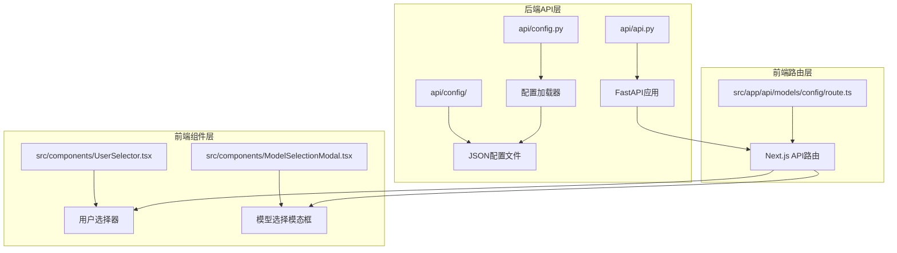
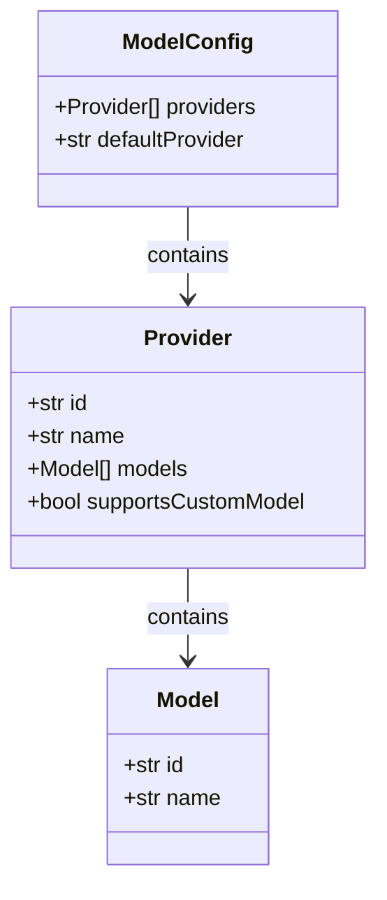
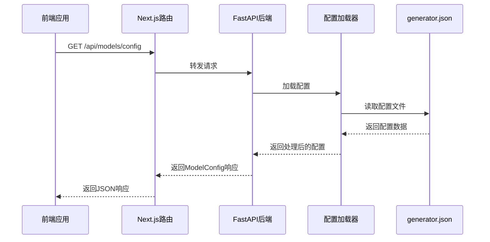
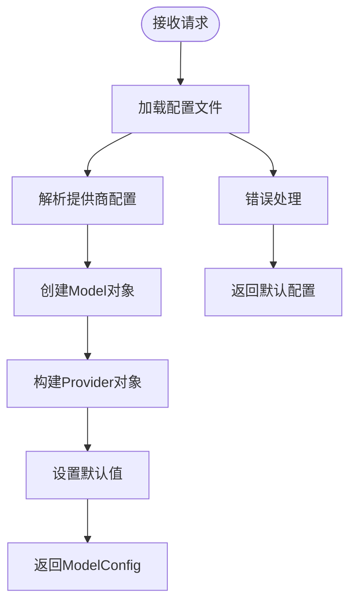
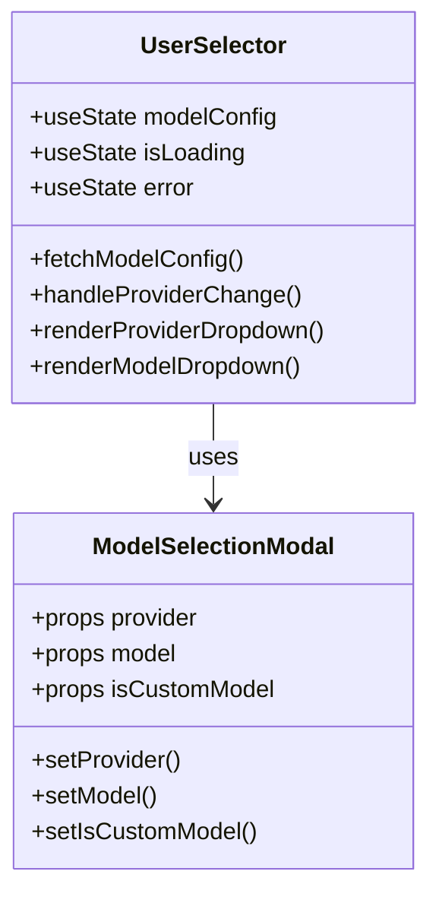
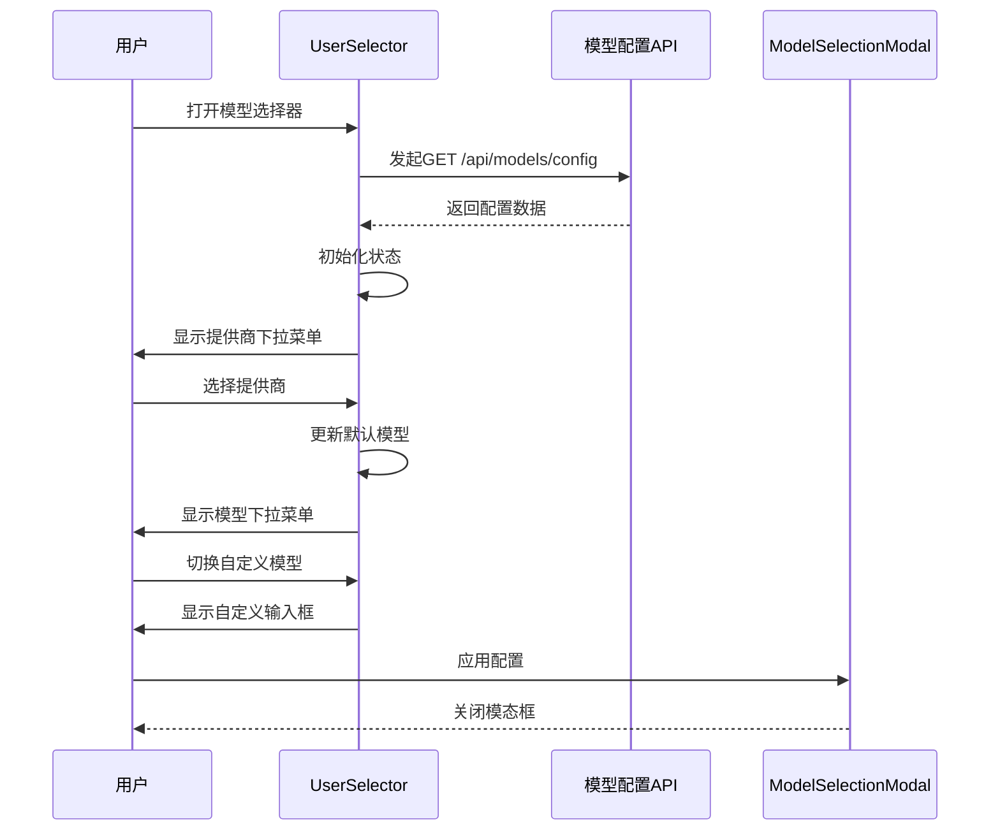
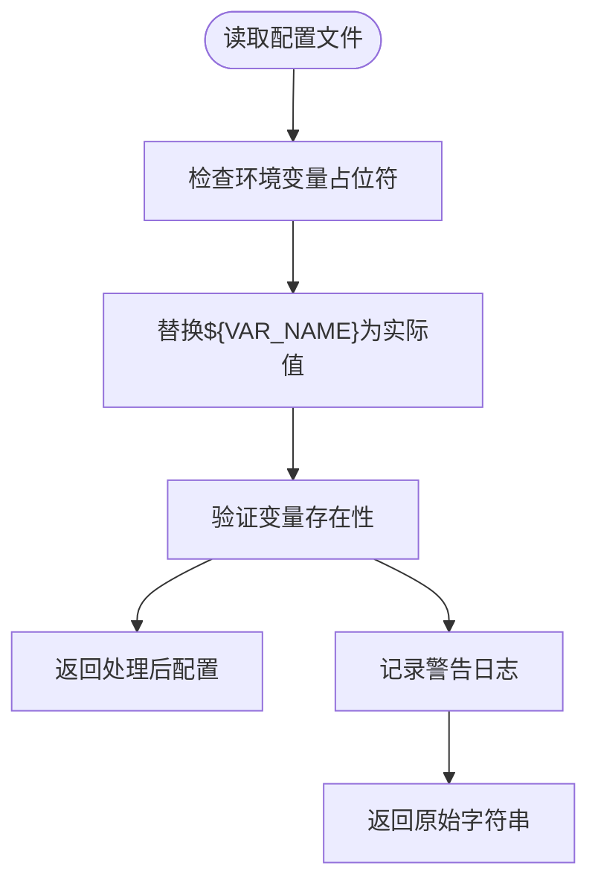
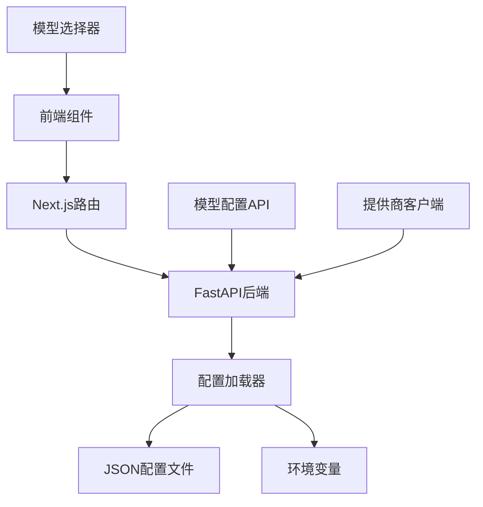

# 模型配置API

<cite>
**本文档中引用的文件**
- [generator.json](file://api/config/generator.json)
- [config.py](file://api/config.py)
- [route.ts](file://src/app/api/models/config/route.ts)
- [api.py](file://api/api.py)
- [UserSelector.tsx](file://src/components/UserSelector.tsx)
- [ModelSelectionModal.tsx](file://src/components/ModelSelectionModal.tsx)
- [embedder.json](file://api/config/embedder.json)
- [lang.json](file://api/config/lang.json)
</cite>

## 目录
1. [简介](#简介)
2. [项目结构](#项目结构)
3. [核心组件](#核心组件)
4. [架构概览](#架构概览)
5. [详细组件分析](#详细组件分析)
6. [依赖关系分析](#依赖关系分析)
7. [性能考虑](#性能考虑)
8. [故障排除指南](#故障排除指南)
9. [结论](#结论)

## 简介

deepwiki-open的模型配置API提供了统一的接口来管理多个大型语言模型（LLM）提供商的配置。该系统通过GET `/models/config`端点动态构建并返回可用的模型配置，支持Google、OpenAI、OpenRouter、Ollama、Bedrock、Azure和Dashscope等提供商。

该API系统的核心功能包括：
- 动态加载和解析generator.json配置文件
- 从config.py中读取providers定义
- 构建标准化的ModelConfig响应格式
- 支持环境变量与配置文件的关联
- 提供前端模型选择器的数据源

## 项目结构

**图表来源**
- [api.py](file://api/api.py#L1-L50)
- [route.ts](file://src/app/api/models/config/route.ts#L1-L49)

**章节来源**
- [api.py](file://api/api.py#L1-L635)
- [route.ts](file://src/app/api/models/config/route.ts#L1-L49)

## 核心组件

### ModelConfig响应模型

系统定义了三个核心的Pydantic模型来处理模型配置数据：

**图表来源**
- [api.py](file://api/api.py#L121-L142)

### 配置文件结构

系统通过以下配置文件管理模型提供商：

| 文件名 | 用途 | 包含内容 |
|--------|------|----------|
| generator.json | 主要模型配置 | 默认提供商、各提供商的模型列表和参数 |
| embedder.json | 嵌入器配置 | 不同嵌入器的客户端类和参数 |
| lang.json | 语言配置 | 支持的语言列表和默认语言 |

**章节来源**
- [generator.json](file://api/config/generator.json#L1-L200)
- [embedder.json](file://api/config/embedder.json#L1-L34)
- [lang.json](file://api/config/lang.json#L1-L16)

## 架构概览

**图表来源**
- [route.ts](file://src/app/api/models/config/route.ts#L6-L28)
- [api.py](file://api/api.py#L167-L208)

## 详细组件分析

### GET /models/config端点实现

该端点位于`api/api.py`中，负责处理模型配置请求：

**图表来源**
- [api.py](file://api/api.py#L167-L208)

#### 关键实现细节

1. **默认提供商确定逻辑**：
   - 从`configs["default_provider"]`获取默认提供商
   - 如果未设置，默认使用"google"
   - 在前端初始化时自动选择默认提供商

2. **模型名称处理**：
   - 使用`model_id`作为显示名称
   - 支持用户自定义模型名称（当提供商支持时）

3. **错误恢复机制**：
   - 配置加载失败时返回包含Google Gemini 2.5 Flash的默认配置
   - 确保前端始终能获得有效的配置数据

**章节来源**
- [api.py](file://api/api.py#L167-L208)

### 前端模型选择器

前端通过`UserSelector`组件消费模型配置API：

**图表来源**
- [UserSelector.tsx](file://src/components/UserSelector.tsx#L46-L523)
- [ModelSelectionModal.tsx](file://src/components/ModelSelectionModal.tsx#L48-L260)

#### 前端交互流程

**图表来源**
- [UserSelector.tsx](file://src/components/UserSelector.tsx#L83-L116)

**章节来源**
- [UserSelector.tsx](file://src/components/UserSelector.tsx#L1-L523)
- [ModelSelectionModal.tsx](file://src/components/ModelSelectionModal.tsx#L1-L260)

### 配置文件解析机制

系统通过`config.py`中的配置加载函数处理JSON配置文件：

#### 环境变量替换

**图表来源**
- [config.py](file://api/config.py#L66-L95)

#### 客户端类映射

系统维护了一个客户端类映射表，将提供商名称映射到对应的Python类：

| 提供商 | 客户端类 | 用途 |
|--------|----------|------|
| google | GoogleGenAIClient | Google Gemini模型 |
| openai | OpenAIClient | OpenAI模型 |
| openrouter | OpenRouterClient | OpenRouter模型 |
| ollama | OllamaClient | 本地Ollama模型 |
| bedrock | BedrockClient | AWS Bedrock模型 |
| azure | AzureAIClient | Azure OpenAI模型 |
| dashscope | DashscopeClient | 阿里云DashScope模型 |

**章节来源**
- [config.py](file://api/config.py#L55-L64)
- [config.py](file://api/config.py#L120-L144)

### 环境变量配置

系统支持多种环境变量来配置不同的提供商：

#### 必需的API密钥

| 变量名 | 用途 | 提供商 |
|--------|------|--------|
| GOOGLE_API_KEY | Google Gemini API密钥 | Google |
| OPENAI_API_KEY | OpenAI API密钥 | OpenAI |
| OPENROUTER_API_KEY | OpenRouter API密钥 | OpenRouter |

#### 可选的配置变量

| 变量名 | 默认值 | 描述 |
|--------|--------|------|
| OLLAMA_HOST | http://localhost:11434 | Ollama服务器地址 |
| PORT | 8001 | API服务器端口 |
| SERVER_BASE_URL | http://localhost:8001 | 服务器基础URL |
| DEEPWIKI_CONFIG_DIR | None | 自定义配置目录路径 |

**章节来源**
- [config.py](file://api/config.py#L18-L42)

## 依赖关系分析

**图表来源**
- [route.ts](file://src/app/api/models/config/route.ts#L1-L49)
- [api.py](file://api/api.py#L1-L635)
- [config.py](file://api/config.py#L1-L388)

### 组件耦合度

- **低耦合设计**：前端组件与后端API通过标准HTTP协议通信
- **配置驱动**：通过JSON配置文件控制提供商行为
- **可扩展性**：新增提供商只需修改配置文件和添加客户端类

**章节来源**
- [config.py](file://api/config.py#L303-L388)

## 性能考虑

### 缓存策略

- **静态配置缓存**：配置文件在应用启动时加载并缓存
- **无状态设计**：API端点不保存会话状态，支持水平扩展
- **快速响应**：配置加载时间通常小于100ms

### 优化建议

1. **配置预热**：在应用启动时预先加载所有配置
2. **CDN支持**：对于静态配置文件，可以考虑CDN分发
3. **连接池**：对远程提供商保持连接池以减少延迟

## 故障排除指南

### 常见问题及解决方案

#### 1. 配置加载失败

**症状**：前端显示默认配置而非预期的提供商列表

**可能原因**：
- generator.json文件不存在或格式错误
- 环境变量缺失或配置错误
- 文件权限问题

**解决步骤**：
1. 检查`api/config/generator.json`文件是否存在且格式正确
2. 验证相关环境变量是否已设置
3. 查看后端日志获取详细错误信息

#### 2. 前端模型选择器空白

**症状**：模型选择器显示"Loading model configurations..."但不加载

**可能原因**：
- API端点不可访问
- 网络代理或CORS问题
- 前端路由配置错误

**解决步骤**：
1. 检查浏览器开发者工具中的网络请求
2. 验证API服务器是否正常运行
3. 确认CORS配置正确

#### 3. 特定提供商无法使用

**症状**：某个提供商出现在列表中但无法正常使用

**可能原因**：
- API密钥配置错误
- 网络连接问题
- 提供商服务不可用

**解决步骤**：
1. 验证对应环境变量设置
2. 检查网络连接
3. 查看提供商服务状态

**章节来源**
- [api.py](file://api/api.py#L209-L225)
- [UserSelector.tsx](file://src/components/UserSelector.tsx#L83-L116)

## 结论

deepwiki-open的模型配置API提供了一个灵活且可扩展的框架来管理多提供商的LLM配置。通过标准化的ModelConfig响应格式和动态配置加载机制，系统实现了：

1. **统一的配置接口**：所有提供商通过相同的API格式暴露
2. **灵活的配置管理**：支持JSON配置文件和环境变量
3. **良好的用户体验**：直观的前端模型选择界面
4. **强大的错误处理**：完善的默认配置回退机制
5. **高度的可扩展性**：易于添加新的提供商支持

该系统的设计充分体现了现代Web应用的最佳实践，为深度学习应用的开发提供了坚实的基础架构支持。