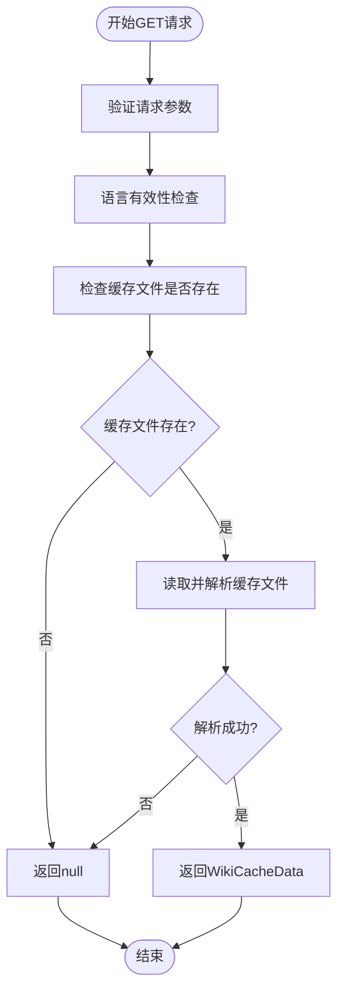

# 维基缓存API

<cite>
**本文档中引用的文件**
- [api.py](file://api/api.py)
- [route.ts](file://src/app/api/wiki/projects/route.ts)
- [page.tsx](file://src/app/[owner]/[repo]/page.tsx)
- [config.py](file://api/config.py)
- [README.md](file://README.md)
- [api/README.md](file://api/README.md)
</cite>

## 目录
1. [简介](#简介)
2. [项目结构](#项目结构)
3. [核心组件](#核心组件)
4. [架构概览](#架构概览)
5. [详细组件分析](#详细组件分析)
6. [依赖关系分析](#依赖关系分析)
7. [性能考虑](#性能考虑)
8. [故障排除指南](#故障排除指南)
9. [结论](#结论)

## 简介

DeepWiki Open是一个强大的维基内容生成和管理平台，其维基缓存API提供了对已生成维基数据的高效存储、检索和管理功能。该API支持三个主要操作：GET用于检索缓存数据、POST用于存储新生成的数据、DELETE用于删除特定缓存条目。

该系统采用前后端分离架构，后端使用FastAPI提供RESTful API服务，前端使用Next.js构建用户界面。所有缓存数据都存储在本地文件系统中，确保数据隐私和离线可用性。

## 项目结构

维基缓存API的核心文件分布在以下目录结构中：


**图表来源**
- [api.py](file://api/api.py#L1-L50)
- [route.ts](file://src/app/api/wiki/projects/route.ts#L1-L30)

**章节来源**
- [api.py](file://api/api.py#L1-L100)
- [route.ts](file://src/app/api/wiki/projects/route.ts#L1-L50)

## 核心组件

### WikiCacheData模型
这是缓存数据的主要结构，包含完整的维基信息：

| 字段 | 类型 | 描述 |
|------|------|------|
| wiki_structure | WikiStructureModel | 维基结构信息，包含页面和章节组织 |
| generated_pages | Dict[str, WikiPage] | 生成的页面字典，键为页面ID |
| repo_url | Optional[str] | 仓库URL（向后兼容） |
| repo | Optional[RepoInfo] | 仓库信息对象 |
| provider | Optional[str] | LLM提供商名称 |
| model | Optional[str] | 使用的模型名称 |

### WikiCacheRequest模型
这是存储缓存数据时使用的请求体结构：

| 字段 | 类型 | 描述 |
|------|------|------|
| repo | RepoInfo | 仓库基本信息 |
| language | str | 内容语言 |
| wiki_structure | WikiStructureModel | 维基结构 |
| generated_pages | Dict[str, WikiPage] | 生成的页面 |
| provider | str | LLM提供商 |
| model | str | 使用的模型 |

### 缓存文件系统
缓存文件按照统一的命名规范存储在本地文件系统中：

```
~/.adalflow/wikicache/deepwiki_cache_{repo_type}_{owner}_{repo}_{language}.json
```

例如：
```
~/.adalflow/wikicache/deepwiki_cache_github_AsyncFuncAI_deepwiki-open_en.json
```

**章节来源**
- [api.py](file://api/api.py#L90-L110)
- [api.py](file://api/api.py#L408-L411)

## 架构概览

维基缓存API采用分层架构设计，确保良好的可扩展性和维护性：


**图表来源**
- [api.py](file://api/api.py#L461-L502)
- [route.ts](file://src/app/api/wiki/projects/route.ts#L75-L104)

## 详细组件分析

### GET /api/wiki_cache 端点

GET请求用于检索指定仓库和语言的缓存维基数据。

#### 请求参数

| 参数名 | 类型 | 必需 | 描述 |
|--------|------|------|------|
| owner | str | 是 | 仓库所有者 |
| repo | str | 是 | 仓库名称 |
| repo_type | str | 是 | 仓库类型（如github、gitlab） |
| language | str | 是 | 内容语言 |

#### 响应格式

```typescript
// 成功响应（找到缓存）
{
  "wiki_structure": WikiStructureModel,
  "generated_pages": Dict[str, WikiPage],
  "repo_url": Optional[str],
  "repo": Optional[RepoInfo],
  "provider": Optional[str],
  "model": Optional[str]
}

// 成功响应（未找到缓存）
null

// 错误响应
{
  "error": "错误描述",
  "status": 400 | 500
}
```

#### 实现流程



**图表来源**
- [api.py](file://api/api.py#L461-L484)

**章节来源**
- [api.py](file://api/api.py#L461-L484)

### POST /api/wiki_cache 端点

POST请求用于存储新生成的维基数据到服务器端缓存。

#### 请求体结构

```typescript
interface WikiCacheRequest {
  repo: RepoInfo;
  language: string;
  wiki_structure: WikiStructureModel;
  generated_pages: Dict<string, WikiPage>;
  provider: string;
  model: string;
}
```

#### 存储流程


**图表来源**
- [api.py](file://api/api.py#L486-L502)

#### 错误处理

| 错误类型 | HTTP状态码 | 描述 |
|----------|------------|------|
| 数据验证失败 | 400 | 请求体格式不正确 |
| 语言不支持 | 400 | 指定的语言不受支持 |
| 文件写入失败 | 500 | 缓存文件写入过程中发生错误 |

**章节来源**
- [api.py](file://api/api.py#L486-L502)

### DELETE /api/wiki_cache 端点

DELETE请求用于删除特定的维基缓存文件，支持可选的身份验证机制。

#### 请求参数

| 参数名 | 类型 | 必需 | 描述 |
|--------|------|------|------|
| owner | str | 是 | 仓库所有者 |
| repo | str | 是 | 仓库名称 |
| repo_type | str | 是 | 仓库类型 |
| language | str | 是 | 内容语言 |
| authorization_code | Optional[str] | 否 | 身份验证码（当WIKI_AUTH_MODE启用时必需） |

#### 认证机制

系统支持可选的身份验证模式：


**图表来源**
- [api.py](file://api/api.py#L504-L538)

#### 删除流程

1. **身份验证检查**：如果启用了WIKI_AUTH_MODE，则验证提供的授权码
2. **文件存在性检查**：确认目标缓存文件存在
3. **文件删除**：安全地删除缓存文件
4. **响应返回**：返回操作结果

**章节来源**
- [api.py](file://api/api.py#L504-L538)

### 前端集成示例

#### 获取缓存数据

```typescript
// 在React组件中获取缓存数据
const fetchCachedWiki = async (owner: string, repo: string, language: string) => {
  try {
    const params = new URLSearchParams({
      owner,
      repo,
      repo_type: 'github',
      language
    });
    
    const response = await fetch(`/api/wiki_cache?${params.toString()}`);
    
    if (response.ok) {
      const cachedData = await response.json();
      if (cachedData) {
        // 使用缓存的维基数据
        return cachedData;
      }
    }
  } catch (error) {
    console.error('获取缓存失败:', error);
  }
};
```

#### 存储新生成的数据

```typescript
// 存储新的维基数据到缓存
const saveWikiToCache = async (dataToCache: WikiCacheRequest) => {
  try {
    const response = await fetch('/api/wiki_cache', {
      method: 'POST',
      headers: {
        'Content-Type': 'application/json',
      },
      body: JSON.stringify(dataToCache),
    });
    
    if (response.ok) {
      console.log('维基数据成功保存到缓存');
    } else {
      console.error('保存维基数据到缓存失败:', response.status);
    }
  } catch (error) {
    console.error('保存到缓存时出错:', error);
  }
};
```

#### 删除缓存数据

```typescript
// 删除特定的缓存数据
const deleteWikiCache = async (owner: string, repo: string, language: string) => {
  try {
    const params = new URLSearchParams({
      owner,
      repo,
      repo_type: 'github',
      language,
      authorization_code: authCode, // 可选，当需要身份验证时
    });
    
    const response = await fetch(`/api/wiki_cache?${params.toString()}`, {
      method: 'DELETE',
    });
    
    if (response.ok) {
      console.log('缓存删除成功');
    } else if (response.status === 401) {
      setError('授权码验证失败');
    } else {
      console.error('删除缓存失败:', response.status);
    }
  } catch (error) {
    console.error('删除缓存时出错:', error);
  }
};
```

**章节来源**
- [page.tsx](file://src/app/[owner]/[repo]/page.tsx#L1689-L1928)
- [route.ts](file://src/app/api/wiki/projects/route.ts#L75-L104)

## 依赖关系分析

维基缓存API的依赖关系图展示了各组件之间的交互：


**图表来源**
- [api.py](file://api/api.py#L1-L50)
- [route.ts](file://src/app/api/wiki/projects/route.ts#L1-L30)

### 外部依赖

| 依赖项 | 版本要求 | 用途 |
|--------|----------|------|
| FastAPI | 最新稳定版 | Web框架和API路由 |
| Pydantic | 最新稳定版 | 数据验证和序列化 |
| Python | 3.8+ | 运行时环境 |
| Next.js | 13+ | 前端框架 |

**章节来源**
- [api.py](file://api/api.py#L1-L20)
- [config.py](file://api/config.py#L1-L50)

## 性能考虑

### 缓存性能优化

1. **异步I/O操作**：所有文件系统操作都使用异步方法，避免阻塞主线程
2. **内存缓存**：频繁访问的缓存数据可以考虑内存缓存
3. **压缩存储**：对于大型维基数据，可以考虑压缩存储
4. **并发控制**：限制同时进行的缓存操作数量

### 文件系统优化

1. **原子写入**：使用临时文件和重命名操作确保数据完整性
2. **权限管理**：设置适当的文件权限保护缓存数据
3. **磁盘空间监控**：定期清理过期或无效的缓存文件

### 网络优化

1. **请求合并**：将多个小请求合并为单个批量请求
2. **响应压缩**：对大型响应启用gzip压缩
3. **连接池**：复用HTTP连接减少建立开销

## 故障排除指南

### 常见问题及解决方案

#### 缓存文件无法读取

**症状**：GET请求返回null或出现文件不存在错误

**可能原因**：
- 缓存文件路径配置错误
- 文件权限不足
- 文件被意外删除

**解决方案**：
1. 检查`~/.adalflow/wikicache/`目录是否存在
2. 验证文件权限设置
3. 查看API日志获取详细错误信息

#### 缓存文件写入失败

**症状**：POST请求返回500错误

**可能原因**：
- 磁盘空间不足
- 目标目录权限不足
- 文件锁定冲突

**解决方案**：
1. 检查磁盘可用空间
2. 验证写入权限
3. 重启API服务释放文件锁

#### 身份验证失败

**症状**：DELETE请求返回401错误

**可能原因**：
- WIKI_AUTH_MODE已启用但未提供有效授权码
- 授权码配置错误

**解决方案**：
1. 检查环境变量`DEEPWIKI_AUTH_MODE`设置
2. 验证`DEEPWIKI_AUTH_CODE`配置
3. 提供正确的授权码作为查询参数

### 调试工具

#### 日志分析

API服务器会记录详细的调试信息：

```python
# 启动时的日志
logger.info(f"Attempting to retrieve wiki cache for {owner}/{repo} ({repo_type}), lang: {language}")

# 成功操作的日志
logger.info(f"Wiki cache successfully saved to {cache_path}")

# 错误情况的日志
logger.error(f"Error reading wiki cache from {cache_path}: {e}")
```

#### 缓存状态检查

```bash
# 检查缓存目录
ls -la ~/.adalflow/wikicache/

# 检查特定缓存文件
cat ~/.adalflow/wikicache/deepwiki_cache_*.json
```

**章节来源**
- [api.py](file://api/api.py#L476-L484)
- [api.py](file://api/api.py#L447-L451)

## 结论

DeepWiki Open的维基缓存API提供了一个完整、高效的解决方案来管理和存储生成的维基内容。通过标准化的RESTful接口、可靠的文件系统存储和灵活的配置选项，该系统能够满足各种规模的应用需求。

### 主要优势

1. **数据持久化**：所有缓存数据都存储在本地文件系统中，确保数据安全和离线可用性
2. **跨平台兼容**：支持多种操作系统和部署方式
3. **可扩展性**：模块化设计便于功能扩展和维护
4. **安全性**：可选的身份验证机制保护敏感数据
5. **易用性**：简洁的API设计降低集成复杂度

### 最佳实践建议

1. **定期备份**：定期备份`~/.adalflow/wikicache/`目录
2. **监控空间**：监控缓存目录的磁盘使用情况
3. **版本控制**：对配置文件进行版本控制
4. **性能监控**：监控API响应时间和错误率
5. **安全配置**：在生产环境中启用适当的安全措施

该API为DeepWiki Open平台提供了坚实的基础，支持高效的维基内容生成和管理工作流。