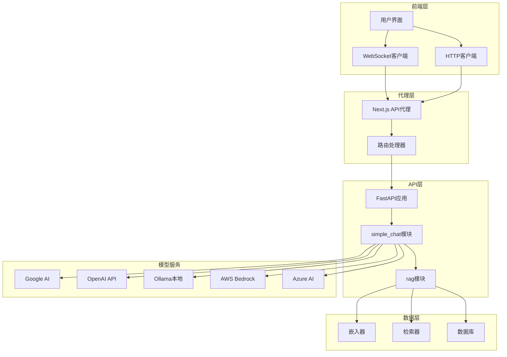
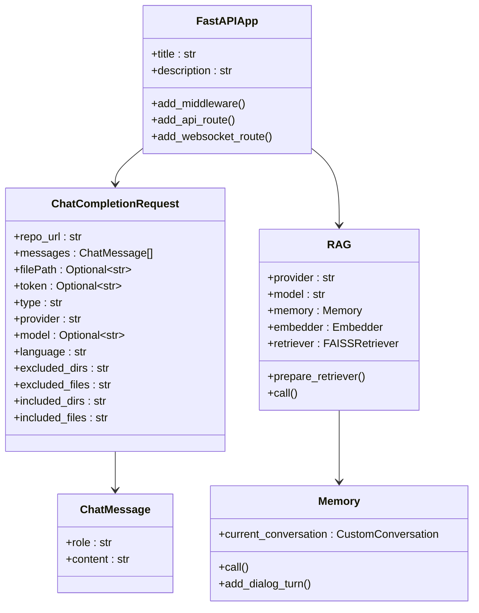
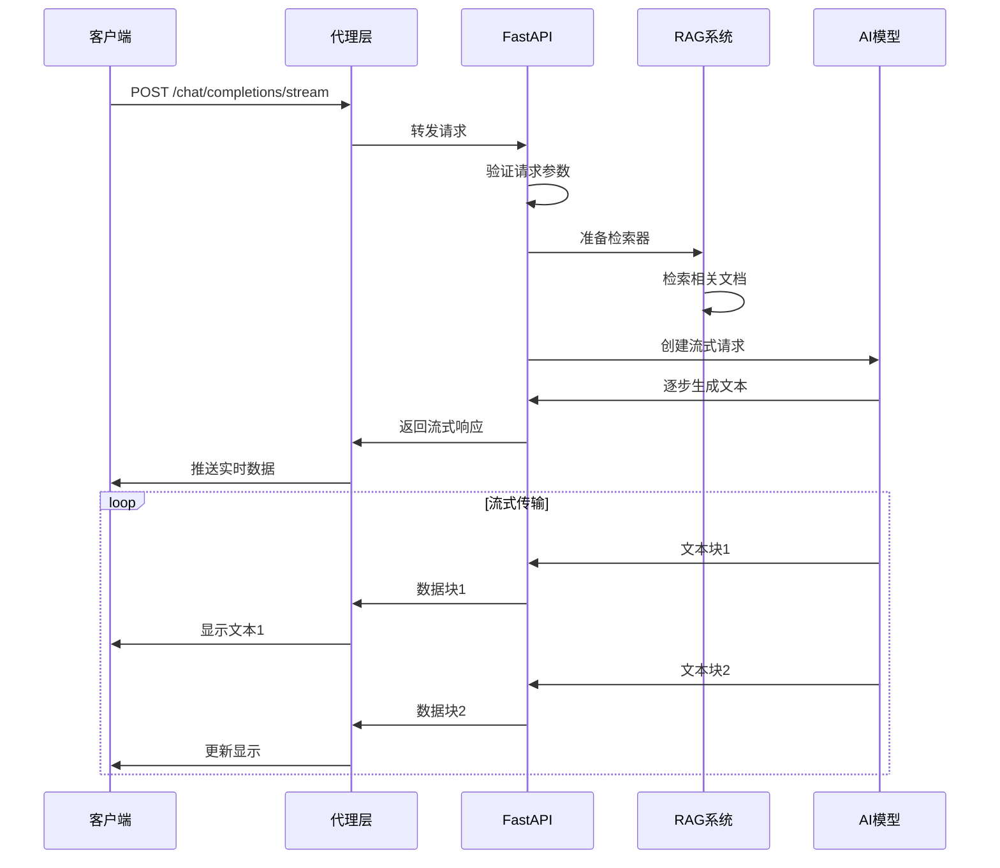
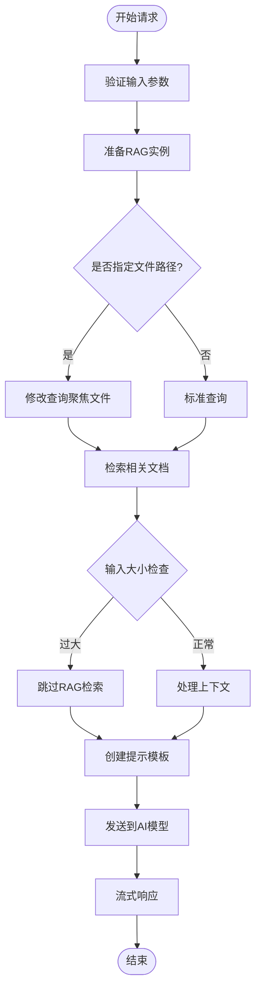
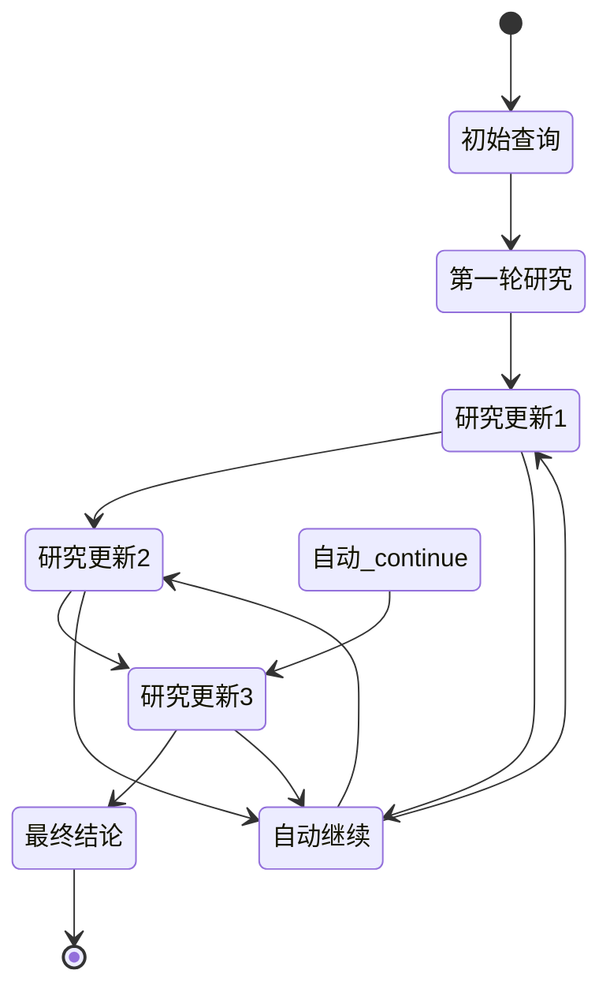

# 聊天流API

<cite>
**本文档中引用的文件**
- [api/simple_chat.py](file://api/simple_chat.py)
- [api/rag.py](file://api/rag.py)
- [api/api.py](file://api/api.py)
- [api/main.py](file://api/main.py)
- [api/prompts.py](file://api/prompts.py)
- [src/app/api/chat/stream/route.ts](file://src/app/api/chat/stream/route.ts)
- [src/components/Ask.tsx](file://src/components/Ask.tsx)
- [src/utils/websocketClient.ts](file://src/utils/websocketClient.ts)
</cite>

## 目录
1. [简介](#简介)
2. [项目架构概览](#项目架构概览)
3. [核心组件分析](#核心组件分析)
4. [API端点详细说明](#api端点详细说明)
5. [流式响应机制](#流式响应机制)
6. [RAG系统集成](#rag系统集成)
7. [客户端实现](#客户端实现)
8. [错误处理与优化](#错误处理与优化)
9. [使用示例](#使用示例)
10. [故障排除指南](#故障排除指南)

## 简介

DeepWiki Open的聊天流API是一个基于FastAPI构建的强大对话系统，提供了实时流式响应功能。该系统通过`POST /chat/completions/stream`端点实现了类似ChatGPT的实时打字体验，支持多种AI模型提供商，并集成了先进的RAG（检索增强生成）系统来提供准确的代码库知识回答。

### 主要特性

- **实时流式响应**：支持渐进式文本生成，提供即时反馈
- **多模型支持**：兼容Google Gemini、OpenAI、OpenRouter、Ollama、AWS Bedrock和Azure AI
- **RAG增强**：智能检索相关文档内容以提高回答准确性
- **深研究功能**：支持多轮迭代的深度分析过程
- **文件级精确检索**：针对特定文件路径的上下文感知查询
- **错误恢复机制**：自动处理令牌限制和网络错误

## 项目架构概览



**图表来源**
- [api/api.py](file://api/api.py#L397-L398)
- [src/app/api/chat/stream/route.ts](file://src/app/api/chat/stream/route.ts#L1-L113)

## 核心组件分析

### FastAPI应用架构

系统采用模块化设计，主要包含以下核心组件：



**图表来源**
- [api/simple_chat.py](file://api/simple_chat.py#L51-L74)
- [api/rag.py](file://api/rag.py#L144-L153)

**章节来源**
- [api/simple_chat.py](file://api/simple_chat.py#L1-L690)
- [api/rag.py](file://api/rag.py#L1-L446)

## API端点详细说明

### POST /chat/completions/stream

这是系统的核心端点，负责处理流式聊天完成请求。

#### 请求结构

| 字段名 | 类型 | 必需 | 描述 |
|--------|------|------|------|
| repo_url | string | 是 | 要查询的仓库URL |
| messages | Array[ChatMessage] | 是 | 对话消息列表 |
| filePath | string | 否 | 可选的文件路径，用于聚焦特定文件的上下文 |
| token | string | 否 | 私有仓库的个人访问令牌 |
| type | string | 否 | 仓库类型（github、gitlab、bitbucket，默认为github） |
| provider | string | 否 | 模型提供商（google、openai、openrouter、ollama、bedrock、azure，默认为google） |
| model | string | 否 | 指定提供商的模型名称 |
| language | string | 否 | 内容生成语言（en、ja、zh、es、kr、vi，默认为en） |
| excluded_dirs | string | 否 | 逗号分隔的要排除的目录列表 |
| excluded_files | string | 否 | 逗号分隔的要排除的文件模式列表 |
| included_dirs | string | 否 | 逗号分隔的要包含的目录列表 |
| included_files | string | 否 | 逗号分隔的要包含的文件模式列表 |

#### 响应格式

返回类型：`StreamingResponse`
媒体类型：`text/event-stream`

每个响应块包含：
- 文本数据
- 实时更新的对话状态
- 错误处理信息

**章节来源**
- [api/simple_chat.py](file://api/simple_chat.py#L55-L74)
- [api/api.py](file://api/api.py#L397-L398)

## 流式响应机制

### 实现原理

系统采用异步生成器模式实现真正的流式响应：



**图表来源**
- [api/simple_chat.py](file://api/simple_chat.py#L447-L677)
- [src/app/api/chat/stream/route.ts](file://src/app/api/chat/stream/route.ts#L49-L72)

### 多提供商流式支持

系统为不同AI提供商实现了专门的流式处理逻辑：

#### Google Generative AI
- 使用原生流式API
- 支持实时文本块生成
- 自动处理生成配置

#### OpenAI/OpenRouter
- 兼容OpenAI流式格式
- 支持Delta对象增量更新
- 错误重试机制

#### Ollama
- 本地模型流式支持
- 特殊字符清理
- 性能优化处理

#### AWS Bedrock & Azure AI
- 统一错误处理
- 连接状态监控
- 自动故障转移

**章节来源**
- [api/simple_chat.py](file://api/simple_chat.py#L447-L677)

## RAG系统集成

### 检索增强生成流程



**图表来源**
- [api/simple_chat.py](file://api/simple_chat.py#L186-L238)
- [api/rag.py](file://api/rag.py#L345-L446)

### 嵌入验证与过滤

RAG系统包含强大的嵌入验证机制：

| 验证步骤 | 描述 | 错误处理 |
|----------|------|----------|
| 嵌入大小一致性检查 | 确保所有文档具有相同维度的向量 | 过滤不匹配的文档 |
| 空向量检测 | 排除无效或空的嵌入向量 | 记录警告并跳过 |
| 数组形状验证 | 处理不同格式的向量表示 | 自动转换格式 |
| 异常捕获 | 捕获验证过程中的意外错误 | 提供降级方案 |

**章节来源**
- [api/rag.py](file://api/rag.py#L251-L375)

## 客户端实现

### WebSocket vs HTTP回退

系统提供两种客户端连接方式：

#### WebSocket连接（推荐）
```typescript
// WebSocket客户端实现
const ws = new WebSocket(getWebSocketUrl());
ws.onopen = () => {
  ws.send(JSON.stringify(request));
};
ws.onmessage = (event) => {
  onMessage(event.data);
};
```

#### HTTP流式回退
```typescript
// HTTP流式处理
const reader = apiResponse.body?.getReader();
const decoder = new TextDecoder();
while (true) {
  const { done, value } = await reader.read();
  if (done) break;
  const chunk = decoder.decode(value, { stream: true });
  fullResponse += chunk;
  setResponse(fullResponse);
}
```

### 深研究功能

系统支持多轮迭代的深度分析：



**图表来源**
- [src/utils/websocketClient.ts](file://src/utils/websocketClient.ts#L43-L74)
- [src/components/Ask.tsx](file://src/components/Ask.tsx#L405-L480)

**章节来源**
- [src/utils/websocketClient.ts](file://src/utils/websocketClient.ts#L1-L86)
- [src/components/Ask.tsx](file://src/components/Ask.tsx#L405-L480)

## 错误处理与优化

### 令牌限制处理

系统实现了智能的令牌限制恢复机制：

1. **初始请求**：尝试完整上下文
2. **令牌溢出**：自动移除上下文重新请求
3. **降级策略**：简化提示模板
4. **用户通知**：清晰的错误信息

### 网络错误恢复

| 错误类型 | 检测方法 | 恢复策略 |
|----------|----------|----------|
| 连接超时 | 超时检测 | 自动重试 |
| API密钥错误 | 错误消息解析 | 用户提示 |
| 嵌入失败 | 异常捕获 | 跳过RAG |
| 模型不可用 | 状态码检查 | 选择备用模型 |

### 性能优化

- **并发控制**：限制同时请求数量
- **缓存机制**：重用相似查询结果
- **流式优先**：最小化等待时间
- **资源管理**：及时释放连接

**章节来源**
- [api/simple_chat.py](file://api/simple_chat.py#L525-L677)

## 使用示例

### 基础聊天请求

```bash
curl -X POST "http://localhost:8001/chat/completions/stream" \
  -H "Content-Type: application/json" \
  -d '{
    "repo_url": "https://github.com/AsyncFuncAI/deepwiki-open",
    "messages": [
      {"role": "user", "content": "这个项目的目的是什么？"}
    ],
    "provider": "google",
    "model": "gemini-pro"
  }'
```

### 文件级精确查询

```bash
curl -X POST "http://localhost:8001/chat/completions/stream" \
  -H "Content-Type: application/json" \
  -d '{
    "repo_url": "https://github.com/AsyncFuncAI/deepwiki-open",
    "filePath": "api/simple_chat.py",
    "messages": [
      {"role": "user", "content": "解释这个文件的主要功能"}
    ],
    "provider": "google"
  }'
```

### 深研究请求

```bash
curl -X POST "http://localhost:8001/chat/completions/stream" \
  -H "Content-Type: application/json" \
  -d '{
    "repo_url": "https://github.com/AsyncFuncAI/deepwiki-open",
    "messages": [
      {"role": "user", "content": "[DEEP RESEARCH] 分析这个项目的架构设计"}
    ],
    "provider": "google"
  }'
```

### JavaScript客户端示例

```javascript
// 使用WebSocket
const ws = createChatWebSocket(request, 
  (message) => { console.log(message); },
  (error) => { console.error(error); },
  () => { console.log('连接关闭'); }
);

// 使用HTTP回退
const response = await fetch('/api/chat/stream', {
  method: 'POST',
  headers: { 'Content-Type': 'application/json' },
  body: JSON.stringify(request)
});

const reader = response.body.getReader();
const decoder = new TextDecoder();
while (true) {
  const { done, value } = await reader.read();
  if (done) break;
  const chunk = decoder.decode(value);
  updateUI(chunk);
}
```

## 故障排除指南

### 常见问题及解决方案

#### 1. API密钥配置错误
**症状**：收到"API key not configured"错误
**解决**：设置正确的环境变量
```bash
export GOOGLE_API_KEY="your-key-here"
export OPENAI_API_KEY="your-key-here"
```

#### 2. 令牌限制错误
**症状**：请求被拒绝，提示令牌过多
**解决**：减少输入长度或使用更短的模型

#### 3. 网络连接问题
**症状**：连接超时或无法建立WebSocket
**解决**：检查防火墙设置和代理配置

#### 4. 嵌入验证失败
**症状**："No valid documents with embeddings found"
**解决**：重新运行文档处理管道

#### 5. 模型不可用
**症状**：模型调用失败
**解决**：切换到其他可用的提供商

### 调试技巧

1. **启用详细日志**：设置`DEBUG=true`
2. **检查健康检查**：访问`/health`端点
3. **监控资源使用**：观察内存和CPU占用
4. **测试连接性**：验证各组件间的通信

**章节来源**
- [api/main.py](file://api/main.py#L47-L52)
- [api/simple_chat.py](file://api/simple_chat.py#L115-L128)

## 结论

DeepWiki Open的聊天流API提供了一个强大而灵活的对话系统，结合了现代AI技术的最佳实践。通过流式响应、RAG增强和多提供商支持，它能够为用户提供高质量的代码库问答体验。系统的模块化设计确保了良好的可扩展性和维护性，而完善的错误处理机制则保证了服务的稳定性。

无论是用于代码审查、架构分析还是学习目的，这个API都能提供专业级的智能助手功能，帮助开发者更高效地理解和使用复杂的开源项目。