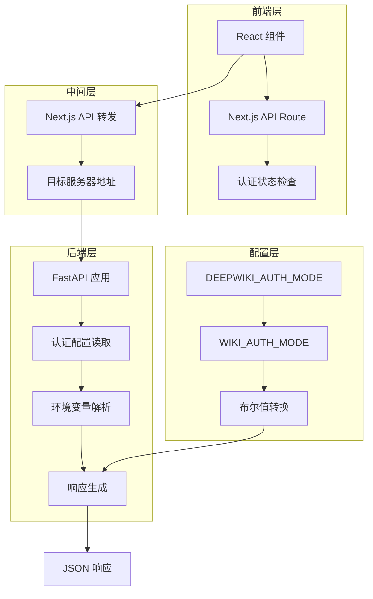
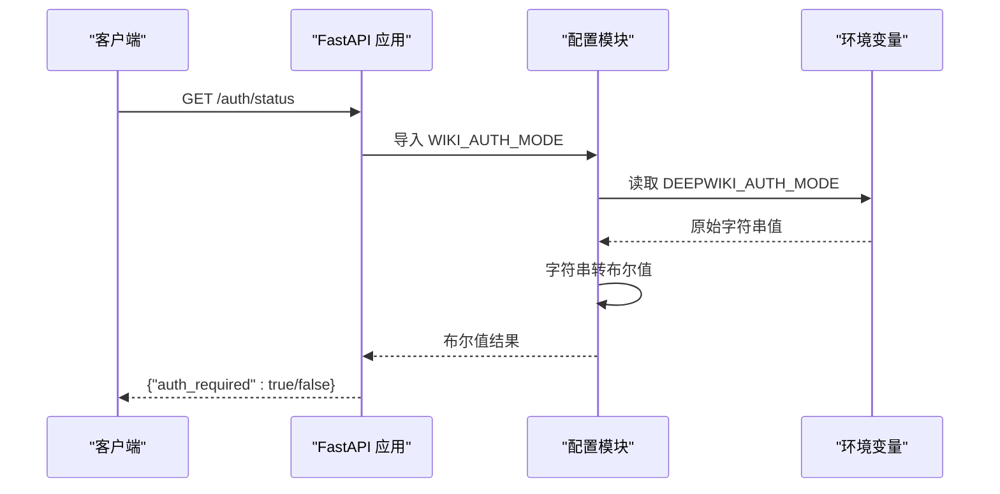
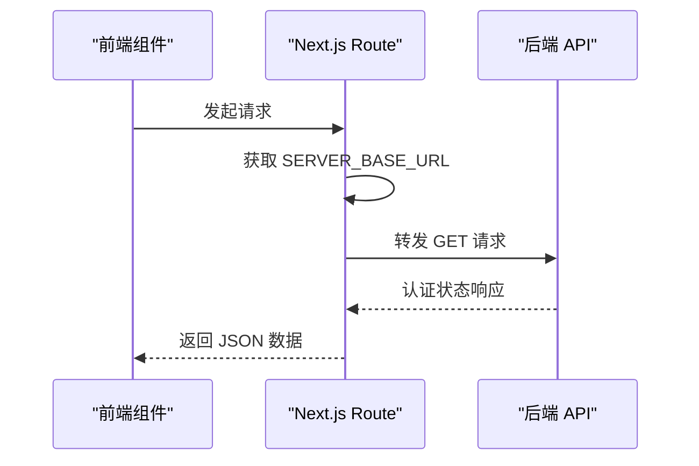
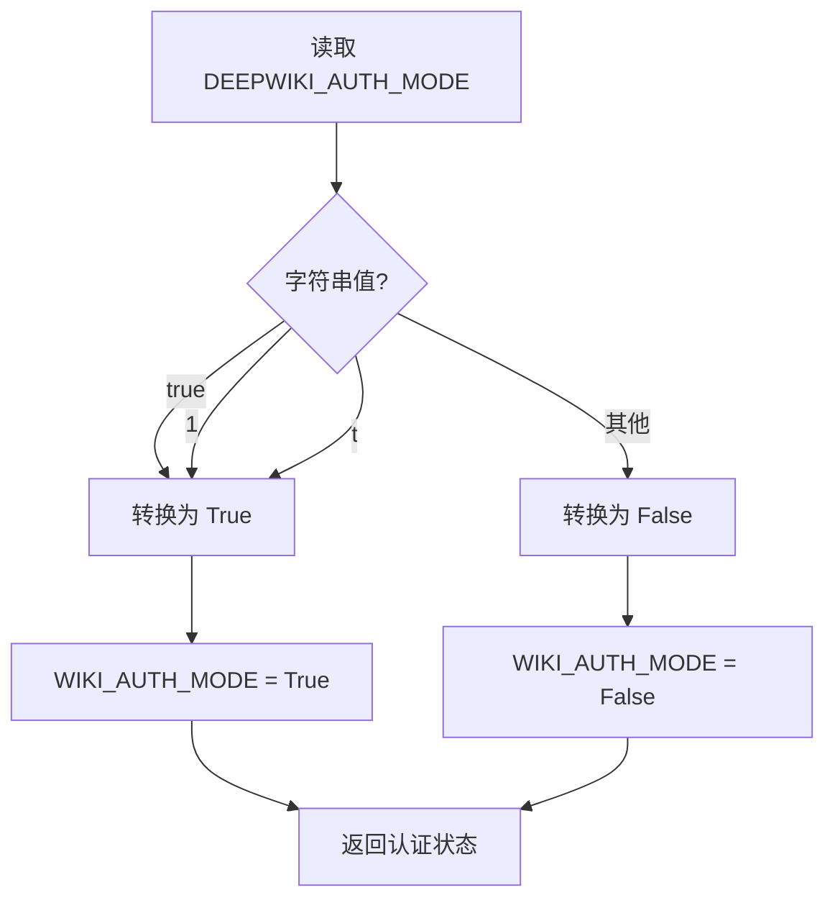
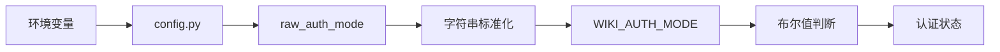
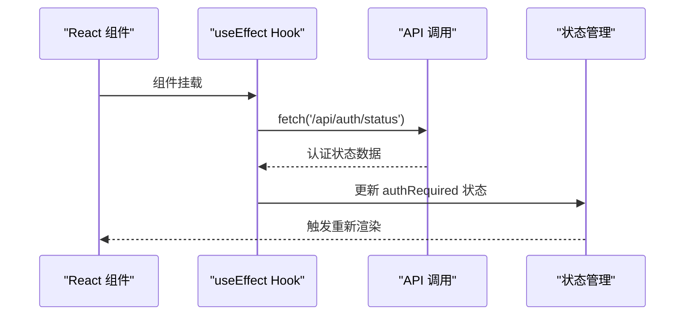
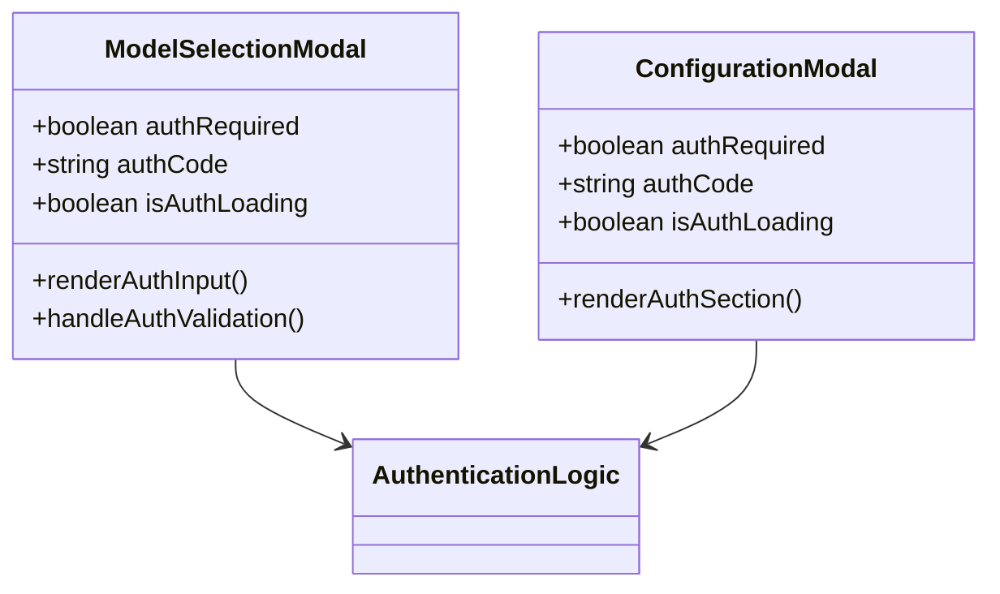
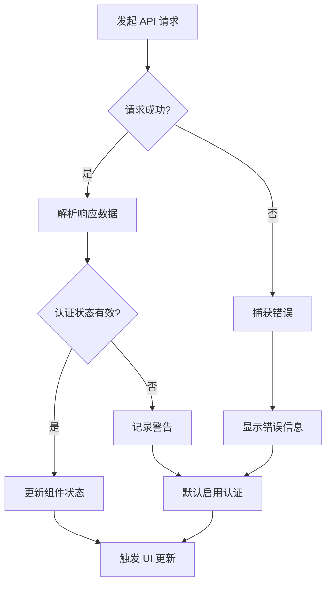

# /auth/status 端点详细API文档

<cite>
**本文档中引用的文件**
- [src/app/api/auth/status/route.ts](file://src/app/api/auth/status/route.ts)
- [api/api.py](file://api/api.py)
- [api/config.py](file://api/config.py)
- [src/app/page.tsx](file://src/app/page.tsx)
- [src/app/[owner]/[repo]/page.tsx](file://src/app/[owner]/[repo]/page.tsx)
- [src/components/ModelSelectionModal.tsx](file://src/components/ModelSelectionModal.tsx)
- [src/components/ConfigurationModal.tsx](file://src/components/ConfigurationModal.tsx)
- [README.md](file://README.md)
</cite>

## 目录
1. [简介](#简介)
2. [端点概述](#端点概述)
3. [技术架构](#技术架构)
4. [详细实现分析](#详细实现分析)
5. [配置与环境变量](#配置与环境变量)
6. [前端集成](#前端集成)
7. [响应格式与状态码](#响应格式与状态码)
8. [使用示例](#使用示例)
9. [错误处理](#错误处理)
10. [最佳实践](#最佳实践)

## 简介

/auth/status 端点是 DeepWiki 系统中的关键认证检查接口，负责向前端应用程序报告当前系统是否启用了身份验证机制。该端点通过返回 `{"auth_required": WIKI_AUTH_MODE}` 响应，使前端能够根据系统认证状态决定是否显示认证模态框或直接允许用户访问核心功能。

## 端点概述

### HTTP 方法
- **GET** `/auth/status`

### 功能描述
该端点的主要职责是：
- 检查系统是否启用了基于环境变量的认证机制
- 返回认证状态信息给前端应用程序
- 支持前后端分离的架构设计

### URL 路径
- **Next.js API 路由**: `/api/auth/status`
- **后端 FastAPI 端点**: `/auth/status`

## 技术架构



**图表来源**
- [src/app/api/auth/status/route.ts](file://src/app/api/auth/status/route.ts#L1-L31)
- [api/api.py](file://api/api.py#L152-L158)
- [api/config.py](file://api/config.py#L43-L46)

## 详细实现分析

### 后端实现 (FastAPI)

后端的 /auth/status 端点实现在 `api/api.py` 文件中，采用简洁的设计模式：



**图表来源**
- [api/api.py](file://api/api.py#L152-L158)
- [api/config.py](file://api/config.py#L43-L46)

**节源**
- [api/api.py](file://api/api.py#L152-L158)
- [api/config.py](file://api/config.py#L43-L46)

### 前端转发实现 (Next.js)

前端通过 Next.js API 路由实现对后端端点的转发：



**图表来源**
- [src/app/api/auth/status/route.ts](file://src/app/api/auth/status/route.ts#L5-L31)

**节源**
- [src/app/api/auth/status/route.ts](file://src/app/api/auth/status/route.ts#L1-L31)

## 配置与环境变量

### 核心配置项

| 环境变量 | 类型 | 默认值 | 描述 |
|---------|------|--------|------|
| `DEEPWIKI_AUTH_MODE` | 字符串 | `"False"` | 控制是否启用认证模式 |
| `DEEPWIKI_AUTH_CODE` | 字符串 | `""` | 认证所需的密钥代码 |

### 认证模式转换逻辑

系统通过以下逻辑将环境变量转换为布尔值：



**图表来源**
- [api/config.py](file://api/config.py#L43-L46)

**节源**
- [api/config.py](file://api/config.py#L43-L46)

### 配置加载流程



**图表来源**
- [api/config.py](file://api/config.py#L43-L46)

## 前端集成

### 认证状态获取

前端组件通过以下方式获取认证状态：



**图表来源**
- [src/app/page.tsx](file://src/app/page.tsx#L154-L173)
- [src/app/[owner]/[repo]/page.tsx](file://src/app/[owner]/[repo]/page.tsx#L349-L367)

**节源**
- [src/app/page.tsx](file://src/app/page.tsx#L154-L173)
- [src/app/[owner]/[repo]/page.tsx](file://src/app/[owner]/[repo]/page.tsx#L349-L367)

### 前端响应处理

前端根据认证状态决定UI行为：

| 认证状态 | 前端行为 | 显示内容 |
|---------|----------|----------|
| `auth_required: true` | 显示认证输入框 | 认证模态框 + 输入字段 |
| `auth_required: false` | 直接允许操作 | 主界面 + 生成按钮 |

### 认证模态框集成



**图表来源**
- [src/components/ModelSelectionModal.tsx](file://src/components/ModelSelectionModal.tsx#L213-L235)
- [src/components/ConfigurationModal.tsx](file://src/components/ConfigurationModal.tsx#L251-L273)

**节源**
- [src/components/ModelSelectionModal.tsx](file://src/components/ModelSelectionModal.tsx#L213-L235)
- [src/components/ConfigurationModal.tsx](file://src/components/ConfigurationModal.tsx#L251-L273)

## 响应格式与状态码

### 标准响应格式

**成功响应 (200 OK)**:
```json
{
  "auth_required": true
}
```

**响应字段说明**:
- `auth_required`: 布尔值，指示系统是否需要认证

### 错误响应格式

**后端服务不可达 (500 Internal Server Error)**:
```json
{
  "error": "Backend server returned 500"
}
```

**网络错误 (500 Internal Server Error)**:
```json
{
  "error": "Internal Server Error"
}
```

### HTTP 状态码映射

| 场景 | HTTP 状态码 | 响应类型 |
|------|-------------|----------|
| 成功获取认证状态 | 200 | 成功响应 |
| 后端服务返回错误 | 对应后端状态码 | 错误响应 |
| 网络连接失败 | 500 | 内部服务器错误 |

## 使用示例

### 基本使用示例

**JavaScript 示例**:
```javascript
// 获取认证状态
async function checkAuthStatus() {
  try {
    const response = await fetch('/api/auth/status');
    if (!response.ok) {
      throw new Error(`HTTP error! status: ${response.status}`);
    }
    const data = await response.json();
    return data.auth_required;
  } catch (error) {
    console.error('Failed to fetch auth status:', error);
    // 默认认为需要认证以确保安全
    return true;
  }
}

// 使用示例
const authRequired = await checkAuthStatus();
if (authRequired) {
  // 显示认证模态框
  showModalWithAuthInput();
} else {
  // 直接允许操作
  allowDirectAccess();
}
```

### React 组件集成示例

**节源**
- [src/app/page.tsx](file://src/app/page.tsx#L154-L173)

### Next.js API 路由示例

**节源**
- [src/app/api/auth/status/route.ts](file://src/app/api/auth/status/route.ts#L5-L31)

## 错误处理

### 前端错误处理策略



**图表来源**
- [src/app/page.tsx](file://src/app/page.tsx#L165-L167)

### 错误恢复机制

1. **网络错误**: 默认假设需要认证以确保安全性
2. **后端错误**: 返回标准错误响应并记录日志
3. **解析错误**: 提供默认值避免应用崩溃

**节源**
- [src/app/page.tsx](file://src/app/page.tsx#L165-L167)

## 最佳实践

### 安全考虑

1. **默认安全策略**: 如果认证状态获取失败，默认启用认证
2. **错误边界**: 实现完善的错误处理机制
3. **状态管理**: 使用 React 状态正确管理认证状态

### 性能优化

1. **缓存策略**: 在前端适当缓存认证状态
2. **并发控制**: 避免重复的认证状态查询
3. **加载状态**: 显示适当的加载指示器

### 开发建议

1. **环境配置**: 正确设置 `DEEPWIKI_AUTH_MODE` 环境变量
2. **测试覆盖**: 编写单元测试验证认证逻辑
3. **监控告警**: 监控认证端点的可用性和性能

### 部署注意事项

1. **环境变量**: 确保生产环境中正确配置认证相关变量
2. **权限控制**: 结合其他安全措施实现完整的认证体系
3. **日志记录**: 记录认证相关的操作和异常

**节源**
- [README.md](file://README.md#L422-L432)