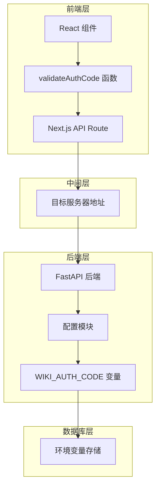
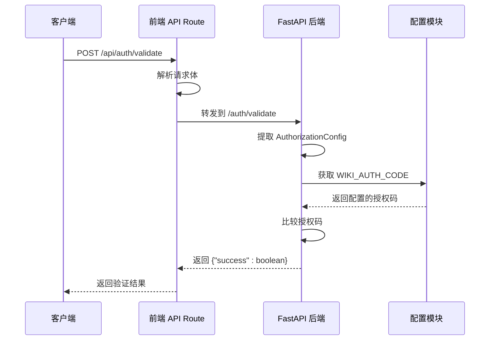
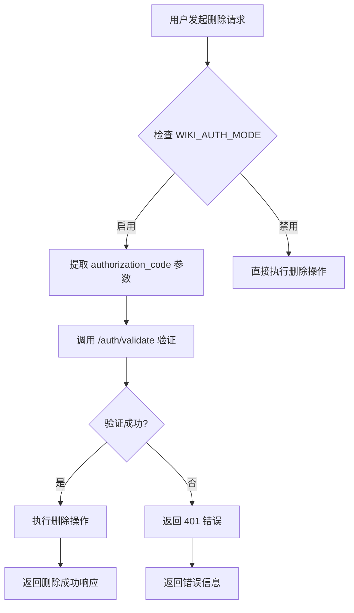

# /auth/validate 端点详细API文档

<cite>
**本文档中引用的文件**
- [src/app/api/auth/validate/route.ts](file://src/app/api/auth/validate/route.ts)
- [api/api.py](file://api/api.py)
- [api/config.py](file://api/config.py)
- [src/app/page.tsx](file://src/app/page.tsx)
- [src/components/ModelSelectionModal.tsx](file://src/components/ModelSelectionModal.tsx)
- [src/components/ConfigurationModal.tsx](file://src/components/ConfigurationModal.tsx)
- [api/api.py](file://api/api.py#L504-L539)
</cite>

## 目录
1. [简介](#简介)
2. [端点概述](#端点概述)
3. [架构设计](#架构设计)
4. [请求处理流程](#请求处理流程)
5. [核心组件分析](#核心组件分析)
6. [验证机制详解](#验证机制详解)
7. [错误处理机制](#错误处理机制)
8. [安全考虑](#安全考虑)
9. [使用示例](#使用示例)
10. [故障排除指南](#故障排除指南)

## 简介

/auth/validate 端点是 DeepWiki 项目中的关键认证验证组件，负责验证用户提供的授权码是否与系统配置的 WIKI_AUTH_CODE 匹配。该端点在保护敏感操作（如 DELETE /api/wiki_cache）中发挥着重要作用，确保只有经过授权的用户才能执行可能影响系统数据的操作。

## 端点概述

### 基本信息

| 属性 | 值 |
|------|-----|
| **端点路径** | `/auth/validate` |
| **HTTP 方法** | POST |
| **内容类型** | `application/json` |
| **认证要求** | 否 |
| **响应格式** | JSON |

### 请求体结构

```typescript
interface AuthorizationConfig {
  code: string;  // 授权码，必需字段
}
```

### 响应格式

#### 验证成功
```json
{
  "success": true
}
```

#### 验证失败
```json
{
  "success": false
}
```

## 架构设计



**图表来源**
- [src/app/api/auth/validate/route.ts](file://src/app/api/auth/validate/route.ts#L1-L34)
- [api/api.py](file://api/api.py#L160-L166)
- [api/config.py](file://api/config.py#L43-L46)

## 请求处理流程



**图表来源**
- [src/app/api/auth/validate/route.ts](file://src/app/api/auth/validate/route.ts#L5-L34)
- [api/api.py](file://api/api.py#L160-L166)

**节来源**
- [src/app/api/auth/validate/route.ts](file://src/app/api/auth/validate/route.ts#L1-L34)
- [api/api.py](file://api/api.py#L160-L166)

## 核心组件分析

### 前端 Next.js API Route

前端路由负责将客户端请求转发到后端服务，实现了统一的错误处理和响应格式化。

#### 主要功能
- **请求转发**：将前端请求转发到后端 API
- **错误处理**：捕获并处理转发过程中的错误
- **响应转换**：将后端响应转换为标准格式

#### 关键特性
- 使用环境变量 `SERVER_BASE_URL` 确定后端地址
- 实现了完整的异常处理机制
- 支持多种错误场景的优雅降级

**节来源**
- [src/app/api/auth/validate/route.ts](file://src/app/api/auth/validate/route.ts#L1-L34)

### 后端 FastAPI 处理器

后端处理器实现了核心的授权验证逻辑。

#### 验证算法
```python
return {"success": WIKI_AUTH_CODE == request.code}
```

#### 特性说明
- **简单高效**：直接字符串比较，性能优异
- **零依赖**：不依赖外部认证服务
- **状态无关**：独立于用户会话状态

**节来源**
- [api/api.py](file://api/api.py#L160-L166)

### 配置管理系统

配置系统负责管理授权模式和授权码。

#### 配置项
| 配置项 | 环境变量 | 默认值 | 描述 |
|--------|----------|--------|------|
| 认证模式 | `DEEPWIKI_AUTH_MODE` | `False` | 是否启用认证 |
| 授权码 | `DEEPWIKI_AUTH_CODE` | 空字符串 | 用于验证的授权码 |

#### 模式检测逻辑
```python
WIKI_AUTH_MODE = raw_auth_mode.lower() in ['true', '1', 't']
```

**节来源**
- [api/config.py](file://api/config.py#L43-L46)

## 验证机制详解

### 授权码比较逻辑

验证的核心在于将请求中的授权码与系统配置的授权码进行严格比较：

```python
# 验证逻辑
return {"success": WIKI_AUTH_CODE == request.code}
```

### 安全特性

1. **明文存储**：授权码以明文形式存储在环境变量中
2. **即时验证**：每次请求都进行实时验证
3. **无状态设计**：不维护任何会话状态
4. **快速响应**：验证过程几乎无延迟

### 与 DELETE /api/wiki_cache 的集成

/auth/validate 端点在保护敏感操作中起到关键作用：



**图表来源**
- [api/api.py](file://api/api.py#L519-L523)

**节来源**
- [api/api.py](file://api/api.py#L519-L523)

## 错误处理机制

### 前端错误处理

前端实现了多层次的错误处理策略：

#### 网络错误处理
```typescript
try {
  const response = await fetch('/api/auth/validate', {
    method: 'POST',
    headers: {'Content-Type': 'application/json'},
    body: JSON.stringify({'code': authCode})
  });
  
  if (!response.ok) {
    return false; // 网络错误或服务器错误
  }
  
  const data = await response.json();
  return data.success || false;
} catch {
  return false; // 异常处理
}
```

#### 错误分类
1. **网络错误**：连接超时、服务器不可达
2. **HTTP 错误**：4xx 客户端错误、5xx 服务器错误
3. **解析错误**：响应格式不正确
4. **业务错误**：授权码验证失败

### 后端错误处理

后端提供了完整的错误处理机制：

#### HTTP 状态码映射
| 场景 | HTTP 状态码 | 响应内容 |
|------|-------------|----------|
| 成功验证 | 200 | `{"success": true}` |
| 验证失败 | 200 | `{"success": false}` |
| 网络错误 | 500 | `{"error": "Internal Server Error"}` |

**节来源**
- [src/app/api/auth/validate/route.ts](file://src/app/api/auth/validate/route.ts#L18-L33)
- [api/api.py](file://api/api.py#L160-L166)

## 安全考虑

### 当前安全模型

#### 优势
- **简单性**：易于理解和部署
- **可靠性**：不依赖外部认证服务
- **性能**：零延迟验证

#### 限制
- **安全性**：仅适用于内部或受控环境
- **灵活性**：不支持多用户或多角色
- **审计**：缺乏操作日志记录

### 建议改进

1. **增强认证**：集成 JWT 或 OAuth2
2. **访问控制**：基于角色的权限管理
3. **审计日志**：记录所有验证尝试
4. **速率限制**：防止暴力破解攻击

## 使用示例

### 前端调用示例

```typescript
// React 组件中的使用
const [authCode, setAuthCode] = useState('');
const [authRequired, setAuthRequired] = useState(false);

const validateAuthCode = async () => {
  try {
    if (authRequired && !authCode) {
      return false;
    }
    
    const response = await fetch('/api/auth/validate', {
      method: 'POST',
      headers: {
        'Content-Type': 'application/json',
      },
      body: JSON.stringify({'code': authCode})
    });
    
    if (!response.ok) {
      return false;
    }
    
    const data = await response.json();
    return data.success || false;
  } catch {
    return false;
  }
};

// 在删除操作前验证
const handleDelete = async () => {
  const isValid = await validateAuthCode();
  if (!isValid) {
    setError('授权码验证失败');
    return;
  }
  
  // 执行删除操作
};
```

### API 调用示例

```bash
# 成功验证
curl -X POST http://localhost:3000/api/auth/validate \
  -H "Content-Type: application/json" \
  -d '{"code": "your-secret-code"}'

# 响应
{"success": true}

# 验证失败
curl -X POST http://localhost:3000/api/auth/validate \
  -H "Content-Type: application/json" \
  -d '{"code": "wrong-code"}'

# 响应
{"success": false}
```

### 集成示例

```typescript
// 在 DELETE /api/wiki_cache 前的验证流程
const deleteWikiCache = async (owner: string, repo: string) => {
  // 1. 获取认证状态
  const authStatus = await fetch('/api/auth/status').then(res => res.json());
  
  if (authStatus.auth_required) {
    // 2. 验证授权码
    const isValid = await validateAuthCode();
    if (!isValid) {
      throw new Error('授权码验证失败');
    }
  }
  
  // 3. 执行删除操作
  const response = await fetch(`/api/wiki_cache?owner=${owner}&repo=${repo}`, {
    method: 'DELETE',
    headers: {
      'Content-Type': 'application/json',
    }
  });
  
  if (!response.ok) {
    throw new Error('删除失败');
  }
  
  return response.json();
};
```

**节来源**
- [src/app/page.tsx](file://src/app/page.tsx#L267-L289)
- [api/api.py](file://api/api.py#L504-L539)

## 故障排除指南

### 常见问题及解决方案

#### 1. 验证总是失败

**症状**：无论输入什么授权码，都返回 `{"success": false}`

**可能原因**：
- 环境变量 `DEEPWIKI_AUTH_CODE` 未正确设置
- 后端服务未重启应用新的环境变量
- 前端发送的授权码与后端配置不匹配

**解决方案**：
```bash
# 检查环境变量
echo $DEEPWIKI_AUTH_CODE

# 设置环境变量
export DEEPWIKI_AUTH_CODE="your-secret-code"

# 重启后端服务
# （具体命令取决于部署方式）
```

#### 2. 前端验证失败

**症状**：前端调用 `/api/auth/validate` 返回错误

**诊断步骤**：
```typescript
// 添加调试信息
const debugValidation = async () => {
  try {
    const response = await fetch('/api/auth/validate', {
      method: 'POST',
      headers: {'Content-Type': 'application/json'},
      body: JSON.stringify({'code': 'test'})
    });
    
    console.log('Response status:', response.status);
    const data = await response.json();
    console.log('Response data:', data);
  } catch (error) {
    console.error('Validation error:', error);
  }
};
```

#### 3. 删除操作被拒绝

**症状**：尝试删除 wiki 缓存时收到 401 错误

**检查清单**：
1. 确认 `DEEPWIKI_AUTH_MODE` 设置为 `true`
2. 验证授权码是否正确
3. 确认前端已正确传递授权码参数

#### 4. 网络连接问题

**症状**：无法连接到验证端点

**解决方案**：
- 检查 `SERVER_BASE_URL` 环境变量
- 确认后端服务正在运行
- 检查防火墙和网络配置

### 调试工具

#### 1. 验证状态检查
```bash
# 检查认证状态
curl http://localhost:3000/api/auth/status
# 应返回 {"auth_required": true/false}
```

#### 2. 直接后端测试
```bash
# 直接测试后端 API
curl -X POST http://localhost:8001/auth/validate \
  -H "Content-Type: application/json" \
  -d '{"code": "your-code"}'
```

#### 3. 日志分析
```bash
# 查看后端日志
docker logs <container-id> | grep auth

# 查看前端日志
# （在浏览器开发者工具中查看 Network 和 Console 标签）
```

**节来源**
- [src/app/api/auth/validate/route.ts](file://src/app/api/auth/validate/route.ts#L18-L33)
- [api/api.py](file://api/api.py#L154-L158)

## 总结

/auth/validate 端点作为 DeepWiki 系统的安全屏障，提供了简单而有效的授权验证机制。虽然当前实现相对基础，但在适当的环境中能够满足基本的安全需求。对于生产环境，建议考虑升级到更强大的认证方案，同时保持现有接口的兼容性。

该端点的设计体现了微服务架构中的关注点分离原则，前端负责用户体验和请求转发，后端专注于业务逻辑处理，配置系统则提供了灵活的环境管理能力。这种分层设计使得系统既易于维护又便于扩展。