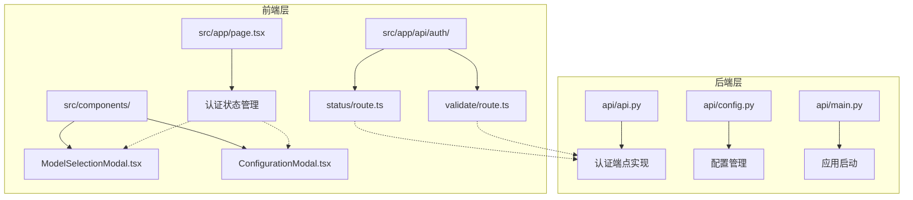
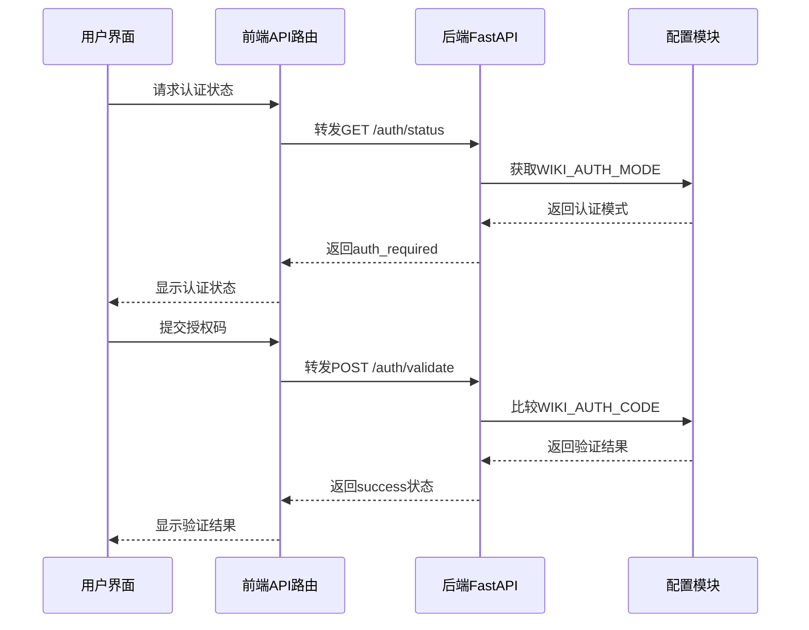
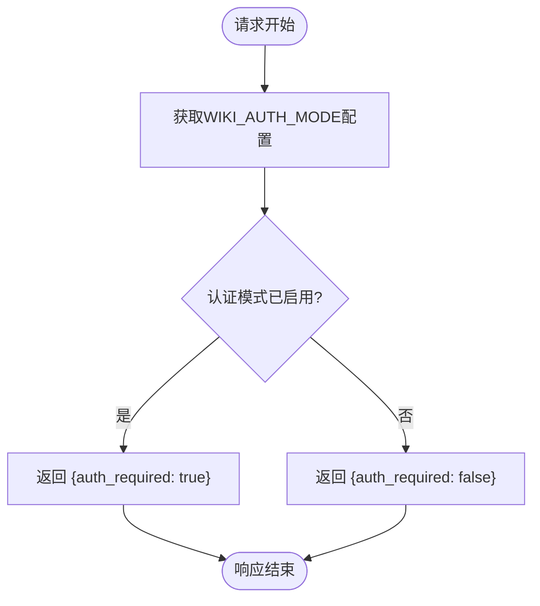
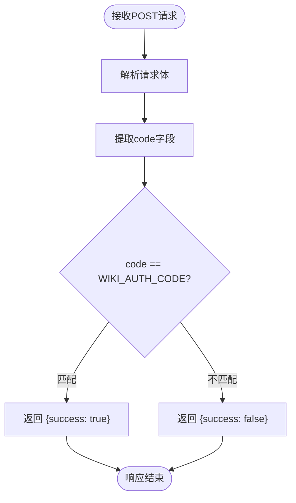
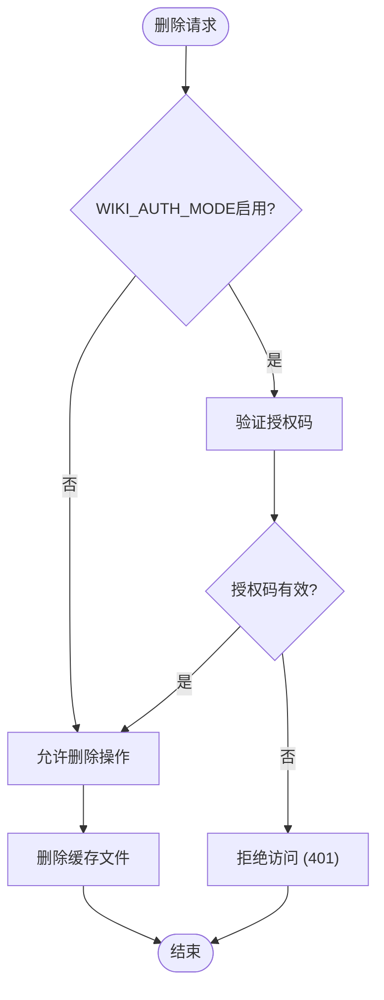
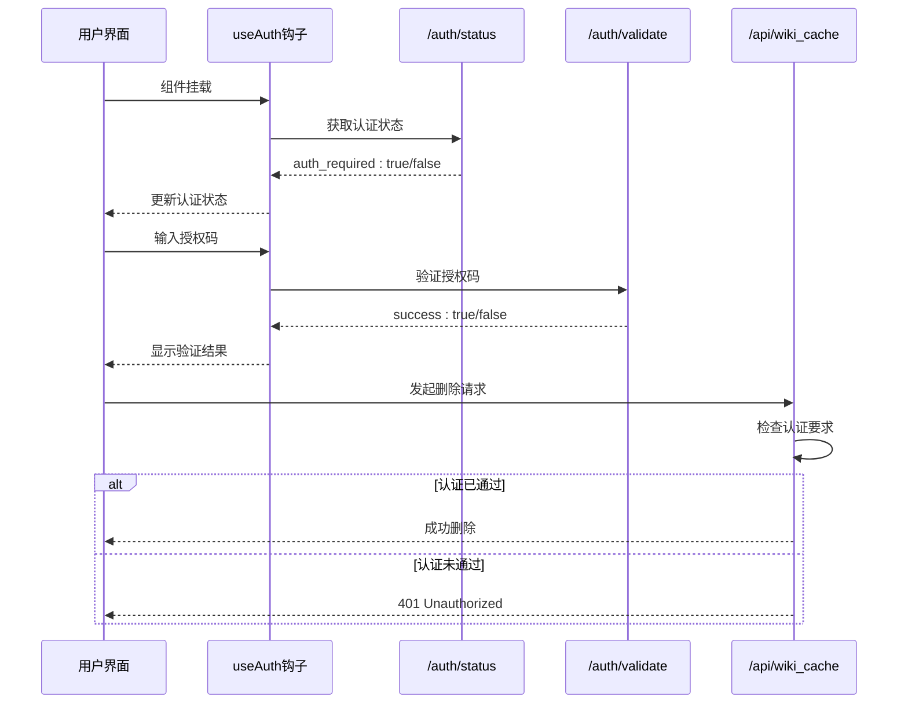
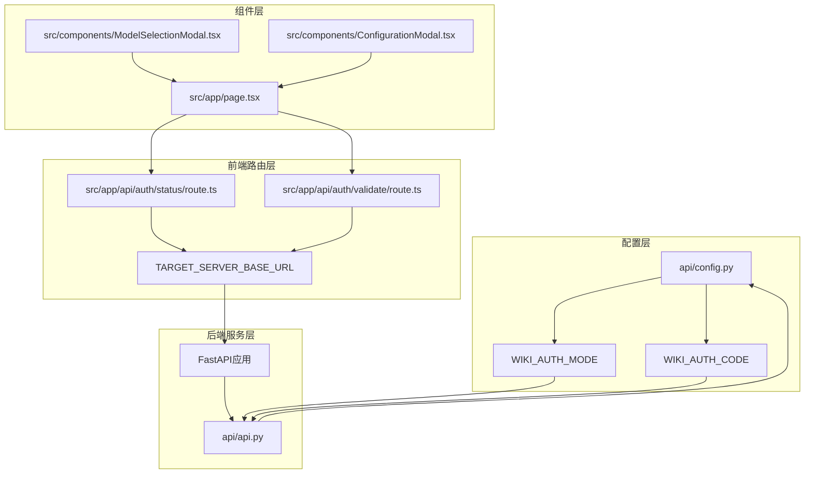

# 认证API

<cite>
**本文档中引用的文件**
- [src/app/api/auth/status/route.ts](file://src/app/api/auth/status/route.ts)
- [src/app/api/auth/validate/route.ts](file://src/app/api/auth/validate/route.ts)
- [api/api.py](file://api/api.py)
- [api/config.py](file://api/config.py)
- [src/app/page.tsx](file://src/app/page.tsx)
- [src/components/ModelSelectionModal.tsx](file://src/components/ModelSelectionModal.tsx)
- [src/components/ConfigurationModal.tsx](file://src/components/ConfigurationModal.tsx)
- [src/app/[owner]/[repo]/page.tsx](file://src/app/[owner]/[repo]/page.tsx)
- [api/main.py](file://api/main.py)
</cite>

## 目录
1. [简介](#简介)
2. [项目结构](#项目结构)
3. [核心组件](#核心组件)
4. [架构概览](#架构概览)
5. [详细组件分析](#详细组件分析)
6. [依赖关系分析](#依赖关系分析)
7. [性能考虑](#性能考虑)
8. [故障排除指南](#故障排除指南)
9. [结论](#结论)

## 简介

deepwiki-open项目实现了一个轻量级的认证系统，用于保护敏感操作（如删除wiki缓存）。该系统通过两个主要的API端点提供身份验证功能：`/auth/status`用于检查是否需要认证，`/auth/validate`用于验证授权码。认证机制基于环境变量配置，支持灵活的身份验证模式切换。

## 项目结构

认证系统的文件组织结构如下：



**图表来源**
- [src/app/api/auth/status/route.ts](file://src/app/api/auth/status/route.ts#L1-L32)
- [src/app/api/auth/validate/route.ts](file://src/app/api/auth/validate/route.ts#L1-L35)
- [api/api.py](file://api/api.py#L153-L166)

## 核心组件

### 配置管理组件

认证系统的核心配置通过环境变量控制：

| 配置项 | 类型 | 默认值 | 描述 |
|--------|------|--------|------|
| DEEPWIKI_AUTH_MODE | 布尔值 | False | 是否启用认证模式 |
| DEEPWIKI_AUTH_CODE | 字符串 | '' | 用于验证的授权码 |

### 前端认证组件

前端提供了多个认证相关的组件：
- **认证状态获取器**：负责从后端获取认证状态
- **授权码验证器**：处理用户输入的授权码验证
- **认证模态框**：提供用户界面用于输入授权码

**章节来源**
- [api/config.py](file://api/config.py#L43-L46)
- [src/app/page.tsx](file://src/app/page.tsx#L153-L170)

## 架构概览

认证系统采用分层架构设计，从前端到后端形成完整的认证流程：



**图表来源**
- [src/app/api/auth/status/route.ts](file://src/app/api/auth/status/route.ts#L5-L31)
- [src/app/api/auth/validate/route.ts](file://src/app/api/auth/validate/route.ts#L5-L34)
- [api/api.py](file://api/api.py#L153-L166)

## 详细组件分析

### /auth/status端点

#### 功能描述
`/auth/status`端点用于检查当前系统是否需要进行身份验证。该端点直接返回配置中的认证模式状态。

#### 实现细节



**图表来源**
- [api/api.py](file://api/api.py#L153-L158)

#### 前端集成

前端通过以下方式使用此端点：

```typescript
// 获取认证状态的示例代码路径
const fetchAuthStatus = async () => {
  const response = await fetch('/api/auth/status');
  const data = await response.json();
  setAuthRequired(data.auth_required);
};
```

**章节来源**
- [src/app/api/auth/status/route.ts](file://src/app/api/auth/status/route.ts#L5-L31)
- [api/api.py](file://api/api.py#L153-L158)

### /auth/validate端点

#### 功能描述
`/auth/validate`端点用于验证用户提供的授权码。该端点接收包含`code`字段的请求体，并与配置中的`WIKI_AUTH_CODE`进行比对。

#### 实现细节



**图表来源**
- [api/api.py](file://api/api.py#L160-L165)

#### 错误处理机制

系统实现了完善的错误处理：
- **网络错误**：捕获网络连接问题
- **解析错误**：处理无效的JSON格式
- **验证失败**：明确返回验证不通过的状态

**章节来源**
- [src/app/api/auth/validate/route.ts](file://src/app/api/auth/validate/route.ts#L5-L34)
- [api/api.py](file://api/api.py#L160-L165)

### 删除操作保护机制

认证系统特别用于保护敏感的删除操作，如`DELETE /api/wiki_cache`：



**图表来源**
- [api/api.py](file://api/api.py#L504-L538)

**章节来源**
- [api/api.py](file://api/api.py#L504-L538)

### 前端认证流程

#### 完整认证流程



**图表来源**
- [src/app/page.tsx](file://src/app/page.tsx#L153-L170)
- [src/app/page.tsx](file://src/app/page.tsx#L267-L288)
- [src/app/[owner]/[repo]/page.tsx](file://src/app/[owner]/[repo]/page.tsx#L1601-L1630)

#### 认证状态管理

前端通过React状态管理认证状态：

| 状态变量 | 类型 | 描述 |
|----------|------|------|
| authRequired | boolean | 是否需要认证 |
| authCode | string | 用户输入的授权码 |
| isAuthLoading | boolean | 是否正在加载认证状态 |

**章节来源**
- [src/app/page.tsx](file://src/app/page.tsx#L143-L144)
- [src/app/page.tsx](file://src/app/page.tsx#L267-L288)

## 依赖关系分析

认证系统的依赖关系图展示了各组件之间的交互：



**图表来源**
- [api/config.py](file://api/config.py#L43-L46)
- [api/api.py](file://api/api.py#L147-L148)
- [src/app/api/auth/status/route.ts](file://src/app/api/auth/status/route.ts#L3)
- [src/app/api/auth/validate/route.ts](file://src/app/api/auth/validate/route.ts#L3)

**章节来源**
- [api/config.py](file://api/config.py#L43-L46)
- [api/api.py](file://api/api.py#L147-L148)
- [src/app/api/auth/status/route.ts](file://src/app/api/auth/status/route.ts#L1-L32)
- [src/app/api/auth/validate/route.ts](file://src/app/api/auth/validate/route.ts#L1-L35)

## 性能考虑

### 缓存策略
- **认证状态缓存**：前端在组件挂载时获取认证状态并缓存
- **零延迟验证**：授权码验证在本地完成，避免不必要的网络请求

### 错误恢复
- **降级处理**：认证状态获取失败时，默认启用认证保护
- **重试机制**：网络错误时提供清晰的错误提示

### 安全性
- **明文传输**：授权码在HTTPS连接中传输
- **即时验证**：每次敏感操作都进行实时验证

## 故障排除指南

### 常见问题及解决方案

#### 1. 认证状态获取失败
**症状**：认证状态始终显示为需要认证
**原因**：前端无法连接到后端API
**解决方案**：
- 检查服务器是否正常运行
- 验证环境变量`SERVER_BASE_URL`
- 确认网络连接状态

#### 2. 授权码验证失败
**症状**：输入正确的授权码仍提示验证失败
**原因**：
- 后端配置的`DEEPWIKI_AUTH_CODE`不正确
- 前端发送的授权码格式错误
- 网络传输过程中数据损坏

**解决方案**：
- 检查后端环境变量配置
- 验证前端请求格式
- 查看浏览器开发者工具中的网络请求

#### 3. 删除操作被拒绝
**症状**：尝试删除wiki缓存时收到401错误
**原因**：
- 系统启用了认证但未提供授权码
- 提供的授权码与配置不符
- 认证状态获取失败导致默认启用认证

**解决方案**：
- 确保输入正确的授权码
- 检查认证状态是否正确获取
- 验证环境变量配置

**章节来源**
- [src/app/api/auth/status/route.ts](file://src/app/api/auth/status/route.ts#L15-L30)
- [src/app/api/auth/validate/route.ts](file://src/app/api/auth/validate/route.ts#L18-L33)
- [api/api.py](file://api/api.py#L520-L524)

## 结论

deepwiki-open的认证系统提供了一个简洁而有效的身份验证解决方案。通过两个专门的API端点，系统能够：

1. **灵活配置**：通过环境变量轻松启用或禁用认证
2. **简单易用**：提供直观的授权码验证机制
3. **安全可靠**：保护敏感操作免受未授权访问
4. **易于集成**：前后端分离的设计便于维护和扩展

该认证系统特别适用于需要轻量级保护的场景，如开发环境中的敏感操作保护。通过合理的错误处理和降级策略，确保了系统的稳定性和用户体验。