# RAG 系统深度分析文档

<cite>
**本文档引用的文件**
- [rag.py](file://api/rag.py)
- [prompts.py](file://api/prompts.py)
- [embedder.py](file://api/tools/embedder.py)
- [config.py](file://api/config.py)
- [data_pipeline.py](file://api/data_pipeline.py)
- [ollama_patch.py](file://api/ollama_patch.py)
- [embedder.json](file://api/config/embedder.json)
- [generator.json](file://api/config/generator.json)
</cite>

## 目录
1. [简介](#简介)
2. [系统架构概览](#系统架构概览)
3. [核心组件分析](#核心组件分析)
4. [RAG 类详细实现](#rag-类详细实现)
5. [Memory 组件与对话历史管理](#memory-组件与对话历史管理)
6. [FAISSRetriever 相似性检索](#faissretriever-相似性检索)
7. [嵌入模型与向量化处理](#嵌入模型与向量化处理)
8. [RAGAnswer 数据类设计](#raganswer-数据类设计)
9. [提示模板与输出解析](#提示模板与输出解析)
10. [Ollama 嵌入模型兼容性](#ollama-嵌入模型兼容性)
11. [错误处理与性能优化](#错误处理与性能优化)
12. [总结](#总结)

## 简介

deepwiki-open 的 RAG（检索增强生成）系统是一个基于 adalflow 框架构建的智能问答系统，专门用于从代码仓库中提取知识并生成准确的回答。该系统结合了先进的检索技术和大语言模型生成能力，为用户提供结构化的、基于上下文的知识服务。

系统的核心优势包括：
- **多提供商支持**：支持 OpenAI、Google、Ollama、Azure 等多种嵌入和生成模型提供商
- **智能文档处理**：自动下载、解析和向量化代码仓库内容
- **灵活的检索机制**：基于 FAISS 的高效相似性检索
- **强大的对话管理**：维护上下文对话历史，提供连贯的交互体验
- **robust 错误处理**：完善的异常处理和恢复机制

## 系统架构概览

RAG 系统采用模块化设计，主要由以下几个层次组成：

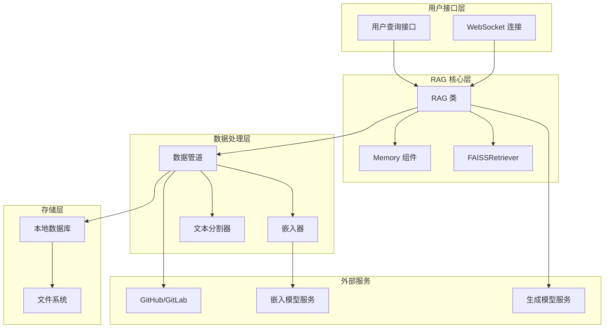

**图表来源**
- [rag.py](file://api/rag.py#L153-L446)
- [data_pipeline.py](file://api/data_pipeline.py#L1-L886)

## 核心组件分析

### 主要组件关系图

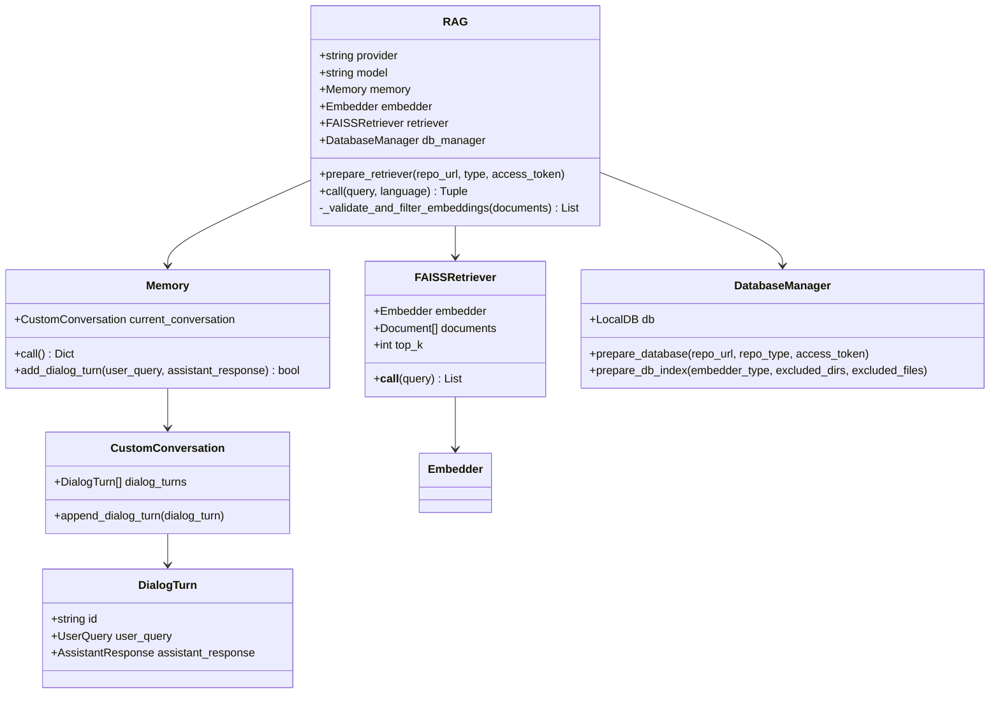

**图表来源**
- [rag.py](file://api/rag.py#L51-L446)

**章节来源**
- [rag.py](file://api/rag.py#L1-L446)

## RAG 类详细实现

### 初始化过程

RAG 类的初始化是整个系统的核心，涉及多个关键组件的配置和初始化：

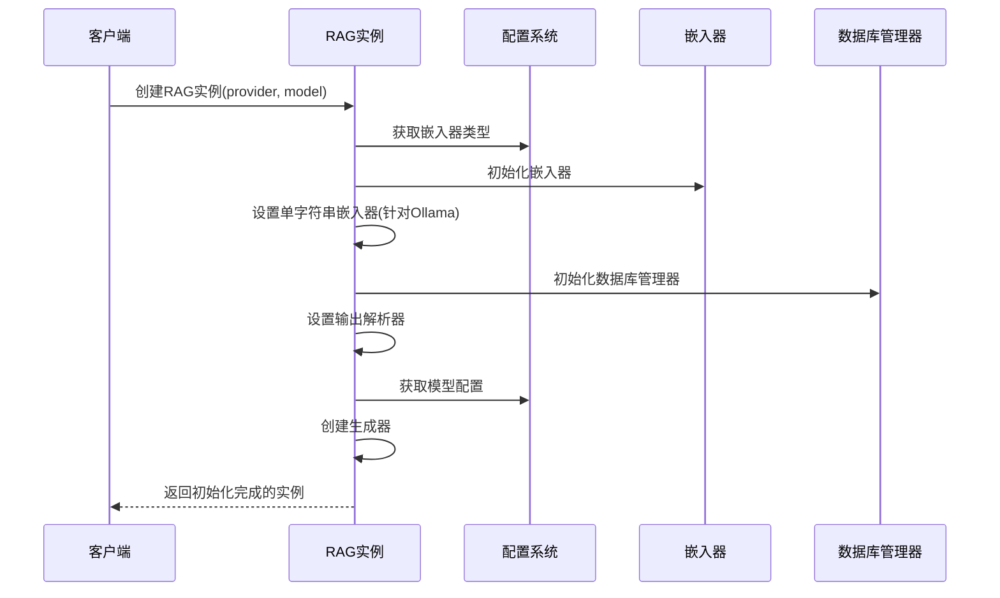

**图表来源**
- [rag.py](file://api/rag.py#L157-L243)

### 关键初始化步骤

1. **提供商和模型配置**：根据传入参数确定使用的模型提供商和具体模型
2. **嵌入器类型检测**：自动识别当前配置的嵌入器类型（OpenAI、Google、Ollama）
3. **Ollama 模型验证**：对于 Ollama 嵌入器，检查模型是否存在
4. **内存组件初始化**：创建 Memory 实例管理对话历史
5. **嵌入器配置**：获取并配置合适的嵌入器实例
6. **查询嵌入器适配**：为 Ollama 特殊处理单字符串嵌入逻辑
7. **数据库管理器**：初始化本地数据库管理功能
8. **输出解析器**：设置 RAGAnswer 数据类解析器
9. **生成器配置**：创建基于 adalflow 的 Generator 实例

**章节来源**
- [rag.py](file://api/rag.py#L157-L243)

## Memory 组件与对话历史管理

### Memory 组件设计

Memory 组件负责管理对话历史，采用自定义的对话轮次结构来确保数据的一致性和可靠性：

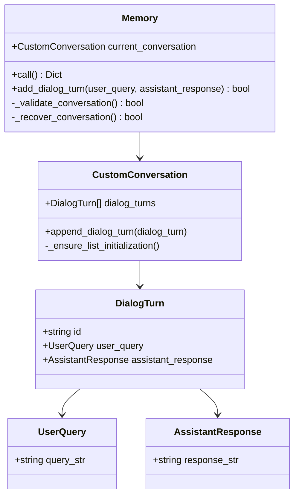

**图表来源**
- [rag.py](file://api/rag.py#L28-L142)

### 对话历史管理机制

Memory 组件实现了健壮的对话历史管理，具有以下特点：

1. **UUID 标识符**：每个对话轮次都有唯一的 UUID 标识
2. **安全追加**：使用 `append_dialog_turn` 方法安全地添加新的对话轮次
3. **异常恢复**：当遇到数据损坏或格式错误时，能够自动重建对话历史
4. **状态持久化**：将完整的对话历史序列化为字典格式返回
5. **完整性验证**：在访问对话历史时验证数据的完整性和一致性

### 错误处理策略

Memory 组件实现了多层次的错误处理：

- **数据验证**：检查对话轮次对象的完整性
- **自动恢复**：当检测到数据损坏时，自动创建新的对话历史
- **日志记录**：详细记录所有操作和错误信息
- **降级处理**：即使出现错误也能保证基本功能可用

**章节来源**
- [rag.py](file://api/rag.py#L51-L142)

## FAISSRetriever 相似性检索

### 检索流程架构

FAISSRetriever 是 RAG 系统的核心检索组件，负责从向量数据库中快速找到与查询最相关的文档：

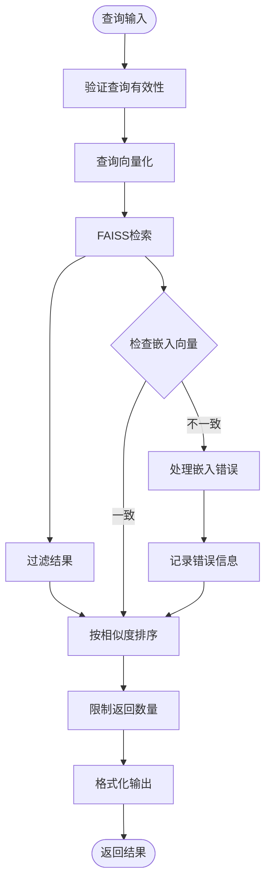

**图表来源**
- [rag.py](file://api/rag.py#L345-L415)

### 文档分块与向量化

系统采用多阶段的数据处理流程：

1. **文档读取**：从本地仓库或远程仓库下载源代码文件
2. **文本分割**：使用 TextSplitter 将长文档分割成适合嵌入的块
3. **批量向量化**：根据嵌入器类型选择合适的批处理策略
4. **索引构建**：将向量化的文档存储到 FAISS 索引中

### 向量化处理策略

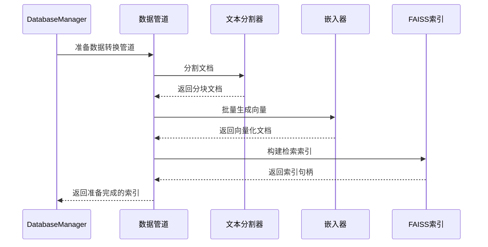

**图表来源**
- [data_pipeline.py](file://api/data_pipeline.py#L373-L415)

**章节来源**
- [rag.py](file://api/rag.py#L345-L415)
- [data_pipeline.py](file://api/data_pipeline.py#L373-L415)

## 嵌入模型与向量化处理

### 多提供商嵌入器支持

系统支持多种嵌入模型提供商，每种都有其特定的配置和优化：

| 提供商 | 默认模型 | 批处理大小 | 特点 |
|--------|----------|------------|------|
| OpenAI | text-embedding-3-small | 500 | 高质量、支持多种维度 |
| Google | text-embedding-004 | 100 | 谷歌生态集成 |
| Ollama | nomic-embed-text | 1 | 本地部署、隐私保护 |

### 嵌入向量验证机制

为了确保检索质量，系统实现了严格的嵌入向量验证：

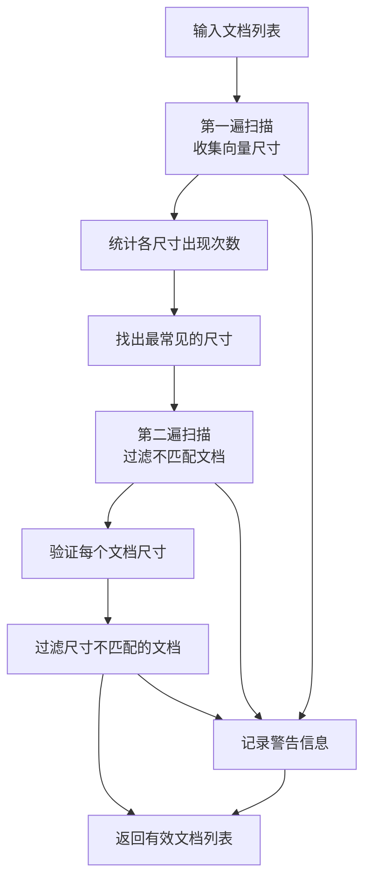

**图表来源**
- [rag.py](file://api/rag.py#L251-L343)

### Ollama 嵌入器特殊处理

Ollama 嵌入器由于其特殊的客户端实现，需要额外的处理：

1. **单字符串限制**：Ollama 只能处理单个字符串的嵌入请求
2. **逐文档处理**：使用 OllamaDocumentProcessor 进行单文档处理
3. **向量一致性检查**：确保所有文档产生相同维度的向量
4. **错误隔离**：单个文档处理失败不影响其他文档

**章节来源**
- [rag.py](file://api/rag.py#L194-L206)
- [embedder.py](file://api/tools/embedder.py#L1-L55)
- [ollama_patch.py](file://api/ollama_patch.py#L62-L105)

## RAGAnswer 数据类设计

### 数据结构定义

RAGAnswer 是系统输出的标准数据结构，继承自 adalflow 的 DataClass：

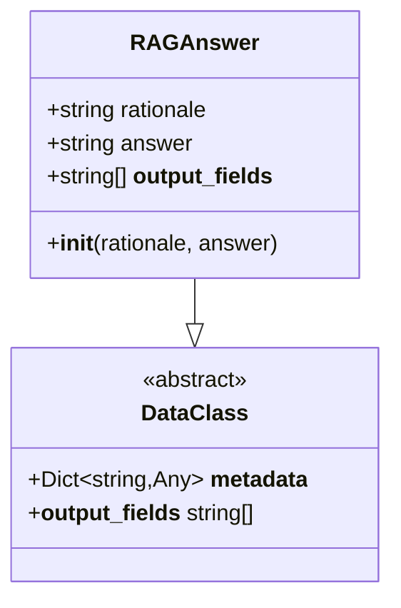

**图表来源**
- [rag.py](file://api/rag.py#L146-L152)

### 输出字段规范

RAGAnswer 定义了两个核心字段：

1. **rationale**：推理过程描述，用于解释回答的思考路径
2. **answer**：最终答案内容，采用 Markdown 格式便于渲染

### 输出解析机制

系统使用 adalflow 的 DataClassParser 来确保输出格式的正确性：

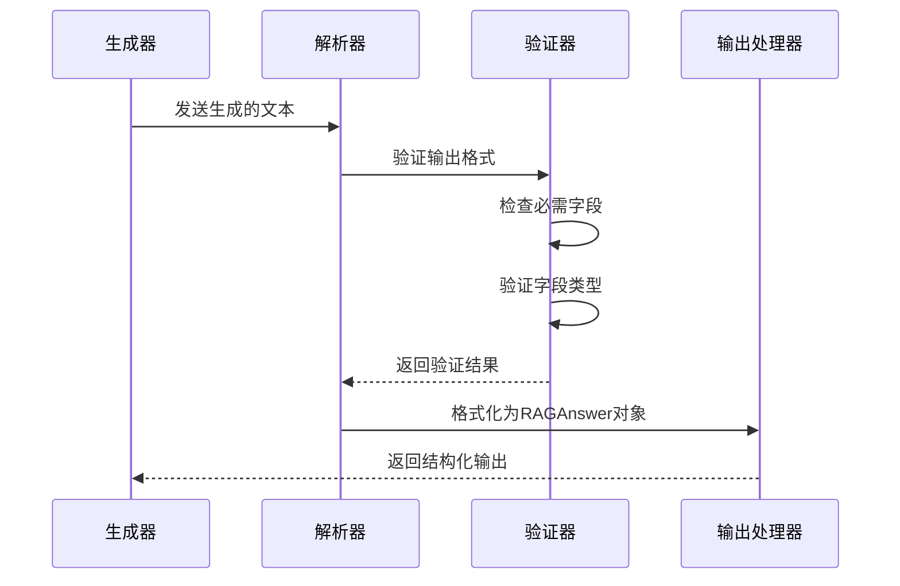

**图表来源**
- [rag.py](file://api/rag.py#L210-L226)

**章节来源**
- [rag.py](file://api/rag.py#L146-L152)
- [rag.py](file://api/rag.py#L210-L226)

## 提示模板与输出解析

### RAG_SYSTEM_PROMPT 设计原则

系统提示词经过精心设计，确保模型能够生成高质量的回答：

#### 语言检测与响应
- 自动检测用户查询的语言
- 确保回复使用相同的语言
- 支持特定语言请求的优先级

#### Markdown 格式化
- 使用适当的 Markdown 语法
- 支持代码块、表格、列表等格式
- 确保渲染效果美观

#### 输出控制
- 禁止包含思考过程
- 排除 Markdown 围栏标记
- 避免转义字符问题

### RAG_TEMPLATE 结构

RAG_TEMPLATE 采用了模板化的结构设计：

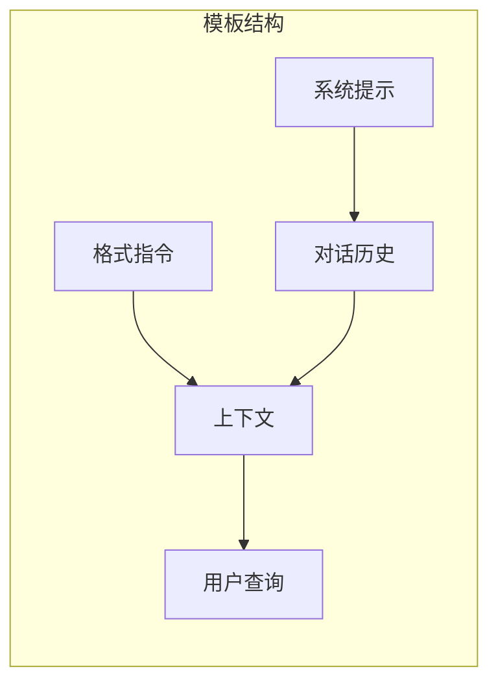

**图表来源**
- [prompts.py](file://api/prompts.py#L30-L57)

### 输出格式化规则

系统定义了严格的输出格式化规则：

1. **禁止思考过程**：不允许在输出中包含推理过程
2. **直接内容**：必须直接提供最终答案
3. **无围栏标记**：不包含 Markdown 围栏标记
4. **无转义字符**：避免不必要的转义
5. **纯文本标签**：列表项使用纯文本格式

**章节来源**
- [prompts.py](file://api/prompts.py#L1-L192)
- [rag.py](file://api/rag.py#L213-L226)

## Ollama 嵌入模型兼容性

### Ollama 模型检测机制

系统实现了完善的 Ollama 模型检测功能：

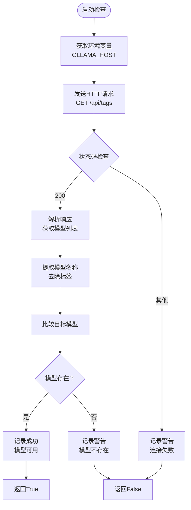

**图表来源**
- [ollama_patch.py](file://api/ollama_patch.py#L21-L60)

### 单字符串嵌入器适配

针对 Ollama 的特殊限制，系统实现了单字符串嵌入器：

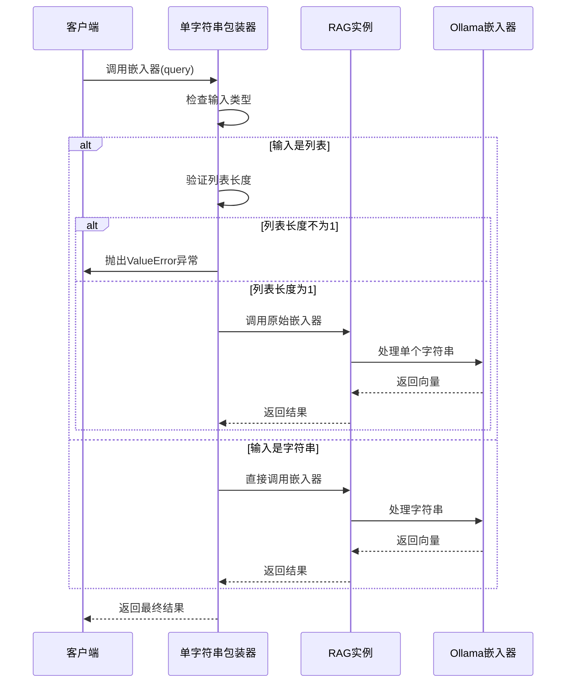

**图表来源**
- [rag.py](file://api/rag.py#L194-L206)

### OllamaDocumentProcessor 实现

OllamaDocumentProcessor 负责处理 Ollama 的单文档嵌入限制：

1. **逐文档处理**：一次只处理一个文档
2. **向量一致性检查**：确保所有文档产生相同维度的向量
3. **错误隔离**：单个文档处理失败不影响其他文档
4. **进度监控**：使用 tqdm 显示处理进度

**章节来源**
- [ollama_patch.py](file://api/ollama_patch.py#L21-L105)
- [rag.py](file://api/rag.py#L194-L206)

## 错误处理与性能优化

### 异常处理策略

系统实现了多层次的异常处理机制：

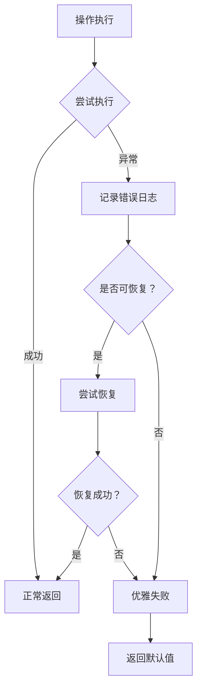

### 性能优化措施

#### 内存管理
- **弱引用**：使用 weakref 避免循环引用
- **及时清理**：定期清理临时数据和缓存
- **资源池**：复用嵌入器和生成器实例

#### 并发处理
- **异步操作**：支持异步查询处理
- **批处理优化**：根据嵌入器类型选择最优批处理大小
- **缓存机制**：缓存常用的查询结果

#### 检索优化
- **Top-K 限制**：限制返回的文档数量
- **相似度阈值**：过滤低质量的匹配结果
- **索引预热**：提前加载常用索引

### 错误恢复机制

系统实现了自动错误恢复功能：

1. **对话历史恢复**：当内存数据损坏时重建对话历史
2. **嵌入器重置**：当嵌入器出现问题时重新初始化
3. **检索器重建**：当 FAISS 索引损坏时重新构建
4. **数据库重建**：当本地数据库损坏时重新下载和处理

**章节来源**
- [rag.py](file://api/rag.py#L60-L142)
- [rag.py](file://api/rag.py#L382-L415)

## 总结

deepwiki-open 的 RAG 系统是一个高度集成的智能问答解决方案，具有以下核心特性：

### 技术优势
- **模块化设计**：清晰的组件分离和职责划分
- **多提供商支持**：灵活的模型提供商切换能力
- **robust 错误处理**：完善的异常处理和恢复机制
- **高性能检索**：基于 FAISS 的高效相似性搜索

### 功能特色
- **智能对话管理**：维护上下文对话历史
- **多语言支持**：自动语言检测和响应
- **结构化输出**：标准化的答案格式
- **本地部署友好**：支持 Ollama 等本地模型

### 应用价值
该系统特别适用于：
- **代码仓库知识问答**
- **技术文档智能检索**
- **开发辅助工具**
- **企业知识管理系统**

通过深入分析其实现细节，我们可以看到这是一个经过精心设计的生产级 RAG 系统，不仅具备强大的功能，还拥有良好的可维护性和扩展性。其模块化的设计理念和完善的错误处理机制，使其能够在各种复杂环境中稳定运行，为用户提供可靠的智能问答服务。