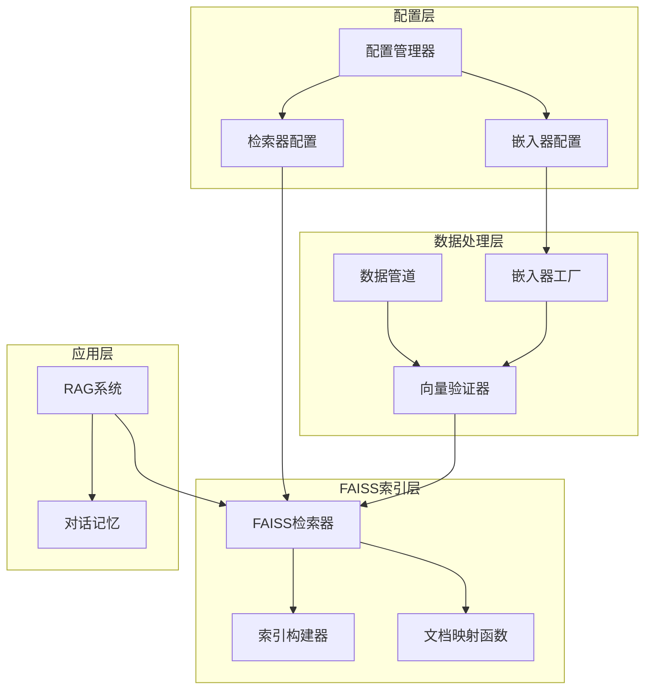
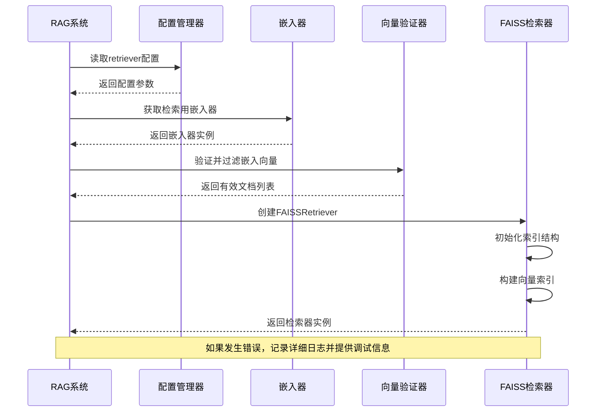
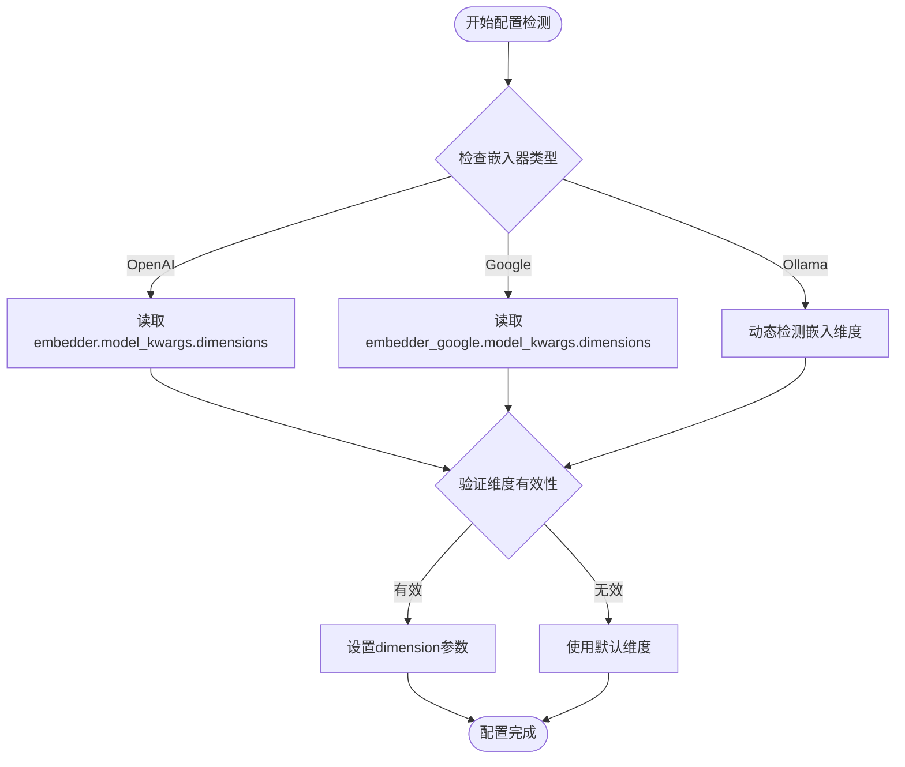
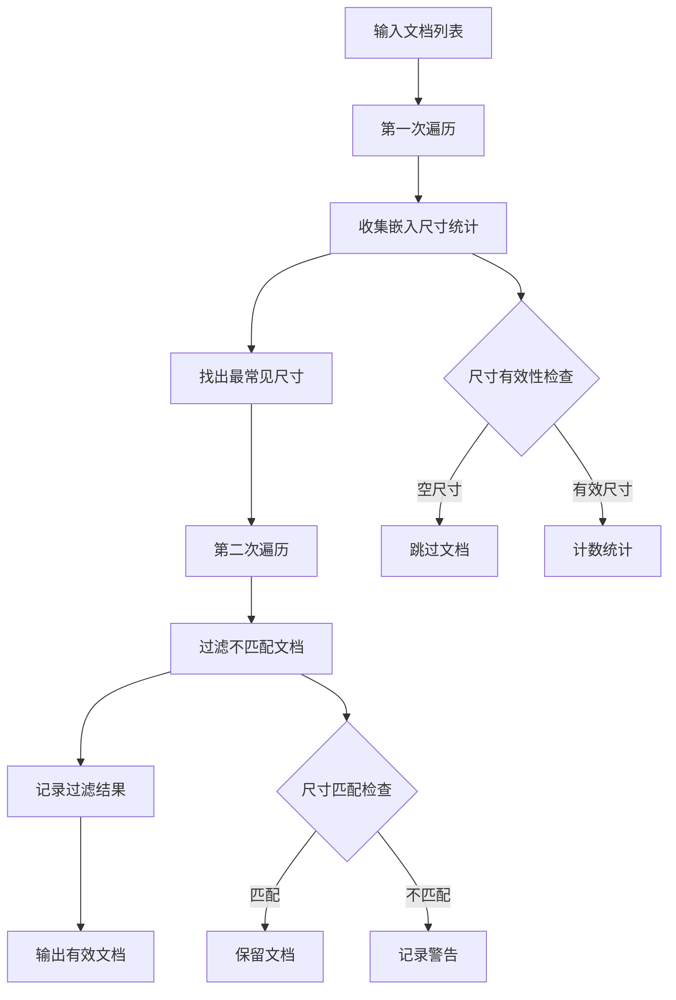
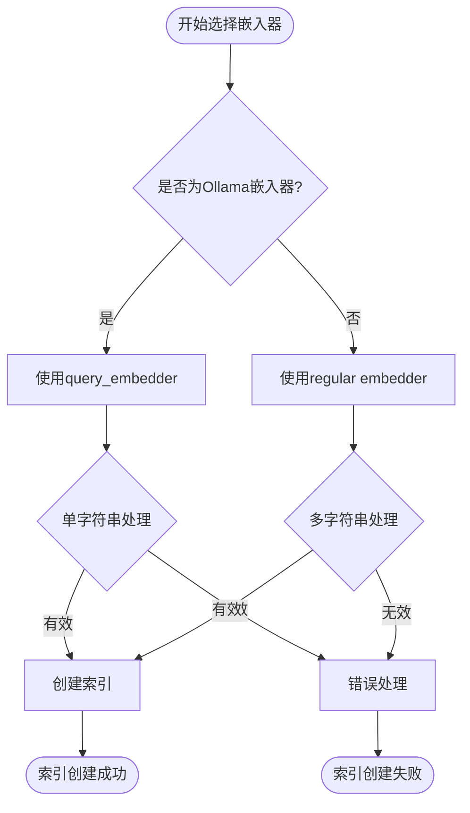
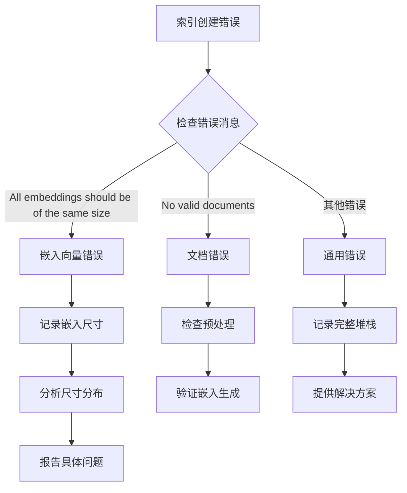
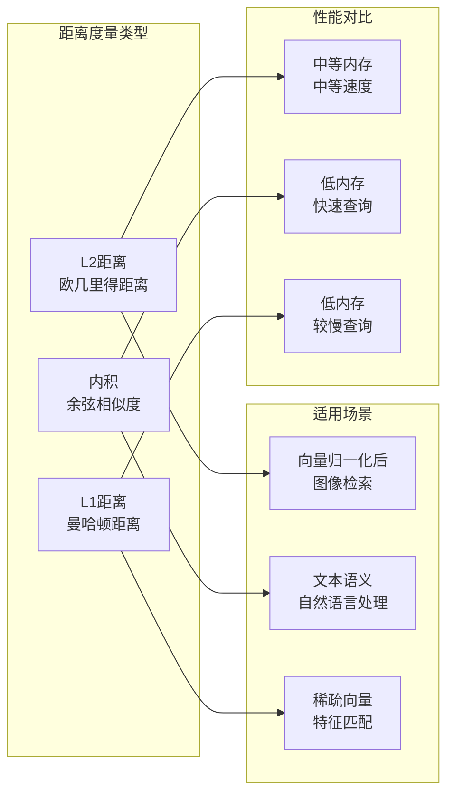

# FAISS索引创建过程深度解析

<cite>
**本文档中引用的文件**
- [rag.py](file://api/rag.py)
- [config.py](file://api/config.py)
- [embedder.py](file://api/tools/embedder.py)
- [data_pipeline.py](file://api/data_pipeline.py)
- [embedder.json](file://api/config/embedder.json)
- [dashscope_client.py](file://api/dashscope_client.py)
- [ollama_patch.py](file://api/ollama_patch.py)
</cite>

## 目录
1. [简介](#简介)
2. [项目架构概览](#项目架构概览)
3. [FAISSRetriever初始化流程](#faissretriever初始化流程)
4. [配置参数详解](#配置参数详解)
5. [嵌入向量验证机制](#嵌入向量验证机制)
6. [检索器选择逻辑](#检索器选择逻辑)
7. [错误处理与调试](#错误处理与调试)
8. [性能优化建议](#性能优化建议)
9. [故障排除指南](#故障排除指南)
10. [总结](#总结)

## 简介

FAISS（Facebook AI Similarity Search）是一个高效的相似性搜索库，广泛应用于大规模向量检索场景。在deepwiki-open项目中，FAISS索引创建是RAG（检索增强生成）系统的核心组件之一，负责构建和管理文档向量索引，为后续的语义搜索提供基础支撑。

本文档深入解析FAISSRetriever的初始化过程，详细说明从配置读取到索引创建的完整流程，包括嵌入向量验证、检索器选择逻辑以及常见错误的处理机制。

## 项目架构概览

deepwiki-open项目采用模块化架构设计，FAISS索引创建涉及多个核心组件的协同工作：

**图表来源**
- [rag.py](file://api/rag.py#L153-L446)
- [config.py](file://api/config.py#L303-L332)

## FAISSRetriever初始化流程

FAISSRetriever的初始化过程是一个精心设计的多步骤流程，确保索引质量和系统稳定性：

**图表来源**
- [rag.py](file://api/rag.py#L382-L414)

### 初始化步骤详解

1. **配置参数加载**：从`configs['retriever']`读取FAISS检索器配置
2. **嵌入器选择**：根据Ollama嵌入器类型选择合适的检索用嵌入器
3. **向量验证**：执行严格的嵌入向量一致性检查
4. **索引构建**：使用validated_docs构建FAISS索引
5. **错误处理**：捕获并处理常见错误模式

**章节来源**
- [rag.py](file://api/rag.py#L382-L414)

## 配置参数详解

### retriever配置结构

FAISS检索器的配置主要包含以下关键参数：

| 参数名称 | 类型 | 默认值 | 描述 | 性能影响 |
|---------|------|--------|------|----------|
| `top_k` | int | 20 | 检索返回的文档数量 | 影响召回率和响应时间 |
| `index_factory` | str | "Flat" | FAISS索引类型 | 决定内存使用和查询速度 |
| `metric_type` | int | faiss.METRIC_L2 | 距离度量方式 | 影响相似性计算精度 |

### dimension参数处理

dimension参数通过嵌入器配置自动确定：

**图表来源**
- [embedder.json](file://api/config/embedder.json#L1-L33)
- [rag.py](file://api/rag.py#L265-L336)

**章节来源**
- [embedder.json](file://api/config/embedder.json#L25-L32)
- [config.py](file://api/config.py#L160-L173)

## 嵌入向量验证机制

### _validate_and_filter_embeddings方法

该方法是FAISS索引创建前的关键质量控制环节，确保所有文档具有一致且有效的嵌入向量：

**图表来源**
- [rag.py](file://api/rag.py#L251-L343)

### 嵌入向量一致性验证

系统支持多种嵌入向量格式的自动检测和验证：

| 向量格式 | 检测方法 | 处理策略 |
|---------|----------|----------|
| 列表格式 | `len(vector)` | 直接获取长度 |
| NumPy数组 | `vector.shape[0]` | 使用形状属性 |
| 其他可迭代对象 | `len(vector)` | 尝试长度计算 |
| 空向量 | 长度检查 | 标记为无效 |

### 错误处理机制

当遇到不一致的嵌入尺寸时，系统会：
1. 记录详细的尺寸统计信息
2. 过滤掉所有不匹配的文档
3. 提供清晰的错误诊断信息
4. 维持系统的稳定运行

**章节来源**
- [rag.py](file://api/rag.py#L251-L343)

## 检索器选择逻辑

### retrieve_embedder选择策略

系统根据嵌入器类型智能选择最适合的检索用嵌入器：

**图表来源**
- [rag.py](file://api/rag.py#L383-L384)

### 嵌入器类型检测

系统通过以下机制确定嵌入器类型：

1. **环境变量检测**：检查`DEEPWIKI_EMBEDDER_TYPE`
2. **配置文件解析**：读取嵌入器客户端类名
3. **运行时判断**：动态检测当前使用的嵌入器

**章节来源**
- [rag.py](file://api/rag.py#L383-L384)
- [config.py](file://api/config.py#L175-L227)

## 错误处理与调试

### 常见错误类型

系统针对FAISS索引创建过程中的常见错误提供了专门的处理机制：

| 错误类型 | 错误信息 | 处理策略 | 调试建议 |
|---------|----------|----------|----------|
| 嵌入尺寸不一致 | "All embeddings should be of the same size" | 详细日志记录 + 嵌入尺寸分析 | 检查嵌入器配置和文档内容 |
| 文档数量不足 | "No valid documents with embeddings found" | 抛出明确异常 | 验证文档预处理流程 |
| 索引构建失败 | FAISS内部错误 | 降级处理 + 重试机制 | 检查内存和配置参数 |

### 错误诊断流程

**图表来源**
- [rag.py](file://api/rag.py#L394-L414)

### 调试信息收集

当遇到"嵌入尺寸不一致"错误时，系统会自动收集以下调试信息：

1. **样本嵌入尺寸**：显示前10个文档的嵌入尺寸
2. **尺寸分布统计**：列出所有发现的尺寸及其出现次数
3. **文档元数据**：记录有问题文档的文件路径
4. **配置信息**：显示当前的嵌入器和检索器配置

**章节来源**
- [rag.py](file://api/rag.py#L394-L414)

## 性能优化建议

### 维度设置优化

根据不同的应用场景和硬件资源，推荐以下维度设置策略：

| 应用场景 | 推荐维度 | 内存占用 | 查询速度 | 精度水平 |
|---------|----------|----------|----------|----------|
| 开发测试 | 64-128 | 低 | 快 | 中等 |
| 生产环境 | 256-512 | 中等 | 中等 | 高 |
| 高精度需求 | 768-1024 | 高 | 较慢 | 很高 |

### 距离度量选择

FAISS支持多种距离度量方式，选择策略如下：

### 索引类型选择

根据数据规模和查询频率选择合适的FAISS索引类型：

| 数据规模 | 推荐索引 | 内存使用 | 查询精度 | 训练时间 |
|---------|----------|----------|----------|----------|
| < 10万 | Flat | 完全内存 | 最高 | 无 |
| 10万-100万 | IVF | 可控 | 高 | 短 |
| 100万-1000万 | PQ | 低 | 中等 | 中等 |
| > 1000万 | HNSW | 中等 | 高 | 长 |

**章节来源**
- [embedder.json](file://api/config/embedder.json#L6-L8)

## 故障排除指南

### 常见问题诊断

#### 问题1：嵌入向量尺寸不一致

**症状**：出现"嵌入尺寸不一致"错误
**原因**：不同文档使用了不同维度的嵌入向量
**解决方案**：
1. 检查嵌入器配置是否正确
2. 验证文档预处理流程
3. 确保所有文档使用相同的嵌入模型

#### 问题2：文档数量不足

**症状**：无法创建FAISS检索器
**原因**：所有文档都因嵌入问题被过滤
**解决方案**：
1. 检查文档预处理阶段
2. 验证嵌入器可用性
3. 确认文档内容的有效性

#### 问题3：内存不足

**症状**：索引创建过程中内存溢出
**原因**：文档数量过多或维度过高
**解决方案**：
1. 减少文档数量
2. 降低嵌入维度
3. 使用分批索引构建

### 调试工具和技巧

1. **启用详细日志**：设置日志级别为DEBUG以获取更多信息
2. **嵌入尺寸分析**：使用提供的调试功能分析嵌入尺寸分布
3. **配置验证**：检查所有相关配置文件的正确性
4. **单元测试**：运行嵌入器和检索器的单元测试

**章节来源**
- [rag.py](file://api/rag.py#L394-L414)

## 总结

FAISS索引创建是deepwiki-open项目中的关键组件，涉及复杂的配置管理、数据验证和错误处理机制。通过本文档的深入分析，我们可以看到：

1. **配置驱动的设计**：系统通过配置文件灵活管理FAISS参数
2. **严格的质量控制**：嵌入向量验证确保索引质量
3. **智能的错误处理**：提供详细的错误诊断和恢复机制
4. **性能优化考虑**：支持多种索引类型和配置选项

这种设计不仅保证了系统的稳定性和可靠性，还为不同应用场景提供了灵活的配置选项。理解这些机制有助于开发者更好地使用和维护FAISS索引系统，同时为未来的扩展和优化奠定基础。