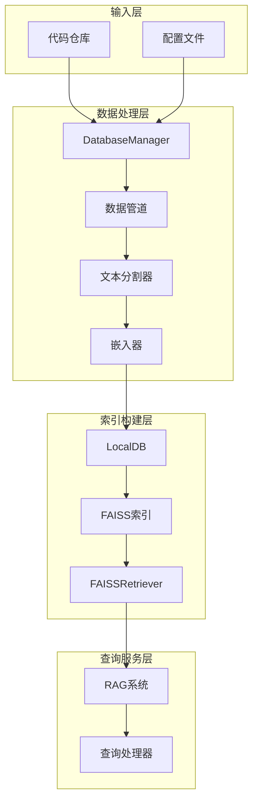
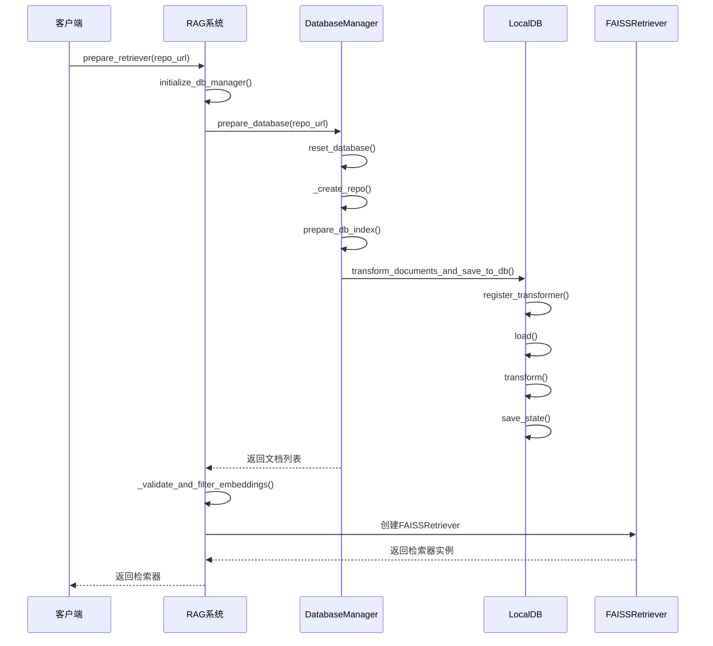
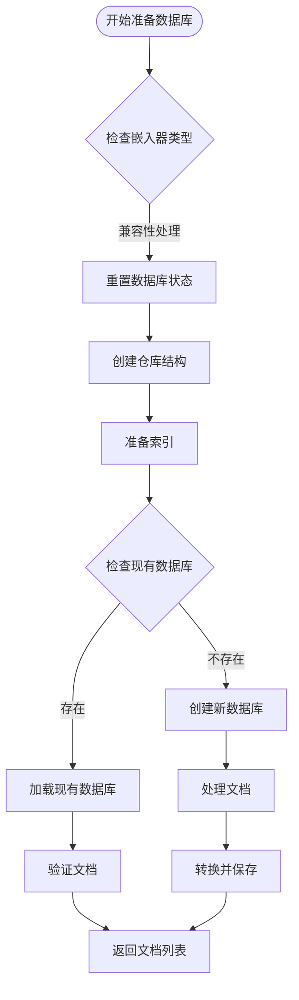
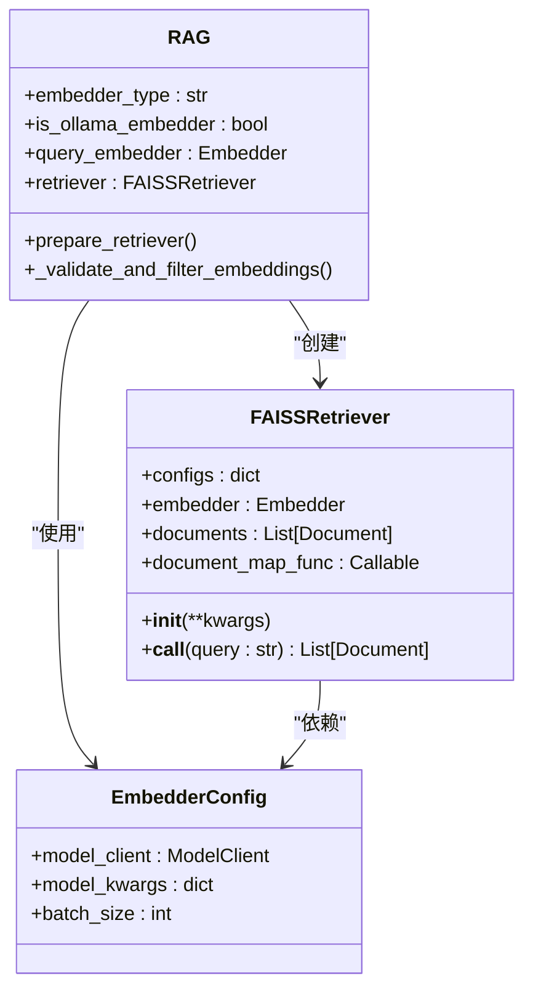
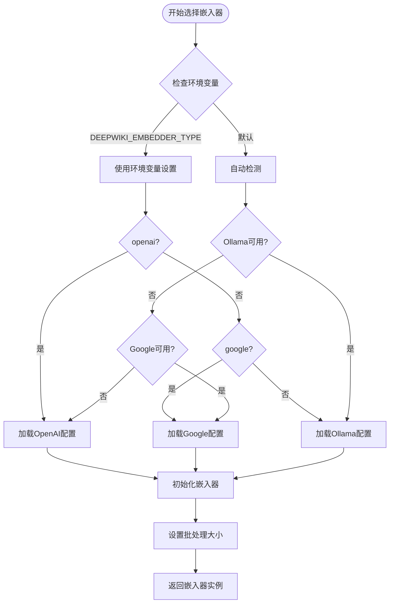
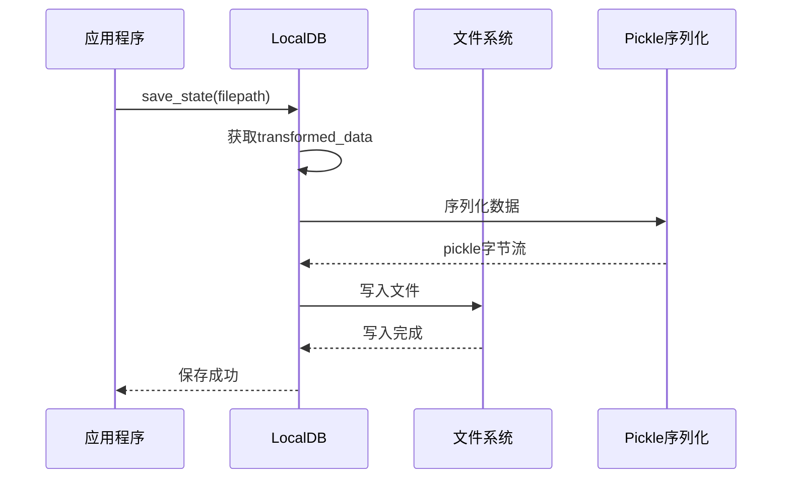
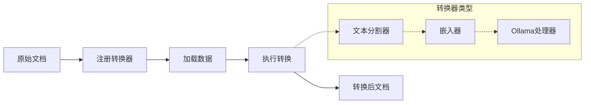
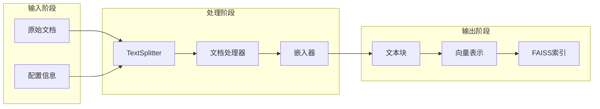
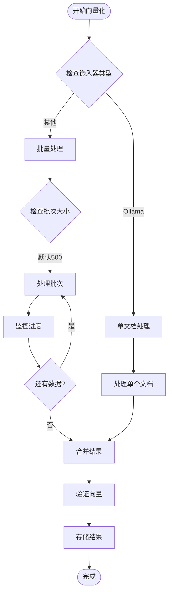
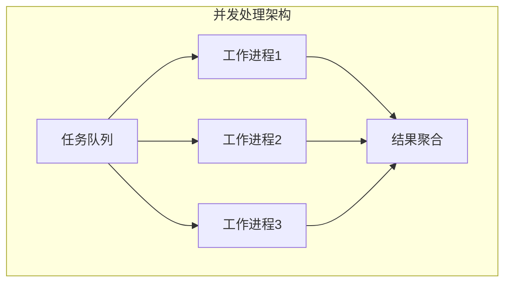

# 向量索引构建

<cite>
**本文档中引用的文件**
- [api/rag.py](file://api/rag.py)
- [api/data_pipeline.py](file://api/data_pipeline.py)
- [api/config.py](file://api/config.py)
- [api/tools/embedder.py](file://api/tools/embedder.py)
- [api/config/embedder.json](file://api/config/embedder.json)
- [README.md](file://README.md)
</cite>

## 目录
1. [简介](#简介)
2. [系统架构概览](#系统架构概览)
3. [prepare_retriever方法详解](#prepare_retriever方法详解)
4. [DatabaseManager核心功能](#databasemanager核心功能)
5. [FAISSRetriever初始化过程](#faissretriever初始化过程)
6. [嵌入器选择与配置](#嵌入器选择与配置)
7. [LocalDB持久化机制](#localdb持久化机制)
8. [文本分块与向量化流水线](#文本分块与向量化流水线)
9. [性能优化配置建议](#性能优化配置建议)
10. [故障排除指南](#故障排除指南)
11. [总结](#总结)

## 简介

deepwiki-open项目实现了一个完整的RAG（检索增强生成）系统，其核心是高效的向量索引构建机制。该系统通过FAISS索引技术为大规模代码库提供智能检索能力，支持多种嵌入器类型，并实现了完整的向量数据库持久化存储。

本文档深入解析了向量索引构建的完整流程，从文档准备到FAISS索引创建，涵盖了系统的关键组件和优化策略。

## 系统架构概览

deepwiki-open的RAG系统采用模块化设计，主要包含以下核心组件：



**图表来源**
- [api/rag.py](file://api/rag.py#L345-L415)
- [api/data_pipeline.py](file://api/data_pipeline.py#L702-L884)

## prepare_retriever方法详解

`prepare_retriever`方法是RAG系统的核心入口点，负责协调整个向量索引构建流程。

### 方法调用链路



**图表来源**
- [api/rag.py](file://api/rag.py#L345-L415)
- [api/data_pipeline.py](file://api/data_pipeline.py#L702-L884)

### 核心执行步骤

1. **数据库管理器初始化**：创建并初始化`DatabaseManager`实例
2. **数据库状态重置**：调用`reset_database()`清理现有状态
3. **文档准备**：通过`prepare_db_index()`处理文档集合
4. **嵌入验证**：使用`_validate_and_filter_embeddings()`确保向量一致性
5. **检索器创建**：实例化`FAISSRetriever`完成索引构建

**章节来源**
- [api/rag.py](file://api/rag.py#L345-L415)

## DatabaseManager核心功能

`DatabaseManager`类负责管理整个数据库生命周期，包括创建、加载、转换和持久化。

### 主要方法分析

#### prepare_database方法

该方法是数据库准备的核心入口，执行以下关键操作：



**图表来源**
- [api/data_pipeline.py](file://api/data_pipeline.py#L713-L884)

#### _create_repo方法

该方法负责创建本地仓库结构，包括目录创建和路径管理：

- **本地路径处理**：直接使用提供的本地路径
- **远程仓库下载**：通过Git克隆远程仓库
- **路径标准化**：确保路径格式的一致性

#### prepare_db_index方法

这是数据库索引准备的核心逻辑：

1. **数据库检查**：优先使用现有数据库避免重复处理
2. **文档读取**：调用`read_all_documents()`获取源文档
3. **文档转换**：通过`transform_documents_and_save_to_db()`完成向量化
4. **状态保存**：将处理结果持久化到本地数据库

**章节来源**
- [api/data_pipeline.py](file://api/data_pipeline.py#L702-L884)

## FAISSRetriever初始化过程

FAISSRetriever是RAG系统的核心检索组件，负责建立高效的向量相似度索引。

### 初始化参数配置

FAISSRetriever的初始化过程涉及多个关键参数：

| 参数名称 | 来源 | 描述 | 默认值 |
|---------|------|------|--------|
| **dimension** | 嵌入器配置 | 向量维度大小 | 256（OpenAI） |
| **metric** | 配置文件 | 距离计算方法 | 内积（默认） |
| **top_k** | retriever配置 | 检索结果数量 | 20 |
| **embedder** | 动态选择 | 嵌入器实例 | 根据类型选择 |
| **documents** | 文档列表 | 待索引的文档集合 | 已处理的文档 |

### 参数传递机制



**图表来源**
- [api/rag.py](file://api/rag.py#L383-L390)
- [api/config/embedder.json](file://api/config/embedder.json#L25-L27)

### document_map_func参数

`document_map_func`参数指定了从Document对象提取向量的方法：

```python
document_map_func=lambda doc: doc.vector
```

这个函数的作用：
- **向量提取**：从每个Document对象中提取`vector`属性
- **灵活性**：允许自定义向量提取逻辑
- **兼容性**：确保与不同类型的Document对象兼容

**章节来源**
- [api/rag.py](file://api/rag.py#L383-L390)

## 嵌入器选择与配置

系统支持三种主要的嵌入器类型，每种都有特定的配置和优化策略。

### 嵌入器类型对比

| 嵌入器类型 | 提供商 | 特点 | 性能 | 成本 |
|-----------|--------|------|------|------|
| **OpenAI** | OpenAI | 高质量，标准化 | 中等 | 中等 |
| **Google** | Google AI | 与Gemini模型集成好 | 高 | 低 |
| **Ollama** | 本地部署 | 隐私保护，离线运行 | 可变 | 免费 |

### 嵌入器选择逻辑



**图表来源**
- [api/tools/embedder.py](file://api/tools/embedder.py#L6-L55)
- [api/config.py](file://api/config.py#L160-L173)

### 嵌入器配置详解

#### OpenAI嵌入器配置

```json
{
  "embedder": {
    "client_class": "OpenAIClient",
    "batch_size": 500,
    "model_kwargs": {
      "model": "text-embedding-3-small",
      "dimensions": 256,
      "encoding_format": "float"
    }
  }
}
```

#### Google嵌入器配置

```json
{
  "embedder_google": {
    "client_class": "GoogleEmbedderClient",
    "batch_size": 100,
    "model_kwargs": {
      "model": "text-embedding-004",
      "task_type": "SEMANTIC_SIMILARITY"
    }
  }
}
```

#### Ollama嵌入器配置

```json
{
  "embedder_ollama": {
    "client_class": "OllamaClient",
    "model_kwargs": {
      "model": "nomic-embed-text"
    }
  }
}
```

**章节来源**
- [api/config/embedder.json](file://api/config/embedder.json#L1-L33)

## LocalDB持久化机制

LocalDB提供了完整的向量数据库持久化解决方案，支持状态保存和加载。

### 保存机制（save_state）

`save_state`方法负责将处理后的文档状态持久化到本地文件：



**图表来源**
- [api/data_pipeline.py](file://api/data_pipeline.py#L439-L441)

### 加载机制（load_state）

`load_state`方法从本地文件恢复数据库状态：

1. **文件检查**：验证目标文件是否存在
2. **反序列化**：使用pickle加载数据
3. **状态重建**：恢复LocalDB实例状态
4. **数据验证**：确保加载的数据完整性

### transform机制

`transform`方法执行数据转换流水线：



**图表来源**
- [api/data_pipeline.py](file://api/data_pipeline.py#L435-L438)

**章节来源**
- [api/data_pipeline.py](file://api/data_pipeline.py#L417-L441)

## 文本分块与向量化流水线

系统实现了完整的文本处理流水线，从文档读取到最终的向量索引。

### 数据管道架构



**图表来源**
- [api/data_pipeline.py](file://api/data_pipeline.py#L373-L416)

### 文本分割策略

系统采用多阶段文本分割策略：

#### 分割器配置

```json
{
  "text_splitter": {
    "split_by": "word",
    "chunk_size": 350,
    "chunk_overlap": 100
  }
}
```

#### 分割算法特点

- **按词分割**：确保语义完整性
- **重叠窗口**：保持上下文连续性
- **动态调整**：根据内容复杂度调整

### 向量化处理

#### 批处理优化



**图表来源**
- [api/data_pipeline.py](file://api/data_pipeline.py#L396-L411)

#### 不同嵌入器的处理策略

| 嵌入器类型 | 处理方式 | 批次大小 | 优势 |
|-----------|----------|----------|------|
| **OpenAI** | 批量处理 | 500 | 高吞吐量 |
| **Google** | 批量处理 | 100 | 平衡性能 |
| **Ollama** | 单文档处理 | 1 | 内存友好 |

**章节来源**
- [api/data_pipeline.py](file://api/data_pipeline.py#L373-L416)

## 性能优化配置建议

基于系统架构分析，以下是针对不同场景的性能优化建议。

### 嵌入器选择优化

#### 高质量要求场景
```json
{
  "embedder": {
    "model_kwargs": {
      "model": "text-embedding-3-large",
      "dimensions": 3072
    }
  }
}
```

#### 性能优先场景
```json
{
  "embedder": {
    "batch_size": 1000,
    "model_kwargs": {
      "model": "text-embedding-3-small",
      "dimensions": 1536
    }
  }
}
```

### FAISS索引优化

#### 索引类型选择

```python
# 针对大规模数据集
index = faiss.IndexHNSWFlat(dimension, hnsw_m)

# 针对内存受限环境
index = faiss.IndexIVFFlat(...)
```

#### 检索参数调优

| 参数 | 推荐值 | 说明 |
|------|--------|------|
| **top_k** | 20-50 | 平衡准确性和性能 |
| **nprobe** | 10-100 | HNSW索引的搜索范围 |
| **efSearch** | 200-1000 | HNSW搜索精度 |

### 内存优化策略

#### 分批处理配置

```python
# 大型文档集处理
batch_size_configs = {
    "openai": 500,
    "google": 200,
    "ollama": 50
}
```

#### 缓存策略

```python
# 启用文档缓存
cache_config = {
    "enabled": True,
    "max_size": 1000,
    "ttl": 3600
}
```

### 并发处理优化

#### 异步处理模式



## 故障排除指南

### 常见问题诊断

#### 嵌入向量不一致错误

**症状**：`All embeddings should be of the same size`错误

**原因分析**：
- 不同文档使用了不同的嵌入模型
- 嵌入器配置不一致
- 文档预处理异常

**解决方案**：
1. 检查嵌入器配置一致性
2. 验证文档预处理流程
3. 使用`_validate_and_filter_embeddings()`方法过滤无效文档

#### FAISS索引创建失败

**症状**：FAISS索引创建过程中断

**排查步骤**：
```python
# 添加调试日志
logger.info(f"Embedding sizes: {[len(doc.vector) for doc in docs[:10]]}")
logger.info(f"Documents with vectors: {[doc for doc in docs if hasattr(doc, 'vector')]}")
```

#### 内存不足问题

**症状**：处理大型仓库时内存溢出

**优化措施**：
1. 减少批处理大小
2. 启用增量处理
3. 增加系统内存

### 性能监控指标

#### 关键性能指标

| 指标 | 正常范围 | 警告阈值 | 优化建议 |
|------|----------|----------|----------|
| **索引构建时间** | < 30分钟 | > 1小时 | 优化嵌入器配置 |
| **检索延迟** | < 100ms | > 500ms | 调整索引参数 |
| **内存使用率** | < 80% | > 95% | 减少批处理大小 |
| **向量维度** | 256-1536 | > 2048 | 降低维度 |

#### 监控脚本示例

```python
def monitor_rag_performance():
    """监控RAG系统性能指标"""
    metrics = {
        'index_build_time': calculate_index_build_time(),
        'search_latency': measure_search_latency(),
        'memory_usage': get_memory_usage(),
        'vector_dimension': get_vector_dimension()
    }
    logger.info(f"Performance metrics: {metrics}")
    return metrics
```

**章节来源**
- [api/rag.py](file://api/rag.py#L374-L415)

## 总结

deepwiki-open的RAG系统向量索引构建是一个高度优化的完整解决方案，具有以下核心优势：

### 技术亮点

1. **模块化架构**：清晰的职责分离和可扩展的设计
2. **多嵌入器支持**：灵活的嵌入器选择和配置机制
3. **高效索引构建**：基于FAISS的高性能向量检索
4. **智能持久化**：完整的数据库状态管理和恢复机制
5. **性能优化**：多层次的性能优化策略

### 最佳实践建议

1. **配置管理**：合理配置嵌入器参数和索引参数
2. **资源规划**：根据数据规模合理分配计算资源
3. **监控维护**：建立完善的性能监控和故障排除机制
4. **版本控制**：妥善管理不同嵌入器版本的兼容性

### 发展方向

随着AI技术的不断发展，该系统在以下方面具有改进空间：
- 支持更多嵌入器类型和模型
- 实现更智能的索引压缩和优化
- 增强实时更新和增量索引能力
- 提供更丰富的性能分析工具

通过深入理解和正确配置这些组件，开发者可以构建出高性能、可扩展的RAG系统，为用户提供优质的智能检索体验。