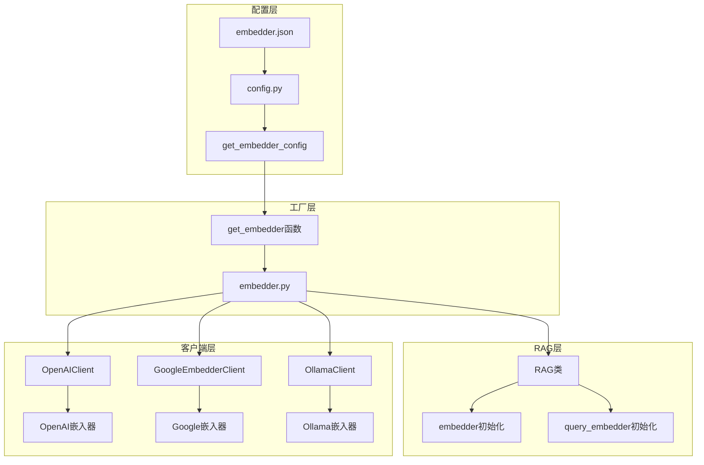
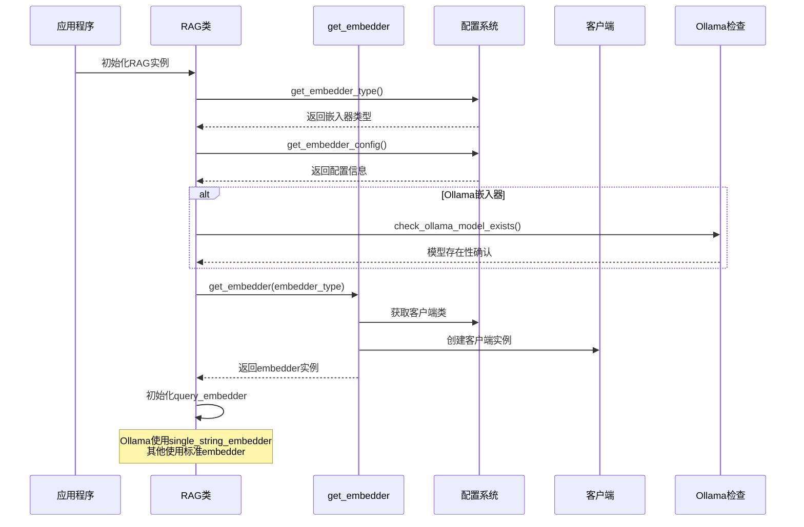
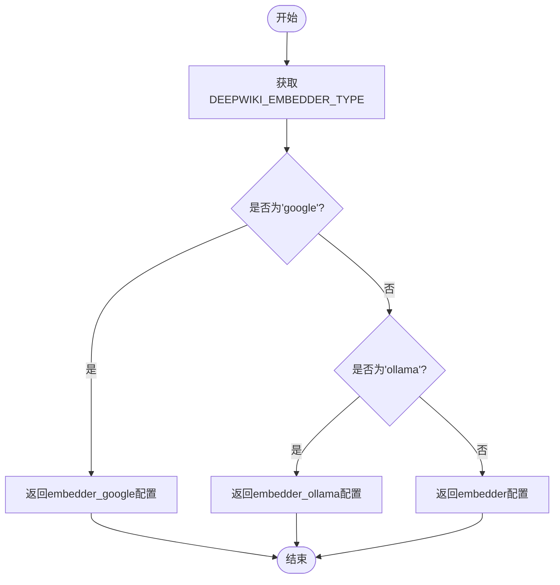
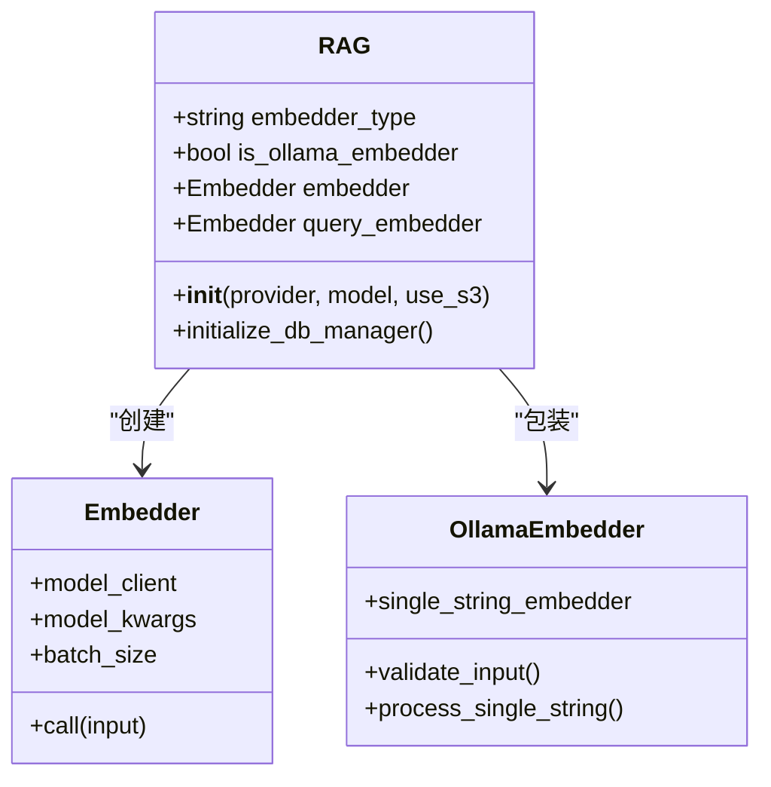
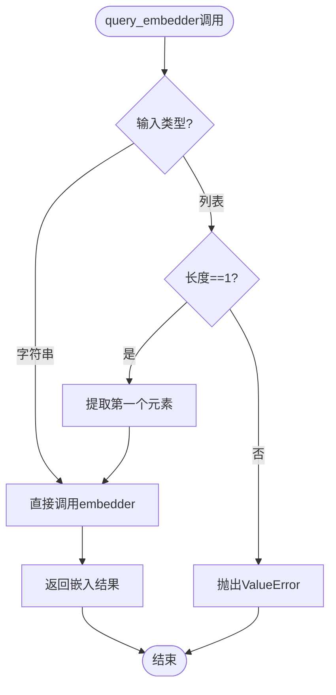
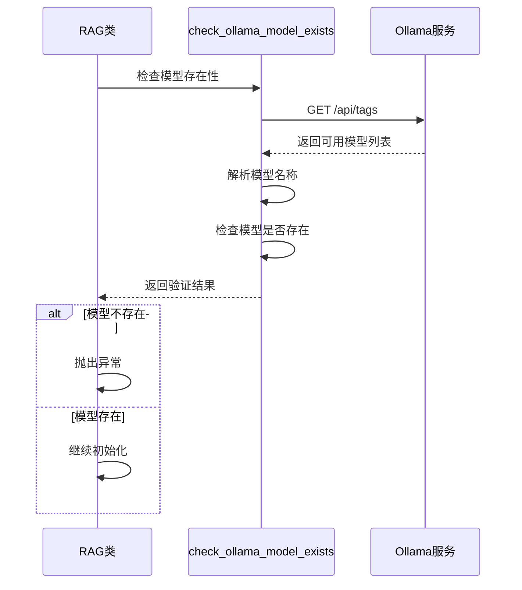
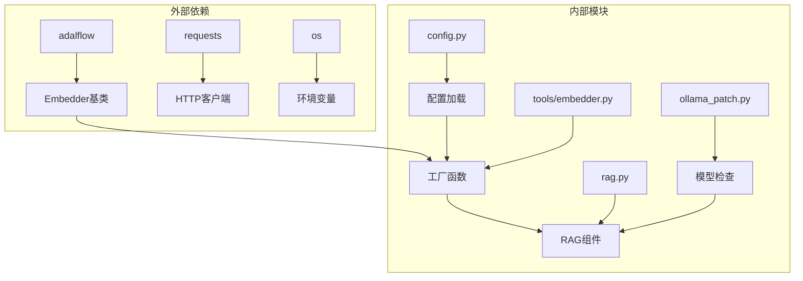

# 嵌入器初始化

<cite>
**本文档引用的文件**
- [api/tools/embedder.py](file://api/tools/embedder.py)
- [api/rag.py](file://api/rag.py)
- [api/config/embedder.json](file://api/config/embedder.json)
- [api/config.py](file://api/config.py)
- [api/openai_client.py](file://api/openai_client.py)
- [api/google_embedder_client.py](file://api/google_embedder_client.py)
- [api/ollama_patch.py](file://api/ollama_patch.py)
- [tests/unit/test_all_embedders.py](file://tests/unit/test_all_embedders.py)
- [tests/integration/test_full_integration.py](file://tests/integration/test_full_integration.py)
</cite>

## 目录
1. [简介](#简介)
2. [项目结构概览](#项目结构概览)
3. [核心组件分析](#核心组件分析)
4. [架构概览](#架构概览)
5. [详细组件分析](#详细组件分析)
6. [依赖关系分析](#依赖关系分析)
7. [性能考虑](#性能考虑)
8. [故障排除指南](#故障排除指南)
9. [结论](#结论)

## 简介

deepwiki-open是一个基于Adalflow框架构建的RAG（检索增强生成）系统，其嵌入器初始化过程是整个系统的核心组成部分。该系统支持多种嵌入器提供商，包括OpenAI、Google和Ollama，通过灵活的配置机制实现自动化的嵌入器选择和初始化。

本文档深入解析了嵌入器初始化的完整流程，重点关注`get_embedder_config`函数如何从配置文件中读取参数，根据环境变量动态选择合适的嵌入器类型，并在RAG类中实现embedder和query_embedder的差异化初始化策略。

## 项目结构概览

deepwiki-open的嵌入器初始化涉及以下关键模块：

**图表来源**
- [api/config.py](file://api/config.py#L148-L184)
- [api/tools/embedder.py](file://api/tools/embedder.py#L6-L54)
- [api/rag.py](file://api/rag.py#L153-L207)

## 核心组件分析

### 配置管理系统

系统通过多层次的配置管理实现嵌入器的灵活初始化：

1. **环境变量驱动**：`DEEPWIKI_EMBEDDER_TYPE`环境变量决定默认嵌入器类型
2. **JSON配置文件**：`embedder.json`提供详细的嵌入器参数配置
3. **动态配置加载**：运行时根据环境变量重新加载配置

### 嵌入器工厂模式

`get_embedder`函数实现了工厂模式，支持多种初始化方式：

- 显式指定嵌入器类型（`embedder_type`参数）
- 使用遗留参数（`is_local_ollama`, `use_google_embedder`）
- 自动检测当前配置

**章节来源**
- [api/tools/embedder.py](file://api/tools/embedder.py#L6-L54)
- [api/config.py](file://api/config.py#L160-L173)

## 架构概览

嵌入器初始化系统采用分层架构设计，确保了高度的可扩展性和维护性：

**图表来源**
- [api/rag.py](file://api/rag.py#L175-L207)
- [api/tools/embedder.py](file://api/tools/embedder.py#L18-L37)

## 详细组件分析

### get_embedder_config函数详解

`get_embedder_config`函数是嵌入器配置的核心入口点，它根据当前环境变量确定使用的嵌入器类型：

**图表来源**
- [api/config.py](file://api/config.py#L160-L173)

该函数的关键特性：
- **环境变量优先级**：`DEEPWIKI_EMBEDDER_TYPE`具有最高优先级
- **配置映射**：将字符串类型的嵌入器名称映射到具体的配置对象
- **错误处理**：如果配置不存在，返回空字典而非抛出异常

### RAG类中的嵌入器初始化

RAG类展示了如何在实际应用中初始化嵌入器，体现了两种不同的初始化策略：

#### embedder初始化

**图表来源**
- [api/rag.py](file://api/rag.py#L153-L207)

#### query_embedder的差异化初始化

RAG类中最关键的创新在于query_embedder的差异化初始化策略：

1. **Ollama特殊处理**：对于Ollama嵌入器，创建`single_string_embedder`包装器
2. **输入验证**：确保Ollama只接收单个字符串输入
3. **弱引用机制**：使用`weakref.ref`避免循环引用

**章节来源**
- [api/rag.py](file://api/rag.py#L194-L206)

### Ollama嵌入器的特殊处理

Ollama嵌入器需要特殊的处理逻辑，因为其API不支持批量嵌入：

**图表来源**
- [api/rag.py](file://api/rag.py#L195-L203)

这种设计确保了：
- **兼容性**：保持与标准embedder接口的一致性
- **安全性**：防止向Ollama发送无效的批量请求
- **性能优化**：避免不必要的输入转换

### 模型客户端初始化

系统支持三种主要的嵌入器客户端，每种都有其特定的初始化参数：

| 客户端类型 | 主要参数 | 认证机制 | 批量支持 |
|------------|----------|----------|----------|
| OpenAIClient | api_key, base_url | 环境变量/API密钥 | 是 |
| GoogleEmbedderClient | api_key | 环境变量 | 是 |
| OllamaClient | model, host | 本地连接 | 否 |

**章节来源**
- [api/openai_client.py](file://api/openai_client.py#L161-L204)
- [api/google_embedder_client.py](file://api/google_embedder_client.py#L54-L76)

### Ollama模型验证机制

系统在初始化Ollama嵌入器前会进行模型存在性检查：

**图表来源**
- [api/ollama_patch.py](file://api/ollama_patch.py#L21-L60)

**章节来源**
- [api/ollama_patch.py](file://api/ollama_patch.py#L21-L60)

## 依赖关系分析

嵌入器初始化系统的依赖关系展现了清晰的分层架构：

**图表来源**
- [api/config.py](file://api/config.py#L10-L16)
- [api/tools/embedder.py](file://api/tools/embedder.py#L1)

### 关键依赖关系

1. **配置依赖**：所有嵌入器都依赖于统一的配置系统
2. **客户端依赖**：每个嵌入器都有对应的客户端实现
3. **工具依赖**：通用工具函数支持嵌入器功能

**章节来源**
- [api/config.py](file://api/config.py#L10-L16)

## 性能考虑

嵌入器初始化过程中考虑了多个性能优化点：

### 延迟加载策略

- **按需初始化**：只有在实际使用时才创建嵌入器实例
- **弱引用使用**：避免内存泄漏和循环引用
- **模型预检查**：在初始化前验证Ollama模型存在性

### 批量处理优化

- **OpenAI和Google**：支持批量嵌入，提高处理效率
- **Ollama**：通过自定义处理器实现逐个文档处理
- **内存管理**：及时清理临时数据和弱引用

### 错误恢复机制

系统实现了多层次的错误处理：
- **配置错误**：优雅降级到默认配置
- **网络错误**：重试机制和超时处理
- **模型错误**：提前验证避免运行时失败

## 故障排除指南

### 常见问题及解决方案

#### Ollama模型未找到

**症状**：初始化时抛出"Ollama model not found"异常

**解决方案**：
1. 检查Ollama服务是否运行：`curl http://localhost:11434/api/tags`
2. 安装所需模型：`ollama pull nomic-embed-text`
3. 验证环境变量：设置`OLLAMA_HOST`指向正确的Ollama实例

#### 配置加载失败

**症状**：嵌入器配置为空或缺失

**解决方案**：
1. 检查`embedder.json`文件路径和格式
2. 验证环境变量`DEEPWIKI_EMBEDDER_TYPE`
3. 确认配置文件中的客户端类名正确

#### API认证失败

**症状**：OpenAI或Google嵌入器认证失败

**解决方案**：
1. 设置正确的API密钥环境变量
2. 检查API配额和限制
3. 验证网络连接和防火墙设置

**章节来源**
- [api/ollama_patch.py](file://api/ollama_patch.py#L21-L60)
- [api/config.py](file://api/config.py#L160-L173)

## 结论

deepwiki-open的嵌入器初始化系统展现了优秀的软件架构设计原则：

1. **灵活性**：支持多种嵌入器提供商和配置方式
2. **可扩展性**：易于添加新的嵌入器类型
3. **健壮性**：完善的错误处理和验证机制
4. **性能优化**：针对不同嵌入器类型的专门优化

该系统通过清晰的分层架构、工厂模式的应用和智能的配置管理，为RAG应用提供了稳定可靠的嵌入器初始化能力。特别是Ollama嵌入器的特殊处理策略，展示了系统在面对不同技术栈时的适应能力和创新思维。

未来的改进方向包括：
- 支持更多的嵌入器提供商
- 实现更智能的配置推断机制
- 增强缓存和预热功能
- 提供更详细的诊断信息