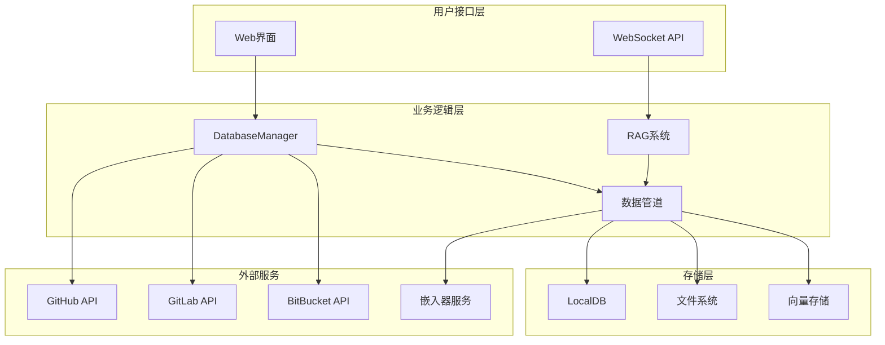
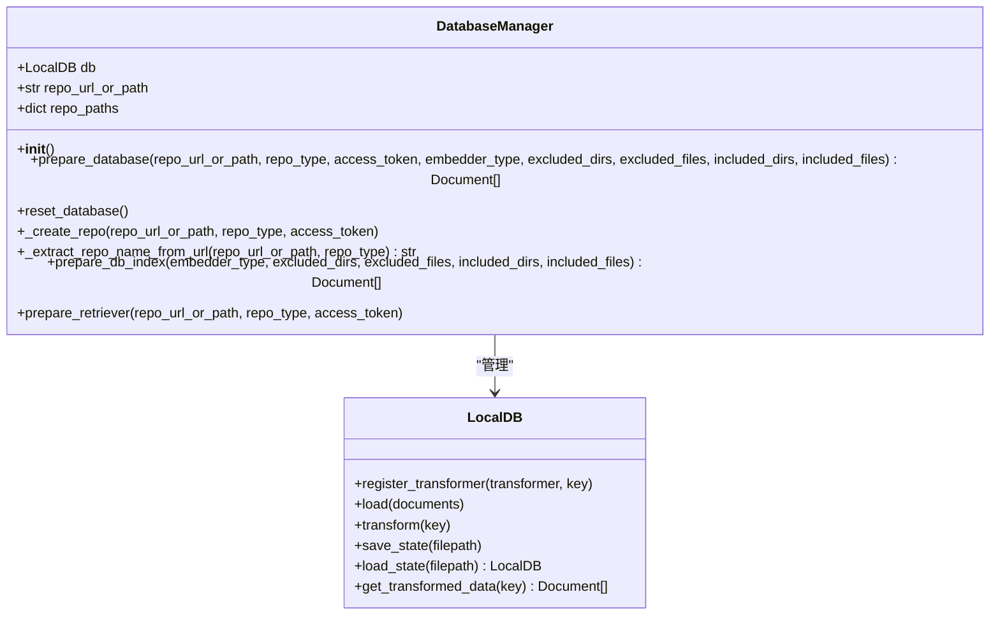
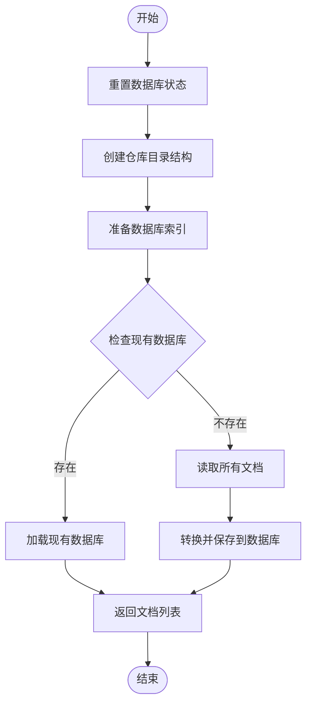
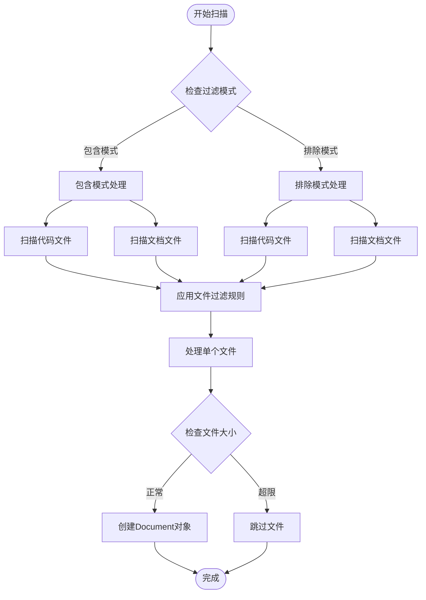
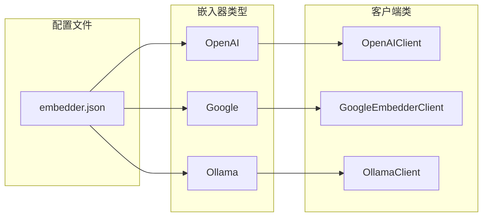
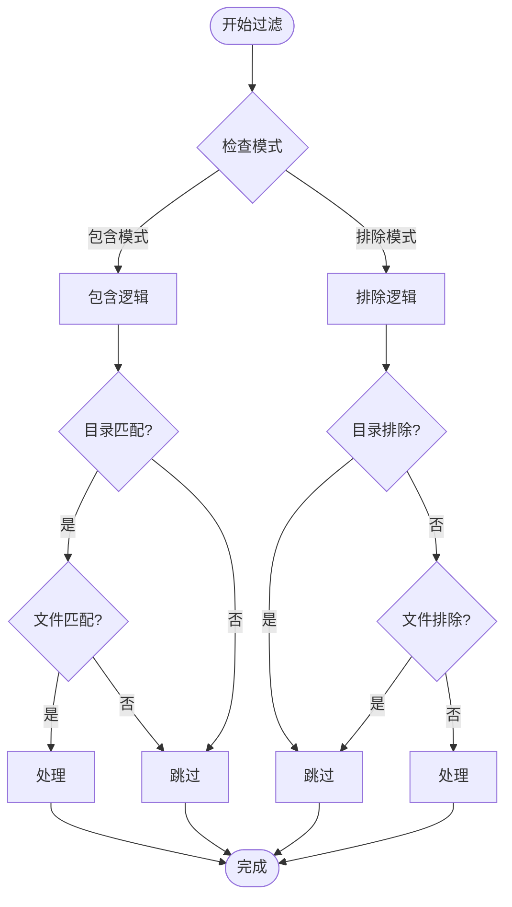
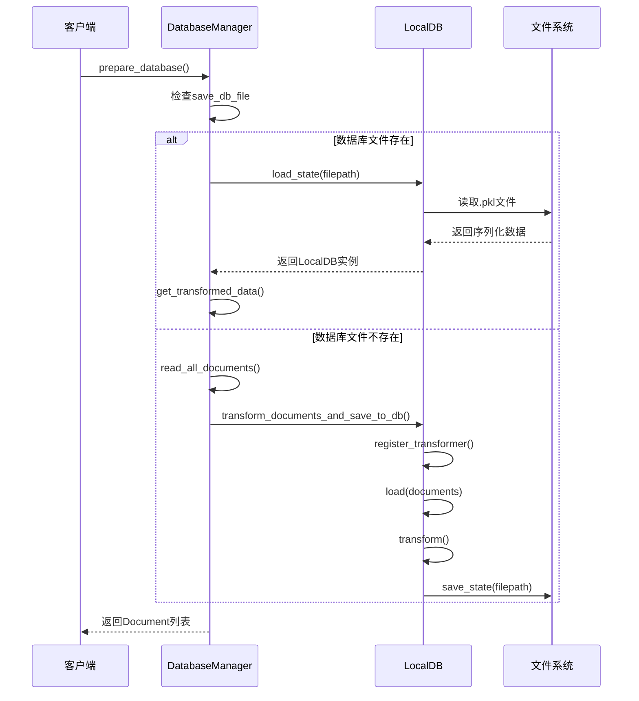

# 文档加载过程详细文档

<cite>
**本文档中引用的文件**
- [data_pipeline.py](file://api/data_pipeline.py)
- [embedder.py](file://api/tools/embedder.py)
- [config.py](file://api/config.py)
- [rag.py](file://api/rag.py)
- [websocket_wiki.py](file://api/websocket_wiki.py)
- [repo.json](file://api/config/repo.json)
- [embedder.json](file://api/config/embedder.json)
- [UserSelector.tsx](file://src/components/UserSelector.tsx)
</cite>

## 目录
1. [概述](#概述)
2. [核心架构](#核心架构)
3. [DatabaseManager详解](#databasemanager详解)
4. [文档读取机制](#文档读取机制)
5. [嵌入器配置](#嵌入器配置)
6. [文件过滤系统](#文件过滤系统)
7. [本地数据库管理](#本地数据库管理)
8. [性能优化策略](#性能优化策略)
9. [错误处理与调试](#错误处理与调试)
10. [总结](#总结)

## 概述

deepwiki-open项目实现了一个复杂的文档加载和处理系统，该系统能够从GitHub、GitLab或BitBucket仓库中下载源代码和文档文件，通过多种嵌入器进行向量化处理，并构建本地向量数据库以支持高效的检索功能。

系统的核心设计理念是：
- **多源仓库支持**：统一处理不同平台的代码仓库
- **灵活的文件过滤**：通过配置化的排除/包含规则控制处理范围
- **可插拔的嵌入器**：支持OpenAI、Google、Ollama等多种嵌入服务
- **性能优先**：通过本地缓存和增量更新提升效率

## 核心架构

**图表来源**
- [data_pipeline.py](file://api/data_pipeline.py#L703-L884)
- [rag.py](file://api/rag.py#L343-L372)

## DatabaseManager详解

DatabaseManager是整个文档加载系统的核心控制器，负责协调仓库下载、文档处理和数据库管理等关键流程。

### 类结构设计

**图表来源**
- [data_pipeline.py](file://api/data_pipeline.py#L703-L884)

### prepare_database方法流程

prepare_database方法是系统的主要入口点，它协调了整个文档加载过程：

**图表来源**
- [data_pipeline.py](file://api/data_pipeline.py#L713-L743)

**章节来源**
- [data_pipeline.py](file://api/data_pipeline.py#L713-L743)

### _create_repo方法实现

_create_repo方法负责下载和准备仓库目录结构，支持本地路径和远程仓库URL两种模式：

1. **路径规划**：确定仓库根目录和数据库文件路径
2. **仓库下载**：根据仓库类型（GitHub/GitLab/BitBucket）执行克隆操作
3. **权限处理**：支持访问令牌认证
4. **重复利用**：避免重复下载已存在的仓库

**章节来源**
- [data_pipeline.py](file://api/data_pipeline.py#L768-L817)

## 文档读取机制

read_all_documents函数是文档处理的核心，它递归扫描指定目录并读取所有符合条件的文件。

### 文件扫描策略

**图表来源**
- [data_pipeline.py](file://api/data_pipeline.py#L144-L371)

### 文件类型识别

系统按优先级处理不同类型的文件：

1. **代码文件优先**：`.py`, `.js`, `.ts`, `.java`, `.cpp`等编程语言文件
2. **文档文件次之**：`.md`, `.txt`, `.rst`, `.json`, `.yaml`等文档格式
3. **大小限制**：防止处理过大文件影响性能

### 过滤规则引擎

系统实现了灵活的文件过滤机制：

- **包含模式**：只处理明确指定的目录和文件
- **排除模式**：默认排除虚拟环境、版本控制、编译产物等
- **动态配置**：支持运行时修改过滤规则

**章节来源**
- [data_pipeline.py](file://api/data_pipeline.py#L144-L371)

## 嵌入器配置

系统支持多种嵌入器，通过配置化的方式实现灵活切换。

### 嵌入器类型映射

**图表来源**
- [embedder.json](file://api/config/embedder.json#L1-L34)
- [embedder.py](file://api/tools/embedder.py#L6-L55)

### 配置参数详解

每种嵌入器都有特定的配置参数：

| 嵌入器类型 | 默认模型 | 批处理大小 | 特殊参数 |
|-----------|---------|-----------|----------|
| OpenAI | text-embedding-3-small | 500 | dimensions: 256 |
| Google | text-embedding-004 | 100 | task_type: SEMANTIC_SIMILARITY |
| Ollama | nomic-embed-text | 单文档处理 | 无 |

**章节来源**
- [embedder.json](file://api/config/embedder.json#L1-L34)
- [embedder.py](file://api/tools/embedder.py#L6-L55)

### 动态选择机制

get_embedder函数根据配置自动选择合适的嵌入器：

1. **优先级判断**：embedder_type参数 > 环境变量 > 默认配置
2. **客户端初始化**：根据配置创建对应的客户端实例
3. **批处理优化**：为不同嵌入器选择最优的处理方式

**章节来源**
- [embedder.py](file://api/tools/embedder.py#L6-L55)

## 文件过滤系统

文件过滤系统提供了强大的文件处理控制能力，支持排除和包含两种模式。

### 默认过滤规则

系统预定义了全面的默认过滤规则：

#### 排除目录（DEFAULT_EXCLUDED_DIRS）
- 虚拟环境：`.venv/`, `node_modules/`, `.git/`
- 编译产物：`dist/`, `build/`, `target/`
- IDE配置：`.idea/`, `.vscode/`, `.eclipse/`
- 缓存文件：`__pycache__/`, `.pytest_cache/`

#### 排除文件（DEFAULT_EXCLUDED_FILES）
- 锁定文件：`yarn.lock`, `package-lock.json`, `Cargo.lock`
- 配置文件：`.env*`, `.gitignore`, `.prettierrc`
- 压缩文件：`*.zip`, `*.tar`, `*.gz`
- 临时文件：`*.tmp`, `*.log`, `*.cache`

**章节来源**
- [config.py](file://api/config.py#L263-L301)

### 过滤模式切换

**图表来源**
- [data_pipeline.py](file://api/data_pipeline.py#L226-L294)

### 用户自定义过滤

系统提供多种方式让用户自定义过滤规则：

1. **前端界面**：通过Web界面设置排除/包含规则
2. **API参数**：通过WebSocket API传递过滤参数
3. **URL查询**：通过URL参数传递过滤设置

**章节来源**
- [UserSelector.tsx](file://src/components/UserSelector.tsx#L136-L497)
- [websocket_wiki.py](file://api/websocket_wiki.py#L85-L96)

## 本地数据库管理

LocalDB类负责管理向量数据库的生命周期，包括加载、保存和数据转换。

### 数据库状态管理

**图表来源**
- [data_pipeline.py](file://api/data_pipeline.py#L842-L866)

### 数据转换流水线

transform_documents_and_save_to_db函数创建了完整的数据转换流水线：

1. **文本分割**：使用TextSplitter将长文档分割成适中的块
2. **向量化**：通过嵌入器将文本转换为向量表示
3. **持久化**：将处理后的数据保存到本地数据库

**章节来源**
- [data_pipeline.py](file://api/data_pipeline.py#L417-L441)

### 性能优化机制

系统实现了多种性能优化策略：

1. **增量加载**：只在数据库文件存在时才尝试加载
2. **内存管理**：及时释放不需要的数据结构
3. **批处理优化**：为不同嵌入器选择最优的批处理大小

## 性能优化策略

### 仓库下载优化

1. **智能检测**：检查仓库目录是否已存在且非空
2. **深度克隆**：使用`--depth=1`减少下载体积
3. **单分支克隆**：只克隆主分支提高速度

### 文档处理优化

1. **分批处理**：对大型文件进行分批处理
2. **大小限制**：设置最大token数量限制
3. **并行处理**：对不同文件类型采用不同的处理策略

### 内存使用优化

1. **流式处理**：避免一次性加载所有文件到内存
2. **及时清理**：处理完成后立即释放相关资源
3. **缓存策略**：合理利用本地缓存减少重复计算

## 错误处理与调试

### 异常处理层次

系统实现了多层次的异常处理机制：

1. **网络层**：处理GitHub/GitLab/BitBucket API调用异常
2. **文件层**：处理文件读取和写入异常
3. **业务层**：处理业务逻辑异常和数据验证

### 日志记录策略

系统采用分级日志记录：

- **DEBUG**：详细的执行流程信息
- **INFO**：重要的操作节点
- **WARNING**：潜在的问题但不影响整体流程
- **ERROR**：严重的错误需要关注

### 调试工具

1. **详细日志**：提供完整的执行轨迹
2. **状态检查**：定期检查系统状态
3. **性能监控**：监控关键操作的执行时间

## 总结

deepwiki-open的文档加载系统是一个设计精良、功能完备的解决方案，具有以下特点：

### 技术优势

1. **模块化设计**：清晰的职责分离和良好的抽象层次
2. **可扩展性**：支持多种嵌入器和文件过滤规则
3. **性能优化**：多层次的缓存和优化策略
4. **容错能力**：完善的异常处理和恢复机制

### 应用价值

1. **多平台支持**：统一处理GitHub、GitLab、BitBucket
2. **灵活配置**：支持细粒度的文件过滤控制
3. **高效检索**：基于向量的语义检索能力
4. **易于维护**：清晰的代码结构和完善的文档

### 发展方向

1. **性能提升**：进一步优化大文件处理和并发能力
2. **功能扩展**：支持更多类型的文件和数据源
3. **用户体验**：改进前端界面和交互体验
4. **生态集成**：与其他开发工具和服务的深度集成

这个系统为现代软件开发提供了强大的知识管理和智能检索能力，是构建智能开发环境的重要基础设施。