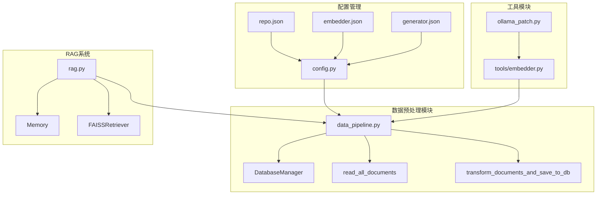
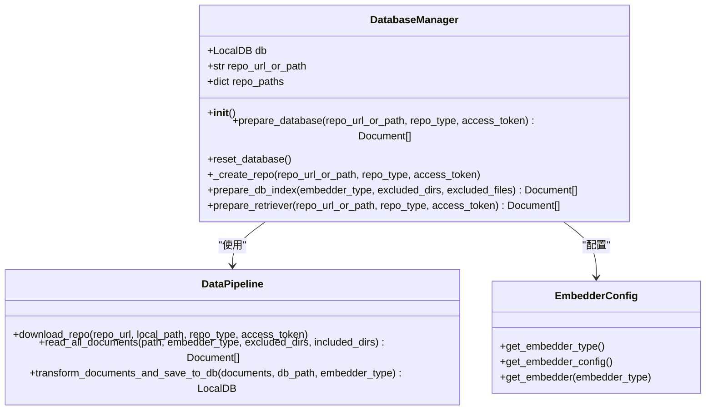
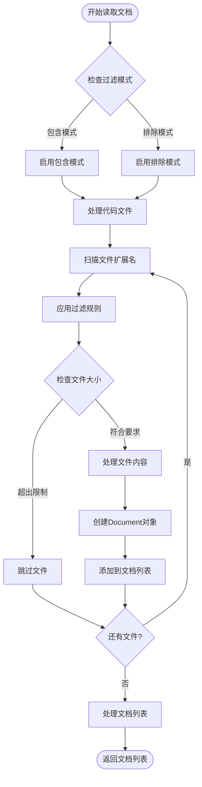
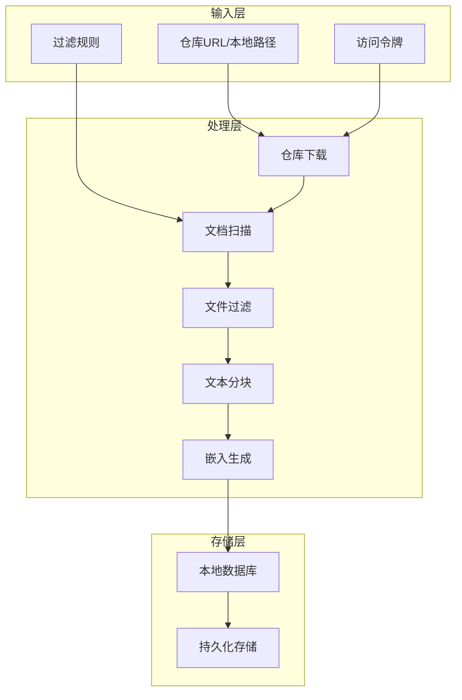
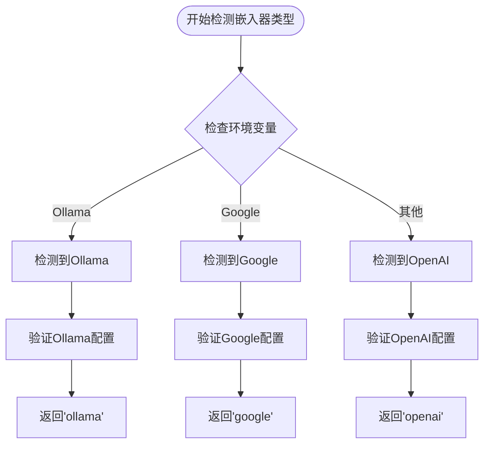
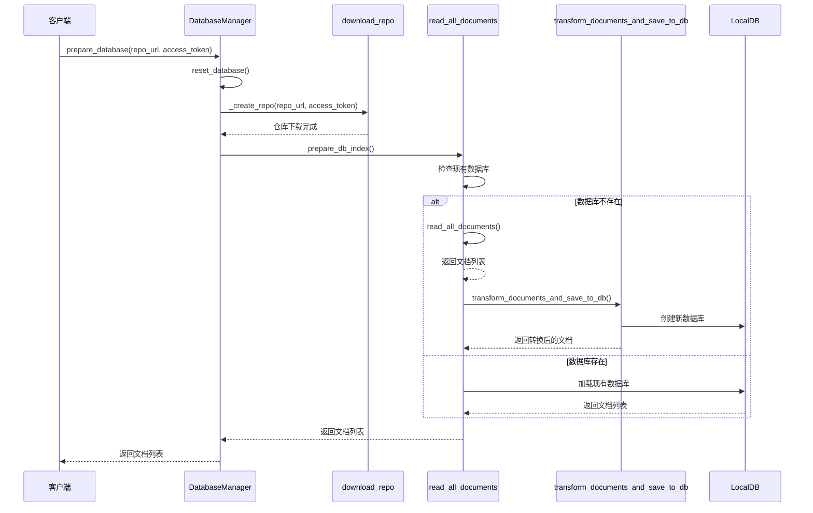
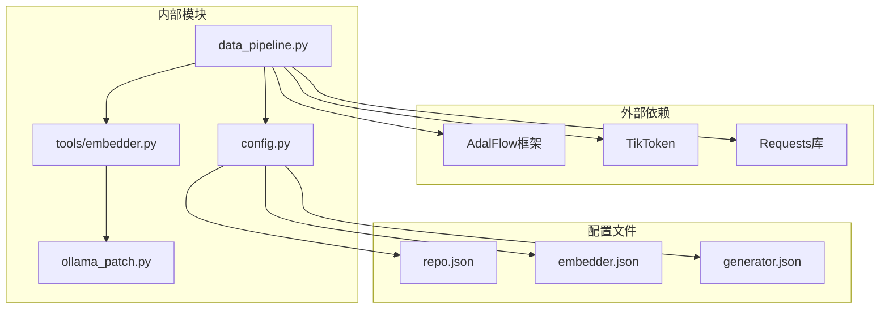

# 数据预处理

<cite>
**本文档中引用的文件**
- [data_pipeline.py](file://api/data_pipeline.py)
- [config.py](file://api/config.py)
- [embedder.py](file://api/tools/embedder.py)
- [rag.py](file://api/rag.py)
- [repo.json](file://api/config/repo.json)
- [embedder.json](file://api/config/embedder.json)
- [generator.json](file://api/config/generator.json)
- [ollama_patch.py](file://api/ollama_patch.py)
</cite>

## 目录
1. [简介](#简介)
2. [项目结构](#项目结构)
3. [核心组件](#核心组件)
4. [架构概览](#架构概览)
5. [详细组件分析](#详细组件分析)
6. [依赖关系分析](#依赖关系分析)
7. [性能考虑](#性能考虑)
8. [故障排除指南](#故障排除指南)
9. [结论](#结论)

## 简介

deepwiki-open的RAG系统数据预处理模块是一个高度集成的数据处理管道，负责从各种代码仓库中提取、过滤、转换和存储文档内容。该模块通过DatabaseManager类协调多个关键功能，包括仓库下载、文档读取、文本分块、嵌入向量生成和数据库持久化。

系统支持多种嵌入模型（OpenAI、Google、Ollama），能够处理GitHub、GitLab和BitBucket等不同类型的代码仓库，并提供了灵活的文件过滤机制来控制处理范围。

## 项目结构



**图表来源**
- [data_pipeline.py](file://api/data_pipeline.py#L1-L50)
- [config.py](file://api/config.py#L1-L50)
- [rag.py](file://api/rag.py#L1-L50)

**章节来源**
- [data_pipeline.py](file://api/data_pipeline.py#L1-L100)
- [config.py](file://api/config.py#L1-L100)

## 核心组件

### DatabaseManager类

DatabaseManager是数据预处理的核心协调器，负责管理整个数据处理流程的生命周期：



**图表来源**
- [data_pipeline.py](file://api/data_pipeline.py#L703-L886)
- [config.py](file://api/config.py#L160-L227)

### read_all_documents函数

该函数是文档读取的核心逻辑，实现了智能的文件扫描和过滤机制：



**图表来源**
- [data_pipeline.py](file://api/data_pipeline.py#L144-L371)

**章节来源**
- [data_pipeline.py](file://api/data_pipeline.py#L144-L371)

## 架构概览

数据预处理模块采用分层架构设计，确保了良好的可扩展性和维护性：



**图表来源**
- [data_pipeline.py](file://api/data_pipeline.py#L703-L886)
- [rag.py](file://api/rag.py#L345-L370)

## 详细组件分析

### 文档读取与过滤机制

#### 文件扩展名优先级

系统根据文件类型设置了不同的处理优先级：

| 文件类型 | 扩展名列表 | 处理优先级 | 特殊标记 |
|---------|-----------|-----------|----------|
| 代码文件 | `.py`, `.js`, `.ts`, `.java`, `.cpp`, `.go`, `.rs` | 高 | `is_code: true` |
| 文档文件 | `.md`, `.txt`, `.rst`, `.json`, `.yaml` | 中 | `is_code: false` |
| 实现文件判断 | 基于相对路径 | 中 | `is_implementation: true/false` |

#### 智能过滤规则

系统实现了两种过滤模式：包含模式和排除模式，支持灵活的文件选择策略。

**排除模式配置**：
- 默认排除目录：虚拟环境、版本控制、构建输出、IDE缓存等
- 默认排除文件：锁文件、编译产物、临时文件、配置文件等

**包含模式配置**：
- 用户指定的目录和文件模式
- 支持通配符匹配
- 灵活的组合规则

**章节来源**
- [data_pipeline.py](file://api/data_pipeline.py#L172-L371)
- [config.py](file://api/config.py#L262-L301)

### 嵌入模型动态适配

#### get_embedder_type函数

系统通过多层检测机制确定当前使用的嵌入模型类型：



**图表来源**
- [config.py](file://api/config.py#L215-L227)

#### 文本分块策略适配

不同嵌入模型采用不同的文本分块策略：

| 嵌入器类型 | 分块参数 | 批处理大小 | 特殊处理 |
|-----------|---------|-----------|----------|
| OpenAI | chunk_size: 350, overlap: 100 | 500 | 批量处理 |
| Google | chunk_size: 350, overlap: 100 | 100 | 批量处理 |
| Ollama | chunk_size: 350, overlap: 100 | 单文档处理 | 逐个处理 |

**章节来源**
- [config.py](file://api/config.py#L160-L227)
- [data_pipeline.py](file://api/data_pipeline.py#L373-L415)

### 仓库访问令牌配置

#### GitHub私有仓库访问

```bash
# GitHub个人访问令牌配置
export DEEPWIKI_AUTH_MODE=true
export DEEPWIKI_AUTH_CODE="your_github_token_here"
```

#### GitLab私有仓库访问

```bash
# GitLab个人访问令牌配置
export GITLAB_ACCESS_TOKEN="your_gitlab_token_here"
```

#### BitBucket私有仓库访问

```bash
# BitBucket个人访问令牌配置
export BITBUCKET_ACCESS_TOKEN="your_bitbucket_token_here"
```

**章节来源**
- [data_pipeline.py](file://api/data_pipeline.py#L69-L139)

### 数据库准备流程

#### prepare_database方法

DatabaseManager的prepare_database方法协调了完整的数据准备流程：



**图表来源**
- [data_pipeline.py](file://api/data_pipeline.py#L713-L743)
- [data_pipeline.py](file://api/data_pipeline.py#L819-L869)

**章节来源**
- [data_pipeline.py](file://api/data_pipeline.py#L713-L886)

## 依赖关系分析

### 核心依赖图



**图表来源**
- [data_pipeline.py](file://api/data_pipeline.py#L1-L20)
- [config.py](file://api/config.py#L1-L20)

### 配置依赖关系

系统配置采用层次化设计，支持环境变量覆盖和文件配置：

| 配置层级 | 优先级 | 示例配置项 | 用途 |
|---------|-------|-----------|------|
| 环境变量 | 最高 | `DEEPWIKI_EMBEDDER_TYPE` | 嵌入器类型 |
| 文件配置 | 中等 | `embedder.json` | 模型参数 |
| 默认值 | 最低 | 内部常量 | 回退配置 |

**章节来源**
- [config.py](file://api/config.py#L66-L95)
- [embedder.json](file://api/config/embedder.json#L1-L34)

## 性能考虑

### Token计数优化

系统实现了多层次的Token计数机制来优化性能：

1. **精确计算**：使用tiktoken库进行准确的Token计数
2. **回退机制**：当tiktoken失败时使用字符数估算
3. **阈值控制**：针对不同嵌入器设置合适的Token上限

### 并发处理策略

- **批量处理**：OpenAI和Google嵌入器支持批量处理
- **单文档处理**：Ollama嵌入器采用单文档处理避免内存问题
- **进度监控**：使用tqdm提供处理进度反馈

### 内存管理

- **流式处理**：大文件采用流式读取避免内存溢出
- **分块加载**：大型文档按块加载和处理
- **垃圾回收**：及时释放不再需要的中间结果

## 故障排除指南

### 常见问题及解决方案

#### 仓库克隆失败

**问题症状**：访问私有仓库时认证失败
**解决方案**：
1. 检查访问令牌的有效性
2. 验证仓库URL格式正确性
3. 确认网络连接状态

#### 嵌入生成错误

**问题症状**：文档处理过程中出现嵌入生成异常
**解决方案**：
1. 检查嵌入模型可用性
2. 验证API密钥配置
3. 调整批处理大小

#### 文件过滤不生效

**问题症状**：指定的文件或目录未被正确过滤
**解决方案**：
1. 检查过滤规则语法
2. 验证文件路径格式
3. 确认过滤模式设置

**章节来源**
- [data_pipeline.py](file://api/data_pipeline.py#L132-L139)
- [ollama_patch.py](file://api/ollama_patch.py#L21-L60)

## 结论

deepwiki-open的RAG系统数据预处理模块展现了现代AI应用中数据处理的最佳实践。通过DatabaseManager的统一协调，系统实现了从仓库克隆到文档索引的完整自动化流程。

### 主要优势

1. **灵活性**：支持多种嵌入模型和代码仓库类型
2. **可扩展性**：模块化设计便于功能扩展
3. **可靠性**：完善的错误处理和恢复机制
4. **性能**：优化的Token管理和并发处理

### 技术特色

- 智能的文件过滤和优先级处理
- 动态的嵌入模型适配
- 灵活的配置管理系统
- 强大的错误恢复能力

该模块为deepwiki-open提供了坚实的数据基础，支撑了高质量的RAG问答系统运行。